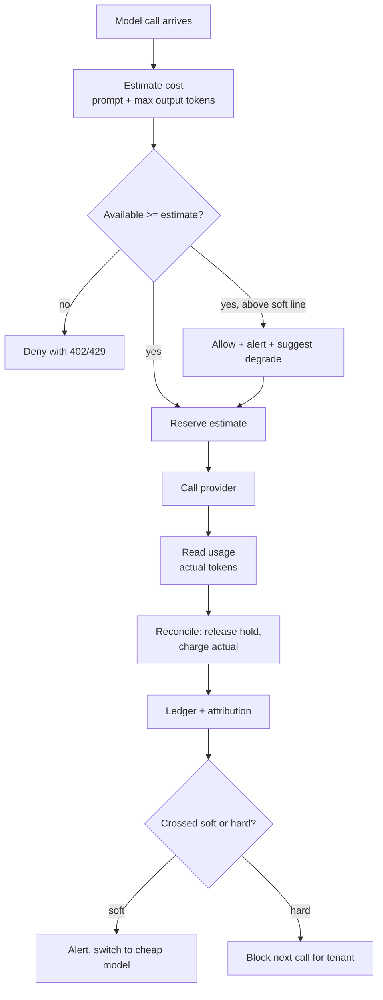

# Token Quotas and Cost Budgets

> **Interview answer (say this first).** A token quota caps how many tokens or requests a tenant may consume over a long window, such as a day or a month. A cost budget caps how much money a tenant, model, or agent run may spend. Because a single agent call can cost thousands of times more than a simple one, request limits alone are not enough: you must meter tokens and money. The reliable pattern is to estimate the cost before the call, reserve it against the budget, run the call, then reconcile the reservation with the provider's reported usage. Soft limits warn and degrade; hard limits refuse. Budgets are not rate limits — a rate limit protects short-term capacity, a budget protects long-term spend.

## Why this exists

The economics of AI are different from ordinary APIs. A health check costs almost nothing; a single agent run with a large context, several tool calls, and a long answer can cost real money. The cost is proportional to tokens, and tokens are invisible in a normal request log.

Four things go wrong without budgets:

1. **The runaway agent.** A loop that never terminates calls a paid model until someone notices the bill. Request rate limiting does not stop it, because each request is allowed and each one is expensive.
2. **The noisy tenant.** One customer runs batch workloads that consume the entire monthly provider allowance. Everyone else is throttled or the shared bill explodes.
3. **The surprise invoice.** Finance sees a number no one predicted. There was no per-team attribution, so nobody can explain it.
4. **The shared-key failure.** All tenants share one provider account. One tenant's spike trips the provider limit for everyone.

Budgets fix all four by making spend visible, attributable, and enforceable. A quota answers "how much may this tenant use?" A budget answers "how much may this tenant spend, and what happens when they reach the line?"

Budgets also change behaviour, not just accounting. Once a team can see spend per feature and per agent, they make different choices: shorter prompts, a cheap model for a simple classification step, and caching for repeated questions. A budget published as a dashboard is a feedback loop; a budget hidden in a finance spreadsheet is just a surprise waiting to happen.

> **Note:** A budget is a *promise about a long window*. A rate limit is a *guard on a short window*. You need both: the rate limit stops a burst from melting capacity, the budget stops a slow drip from emptying the account.

## Start from zero

| Word | Plain meaning |
| --- | --- |
| **Token** | The unit models read and write; roughly a word piece. Every token costs money. |
| **Prompt tokens** | Tokens in the input you send. |
| **Completion tokens** | Tokens in the model's output. |
| **Usage** | The provider's report of prompt and completion tokens for a call. |
| **Quota** | A cap on consumption over a long window: tokens, requests, or dollars. |
| **Budget** | A money limit, usually per tenant, model, or feature, over a period. |
| **Soft limit** | A threshold that warns and degrades but still allows work. |
| **Hard limit** | A threshold that refuses work. |
| **Reservation** | Holding estimated cost against a budget before the call runs. |
| **Reconciliation** | Adjusting the reservation to the real cost after the call. |
| **Pre-charge** | Charging before the call; safe against overspend, but only an estimate. |
| **Post-charge** | Charging after the call; exact, but too late to prevent the spend. |
| **Cost attribution** | Tagging spend to a tenant, team, feature, or agent run. |
| **Chargeback** | Billing internal teams for the spend they caused. |
| **Showback** | Reporting spend without transferring cost. |
| **Graceful degradation** | Falling back to a cheaper path when a limit is near. |
| **Anomaly** | Spend far above the normal pattern for a tenant. |
| **Period** | The budget window: daily, monthly, or per run. |
| **Ledger** | The append-only record of reservations, charges, and refunds. |
| **Estimated cost** | Predicted spend from token estimates and a price table. |

Two distinctions that cause the most confusion:

- **Quota vs rate limit.** A rate limit is per second or per minute and protects capacity. A quota is per day or per month and protects the wallet. A caller can be well under every rate limit and still blow the budget.
- **Pre-charge vs post-charge.** Pre-charge prevents overspend but is approximate. Post-charge is exact but cannot prevent what already happened. Production uses pre-charge with reservation, then post-charge to correct the books.

## The core idea

Think of a corporate expense card. When you are about to buy something, the bank checks your remaining limit and *holds* the amount. The hold is not the final charge; it is a reservation. Later the merchant settles the real amount, and the hold converts into a charge. If your remaining limit is too small, the card is declined before you spend.

The budget ledger works exactly like that:



A simple cost formula is the arithmetic the whole chapter rests on:

```text
cost = prompt_tokens/1e6 * input_price_per_million
     + completion_tokens/1e6 * output_price_per_million
```

Output tokens usually cost several times more than input tokens, which is why `max_tokens` is a budget control, not just a latency control.

The formula prices one call. An agent run is many calls plus tool overhead, so the run cost is the sum over the loop, and a single bad step can dominate it. That is why a per-run cap is a separate control from the per-call estimate: it bounds the sum, not the term.

Here is how the limit types compare:

| Limit type | Window | Protects | Typical response |
| --- | --- | --- | --- |
| **Rate limit** | seconds | Capacity | `429` + `Retry-After` |
| **Token quota** | day / month | Fair usage | Deny or degrade |
| **Request quota** | day / month | Fair usage | Deny |
| **Cost budget** | day / month / run | Money | Soft alert, then hard deny |
| **Agent-run cap** | per run | Worst case | Stop the loop |

When several limits apply, the most restrictive one wins. A request passes only if it is inside the per-run cap, under the per-model cap, and within the tenant budget. Check them from cheapest to most expensive: a per-run counter can live in memory, while the tenant budget is a shared atomic operation. The per-call estimate is the arithmetic, but the per-run and per-model caps are what bound the surprises.

## How it works

1. **Define the budget dimensions.** Decide what a budget is per: tenant is the default; add model and feature so you can cap an expensive model separately; add per-agent-run so a single loop cannot run away.
2. **Estimate the cost before the call.** Prompt tokens can be estimated from the request; completion tokens are bounded by `max_tokens`. Multiply by the price table for the chosen model.
3. **Reserve the estimate atomically.** In a shared store, add the estimate to the tenant's reserved total only if `spent + reserved + estimate <= limit`. This single atomic check is what prevents two concurrent calls from both passing.
4. **Apply the soft threshold.** If the reservation pushes usage past the soft line, still allow the call, but emit an alert and optionally degrade — for example, route to a cheaper model or lower `max_tokens`.
5. **Run the call.** This is the only step that spends real money.
6. **Read the usage.** The provider returns prompt and completion token counts. Use those, not your estimate.
7. **Reconcile.** Release the reservation and add the actual cost to `spent`. If actual is higher than estimated, the difference is charged now and counts against the next call.
8. **Correct for missing usage.** If the provider returns no usage (some streams, some errors), fall back to the estimate and mark the record as approximate.
9. **Attribute the cost.** Write one ledger row per call: tenant, key, model, feature, agent run id, tokens, cost, and timestamp. This row is what makes chargeback possible.
10. **Enforce the hard limit on the next request.** A hard limit that is crossed after the call blocks the *next* call. This is the fundamental limitation of post-charge, and it is why pre-charge reservation exists.
11. **Alert and degrade.** Emit alerts at the soft line and at the hard line, and have a defined degraded path: cheaper model, shorter context, or a clear refusal.
12. **Reset the period.** At the period boundary, roll `spent` into history and reset the counter. Keep the history for reporting and for anomaly detection.

The ordering is the whole design. Estimation and reservation happen before the spend. Reconciliation makes the books exact after it. Neither step alone is sufficient.

## The syntax you will use

**A budget is a row with a window and thresholds.** Store it in the database so it can change without a deploy.

```python
@dataclass
class TenantBudget:
    limit: float          # dollars for the period
    soft_ratio: float = 0.8
    spent: float = 0.0
    reserved: float = 0.0

    def available(self) -> float:
        return self.limit - self.spent - self.reserved
```

`reserved` is the key field. Without it, concurrent calls all read the same free space and all pass.

**Reserve before the call, reconcile after it.** The reservation is a hold; reconciliation turns it into a real charge.

```python
res = ledger.reserve("acme", estimate=2.00)   # holds $2.00 or raises
response = call_model(...)                    # real spend happens here
ledger.reconcile(res, actual=response.cost)   # release hold, charge actual
```

If `reserve` raises, the call never runs and no money is spent.

**Estimate from the request.** Tokenizers differ, so an approximation with a safety margin is normal before the call.

```python
prompt_tokens = estimate_tokens(prompt)      # ~4 chars/token for English
max_output = request.max_tokens or 512
estimate = (prompt_tokens * price_in + max_output * price_out) / 1e6
```

For a budget check, over-estimating is safe: it fails closed.

**Read real usage from the provider.** Both OpenAI and Bedrock expose token counts on the response.

```python
usage = response.usage                   # OpenAI-style
prompt_tokens = usage.prompt_tokens
completion_tokens = usage.completion_tokens

# Bedrock Converse returns usage under a different key
usage = response["usage"]                # {"inputTokens": ..., "outputTokens": ...}
```

Always derive cost from the provider's usage, not from your own tokenizer.

**A price table keeps cost in one place.** Prices change; callers should never hard-code them.

```python
PRICES = {   # dollars per 1M tokens (input, output)
    "gpt-4o-mini": (0.15, 0.60),
    "gpt-4o":      (2.50, 10.00),
    "local-llama": (0.00, 0.00),
}
```

**Redis can hold the atomic check-and-reserve.** A Lua script makes the read-modify-write one step.

```lua
-- KEYS[1] budget key; ARGV: estimate, limit, soft_ratio
local spent = tonumber(redis.call('HGET', KEYS[1], 'spent') or '0')
local held  = tonumber(redis.call('HGET', KEYS[1], 'reserved') or '0')
local est   = tonumber(ARGV[1])
if spent + held + est > tonumber(ARGV[2]) then
  return {0, spent, held}         -- deny
end
redis.call('HINCRBYFLOAT', KEYS[1], 'reserved', est)
return {1, spent, held + est}     -- allow
```

The script returns the decision and the current totals, so the caller can alert on the soft threshold in the same round trip.

**Return a clear status on denial.** A budget refusal is not a rate limit; tell the caller which one it is.

```python
from fastapi import HTTPException

raise HTTPException(
    status_code=402,                      # payment required: budget exhausted
    detail={"error": "budget_exceeded", "scope": "tenant:acme", "limit": "monthly"},
)
```

Using `402` for budget and `429` for rate lets clients back off differently.

**One ledger row per call is the unit of attribution.** This is what a dashboard, an invoice, and an anomaly rule all read.

```json
{
  "ts": "2026-09-13T10:22:01Z",
  "tenant": "acme",
  "key_id": "sk_live_acme_7f3a",
  "feature": "support-agent",
  "run_id": "run_9f2c",
  "model": "gpt-4o-mini",
  "prompt_tokens": 1420,
  "completion_tokens": 220,
  "cost_usd": 0.000345,
  "cache_hit": false,
  "reconciled": true
}
```

`reconciled: false` flags an estimated charge from a missing usage report, which is exactly what makes the books drift.

## Examples: simple to real

**Example 1 — reserve, run, reconcile.** A $2.00 hold is placed, the real cost is $1.50, and the difference is released. The ledger now shows accurate spend.

```text
after call 1: spent=1.5 reserved=0.0 available=8.5
```

**Example 2 — reservation prevents concurrent overspend.** A second call holds $8.00 while in flight. A third call asks for $1.00, but only $0.50 is free, so it is denied before it runs.

```text
while r2 held: available=0.5
third call denied before it ran: cost budget
```

Without the reservation, both calls would have read $8.50 free and both would have passed.

**Example 3 — the estimate was too low.** The real cost comes back at $8.90 instead of $8.00. Reconciliation charges the difference, and the tenant is now over the hard limit.

```text
after call 2: spent=10.4 available=-0.4
next call denied by hard limit: cost budget
```

This is why post-charge matters: it keeps the books honest even when the estimate is wrong.

**Example 4 — the soft threshold warns before the hard limit.** At 80% of the budget the gateway alerts and can degrade to a cheaper model, so the tenant is not surprised by a sudden refusal.

```text
events:
  - acme: cost budget soft threshold crossed (8.0/10.0): alert + switch to cheap model
  - acme: hard limit exceeded (10.4/10.0); block next call
  - acme: cost budget would be exceeded, denied before call
```

**Example 5 — a request quota is a separate axis.** A tenant can be far under its cost budget and still be blocked by a per-period request cap, which matters for high-volume, low-cost traffic.

```text
request quota blocks even a cheap call: request quota
```

**Example 6 — per-run and per-model caps close the gaps.** A monthly tenant budget does not stop one runaway agent run in an afternoon. Add a per-run cap and a per-model cap, and check all three before the call.

```text
monthly tenant:  $1000
per agent run:   $2
per expensive model: 30% of monthly
```

The most restrictive check wins, and each one catches a different failure.

## In production

- **Reserve before, reconcile after, and make the check atomic.** Pre-charge alone over- or under-estimates; post-charge alone cannot prevent overspend, so you need both. The reservation itself must be one atomic operation in Redis or the database, because a read-then-write in application code lets concurrent calls both pass.
- **Overestimate on purpose.** For a budget check, a high estimate fails closed and protects the wallet. Tune the margin once you have real token data.
- **Reconcile even on failure.** A timed-out call may still be billed, and a cancelled stream still produced tokens. Record partial and estimated costs rather than losing them.
- **Set `max_tokens` as a budget control.** Output tokens are the expensive ones. A sane output cap converts an unbounded cost into a bounded one.
- **Add a per-agent-run cap.** Agent loops are the classic runaway. A run-level budget stops the loop even when the tenant still has monthly room.
- **Use soft limits to degrade, not to fail.** When a tenant crosses the soft line, route to a cheaper model, shrink context, or disable expensive tools before you refuse.
- **Fail closed on the hard limit, and say why.** A `402` with the scope and reset date is better than a generic error. Give the tenant a path to raise the limit.
- **Attribute every call, and keep history.** One ledger row with tenant, feature, model, and run id makes chargeback and anomaly detection possible; untagged spend is undebuggable. Period rollover must be idempotent or a retry can double-charge, and history is what lets you answer "why was this month expensive?"
- **Reconcile against the provider invoice.** Your ledger will drift from the real bill because of retries, cached calls, and billing timing. Compare monthly and explain the gap in writing.
- **Watch for the caching double-count.** A cache hit must not be charged the full provider cost, or attribution inflates and customers dispute it. Charge a small platform fee or nothing, and label the cache hit.
- **Separate budgets from rate limits in code, status, and alerts.** They protect different things and fail differently. A `402` budget refusal means someone should look at spend; a `429` rate limit usually means capacity.
- **Give tenants visibility.** A usage dashboard and budget alerts turn a surprise invoice into a predictable line item. Most overspend is a communication failure, not a malicious one.

## Interview questions

### 1. Why are cost budgets different from rate limits?

**Answer.** They guard different resources over different windows. A rate limit is per second or minute and protects short-term capacity, so it stops bursts. A budget is per day or month and protects money, so it stops slow, sustained overspend. A caller can obey every rate limit and still spend far too much, especially with expensive models. You need both, and you should alert on them separately.

**Follow-up: "Can a rate limit substitute for a budget?"** No. A per-second token limit cannot stop a job that runs slowly all month, and a request limit cannot see that one request costs a hundred times another.

**Trap.** Treating the two as one setting. A `429` and a budget refusal mean different things and should have different status codes and different runbooks.

### 2. What does it mean to enforce a budget before versus after the call?

**Answer.** Before the call you can only estimate, so you reserve an amount and refuse if the reservation would exceed the limit — this prevents overspend but is approximate. After the call you know the exact usage, so you reconcile and charge the real amount — this is accurate but happens too late to prevent the spend. Production does both: reserve before, reconcile after.

**Follow-up: "What if the call fails?"** You still release the reservation, and you charge an estimated partial cost if the provider may have billed you, such as a timeout mid-generation. Never leave a reservation stranded, or free budget slowly disappears.

**Trap.** Only checking after the call and calling it a budget. That is spend reporting, not enforcement.

### 3. How do reservations and reconciliation work together?

**Answer.** A reservation holds estimated cost against the budget so concurrent calls cannot both spend the same free space. When the call finishes, reconciliation releases the hold and adds the provider's actual cost. If the actual is larger, the extra is charged immediately; if smaller, the difference frees up. The ledger stays exact while the pre-call check stays safe.

**Follow-up: "How do you avoid leaked reservations?"** Give each reservation an id and a TTL, and expire holds that were never reconciled by a cleanup job that charges the estimate. An unreconciled hold is indistinguishable from spend, so it must not live forever.

**Trap.** Deducting `spent` before the call and then never adjusting. That overcharges cheap calls and hides the true cost profile.

### 4. What is the difference between a soft limit and a hard limit?

**Answer.** A soft limit is a warning threshold, usually around 80%, that still allows work but triggers alerts and graceful degradation. A hard limit refuses work. Soft limits preserve trust and give time to react; hard limits guarantee the cap. A tenant should feel the soft limit as "your usage is high, we switched you to a cheaper model" long before the hard limit ends service.

**Follow-up: "Who should be allowed to raise a hard limit?"** A human with authority, through an audited path. Auto-raise defeats the cap. Break-glass access is fine if it is logged and reviewed.

**Trap.** Setting the soft limit at 100%. Then the first warning is also the refusal, which is the worst possible user experience.

### 5. How do you attribute cost and implement chargeback?

**Answer.** Write one ledger row per model call with tenant, API key, feature, model, agent run id, token counts, and computed cost. Tag requests at the edge so attribution does not depend on the gateway guessing. Aggregate by tenant and feature for showback or chargeback. Reconcile the total against the provider invoice monthly and explain the difference.

**Follow-up: "What makes attribution hard?"** Shared resources: cache hits, retries, embeddings, and batch jobs that serve many tenants. Decide an allocation rule for each and document it.

**Trap.** Attributing by API key alone. Keys get shared, copied, and rotated, so tenant identity must be part of the authenticated context, not inferred from the key.

### 6. How do you handle a tenant that suddenly spikes?

**Answer.** Detect it with an anomaly rule compared to their own baseline, not a global threshold. Then apply the plan you wrote in advance: alert the tenant, degrade to a cheaper model, lower concurrency, and if it continues, hit the hard limit. Investigate whether it is a legitimate launch, a bug, or abuse, and adjust the budget deliberately.

**Follow-up: "Why compare to the tenant's own baseline?"** Tenants have very different normal volumes. A global threshold either misses small tenants' anomalies or fires constantly for large ones.

**Trap.** Cutting off a paying customer's production traffic without warning. Always give the soft-limit warning and a degraded mode first.

### 7. Why a per-agent-run budget when you already have a tenant budget?

**Answer.** Because recovery time matters. A tenant monthly budget may have plenty of room, but an agent stuck in a loop can burn a large fraction of it in minutes. A per-run cap bounds the worst case of one execution and stops the loop early, while the tenant budget bounds the month.

**Follow-up: "How do you pick the per-run number?"** From the observed distribution of successful runs: set it well above p99 but far below the monthly budget, and tune it against real run traces.

**Trap.** Relying only on step limits. A single step with a huge context can cost more than many small steps, so a step count is not a cost bound.

### 8. What are the failure modes of budget enforcement?

**Answer.** Leaked reservations that never reconcile; non-atomic checks that let concurrent calls overspend; drifted prices so the ledger disagrees with the invoice; missing usage on streamed or failed calls; cache hits double-charged; clock or timezone bugs at period rollover; and a fallback model with a different price that the estimate ignored. Each needs an owner, a test, and a reconciliation.

**Follow-up: "How do you test it?"** Unit-test the ledger arithmetic, load-test concurrent reservations, and run a monthly reconciliation against provider invoices. Inject a missing-usage response and assert the fallback path.

**Trap.** Assuming the estimate equals the charge. It almost never does, which is why reconciliation exists.

## Remember this

- **Rate limits protect capacity; budgets protect money.** Different windows, different responses.
- **Reserve before the call, reconcile after it.** One gives safety, the other gives accuracy.
- **Make the check atomic.** Otherwise concurrent calls all spend the same free space.
- **Soft limits degrade, hard limits refuse.** Warn long before you cut service.
- **Attribution is a ledger row per call.** Tag tenant, feature, model, and run; reconcile against the invoice.
