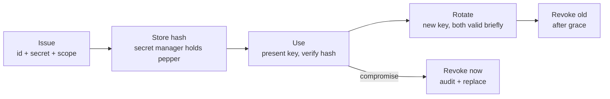

# API Keys and Secrets Management

> **Interview answer (say this first).** An API key is a credential that identifies a caller and carries its permissions. Good key management has a full lifecycle: issue with a unique prefix and a scope, store only a hash at rest, rotate on a schedule, and revoke immediately when compromised. Secrets — model provider keys, database passwords, signing keys — belong in a secret manager such as Vault or AWS Secrets Manager, not in code, not in environment variables checked into a repo, and never in logs. The strongest posture is short-lived, dynamically issued credentials tied to an identity, so a leaked credential expires on its own. Rotation must be designed for zero downtime: issue the new key, let both work during a grace window, shift traffic, then revoke the old one.

## Why this exists

Almost every incident write-up involving an AI platform eventually reaches the same sentence: "the key was in the environment, and it leaked." Keys are the most valuable and most abused asset in the system. A leaked model provider key is immediate money; a leaked database password is a data breach; a leaked internal API key is lateral movement.

Three problems make this hard:

1. **Keys are duplicated.** The same provider key gets pasted into a notebook, a CI secret, a staging container, and a developer laptop. Revoking one place does not revoke the others.
2. **Keys are long-lived.** A key issued at launch can still be valid years later, long after the person who made it left. There is no expiry, so nobody revisits it.
3. **Keys are logged.** A debug line prints the whole request, including the `Authorization` header. Now the credential lives in log storage, which is usually far less protected than a secret manager.

A key is also a *permission*, not just a password. It decides which tenant, which models, and which tools the caller may use. That makes key design part of authorization: a key issued for embeddings should not be able to run an expensive agent.

API key and secret management is the discipline that removes those three problems: one place to issue, one place to store, one place to revoke, and a clear rule that the raw secret exists only at the moment of creation.

> **Note:** A secret is not configuration. Configuration is safe to read in a pull request. A secret must never be readable by anyone who does not already have a legitimate reason to use it.

## Start from zero

| Word | Plain meaning |
| --- | --- |
| **API key** | A string a caller presents to prove identity and carry permissions. |
| **Secret** | Any sensitive value: a provider key, a password, a signing key, a token. |
| **Key id** | A public, non-secret identifier used to look up a key record. |
| **Prefix** | A short, visible start of a key, such as `sk_live_acme`, used for lookup and scanning. |
| **Scope** | The permissions a key carries, such as `chat:invoke` or `embeddings:read`. |
| **Hashing** | One-way transformation; the stored value cannot be turned back into the key. |
| **Pepper** | A server-side secret added before hashing, so a database dump alone cannot verify keys. |
| **Salt** | A per-record random value added before hashing low-entropy secrets to stop precomputed attacks. |
| **Constant-time compare** | A comparison that does not leak information through how long it takes. |
| **Rotation** | Replacing a key with a new one while the old one is retired. |
| **Grace period** | A window when both old and new keys work, so callers can migrate. |
| **Revocation** | Making a key invalid immediately. |
| **Secret manager** | A dedicated service that stores, controls access to, and audits secrets. |
| **Dynamic secret** | A credential generated on demand with a short lifetime, such as a 15-minute DB user. |
| **Least privilege** | Granting the smallest permission set that lets the work succeed. |
| **Environment variable** | Process configuration; convenient, but readable by the process and often leaked. |
| **KMS** | Key Management Service; a managed service for encryption keys. |
| **Envelope encryption** | Encrypting data with a data key, and that data key with a master key. |
| **OIDC** | OpenID Connect; lets CI prove its identity and get a short-lived cloud credential. |
| **Redaction** | Removing or masking secrets before anything is written to logs. |
| **Audit log** | A tamper-evident record of who issued, used, rotated, or revoked a secret. |

Two distinctions to hold firmly:

- **Authentication vs authorization.** The key proves *who* the caller is (authentication). Scopes decide *what* they may do (authorization). A valid key with no scope should still be refused.
- **Secret vs config.** A model name, a timeout, a feature flag: config. A provider key, a password, a private key: secret. Mixing them is how secrets end up in a public repo.

## The core idea

Picture a hotel. At check-in you get one key card. It is valid for specific doors, it expires at checkout, and if you lose it the front desk deactivates it in one action. You never get a master key, and the card number is not written on the door.

An API key should behave the same way:



The critical design choice is **what you store**. You must be able to verify a presented key, but you must not be able to recover it. That means store a hash, exactly like a password.

```text
raw key      = sk_live_acme_7f3a2b1c.<random-secret>   (shown once)
stored record = { key_id, sha256(raw_key + pepper), tenant, scopes, revoked }
```

The hash covers the **whole presented key** (id plus secret) plus the pepper. Anyone who steals the database gets hashes, not usable keys. If the pepper lives in a secret manager, an attacker needs both the database and the secret manager to verify a guess.

A per-record salt is not needed here. The secret half of the key is 24 bytes of CSPRNG output, so a precomputed or rainbow-table attack against `sha256(raw_key + pepper)` is infeasible; salts matter for low-entropy secrets such as human passwords, where guessing the input is cheap. For a high-entropy machine key the pepper alone is the load-bearing control.

Compare the storage options:

| Option | Verify possible? | Recoverable if leaked? | Verdict |
| --- | --- | --- | --- |
| **Plaintext in DB** | Yes | Yes | Never |
| **Reversible encryption** | Yes | Yes, with the key | Only for provider keys you must replay |
| **Hash + pepper** | Yes | No | Default for your own API keys |
| **Dynamic short-lived token** | Yes, by the issuer | Briefly | Best, but more machinery |

Provider keys (which you must send onward to OpenAI) cannot be hashed; they must be encrypted or fetched from a secret manager at use time. Your own customer-facing keys should be hashed.

The second rule follows from the first: **the raw secret exists once, at creation, and then only in the caller's secure store.** If you can look it up in a dashboard later, so can an attacker. This is why a well-built key management system can never show you a key again — it can only show you the key id, its scope, and when it was last used.

## How it works

1. **Issue with a structured format.** Generate a random secret, combine it with a visible key id and prefix, and return the whole string once. Store only the id and the hash.
2. **Scope the key.** Attach the permissions the caller needs and nothing more: `chat:invoke`, `embeddings:read`, `key:rotate`. Scope at issue time so the blast radius is known.
3. **Store the hash.** Use a strong hash with a server-side pepper. Keep the pepper in the secret manager, not the database.
4. **Authenticate in constant time.** Split the presented key to get the key id, look it up, hash the whole presented key with the pepper, and compare with `hmac.compare_digest`. Never compare with `==` on secrets.
5. **Authorise by scope.** After identity is established, check that the required scope is present. A missing scope is a clean permission error, not an authentication failure.
6. **Rotate on a schedule and on demand.** Issue a new key for the same identity, mark the old one as `rotating`, and give callers a grace window to switch.
7. **Revoke after grace, or immediately on compromise.** Revocation sets the record's `revoked` flag; the verify path rejects it at once. Keep the record for the audit trail.
8. **Fetch provider secrets at use time.** The gateway reads the provider key from the secret manager (with caching and a TTL) rather than baking it into the image.
9. **Prefer dynamic, short-lived credentials.** For databases and cloud roles, have the secret manager generate a credential with a short TTL so a leak expires quickly.
10. **Redact before logging.** Wrap headers and payloads in a redaction layer. Log the key id, never the secret.
11. **Audit every action.** Record who issued, used, rotated, and revoked each key, with time, actor, and source. An audit log is what lets you answer "was this key used after we revoked it?"
12. **Respond to compromise with a checklist.** Revoke, find every copy, issue a replacement, check the audit log for misuse, and write the timeline. Speed matters more than elegance.

## The syntax you will use

**Issue a key and store only its hash.** The raw string is returned to the caller once and never stored.

```python
import hashlib, hmac, secrets

PEPPER = "..."                     # loaded from the secret manager at runtime
store: dict[str, dict] = {}        # key_id -> record, the persistent store

def issue(tenant: str, scopes: list[str]) -> tuple[str, dict]:
    key_id = f"sk_live_{tenant}_{secrets.token_hex(4)}"
    raw = f"{key_id}.{secrets.token_urlsafe(24)}"
    record = {
        "key_id": key_id,
        "key_hash": hashlib.sha256((raw + PEPPER).encode()).hexdigest(),
        "tenant": tenant,
        "scopes": frozenset(scopes),
        "revoked": False,          # flipped by revoke(); read by authenticate()
    }
    return raw, record            # return raw once; persist only record
```

The prefix makes a leaked key searchable in code scanning and logs.

**Verify with a constant-time comparison.** This is the one place where a timing leak is a real bug.

```python
def authenticate(presented: str, store: dict, required_scope: str):
    key_id = presented.split(".", 1)[0]
    rec = store.get(key_id)
    if rec is None or rec["revoked"]:
        return None
    expected = hashlib.sha256((presented + PEPPER).encode()).hexdigest()
    if not hmac.compare_digest(rec["key_hash"], expected):
        return None
    if required_scope not in rec["scopes"]:
        raise PermissionError(f"key {key_id} lacks scope {required_scope!r}")
    return rec
```

Lookup by id is fast; hashing and comparing is what actually proves the secret.

**Rotate with a grace period.** Both keys work briefly, so a caller can switch without downtime.

```python
def rotate(key_id: str, store: dict) -> str:
    old = store[key_id]
    new_raw, new_rec = issue(old["tenant"], sorted(old["scopes"]))   # unpack the tuple
    store[new_rec["key_id"]] = new_rec         # persist the new key
    old["rotated_to"] = new_rec["key_id"]      # old stays valid during grace
    return new_raw

def revoke(key_id: str, store: dict) -> None:
    store[key_id]["revoked"] = True            # authenticate() rejects it at once
```

Revoke only after the grace window, and only after you have seen the new key in use. Revocation flips the same `revoked` field that `issue()` writes and `authenticate()` reads, so a revoked key fails on the next request while the record stays for audit.

**Read a provider secret from AWS Secrets Manager.** This is the real boto3 call shape.

```python
import boto3, json

client = boto3.client("secretsmanager", region_name="us-east-1")
payload = client.get_secret_value(SecretId="prod/model/openai")["SecretString"]
provider_key = json.loads(payload)["api_key"]
```

Cache the value in memory with a short TTL so you are not calling the secret manager per request, but so a rotation is picked up quickly.

**Read from Vault with `hvac`.** The KV v2 read path is `mount/path`, with the secret under `data`.

```python
import hvac

vault = hvac.Client(url="https://vault.internal:8200")
secret = vault.secrets.kv.v2.read_secret_version(path="model/openai")["data"]["data"]
provider_key = secret["api_key"]
```

Vault also issues dynamic credentials, which are better than static ones.

**Generate a short-lived database credential.** A leaked dynamic secret expires, so the window for misuse is minutes.

```python
creds = vault.secrets.database.generate_credentials(name="agent-ro")
# {"username": "...", "password": "...", "lease_duration": 900}
```

**Least privilege is written down as a policy.** Grant only the actions the workload needs, on only the resources it needs.

```json
{
  "Effect": "Allow",
  "Action": ["secretsmanager:GetSecretValue"],
  "Resource": "arn:aws:secretsmanager:us-east-1:123456789012:secret:prod/model/openai-*"
}
```

No `*` actions, no `*` resources, and a condition on the requesting role where possible.

**Redact before logging.** A small helper prevents the most common leak.

```python
SENSITIVE = ("authorization", "api_key", "x-api-key", "password", "token")

def redact(headers: dict) -> dict:
    return {k: ("***" if k.lower() in SENSITIVE else v) for k, v in headers.items()}
```

Apply it at the logging boundary, so no caller has to remember.

**CI proves identity with OIDC instead of a stored cloud key.** GitHub Actions requests a short-lived token and assumes a role.

```yaml
permissions:
  id-token: write          # allows the job to request an OIDC token
  contents: read
# aws-actions/configure-aws-credentials then assumes a role via OIDC
```

There is no long-lived cloud key in the repository at all.

## Examples: simple to real

**Example 1 — issue and store a hash, not the key.** The raw key is printed once; the stored record contains a hash, and the raw value is not recoverable from it.

```text
raw key (shown once): sk_live_acme_7f3a2b1c.UQ6Qvh...
stored record: sk_live_acme_7f3a2b1c acme ['chat:invoke', 'embeddings:read'] revoked=False
stored value contains raw? False
```

**Example 2 — verification catches tampering.** A one-character change to the key fails the hash compare and returns no identity, so guessing does not work.

```text
authenticate valid: acme
authenticate tampered: None
```

**Example 3 — scope limits the blast radius.** The key authenticates but cannot call an operation it was not granted.

```text
scope denied: key sk_live_acme_7f3a2b1c lacks scope 'agent:run'
```

Authentication and authorization are two checks, and both must pass.

**Example 4 — rotation without downtime.** After issuing a new key, the old one still works during the grace window, and so does the new one.

```text
old works during grace: True
new works too: True
```

Traffic can move gradually, and you revoke when the old key stops appearing in logs.

**Example 5 — revocation is immediate.** Once revoked, the old key returns `None` even though the record still exists for audit. A replacement key is unaffected.

```text
after revoke old: None
new key still valid: True
```

**Example 6 — secrets never reach the log.** A redaction layer turns `Authorization` and `api_key` into `***`, so a debug log cannot become the incident.

```text
{"authorization": "***", "model": "gpt-4o-mini", "api_key": "***"}
```

## In production

- **Hash your own keys; encrypt or store provider keys.** Your customer keys must not be recoverable. Provider keys you must replay belong in a secret manager with strict access. Hash with a pepper that lives in the secret manager, so a database dump alone cannot verify a guess.
- **Compare in constant time.** `hmac.compare_digest` on the hash. A plain `==` on secrets leaks information and is a real finding in a review.
- **Put a prefix and key id in every key.** It makes lookup O(1), makes leaked keys scannable, and makes logs useful without exposing the secret.
- **Never log secrets, and do not trust that nobody will.** Redact at the logging boundary and add a test that asserts secrets do not appear in log output.
- **Scope keys to the smallest useful set.** One key per workload and environment, not one universal key. A staging leak should not reach production.
- **Rotate on a schedule and after every departure, with zero downtime.** Automate the cycle so it is boring: issue the new key, run both during a grace window, shift traffic, then revoke. A hard cutover causes an outage and teaches people to avoid rotation.
- **Prefer dynamic, short-lived credentials.** A 15-minute database credential turns a leaked password into a minor incident instead of a breach.
- **Keep secrets out of environment variables where you can.** Env vars leak through crash dumps, child processes, and `print(os.environ)`. Fetch at runtime and keep the value in memory.
- **Protect the secret manager itself.** It is now your crown jewel. Restrict who can read, enable audit logging, and require MFA for human access.
- **Alert on anomalous use.** A revoked key suddenly used, a key from a new country, or a spike in calls from one key are all signals. The audit log is only useful if something reads it.
- **Rehearse compromise response.** Have the runbook before you need it: revoke, inventory copies, replace, review logs, notify. Practising it turns a crisis into a checklist.
- **Separate environments completely.** Dev, staging, and prod keys, accounts, and secret paths should not overlap. A shared key makes every test a production event.

## Interview questions

### 1. How should an API key be stored at rest?

**Answer.** Store a hash, never the key. Keep a public key id for lookup and store `sha256(raw_key + pepper)`, hashing the whole presented key with the pepper held in a secret manager. Verify a presented key by hashing it with the pepper and comparing using a constant-time function. Provider secrets you must replay are the exception: they live in a secret manager, not a hash.

**Follow-up: "Why a pepper in addition to a salt?"** A server-side pepper means a database dump alone is not enough to verify a guess, because the attacker also needs the pepper. A per-record salt additionally stops precomputed attacks, but it is unnecessary for API keys: the secret half is already 24 bytes of CSPRNG output, so guessing the input is infeasible. Salts are essential for low-entropy secrets such as passwords.

**Trap.** Encrypting your own customer keys and calling it safe. Encryption is reversible; if the encryption key leaks, every key leaks. Hashing is not reversible.

### 2. Walk through rotating a key without downtime.

**Answer.** Issue a new key for the same identity, mark the old key as `rotating`, and let both verify during a grace window. Update callers gradually and watch logs until the old key id disappears. Then revoke the old key and keep its record for audit. If you must rotate faster, shorten the grace window, but never switch in one step.

**Follow-up: "How do you know the migration is complete?"** Track the last-used timestamp per key id and require the old key to be idle for the full grace window before revoking.

**Trap.** Revoking the old key the moment the new one is issued. Any caller that has not restarted yet fails, which trains teams to fear rotation.

### 3. What is the difference between authentication and authorization for a key?

**Answer.** Authentication proves the caller holds a valid key; that is the hash compare. Authorization decides what that identity may do; that is the scope check. A valid key with the wrong scope should be refused with a permission error, and a revoked key should fail authentication. Keeping them separate gives clearer errors and a smaller blast radius.

**Follow-up: "Where do scopes come from?"** Issue them explicitly at creation and keep them explicit in the record. Do not derive permissions from the key's name or from a wildcard by default.

**Trap.** Treating a valid key as full access. That is how a read-only integration key ends up able to delete data.

### 4. Why are environment variables not a good place for secrets?

**Answer.** They leak easily. They appear in crash dumps, child processes, debug output, and sometimes in orchestration dashboards. They are copied into CI, laptops, and images, and they are hard to rotate because they are baked into deployments. They are better than hard-coding, but a secret manager is better still.

**Follow-up: "When are environment variables acceptable?"** For local development with fake values, or as a bootstrap token that is immediately exchanged for short-lived credentials. Not for long-lived production secrets.

**Trap.** Saying "Kubernetes secrets are fine." By default, Kubernetes Secrets are base64, not encryption, and are readable by anyone with namespace access. Encrypt them at rest and restrict RBAC.

### 5. What are dynamic, short-lived credentials and why prefer them?

**Answer.** A secret manager generates a credential on demand with a short TTL — for example, a database user valid for 15 minutes, or a cloud role assumed via OIDC. If it leaks, it expires quickly, so the window for misuse is small. It also removes long-lived shared passwords, which are the hardest kind of secret to rotate.

**Follow-up: "What breaks with very short TTLs?"** Long-running jobs need to refresh mid-run, and clock skew can expire a credential early. Design clients to renew before expiry and treat refresh failure as a normal retryable error.

**Trap.** Generating dynamic credentials but caching them forever in the client. That recreates a static secret with extra steps.

### 6. How do you prevent secrets from leaking into logs and traces?

**Answer.** Redact at the logging boundary, not at each call site. Maintain a list of sensitive keys (`Authorization`, `api_key`, `password`, `token`) and mask them in headers and bodies before serialization. Log the key id, not the secret. Add a test that runs a request and asserts the raw secret never appears in captured logs, and scan log output in CI.

**Follow-up: "What about third-party tracing tools?"** They capture request bodies. Enable redaction or disable body capture for authenticated routes, and review what the vendor retains. Traces are often the forgotten leak.

**Trap.** Assuming the framework redacts. Most do not, unless you configure and test it.

### 7. What is your compromise response when a key leaks?

**Answer.** Revoke the key immediately, then investigate. Inventory every place the key exists, issue a replacement, and deploy it through a normal path. Review the audit log for calls after the leak, looking for unusual models, volumes, or source locations. Rotate any downstream secret the key could reach, notify affected parties if data was accessed, and write a blameless timeline. Speed on revocation is what limits damage.

**Follow-up: "How do you find all copies of the key?"** Search code and CI with the key's prefix, check secret manager versions, and scan logs. This is exactly why keys have scannable prefixes.

**Trap.** Rotating first without auditing. If you do not check for misuse, you will never know whether data left the building.

### 8. How do you apply least privilege to secrets?

**Answer.** One identity per workload, with permission to read only the secrets it uses, on only the resources it touches. Use short-lived credentials and conditions such as source role or network. Separate environments so a dev identity cannot read production secrets. Review access regularly and remove anything unused.

**Follow-up: "Why is one shared key for all services bad?"** It destroys attribution and blast-radius control. You cannot tell which service misbehaved, and revoking it breaks everything at once.

**Trap.** Granting `secretsmanager:*` because a narrow policy was inconvenient. Broad secret read is effectively broad access to the whole system.

## Remember this

- **Hash your own keys; store provider keys in a secret manager.** Hashing is one-way; encryption is not.
- **Issue → scope → use → rotate with grace → revoke.** A key has a full lifecycle, and rotation must be zero-downtime.
- **Constant-time compare, pepper in the secret manager, prefix in the key.**
- **Never log secrets; redact at the boundary and test it.**
- **Prefer short-lived, dynamic credentials.** A leak that expires is a small incident.
