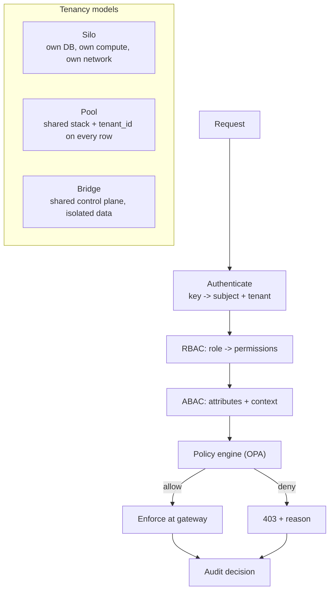

# Multi-Tenancy and Authorization

> **Interview answer (say this first).** Multi-tenancy means one platform serves many customers while keeping their data and work separate. Tenancy comes in three shapes: silo (one stack per tenant), pool (shared stack, shared resources), and bridge (shared control plane, isolated data). Isolation must hold at three layers — data, compute, and network — and you test it, you do not assume it. Authorization answers "may this identity do this action on this resource?" RBAC groups permissions into roles and binds subjects to roles; ABAC evaluates attributes and context with policies. A policy engine such as OPA centralises those decisions, and the gateway is where you enforce them for every model and tool call. Every decision should be logged with its reason.

## Why this exists

An AI platform is never used by one team for long. Soon there are customers, internal teams, or business units sharing the same gateway, the same vector database, the same agent workers, and the same model budget. Sharing is what makes the platform economical. Sharing is also what makes one tenant able to see, affect, or pay for another tenant's work.

Multi-tenancy is the design that gets the economy of sharing without the cross-contamination. Three failures are common:

1. **The data leak.** A retrieval query forgets the tenant filter and returns another customer's documents. This is the worst possible bug in a RAG system.
2. **The noisy neighbour.** One tenant's batch job saturates the shared model gateway or database, and every other tenant's latency collapses.
3. **The authorization gap.** A request is authenticated but never authorized. A valid key from tenant A can read tenant B's agent run because nothing checked the tenant on the resource.

Authorization is the second half of the topic. Authentication says who you are; authorization says what you may do. In an agentic system the action space is large — run an agent, call a tool, read memory, rotate a key, approve a high-risk step — so permissions must be structured, not hard-coded per endpoint.

> **Note:** Tenancy and authorization are not the same thing, but they are enforced together. Tenancy defines the boundary; authorization enforces who may cross it and for what. You need both to keep tenants apart.

## Start from zero

| Word | Plain meaning |
| --- | --- |
| **Tenant** | A customer, team, or business unit whose data and work must be separated. |
| **Multi-tenancy** | One platform serving many tenants. |
| **Silo model** | A separate stack per tenant: separate database, compute, and network. |
| **Pool model** | All tenants share one stack; rows and namespaces carry a tenant id. |
| **Bridge model** | Shared control plane, per-tenant data and runtime; a middle ground. |
| **Isolation** | The guarantee that one tenant cannot see or affect another. |
| **Noisy neighbour** | One tenant consuming shared capacity and degrading others. |
| **RBAC** | Role-Based Access Control: permissions grouped into roles. |
| **Role** | A named bundle of permissions, such as `operator`. |
| **Permission** | A single allowed action, such as `agent:run`. |
| **Binding** | The link between a subject and a role, usually scoped to a tenant. |
| **Subject** | Who is acting: a user, service, or agent. |
| **Resource** | What is acted on: an agent, a document, a key, a run. |
| **Action** | The verb: read, run, delete, rotate. |
| **ABAC** | Attribute-Based Access Control: decisions from attributes and context. |
| **Attribute** | A fact about subject, resource, action, or environment. |
| **Policy** | A rule that maps attributes to allow or deny. |
| **Policy engine** | A service that evaluates policies, such as Open Policy Agent. |
| **Deny overrides** | A single deny beats any allow; the safe default. |
| **Default deny** | If no policy allows the action, the answer is no. |
| **PEP / PDP** | Policy Enforcement Point (where you check) and Policy Decision Point (where you decide). |
| **Audit decision** | A record of who asked, what was decided, and why. |
| **Row-level security** | Database enforcement of a per-row tenant filter. |
| **Network policy** | Firewall rules between workloads and namespaces. |

Two distinctions to keep straight:

- **RBAC vs ABAC.** RBAC is coarse and stable: "operators may run agents." ABAC is fine-grained and contextual: "operators may run agents only in their own tenant, only in dev, and only when approved." Most systems use RBAC for the baseline and ABAC for the exceptions.
- **Isolation vs authorization.** Isolation is a property of the infrastructure; authorization is a decision at request time. Isolation fails closed by architecture; authorization can be misconfigured in code, so it needs tests.

## The core idea

Think of an office building. In a **silo**, each company has its own building. Maximum separation, maximum cost. In a **pool**, everyone shares one open floor with named desks — cheap and efficient, but you trust everyone to stay at their desk. In a **bridge**, tenants share the lobby and mailroom but each has a locked suite; that is the common enterprise compromise.



Authorization is a chain, not a single check. Authentication proves identity and resolves the tenant. RBAC gives a fast baseline. ABAC adds context. The policy engine makes the final call and returns a reason. The gateway enforces it, and the audit log records it.

Here is the tenancy trade-off in one table:

| Model | Isolation | Cost per tenant | Operability | Best for |
| --- | --- | --- | --- | --- |
| **Silo** | Strongest | Highest | Many stacks to run | Regulated, largest customers |
| **Pool** | Weakest, needs care | Lowest | One stack, hard blast radius | Self-serve, many small tenants |
| **Bridge** | Strong on data | Medium | Shared control plane | Enterprise AI platforms |

The model is not permanent. A startup often begins pooled because it is cheap, then moves its largest or most regulated customers to bridge or silo as contracts demand it. Good tenancy design makes that move a migration, not a rewrite: the tenant id is already on every resource, so isolating one tenant means moving its rows and compute, not re-architecting the application.

## How it works

1. **Resolve the tenant at authentication.** The API key or token carries the tenant, and the gateway puts it in the request context. Never let a caller pass a `tenant_id` they can change; derive it from the credential.
2. **Scope every resource by tenant.** Every row, object, vector, cache entry, queue message, and log line carries the tenant. A resource without a tenant is a leak waiting to happen.
3. **Evaluate RBAC first.** Look up the subject's bindings, gather the roles, and union their permissions. This is cheap and handles the common cases.
4. **Add ABAC context.** Load attributes: subject tenant, resource tenant, resource environment, action, time, approval status, risk level. These are the facts the fine-grained policies need.
5. **Send the input to the policy engine.** The engine evaluates rules, applies deny-overrides, and returns allow or deny plus the reason and the rule that fired.
6. **Enforce at the gateway, close to the resource.** The gateway calls the decision point before the model or tool call and refuses on deny. Enforce once per request at the boundary, not scattered through business code.
7. **Enforce isolation again in the data layer.** Row-level security, tenant-scoped queries, and per-tenant vector collections are the backstop if application code forgets a filter. Defence in depth.
8. **Isolate compute and network.** Tenant workloads run in separate namespaces, with resource quotas, and network policies that deny cross-tenant traffic by default.
9. **Control the noisy neighbour.** Per-tenant concurrency limits, quotas, and priority classes stop one tenant from consuming shared capacity.
10. **Audit every decision.** Log the subject, tenant, action, resource, decision, reason, and policy version. Auditing is what makes an incident investigable and a compliance review passable.
11. **Test isolation continuously.** Automated tests attempt cross-tenant reads and writes and must fail. A tenancy model is only as good as its last isolation test.
12. **Review policies like code.** Policies live in version control, get reviewed, and are deployed through the same pipeline as software.

## The syntax you will use

**RBAC is two tables.** Roles map to permissions; bindings map subjects to roles within a tenant.

```python
ROLES = {
    "viewer":   {"agent:read"},
    "operator": {"agent:read", "agent:run"},
    "admin":    {"agent:read", "agent:run", "agent:delete", "key:rotate"},
}
BINDINGS = [
    ("alice", "operator", "tenant:acme"),
    ("bob",   "viewer",   "tenant:acme"),
    ("carol", "admin",    "tenant:globex"),
]
```

A permission check unions the roles bound to the subject in the current tenant.

**ABAC needs the request context as attributes.** These are the facts a fine-grained policy reads. Build them from the authenticated request, never from a module global.

```json
{
  "subject":  {"id": "alice", "tenant": "acme"},
  "action":   "agent:run",
  "resource": {"tenant": "acme", "env": "prod", "risk": "high"},
  "context":  {"approved": false}
}
```

The classic ABAC rules are: same tenant, environment restrictions, and approval for high-risk actions.

**A policy engine expresses rules declaratively.** This is real OPA Rego syntax; OPA evaluates it and returns a decision.

```rego
package authz

default allow := false

allow if {
    rbac_permits
    same_tenant
    not blocked
}

same_tenant if {
    input.subject.tenant == input.resource.tenant
}

blocked if {
    input.action == "agent:delete"
    input.resource.env == "prod"
}

rbac_permits if {
    some role in data.bindings[input.subject.id]   # subject -> roles
    input.action in data.roles[role]               # role -> permissions
}
```

The policy is data-driven: roles and bindings can come from an external document, so you change access without changing code.

**Deny overrides in the enforcement code.** One deny beats any allow, and the default is deny.

```python
def rbac(user, action, tenant):
    roles = {role for subject, role, scope in BINDINGS
             if subject == user and scope == f"tenant:{tenant}"}
    return any(action in ROLES[role] for role in roles)

class Policy:
    def __init__(self, name, condition):
        self.name = name
        self.condition = condition

# Deny-overrides: the first matching policy wins.
POLICIES = [
    Policy("same-tenant-only",
           lambda a: a["subject"]["tenant"] != a["resource"]["tenant"]),
    Policy("no-production-delete",
           lambda a: a["action"] == "agent:delete" and a["resource"]["env"] == "prod"),
    Policy("high-risk-needs-approval",
           lambda a: a["resource"]["risk"] == "high" and not a["context"]["approved"]),
]

def evaluate(user, action, resource, context):
    subject_tenant = context["subject_tenant"]        # resolved at authentication
    attrs = {                                          # built from the arguments
        "subject":  {"id": user, "tenant": subject_tenant},
        "action":   action,
        "resource": {"tenant": resource["tenant"], "env": resource["env"], "risk": resource["risk"]},
        "context":  {"approved": context.get("approved", False)},
    }
    if not rbac(user, action, subject_tenant):
        return "deny:rbac"
    for policy in POLICIES:
        if policy.condition(attrs):
            return f"deny:{policy.name}"
    return "allow"      # reachable only because rbac already passed
```

Note the default: if RBAC does not explicitly allow, the answer is deny. There is no fall-through to allow. The subject tenant comes from the authenticated context, the resource tenant from the resource itself, so a mismatch (for example an `acme` subject naming a `globex` resource) denies with `deny:same-tenant-only` instead of leaking across tenants.

**Database row-level security is the backstop.** Even if application code forgets the tenant filter, the database refuses.

```sql
ALTER TABLE documents ENABLE ROW LEVEL SECURITY;

CREATE POLICY tenant_isolation ON documents
  USING (tenant_id = current_setting('app.tenant_id')::uuid);
```

Set `app.tenant_id` from the authenticated context on each connection transaction.

**Compute and network isolation are declared too.** A per-tenant namespace with a default-deny network policy stops lateral traffic.

```yaml
apiVersion: networking.k8s.io/v1
kind: NetworkPolicy
metadata:
  name: deny-cross-tenant
  namespace: tenant-acme          # one policy applied per tenant namespace
spec:
  podSelector: {}                 # every pod in this tenant's namespace
  policyTypes: ["Ingress", "Egress"]
  ingress:
    # only pods in namespaces labelled with this tenant may connect
    - from:
        - namespaceSelector: {matchLabels: {tenant: acme}}
  egress:
    # same-tenant peers only...
    - to:
        - namespaceSelector: {matchLabels: {tenant: acme}}
    # ...plus cluster DNS, so name resolution keeps working
    - to:
        - namespaceSelector: {matchLabels: {k8s-app: kube-dns}}
      ports:
        - {protocol: UDP, port: 53}
        - {protocol: TCP, port: 53}
    # ...the shared model gateway / egress proxy
    - to:
        - namespaceSelector: {matchLabels: {app: model-gateway}}
      ports:
        - {protocol: TCP, port: 443}
    # ...and the secret manager endpoint
    - to:
        - ipBlock: {cidr: 10.0.0.0/8}
      ports:
        - {protocol: TCP, port: 8200}
```

**Enforce once at the gateway.** Model and tool calls both pass through the same decision.

```python
decision = authz.evaluate(subject, "agent:run", resource, context)
if decision != "allow":
    raise HTTPException(status_code=403, detail=decision)   # reason, not a vague error
```

Returning the reason makes debugging and auditing possible.

## Examples: simple to real

**Example 1 — RBAC allows the baseline, denies the gap.** Alice is an operator, so she may run an agent. Bob is only a viewer, so he may read but not run.

```text
alice run dev:       allow
bob run dev:         deny:rbac
```

**Example 2 — ABAC adds context and denies a high-risk production run.** Alice can run agents, but a high-risk production run without approval is denied by policy.

```text
alice run high prod: deny:high-risk-needs-approval
```

RBAC said yes; ABAC said no. That layering is the point.

**Example 3 — an approval attribute flips the decision.** Add the same request with `approved: true` and the policy allows it, with the approval captured in the audit record.

```text
alice run approved:  allow
```

**Example 4 — the same-tenant rule blocks cross-tenant access.** Alice belongs to `acme`; a resource in `globex` is denied even though she has the `agent:run` permission.

```text
alice run globex:    deny:same-tenant-only
```

This is the single most important ABAC rule in a multi-tenant platform.

**Example 5 — roles are scoped, so one tenant's admin is not another's.** Carol is an admin in `globex`, so she can delete a globex agent. A production delete is still blocked, because the environment rule is independent of the role.

```text
carol delete globex: allow
carol delete prod:   deny:no-production-delete
```

**Example 6 — isolation tests are adversarial.** The test suite tries every cross-tenant read and write and asserts that it fails. A test that should deny and returns 200 is a release blocker.

```text
test: acme_key reads globex_document -> expect 404/403, got 200 -> FAIL
test: globex_admin deletes acme_agent -> expect 403, got 200 -> FAIL
```

If your isolation test never fails during development, it is probably not testing anything.

## In production

- **Derive the tenant from the credential, never from the request body.** If a caller can set `tenant_id`, they can become another tenant. Bind it at authentication.
- **Put the tenant on every resource.** Rows, vectors, blobs, queues, caches, and logs. A missing tenant field is a latent leak, not a style issue.
- **Enforce in depth.** Gateway, application, and database. Each layer should be sufficient on its own; together they survive a forgotten filter.
- **Default deny, and let deny override.** Never write a policy that allows unless something denies. Start closed and open explicitly.
- **Keep RBAC for the 90% and ABAC for the exceptions, and separate platform roles from tenant roles.** Roles are understandable and auditable; context rules cover the risky edges. A platform operator who can deploy the gateway is not automatically a tenant admin, and vice versa.
- **Enforce at one boundary, and watch the policy cache.** Scattered permission checks drift and leave holes, so put the decision at the gateway or shared middleware and test that no route bypasses it. A stale cache means a revoked permission still works, so version policies, invalidate on change, and fail closed if the policy engine is unreachable.
- **Control noisy neighbours explicitly.** Per-tenant concurrency and rate limits, resource quotas, and priority classes. Fair sharing is a design choice, not a default.
- **Return the reason on deny.** "Forbidden: cross-tenant access denied by same-tenant-only" is a hundred times more useful than "Forbidden."
- **Audit decisions, not just failures.** You need the allows too, to answer "who could have accessed this?" and to detect drift.
- **Beware shared caches, embeddings, and indexes.** Cross-tenant reuse of a semantic cache or a vector index is the subtle leak. Partition by tenant or include the tenant in the key.
- **Test isolation in CI and in production canaries.** Fuzz cross-tenant access with real credentials on a schedule, and alert on any success.
- **Plan for tenant offboarding.** Deleting a tenant means deleting its data, keys, budgets, and cached content. Design a real deletion path, because regulations require it.

## Interview questions

### 1. Compare silo, pool, and bridge tenancy.

**Answer.** Silo gives each tenant its own database, compute, and network: strongest isolation, highest cost and operational load. Pool shares everything and separates by a tenant id on rows and namespaces: cheapest and easiest to operate, but a bug or a noisy tenant has the widest blast radius. Bridge shares the control plane and runtime while isolating data and credentials per tenant: a middle ground that enterprise AI platforms commonly choose. The choice is a trade-off between isolation, cost, and operability.

**Follow-up: "When would you choose silo for one customer?"** Regulated data, a contract that requires physical separation, or a customer large enough that a shared failure would be unacceptable.

**Trap.** Claiming pool is safe "because we filter by tenant." Filtering is only as good as the code that remembers to filter it.

### 2. What does tenant isolation mean across data, compute, and network?

**Answer.** Data isolation means one tenant cannot read or write another's rows, vectors, blobs, or cache entries. Compute isolation means one tenant's workloads cannot consume another's CPU, memory, or concurrency. Network isolation means their services cannot reach each other. You enforce data with tenant keys and row-level security, compute with namespaces and quotas, and network with default-deny policies. All three must hold.

**Follow-up: "Which is most often forgotten?"** The network and the cache. Teams test the database filter and forget that a shared cache key or an open service mesh lets tenants reach each other.

**Trap.** Treating isolation as a single application-level filter. Isolation is layered, and each layer is a backstop for the others.

### 3. Explain RBAC and ABAC, and when to use each.

**Answer.** RBAC assigns permissions to roles and binds subjects to roles, usually scoped to a tenant. It is simple, stable, and easy to audit. ABAC evaluates attributes of the subject, resource, action, and environment to make fine-grained decisions, such as "only in the same tenant, only in dev, only with approval." Use RBAC for the baseline and ABAC for contextual exceptions.

**Follow-up: "What is the risk of ABAC?"** Complexity and unpredictability. Policies interact, and no single person can explain why access was granted. Keep policies small, test them, and always return the rule that fired.

**Trap.** Building ABAC for everything and drowning in policies. Start with roles, then add only the context rules you actually need.

### 4. How does a policy engine like OPA fit in?

**Answer.** It is the decision point. You send it a structured input — subject, action, resource, context — and it evaluates declarative policies, returning allow or deny plus a reason. Centralising the logic means one place to review, version, and test access rules, and it keeps policy out of application code. The gateway or middleware is the enforcement point that acts on the decision.

**Follow-up: "What happens if the policy engine is down?"** Decide in advance. For security, fail closed by default. If availability is paramount for low-risk reads, you can fail open with a cached decision and a loud alert, but never for high-risk actions.

**Trap.** Putting policy in application `if` statements. It is invisible in review, untestable in isolation, and impossible to audit consistently.

### 5. Where do you enforce authorization in an agent system?

**Answer.** At the gateway, for every model and tool call, using the authenticated subject and resolved tenant. Tool calls are the highest-risk actions because they have side effects, so they need explicit permission checks and often human approval. Enforce once at the boundary and again at the resource for defence in depth.

**Follow-up: "Why not only in the agent's code?"** The agent is generated behaviour and untrusted input can influence it. The platform must enforce permissions that the agent cannot reason its way around.

**Trap.** Authorizing the initial request and then trusting every subsequent tool call in the run. Each tool call is its own authorization decision.

### 6. How do you stop a noisy neighbour without hurting fair users?

**Answer.** Give every tenant its own limits: concurrency, request rate, token quota, and resource quotas on the runtime. Add priority classes so critical tenants or routes get capacity first. Measure per tenant and alert on the one consuming disproportionate share. Fairness comes from explicit per-tenant allocations, not from hoping.

**Follow-up: "What about a tenant with a legitimate burst?"** Let the burst use its own quota, and borrow idle capacity only if there is a clear priority and a preemption path. Do not let one tenant silently borrow another's reserved share.

**Trap.** A single global limit. It protects the platform but not fairness, so a large tenant still starves the rest.

### 7. How do you test tenant isolation?

**Answer.** With adversarial automated tests. For every resource type, attempt cross-tenant read, write, list, and delete using real credentials, and assert the requests fail. Run them in CI on every change and periodically in production with canary tenants. Include cache, search, and vector queries, because those are the paths most likely to miss a tenant filter. Any success is a release blocker.

**Follow-up: "Why production tests too?"** Configuration and index state in production differ from CI. A scheduled canary that attempts cross-tenant access catches drift you cannot reproduce locally.

**Trap.** Testing only the happy path with the correct tenant. The test that matters is the one with the wrong tenant.

### 8. What do you record in an authorization audit log?

**Answer.** The subject and tenant, the action, the resource and its tenant, the decision, the policy and rule that produced it, the policy version, the timestamp, and the request id. Record allows as well as denies, because you need to answer both "why was this blocked?" and "who could have accessed this?" Keep it tamper-evident and retain it per your compliance rules.

**Follow-up: "How do you handle sensitive values in the log?"** Log identifiers and decisions, not payloads. Redact secrets and personal data, and store the audit trail in a separate, access-controlled system.

**Trap.** Logging only denials. You cannot reconstruct access patterns or prove compliance from failures alone.

## Remember this

- **Tenancy comes in silo, pool, and bridge; isolation must hold for data, compute, and network.**
- **Derive the tenant from the credential and put it on every resource.**
- **RBAC for the baseline, ABAC for context, default deny, deny overrides.**
- **Centralise decisions in a policy engine and enforce them once at the gateway.**
- **Audit every decision with its reason, and test isolation adversarially.**
