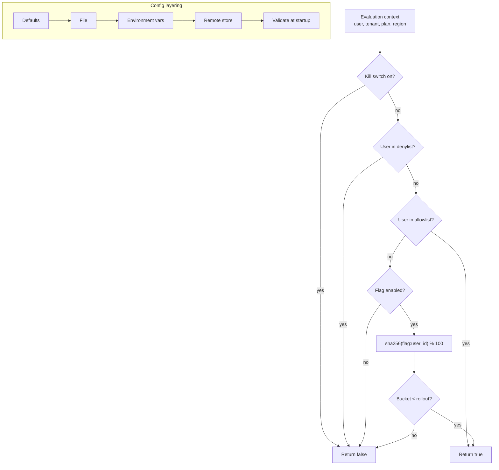

# Feature Flags and Configuration

> **Interview answer (say this first).** A feature flag is a switch that changes behaviour without a deploy. Flags come in four kinds: release flags to ship code dark, experiment flags to run A/B tests, ops flags as kill switches, and permission flags to enable features for specific tenants. Targeting rules decide who sees what, using attributes, allowlists, or a percentage rollout that hashes a stable identifier. Configuration is the typed, layered input a service reads at startup: defaults, then a file, then environment variables, then a remote store. Validate it at startup and fail fast. Flags, config, and secrets are three different things: flags are behavioural switches, config is safe-to-read settings, secrets are credentials. Never put a secret in a flag or a config file.

## Why this exists

Two forces push in the same direction. First, deploying code and releasing behaviour are not the same event. You want to ship a feature, test it on one tenant, and roll it back in seconds without rebuilding. Second, the same service runs in dev, staging, and production with different settings, and those settings change more often than the code.

Doing both badly is the default. Feature toggles become `if os.environ["ENABLE_X"] == "true"` scattered through the code, with no owner, no default, and no way to know which flags are live. Configuration becomes a pile of environment variables read at random points, so a typo surfaces as a strange runtime error in production instead of a failed startup.

The stakes are higher in an AI platform. A flag can switch the model behind every agent, and a config value can raise or remove a cost boundary. Changing either is a production change with real cost and quality consequences, even though it requires no build. That is exactly why they need the same review, audit, and rollback as code.

Feature flags and configuration management fix that. Flags give you a controlled way to change behaviour at runtime. Configuration gives you a typed, validated, layered source of settings. Together they separate *what the code can do* from *what it is doing right now*.

> **Note:** The goal is not to add flags everywhere. It is to make every change deployable, testable, and reversible without a rebuild — and to make every setting explicit, typed, and validated.

## Start from zero

| Word | Plain meaning |
| --- | --- |
| **Feature flag** | A runtime switch that changes behaviour without a deploy. |
| **Release flag** | A temporary flag that hides unfinished code until launch. |
| **Experiment flag** | A flag used to split traffic for an A/B test and measure results. |
| **Ops flag** | A kill switch or circuit-breaker toggle for operations. |
| **Permission flag** | A flag that enables a feature for specific tenants or plans. |
| **Targeting** | Rules that decide which users or tenants get a flag value. |
| **Rollout** | The percentage of the population that receives a flag. |
| **Stable bucketing** | Hashing an identifier so a user always lands in the same bucket. |
| **Kill switch** | An ops flag that turns a feature off immediately. |
| **Flag evaluation** | Resolving a flag to a value for a given context. |
| **Evaluation context** | The attributes used to evaluate: user id, tenant, plan, region. |
| **Flag debt** | Stale flags that nobody removes, cluttering the code. |
| **Configuration** | Settings a service reads to run: timeouts, model names, endpoints. |
| **Typed config** | Config parsed into a defined schema with types and defaults. |
| **Layered config** | Sources applied in order, later overriding earlier. |
| **Validation at startup** | Checking config before serving traffic and failing fast. |
| **Dynamic config** | Config that can change without a restart. |
| **Environment separation** | Dev, staging, and prod have separate config and secrets. |
| **ConfigMap** | Kubernetes object holding non-secret configuration. |
| **Secret** | Sensitive value; never a config file or a flag. |
| **Flag lifecycle** | The stages of a flag: create, roll out, remove. |

Three comparisons people ask about:

- **Flag vs config.** A flag changes behaviour conditionally and is meant to be temporary. Config is a setting the service always needs. A model name is config; "use the new router" is a flag.
- **Config vs secret.** Config may appear in a pull request and be read by anyone on the team. A secret must not. If a value would be embarrassing in a public repo, it is a secret.
- **Static vs dynamic config.** Static config is read once at startup; changing it means a restart. Dynamic config is watched and reloaded live, which is powerful and riskier.

## The core idea

Think of a theatre. The **script** is the code — fixed. The **lighting board** is the feature flags — the same actors and lines, but different scenes depending on which switches are up. The **stage manager's clipboard** is the configuration — the venue, the schedule, the equipment list for tonight.

Changing the lights does not require rewriting the play. That is the whole value of a flag.



The flag path is a fixed order: kill switch first, then explicit overrides, then the enabled gate, then the deterministic rollout. Kill switch wins over everything, which is what "kill" must mean.

The config path is a merge, applied in order, ending in validation. Later sources override earlier ones, so an environment variable can override a file default.

Here is how the flag kinds compare:

| Kind | Lifetime | Who targets | Example | Remove when |
| --- | --- | --- | --- | --- |
| **Release** | Days to weeks | Eng / early users | New RAG pipeline | Feature is fully launched |
| **Experiment** | Weeks | Product / data | Prompt A vs B | Experiment concludes |
| **Ops** | Permanent | On-call | Disable expensive tool | Never (keep it) |
| **Permission** | Months | Sales / admin | SSO for enterprise plan | Plan becomes universal |

The lifetime column is the discipline. A release flag is a tool for a few days, not a permanent setting. An ops flag is part of the control surface and stays forever. When you record the kind on the flag, you know which ones are safe to delete and which ones are load-bearing.

## How it works

1. **Define the flag with a type and a default.** Boolean, string, number, or JSON. The default must be safe when the flag service is unreachable.
2. **Build the evaluation context.** Gather the attributes targeting needs: user id, tenant, plan, region, and any experiment cohort.
3. **Apply the kill switch first.** If the ops switch is on (off for the feature), return the off value immediately. Nothing else matters.
4. **Apply explicit overrides.** Check the denylist, then the allowlist. Explicit targeting beats percentage rollout.
5. **Apply the enabled gate.** If the flag is disabled, return the off value.
6. **Bucket the identity deterministically.** Hash a stable identifier with the flag name as salt, map to 0–99, and compare with the rollout percentage. The same user always gets the same answer.
7. **Log the evaluation.** Record which flag, which variant, and which rule matched. Without this you cannot debug "why did this user see that?"
8. **Layer the configuration.** Merge defaults, file, environment, and remote store in order. Each layer has one job.
9. **Parse into a typed schema.** Convert strings to ints, durations, and enums, and reject unknown keys where you can.
10. **Validate at startup.** Check ranges, required values, and cross-field rules before accepting traffic. Fail the process, do not limp along.
11. **Decide static vs dynamic.** Read most config once; watch only the values that genuinely need live changes, and validate every reload the same way as startup.
12. **Remove flags when they are done.** Track last-evaluated time, review stale flags, and delete the old code path. Flag debt is real debt.

## The syntax you will use

**A flag is a small record with an explicit type, default, and targeting.** Keep it declarative so it can live in a flag service.

```python
@dataclass
class Flag:
    name: str
    enabled: bool = True
    rollout: int = 0                        # percent, 0-100
    allow: set[str] = field(default_factory=set)
    deny: set[str] = field(default_factory=set)
    killed: bool = False
```

**Stable bucketing uses a hash of the identity and the flag name.** The flag name is the salt, so different flags bucket the same user independently.

```python
def bucket(user_id: str, salt: str) -> int:
    digest = hashlib.sha256(f"{salt}:{user_id}".encode()).hexdigest()
    return int(digest[:8], 16) % 100
```

Never use `random()`; that would flip a user in and out on every request.

**Evaluate in a fixed, documented order.** Kill switch, deny, allow, enabled, rollout.

```python
def evaluate(flag: Flag, user_id: str) -> bool:
    if flag.killed:
        return False
    if user_id in flag.deny:
        return False
    if user_id in flag.allow:
        return True
    if not flag.enabled:
        return False
    return bucket(user_id, flag.name) < flag.rollout
```

**OpenFeature is the vendor-neutral client shape.** The same code works with any flag provider behind it.

```python
from openfeature import api

client = api.get_client()
enabled = client.get_boolean_value("new-router", False, {"targetingKey": "user-42"})
```

The `targetingKey` is the stable identifier used for bucketing.

**Configuration is layered, then validated.** Later layers override earlier ones.

```python
def load_config(*layers: dict) -> dict:
    merged: dict = {}
    for layer in layers:
        merged.update(layer)
    return merged

config = validate(load_config(defaults, file_layer, env_layer))
```

The order is the contract: defaults are safe, files are per-environment, environment variables are last-mile overrides.

**Pydantic Settings gives typed config with env support.** Real shape; `SettingsConfigDict` controls the prefix and source.

```python
from pydantic import Field
from pydantic_settings import BaseSettings, SettingsConfigDict

class Settings(BaseSettings):
    model_config = SettingsConfigDict(env_prefix="APP_", env_file=".env")
    model: str = "gpt-4o-mini"
    max_tokens: int = Field(default=512, gt=0)
    timeout_s: float = Field(default=30.0, gt=0)
```

Invalid values raise at construction time, which is exactly when you want to fail.

**Validate cross-field rules explicitly.** Types are not enough; some rules involve two fields.

```python
def validate(config: dict) -> dict:
    errors = []
    if not isinstance(config.get("max_tokens"), int) or config["max_tokens"] <= 0:
        errors.append("max_tokens must be a positive int")
    if config.get("timeout_s", 0) <= 0:
        errors.append("timeout_s must be positive")
    if errors:
        raise ValueError("invalid config: " + "; ".join(errors))
    return config
```

**Kubernetes keeps config and secrets separate.** A ConfigMap for settings, a Secret for credentials, injected as environment variables.

```yaml
envFrom:
  - configMapRef: {name: app-config}     # non-secret settings
  - secretRef: {name: app-secrets}       # credentials, encrypted at rest
```

**A flag service keeps evaluation off the hot path with local caching and streaming.** The SDK caches rules and receives updates, so a request rarely makes a network call.

```text
SDK startup: fetch all rules -> cache in memory
Update:      stream changes -> re-evaluate cache
Fallback:    provider unreachable -> use cached or default value
```

Always define the fallback, because the flag service is another dependency that can fail.

## Examples: simple to real

**Example 1 — allowlist beats rollout.** A design partner is explicitly allowed even at a low rollout, and a denylisted user is always off.

```text
design-partner  bucket= 10 -> True
u-6             bucket= 17 -> True
u-8             bucket= 14 -> True
u-1             bucket= 85 -> False
u-2             bucket= 34 -> False
```

**Example 2 — the same user always gets the same bucket.** Deterministic hashing is what makes a rollout stable across requests, instances, and restarts.

```text
stable buckets: [85, 85, 85]
```

**Example 3 — the kill switch overrides everything.** Even an allowlisted user gets the off value when operations flips the switch.

```text
kill switch: False
```

**Example 4 — configuration layers override in order.** The file overrides the default model, and environment overrides the file's token limit.

```text
effective config: {'model': 'gpt-4o', 'max_tokens': 1024, 'timeout_s': 30}
```

**Example 5 — validation fails fast at startup.** A bad value stops the process before it serves a single request, instead of causing a strange error later.

```text
startup validation failed: invalid config: max_tokens must be a positive int
```

**Example 6 — flag lifecycle and debt.** Every flag records its owner, creation date, and last-evaluated time. A weekly report lists flags that are safe to remove.

```text
new-router     created 12d ago  last evaluated 3m ago   owner: search   keep
old-embeddings created 210d ago last evaluated 0 times  owner: none     remove
```

A flag that has not been evaluated in months is dead code waiting to confuse someone.

## In production

- **Give every flag a safe default and a fallback.** If the flag service is down, the service must still run. Fail to the off value for risky features and the on value for safety features.
- **Kill switch first in evaluation order.** "Kill" must not be overridable by a targeting rule. Test that it truly wins.
- **Use stable bucketing, never random.** A user flipping between variants destroys the experience and the experiment. Hash a stable id, and salt with the flag name.
- **Keep flags out of deep business logic.** Evaluate at the edge or in one place, pass the resolved value inward. Flags scattered through code become untestable and impossible to remove.
- **Separate flag kinds and track their debt.** Ops flags are permanent; release and experiment flags are temporary. Record last-evaluated time, assign an owner, and delete stale flags together with their dead code path. A flag with no owner is a bug.
- **Do not put secrets in flags or config.** Flags and config files are for behaviour and settings. Credentials belong in a secret manager and are never read by flag evaluation.
- **Validate config at startup and fail fast.** A missing or invalid setting should crash the process cleanly, not degrade into strange runtime errors.
- **Keep environment separation strict.** Dev, staging, and prod should have separate config, separate secrets, and separate flag states. A shared remote config is how staging changes production.
- **Make dynamic config auditable and safe to reload.** Record who changed what, when, and the previous value, and apply the same validation on every reload as at startup, keeping the last good value if the new one is invalid. A live config change is a production change and needs a trail and a rollback.
- **Watch the cache and the evaluation path.** Cache flag and config values to avoid a network call per request, but bound the staleness with a TTL and a change stream.
- **Test flags like code.** Unit-test each important flag state, including off, on, and the fallback. Untested flags fail at the worst time.
- **Alert on unexpected flag flips.** A flag changing in production without a deploy should be a monitored event, because it changes behaviour instantly and invisibly.

## Interview questions

### 1. What are the four kinds of feature flags?

**Answer.** Release flags hide unfinished code until launch and are short-lived. Experiment flags split traffic to measure an outcome. Ops flags are long-lived kill switches and circuit-breaker toggles used by on-call. Permission flags enable features for specific tenants or plans. They differ mainly in lifetime and owner, and mixing them hides which flags are safe to remove.

**Follow-up: "Which kind is permanent?"** Ops flags. A kill switch you delete is a control you no longer have during an incident.

**Trap.** Treating all flags as temporary. Deleting ops flags removes your incident levers; keeping experiment flags forever buries your code.

### 2. How does percentage rollout stay consistent for a user?

**Answer.** By deterministic hashing. Hash a stable identifier, such as the user id or tenant id, with the flag name as the salt, map the hash to 0–99, and compare with the rollout percentage. The same user always lands in the same bucket, so they consistently see the same variant across requests and instances. Never use a random number or an in-memory counter.

**Follow-up: "How do you ramp from 5% to 50%?"** Because the bucket is stable, moving the threshold from 5 to 50 only adds users; it does not reshuffle the users already in. That monotonic property is the whole reason hashing is used.

**Trap.** Salting with the user id only. Then all flags bucket a user the same way, and they get the same correlated slice of every experiment.

### 3. What is the difference between a feature flag, configuration, and a secret?

**Answer.** A flag is a conditional behaviour switch with targeting and a lifecycle. Configuration is the settings a service always reads, safe to review in a pull request. A secret is a credential that must never be broadly readable or logged. A model name is config; "use the new router" is a flag; the provider API key is a secret. Putting one in the wrong category causes either a leak or an outage.

**Follow-up: "Can config be dynamic?"** Yes, but validate every reload and keep a rollback. Dynamic config that changes silently is one of the hardest production changes to debug.

**Trap.** Storing a provider key in a flag service because it supports arbitrary JSON. Flag stores are not secret managers.

### 4. Why validate configuration at startup?

**Answer.** Because failing fast is safer than failing strangely. A missing field or an out-of-range value should stop the process before it takes traffic, with a clear error. If you validate lazily, the failure shows up as a confusing runtime error under load, possibly after serving bad results. Startup validation makes the contract explicit and catches typos at deploy time.

**Follow-up: "What about dynamic reload?"** Apply the same validation on every reload, and keep the previous good value if the new one is invalid. Never accept a partially valid config.

**Trap.** Using default values to paper over a missing setting. A silent default hides a misconfiguration that should have failed the deploy.

### 5. How do you manage flag debt?

**Answer.** Every flag gets an owner, a purpose, a kind, and a creation date. Track last-evaluated time, and generate a report of flags not evaluated recently. For each, either confirm it is permanent (an ops flag) or schedule removal of the flag and the dead code path. Review flags on a schedule, not when the codebase becomes unmanageable.

**Follow-up: "What is the cost of leaving a flag in?"** Two code paths to test and maintain, ambiguity about which one is live, and a growing chance that a stale flag flips and breaks something.

**Trap.** Removing the flag but leaving the dead branch. The flag is gone but the confusion and the untested code remain.

### 6. How do you separate environments for config and flags?

**Answer.** Use separate accounts, projects, or namespaces per environment, with separate config stores, separate secret paths, and separate flag states. The same code reads its environment's values. Never share a remote config or a flag service project across environments, because a change intended for staging will reach production.

**Follow-up: "How do you promote a change safely?"** Change staging first, verify, then change production through the same reviewed path. Keep the change audited with who, what, when, and the previous value.

**Trap.** Using the same secret manager path with a different prefix and calling it separation. One misconfigured prefix reads production secrets.

### 7. What do you log for a flag evaluation?

**Answer.** The flag key, the resolved variant, the rule that matched (kill switch, allowlist, denylist, rollout), the bucketing value, and the flag version. Log enough to answer "why did this user get this value?" without logging personal data. Aggregate the variants for experiment analysis, but keep per-user records traceable by identifier.

**Follow-up: "Why log the version?"** Because a rule change can explain a behaviour change. Without the flag version, you cannot tell whether the user or the rules changed.

**Trap.** Logging only the final boolean. It tells you what happened but not why, which makes debugging a rollout issue far harder.

### 8. What are the failure modes of feature flags and dynamic config?

**Answer.** A flag service outage with no fallback takes down evaluation; inconsistent bucketing ruins an experiment; a stale flag flips and changes production behaviour invisibly; dynamic config reloads with an invalid value; flag debt multiplies untested paths; and a misconfigured targeting rule exposes a feature to the wrong tenant. Each needs a default, a test, an audit trail, and a monitored change event.

**Follow-up: "How do you make flags safe under outage?"** Cache the rules locally, ship a safe default in code, and stream updates so the cache is fresh. If the service is unreachable, the service keeps running with the last known or default values.

**Trap.** Assuming the flag provider is always available. It is another dependency on the critical path unless you design the fallback.

## Remember this

- **Deploying code and releasing behaviour are different events.** Flags decouple them.
- **Kill switch first, then overrides, then a stable hash for rollout.** The order is the contract.
- **Config is typed, layered, and validated at startup.** Fail fast, never limp along.
- **Flags are behaviour, config is settings, secrets are credentials.** Never mix them.
- **Every flag has an owner and a removal plan.** Flag debt is real debt.
