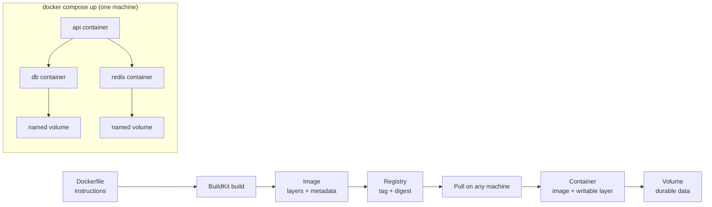

# Docker and Docker Compose

> **Interview answer (say this first).** A container **image** is an immutable, layered snapshot of an application plus its runtime; a **container** is one running instance of that image with a thin writable layer that disappears when the container is removed. A `Dockerfile` describes how to build the image, and the order of its instructions decides how much of the build can be reused from cache. **Docker Compose** runs a multi-service stack — app, Postgres, Redis — from one YAML file on a single machine. Compose is excellent for local development and wrong for production, because it has no scheduler, no self-healing, and no rolling deploys.

## Why this exists

Start with the problem containers solve. Software depends on more than its own source code: the language runtime, system libraries, OS packages, and the exact dependency set. Ship that source to a machine that is missing one piece and it dies at startup with an error nobody can reproduce:

```text
ImportError: libpq.so.5: cannot open shared object file
```

The old fixes were all prose: a "deploy guide", a hand-configured server, a wiki page. None are reproducible six months later. Agents make this worse, because an agent runtime needs the app, a database, a cache, and often a queue; local setup becomes a paragraph per service. Containers replace the prose with an artifact:

- **Parity.** Dev, CI, staging, and production run the same image.
- **Reproducibility.** The build is a file in git, not a memory.
- **Rollback.** Deploying the previous image is a tag change, not a rebuild.
- **Isolation.** Two services on one host cannot corrupt each other's dependencies.
- **Multi-service dev.** Compose starts the whole stack with one command.

> **Note:**
>
> **The one-sentence purpose.** An image is your application plus everything it needs to run, frozen into one versioned file; Compose is how you run several of those files together on your laptop.

## Start from zero

| Word | Plain meaning |
| --- | --- |
| **Image** | A read-only template made of layers: a filesystem plus metadata such as the start command. |
| **Container** | A running (or stopped) instance of an image, with one thin writable layer on top. |
| **Dockerfile** | The text file of instructions used to build an image. |
| **Layer** | One filesystem change produced by one Dockerfile instruction. Layers are cached and shared between images. |
| **Base image** | The image you start `FROM`, such as `python:3.12-slim`. |
| **Build context** | The files sent to the builder at build time, usually the project directory minus `.dockerignore`. |
| **BuildKit** | The modern build engine; it enables cache mounts and build secrets. |
| **Registry** | A server that stores and serves images, such as Docker Hub or GHCR. |
| **Tag** | A human-readable label such as `myapp:1.2.3`. Mutable and easy to overwrite. |
| **Digest** | The content hash `sha256:...`. Immutable and exact. |
| **Volume** | Docker-managed storage that outlives a container, such as a database directory. |
| **Port mapping** | Publishing a container port to the host, written `-p 8000:8000`. |
| **`ENTRYPOINT` / `CMD`** | The default executable and its default arguments. `ENTRYPOINT` is the program; `CMD` supplies arguments or a fallback. |
| **Exec form** | `["python", "app.py"]` — starts the program directly, with no shell. |
| **Shell form** | `python app.py` — wraps the command in `/bin/sh -c`, which can swallow signals. |
| **`ARG`** | A build-time variable. Visible in image history; never for secrets. |
| **`ENV`** | An environment variable baked into the image. |
| **Build secret** | A value mounted only for one build step, never stored in a layer. |
| **`.dockerignore`** | A file listing paths excluded from the build context. |
| **Multi-stage build** | Several `FROM` stages in one Dockerfile; the final image keeps only what you copy forward. |
| **`HEALTHCHECK`** | An in-image command that reports whether the container is healthy. |
| **PID 1** | The first process in the container. It receives signals and must reap orphaned children. |
| **init / tini** | A tiny init process that forwards signals and reaps zombies when your app is not written to be PID 1. |
| **Compose** | A tool that runs several containers together from one YAML file. |
| **Service** | One container definition inside a Compose file. |
| **`depends_on`** | Compose start ordering; with a condition it waits for a dependency to be healthy. |

Two pairs cause most confusion. First, **image vs container**: an image is the recipe, a container is one cooked dish; you can run many containers from one image. Second, **`ARG` vs `ENV` vs secret**: `ARG` is build-time input, `ENV` is runtime configuration baked into the image, and a secret must arrive from a mounted file or the environment at run time, never from a layer, because anyone who can pull the image can read every layer.

## The core idea

Think of an image as a stack of transparent sheets. Each Dockerfile instruction lays down one sheet showing only the files it changed. Sheets are **shared and cached**: if two images start from the same base and run the same `pip install`, they reference the same sheet.

Starting a container adds one more transparent sheet on top — the writable layer — that lives only as long as the container. That is why anything written inside a container vanishes when the container is replaced, and why databases must use a **volume**.

The caching rule is the single most important thing to internalise: **a layer is reused only if the instruction and every parent layer are unchanged.** `COPY` additionally compares file checksums. So order matters:

- Put things that change rarely (system packages, dependencies) early.
- Put things that change often (your source code) late.

Compose applies the same idea at the service level. Each service is one image; Compose wires them together on a private network so `api` can reach `db` by name, and it starts them in dependency order.



The left side is the artifact pipeline; the right side is local orchestration. Production replaces the right side with a real orchestrator such as Kubernetes or ECS.

## How it works

Walk through a build, a run, and a Compose startup.

1. **The client sends the build context.** Docker packages the project directory minus `.dockerignore` entries and sends it to the builder. A large context makes every build slower.
2. **The builder reads the Dockerfile top to bottom.** `FROM` pulls the base image; each other instruction runs and produces a new layer.
3. **After each instruction, the builder looks for a cached layer** whose parent and instruction match. `COPY` and `ADD` also compare file checksums. On a hit, the instruction is skipped entirely.
4. **The first cache miss invalidates every later layer.** This is why `COPY . .` before `pip install` forces a full reinstall whenever one source line changes.
5. **The final stage becomes the image**, plus metadata: working directory, exposed ports, user, entrypoint, and healthcheck.
6. **The image is tagged and pushed.** Pushing uploads only the layers the registry does not already have.
7. **A runtime pulls the image** by tag or, better, by digest, and creates a container. The writable layer is created on top of the read-only layers.
8. **The entrypoint becomes PID 1.** In exec form it is your program directly, so signal handling and child reaping become its job; `--init` or Compose `init: true` inserts `tini` instead.
9. **The container is disposable.** Stop it and the writable layer is gone. Only volumes survive.
10. **Compose reads the YAML file** and creates a project: it builds or pulls each image, creates a private network, starts services, and attaches volumes.
11. **Compose orders starts by `depends_on`.** With a plain list it only controls start order. With `condition: service_healthy` it waits until the dependency passes its healthcheck before starting the dependent service.
12. **Compose streams logs with a prefix per service** and stops everything with one command. It does not reschedule a crashed container onto another host.

> **Tip:**
>
> **The mental shortcut.** Read your Dockerfile top to bottom and ask: "if I edit one line of application code, how many layers below it get rebuilt?" The answer should be "one".

## The syntax you will use

**A production Dockerfile.** Slim base, cached dependencies, a non-root user, exec-form entrypoint, and a healthcheck.

```dockerfile
FROM python:3.12-slim
ENV PYTHONDONTWRITEBYTECODE=1 \
    PYTHONUNBUFFERED=1
WORKDIR /app
# Dependencies change rarely, so this layer stays cached.
COPY requirements.txt .
RUN pip install --no-cache-dir -r requirements.txt
# Source changes often, so it comes last.
COPY . .
RUN useradd --create-home --uid 10001 app && chown -R app:app /app
USER app
EXPOSE 8000
HEALTHCHECK --interval=30s --timeout=3s --start-period=10s --retries=3 \
    CMD ["python", "-c", "import urllib.request; urllib.request.urlopen('http://127.0.0.1:8000/health')"]
CMD ["python", "-m", "app.main"]
```

`PYTHONUNBUFFERED=1` makes logs appear immediately so a log collector sees them; copying `requirements.txt` first keeps a source edit from reinstalling every dependency.

**A multi-stage build.** Compilers and build tools stay in the `builder` stage; the runtime image carries only the built wheels.

```dockerfile
# syntax=docker/dockerfile:1
FROM python:3.12-slim AS builder
WORKDIR /build
COPY requirements.txt .
RUN --mount=type=cache,target=/root/.cache/pip \
    pip wheel --wheel-dir /wheels -r requirements.txt

FROM python:3.12-slim AS runtime
ENV PYTHONDONTWRITEBYTECODE=1 \
    PYTHONUNBUFFERED=1
WORKDIR /app
COPY --from=builder /wheels /wheels
COPY requirements.txt .
RUN pip install --no-index --find-links=/wheels -r requirements.txt \
    && rm -rf /wheels
COPY . .
RUN useradd --create-home --uid 10001 app && chown -R app:app /app
USER app
EXPOSE 8000
CMD ["python", "-m", "app.main"]
```

The `--mount=type=cache` keeps pip's download cache between builds without adding it to the image, so rebuilds are fast and the artifact stays small.

**`.dockerignore`.** Keep the context small and stop secrets from entering the image.

```text
.git
.venv
__pycache__
*.pyc
.env
.pytest_cache
.mypy_cache
tests/
docs/
```

Without this, `COPY . .` can bake `.env` and a local virtualenv into the image.

**The core commands.** Build, run, tag, push, and clean up.

```bash
docker build -t ghcr.io/acme/agent-api:1.2.3 .
docker run --rm -p 8000:8000 -e LOG_LEVEL=info ghcr.io/acme/agent-api:1.2.3
docker tag ghcr.io/acme/agent-api:1.2.3 ghcr.io/acme/agent-api:latest
docker push ghcr.io/acme/agent-api:1.2.3
docker image inspect ghcr.io/acme/agent-api:1.2.3 --format '{{.Id}}'
```

Build once, run many. Keep the image identical across environments and inject configuration at run time.

**Handle `SIGTERM` because your process is PID 1.** `docker stop` sends `SIGTERM`, waits a grace period (10 seconds by default), then sends `SIGKILL`.

```python
import signal
import time

stop = False

def handle(signum, frame):
    global stop
    stop = True

signal.signal(signal.SIGTERM, handle)
signal.signal(signal.SIGINT, handle)

# The main loop must observe the flag, or the handler runs and nothing happens.
while not stop:
    serve_work()
    time.sleep(0.1)
# then finish in-flight requests and exit cleanly
```

A process running as PID 1 does not get the default action for signals it has not handled, so an unhandled `SIGTERM` means every stop is a hard kill.

**A Compose stack with healthchecks and dependency conditions.** One command brings up the API, PostgreSQL, and Redis with the right wiring.

```yaml
services:
  api:
    build: .
    ports:
      - "8000:8000"
    env_file:
      - .env
    depends_on:
      db:
        condition: service_healthy
      redis:
        condition: service_healthy
    init: true
  db:
    image: postgres:16
    environment:
      POSTGRES_PASSWORD: devpassword
    volumes:
      - pgdata:/var/lib/postgresql/data
    healthcheck:
      test: ["CMD-SHELL", "pg_isready -U postgres"]
      interval: 5s
      timeout: 3s
      retries: 5
  redis:
    image: redis:7
    healthcheck:
      test: ["CMD", "redis-cli", "ping"]
      interval: 5s
      timeout: 3s
      retries: 5
volumes:
  pgdata:
```

`condition: service_healthy` removes the classic race where the API starts before the database is ready to accept connections.

**Environment variables versus secrets in Compose.** Configuration goes in the environment; sensitive values come from files.

```yaml
services:
  api:
    image: ghcr.io/acme/agent-api:1.2.3
    environment:
      LOG_LEVEL: info
      DATABASE_HOST: db
    env_file:
      - .env
    secrets:
      - openai_api_key
secrets:
  openai_api_key:
    file: ./secrets/openai_api_key.txt
```

Compose mounts a secret as a file under `/run/secrets/<name>`, so the value is not visible in `environment`. That is stronger than `env_file`, but the secret still lives on your disk, which is one reason Compose is a development tool.

**The Compose commands you actually use.** Bring the stack up in the background, follow logs, rebuild, and tear down.

```bash
docker compose up -d --build
docker compose logs -f api
docker compose exec api python -m app.cli check
docker compose down
docker compose down -v          # also delete named volumes (destroys data)
```

`down` removes containers and networks; `down -v` also deletes volumes, which is how you reset a dirty local database.

## Examples: simple to real

**Example 1 — run one container and inspect it.** The image is the template; the container is the instance.

```bash
docker run --rm alpine:3.20 echo "hello from a container"
docker run -d --name demo redis:7
docker ps                       # running containers
docker ps -a                    # including stopped
docker inspect demo --format '{{.State.Status}}'
docker rm -f demo
```

`--rm` deletes the container on exit; without it, stopped containers pile up.

**Example 2 — reorder for cache and measure the difference.** The naive Dockerfile reinstalls dependencies on every code edit.

```dockerfile
FROM python:3.12-slim
WORKDIR /app
COPY . .
RUN pip install -r requirements.txt
CMD ["python", "-m", "app.main"]
```

Compare with the ordered version below. Only the final `COPY` layer rebuilds when application code changes, which often turns a two-minute rebuild into a few seconds.

```dockerfile
FROM python:3.12-slim
WORKDIR /app
COPY requirements.txt .
RUN pip install --no-cache-dir -r requirements.txt
COPY . .
CMD ["python", "-m", "app.main"]
```

**Example 3 — the full local agent stack.** The API reaches Postgres and Redis over the Compose network by service name.

```yaml
services:
  api:
    build: .
    ports: ["8000:8000"]
    environment:
      DATABASE_URL: postgresql://app:devpassword@db:5432/app
      REDIS_URL: redis://redis:6379/0
    depends_on:
      db: { condition: service_healthy }
      redis: { condition: service_healthy }
    init: true
  db:
    image: postgres:16
    environment: { POSTGRES_USER: app, POSTGRES_PASSWORD: devpassword, POSTGRES_DB: app }
    volumes: ["pgdata:/var/lib/postgresql/data"]
    healthcheck:
      test: ["CMD-SHELL", "pg_isready -U app -d app"]
      interval: 5s
      retries: 5
  redis:
    image: redis:7
    healthcheck:
      test: ["CMD", "redis-cli", "ping"]
      interval: 5s
      retries: 5
volumes:
  pgdata:
```

The hostnames `db` and `redis` are Compose service names resolved on the private network. Nothing here is reachable from another machine except the published `8000`.

**Example 4 — why the same file is unsafe in production.** Run two API containers and the limits appear immediately.

```yaml
services:
  api:
    build: .
    ports:
      - "8000:8000"       # host port 8000 can only be bound once
    restart: unless-stopped
```

A second `up` fails on the port, and even with different ports there is no load balancer, no rolling update, no scheduler to move a container off a dead host, and no secret manager. That is the exact gap Kubernetes or a managed orchestrator fills.

## In production

- **Pin the base image by digest for reproducibility.** `python:3.12-slim` is a mutable tag; `python@sha256:...` is exact. Mutable tags drift between builds.
- **Copy dependency files before source.** `requirements.txt` (or a lockfile) first, application code last, so code edits reuse the dependency layer.
- **Always write a `.dockerignore`.** Excluding `.git`, `.venv`, `__pycache__`, and `.env` cuts build context size and keeps secrets and stale bytecode out of the image.
- **Never bake secrets into a layer.** `ARG` and `ENV` values appear in image history and `docker inspect`. Use BuildKit secrets at build time and mounted files or a secret manager at run time.
- **Build dependencies in a builder stage.** Compilers add hundreds of megabytes and attack surface the running app never needs.
- **Prefer `slim` Debian bases over `alpine` for data and ML work.** Alpine uses musl, so many `manylinux` wheels do not apply and pip compiles from source, which is slow and failure-prone.
- **Run as a non-root user with a high UID.** Root in a container is still root on the host kernel and produces root-owned files in shared volumes. Docker sets `net.ipv4.ip_unprivileged_port_start=0` in containers, so a non-root process can bind ports below 1024; still listen on 8000 by convention, and note that publishing a host port below 1024 does require host privileges.
- **Use exec-form `ENTRYPOINT` and handle `SIGTERM`.** Shell form wraps the process in `/bin/sh -c`, which can swallow the signal; PID 1 also ignores default signal actions it has not handled.
- **Add `init: true` (or `--init`) when your app does not reap children.** A long-running app that spawns subprocesses will accumulate zombies without an init.
- **Do not run migrations on every container start.** With several replicas they race. Run migrations as a separate one-off job before the rollout.
- **Keep containers stateless; put data in volumes or object storage.** The writable layer dies with the container. Anything you must keep belongs elsewhere.
- **Treat Compose as a dev and CI tool.** It runs on one host, has no scheduler or self-healing, cannot roll out gradually, and stores secrets on disk. Use it to reproduce the stack locally, then deploy the same images to a real orchestrator.

## Interview questions

### 1. What is the difference between an image and a container?

**Answer.** An image is a read-only, layered template containing a filesystem and metadata — the start command, user, exposed ports, and healthcheck. A container is a running or stopped instance of that image with one thin writable layer on top. Many containers can run from one image, and the writable layer disappears when the container is removed.

**Follow-up: "Then where does the database's data go?"** Into a volume or a bind mount, which lives outside the writable layer and survives container replacement.

**Trap.** Calling a container "a lightweight VM". A VM has its own kernel; a container shares the host kernel and uses namespaces and cgroups for isolation. That is why containers start in milliseconds and why a kernel exploit is a serious risk.

### 2. How does Docker layer caching work, and how do you exploit it?

**Answer.** Each instruction produces a layer. The builder reuses a cached layer only if the instruction and every parent layer are unchanged; `COPY` also checksums the copied files. The first miss invalidates all later layers. So copy `requirements.txt` and install dependencies before copying source code, which changes on every commit.

**Follow-up: "What is a cache mount?"** With BuildKit, `RUN --mount=type=cache,target=/root/.cache/pip` persists pip's download cache between builds without storing it in the image, so a cache miss does not re-download every package.

**Trap.** Putting `COPY . .` before `pip install`. It makes the dependency layer rebuild on every source change and is the most common Dockerfile performance bug.

### 3. What is a multi-stage build and why use one?

**Answer.** A Dockerfile can have several `FROM` stages. The final image is the last stage, and `COPY --from=builder` brings forward only the files you need, typically built wheels or installed packages. Compilers, test dependencies, and build caches stay behind. The result is a smaller image with a smaller attack surface.

**Follow-up: "Can you build wheels in the builder and install them in the runtime?"** Yes. `pip wheel --wheel-dir /wheels` in the builder, then `pip install --no-index --find-links=/wheels` in the runtime stage. This is the standard pattern for compiled dependencies.

**Trap.** Copying a virtualenv from the builder. A venv contains absolute paths and breaks when moved. Copy wheels or install into a shared prefix instead.

### 4. How do you pass secrets into a build and into a running container?

**Answer.** At build time use BuildKit secrets: `RUN --mount=type=secret,id=netrc,target=/root/.netrc ...` with `docker build --secret id=netrc,src=...`. The secret exists only for that instruction and is not stored in any layer. At run time inject environment variables from a secret manager, or mount secrets as files. Environment variables are visible to every process in the container, so prefer mounted files or short-lived tokens for sensitive values.

**Follow-up: "What is wrong with `ARG` or `ENV` for secrets?"** Both are recorded in image metadata and readable with `docker history` or `docker inspect`, and both end up in layers anyone who pulls the image can inspect.

**Trap.** Adding a secret in one layer and deleting it in the next. The secret is still in the earlier layer and can be extracted from the image. Deleting a file in a later layer does not remove it from the image.

### 5. Why does PID 1 matter in a container?

**Answer.** PID 1 is the first process in the container, which is your entrypoint unless you add an init. On Linux, PID 1 gets special signal semantics: signals whose default action would terminate the process are not delivered unless PID 1 installs a handler. It is also expected to reap orphaned child processes. So a Python app as PID 1 must handle `SIGTERM` and either avoid spawning zombies or run under `tini` via `--init`.

**Follow-up: "How do you add an init easily?"** `docker run --init`, `init: true` in Compose, or `ENTRYPOINT ["tini", "--", "python", "-m", "app.main"]`.

**Trap.** Saying signals "always work in containers". Without a handler, `SIGTERM` has no default termination effect on PID 1, so the process is killed by `SIGKILL` after the grace period and in-flight work is lost.

### 6. How does `depends_on` behave in Compose, and why is start order not enough?

**Answer.** A plain `depends_on` list controls only start order: Compose starts the dependency first, but it does not wait for it to be ready. With `condition: service_healthy`, Compose waits until the dependency passes its `healthcheck` before starting the dependent service. Readiness still belongs in the application: retry connections and fail fast on bad configuration.

**Follow-up: "What if the database restarts later?"** Compose does not reconnect or restart your app for you. Your client needs reconnection logic and health checks, because a container that is up is not necessarily able to serve requests.

**Trap.** Assuming `depends_on` means "the database is ready". It means "the container has started", unless you add a health condition.

### 7. What do healthchecks do, and how do Docker and Kubernetes differ?

**Answer.** A healthcheck runs a command inside the container and marks it healthy or unhealthy. Compose uses it for `depends_on` conditions, and Docker uses it in `docker ps` status. Kubernetes ignores Docker's `HEALTHCHECK` and instead uses its own `readinessProbe`, `livenessProbe`, and `startupProbe`, which are more expressive because they control traffic routing and restarts.

**Follow-up: "Should the healthcheck hit the database?"** Readiness may check dependencies lightly, but a deep check that fails on a slow dependency can cascade. Keep liveness shallow — it should test only that the process can respond — and put dependency checks in readiness.

**Trap.** Making the liveness check depend on a downstream service. When that service slows down, Kubernetes restarts all your pods and turns a partial outage into a full one.

### 8. Why is Docker Compose not a production orchestrator?

**Answer.** Compose runs containers on a single host. It has no scheduler, so it cannot move work off a failed machine. It has no rolling updates, no autoscaling, no service discovery outside its own network, no secrets manager, and no multi-node networking. It also stores secrets on disk. Kubernetes, ECS, and Nomad exist precisely to provide those properties.

**Follow-up: "But can I run Compose in production for a small app?"** You can, and some teams do on one beefy machine, but you accept manual recovery, downtime during host failure, and no rolling deploy. For an AI platform with SLAs, that trade-off rarely survives an incident review.

**Trap.** Saying "Compose scales by adding replicas". `docker compose up --scale api=3` starts three containers on the same host; with a fixed `8000:8000` mapping only one can bind host port 8000 and the other two fail to start, and there is no load balancer in front. That is not horizontal scaling.

## Remember this

- An **image** is a layered, read-only template; a **container** is a running instance with a writable layer that disappears when the container is removed.
- **Layer order is performance.** Copy dependency files before source, and build dependencies in a **multi-stage** builder so the runtime stays small.
- **Never put secrets in `ARG` or `ENV`.** Use BuildKit **build secrets** at build time and injected environment or mounted files at run time.
- Run as **non-root**, start with **exec-form** `ENTRYPOINT`, and handle **`SIGTERM`** because your process is **PID 1**; add `init: true` when your app spawns children.
- **Compose is a local orchestration tool.** Healthchecks plus `depends_on` conditions fix start-order races, but production needs a scheduler with self-healing and rolling deploys.
