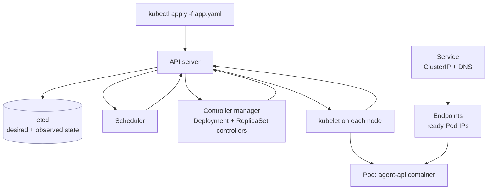

# Kubernetes Core

> **Interview answer (say this first).** Kubernetes is a **declarative** container orchestrator. You write manifests that describe the **desired state** — "run three copies of this image, expose them on port 80" — and controllers continuously move the **actual state** toward it. The unit of scheduling is a **Pod**, one or more containers that share a network namespace and lifecycle. A **Deployment** creates **ReplicaSets** to manage stateless Pods, a **Service** gives them a stable virtual IP and DNS name, **ConfigMaps** and **Secrets** inject configuration, and **probes** tell the cluster whether a Pod is alive and ready to receive traffic.

## Why this exists

Containers solved packaging. They did not solve operations. A container on one machine still leaves you to answer: which machine should it run on, what happens when that machine dies, how does another service find it, how do you roll out a new version without downtime, and where do configuration and credentials come from?

Docker Compose answers none of those at scale. It runs containers on one host, with no scheduler and no self-healing. A real AI platform runs many services — an API, workers, a model gateway, Postgres, Redis, and a vector store — across many machines, with rolling deploys, quotas, and health-based traffic routing.

Kubernetes answers those questions with one abstraction: **the control loop**. Instead of issuing commands ("start a container now"), you declare an outcome ("three healthy replicas exist"). Something inside the cluster keeps checking and repairing the difference. That inversion is the whole idea, and it is why Kubernetes is called declarative.

> **Note:**
>
> **The one-sentence purpose.** Kubernetes lets you declare the state you want — replicas, networking, config, health — and it works continuously to make that state true, even after machines fail.

## Start from zero

| Word | Plain meaning |
| --- | --- |
| **Cluster** | A set of machines managed as one pool, split into a control plane and worker nodes. |
| **Control plane** | The components that decide what runs: API server, etcd, scheduler, controller manager. |
| **Worker node** | A machine that runs Pods. It hosts the kubelet, kube-proxy, and a container runtime. |
| **API server** | The front door. Every `kubectl` command and every controller talks to it over HTTPS. |
| **etcd** | The cluster's consistent key-value store. It holds the desired and observed state of every object. |
| **Scheduler** | Assigns each new Pod to a node based on resources, affinity, and constraints. |
| **Controller manager** | Runs the built-in controllers that reconcile objects, such as the Deployment and ReplicaSet controllers. |
| **kubelet** | The node agent. It starts and stops containers for the Pods assigned to its node and reports status. |
| **kube-proxy** | Programs the node's network rules so Service virtual IPs reach the right Pods. |
| **Pod** | The smallest deployable unit: one or more containers sharing a network namespace and lifecycle. |
| **Deployment** | A controller that manages a stateless workload and its rolling updates. |
| **ReplicaSet** | A controller that keeps a specific number of identical Pods running. Created and owned by a Deployment. |
| **Service** | A stable virtual IP and DNS name in front of a set of Pods selected by labels. |
| **Endpoint / EndpointSlice** | The list of Pod IPs and ports that currently back a Service and are ready. |
| **ClusterIP** | The default Service type: reachable only inside the cluster. |
| **NodePort** | A Service type that opens a port on every node so traffic from outside can reach it. |
| **LoadBalancer** | A Service type that asks the cloud provider for an external load balancer. |
| **ConfigMap** | Non-secret configuration, injected as environment variables or files. |
| **Secret** | A configuration object for sensitive values. Base64-encoded, not encrypted by default. |
| **Namespace** | A logical partition for names, permissions, and quotas inside one cluster. |
| **Label / Selector** | Key-value tags and the queries that match them. Services and controllers find Pods this way. |
| **Manifest** | A YAML or JSON file describing one or more Kubernetes objects. |
| **`kubectl`** | The command-line client that talks to the API server. |
| **Probe** | A health check the kubelet runs against a container: liveness, readiness, or startup. |
| **Desired state** | What the manifest says should be true. |
| **Actual state** | What the cluster observes right now. |
| **Reconciliation loop** | The continuous compare-and-correct cycle that closes the gap between desired and actual. |

Two pairs cause most confusion. First, **Pod vs container**: a container is one process; a Pod is one or more containers that always land on the same node and share an IP, so they can talk over `localhost`. Second, **Deployment vs Pod**: you almost never create a bare Pod in production, because nobody recreates it if it dies. A Deployment owns ReplicaSets, which own Pods, so the chain repairs itself.

## The core idea

Use the thermostat. You do not flip a switch to add heat whenever the room cools; you set a target temperature and the thermostat keeps measuring and correcting. Kubernetes is a room full of thermostats, one per object type.

You declare: "I want three replicas of `agent-api:1.2.3`." A controller compares that to "I see two." It creates one Pod. Later, one Pod crashes; the controller sees two and creates another. On a node failure, the scheduler places replacements elsewhere. You never told it to restart anything; the loop did.

The loop has three parts, and interviewers expect you to name them:

1. **Desired state** — stored in etcd from your manifest.
2. **Observed state** — reported by kubelets and controllers.
3. **Reconcile** — a controller acts to close the gap.



Everything talks to the API server; only the API server talks to etcd. That single choke point is what makes the cluster observable and permission-controllable.

## How it works

Walk one Deployment from `apply` to a serving Pod.

1. **You write a manifest and run `kubectl apply`.** The API server validates it, persists it to etcd, and records the last-applied configuration as an annotation for future diffs. The cluster now has an opinion about the desired state.
2. **The Deployment controller notices a new Deployment.** It creates a ReplicaSet and sets the Deployment as its owner.
3. **The ReplicaSet controller notices it needs three Pods.** It creates three Pod objects, each a desired state rather than a running process.
4. **The scheduler assigns each Pod to a node**, filtering out nodes that cannot fit its resource requests and scoring the rest; the kubelet then pulls the image, starts the containers, and reports status.
5. **Probes run.** A `startupProbe` gates the others; once it succeeds, `readinessProbe` controls traffic and `livenessProbe` controls restarts.
6. **The Endpoints controller watches Pods and Services.** For every Service it keeps an EndpointSlice of Pod IPs that match the selector and are **ready**; not-ready Pods are excluded, which is how rolling updates avoid sending traffic to unready containers.
7. **kube-proxy programs network rules on each node.** A request to the Service ClusterIP is rewritten to a ready Pod IP, and in-cluster DNS resolves the Service name to that ClusterIP.
8. **A rolling update creates a new ReplicaSet and scales the old one to zero** within `maxSurge` and `maxUnavailable`, keeping it for rollback. Reconciliation never stops: if a Pod dies or a node fails, the ReplicaSet controller creates a replacement and the scheduler places it on a healthy node.

> **Tip:**
>
> **The mental shortcut.** Kubernetes does not run your commands; it runs a loop. Ask "what is the desired state, what controller owns it, and what will it do when reality drifts?" That question answers most operational puzzles.

## The syntax you will use

**The `kubectl` commands you will use daily.** Read, inspect, diff, and act.

```bash
kubectl config get-contexts                  # which clusters you can reach
kubectl get pods -n agent-platform           # list Pods in a namespace
kubectl get deploy,rs,svc,pods               # multiple kinds at once
kubectl describe pod agent-api-7d9c-abcde    # events and status, the first debug stop
kubectl logs -f deploy/agent-api             # follow logs from the Deployment
kubectl exec -it agent-api-7d9c-abcde -- sh  # a shell inside a container
kubectl apply -f app.yaml                    # create or update from a manifest
kubectl diff -f app.yaml                     # what apply would change
kubectl rollout status deploy/agent-api      # block until the rollout finishes
kubectl rollout undo deploy/agent-api        # roll back to the previous revision
kubectl scale deploy/agent-api --replicas=5
kubectl port-forward svc/agent-api 8080:80   # reach a ClusterIP from your laptop
```

`describe` shows events, which is where `CrashLoopBackOff`, `ImagePullBackOff`, and scheduling failures are explained.

**A Pod manifest.** The smallest unit, useful for debugging but rarely the production choice.

```yaml
apiVersion: v1
kind: Pod
metadata:
  name: hello
  labels:
    app: hello
spec:
  containers:
    - name: hello
      image: nginx:1.27
      ports:
        - containerPort: 80
```

The Pod gets an IP and a lifecycle, but if it dies nothing recreates it. That is why workloads live in controllers.

**A Deployment.** Desired replicas, a label selector that must match the template, and a rolling update strategy.

```yaml
apiVersion: apps/v1
kind: Deployment
metadata:
  name: agent-api
  namespace: agent-platform
spec:
  replicas: 3
  revisionHistoryLimit: 5
  selector:
    matchLabels:
      app: agent-api
  strategy:
    type: RollingUpdate
    rollingUpdate:
      maxSurge: 1
      maxUnavailable: 0
  template:
    metadata:
      labels:
        app: agent-api
    spec:
      containers:
        - name: api
          image: ghcr.io/acme/agent-api:1.2.3
          ports:
            - containerPort: 8000
          resources:
            requests:
              cpu: 250m
              memory: 256Mi
            limits:
              memory: 512Mi
```

`maxUnavailable: 0` keeps capacity at or above the desired count during a rollout, at the cost of an extra Pod.

**Services: the three types.** ClusterIP is internal; NodePort opens a port on every node; LoadBalancer asks the cloud for one.

```yaml
apiVersion: v1
kind: Service
metadata:
  name: agent-api
  namespace: agent-platform
spec:
  type: ClusterIP
  selector:
    app: agent-api
  ports:
    - name: http
      port: 80
      targetPort: 8000
```

`port` is the Service port; `targetPort` is the container port. A LoadBalancer Service adds an external IP and is built on top of NodePort, which is itself built on ClusterIP.

**A ConfigMap and a Secret.** Non-secret config as `data`; sensitive values in `data` (base64) or `stringData` (plain, encoded on write).

```yaml
apiVersion: v1
kind: ConfigMap
metadata:
  name: agent-api-config
  namespace: agent-platform
data:
  LOG_LEVEL: info
  MODEL_NAME: gpt-4o-mini
---
apiVersion: v1
kind: Secret
metadata:
  name: agent-api-secrets
  namespace: agent-platform
type: Opaque
stringData:
  OPENAI_API_KEY: sk-replace-me
```

Pod containers read these with `envFrom` for all keys, `valueFrom` for one key, or `volumeMounts` to project them as files.

**Wiring ConfigMaps and Secrets into a container.** Use an env var for a flag and a file for a credential that other code can read.

```yaml
# ... Pod spec ...
spec:
  containers:
    - name: api
      image: ghcr.io/acme/agent-api:1.2.3
      envFrom:
        - configMapRef:
            name: agent-api-config
      env:
        - name: OPENAI_API_KEY
          valueFrom:
            secretKeyRef:
              name: agent-api-secrets
              key: OPENAI_API_KEY
      volumeMounts:
        - name: creds
          mountPath: /etc/creds
          readOnly: true
  volumes:
    - name: creds
      secret:
        secretName: agent-api-secrets
```

A mounted Secret updates in the Pod filesystem when the object changes, but environment variables do **not** refresh until the Pod restarts.

**Probes: liveness, readiness, startup.** Each answers a different question, and mixing them up causes outages.

```yaml
# ... Pod spec ...
spec:
  containers:
    - name: api
      image: ghcr.io/acme/agent-api:1.2.3
      startupProbe:
        httpGet:
          path: /health/startup
          port: 8000
        failureThreshold: 30
        periodSeconds: 2
      readinessProbe:
        httpGet:
          path: /health/ready
          port: 8000
        periodSeconds: 5
        timeoutSeconds: 2
        failureThreshold: 2
      livenessProbe:
        httpGet:
          path: /health/live
          port: 8000
        periodSeconds: 10
        timeoutSeconds: 2
        failureThreshold: 3
```

Liveness failure restarts the container. Readiness failure removes the Pod from Service Endpoints. Startup failure keeps the other two probes disabled and restarts the container after the threshold.

**Namespaces.** A namespace scopes names, quota, and RBAC; it does not isolate the network by itself.

```yaml
apiVersion: v1
kind: Namespace
metadata:
  name: agent-platform
  labels:
    team: ai-platform
```

Most resources are namespaced. Nodes, PersistentVolumes, and Namespaces themselves are cluster-scoped.

## Examples: simple to real

**Example 1 — a bare Pod, and why it is a trap.** Create a Pod, delete it, and watch nothing bring it back.

```bash
kubectl run debug --image=busybox:1.36 --restart=Never -- sleep 3600
kubectl get pod debug
kubectl delete pod debug
kubectl get pods          # no debug Pod; nothing owns it
```

A bare Pod has no controller, so it is not recreated. Use it for a quick shell, never for a service.

**Example 2 — a Deployment and its ReplicaSet.** Apply the Deployment from the syntax section, then inspect what it created.

```bash
kubectl apply -f agent-api-deployment.yaml
kubectl get deploy agent-api
kubectl get rs
kubectl get pods -l app=agent-api
kubectl rollout history deploy/agent-api
```

The Deployment created one ReplicaSet with a hash suffix; the ReplicaSet created the Pods. Change the image and apply again to watch a second ReplicaSet appear.

**Example 3 — roll out a new image, then roll back.** The old ReplicaSet stays at zero replicas so a rollback is instant.

```bash
kubectl set image deploy/agent-api api=ghcr.io/acme/agent-api:1.2.4
kubectl rollout status deploy/agent-api
kubectl describe deploy agent-api | grep -i image
kubectl rollout undo deploy/agent-api
kubectl rollout status deploy/agent-api
```

Because readiness gates Endpoints, unready new Pods never receive traffic during the rollout.

**Example 4 — expose the Deployment with a Service.** Confirm the selected Pods appear as ready Endpoints.

```bash
kubectl apply -f agent-api-service.yaml
kubectl get svc agent-api
kubectl get endpointslices -l kubernetes.io/service-name=agent-api
kubectl run curl --rm -it --image=curlimages/curl -- curl -s http://agent-api.agent-platform.svc.cluster.local/health
```

The fully qualified DNS name is `<service>.<namespace>.svc.cluster.local`. From the same namespace, `agent-api` alone works.

**Example 5 — inject config and a secret, then verify.** Read back the value without printing the secret to your shell history.

```bash
kubectl create configmap api-config --from-literal=LOG_LEVEL=debug -n agent-platform
kubectl create secret generic api-creds --from-literal=API_KEY=sk-test -n agent-platform
kubectl exec -it deploy/agent-api -- printenv LOG_LEVEL
kubectl get secret api-creds -o jsonpath='{.data.API_KEY}' | base64 -d
```

The `base64 -d` step is the point: a Secret is encoded, not hidden from anyone who can read it.

**Example 6 — debug `CrashLoopBackOff`.** Work from the outside in: status, events, logs, then the last run.

```bash
kubectl get pods
kubectl describe pod agent-api-7d9c-abcde   # look at Events
kubectl logs agent-api-7d9c-abcde --previous # logs from the crashed container
kubectl get events --sort-by=.lastTimestamp -n agent-platform
```

Common causes are a missing ConfigMap or Secret key, a failing liveness probe that is too aggressive, and an application that exits immediately on a bad env var.

## In production

- **Never run bare Pods for services.** A Pod with no controller is not rescheduled or recreated. Use a Deployment, StatefulSet, Job, or DaemonSet.
- **Set resource requests, always.** The scheduler places Pods by requests. Without them, one noisy Pod can starve a node, and the scheduler is guessing.
- **Probes can cause outages, not prevent them.** A liveness probe that checks a downstream dependency restarts every Pod when that dependency slows down. Keep liveness shallow; use readiness for dependency checks.
- **Readiness gates traffic, liveness only restarts.** If a Pod is running but cannot serve, readiness removes it from Endpoints; liveness would restart it and may not help.
- **Secrets are not encrypted by default.** They are base64-encoded in etcd. Encrypt etcd at rest with an `EncryptionConfiguration`, tighten RBAC, and prefer an external secret manager. `stringData` is convenience, not security.
- **ConfigMaps and Secrets have a size limit of about 1 MiB** for the whole object. They are for configuration, not for model weights or datasets.
- **Environment variables from ConfigMaps and Secrets do not update live.** Mount them as files if the app must react to a change, or restart the Pods as part of the rollout.
- **A Service with no selector needs manual Endpoints.** Selector-less Services are how you point at an external database or a legacy system.
- **`maxUnavailable: 0` costs capacity but protects availability.** During a rollout you need room for one extra Pod. If the cluster is full, the rollout blocks.
- **Use namespaces for team and quota boundaries, not for network isolation.** Namespaces scope names and RBAC; they do not block traffic. Add NetworkPolicies for that.
- **Do not fight the loop.** If something keeps reverting, a controller owns it. Either change the owner's desired state or stop editing the object it manages.
- **`latest` is not a version.** Without an immutable tag or digest, two nodes can pull different images and rollbacks have no fixed target.

## Interview questions

### 1. What does declarative mean in Kubernetes?

**Answer.** You submit a manifest describing the desired state, and controllers continuously reconcile the actual state toward it. You write "three replicas of this image exist"; you do not write "start a container, then start another if it dies." The cluster keeps checking and repairing, which is what makes self-healing possible.

**Follow-up: "How is that different from imperative commands?"** An imperative command runs once; if the system drifts afterward, nothing corrects it. Declarative state persists and is re-enforced, so a node failure or a manual delete is repaired automatically.

**Trap.** Saying declarative means "Kubernetes decides everything." You still choose replicas, resources, and update strategy; Kubernetes only enforces what you declared.

### 2. Why are Pods ephemeral, and what follows from that?

**Answer.** A Pod is scheduled to a node, gets an IP, and is replaceable. It can be deleted, evicted for resources, preempted, or lost with its node. On replacement it gets a new name, a new IP, and empty local storage. Pods are designed to be disposable cattle, not pets.

**Follow-up: "Then how does a client reach a changing set of Pod IPs?"** Through a Service, which provides a stable virtual IP and DNS name and tracks the current ready Pods in EndpointSlices.

**Trap.** Storing state on the Pod's local filesystem or caching a Pod IP. Both break the moment the Pod is replaced. State belongs in a database, a volume, or object storage.

### 3. What is the relationship between a Deployment and a ReplicaSet?

**Answer.** A Deployment is the higher-level controller. It creates ReplicaSets and owns them. Each ReplicaSet keeps a fixed number of identical Pods. A rolling update creates a new ReplicaSet for the new template, scales it up, and scales the old one to zero, keeping it for rollback.

**Follow-up: "Why the extra layer instead of managing Pods directly?"** The ReplicaSet gives a stable generation of Pods; the Deployment gives versioned rollouts, history, and rollback. Rolling updates are essentially changing which ReplicaSet is scaled to the desired count.

**Trap.** Editing a Deployment's Pod template and expecting existing Pods to update in place. The template change creates a new ReplicaSet and new Pods; the old ones are replaced.

### 4. Compare ClusterIP, NodePort, and LoadBalancer Services.

**Answer.** ClusterIP is the default and gives a virtual IP reachable only inside the cluster. NodePort opens a port in the 30000–32767 range on every node and forwards to the Service. LoadBalancer builds on NodePort and asks the cloud provider to provision an external load balancer. Each layer sits on top of the previous one.

**Follow-up: "What creates the list of Pods behind a Service?"** The Endpoints controller. It watches the Service selector and the Pods, and keeps an EndpointSlice of Pod IPs that match and are ready. Unready Pods are removed.

**Trap.** Thinking a Service is a proxy process. A ClusterIP is a virtual address; kube-proxy programs packet rules on each node, and there is no single load-balancer process to overload.

### 5. Why are Kubernetes Secrets not secure by default?

**Answer.** A Secret is stored in etcd base64-encoded, which is an encoding, not encryption. Anyone with read access to the object can decode it, and by default etcd data on disk is not encrypted. Security comes from RBAC restricting who can `get` Secrets, optional encryption at rest configured on the API server, and external secret managers.

**Follow-up: "What is the difference between `data` and `stringData`?"** `data` requires base64-encoded values; `stringData` accepts plain strings and the API server encodes them on write. Neither encrypts anything.

**Trap.** Committing a Secret manifest with real credentials to git. Base64 is trivially reversible; treat the manifest as a credential leak.

### 6. How do liveness, readiness, and startup probes differ?

**Answer.** Liveness answers "is the container still healthy?" and restarts it on failure. Readiness answers "can it serve traffic now?" and removes the Pod from Service Endpoints on failure without restarting it. Startup answers "has it finished starting?" and, while it has not succeeded, disables the other two so a slow start is not killed.

**Follow-up: "When do you need a startup probe?"** For applications with a long, variable boot — loading a model, warming a cache. The startup probe allows a generous budget once, instead of making liveness tolerant forever.

**Trap.** Pointing liveness at an endpoint that checks the database. A slow database then triggers mass restarts and turns a degradation into an outage.

### 7. What is a namespace for?

**Answer.** A namespace partitions names inside a cluster so two teams can both have a `Service` called `api`. It is the scope for RBAC rules and resource quotas, and a common boundary for environments such as `staging` and `prod` in one cluster. It does not isolate network traffic by itself.

**Follow-up: "How do you then isolate traffic between namespaces?"** With NetworkPolicies that select Pods by label and allow only specific ingress and egress. On a CNI plugin that supports policy enforcement.

**Trap.** Assuming a namespace is a security boundary. Without NetworkPolicies, Pods in one namespace can reach Pods in another by default.

### 8. What happens when you delete a Pod managed by a Deployment?

**Answer.** The ReplicaSet controller notices the replica count is below the desired count and creates a new Pod. The scheduler places it, the kubelet starts it, probes run, and the endpoint controller adds it to the Service when it is ready. You observe a new Pod name and IP, and users see no downtime if enough replicas were healthy.

**Follow-up: "What if you delete the Deployment itself?"** The Deployment controller no longer exists for that object, and its ReplicaSets and Pods are garbage-collected. That is the intended way to remove a workload.

**Trap.** Deleting the Pod object and expecting it to come back with the same name. Controllers use generated names; identity is the label set, not the name.

## Remember this

- Kubernetes is a **reconciliation loop**: you declare desired state, controllers continuously close the gap to actual state.
- A **Pod** is the scheduling unit and is **ephemeral**; a **Deployment** owns **ReplicaSets**, which own Pods, so replacements are automatic.
- A **Service** gives a stable ClusterIP and DNS name; the **Endpoints** controller tracks only **ready** Pods, which is what makes rolling updates safe.
- **Secrets are base64-encoded, not encrypted**, by default. Protect them with RBAC, encryption at rest, and an external manager.
- **Readiness gates traffic, liveness restarts, startup protects slow boots.** Keep liveness shallow and independent of downstream services.
