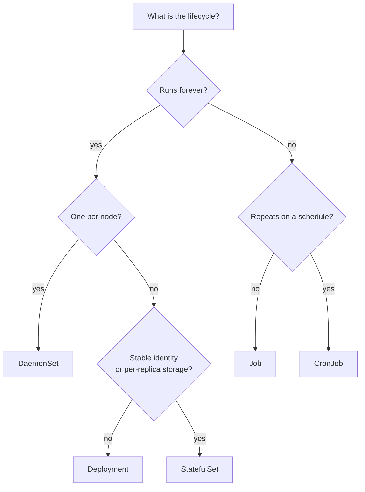

# Kubernetes Workloads

> **Interview answer (say this first).** A Kubernetes **workload** is the controller that matches a job's lifecycle. A **Deployment** runs long-lived, interchangeable, stateless Pods. A **StatefulSet** runs long-lived Pods that each need a stable name, stable storage, and ordered startup. A **DaemonSet** runs one Pod on every node for node-level agents. A **Job** runs Pods until a task completes, and a **CronJob** creates Jobs on a schedule. Choosing the wrong controller is one of the most common production mistakes: a database in a Deployment, or a long-running service in a Job, will both misbehave.

## Why this exists

Deployments cover the common case: a web API or a worker pool where every replica is identical and disposable. But real AI platforms have several other shapes of work, and each has a different lifecycle.

- A **database migration** must run exactly once, to completion, and then stop. A Deployment would restart it forever.
- A nightly **re-index** must run on a schedule, unattended. Nothing in a Deployment expresses "at 02:00 every day".
- A **Postgres primary, Kafka broker, or Redis with persistence** needs a stable identity and its own disk. A Deployment gives Pods random names and no per-Pod storage, so a restart looks like a brand-new node to the cluster.
- A **log shipper or metrics agent** must run on every node, including nodes added tomorrow.

Kubernetes models each of these with a dedicated controller. The controller's job is to interpret "desired state" correctly for that lifecycle. A Job's desired state is "these Pods complete successfully"; a StatefulSet's is "these named Pods exist with their storage". Using the wrong controller makes the reconciliation loop fight you, and that fight is always discovered in production.

> **Note:**
>
> **The one-sentence purpose.** The workload controller encodes the lifecycle: does it run forever or to completion, is it scheduled, and does each replica need its own identity and disk?

## Start from zero

| Word | Plain meaning |
| --- | --- |
| **Workload** | A controller that manages Pods for a particular lifecycle: Deployment, StatefulSet, DaemonSet, Job, CronJob. |
| **Job** | A controller that runs Pods until a specified number of successful completions, then stops. |
| **Completion** | One successful Pod run that counts toward the Job's `completions` target. |
| **`completions`** | How many successful Pod runs the Job needs before it is done. Default `1`. |
| **`parallelism`** | How many Pods the Job may run at the same time. Default `1`. |
| **`backoffLimit`** | How many times the Job retries a failed Pod before marking the Job failed. Default `6`. |
| **`activeDeadlineSeconds`** | A hard wall-clock limit on the whole Job; pods are terminated when it is exceeded. |
| **`ttlSecondsAfterFinished`** | How long a finished Job and its Pods are kept before automatic cleanup. |
| **CronJob** | A controller that creates a Job on a cron schedule. |
| **Schedule** | Cron syntax such as `0 2 * * *`, evaluated in the controller's timezone (commonly UTC). |
| **`concurrencyPolicy`** | What to do if the previous run is still going: `Allow`, `Forbid`, or `Replace`. |
| **`startingDeadlineSeconds`** | How late a missed scheduled run may still start. |
| **StatefulSet** | A controller for Pods with stable identity and optional per-Pod storage. |
| **Ordinal identity** | Stable names `<name>-0`, `<name>-1`, ... that do not change across restarts. |
| **Headless Service** | A Service with `clusterIP: None` that returns Pod IPs directly instead of a virtual IP. Required for StatefulSet identity. |
| **Stable network identity** | A DNS name like `db-0.db.default.svc.cluster.local` that always points at the same Pod. |
| **`volumeClaimTemplates`** | A template that gives each StatefulSet Pod its own PersistentVolumeClaim. |
| **PVC** | PersistentVolumeClaim: a request for durable storage that outlives a Pod. |
| **StorageClass** | The cluster setting that decides how a PVC is provisioned, such as a cloud SSD. |
| **Ordered rollout** | Starting, updating, and stopping Pods one ordinal at a time, waiting for readiness. |
| **`podManagementPolicy`** | `OrderedReady` (default, sequential) or `Parallel` for all Pods at once. |
| **DaemonSet** | A controller that runs one Pod on every eligible node, including nodes added later. |
| **Node selector** | Labels that restrict which nodes a Pod may run on. |

One pair causes most confusion: **StatefulSet vs Deployment**. A Deployment treats Pods as anonymous and interchangeable, with no per-Pod storage. A StatefulSet gives each Pod a number, a DNS name, and its own PVC, and starts them in order. If a replica needs to say "I am number 2 and here is my disk", it needs a StatefulSet.

## The core idea

Match the controller to the lifecycle, not to the technology. The question is not "is this a database or an API"; it is "does it run forever, does it finish, does it repeat, and does each replica need its own identity and disk?"

Think of a building. A **Deployment** is a shift of interchangeable workers: if one goes home, another takes the same job. A **StatefulSet** is a numbered set of tenants, each with a mailbox and a locker; tenant 3 always gets locker 3. A **Job** is a contractor hired to finish one renovation and leave. A **CronJob** is the cleaner booked every night at 2 a.m. A **DaemonSet** is the fire alarm on every floor.



The decision tree is short, and it prevents almost every workload mistake. When someone says "put the database in a Deployment and mount a shared volume", the diagram shows exactly why that breaks: identity and storage are not per-replica.

## How it works

Walk each controller's mechanism.

1. **A Job controller creates Pods until the completion target is met.** With `completions: 1` and `parallelism: 1` it runs one Pod; if the Pod fails, the Job creates another until `backoffLimit` is exhausted.
2. **Parallel Jobs track successes and failures separately.** With `completions: 10` and `parallelism: 3`, the controller keeps up to three Pods running and counts successful exits until ten are done, then deletes the remaining Pods.
3. **Failed Pods are retried with exponential backoff.** The controller increases the delay between attempts up to a cap, and after `backoffLimit` failures the Job is marked failed. Pods set `restartPolicy: Never` or `OnFailure`, never `Always`.
4. **A CronJob controller watches the clock.** On each schedule tick it creates a Job object from `jobTemplate`. The Job then runs independently, so its retries do not affect the next schedule.
5. **`concurrencyPolicy` handles overlap.** `Allow` starts a second Job even if the first is running; `Forbid` skips the new run; `Replace` cancels the running Job and starts the new one.
6. **A StatefulSet controller creates Pods in ordinal order.** With the default `OrderedReady`, it creates `<name>-0`, waits for it to be ready, then creates `<name>-1`, and so on. Scale-down and deletion happen in reverse order.
7. **Each StatefulSet Pod gets stable DNS through the headless Service.** The Pod keeps its name across rescheduling, and the name resolves to its current IP. That stable address is what lets peers find "the primary" or "shard 2".
8. **`volumeClaimTemplates` gives each Pod its own PVC.** The claim is named `<template>-<statefulset>-<ordinal>`, so Pod 0 reattaches to the same disk after a restart. Deleting the StatefulSet does not delete the PVCs by default.
9. **Updates are also ordered.** The controller updates the highest ordinal first and waits for readiness before moving on; a broken update stalls at that ordinal instead of taking down every replica.
10. **A DaemonSet controller places one Pod per eligible node.** When a node joins, the controller creates its Pod automatically; when a node is removed, its Pod is garbage-collected. DaemonSet Pods tolerate common node conditions so they keep running on unhealthy nodes.

> **Tip:**
>
> **The mental shortcut.** Name the lifecycle before you write YAML. "Runs forever, disposable" is a Deployment. "Runs forever, numbered, with a disk" is a StatefulSet. "Finishes" is a Job. "Finishes on a schedule" is a CronJob. "One per node" is a DaemonSet.

## The syntax you will use

**A one-shot Job.** A database migration that must complete once and then stop.

```yaml
apiVersion: batch/v1
kind: Job
metadata:
  name: migrate
  namespace: agent-platform
spec:
  backoffLimit: 3
  activeDeadlineSeconds: 600
  ttlSecondsAfterFinished: 3600
  template:
    spec:
      restartPolicy: Never
      containers:
        - name: migrate
          image: ghcr.io/acme/agent-api:1.2.3
          command: ["python", "-m", "app.migrate"]
          envFrom:
            - secretRef:
                name: agent-api-secrets
```

A Job may set `restartPolicy: Never` or `OnFailure` (but not `Always`); `activeDeadlineSeconds` stops a hung migration, and `ttlSecondsAfterFinished` cleans up the finished object.

**A parallel Job.** Ten shards of an evaluation, three at a time.

```yaml
apiVersion: batch/v1
kind: Job
metadata:
  name: eval-shards
  namespace: agent-platform
spec:
  completions: 10
  parallelism: 3
  backoffLimit: 5
  completionMode: Indexed
  template:
    spec:
      restartPolicy: OnFailure
      containers:
        - name: shard
          image: ghcr.io/acme/agent-eval:1.2.3
          command: ["python", "-m", "evals.run_shard"]
```

`completionMode: Indexed` gives each Pod a `JOB_COMPLETION_INDEX`, so shard 4 knows to process slice 4. Without it, Pods are anonymous and must coordinate another way.

**A CronJob.** Re-index the knowledge base every night at 02:00.

```yaml
apiVersion: batch/v1
kind: CronJob
metadata:
  name: reindex-nightly
  namespace: agent-platform
spec:
  schedule: "0 2 * * *"
  concurrencyPolicy: Forbid
  startingDeadlineSeconds: 300
  successfulJobsHistoryLimit: 3
  failedJobsHistoryLimit: 3
  jobTemplate:
    spec:
      backoffLimit: 2
      template:
        spec:
          restartPolicy: OnFailure
          containers:
            - name: reindex
              image: ghcr.io/acme/agent-api:1.2.3
              command: ["python", "-m", "app.reindex"]
```

`concurrencyPolicy: Forbid` prevents a long re-index from overlapping the next night's run, which would double the load and corrupt derived data.

**A StatefulSet with a headless Service and per-Pod storage.** A database where each replica keeps its own disk and a stable name.

```yaml
apiVersion: v1
kind: Service
metadata:
  name: postgres
  namespace: agent-platform
spec:
  clusterIP: None
  selector:
    app: postgres
  ports:
    - name: postgres
      port: 5432
      targetPort: 5432
---
apiVersion: apps/v1
kind: StatefulSet
metadata:
  name: postgres
  namespace: agent-platform
spec:
  serviceName: postgres
  replicas: 3
  podManagementPolicy: OrderedReady
  selector:
    matchLabels:
      app: postgres
  template:
    metadata:
      labels:
        app: postgres
    spec:
      containers:
        - name: postgres
          image: postgres:16
          ports:
            - containerPort: 5432
          volumeMounts:
            - name: data
              mountPath: /var/lib/postgresql/data
  volumeClaimTemplates:
    - metadata:
        name: data
      spec:
        accessModes: ["ReadWriteOnce"]
        storageClassName: fast-ssd
        resources:
          requests:
            storage: 50Gi
```

`clusterIP: None` makes the Service headless, which is what gives each Pod a stable DNS entry. Pod 0 keeps the claim `data-postgres-0` even after it is rescheduled.

**A DaemonSet.** A log and metrics agent on every node.

```yaml
apiVersion: apps/v1
kind: DaemonSet
metadata:
  name: node-collector
  namespace: agent-platform
spec:
  selector:
    matchLabels:
      app: node-collector
  template:
    metadata:
      labels:
        app: node-collector
    spec:
      tolerations:
        - key: node-role.kubernetes.io/control-plane
          effect: NoSchedule
      containers:
        - name: collector
          image: ghcr.io/acme/node-collector:1.2.3
          volumeMounts:
            - name: varlog
              mountPath: /var/log
              readOnly: true
      volumes:
        - name: varlog
          hostPath:
            path: /var/log
```

The `tolerations` let the collector also run on tainted control-plane nodes, which is how cluster-wide agents cover every machine.

## Examples: simple to real

**Example 1 — run a migration as a Job, not a Deployment.** Create the Job, watch it run to completion, then confirm it did not restart.

```bash
kubectl apply -f migrate-job.yaml
kubectl get jobs -n agent-platform
kubectl get pods -l job-name=migrate
kubectl logs job/migrate -n agent-platform
kubectl get pods -l job-name=migrate    # Completed, not Running
```

A Deployment would restart the migration container forever. The Job stops after one success.

**Example 2 — a parallel evaluation with indexed shards.** Ten shards, three running at once, each writing its own result.

```bash
kubectl apply -f eval-shards-job.yaml
kubectl get pods -l job-name=eval-shards -w
kubectl get job eval-shards -o jsonpath='{.status.succeeded}{"\n"}'
```

The controller runs up to `parallelism` Pods and finishes when `succeeded` reaches `completions`. `-w` watches the count climb.

**Example 3 — a CronJob, and how to test it without waiting.** Trigger a run manually from the CronJob's template.

```bash
kubectl apply -f reindex-cronjob.yaml
kubectl get cronjobs -n agent-platform
kubectl create job --from=cronjob/reindex-nightly reindex-manual -n agent-platform
kubectl logs job/reindex-manual -n agent-platform
```

`kubectl create job --from=cronjob/...` is the standard way to test a schedule immediately.

**Example 4 — a StatefulSet, and why the names are the point.** Watch ordinal creation and check the stable DNS.

```bash
kubectl apply -f postgres-statefulset.yaml
kubectl get pods -l app=postgres -w      # postgres-0, then postgres-1, then postgres-2
kubectl get pvc -n agent-platform        # data-postgres-0, -1, -2
kubectl run dns --rm -it --image=busybox:1.36 -- nslookup postgres-0.postgres.agent-platform.svc.cluster.local
```

Delete `postgres-1` and the replacement keeps the name and reattaches to `data-postgres-1`. That is the property a Deployment cannot give you.

**Example 5 — a DaemonSet covers new nodes automatically.** Confirm one Pod per node and that a new node gets one.

```bash
kubectl get daemonset node-collector -n agent-platform
kubectl get pods -l app=node-collector -o wide     # one per node
kubectl get nodes
```

If the desired and ready counts differ, a node is tainted, unschedulable, or short of resources.

**Example 6 — choose the controller out loud.** Practise the mapping before the interview.

```text
HTTP API / agent worker pool      -> Deployment (stateless, disposable)
Postgres / Kafka / Redis + disk   -> StatefulSet (identity, ordered, per-Pod PVC)
Nightly re-index / eval sweep     -> CronJob (scheduled batch)
Schema migration / backfill       -> Job (finite, run once)
Node agent / log shipper          -> DaemonSet (one per node)
```

Saying the reason, not just the kind, is what interviewers listen for.

## In production

- **Never run a stateful service in a Deployment.** Pods get random names and no per-Pod storage, so a restart looks like a new cluster member. Use a StatefulSet when identity or disk matters.
- **StatefulSets do not make replication automatic.** The controller keeps Pods running and names stable; replication, leader election, and failover are still the database's job. Running Postgres as a StatefulSet without an operator is hard.
- **A headless Service is required for StatefulSet DNS.** `serviceName` must point at a Service with `clusterIP: None`, or peers have no stable address to resolve.
- **PVCs survive StatefulSet deletion by default.** Deleting the StatefulSet leaves the claims behind; you must delete them deliberately. That is a safety feature, and a surprise for anyone expecting a clean teardown.
- **Set `activeDeadlineSeconds` on Jobs.** A job that hangs holds resources forever. A deadline makes the failure explicit and schedulable.
- **Use `restartPolicy: Never` or `OnFailure` for Jobs.** `Always` is rejected, because a Job needs a terminal state to count completions.
- **Mind `backoffLimit` on flaky external work.** The default of 6 retries can hammer a downstream service. Lower it, or make the work idempotent and let the Job retry safely.
- **Idempotency is the contract for batch work.** A retried Pod may run after a partial success, so migrations and backfills must be safe to run again.
- **`concurrencyPolicy: Forbid` is usually right for heavy batch jobs.** Overlapping re-indexes or evaluations double load and can produce conflicting writes.
- **Indexed Jobs are for shardable work.** `completionMode: Indexed` gives each Pod a stable index; if the work cannot be partitioned, use a queue-based worker pool instead.
- **DaemonSets need tolerations to cover tainted nodes.** Without them, control-plane or dedicated nodes get no agent, and monitoring has blind spots.
- **Watch the gap between desired and ready.** `kubectl get ds` and `kubectl get sts` reporting `desired != ready` is your first signal that scheduling, storage, or a probe is failing.

## Interview questions

### 1. When do you use a Job versus a Deployment?

**Answer.** A Job runs Pods until a specified number of successful completions and then stops, so it fits finite work: migrations, backfills, one-off batch evaluations. A Deployment keeps a fixed number of Pods running forever, so it fits long-lived services and worker pools. The distinguishing question is "does this work have a terminal success state?"

**Follow-up: "What restart policy does a Job require?"** `Never` or `OnFailure`. `Always` is not allowed because the Pod would restart forever and never record a completion.

**Trap.** Putting a migration in a Deployment and calling it "one replica". Every restart reruns the migration, and concurrent replicas race.

### 2. Explain `completions` and `parallelism` in a Job.

**Answer.** `completions` is how many successful Pod runs the Job needs before it is done. `parallelism` is how many Pods may run at once. A Job with `completions: 10, parallelism: 3` keeps up to three Pods running until ten succeed. Both default to 1, which gives the simple one-shot behaviour.

**Follow-up: "How does each Pod know which shard it owns?"** Use `completionMode: Indexed`, which injects a stable index into each Pod, for example through the `JOB_COMPLETION_INDEX` environment variable. Without it, the Pods are anonymous.

**Trap.** Assuming `parallelism` guarantees speed. The controller is bounded by `completions`, node capacity, and resource requests; raising parallelism past capacity only queues Pods in Pending.

### 3. How does a CronJob schedule, and what happens if a run is still going?

**Answer.** A CronJob controller evaluates a cron schedule and, on each tick, creates a Job from `jobTemplate`. If the previous Job is still running, `concurrencyPolicy` decides: `Allow` runs both, `Forbid` skips the new run, and `Replace` cancels the old one and starts the new. Jobs are independent, so retries do not block future schedules.

**Follow-up: "What is `startingDeadlineSeconds` for?"** If the controller was down and missed a scheduled time, a run may start late only within that window; beyond it, the run is considered missed and skipped. It prevents a burst of catch-up Jobs after an outage.

**Trap.** Using `Allow` by default for a heavy job. Overlapping runs are a common cause of doubled cost and inconsistent derived data.

### 4. Why does a StatefulSet need a headless Service?

**Answer.** A normal Service gives clients one virtual IP and load-balances across Pods, which hides which Pod is which. A headless Service (`clusterIP: None`) publishes each Pod's address directly through DNS, so `db-0.db` resolves to Pod 0's IP. That stable, per-Pod name is exactly what stateful software needs for leader election and peer discovery.

**Follow-up: "What is the DNS form?"** `<pod-name>.<service-name>.<namespace>.svc.cluster.local`, for example `postgres-1.postgres.agent-platform.svc.cluster.local`.

**Trap.** Using a normal Service as `serviceName`. Pods get random identities from the client's point of view, and "connect to the primary" becomes impossible to express.

### 5. What makes a StatefulSet different from a Deployment?

**Answer.** Three properties. First, **stable identity**: Pods are named `<name>-0`, `<name>-1`, and keep those names across rescheduling. Second, **per-Pod storage**: `volumeClaimTemplates` gives each ordinal its own PVC that reattaches on restart. Third, **ordering**: with `OrderedReady`, Pods start one at a time, wait for readiness, and shut down in reverse.

**Follow-up: "Can you relax the ordering?"** Yes, set `podManagementPolicy: Parallel`, which creates and deletes Pods without waiting. Use it only when the software does not need ordered startup, such as independent shards.

**Trap.** Saying a StatefulSet gives high availability. It gives stable identity and storage; that can make leader election possible, but the application still implements replication and failover.

### 6. What happens to StatefulSet PVCs when you delete the StatefulSet?

**Answer.** By default they are retained. Deleting or scaling down a StatefulSet does not delete the PersistentVolumeClaims, so the data survives and reattaches if you recreate the Pods with the same ordinals. You must delete the PVCs explicitly, or configure the retention policy, when you really want the storage gone.

**Follow-up: "Why is retention the default?"** Deleting a workload should not silently destroy data. Retaining claims makes accidental deletion recoverable, at the cost of orphaned storage that must be cleaned up.

**Trap.** Assuming `kubectl delete statefulset` cleans everything up. It leaves the claims, which keep costing money and can block a fresh install with smaller storage.

### 7. When do you use a DaemonSet?

**Answer.** When every node needs the same Pod: log shippers, metrics agents, node-level storage or networking plugins, and security scanners. The controller places one Pod on each eligible node and adds one when a new node joins. It is not for application replicas.

**Follow-up: "How do you make a DaemonSet cover control-plane nodes?"** Add the matching `tolerations`, because control-plane nodes are usually tainted with `NoSchedule`. Without them, those nodes have no agent.

**Trap.** Using a DaemonSet as a way to get "one replica per node" for normal app traffic. It fixes one Pod per node rather than a chosen replica count, has no Service/load-balancing abstraction for spreading client traffic, and clients cannot load-balance across it sensibly.

### 8. How do you choose between a queue-based worker pool and a Job?

**Answer.** A Job is one finite unit of work with a known shape: run these shards, count successes, stop. A queue-based worker pool is a long-running Deployment of consumers that pulls messages from a queue, so the work arrives continuously and is spread by the broker. Use a Job for scheduled or bounded batches, and a queue for continuous, unbounded, latency-sensitive work.

**Follow-up: "What about a CronJob that fans out to a queue?"** That is a common pattern: the CronJob produces messages or enqueues tasks, and a Deployment of workers consumes them. It combines scheduled triggers with steady-state capacity.

**Trap.** Using a large parallel Job as a queue. Kubernetes Jobs do not guarantee ordering, delivery, or fairness; a broker does. If tasks arrive all day, a queue is the right tool.

## Remember this

- Match the **controller to the lifecycle**: Deployment (stateless, forever), StatefulSet (stateful, numbered, per-Pod disk), DaemonSet (one per node), Job (finite), CronJob (scheduled).
- A **Job** stops after `completions` successes; `parallelism` bounds concurrency and `backoffLimit` bounds retries.
- A **CronJob** creates Jobs on a schedule; `concurrencyPolicy: Forbid` prevents overlapping runs of heavy work.
- A **StatefulSet** needs a **headless Service** and **`volumeClaimTemplates`** for stable DNS and per-Pod storage; PVCs survive deletion by default.
- **Idempotency is mandatory for batch work**, because a retried Pod may run after a partial success.
