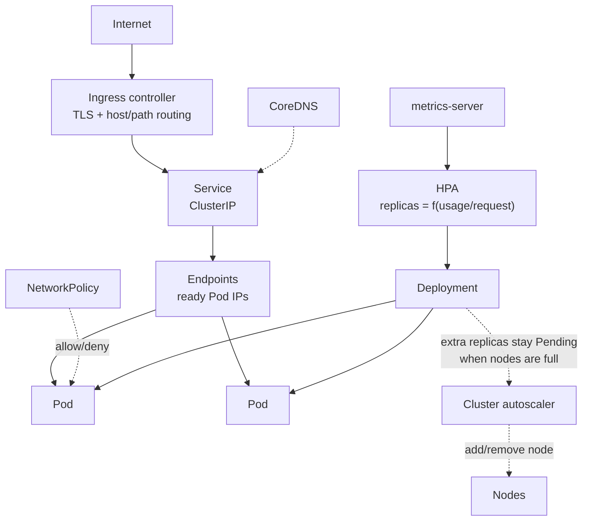

# Kubernetes Networking and Scaling

> **Interview answer (say this first).** Traffic enters a cluster through a **Service** of type LoadBalancer or NodePort, usually fronted by an **Ingress** that routes by host and path and terminates TLS. Inside the cluster, **CoreDNS** resolves Service names, kube-proxy load-balances to ready Pod IPs, and **NetworkPolicies** can restrict which Pods may talk to which. For resources, **requests** tell the scheduler how much to reserve and **limits** cap usage: exceeding a CPU limit causes **throttling**, exceeding a memory limit causes an **OOMKill**. The **HorizontalPodAutoscaler** adds or removes replicas based on metrics, and the **cluster autoscaler** adds or removes nodes when Pods cannot be scheduled.

## Why this exists

A cluster is a shared network and a shared pool of CPU and memory. Two things go wrong without guardrails.

First, **connectivity**. In Kubernetes every Pod can reach every other Pod by default, across namespaces. That is convenient in development and a serious problem in production: a compromised agent worker can reach a database it has no business reading, and a poisoned retrieval result cannot be contained. At the same time, traffic from the internet has to get in somehow, and exposing every Service with its own cloud load balancer is expensive and unmanageable.

Second, **contention**. Pods are scheduled onto shared machines. Without resource declarations, one model-inference Pod can consume a whole node's CPU and starve every neighbour, or allocate memory until the kernel kills something. With declarations, the scheduler can place fairly, the kubelet can enforce limits, and the autoscaler can add capacity where it is actually needed.

This chapter is about the two control systems that make a cluster safe to share: **networking** (how packets reach the right Pod, and which packets are allowed) and **resource governance** (how much each Pod may consume, and how the cluster grows and shrinks).

> **Note:**
>
> **The one-sentence purpose.** Networking decides how requests arrive and who may talk to whom; resource management decides fair shares and how the cluster scales horizontally and vertically.

## Start from zero

| Word | Plain meaning |
| --- | --- |
| **Ingress** | An API object that routes HTTP hosts and paths to Services. Useless without a controller. |
| **Ingress controller** | The actual proxy that watches Ingress objects and serves traffic, such as ingress-nginx. |
| **IngressClass** | A name that says which controller should serve an Ingress. |
| **TLS termination** | Ending HTTPS at the Ingress, then forwarding plain HTTP inside the cluster. |
| **CoreDNS** | The cluster DNS server that resolves Service names to ClusterIPs. |
| **FQDN** | Fully qualified domain name: `<service>.<namespace>.svc.cluster.local`. |
| **NetworkPolicy** | A rule set that allows or denies traffic to and from selected Pods. |
| **CNI plugin** | The component that provides Pod networking and, for some plugins, enforces NetworkPolicy. |
| **Request** | The resources a container is guaranteed; the scheduler sums requests to place Pods. |
| **Limit** | The maximum a container may use; the kubelet enforces it with cgroups. |
| **QoS class** | A label — Guaranteed, Burstable, BestEffort — derived from requests and limits, used for eviction order. |
| **Eviction** | The kubelet terminating Pods to reclaim memory or disk under node pressure. |
| **Throttling** | The kernel slowing a container that hits its CPU limit. The container keeps running, slower. |
| **OOMKill** | The kernel killing a container that exceeds its memory limit. The container restarts. |
| **HPA** | HorizontalPodAutoscaler: adjusts replica count from observed metrics. |
| **metrics-server** | The component that provides CPU and memory metrics for the HPA. |
| **Target utilization** | The percentage of a Pod's request that the HPA aims to keep busy. |
| **Stabilization window** | A delay before the HPA scales down, to avoid flapping on noisy metrics. |
| **Cluster autoscaler** | The component that adds or removes nodes when Pods cannot be placed or nodes are idle. |
| **VPA** | VerticalPodAutoscaler: adjusts a Pod's requests and limits. |
| **KEDA** | An event-driven autoscaler built on HPA that can scale to zero from queues and streams. |
| **PodDisruptionBudget** | A rule limiting how many Pods may be voluntarily disrupted at once. |

Two pairs cause most confusion. First, **Ingress vs Service**: a Service exposes a workload at an IP; an Ingress routes external HTTP traffic to one or more Services. You need both, plus an ingress controller. Second, **request vs limit**: a request is a scheduling promise ("reserve this"), a limit is a runtime cap ("never exceed this"). Setting them equal gives the strongest guarantee; setting only a request leaves the Pod free to burst into idle capacity.

## The core idea

Picture a building. The **Ingress** is the reception desk: it looks at the host and path on the envelope and directs visitors to the right floor. The **Service** is the floor's internal phone number. **CoreDNS** is the directory. **NetworkPolicy** is the set of doors that are actually unlocked between departments. **Requests and limits** are the space each tenant is guaranteed and the maximum they may occupy.

Scaling has two layers that are easy to mix up:

- **Horizontal Pod autoscaling** changes the number of Pods.
- **Cluster autoscaling** changes the number of nodes.

The first responds to load; the second responds to whether the first can find room. If the HPA wants ten Pods and the cluster has capacity for six, six run and four sit Pending until the cluster autoscaler adds a node. Interviewers like this because it tests whether you understand the two loops composing.



Traffic flows down the left side; scaling flows down the right side. The dashed edge into the cluster autoscaler is the composition that matters: the HPA expresses demand by adding replicas, any that cannot be scheduled stay Pending, and the autoscaler adds nodes to make room.

## How it works

Walk the path of one external request, then the resource and scaling loops.

1. **A cloud load balancer forwards traffic to the ingress controller.** A Service of type LoadBalancer gives the controller an external IP; NodePort works too but exposes a fixed, statically allocated port (default range 30000–32767) on every node.
2. **The ingress controller matches the request against Ingress rules.** Host and path decide which backend Service receives it, and TLS is terminated using the certificate in the referenced Secret.
3. **The Service forwards to a ready Pod.** kube-proxy programs node rules that translate the Service ClusterIP to one of the Pod IPs in the EndpointSlice. Not-ready Pods are never selected.
4. **CoreDNS resolves names inside the cluster.** `agent-api` resolves within its own namespace; `agent-api.agent-platform` works from any namespace; the full FQDN always works.
5. **NetworkPolicies filter Pod-to-Pod traffic** if the CNI enforces them. By default all Pods can reach all Pods; once a policy selects a Pod, only explicitly allowed traffic reaches it.
6. **The scheduler places Pods using requests.** It sums the requests already committed on each node, fits the new Pod only where the sum stays within allocatable capacity, and scores the candidates.
7. **The kubelet enforces limits with cgroups.** CPU over the limit is throttled; memory over the limit triggers an OOMKill and the container restarts according to its restart policy.
8. **QoS class decides eviction order under node pressure.** BestEffort Pods are evicted first, then Burstable Pods that exceed their requests, and Guaranteed Pods last.
9. **metrics-server collects CPU and memory usage** from kubelets and serves it through the metrics API.
10. **The HPA compares usage to requests every 15 seconds or so.** It computes a desired replica count from the ratio of current metric to target, clamps it to `minReplicas` and `maxReplicas`, and scales the Deployment.
11. **Scale-down waits for a stabilization window.** By default the HPA reviews several minutes of metrics before removing replicas, so a brief spike does not cause flapping.
12. **The cluster autoscaler watches for Pending Pods.** If Pods cannot be scheduled because nodes are full, it adds a node to the node group; if nodes are consistently underused, it drains and removes one, respecting PodDisruptionBudgets.

> **Tip:**
>
> **The mental shortcut.** When capacity is wrong, ask two questions in order. "Are there enough Pods?" is the HPA. "Is there room for those Pods?" is the cluster autoscaler. Fixing the second without the first, or the reverse, never solves the problem.

## The syntax you will use

**An Ingress with TLS.** Routes a host to a Service and terminates HTTPS with a Secret of type `kubernetes.io/tls`.

```yaml
apiVersion: networking.k8s.io/v1
kind: Ingress
metadata:
  name: agent-api
  namespace: agent-platform
  annotations:
    nginx.ingress.kubernetes.io/proxy-body-size: "8m"
spec:
  ingressClassName: nginx
  tls:
    - hosts:
        - api.example.com
      secretName: agent-api-tls
  rules:
    - host: api.example.com
      http:
        paths:
          - path: /
            pathType: Prefix
            backend:
              service:
                name: agent-api
                port:
                  number: 80
```

`ingressClassName` selects the controller; without a running controller the Ingress does nothing at all.

**A default-deny NetworkPolicy.** Drop all ingress to every Pod in the namespace, then allow only what you name.

```yaml
apiVersion: networking.k8s.io/v1
kind: NetworkPolicy
metadata:
  name: default-deny-ingress
  namespace: agent-platform
spec:
  podSelector: {}
  policyTypes:
    - Ingress
---
apiVersion: networking.k8s.io/v1
kind: NetworkPolicy
metadata:
  name: allow-api-from-ingress
  namespace: agent-platform
spec:
  podSelector:
    matchLabels:
      app: agent-api
  policyTypes:
    - Ingress
  ingress:
    - from:
        - namespaceSelector:
            matchLabels:
              kubernetes.io/metadata.name: ingress-nginx
        - podSelector:
            matchLabels:
              app: agent-worker
      ports:
        - protocol: TCP
          port: 8000
```

Policies are additive allow rules. If the CNI plugin does not enforce NetworkPolicy, these objects are stored but ignored.

**Requests and limits with a clear intent.** Requests drive scheduling; limits cap runtime.

```yaml
# ... Pod spec ...
spec:
  containers:
    - name: api
      image: ghcr.io/acme/agent-api:1.2.3
      resources:
        requests:
          cpu: 250m
          memory: 256Mi
        limits:
          cpu: 1000m
          memory: 512Mi
```

`250m` means 250 millicores, or a quarter of a CPU. Requests below limits make the Pod Burstable; equal requests and limits for every container make it Guaranteed.

**An HPA on CPU utilisation.** Keep average CPU near 70% of each Pod's request, between two and ten replicas.

```yaml
apiVersion: autoscaling/v2
kind: HorizontalPodAutoscaler
metadata:
  name: agent-api
  namespace: agent-platform
spec:
  scaleTargetRef:
    apiVersion: apps/v1
    kind: Deployment
    name: agent-api
  minReplicas: 2
  maxReplicas: 10
  metrics:
    - type: Resource
      resource:
        name: cpu
        target:
          type: Utilization
          averageUtilization: 70
  behavior:
    scaleDown:
      stabilizationWindowSeconds: 300
```

The percentage is measured against the **request**, not the limit, so a Pod without CPU requests cannot be autoscaled on CPU utilisation.

**A PodDisruptionBudget.** Keep at least two API Pods available during voluntary disruptions such as node drains.

```yaml
apiVersion: policy/v1
kind: PodDisruptionBudget
metadata:
  name: agent-api
  namespace: agent-platform
spec:
  minAvailable: 2
  selector:
    matchLabels:
      app: agent-api
```

The cluster autoscaler and `kubectl drain` respect this, so a scale-down cannot take the service below two healthy Pods.

**Useful commands.** Watch placement, pressure, and scaling decisions.

```bash
kubectl get ingress -n agent-platform
kubectl describe ingress agent-api -n agent-platform
kubectl get networkpolicy -n agent-platform
kubectl get hpa -n agent-platform
kubectl top pods -n agent-platform                # needs metrics-server
kubectl describe hpa agent-api -n agent-platform   # shows the scaling calculation
kubectl get events -n agent-platform --field-selector reason=FailedScheduling
```

`describe hpa` shows the current metric, target, and the computed desired replicas, which is the fastest way to debug "why is it not scaling".

## Examples: simple to real

**Example 1 — expose one API through an Ingress.** Install a controller, apply the Ingress, and verify routing and TLS.

```bash
kubectl apply -f https://raw.githubusercontent.com/kubernetes/ingress-nginx/main/deploy/static/provider/cloud/deploy.yaml
kubectl apply -f agent-api-ingress.yaml
kubectl get ingress agent-api -n agent-platform
curl -I https://api.example.com/health
```

Without a controller, the Ingress object exists but no traffic is served. The controller is the component that actually listens.

**Example 2 — debug service discovery with DNS.** Resolve from inside the cluster and from another namespace.

```bash
kubectl run dns --rm -it --image=busybox:1.36 -- nslookup agent-api.agent-platform.svc.cluster.local
kubectl run dns2 --rm -it --image=busybox:1.36 -- nslookup agent-api
kubectl get endpointslices -n agent-platform
```

If the FQDN resolves but the Pod count in the EndpointSlice is zero, the selector or the readiness probe is wrong, not DNS.

**Example 3 — add default-deny and prove the difference.** With no policies, any Pod can reach the database; after default-deny, only the allowed path works.

```bash
kubectl run test --rm -it --image=busybox:1.36 -- nc -zv agent-api 8000
kubectl apply -f default-deny-ingress.yaml
kubectl run test2 --rm -it --image=busybox:1.36 -- nc -zv agent-api 8000   # times out
kubectl apply -f allow-api-from-ingress.yaml
```

The timeout, not a connection refused, is the classic NetworkPolicy symptom: the packet is dropped silently.

**Example 4 — observe an OOMKill and a CPU throttle.** Give a container a small memory limit and watch it restart.

```bash
kubectl get pods -n agent-platform
kubectl describe pod agent-api-7d9c-abcde | grep -i -A3 "Last State"
kubectl logs agent-api-7d9c-abcde --previous
kubectl top pod agent-api-7d9c-abcde
```

`Reason: OOMKilled` with exit code 137 means memory. For CPU, look for throttling in container metrics; the Pod keeps running but latency rises.

**Example 5 — watch the HPA react to load.** Generate load, then follow the replica count.

```bash
kubectl get hpa agent-api -n agent-platform -w
kubectl run load --rm -it --image=busybox:1.36 -- \
  sh -c 'while true; do wget -q -O- http://agent-api/health >/dev/null; done'
kubectl get deploy agent-api -n agent-platform
```

The HPA scales up quickly and scales down after the stabilization window. If it shows `<unknown>` targets, metrics-server is missing or the Pods lack CPU requests.

**Example 6 — the two-loop scale test.** Demand more Pods than the cluster can hold and watch the cluster autoscaler respond.

```bash
kubectl get pods -n agent-platform -o wide | grep Pending
kubectl get events -n agent-platform --field-selector reason=FailedScheduling
kubectl get nodes
```

If Pods stay Pending with `Insufficient cpu`, the HPA is working but the cluster autoscaler is not, or its node group has already hit `maxSize`. The fix is capacity, not a bigger HPA.

## In production

- **An Ingress needs a controller.** Creating the object without a running ingress controller is a silent no-op, and the 404 comes from the controller's default backend, not your app.
- **Do not create one cloud load balancer per Service.** That is expensive and unmanageable. Put one Ingress in front and route by host and path; use LoadBalancer only for non-HTTP traffic.
- **Terminate TLS at the Ingress and rotate the Secret.** Store certificates in a `kubernetes.io/tls` Secret, and use cert-manager or your platform's issuer so rotation is automatic.
- **NetworkPolicy only works if the CNI enforces it.** Verify with a real connectivity test; some default plugins accept the objects and ignore the rules. Start with default-deny ingress, then add allows.
- **Set requests on every container.** The scheduler and the HPA both depend on requests. No CPU request means no CPU-based autoscaling and unreliable placement.
- **CPU limits throttle; memory limits kill.** CPU is compressible, so a throttled Pod slows down. Memory is incompressible, so exceeding the limit is an OOMKill and a restart. For latency-sensitive services, consider generous or omitted CPU limits with strong requests.
- **QoS class decides who dies first under pressure.** Guaranteed (requests == limits) is evicted last; BestEffort is evicted first. Give critical services Guaranteed resources.
- **The HPA target is a percentage of the request, not of the node.** A target of 70% means each Pod should sit near 70% of its requested CPU. Wrong requests give wrong scaling.
- **Scale-down is deliberately slow.** The default stabilization window is about five minutes, so metrics must be steady before replicas are removed. Do not over-tune it to zero, or the deployment flaps.
- **Add capacity before you need it.** Cluster autoscaler node startup takes minutes, and a scale-up from zero can be slower than the traffic spike. Keep a small warm buffer and set sane node group minimums.
- **Do not combine HPA and VPA on the same CPU or memory metric.** They fight over the same signal. Use the VPA in recommendation mode, or split vertical and horizontal scaling across different workloads.
- **Scaling stateful workloads is different.** A StatefulSet scale changes cluster membership, so the application must handle joins, rebalancing, and data movement. Use an operator, scale manually, or accept that stateless tiers do the autoscaling.

## Interview questions

### 1. What is the difference between an Ingress and a Service?

**Answer.** A Service exposes a set of Pods at a stable IP and DNS name, inside or outside the cluster. An Ingress is an HTTP routing layer that maps external hosts and paths to Services, and usually terminates TLS. An Ingress needs an ingress controller to do anything, and it routes to Services, not directly to Pods.

**Follow-up: "When would you skip Ingress?"** For genuine non-HTTP protocols such as a raw TCP service, a database, or UDP. Ingress is an HTTP(S) abstraction; gRPC is HTTP/2 and an ingress controller can route it with the right annotation (for example `nginx.ingress.kubernetes.io/backend-protocol: "GRPC"`), while real L4 traffic needs a LoadBalancer Service or a Gateway API TCPRoute.

**Trap.** Saying "the Ingress load-balances Pods." It forwards to a Service, and the Service forwards to ready Pods. Three layers, not one.

### 2. How does service discovery work inside a cluster?

**Answer.** CoreDNS runs as a Service and resolves names in the cluster domain. `<service>` resolves within the same namespace, `<service>.<namespace>` resolves across namespaces, and `<service>.<namespace>.svc.cluster.local` always works. The name resolves to the Service ClusterIP, and kube-proxy's rules forward to a ready Pod from the EndpointSlice.

**Follow-up: "What about StatefulSet Pods?"** Their per-Pod names resolve through a headless Service, so `postgres-0.postgres.agent-platform.svc.cluster.local` points at Pod 0 specifically.

**Trap.** Hard-coding Pod IPs or the ClusterIP. Both change over time; resolve the Service name every time.

### 3. How do NetworkPolicies work, and what is the default?

**Answer.** By default all Pods can reach all Pods, including across namespaces. A NetworkPolicy selects Pods by label and specifies allowed ingress and egress. Policies are additive allow rules: once a Pod is selected by any policy for a direction, traffic in that direction is denied unless another policy allows it. Enforcement is done by the CNI plugin, not by Kubernetes itself.

**Follow-up: "Why not just use namespaces for isolation?"** Namespaces scope names and RBAC, not packets. Without NetworkPolicies, any namespace can reach any other. You need both.

**Trap.** Assuming a NetworkPolicy blocks egress by default when you wrote only ingress rules. You must include the direction in `policyTypes` and write the rules; otherwise the other direction stays open.

### 4. Explain requests versus limits, and what happens when each is exceeded.

**Answer.** A request is the resource the scheduler reserves and the HPA measures against. A limit is the runtime cap enforced by cgroups. Exceeding a CPU limit causes throttling: the container is slowed, not killed, because CPU is compressible. Exceeding a memory limit causes an OOMKill: the kernel kills the container and it restarts, because memory cannot be reclaimed by slowing down.

**Follow-up: "What are the QoS classes?"** Guaranteed when every container has equal requests and limits for CPU and memory; BestEffort when none are set; Burstable otherwise. Eviction under node pressure goes BestEffort first, then Burstable, then Guaranteed last.

**Trap.** Treating limits as reservations. The scheduler ignores limits when placing Pods, so a cluster full of tiny requests and huge limits is oversubscribed and behaves unpredictably under load.

### 5. How does the HorizontalPodAutoscaler decide to scale?

**Answer.** It reads a metric — commonly CPU utilisation from metrics-server — every 15 seconds or so, computes the ratio of current usage to the target, and multiplies the current replica count by that ratio, rounded up. It clamps the result to `minReplicas` and `maxReplicas` and applies stabilisation windows to smooth the response. For CPU, the target is a percentage of each Pod's requested CPU.

**Follow-up: "What if the target shows `unknown`?"** metrics-server is missing or unreachable, or the containers have no resource requests, so the percentage cannot be computed. Fix metrics first, then scaling.

**Trap.** Autoscaling on CPU for an I/O-bound or LLM-bound service. CPU is flat while requests queue upstream. Scale on the signal that actually correlates with load, such as queue depth or concurrency, using a custom or external metric.

### 6. What is the difference between the HPA and the cluster autoscaler?

**Answer.** The HPA changes the number of Pods in response to load. The cluster autoscaler changes the number of nodes in response to scheduling: it adds a node when Pods are Pending for lack of capacity, and removes an idle node when it can be drained safely. They compose: the HPA creates demand, and the cluster autoscaler supplies the room.

**Follow-up: "What blocks a scale-down?"** A PodDisruptionBudget that cannot be satisfied, a Pod with no controller, local storage, or a Pod that cannot be evicted, all keep a node busy and prevent removal.

**Trap.** Assuming the HPA will scale when nodes are full. It will set the replica count, but the extra Pods stay Pending until capacity arrives. The HPA is not a capacity planner.

### 7. When would you use a VPA or KEDA instead of a plain HPA?

**Answer.** The VPA adjusts a Pod's CPU and memory requests and limits, which is useful when the right size is unknown or changes with the workload; run it in recommendation mode if you also use the HPA on the same metric. KEDA scales on external events such as queue length or stream lag, and can scale to zero, which suits intermittent worker workloads like agent task consumers.

**Follow-up: "Why can VPA and HPA conflict?"** If the VPA changes requests while the HPA scales on utilisation relative to requests, each reacts to the other's change. Use different metrics, different workloads, or VPA recommendations only.

**Trap.** Using the HPA for a workload that should scale to zero. A Deployment's minimum replicas is one, so an idle queue still pays for a Pod; KEDA or a Job-based pattern is the fix.

### 8. Why is scaling a StatefulSet harder than scaling a Deployment?

**Answer.** Adding a replica to a Deployment just adds an identical Pod. Adding one to a StatefulSet adds a new member with a new identity and its own PersistentVolumeClaim, and the software must join it to the cluster: replicate data, rebalance shards, and update membership. Removing one can mean moving data off a departing node. The cluster can create the Pod, but only the application knows how to make it a healthy member.

**Follow-up: "How do teams handle it?"** With an operator that understands the database, or by scaling the stateful tier manually and letting a stateless tier autoscale. Some systems support horizontal scale with minimal coordination, but that is an application property, not a Kubernetes one.

**Trap.** Pointing an HPA at a StatefulSet and assuming it will behave like a Deployment. It will change replicas, but correctness depends entirely on the application's membership protocol.

## Remember this

- **Ingress routes HTTP to Services and needs an ingress controller**; the Service then forwards to ready Pods through EndpointSlices.
- **CoreDNS resolves Service names** (`<service>.<namespace>.svc.cluster.local`); kube-proxy forwards to ready Pods.
- **Pods can reach each other by default**; NetworkPolicy adds default-deny and specific allows, and only works if the CNI enforces it.
- **Requests reserve and limits cap.** CPU limits throttle; memory limits OOMKill. QoS class sets eviction order.
- **HPA changes Pods; cluster autoscaler changes nodes.** They compose, and scaling stateful workloads needs the application's membership logic.
