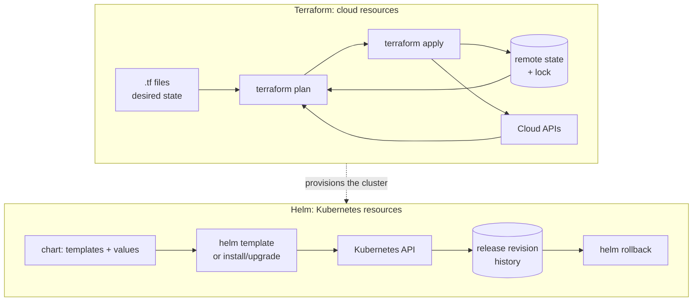

# Infrastructure as Code: Terraform and Helm

> **Interview answer (say this first).** Infrastructure as code means infrastructure is described in **declarative** files that live in version control, pass code review, and are applied by a tool — not clicked in a console. **Terraform** provisions cloud infrastructure: providers talk to APIs, a **state** file records what exists, `plan` shows the diff, and `apply` makes it real. **Helm** packages and deploys Kubernetes manifests: a chart is templates plus values, and each install is a versioned **release** you can roll back. In practice, Terraform builds the cluster and its cloud resources, and Helm installs the application onto it. The two biggest pitfalls are **state** (it holds secrets and must be remote and locked) and **drift** (someone changed the real world by hand).

## Why this exists

Clicking through a cloud console does not scale and does not survive an audit. If the only record of the production network is someone's memory and a few screenshots, then nobody can rebuild it, nobody can review a change, and an incident review cannot answer "what changed?"

Manual infrastructure fails in predictable ways:

- **It is not reproducible.** A second environment comes out subtly different, and "works in staging" stops meaning anything.
- **It is not reviewable.** A console click has no pull request, no diff, and no approval.
- **It drifts.** Someone opens a security group "just for a minute" and never closes it.
- **It is not recoverable.** Rebuilding after a region failure takes days of archaeology.

The same is true one layer up. A Kubernetes deployment made of hand-edited YAML cannot be templated per environment, cannot be versioned as a unit, and has no clean rollback unless you saved the previous file. An AI platform multiplies the problem: many environments, many services, GPU node pools, vector databases, and secrets that must never land in git.

IaC answers with three habits. Describe the desired state, store the description in git, and let a tool compute and apply the difference. Terraform does this for cloud resources; Helm does it for Kubernetes application manifests.

> **Note:**
>
> **The one-sentence purpose.** Declare infrastructure in versioned files, review it like code, and let a tool make reality match — Terraform for cloud resources, Helm for the applications that run on top.

## Start from zero

| Word | Plain meaning |
| --- | --- |
| **Infrastructure as code (IaC)** | Managing infrastructure through declarative, versioned files instead of manual steps. |
| **Declarative** | You describe the end state; the tool works out the steps. |
| **Idempotent** | Running the same configuration again makes no further changes if nothing drifted. |
| **Terraform** | An IaC tool that provisions resources through provider APIs using HCL configuration. |
| **HCL** | HashiCorp Configuration Language: Terraform's block-based configuration syntax. |
| **Provider** | A plugin that knows how to talk to one API, such as AWS, Kubernetes, or Cloudflare. |
| **Resource** | One managed object, such as an S3 bucket or an RDS instance. |
| **State** | Terraform's record mapping configuration to real resource IDs. It is the source of truth for diffs. |
| **Remote backend** | Where state is stored for a team, such as an S3 bucket, instead of a local file. |
| **State locking** | A lock that stops two people applying at once and corrupting state. |
| **Plan** | Terraform's preview of what it will create, change, or destroy. |
| **Apply** | Terraform executing the plan and updating state. |
| **Drift** | A difference between the real world and the configuration, caused by out-of-band change. |
| **Module** | A reusable, versioned bundle of Terraform configuration with inputs and outputs. |
| **Import** | Adopting an existing resource into Terraform state so it can be managed. |
| **Helm** | The package manager for Kubernetes: charts, values, releases, and rollback. |
| **Chart** | A package of Kubernetes templates plus default values and metadata. |
| **Template** | A manifest file with Go-template placeholders filled from values at render time. |
| **Values** | The parameters that fill a chart's templates. |
| **Release** | One installed instance of a chart, tracked with a revision history. |
| **Rollback** | Reinstalling a previous release revision. |
| **Kustomize** | A templating-free way to customize plain YAML with overlays and patches. |
| **SOPS / Sealed Secrets** | Tools that keep encrypted secrets safe in git and decrypt them at apply time. |

Two pairs cause most confusion. First, **Terraform vs Helm**: Terraform manages cloud resources through APIs; Helm manages Kubernetes objects through the API server. They are complementary layers, not competitors. Second, **state vs configuration**: the `.tf` files are your intent, but the state file is what Terraform believes is true. Losing state is worse than losing configuration, because Terraform can regenerate intent but not resource mappings.

## The core idea

Think of two construction roles. **Terraform is the civil engineer**: it lays the foundation, runs the cables, and provisions the land — VPCs, subnets, clusters, databases, load balancers. **Helm is the interior fitter**: given a finished building, it installs the furniture and wires up the rooms — Deployments, Services, ConfigMaps, and their configuration per environment.

Both follow the same loop: declare, compare, reconcile.

- Terraform's loop is `plan` then `apply`, driven by the state file.
- Helm's loop is `install` or `upgrade`, creating a new release revision, with `rollback` as the inverse.

Neither tool is magic, and both are only as good as the review process around them. IaC moves the risk from "someone clicked the wrong button at 2 a.m." to "someone merged a wrong diff", which is a strictly better place for risk to live.



Terraform provisions the cluster; Helm deploys into it. The dashed edge is the handoff between the two tools.

## How it works

Walk Terraform's mechanism, then Helm's.

1. **Terraform reads the configuration and initialises.** `terraform init` downloads providers at the pinned versions and records their hashes in `.terraform.lock.hcl`.
2. **It loads the state** from the configured backend. The state maps each resource block to a real ID, and without it Terraform cannot tell create from update.
3. **It refreshes and builds a plan.** Providers read the current state of each resource, Terraform diffs it against your configuration, and prints what it will create, change, or destroy.
4. **`apply` executes the plan** in dependency order, calls provider APIs, and writes the new state. The lock is held during apply so two runs cannot interleave.
5. **Remote state and locking make this safe for teams.** The backend stores state in shared, encrypted storage, and a lock table or backend mechanism prevents concurrent applies.
6. **Modules package repeated patterns.** A `module` block with `source` and `version` pulls in a reusable bundle, so every team does not rewrite the same VPC.
7. **Drift is detected on the next plan.** If someone widened a security group in the console, `plan` shows a change back to the declared value. Drift is a review signal, not a tool failure.
8. **`import` adopts existing resources.** You describe the resource, import its ID into state, and from then on Terraform manages it.
9. **Helm renders a chart.** It merges the chart's `values.yaml`, any parent values, `-f` files, and `--set` flags in precedence order, then executes Go templates to produce plain manifests.
10. **It applies the manifests and records a release.** Helm sends the rendered objects to the Kubernetes API and stores release metadata and revision history, by default as a Secret in the release namespace.
11. **Upgrades create a new revision.** Helm computes the diff between releases, applies the changes, and stores revision N+1. `helm history` lists them.
12. **Rollback restores a previous revision.** `helm rollback <release> <revision>` re-applies the older rendered manifests, creating a new revision that matches the old one.

> **Tip:**
>
> **The mental shortcut.** Terraform's state is the decider for cloud resources; Helm's release history is the decider for Kubernetes. If you cannot say where the state lives, you are not doing IaC — you are running a one-time script with extra steps.

## The syntax you will use

**A Terraform root module with a remote backend.** Pin versions, store state remotely, and enable locking.

```hcl
terraform {
  required_version = ">= 1.6.0"
  required_providers {
    aws = {
      source  = "hashicorp/aws"
      version = "~> 5.0"
    }
  }
  backend "s3" {
    bucket       = "acme-tfstate"
    key          = "agent-platform/terraform.tfstate"
    region       = "us-east-1"
    use_lockfile = true
    encrypt      = true
  }
}

provider "aws" {
  region = var.region
}

variable "region" {
  type    = string
  default = "us-east-1"
}

resource "aws_s3_bucket" "artifacts" {
  bucket = "acme-agent-artifacts"
}

output "artifacts_bucket" {
  value = aws_s3_bucket.artifacts.bucket
}
```

The backend block stores state centrally; `use_lockfile = true` gives S3-native locking (Terraform 1.10+), and `encrypt = true` protects the state, which can contain sensitive values. Older configurations locked with a DynamoDB table (`dynamodb_table = "..."`), which is now legacy.

**Using a module.** Reference a versioned, reusable bundle instead of copying configuration.

```hcl
module "vpc" {
  source  = "terraform-aws-modules/vpc/aws"
  version = "5.8.1"

  name = "agent-platform"
  cidr = "10.0.0.0/16"
  azs  = ["us-east-1a", "us-east-1b"]

  private_subnets = ["10.0.1.0/24", "10.0.2.0/24"]
}
```

Pin module versions exactly as you pin providers, so an upstream change cannot surprise an apply.

**The Terraform commands that matter.** Plan, review, apply the saved plan, and inspect state.

```bash
terraform init
terraform fmt -recursive
terraform validate
terraform plan -out=tfplan
terraform apply tfplan
terraform output -json
terraform state list
terraform import aws_s3_bucket.artifacts acme-agent-artifacts
```

Applying the exact plan you reviewed with `apply tfplan` closes the gap between "what was reviewed" and "what ran".

**A Helm chart's metadata.** `Chart.yaml` names the chart and versions the package separately from the app.

```yaml
apiVersion: v2
name: agent-api
description: A Helm chart for the agent API
type: application
version: 1.2.3
appVersion: "1.2.3"
```

`version` is the chart version; `appVersion` is the application version. They move independently because the templates can change without the app changing.

**Default values.** `values.yaml` holds the defaults that environment files override.

```yaml
replicaCount: 3
image:
  repository: ghcr.io/acme/agent-api
  tag: "1.2.3"
  pullPolicy: IfNotPresent
resources:
  requests:
    cpu: 250m
    memory: 256Mi
  limits:
    memory: 512Mi
```

`helm install` uses these unless a values file or `--set` overrides them.

**A templated manifest (chart file).** Go templates read values and produce a manifest at render time. This fence is a template, not valid YAML on its own.

```gotemplate
apiVersion: apps/v1
kind: Deployment
metadata:
  name: {{ include "agent-api.fullname" . }}
  labels:
    app.kubernetes.io/name: {{ include "agent-api.name" . }}
spec:
  replicas: {{ .Values.replicaCount }}
  selector:
    matchLabels:
      app.kubernetes.io/name: {{ include "agent-api.name" . }}
  template:
    metadata:
      labels:
        app.kubernetes.io/name: {{ include "agent-api.name" . }}
    spec:
      containers:
        - name: api
          image: "{{ .Values.image.repository }}:{{ .Values.image.tag }}"
          imagePullPolicy: {{ .Values.image.pullPolicy }}
          resources:
            {{- toYaml .Values.resources | nindent 12 }}
```

`{{ .Values.replicaCount }}` is plain substitution; `toYaml ... | nindent 12` renders the resources block with correct indentation, which is the idiomatic way to pass structured values.

**What the template renders into.** The interesting part is a valid YAML fragment.

```yaml
spec:
  replicas: 3
  template:
    spec:
      containers:
        - name: api
          image: "ghcr.io/acme/agent-api:1.2.3"
          imagePullPolicy: IfNotPresent
          resources:
            limits:
              memory: 512Mi
            requests:
              cpu: 250m
              memory: 256Mi
```

Rendering keeps the chart honest: `helm template` shows exactly what will be applied, with no cluster access required.

**The Helm commands that matter.** Preview, install, upgrade, inspect, and roll back.

```bash
helm lint ./agent-api
helm template agent-api ./agent-api -f values-prod.yaml
helm install agent-api ./agent-api -n agent-platform --create-namespace
helm upgrade --install agent-api ./agent-api -f values-prod.yaml -n agent-platform
helm history agent-api -n agent-platform
helm rollback agent-api 1 -n agent-platform
helm uninstall agent-api -n agent-platform
```

`upgrade --install` is idempotent for CI: it installs on the first run and upgrades afterwards.

**Kustomize for plain-YAML customization.** No templates; overlays patch a base.

```yaml
apiVersion: kustomize.config.k8s.io/v1beta1
kind: Kustomization
resources:
  - deployment.yaml
  - service.yaml
images:
  - name: ghcr.io/acme/agent-api
    newTag: "1.2.4"
patches:
  - path: replicas-patch.yaml
```

Apply it with `kubectl apply -k ./overlays/prod`. This is the right tool when you want reviewable plain YAML with small per-environment patches.

## Examples: simple to real

**Example 1 — provision one bucket with the plan/apply loop.** Never apply without reading the plan.

```bash
terraform init
terraform plan -out=tfplan
# review the plan: 1 to add, 0 to change, 0 to destroy
terraform apply tfplan
terraform output artifacts_bucket
```

Run `plan` again with no changes: it should report "No changes", which is idempotence.

**Example 2 — read drift from a plan.** Change a tag or setting in the console, then plan without changing code.

```bash
terraform plan -refresh-only
terraform plan -detailed-exitcode      # exit 2 means changes are pending
```

Either revert the manual change or update the configuration to match, deliberately. Do not ignore drift.

**Example 3 — adopt an existing bucket with import.** Describe the resource, then import its real ID.

```bash
# add the resource block to main.tf first
terraform import aws_s3_bucket.artifacts acme-agent-artifacts
terraform plan
```

The plan should now be empty. Import reconciles state; it does not create the resource.

**Example 4 — render a chart before installing it.** Catch template errors and inspect the exact output for an environment.

```bash
helm lint ./agent-api
helm template agent-api ./agent-api -f values-prod.yaml > rendered.yaml
grep -n "image:" rendered.yaml
kubectl apply --dry-run=server -f rendered.yaml
```

`--dry-run=server` asks the API server to validate the rendered objects without persisting them, which catches schema errors early.

**Example 5 — install, upgrade, and roll back a release.** The revision history is the rollback mechanism.

```bash
helm install agent-api ./agent-api -n agent-platform --create-namespace
helm upgrade agent-api ./agent-api --set image.tag=1.2.4 -n agent-platform
helm history agent-api -n agent-platform
helm rollback agent-api 1 -n agent-platform
kubectl rollout status deploy/agent-api -n agent-platform
```

Rollback re-applies the previous rendered manifests and records a new revision, so the history stays linear and auditable.

**Example 6 — choose Helm or Kustomize deliberately.** Practise the distinction.

```text
Distribute a reusable package with parameters   -> Helm chart
Versioned releases with one-command rollback    -> Helm
Small per-environment patches to owned YAML     -> Kustomize
Keep manifests as plain, reviewable YAML        -> Kustomize
Dynamic logic, loops, conditionals in templates -> Helm (Go templates)
```

Many platforms use both: Helm to install third-party components, Kustomize for their own services.

## In production

- **Remote state, always, with locking enabled.** Local state means one person can apply and lose the file. Use a shared encrypted backend plus a lock mechanism, and treat the state as production data.
- **Remember that state contains secrets in plaintext.** Provider credentials, database passwords, and generated keys can land in state. Encrypt the backend, restrict access with IAM, and never commit state to git.
- **Pin provider and module versions, and commit the lock file.** `.terraform.lock.hcl` records provider hashes. Floating versions make builds non-reproducible.
- **Review the plan in CI, apply from CI.** A human-readable plan in the pull request and a single apply path removes the "works on my laptop" failure mode and creates an audit trail.
- **Use `-out` and apply the saved plan.** This guarantees that what was reviewed is exactly what runs, even if the world changed in between.
- **Detect drift on a schedule.** A nightly `plan` that fails on unexpected changes surfaces manual edits before they become incidents.
- **Never edit managed resources by hand.** Change the configuration or import the resource. Manual edits are the number-one source of drift.
- **Protect critical resources with lifecycle rules.** `prevent_destroy` stops an accidental apply from deleting a database, and `create_before_destroy` reduces downtime for replacements.
- **Helm values belong in files, not long `--set` strings.** A committed `values-prod.yaml` is reviewable; a shell history full of `--set` is not. `--set` is for small overrides only.
- **Run `helm template` or `helm diff` in CI.** It catches template errors and shows the change set before anything touches the cluster.
- **Watch Helm release storage.** Each revision is stored as a Secret in the release namespace, and Helm caps history at `--history-max` revisions (default 10), pruning older ones on each upgrade. Lower it if Secret count or size matters.
- **Never put secrets in values or charts.** Use an external secrets operator, SOPS-encrypted files, or a secret manager, and keep only references in the chart. Terraform can create the secret, but the value must not sit in git.

## Interview questions

### 1. What does infrastructure as code actually buy you?

**Answer.** Reproducibility, reviewability, and recoverability. The environment is described in files, so it can be rebuilt; changes go through pull requests, so they are reviewed before they happen; and the history is auditable, so incident reviews can see what changed. It also makes idempotent re-application safe, which is what makes automation trustworthy.

**Follow-up: "What does it cost?"** Upfront design, state management, and discipline. You trade a fast manual click for a reviewable change. The payoff comes at the second environment and the first incident.

**Trap.** Calling a collection of shell scripts IaC. Scripts are usually imperative and not idempotent; rerunning them can double-create or fail halfway. Declarative tools converge.

### 2. What is Terraform state, and why is it the critical piece?

**Answer.** State maps the resources declared in configuration to the real IDs in the cloud. It lets Terraform know whether a resource must be created, updated, or destroyed, and it stores attributes that cannot be re-derived. Losing state means Terraform may try to recreate resources that already exist, and state can contain sensitive values, so it must be remote, encrypted, and locked.

**Follow-up: "How do you share state safely across a team?"** Use a remote backend such as S3 with server-side encryption and a locking mechanism — S3-native `use_lockfile` (Terraform 1.10+) or, on older versions, a DynamoDB table — plus IAM that limits who can read and write it. Never commit the state file.

**Trap.** Treating state as a build artifact to delete and regenerate. Regenerating works only if every resource can be re-imported, which is rarely true and dangerous on databases.

### 3. What is drift, and how do you handle it?

**Answer.** Drift is any difference between the declared configuration and the real world, usually caused by manual changes outside Terraform. The next `plan` shows it as a change back to the declared value. You handle it by deciding deliberately: revert the manual change, or update the configuration so the new state is intentional, then apply.

**Follow-up: "How do you detect drift before it causes an incident?"** Run a scheduled `plan`, ideally `terraform plan -refresh-only -detailed-exitcode`, and alert when it is non-empty. That turns silent divergence into a visible signal.

**Trap.** Applying without reading the plan and discovering a `destroy` in the list. Drift plus an automated apply is how production resources get deleted.

### 4. When do you use a Terraform module?

**Answer.** When the same pattern — a VPC, an EKS cluster, an RDS instance with sensible defaults — is repeated. A module packages that configuration with inputs and outputs, and versions it so consumers can upgrade deliberately. Use a module when there is a real repeated pattern and a clear interface; do not wrap every single resource in a module for its own sake.

**Follow-up: "How do you version and consume modules?"** Reference a registry or Git source with an explicit version, and commit the resulting lock file where applicable. Upgrades become a reviewable version bump rather than an accidental pull of the latest.

**Trap.** Forking a module and editing it locally. You lose upstream fixes and create a silent fork. Contribute upstream or use a new module with a clean interface.

### 5. What is a Helm chart, and what is a release?

**Answer.** A chart is a package: Kubernetes manifest templates plus default values and metadata. A release is one installed instance of that chart in a namespace, tracked with revisions. Installing creates revision 1; each upgrade creates the next revision; rollback re-applies an earlier revision and records a new one. That release history is what makes Helm more than a template engine.

**Follow-up: "Where does Helm store release state?"** By default, in a Secret in the release namespace. That is why `helm list` is namespace-aware, and why each revision is a Secret that Helm prunes to keep only `--history-max` (default 10) of them.

**Trap.** Thinking `helm template` and `helm install` are interchangeable. `template` only renders; `install` also records and tracks the release, which is what enables history and rollback.

### 6. How does Helm values precedence work?

**Answer.** Values merge from least to most specific: the chart's `values.yaml` first, then parent chart values in the case of subcharts, then `-f` files in the order given (later files win), and finally `--set` flags, which win last. Understanding the order is what lets you keep a base values file and override a few fields per environment.

**Follow-up: "Why prefer a values file over `--set`?"** A committed file is reviewable, diffable, and repeatable. `--set` lives in shell history, is easy to mistype, and does not show up in review.

**Trap.** Putting secrets in values files. Values are rendered into manifests, stored in release history, and often committed. Use an external secret mechanism and reference it.

### 7. Helm versus raw manifests versus Kustomize — how do you choose?

**Answer.** Raw manifests are simple and transparent but duplicate heavily across environments. Kustomize keeps plain YAML and applies small overlays and patches, so the base stays reviewable and customization stays declarative with no templating language. Helm adds templating, packaging, values, dependencies, and release history with rollback. Choose Helm to distribute reusable packages or to get versioned releases; choose Kustomize for your own services where plain YAML and small patches are enough.

**Follow-up: "Can they be combined?"** Yes, and often are. Helm installs third-party software; Kustomize patches the output or the cluster's own manifests. The risk is two customization systems over the same objects, so keep ownership clear.

**Trap.** Reaching for Go templates when all you need is a different replica count per environment. Template logic is power and complexity; use the smallest tool that fits.

### 8. How do you handle secrets in an IaC pipeline?

**Answer.** Never commit plaintext. Keep secrets out of Terraform variables and Helm values that land in git or state. Use a secret manager such as Vault or AWS Secrets Manager, reference it from the configuration, and let the runtime fetch the value. For Kubernetes, use an external secrets operator, Sealed Secrets, or SOPS-encrypted files that decrypt at apply time. Encrypt remote state and restrict who can read it, because Terraform state can contain secret values.

**Follow-up: "Can Terraform create the secret?"** Yes, it can create the secret object or the secret manager entry, but the secret value should come from a secure source at apply time, not from a literal in the configuration. Even then, the value may be stored in state, so protect the state.

**Trap.** Assuming `sensitive = true` in Terraform hides a value. It only redacts CLI output; the value is still written to state in plaintext.

## Remember this

- **IaC is declarative, versioned, and reviewed.** Terraform provisions cloud resources; Helm deploys Kubernetes applications.
- **Terraform state is the critical artifact.** Keep it remote, encrypted, and locked, and remember it can contain secrets in plaintext.
- **`plan` before `apply`**, apply the saved plan, and treat any unexpected `destroy` as a stop signal. Drift is detected on the next plan.
- **Helm packages templates and values into releases** with revision history and one-command rollback; prefer values files over `--set`.
- **Use the smallest customization tool that fits**: raw manifests, then Kustomize overlays, then Helm when you need packaging and releases.
