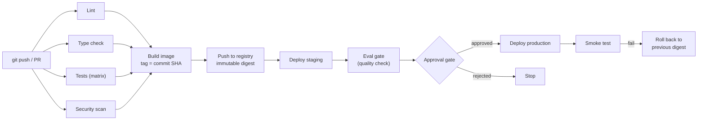

# CI/CD with GitHub Actions

> **Interview answer (say this first).** GitHub Actions is event-driven automation defined in YAML under `.github/workflows/`. A workflow has triggers (`on`), one or more jobs, and each job runs steps on a runner. CI runs lint, type checks, tests, and scans on every change; CD builds a single immutable image, promotes it by digest, and deploys through environments protected by required reviewers. Use least-privilege `permissions`, OIDC instead of stored cloud keys, caches keyed on the lockfile, and `concurrency` so a new push cancels an old CI run but never a deploy in progress.

## Why this exists

A release should not depend on someone remembering ten steps at 6 p.m. on a Friday. The manual version looks like this:

```text
ssh prod
git pull
pip install -r requirements.txt
pytest                 # sometimes skipped
systemctl restart app
```

Every line is a chance to make a mistake. Skip `pytest` and a broken build ships. Forget `pip install` and the service restarts into an import error. Forget to restart and the old code keeps running. Nobody can say which commit is live.

For AI services the problem is worse, because more than code can change. A prompt template, a model version, a retrieval index, or an embedding model can all change behaviour without changing application code. If a prompt edit skips review and evaluation, you can ship a quality regression that unit tests will never catch.

GitHub Actions replaces the manual ritual with a pipeline that runs the same steps, in the same order, in a clean environment, on every change. The gains are concrete:

- **Fast feedback.** A typo is caught in minutes, not after a deploy.
- **A protected `main`.** Broken code cannot merge if required checks fail.
- **Traceability.** Every running version maps to a commit SHA and an image digest.
- **Reversibility.** Rolling back means deploying the previous immutable digest.

## Start from zero

| Word | Plain meaning |
| --- | --- |
| **CI** | Continuous integration: automatically verify every change by building and testing it. |
| **Continuous delivery** | Every passing change is always deployable; the final deploy is a deliberate action. |
| **Continuous deployment** | Every passing change is deployed automatically, with no human step. |
| **Workflow** | One automation file, usually under `.github/workflows/*.yml`. |
| **Trigger** | The event that starts a workflow: `push`, `pull_request`, `schedule`, `workflow_dispatch`. |
| **Job** | A group of steps that run on one runner. Jobs run in parallel unless ordered by `needs`. |
| **Step** | One command (`run:`) or one reusable action (`uses:`) inside a job. |
| **Action** | A reusable, versioned unit of automation, referenced with `uses:`. |
| **Runner** | The machine or container a job executes on, such as `ubuntu-latest`. |
| **Matrix** | Running one job over combinations, such as several Python versions. |
| **Artifact** | A file a job stores for later: an image, a wheel, a test report. |
| **Secret** | An encrypted value injected at run time and masked in logs. |
| **Environment** | A named target (staging, production) with its own secrets and reviewers. |
| **OIDC** | A short-lived token the workflow exchanges for cloud credentials, replacing stored keys. |
| **Provenance** | Signed metadata describing how and from what an artifact was built. |
| **Digest** | A content hash such as `sha256:...` that names an immutable image. |

## The core idea

Think of an assembly line with quality gates. Every commit enters at one end. It is inspected (lint, types, tests, scans), assembled into a sealed package (the image), stamped with a serial number (the commit SHA), and only then moved to the shipping dock. The same sealed package goes to staging and production. Nothing is rebuilt at the destination, because rebuilding would produce a slightly different package.

That rule has a name: **build once, promote everywhere.** The digest that passed tests is the digest that runs in production. If you rebuild per environment, you are shipping an artifact that no test has seen.



The CI half is the left side: cheap checks run in parallel and must pass. The CD half is the right side: one build, then promotion through gates. The eval gate is the AI-specific addition — a check that the change did not make the model or agent worse. In one line: **CI answers "is it correct?", CD answers "is it running?".**

## How it works

Walk through one full run, from push to production.

1. **A trigger fires.** A push to `main`, a pull request, a schedule, or a manual `workflow_dispatch`.
2. **The runner checks out code.** `actions/checkout` clones the exact commit into the job's workspace.
3. **The runtime and dependencies are installed.** `actions/setup-python` installs Python and can restore a pip cache keyed by your requirements files.
4. **Cheap checks run first, in parallel jobs.** Lint and type checks finish in seconds to tens of seconds; tests run at the same time, not after.
5. **A matrix repeats the test job** over several Python versions. `fail-fast: false` lets every combination finish so you see all failures at once.
6. **Security scans run.** Dependency audit, container scan, and secret scan are separate jobs or steps, and can be allowed to fail during adoption.
7. **The image is built once** and pushed to a registry, tagged with the commit SHA. The push returns a digest, which is the artifact's real identity and is passed to later jobs.
8. **The eval gate runs** for AI changes: a fixed suite of prompts and checks compared against a baseline with a pass threshold.
9. **Migrations run before the new code**, once, in a dedicated job. They must be backwards compatible so old and new code coexist.
10. **Environments control promotion.** A GitHub Environment can require reviewers before the production job starts and holds production secrets.
11. **Deploy by digest, then smoke test.** A quick check catches a bad rollout before users report it.
12. **Roll back by redeploying the previous digest.** Because the artifact is immutable, rollback is a pointer change, not a rebuild.

> **The mental shortcut.** CI is a gate, CD is a conveyor. Order the pipeline so the cheapest checks fail first, and never rebuild the artifact you already tested.

## The syntax you will use

**A workflow skeleton.** `on` defines triggers, `permissions` sets the token's least privilege, and `jobs` holds the work.

```yaml
name: CI

on:
  push:
    branches: [main]
  pull_request:
  workflow_dispatch:          # a manual "Run workflow" button

permissions:
  contents: read              # the token can read the repo and nothing more
```

`contents: read` at the top is least privilege. Widen it only in the jobs that need more.

**Job graph with `needs`.** Jobs run in parallel by default; `needs` creates an ordering edge.

```yaml
jobs:
  lint:
    runs-on: ubuntu-latest
    steps:
      - uses: actions/checkout@v7
      - uses: actions/setup-python@v7
        with: { python-version: "3.12" }
      - run: pip install ruff mypy
      - run: ruff check .
      - run: mypy app

  test:
    needs: lint
    runs-on: ubuntu-latest
    steps:
      - uses: actions/checkout@v7
      - uses: actions/setup-python@v7
        with: { python-version: "3.12", cache: pip }
      - run: pip install -r requirements-dev.txt
      - run: pytest -q
```

A job that fails stops its dependents. Lint failing means tests never start, which saves runner minutes.

**A matrix with caching.** One job definition, several combinations; `fail-fast: false` reports every failure.

```yaml
  test-matrix:
    runs-on: ubuntu-latest
    strategy:
      fail-fast: false
      matrix:
        python-version: ["3.11", "3.12", "3.13"]
    steps:
      - uses: actions/checkout@v7
      - uses: actions/setup-python@v7
        with:
          python-version: ${{ matrix.python-version }}
          cache: pip
          cache-dependency-path: requirements*.txt
      - run: pip install -r requirements-dev.txt && pytest -q
```

`cache: pip` keys the cache on the dependency files you list, so a changed lockfile gets a fresh cache.

**Build once and publish an immutable image.** The job exposes the digest as an output for later jobs.

```yaml
  build:
    needs: test
    runs-on: ubuntu-latest
    permissions:
      contents: read
      packages: write
    outputs:
      digest: ${{ steps.build.outputs.digest }}
    steps:
      - uses: actions/checkout@v7
      - uses: docker/setup-buildx-action@v4
      - uses: docker/login-action@v4
        with:
          registry: ghcr.io
          username: ${{ github.actor }}
          password: ${{ secrets.GITHUB_TOKEN }}
      - uses: docker/build-push-action@v7
        id: build
        with:
          context: .
          push: true
          tags: ghcr.io/acme/app:${{ github.sha }}
          cache-from: type=gha
          cache-to: type=gha,mode=max
          provenance: true
          sbom: true
```

`provenance` and `sbom` attach build metadata and a component list to the image. `id: build` lets later jobs read `steps.build.outputs.digest`.

**An eval gate.** A job that fails the pipeline when quality drops, using a script that exits non-zero.

```yaml
  eval:
    needs: build
    runs-on: ubuntu-latest
    steps:
      - uses: actions/checkout@v7
      - uses: actions/setup-python@v7
        with: { python-version: "3.12", cache: pip }
      - run: pip install -r requirements-dev.txt
      - run: python -m evals.run --suite smoke --baseline evals/baseline.json
        env:
          MODEL_API_KEY: ${{ secrets.MODEL_API_KEY }}
```

The eval suite compares scores against a stored baseline and exits non-zero if the change is worse than the threshold. That is what makes an eval a gate rather than a report.

**Environment protection and OIDC.** `environment:` binds a job to a named target; `id-token: write` enables passwordless cloud auth.

```yaml
  deploy:
    needs: [build, eval]
    runs-on: ubuntu-latest
    environment:
      name: production
      url: https://app.example.com
    permissions:
      id-token: write
      contents: read
    steps:
      - uses: actions/checkout@v7
      - uses: aws-actions/configure-aws-credentials@v6
        with:
          role-to-assume: arn:aws:iam::123456789012:role/gha-deploy
          aws-region: us-east-1
      - run: ./scripts/deploy.sh "ghcr.io/acme/app@${{ needs.build.outputs.digest }}"
```

The environment's required reviewers appear as an approval prompt before this job starts. No long-lived cloud key is stored in GitHub.

**Concurrency: cancel CI, never cancel a deploy.** A concurrency group serialises runs that share a name.

```yaml
concurrency:
  group: ci-${{ github.ref }}
  cancel-in-progress: true          # use false for any workflow that deploys
```

For a deploy workflow set `cancel-in-progress: false`, or a mid-flight rollout can be cancelled and leave part of the fleet on the old version.

## Examples: simple to real

**Example 1 — the smallest useful CI.** One job, three commands. This alone catches most mistakes.

```yaml
name: CI
on: [push, pull_request]
jobs:
  test:
    runs-on: ubuntu-latest
    steps:
      - uses: actions/checkout@v7
      - uses: actions/setup-python@v7
        with: { python-version: "3.12", cache: pip }
      - run: pip install -r requirements-dev.txt
      - run: pytest -q
```

Start here, then add jobs only when the pipeline gets slow.

**Example 2 — a security scan that reports but does not block at first.** Allow failure while you clear the backlog, then remove `continue-on-error`.

```yaml
  scan:
    runs-on: ubuntu-latest
    continue-on-error: true        # remove once the backlog is clear
    steps:
      - uses: actions/checkout@v7
      - uses: actions/setup-python@v7
        with: { python-version: "3.12" }
      - run: pip install pip-audit
      - run: pip-audit -r requirements.txt
```

Dependency auditing belongs in CI because a vulnerable library is a production risk even if your own code is correct.

**Example 3 — build, test, scan, publish, deploy in order.** Each stage is a job, and each later stage consumes the previous stage's artifact.

```yaml
name: Release
on:
  push:
    branches: [main]

concurrency:
  group: release-${{ github.ref }}
  cancel-in-progress: false

jobs:
  test:
    runs-on: ubuntu-latest
    steps:
      - uses: actions/checkout@v7
      - uses: actions/setup-python@v7
        with: { python-version: "3.12", cache: pip }
      - run: pip install -r requirements-dev.txt
      - run: pytest --cov=app --cov-report=xml
      - uses: actions/upload-artifact@v7
        if: always()
        with: { name: coverage, path: coverage.xml, retention-days: 7 }

  build:
    needs: test
    runs-on: ubuntu-latest
    permissions: { contents: read, packages: write }
    outputs:
      digest: ${{ steps.build.outputs.digest }}
    steps:
      - uses: actions/checkout@v7
      - uses: docker/setup-buildx-action@v4
      - uses: docker/login-action@v4
        with:
          registry: ghcr.io
          username: ${{ github.actor }}
          password: ${{ secrets.GITHUB_TOKEN }}
      - uses: docker/build-push-action@v7
        id: build
        with:
          context: .
          push: true
          tags: ghcr.io/acme/app:${{ github.sha }}
          cache-from: type=gha
          cache-to: type=gha,mode=max

  migrate:
    needs: build
    runs-on: ubuntu-latest
    environment: production
    steps:
      - uses: actions/checkout@v7
      - run: ./scripts/migrate.sh
        env: { DATABASE_URL: "${{ secrets.DATABASE_URL }}" }

  deploy:
    needs: [build, migrate]
    runs-on: ubuntu-latest
    environment:
      name: production
      url: https://app.example.com
    steps:
      - uses: actions/checkout@v7
      - run: ./scripts/deploy.sh "ghcr.io/acme/app@${{ needs.build.outputs.digest }}"
      - run: ./scripts/smoke-test.sh https://app.example.com
```

The `needs` edges encode the order: nothing ships unless tests pass, and the smoke test is the final gate.

**Example 4 — rollback is a redeploy.** Because images are immutable, reverting means pointing at an older digest.

```bash
# Find the last good release, then deploy it again by digest.
./scripts/deploy.sh "ghcr.io/acme/app@${PREVIOUS_DIGEST}"
```

Keep the digests of recent good releases in a release note, a deployment record, or the container registry's tags, so the rollback target is never guessed. The same digest is referenced at every stage, so staging and production differ only in injected configuration.

## In production

- **Build once and promote the same digest.** Rebuilding per environment ships an artifact tests never saw. Tag by commit SHA and deploy by digest.
- **Pin your tools.** Floating action versions and un-pinned `pip install` make builds non-deterministic. Use a lockfile and pin actions to a major version or a commit SHA.
- **Cache dependencies, keyed on the lockfile.** `cache: pip` turns a multi-minute install into seconds. A wrong cache key silently serves stale packages, so include every requirements file.
- **Separate CI from CD in the graph.** Every pull request runs CI; only merges to `main` build and deploy. Do not deploy from a feature branch.
- **Withhold secrets from fork pull requests.** Repository secrets are not exposed to `pull_request` runs from forks by default. Keep it that way and never use `pull_request_target` to run untrusted code with secrets.
- **Use OIDC, not static cloud keys.** A short-lived credential cannot leak from a repository secret, and it is scoped to the workflow and repository. Grant the assumed role the minimum permissions.
- **Gate with required checks, not good intentions.** A pipeline nobody must pass is a suggestion. Require lint, type, and test jobs in branch protection.
- **Treat eval results as a gate with a threshold.** Store a baseline, compare scores, and fail when a change drops quality. Log the scores as an artifact even on success.
- **Never run migrations from application startup.** With several replicas they race. Run one migration job before the rollout, and make migrations backwards compatible.
- **Keep deploy concurrency serialised.** Two deploys of the same service at once can interleave and leave a mixed fleet. Set `cancel-in-progress: false` for deploys.
- **Watch for registry name casing.** Registry paths must be lowercase, but `${{ github.repository }}` preserves case. Lowercase it before using it as an image name, or the push fails.

## Interview questions

### 1. What is the difference between continuous delivery and continuous deployment?

**Answer.** Both require every passing change to be deployable. In continuous delivery the last promotion to production is a deliberate action, often behind an approval gate. In continuous deployment even that step is automatic, so a merge to `main` can reach users within minutes. Continuous deployment needs strong automated tests and fast rollback because no human reviews each release.

**Follow-up: "Why choose delivery over deployment?"** Regulated products, expensive migrations, or low release frequency make a human gate worth the delay. The pipeline is identical; only the last step differs.

**Trap.** Saying continuous delivery means "deploy to production on every commit." That is continuous deployment. Delivery stops one step short.

### 2. How does a GitHub Actions workflow map to workflow, job, and step?

**Answer.** A **workflow** is one YAML file with triggers and a set of jobs. A **job** is a group of steps that run together on one runner; jobs are isolated and run in parallel unless `needs` orders them. A **step** is one `run:` command or one `uses:` action inside a job. Steps in a job share the workspace and run in order; jobs do not share a filesystem, so they pass data through artifacts, outputs, or the cache.

**Follow-up: "How do two jobs share a value?"** Either a job declares `outputs:` that read a step's output, and a later job consumes it via `needs.<job>.outputs`, or a job uploads an artifact that the next job downloads.

**Trap.** Assuming jobs share state. Each job gets a fresh runner, so a file written in one job is gone in the next unless you upload it.

### 3. How do you get cloud credentials into a pipeline safely?

**Answer.** Prefer OIDC over stored keys. The job requests a short-lived OIDC token, the cloud provider validates it against a trust policy on a role, and the job receives temporary credentials. The trust policy restricts which repository, branch, and workflow may assume the role. If you must use a static secret, store it as an encrypted CI secret, scope it to the narrowest environment, mask it in logs, and rotate it.

**Follow-up: "What does the workflow need?"** The OIDC call requires `permissions: id-token: write`, and the cloud side needs a role whose trust policy allows the provider's OIDC issuer and the repository's claims.

**Trap.** Using `pull_request_target` with secrets and checking out untrusted fork code. That combination runs attacker-controlled code with your credentials.

### 4. Why cache dependencies, and what goes wrong with caching?

**Answer.** Restoring a virtual environment or package cache often dominates pipeline time; a cache keyed on the lockfile turns minutes into seconds. The failure mode is a stale or broad cache key that serves old packages and hides a real dependency problem. Key on the hash of every dependency file, and keep a way to bust the cache by bumping the key.

**Follow-up: "Would you cache the container build too?"** Yes. BuildKit's `cache-from` and `cache-to` cache image layers, so an unchanged layer is not rebuilt. Layer ordering matters: copy dependency files and install before copying source so source edits do not invalidate the dependency layer.

**Trap.** Caching build artifacts instead of dependencies. The point of the pipeline is to build from source each run; caching the output risks shipping a stale artifact.

### 5. What belongs in CI versus CD?

**Answer.** CI runs on every commit and pull request: lint, type check, unit and integration tests, and security scanning. It must be fast and must not touch production. CD runs on merges to the main branch: build the image once, push it, run migrations, deploy to staging, gate, deploy to production, and smoke test. The artifact is created in CI but promoted in CD.

**Follow-up: "Where do end-to-end tests go?"** Against the staging deployment, after the image is built, because they need real dependencies. Run a fast subset on pull requests and the full suite before production.

**Trap.** Deploying to production from a pull-request workflow. Fork pull requests can run untrusted code, so giving them deploy credentials is a serious hole.

### 6. How do you add an evaluation gate for an AI change?

**Answer.** Run a fixed eval suite against the new prompt, model, or code and compare its scores to a stored baseline. The job exits non-zero when the score drops past a threshold, so the pipeline fails like any failing test. Keep the suite stable and versioned so a score change means a system change. Log the per-example results as an artifact so a failure is diagnosable.

**Follow-up: "How do you avoid a flaky eval gate?"** Use deterministic or temperature-zero settings where possible, run enough samples to bound variance, and set thresholds from observed noise rather than a single run. Flaky evals erode trust faster than no evals.

**Trap.** Treating an eval as a report nobody reads. A gate must be able to fail the build; otherwise it is dashboards, not quality control.

### 7. How do concurrency groups and rollback interact?

**Answer.** A concurrency group serialises runs that share a name. For CI, `cancel-in-progress: true` stops an outdated run when a newer commit arrives. For deploys, `cancel-in-progress: false` lets the current rollout finish, because cancelling mid-rollout can leave a mixed fleet. Rollback itself is a normal deploy of the previous digest, so it obeys the same concurrency rules.

**Follow-up: "What does a single-writer rule give you?"** Exactly one deploy per service at a time, which makes the deployed version unambiguous and keeps the audit trail simple.

**Trap.** Setting `cancel-in-progress: true` on a deploy workflow. A cancelled rollout can leave half the fleet on the new version and half on the old.

### 8. What are build provenance and an SBOM for?

**Answer.** An SBOM lists the components inside an artifact, so you can answer "are we affected?" when a vulnerability is announced. Provenance is signed metadata about how the artifact was built: which repository, commit, workflow, and inputs produced it. Together they support supply-chain review and incident response.

**Follow-up: "What is the point of signing?"** A signature lets a deployer verify the artifact came from your pipeline and was not tampered with, which is stronger than trusting a mutable tag.

**Trap.** Generating provenance and never verifying it at deploy time. Metadata you do not check is decoration.

## Remember this

- **CI verifies, CD ships.** Every change is checked automatically; every passing change stays deployable.
- **One workflow file, jobs on runners, steps inside jobs.** Order jobs with `needs`, and pass data through outputs or artifacts, never the filesystem.
- **Build one immutable artifact**, tag it by commit SHA, address it by digest, and promote that same digest through environments.
- **Gate with environments, required reviewers, and least-privilege OIDC** instead of stored cloud keys.
- **For AI changes, add an eval gate** that can fail the build when quality regresses.
