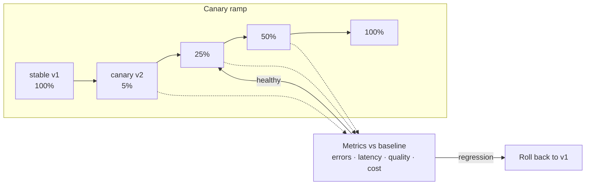

# Deployment Strategies

> **Interview answer (say this first).** A deployment strategy decides how a new version replaces an old one. **Recreate** stops the old version then starts the new, with brief downtime. **Rolling** replaces instances in batches. **Blue-green** runs two complete environments and switches all traffic at once. **Canary** sends a small share of traffic to the new version, watches metrics, then ramps up. A deployment makes code available; a release exposes it to users, and a feature flag separates the two. Compare the canary against a baseline on error rate and latency, roll back automatically when a metric regresses, order migrations so both versions can run, and plan the rollback before you deploy.

## Why this exists

Every deployment is a small bet that the new version is better. Without a strategy, the bet is all-or-nothing: stop the service, start the new code, and hope. If the new version has a bug, every user sees it at the same second.

The costs of an all-at-once deploy are concrete:

- **Blast radius is everything.** One bad release takes down all traffic, not a slice.
- **Rollback takes as long as the failure.** You notice the problem from user reports, not from a metric.
- **No place to test with real traffic.** Staging never sees production's shape.
- **Deploy and release are welded together.** The only way to hide a feature is to not ship it.

A strategy limits the bet. You expose the new version to a small amount of traffic, watch hard signals, and enlarge the exposure only while the signals hold. If they break, you pull back. This is the same idea as a fuse in an electrical circuit: it does not stop current, it bounds the damage when something goes wrong.

For AI systems the stakes are higher, because "correct" is not binary. A new prompt or model can answer every request without an error and still be worse — less accurate, more verbose, more expensive, or less compliant. Latency and error rate are necessary but not sufficient; you also watch quality and cost metrics.

> **The one-sentence purpose.** Change what users run while keeping the blast radius small, the signals honest, and the way back obvious.

## Start from zero

| Word | Plain meaning |
| --- | --- |
| **Deployment** | Making a new version available on the infrastructure. |
| **Release** | Exposing a feature to users. They can happen at different times. |
| **Recreate** | Stop the old version, then start the new one. Brief downtime. |
| **Rolling** | Replace instances a few at a time, keeping the rest serving. |
| **Blue-green** | Run two full environments; switch traffic from one to the other. |
| **Canary** | Send a small traffic share to the new version, then ramp it up. |
| **Traffic shifting** | Moving a percentage of requests from the old to the new version. |
| **Blast radius** | How many users or requests a bad change can affect. |
| **Progressive delivery** | Any strategy that exposes a change gradually with automated checks. |
| **Canary analysis** | Comparing canary metrics against a baseline to decide promotion. |
| **Baseline** | The current stable version's metrics, used as the comparison point. |
| **Automatic rollback** | Reverting when a metric regresses, without waiting for a human. |
| **Dark launch** | Running new code on real traffic but discarding its output. |
| **Shadow traffic** | Sending a copy of production requests to the new version to observe it. |
| **Feature flag** | A runtime switch that enables a feature without a deploy. |
| **Soak time** | The waiting period before you trust a canary and ramp it further. |
| **Migration** | A versioned database schema change. |
| **Expand and contract** | Add the new schema, dual-write, backfill, then remove the old. |
| **Forward fix** | Correcting a problem by shipping a new version, not reverting. |
| **SLO** | Service level objective: the reliability target you promise. |

Two distinctions cause most confusion, so pin them down now:

- **Deployment is not release.** Deployment puts code on servers. Release turns a behaviour on for users. A feature flag lets you deploy dark and release later.
- **Rollback is not undo.** Reverting code is fast; reversing a schema change or data written in a new format is not. Rollback planning is really compatibility planning.

## The core idea

Imagine resurfacing a busy road while traffic keeps flowing. You do not close the whole road. You close one lane, pave it, reopen it, and move to the next. If the new surface is bad, you reopen the old lane and stop. That is a rolling deployment with a rollback.

Now imagine you can build a second road beside the first and divert all cars at once. Switching is instant and switching back is instant, but you paid for two roads. That is blue-green.

Now imagine a single test car takes the new road first, then ten, then a hundred, while engineers watch for skids. That is a canary.



At every step the analysis compares the canary against the baseline. A regression stops the ramp and shifts traffic back.

The four strategies differ on cost, speed, and risk:

| Strategy | Resource cost | Downtime | Blast radius | Rollback speed | Best for |
| --- | --- | --- | --- | --- | --- |
| **Recreate** | Low | Yes, brief | All users | Start the old version again | Dev, batch jobs, single-instance apps |
| **Rolling** | Low | None | Grows during rollout | Reverse the rollout | Stateless services, the Kubernetes default |
| **Blue-green** | High (2×) | None | All users at the switch | Instant traffic switch | Risky changes, fast switchback needed |
| **Canary** | Low | None | A traffic share | Shift traffic back | High-traffic services with good metrics |

## How it works

Walk through one canary release, from build to full promotion.

1. **The immutable artifact exists.** A previous chapter built one image and addressed it by digest; that is the unit being deployed.
2. **A baseline is recorded.** Before the canary starts, the stable version's metrics are captured or known from ongoing monitoring.
3. **Migrations run once, before any new version starts.** Additive, backwards-compatible migrations go first, so both versions work against the new schema.
4. **The canary version starts beside the stable version.** Both are healthy and both can serve traffic.
5. **A small traffic share shifts to the canary**, often one percent to five percent, decided by the traffic manager rather than by pod count.
6. **Soak time passes.** Long enough for the metric window to be meaningful; too short and noise decides.
7. **Canary analysis runs.** It compares error rate, latency, saturation, and any business metric against the baseline over a defined window.
8. **The result is a pass, a fail, or an inconclusive verdict.** A fail triggers automatic rollback; an inconclusive extends the soak or pauses for a human.
9. **On pass, the share ramps.** Typically 5% → 25% → 50% → 100%, with analysis after each step.
10. **The old version is retired** after the canary holds at full traffic for long enough.
11. **The release is recorded.** The deployed digest, the flags turned on, and the analysis result are logged as one release event.

The traffic shift and the analysis are the heart of it. Traffic shifting controls exposure; analysis controls trust. Without either, a canary is just a slow rolling deploy.

> **The mental shortcut.** Deploy behind a switch, expose a slice, watch the numbers, then widen or pull back.

## The syntax you will use

**A rolling update in Kubernetes.** The default strategy replaces pods in batches while the rest keep serving.

```yaml
apiVersion: apps/v1
kind: Deployment
metadata:
  name: agent-worker
spec:
  replicas: 6
  strategy:
    type: RollingUpdate
    rollingUpdate:
      maxSurge: 1              # one extra pod during the rollout
      maxUnavailable: 0        # never drop below the desired count
  selector:
    matchLabels: { app: agent-worker }
  template:
    metadata:
      labels: { app: agent-worker }
    spec:
      containers:
        - name: worker
          image: ghcr.io/acme/agent-worker@sha256:abc123
          readinessProbe:
            httpGet: { path: /healthz, port: 8080 }
            initialDelaySeconds: 5
```

`maxUnavailable: 0` with `maxSurge: 1` keeps full capacity during the rollout: a new pod must become ready before an old one is removed. The image is pinned by digest, so the rollout is reproducible.

**Recreate strategy for a non-critical job.** Stop, then start. Simple, but there is a gap with no running version.

```yaml
  strategy:
    type: Recreate          # brief downtime; use only when downtime is acceptable
```

**Blue-green with two services and a selector switch.** Both environments run; a Service selects one by label.

```yaml
apiVersion: v1
kind: Service
metadata:
  name: app-live
spec:
  selector:
    app: app
    slot: blue             # flip to "green" to switch all traffic at once
  ports:
    - port: 80
      targetPort: 8080
```

Changing `slot` is the entire switch. It is instant, which is why blue-green rollback is the fastest of the four.

**A canary with Argo Rollouts.** The rollout controller steps the weight and runs an analysis after each step.

```yaml
apiVersion: argoproj.io/v1alpha1
kind: Rollout
metadata:
  name: app
spec:
  replicas: 8
  selector:
    matchLabels: { app: app }
  template:
    metadata:
      labels: { app: app }
    spec:
      containers:
        - name: app
          image: ghcr.io/acme/app@sha256:abc123
  strategy:
    canary:
      stableService: app-stable
      canaryService: app-canary
      trafficRouting:
        istio:
          virtualService:
            name: app-vsvc
            routes:
              - primary
      steps:
        - setWeight: 5
        - pause: { duration: 5m }
        - analysis:
            templates:
              - templateName: success-rate
        - setWeight: 25
        - pause: { duration: 10m }
        - setWeight: 100
```

`stableService` and `canaryService` name the two Services the router splits between, and `trafficRouting` tells the controller which router to program — here the `primary` route of the `app-vsvc` Istio VirtualService. With a router, `setWeight` is a true traffic share. Without one, the controller can only approximate the weight by scaling the canary ReplicaSet: with `replicas: 8`, a `setWeight: 5` sends roughly one pod's worth, about 12.5%, not 5%. The `pause` gives metrics time to accumulate before the next step.

**Canary analysis with automatic rollback.** The template queries a metrics provider and fails the rollout on a bad result.

```yaml
apiVersion: argoproj.io/v1alpha1
kind: AnalysisTemplate
metadata:
  name: success-rate
spec:
  metrics:
    - name: success-rate
      interval: 1m
      successCondition: result[0] >= 0.99
      failureLimit: 3
      provider:
        prometheus:
          address: http://prometheus.monitoring:9090
          query: |
            sum(rate(http_requests_total{job="app",code!~"5.."}[5m]))
            / sum(rate(http_requests_total{job="app"}[5m]))
```

`successCondition` is the promotion rule. When the condition fails more than `failureLimit` times, the controller aborts and returns traffic to the stable version.

**Feature flags separate deploy from release.** The code is deployed but inert until the flag is on.

```python
from openfeature import api
from openfeature.provider.in_memory_provider import InMemoryFlag, InMemoryProvider

flags = {"new-agent-planner": InMemoryFlag("on", {"on": True, "off": False})}
api.set_provider(InMemoryProvider(flags))
client = api.get_client()

if client.get_boolean_value("new-agent-planner", default_value=False):
    result = new_planner(question)      # only reached when the flag is on
else:
    result = old_planner(question)
```

The deploy can be days before the release, and turning the flag off is an instant rollback that does not touch infrastructure.

**Expand-and-contract migration ordering.** Three releases, each compatible with the one before.

```sql
-- Release 1: expand. Add a nullable column; old and new code both work.
ALTER TABLE runs ADD COLUMN cost_usd NUMERIC(12, 6);

-- Release 2: backfill, and write both old and new columns from application code.
UPDATE runs SET cost_usd = tokens * 0.000002 WHERE cost_usd IS NULL;

-- Release 3: contract. Only after no code reads the old column.
ALTER TABLE runs DROP COLUMN token_cost;
```

Never drop a column in the same release that stops using it. Contract is a separate, later step.

## Examples: simple to real

**Example 1 — recreate a small internal service.** Downtime is acceptable, so the simplest strategy wins.

```yaml
spec:
  strategy:
    type: Recreate
```

Every request in flight is lost. Fine for an admin tool; unacceptable for a customer-facing API.

**Example 2 — rolling update with a readiness probe.** Capacity never drops, and only healthy pods receive traffic.

```yaml
spec:
  strategy:
    type: RollingUpdate
    rollingUpdate:
      maxSurge: 2
      maxUnavailable: 1
  template:
    spec:
      containers:
        - name: api
          image: ghcr.io/acme/api@sha256:abc123
          readinessProbe:
            httpGet: { path: /ready, port: 8080 }
            periodSeconds: 5
```

Without a readiness probe, Kubernetes may route traffic to a pod that is still starting. The rollout would look successful and still serve errors.

**Example 3 — blue-green with an instant switchback.** Deploy the idle environment, smoke test it, then flip the selector.

```text
1. Deploy v2 into the "green" slot; leave "blue" serving.
2. Run smoke tests against green's internal address.
3. Flip app-live selector slot: blue -> green.
4. Watch metrics. On regression, flip back to blue.
5. When confident, make green the new blue and reset the idle slot.
```

Because blue stays warm, step 4 takes seconds. The cost is running two full environments.

**Example 4 — canary with automatic analysis.** A small share runs the new model or prompt while the analysis watches quality and errors.

```yaml
    canary:
      stableService: app-stable
      canaryService: app-canary
      trafficRouting:
        istio:
          virtualService:
            name: app-vsvc
            routes:
              - primary
      steps:
        - setWeight: 1
        - pause: { duration: 15m }     # enough samples to compare
        - analysis:
            templates:
              - templateName: success-rate
        - setWeight: 10
        - pause: { duration: 15m }
        - analysis:
            templates:
              - templateName: quality-score
        - setWeight: 100
```

For AI services the `quality-score` template is the important one. Error rate can be flat while answer quality falls, so a canary that checks only HTTP status would promote a worse model.

**Example 5 — dark launch and shadow traffic to de-risk a new model.** Real requests are copied to the new version; its answers are recorded but never returned to users.

```text
User request -> stable model -> response to user
                    |
                    +--> copy of prompt -> candidate model -> stored for comparison
```

This tests latency, cost, and output quality under real traffic with zero user impact. It is the safest way to evaluate a new model before any release, and it is how you build the baseline you later canary against.

**Example 6 — feature flag as the release switch.** The same deployed build serves both behaviours; the flag decides.

```python
if client.get_boolean_value("new-model", default_value=False):
    return call_model("candidate")
return call_model("stable")
```

Deploy dark, release to one tenant, then roll out by percentage through the flag. Rollback is flipping the flag off — no deploy, no migration, seconds to recover.

## In production

- **Choose the strategy from the risk, not the fashion.** Recreate for internal tools, rolling as the default, blue-green when you need an instant switch, canary when traffic is high enough to measure.
- **Canary is traffic share, not pod share.** Sending one of ten pods a share of traffic is not a controlled canary; use a traffic manager that can weight requests regardless of replica count.
- **Define the analysis before the rollout, not during it.** Decide the metric, the threshold, the window, and the failure limit up front, or the canary becomes a debate.
- **Watch quality and cost, not only errors and latency.** An AI canary can be fast, error-free, and worse. Add a quality score and a cost-per-request metric to the analysis.
- **Give the canary a baseline.** Comparing against the stable version's live metrics is stronger than comparing against a fixed guess.
- **Time the soak to the metric.** Rare errors need long windows; a busy service reaches significance fast. Too short a window lets noise promote or kill a release.
- **Order migrations expand-then-contract.** Add the new shape first, dual-write and backfill, then remove the old shape in a later release. Both versions must run against the same database during the rollout.
- **Migrations run once, before the new version starts.** Never run them from application startup across replicas; they race.
- **Plan rollback before deploy.** Identify the previous digest, the flag state, and the migration compatibility. A rollback plan written after the incident is not a plan.
- **Prefer forward fix when data changed shape.** If the new version wrote data the old version cannot read, reverting produces errors; ship a corrective release instead.
- **Keep the old version warm for blue-green.** A cold idle environment takes time to serve, which erases the switchback advantage.
- **Deploy to one region or one tenant first when you can.** Regional rollout is a coarse canary that catches infrastructure-specific failures.

## Interview questions

### 1. What is the difference between a deployment and a release?

**Answer.** A deployment installs and starts a version on the infrastructure. A release exposes a behaviour to users. They can happen together, but feature flags separate them: you deploy dark, then release by turning a flag on for a tenant, a percentage, or everyone. Separation lets you roll out and roll back behaviour without rebuilding or redeploying.

**Follow-up: "Why is that useful for AI features?"** A new prompt or model can be deployed and evaluated behind a flag, then released gradually. If quality drops, turning the flag off restores the old behaviour in seconds without a deploy or migration.

**Trap.** Saying "we released it" when you mean "we deployed it." The distinction is the whole point of flag-driven delivery.

### 2. Compare recreate, rolling, blue-green, and canary.

**Answer.** Recreate stops the old version and starts the new one, so there is brief downtime and the rollback is to start the old version again. Rolling replaces instances in batches, keeps serving throughout, and may run two versions at once. Blue-green runs two full environments and switches all traffic at once, costing double but rolling back instantly. Canary sends a small traffic share to the new version, measures it, and ramps up, limiting blast radius at low cost but requiring traffic splitting and good metrics.

**Follow-up: "Which do you pick for a database-backed service?"** Rolling or canary, because a binary switch with an incompatible schema is risky. Whichever you pick, keep migrations backwards compatible so both versions can run.

**Trap.** Calling rolling "zero risk." During a rolling deploy two versions serve traffic, and a client can see inconsistent behaviour.

### 3. How does canary analysis decide to promote or roll back?

**Answer.** It compares the canary's metrics against a baseline over a defined window. If the metric is within limits for the required number of checks, the rollout steps forward. If it fails past a failure limit, the controller aborts and returns traffic to the stable version. The analysis is declarative: a template defines the query, the interval, the success condition, and the failure threshold.

**Follow-up: "What if the analysis is inconclusive?"** Pause for a human or extend the window. An inconclusive result is a third outcome, not a fail; treating it as a pass is how bad releases slip through.

**Trap.** Using only error rate. A canary can be error-free and still degrade latency, cost, or answer quality, so the analysis must cover the metrics that define the service.

### 4. What are dark launches and shadow traffic, and when do you use them?

**Answer.** A dark launch runs new code on real traffic but discards its output. Shadow traffic sends a copy of live requests to the candidate version so you can observe latency, cost, and output quality without affecting users. They are used to de-risk a change that has no easy rollback or whose quality is hard to judge, such as a new model or a changed prompt.

**Follow-up: "What is the risk?"** Shadow traffic doubles downstream load, so protect the real path and bound the copy. It also copies production data, so privacy and retention rules apply to the shadow store.

**Trap.** Returning the shadow result to users while calling it a shadow. That is just a canary without analysis, and it is no longer safe.

### 5. When would you use a feature flag instead of a canary?

**Answer.** Use a flag when you want to separate deploy from release, target specific users or tenants, or turn a feature on and off instantly without touching infrastructure. Use a canary when the risk is in the running version's behaviour under traffic and you want automated metric-based control. They compose: deploy dark, canary the code path, then release by flag.

**Follow-up: "What is the downside of flags?"** Every flag is a branch and a piece of configuration that can rot. Flags multiply the number of states to test, so track an owner and an expiry for each one and delete stale flags.

**Trap.** Using flags as a permanent configuration system. Flags are for change management; long-lived configuration belongs in config.

### 6. How do database migrations fit a zero-downtime rollout?

**Answer.** Use expand-and-contract. First add the new schema in a backwards-compatible way, such as a nullable column. Then backfill and dual-write so both old and new code work. Only after no code uses the old shape, remove it in a later release. Run migrations once, before the new version starts, and ensure the old version still works against the new schema.

**Follow-up: "Can you cancel a migration?"** Usually not safely. Long migrations can be rehearsed with shadow traffic and checkpoints, and destructive steps should be separate releases so they can be delayed.

**Trap.** Assuming rollback reverts the database. Redeploying old code does not undo a schema change; compatibility is what makes rollback possible.

### 7. How do you plan a rollback?

**Answer.** Before deploying, identify the exact previous artifact digest, confirm it is still in the registry, note the flag states, and check that the schema is compatible with the older code. For blue-green, keep the old environment warm; for canary, keep the weight-shift-back automated; for rolling, be ready to re-roll the previous digest. After deploying, watch the metrics that would trigger it.

**Follow-up: "When is rollback the wrong move?"** When the new version already wrote data the old version cannot read, or when the bug is data loss. Then a forward fix is safer than reverting.

**Trap.** Believing rollback is always available and instant. A destructive migration, a cache keyed on the new format, or a message in a new schema can make the old version fail after a rollback.

### 8. What metrics would you watch during an AI canary?

**Answer.** The usual service metrics — error rate, latency percentiles, saturation — plus AI-specific ones: answer quality against an eval or judge score, refusal and safety rates, token usage and cost per request, and tool-call success rate for agents. Compare each against the stable baseline over a window long enough to be meaningful, and fail the rollout on any clear regression.

**Follow-up: "How do you get a quality signal cheaply?"** Sample requests, score them with a small automated judge or a fixed eval set, and track the trend. Scoring every request is expensive; sampling enough to detect a real drop is usually affordable.

**Trap.** Treating a canary as purely a performance test. For AI systems the quality regression is the failure mode you are most worried about.

## Remember this

- **A deployment makes code available; a release exposes it.** Feature flags let the two happen at different times.
- **Recreate is simple, rolling is the default, blue-green switches instantly at double cost, canary limits blast radius with metrics.**
- **Canary is about traffic share, not pod count,** and its analysis must include quality and cost for AI services.
- **Order migrations expand-then-contract** so the old and new versions can both run.
- **Plan rollback before you deploy**, and prefer a forward fix when data has already changed shape.
