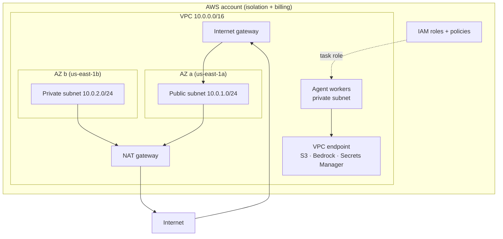

# AWS Fundamentals, IAM, and VPC

> **Interview answer (say this first).** AWS is organised into regions and availability zones, and you operate inside it under the shared responsibility model: AWS secures the cloud, you secure what you put in it. An AWS account is the unit of isolation and billing, and Organizations groups accounts and applies guardrails with service control policies. IAM answers "who can do what": users are long-lived identities, roles are temporary identities that services and federated callers assume, and policies are JSON documents that allow or deny actions. Prefer roles over users, least privilege, and OIDC federation so CI and Kubernetes get short-lived credentials through a trust policy. A VPC is your private network: subnets split it across AZs, route tables decide where packets go, security groups are stateful per-resource firewalls, network ACLs are stateless per-subnet firewalls, and NAT gateways or VPC endpoints give private subnets outbound access without exposing them to the internet.

## Why this exists

Before you can run an AI service on AWS, three foundations have to be right: **where** it runs, **who** may touch it, and **how** it talks to the network. Get any of them wrong and you either overspend, over-expose, or lock yourself out.

The classic failures are predictable:

- **One giant account.** Every team shares credentials and limits, so one mistake or compromise affects everything.
- **Long-lived access keys in a repo.** A leaked key is usable until someone notices and rotates it.
- **A flat network.** Every instance has a public IP, so the attack surface is the whole fleet.
- **Over-broad policies.** `Action: "*"` on `Resource: "*"` turns a small bug into a full-account incident.

These are not exotic. They are the default outcome when nobody designs the account, permissions, and network deliberately.

For agentic systems the problem is sharper. Agent workers make outbound calls to model providers, run tools that touch data, and may execute untrusted code. Each of those needs a scoped identity and a controlled network path. A prompt-injected agent that can reach the whole account is a security incident, not a bug.

> **The one-sentence purpose.** Give every workload the smallest identity and the shortest network path it needs, and make the account boundaries that contain mistakes explicit.

## Start from zero

| Word | Plain meaning |
| --- | --- |
| **Region** | A geographic cluster of AWS data centres, such as `us-east-1`. |
| **Availability Zone (AZ)** | One or more isolated data centres inside a region; AZs have separate power and network. |
| **Shared responsibility model** | AWS secures the cloud; you secure what you run in it. |
| **Account** | The isolation and billing boundary; resources live inside one account. |
| **Organizations** | A way to group many accounts and manage them centrally, in OUs. |
| **SCP** | Service control policy: a guardrail that limits what accounts in an OU may do. |
| **IAM** | Identity and Access Management: who can do what, on which resource. |
| **IAM user** | A long-lived identity with a password or access keys. Best avoided for services. |
| **IAM role** | An identity assumed temporarily; callers receive short-lived credentials. |
| **Instance profile** | The container that passes an IAM role to an EC2 instance. |
| **Policy** | A JSON document that allows or denies actions on resources. |
| **Identity policy** | A policy attached to a user, group, or role, saying what it may do. |
| **Resource policy** | A policy attached to a resource, saying who may access it. |
| **Trust policy** | The role's rule for *who may assume it*, based on a principal and conditions. |
| **ARN** | Amazon Resource Name, like `arn:aws:s3:::acme-docs`, identifying a resource. |
| **CloudTrail** | The AWS API audit log: records who called what, and when. |
| **Least privilege** | Grant only the actions and resources actually needed, nothing more. |
| **OIDC federation** | Trusting an external provider so a caller gets AWS credentials without AWS keys. |
| **STS** | Security Token Service: issues the short-lived credentials a role assumption returns. |
| **VPC** | Virtual Private Cloud: your isolated network inside a region. |
| **CIDR block** | A range of IP addresses, such as `10.0.0.0/16`, that defines the VPC or subnet. |
| **Subnet** | A slice of the VPC's address range, tied to one AZ. |
| **Public subnet** | A subnet whose route table sends internet-bound traffic to an internet gateway. |
| **Private subnet** | A subnet with no direct route to the internet. |
| **Route table** | The rules that decide where traffic from a subnet goes. |
| **Internet gateway** | The VPC's door to the public internet. One per VPC. |
| **NAT gateway** | Lets private subnets start outbound connections through a public subnet. |
| **Security group** | A stateful allow-only firewall attached to a resource. |
| **Network ACL** | A stateless allow-and-deny firewall attached to a subnet. |
| **VPC endpoint** | A private connection from your VPC to an AWS service, bypassing the internet. |
| **PrivateLink** | The AWS technology behind interface VPC endpoints: a service exposed privately in your VPC. |
| **IRSA** | IAM Roles for Service Accounts: giving a Kubernetes pod an IAM role via OIDC. |

Two distinctions decide most designs:

- **Users versus roles.** Users have permanent credentials. Roles are assumed and produce temporary credentials. Services, CI jobs, and pods should use roles; users are for the rare human who truly needs console access.
- **Security groups versus network ACLs.** Security groups are stateful and allow-only, and they live with the resource. NACLs are stateless, allow and deny, and live with the subnet. Most of your rules belong in security groups.

## The core idea

Think of a secure office building.

- The **building** is the AWS account. Keys to it are valuable, so you have more than one building with separate purposes.
- The **badge system** is IAM. Badges say who you are and which doors open.
- A **visitor badge** is a role. It is issued for a short time, tied to why you are there, and expires.
- A **floor plan** is the VPC. Subnets are rooms, corridor doors are route tables.
- A **locked door** is a security group: it checks the badge and the direction.
- The **floor fire door** is a network ACL: a coarser rule that stops traffic entering the whole floor.
- The **mailroom** is a NAT gateway: you can send a parcel out, but nobody can walk in.
- A **private tunnel** is a VPC endpoint: a direct corridor to an AWS service that never crosses the public street.



Traffic reaches the public subnet through the internet gateway. The private subnet has no inbound path; its outbound traffic goes through the NAT gateway or, for AWS services, straight through a VPC endpoint. The IAM task role is what the workload uses to call those services.

## How it works

Trace one request from a CI pipeline into a private workload, and every layer shows up.

1. **A CI job needs to deploy.** It has no AWS keys. It requests an OIDC token from GitHub, which carries claims about the repository and branch.
2. **AWS validates the token.** An IAM OIDC identity provider represents GitHub, and a role's trust policy allows that provider with conditions.
3. **STS issues temporary credentials** for the role. STS (Security Token Service) is the AWS service that mints credentials on assumption, so they expire and a leak has a short life.
4. **The role's identity policy limits actions.** The deploy role can push an image or update a service, but not read customer data.
5. **The workload runs in a private subnet.** No public IP, no inbound route from the internet.
6. **A security group controls what may reach it** — for example, only the load balancer on one port.
7. **A network ACL on the subnet provides a coarse second layer.** The default NACL allows all, so it is a guardrail you tighten deliberately.
8. **Outbound calls to AWS services go through a VPC endpoint.** Traffic to S3, Bedrock, or Secrets Manager stays on the AWS network.
9. **Outbound calls to the public internet go through a NAT gateway.** The workload can call an external model API, but nothing can initiate a connection back.
10. **The workload assumes an IAM role.** On EC2 it is an instance profile (the container that passes the role to the instance), on ECS a task role, on EKS a service account role (IRSA). The code asks STS for credentials, so no keys are stored.
11. **CloudTrail records the API calls** made with that identity, which is how you answer "who did that?" later. CloudTrail is the account's API audit log.

The pattern to remember: **identity flows from federation to role to temporary credentials, and the network flows from private subnet to endpoint or NAT.** Both are shortest-path by design.

## The syntax you will use

**A least-privilege identity policy.** This role may read one bucket prefix and write logs, nothing else.

```json
{
  "Version": "2012-10-17",
  "Statement": [
    {
      "Sid": "ListModelsBucket",
      "Effect": "Allow",
      "Action": "s3:ListBucket",
      "Resource": "arn:aws:s3:::acme-training-data"
    },
    {
      "Sid": "ReadTrainingData",
      "Effect": "Allow",
      "Action": "s3:GetObject",
      "Resource": "arn:aws:s3:::acme-training-data/models/*"
    },
    {
      "Sid": "WriteLogs",
      "Effect": "Allow",
      "Action": ["logs:CreateLogStream", "logs:PutLogEvents"],
      "Resource": "arn:aws:logs:us-east-1:123456789012:log-group:/aws/app:*"
    }
  ]
}
```

Listing specific actions and ARNs is least privilege. `Action: "*"` on `Resource: "*"` is the anti-pattern to call out in an interview.

**A trust policy for OIDC federation.** This is what allows GitHub Actions to assume the role, scoped to one repository and branch.

```json
{
  "Version": "2012-10-17",
  "Statement": [
    {
      "Effect": "Allow",
      "Principal": {
        "Federated": "arn:aws:iam::123456789012:oidc-provider/token.actions.githubusercontent.com"
      },
      "Action": "sts:AssumeRoleWithWebIdentity",
      "Condition": {
        "StringEquals": {
          "token.actions.githubusercontent.com:aud": "sts.amazonaws.com"
        },
        "StringLike": {
          "token.actions.githubusercontent.com:sub": "repo:acme/agent-platform:ref:refs/heads/main"
        }
      }
    }
  ]
}
```

The trust policy is the role's front door. Without the `sub` condition, any repository that can get a token from the provider could assume the role.

**Wiring the workflow to the role.** The job requests the OIDC token and exchanges it for credentials.

```yaml
jobs:
  deploy:
    runs-on: ubuntu-latest
    permissions:
      id-token: write          # required to request the OIDC token
      contents: read
    steps:
      - uses: actions/checkout@v7
      - uses: aws-actions/configure-aws-credentials@v6
        with:
          role-to-assume: arn:aws:iam::123456789012:role/gha-deploy
          aws-region: us-east-1
```

No access key is stored. The role's identity policy and the Git branch condition are the whole authorisation.

**A trust policy for a service role.** A service like ECS assumes a task role; the principal is the service, not a person.

```json
{
  "Version": "2012-10-17",
  "Statement": [
    {
      "Effect": "Allow",
      "Principal": { "Service": "ecs-tasks.amazonaws.com" },
      "Action": "sts:AssumeRole"
    }
  ]
}
```

**IRSA on EKS: bind a Kubernetes service account to an IAM role.** The pod then gets credentials without node-wide permissions.

```yaml
apiVersion: v1
kind: ServiceAccount
metadata:
  name: agent-worker
  namespace: agents
  annotations:
    eks.amazonaws.com/role-arn: arn:aws:iam::123456789012:role/agent-worker-task
```

The annotation is the link. Kubernetes projects a web identity token into the pod, and the SDK exchanges it for AWS credentials.

**Inspecting identities and policies with the CLI.** These read-only calls are what you run during an audit.

```bash
aws sts get-caller-identity                       # who am I right now?
aws iam get-role --role-name gha-deploy           # show the trust policy
aws iam list-attached-role-policies --role-name gha-deploy
aws iam simulate-principal-policy \
  --policy-source-arn arn:aws:iam::123456789012:role/gha-deploy \
  --action-names s3:GetObject
```

`simulate-principal-policy` answers "would this be allowed?" without trying it, which is how you test least privilege.

**A VPC with public and private subnets in Terraform.** Read it as a picture: the CIDRs, the route tables, and the NAT gateway.

```hcl
resource "aws_vpc" "main" {
  cidr_block           = "10.0.0.0/16"
  enable_dns_support   = true
  enable_dns_hostnames = true
}

resource "aws_subnet" "public" {
  vpc_id            = aws_vpc.main.id
  cidr_block        = "10.0.1.0/24"
  availability_zone = "us-east-1a"
}

resource "aws_subnet" "private" {
  vpc_id            = aws_vpc.main.id
  cidr_block        = "10.0.2.0/24"
  availability_zone = "us-east-1b"
}

resource "aws_internet_gateway" "igw" {
  vpc_id = aws_vpc.main.id
}

resource "aws_eip" "nat" {
  domain = "vpc"
}

resource "aws_nat_gateway" "nat" {
  subnet_id     = aws_subnet.public.id   # NAT lives in a public subnet
  allocation_id = aws_eip.nat.id
}
```

The public subnet's route table points `0.0.0.0/0` at the internet gateway. The private subnet's route table points `0.0.0.0/0` at the NAT gateway, and has no inbound route from the internet.

**A VPC endpoint so private workloads reach AWS services directly.** Interface endpoints use PrivateLink — the AWS technology that exposes a service privately inside your VPC — plus a security group.

```hcl
resource "aws_vpc_endpoint" "bedrock" {
  vpc_id              = aws_vpc.main.id
  service_name        = "com.amazonaws.us-east-1.bedrock-runtime"
  vpc_endpoint_type   = "Interface"
  subnet_ids          = [aws_subnet.private.id]
  security_group_ids  = [aws_security_group.endpoint.id]
  private_dns_enabled = true
}
```

With `private_dns_enabled`, the SDK's normal endpoint name resolves to the private address, so application code does not change.

## Examples: simple to real

**Example 1 — give an agent one read-only tool.** The tool needs to read a documents bucket and nothing else.

```json
{
  "Version": "2012-10-17",
  "Statement": [
    {
      "Effect": "Allow",
      "Action": ["s3:GetObject"],
      "Resource": "arn:aws:s3:::acme-docs/*"
    }
  ]
}
```

If the agent is prompt-injected and tries to delete the bucket, the policy denies it. Least privilege is what turns a jailbreak from a disaster into a failed API call.

**Example 2 — scope CI by repository and branch.** The same role is assumed only by the main branch of one repository.

```json
{
  "Condition": {
    "StringEquals": {
      "token.actions.githubusercontent.com:aud": "sts.amazonaws.com"
    },
    "StringLike": {
      "token.actions.githubusercontent.com:sub": "repo:acme/agent-platform:ref:refs/heads/main"
    }
  }
}
```

A pull-request workflow from a fork cannot assume the deploy role, because its `sub` claim does not match.

**Example 3 — a two-tier network with a NAT gateway.** Public subnets host load balancers; private subnets host workloads.

```text
VPC 10.0.0.0/16
  public 10.0.1.0/24  -> route 0.0.0.0/0 -> internet gateway
  private 10.0.2.0/24 -> route 0.0.0.0/0 -> NAT gateway
  private 10.0.3.0/24 -> route 0.0.0.0/0 -> NAT gateway
Load balancer sits in the public subnets.
Agent workers, databases, and caches sit in the private subnets.
```

Inbound from the internet reaches only the load balancer. Workers can still reach external APIs outbound through NAT.

**Example 4 — security group versus network ACL in practice.** Reach for the security group first.

```text
Security group "agent-workers-sg":
  inbound:  tcp/8080 from load-balancer-sg     (stateful: replies allowed automatically)
  outbound: tcp/443 to 0.0.0.0/0

Network ACL on the private subnet:
  inbound:  allow 1024-65535 from 0.0.0.0/0    (return traffic for outbound connections)
  inbound:  deny  all
  outbound: allow 443 to 0.0.0.0/0
  outbound: deny  all
```

The security group is precise and stateful. The NACL is coarse, stateless, and mainly a backstop.

**Example 5 — reach Bedrock without the internet.** A private endpoint keeps model traffic on the AWS network and removes the need for NAT.

```text
Private subnet worker -> VPC interface endpoint -> bedrock-runtime
No internet gateway route is used, so the call never leaves the AWS network.
The endpoint's security group allows tcp/443 from the worker security group.
```

This reduces exposure and can remove a NAT dependency. For agent workloads that call Bedrock, it is the normal production shape.

## In production

- **Use accounts as blast-radius boundaries.** Separate production from development, and separate teams that should not share limits. Organizations plus SCPs keeps guardrails consistent.
- **Prefer roles to users.** Humans use federation or SSO; services use roles. Reserve long-lived IAM users for the rare case that cannot use federation, and rotate any keys.
- **Never put static AWS keys in a repo or a container image.** OIDC for CI, task roles for containers, instance profiles for EC2, and IRSA for pods.
- **Always constrain the OIDC trust policy.** Check the `aud` and a `sub` condition for the repository, branch, or environment. A provider-wide trust is an open door.
- **Start from deny and add allow.** Do not attach broad managed policies "to get it working" and forget; audit with `simulate-principal-policy` and CloudTrail.
- **Spread across AZs.** A single-AZ deployment fails when that AZ degrades. Put load balancers and workers in at least two AZs.
- **Treat the default NACL as permissive.** It allows all traffic. Tighten it only with a clear reason, because a wrong NACL rule breaks an entire subnet silently.
- **Remember security groups are allow-only and stateful.** You cannot write a deny rule, and return traffic is automatically allowed. Rules reference other security groups for clean service-to-service wiring.
- **Use VPC endpoints for AWS service traffic.** Gateway endpoints for S3 and DynamoDB, interface endpoints for most other services. It reduces NAT traffic and exposure.
- **NAT is for outbound only and is not a security boundary by itself.** The real guarantee is that private subnets have no route from the internet gateway.
- **Audit IAM continuously.** Unused roles, wildcard actions, and stale keys accumulate. CloudTrail plus a periodic review keeps the surface small.

## Interview questions

### 1. What is the shared responsibility model?

**Answer.** AWS is responsible for security *of* the cloud: the physical data centres, the hypervisor, the managed service internals, and the global network. You are responsible for security *in* the cloud: your identities, policies, data, patching of your instances, network configuration, and what you expose. The line moves with the service — with a managed service like S3 you do not patch storage, but you do configure access and encryption; with EC2 you patch the operating system yourself.

**Follow-up: "How does that change with a managed service?"** The more managed the service, the more AWS handles, but configuration and access control remain yours. Misconfiguration is the customer's responsibility regardless of who runs the hardware.

**Trap.** Assuming a managed service is secure by default. It is secure only as configured.

### 2. Why are regions and availability zones important?

**Answer.** A region is a geographic cluster of data centres; an availability zone is an isolated group of data centres within a region, with independent power and networking. You choose a region for latency, data residency, and service availability. You spread workloads across several AZs so a single AZ failure does not take the service down. Resources are created in a specific region, and some services are global.

**Follow-up: "How do you survive a whole region failing?"** Duplicate the stack in another region and fail over. That is expensive and operationally heavy, so most services run multi-AZ and reserve multi-region for critical paths.

**Trap.** Saying "multi-AZ means multi-region." AZs are inside one region; a regional failure still takes them all down.

### 3. What is the difference between an IAM user and an IAM role?

**Answer.** A user is a long-lived identity with permanent credentials such as a password or access keys. A role has no password or keys; a principal assumes it and receives temporary credentials from STS. Roles are used by services, CI pipelines, and federated users, and their trust policy defines who may assume them. Users are for the rare human case and should be replaced by federation where possible.

**Follow-up: "Why not create a user with access keys for CI?"** Those keys are long-lived, must be rotated, and leak easily into logs or repositories. OIDC federation gives short-lived credentials bound to a repository and branch, and there is nothing to rotate.

**Trap.** Giving a role a permanent access key "for convenience." Roles do not have permanent keys; doing that recreates the user problem with extra steps.

### 4. What is a trust policy, and how does it differ from a permission policy?

**Answer.** A trust policy is attached to a role and answers "who may assume this role?" — it names a principal such as a service, an account, or a federated OIDC provider, plus conditions. A permission policy (identity policy) answers "what may the role do once assumed?" — it lists allowed or denied actions on resources. You need both: a correct trust policy with an over-broad permission policy is dangerous, and a tight permission policy with a wide trust policy is also dangerous.

**Follow-up: "What condition would you add for OIDC?"** Constrain the audience (`aud`) and the subject (`sub`) to the specific repository, branch, or environment. That prevents another project from assuming the same role.

**Trap.** Confusing the two. A trust policy is not "what it can do"; it is "who can become it."

### 5. Explain a VPC, subnets, and route tables.

**Answer.** A VPC is an isolated network with a CIDR block. Subnets are slices of that range, each tied to one availability zone. A route table attached to a subnet decides where traffic goes: the local route keeps VPC traffic internal, and a default route (`0.0.0.0/0`) points to an internet gateway, a NAT gateway, or a transit gateway. A public subnet is public because its route table reaches an internet gateway; a private subnet has no such route.

**Follow-up: "Can two subnets be in the same AZ?"** Yes, subnets are AZ-scoped but you can have several in one AZ. Spreading subnets across AZs is what gives you resilience.

**Trap.** Thinking a subnet is public because of its name or its IP range. Public or private is decided entirely by the route table.

### 6. Security groups versus network ACLs — when do you use each?

**Answer.** Security groups are stateful, allow-only firewalls attached to resources such as instances, load balancers, or interfaces. Return traffic is automatically allowed, and rules can reference other security groups. Network ACLs are stateless, allow-and-deny firewalls attached to a subnet, evaluated in numbered order, and they require explicit return-traffic rules. Use security groups for almost all access control, and NACLs as a coarse subnet-level backstop.

**Follow-up: "Why can a NACL break everything at once?"** Because it applies to the whole subnet and is stateless. A missing ephemeral-port rule blocks return traffic for every resource in the subnet, and the failure looks like a network outage.

**Trap.** Writing a deny rule in a security group. Security groups support allow rules only.

### 7. How do private subnets reach the internet and AWS services?

**Answer.** For the public internet, a private subnet's route table points `0.0.0.0/0` at a NAT gateway that lives in a public subnet. The NAT lets the workload initiate outbound connections while allowing no inbound connections. For AWS services, a VPC endpoint is better: gateway endpoints for S3 and DynamoDB, interface endpoints (PrivateLink) for most others. Endpoint traffic stays on the AWS network, which reduces exposure and NAT dependency.

**Follow-up: "Can an external service initiate a connection into a private subnet?"** Not through NAT, because NAT only tracks outbound flows. Inbound access would require a load balancer in a public subnet or a private connectivity option such as a VPN or Direct Connect.

**Trap.** Believing NAT is a firewall. It is a translation and outbound-only mechanism; the security boundary is the absence of an inbound route.

### 8. Why use VPC endpoints for AI workloads such as Bedrock?

**Answer.** An interface endpoint puts a private address for the service inside your VPC, so calls from private subnets never traverse the internet. That removes exposure, can remove a NAT dependency, and lets you control access with the endpoint's security group and an endpoint policy. Using `private_dns_enabled` means the SDK's normal hostname resolves privately, so application code is unchanged.

**Follow-up: "What does the endpoint policy add?"** A resource policy on the endpoint can restrict which identities may use it, giving a second layer beyond the IAM role and the security group.

**Trap.** Assuming an endpoint automatically allows all calls. The IAM role still needs permission to call the service, and the endpoint's security group must allow the workload.

## Remember this

- **AWS secures the cloud; you secure what is in it.** Configuration and access control are always yours.
- **Accounts are blast-radius boundaries,** and Organizations with SCPs sets guardrails across them.
- **Prefer roles to users**, and prefer OIDC federation to long-lived keys; the trust policy decides who may assume.
- **Least privilege means specific actions on specific ARNs**, and no `"*"` on `"*"`.
- **Public versus private is the route table**, security groups are stateful and allow-only, NACLs are stateless, and VPC endpoints keep AWS traffic off the internet.
