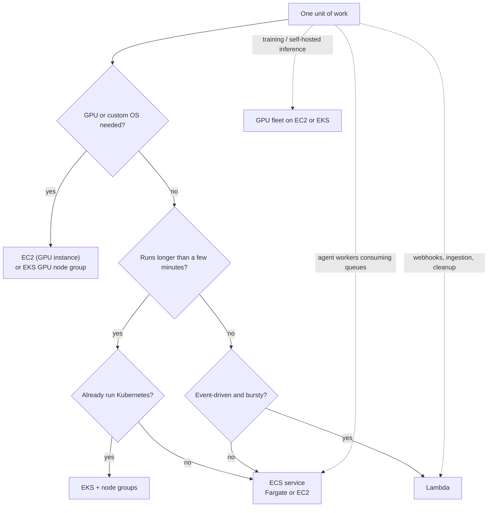

# AWS Compute

> **Interview answer (say this first).** AWS compute is a spectrum from "you manage the machine" to "you manage only the function." EC2 gives virtual machines with full control, built from AMIs and scaled with Auto Scaling Groups. ECS runs containers: a cluster holds services, a task definition describes a container, and you choose the EC2 launch type for control or Fargate for serverless containers. EKS is managed Kubernetes with managed node groups and Fargate profiles. Lambda runs functions on events with no server to manage, but it has cold starts, a bounded execution time, and package size limits. For AI: GPU EC2 or GPU node groups for training and self-hosted inference, ECS or EKS services for long-running agent workers, and Lambda for short event-driven steps such as webhooks, ingestion, and glue.

## Why this exists

The compute choice is the largest lever on cost, latency, and operational load. Pick a virtual machine for a five-second event handler and you pay for idle capacity. Pick a function for a forty-minute agent run and it cannot finish. Pick Kubernetes for two containers and you inherit a control plane you did not need.

The options exist because workloads differ along three axes:

- **How long does one unit of work run?** Milliseconds, seconds, minutes, or hours.
- **Does it need special hardware?** A GPU for training or local inference, or a plain CPU.
- **How much control do you need?** A specific kernel, a custom daemon, or nothing beyond a container.

AWS maps those axes onto four services:

- **EC2** for full control, custom images, and specialised hardware.
- **ECS** for containers without Kubernetes.
- **EKS** for containers when you want the Kubernetes ecosystem.
- **Lambda** for event-driven code with no servers to manage.

For agentic AI the mismatch hurts twice. Agent workers are long-running and stateful, so Lambda times out and loses the loop. Agents also burst, so a fixed fleet wastes money between bursts. Choosing correctly is the difference between a platform that scales to zero and one that idles at full price.

> **The one-sentence purpose.** Match each workload to the smallest compute model that still meets its runtime, hardware, and control needs.

## Start from zero

| Word | Plain meaning |
| --- | --- |
| **EC2** | Elastic Compute Cloud: a virtual machine you control. |
| **Instance** | One running EC2 virtual machine. |
| **Instance type** | The hardware profile of an instance: CPU, memory, and optional GPU. |
| **AMI** | Amazon Machine Image: the template an instance is launched from. |
| **EBS** | Elastic Block Store: the disk attached to an instance, surviving a restart. |
| **Launch template** | A saved set of instance settings used when launching. |
| **Auto Scaling Group (ASG)** | Keeps a desired number of instances and replaces unhealthy ones. |
| **Spot instance** | Cheap spare capacity that can be reclaimed with a short notice. |
| **Reserved capacity** | A commitment for a discount, in exchange for a term. |
| **ECS** | Elastic Container Service: AWS's native container orchestrator. |
| **Cluster** | A logical group of compute capacity for ECS tasks. |
| **Task definition** | The blueprint for a container: image, CPU, memory, ports, env, roles. |
| **Task** | One running instance of a task definition. |
| **Service** | An ECS controller that keeps a desired number of tasks running. |
| **Fargate** | Serverless containers: AWS runs the host, you specify CPU and memory. |
| **Launch type** | Whether ECS tasks run on EC2 instances you manage or on Fargate. |
| **ECR** | Elastic Container Registry: stores your container images. |
| **EKS** | Elastic Kubernetes Service: AWS-managed Kubernetes control plane. |
| **Control plane** | The Kubernetes API and scheduling layer; AWS runs it in EKS. |
| **Node group** | A set of worker nodes with the same instance type and settings. |
| **Fargate profile** | The EKS rule that runs matching pods without any nodes. |
| **Lambda** | Functions as a service: run code on an event, no server to manage. |
| **Event source** | What invokes a function: an HTTP request, a queue message, a schedule. |
| **Cold start** | The extra latency when a new execution environment is created. |
| **Concurrency** | How many invocations run at the same time. |
| **Provisioned concurrency** | Pre-warmed Lambda capacity that removes most cold starts. |

The core trade-off is a straight line between control and operational burden:

| Service | You manage | AWS manages | Best when |
| --- | --- | --- | --- |
| **EC2** | OS, runtime, scaling, patching | Hardware, hypervisor | Custom OS, GPUs, licensed software |
| **ECS on EC2** | Instances, plus containers | ECS control plane | You want container density and cost control |
| **ECS on Fargate** | Containers only | Hosts, patching, capacity | You want containers with no node work |
| **EKS** | Workloads, nodes, add-ons | Kubernetes control plane | You need the Kubernetes ecosystem |
| **Lambda** | Function code | Everything else | Short, event-driven, bursty work |

## The core idea

Think about how you find somewhere to live.

- **EC2** is renting an empty house. You can knock down walls and install anything, but you also fix the boiler.
- **ECS** is a serviced apartment. You bring your furniture (a container), and the building handles the rest.
- **EKS** is a managed building with a concierge (the control plane). You still choose your own staff for your floor (the nodes).
- **Lambda** is a hotel room billed by the hour. You arrive, do one small job, and leave. Perfect for a short stay, impossible for a permanent workshop.

The right question is never "which is best?" It is "how long is my unit of work, and how much do I want to operate?"



The two questions that decide most cases: **does it need a GPU or a custom OS**, and **does it run longer than a few minutes?** Long and stateful goes to containers; short and event-driven goes to Lambda.

## How it works

Walk through the lifecycle of a containerised agent worker on ECS, then compare it with Lambda.

1. **Build the image** and push it to ECR, tagged by commit SHA. The image is the immutable artifact.
2. **Write a task definition.** It names the image, CPU, memory, ports, environment, and the IAM task role the container runs as.
3. **Create a service** that references the task definition and a desired count. ECS keeps that many tasks running.
4. **Place the tasks.** On Fargate, AWS picks the host. On the EC2 launch type, ECS schedules onto instances in your cluster using capacity providers.
5. **Register with a load balancer** if the service accepts traffic. The service manages target registration as tasks come and go.
6. **Autoscale the service** on a metric such as queue depth, CPU, or requests per task.
7. **Deploy a new version** by registering a new task definition revision and updating the service. ECS performs a rolling replacement.
8. **Replace unhealthy tasks.** A failed health check removes a task and the service starts another.
9. **Scale in** when demand drops, draining connections before stopping tasks.
10. **For a Lambda function**, the path is different: an event source invokes the function, AWS provisions or reuses an execution environment, the handler runs, and it returns. There is no host, no task, and no cluster.

The essential difference: **a service keeps something running; a function runs when called.** A queue-draining worker is a service. A webhook that starts a workflow is a function.

## The syntax you will use

**An EC2 Auto Scaling group from an AMI.** A launch template plus an ASG gives a self-healing, scalable fleet.

```hcl
data "aws_ami" "worker" {
  most_recent = true
  owners      = ["self"]
  filter {
    name   = "name"
    values = ["agent-worker-*"]
  }
}

resource "aws_launch_template" "worker" {
  image_id               = data.aws_ami.worker.id
  instance_type          = "m6i.large"
  vpc_security_group_ids = [aws_security_group.worker.id]
  iam_instance_profile { name = "agent-worker-instance" }
}

resource "aws_autoscaling_group" "worker" {
  desired_capacity    = 3
  min_size            = 1
  max_size            = 12
  vpc_zone_identifier = var.private_subnet_ids
  launch_template {
    id      = aws_launch_template.worker.id
    version = "$Latest"
  }
}
```

The ASG spans subnets, replaces unhealthy instances, and can mix On-Demand and Spot capacity in a mixed-instances policy.

**An ECS task definition for a Fargate worker.** It names the image, resources, log destination, and the task role.

```json
{
  "family": "agent-worker",
  "networkMode": "awsvpc",
  "requiresCompatibilities": ["FARGATE"],
  "cpu": "1024",
  "memory": "2048",
  "executionRoleArn": "arn:aws:iam::123456789012:role/ecsTaskExecutionRole",
  "taskRoleArn": "arn:aws:iam::123456789012:role/agent-worker-task",
  "containerDefinitions": [
    {
      "name": "worker",
      "image": "123456789012.dkr.ecr.us-east-1.amazonaws.com/agent-worker:sha-abc123",
      "essential": true,
      "environment": [
        { "name": "QUEUE_URL", "value": "https://sqs.us-east-1.amazonaws.com/123456789012/runs" }
      ],
      "logConfiguration": {
        "logDriver": "awslogs",
        "options": {
          "awslogs-group": "/ecs/agent-worker",
          "awslogs-region": "us-east-1",
          "awslogs-stream-prefix": "ecs"
        }
      }
    }
  ]
}
```

On Fargate, `cpu` and `memory` are set at the task level, not the host, because there is no host you manage. The execution role pulls the image and writes logs; the task role is what the application code uses.

**An ECS service that keeps tasks running.** Desired count plus a load balancer is the usual shape.

```hcl
resource "aws_ecs_service" "worker" {
  name            = "agent-worker"
  cluster         = aws_ecs_cluster.main.id
  task_definition = aws_ecs_task_definition.worker.arn
  desired_count   = 3
  launch_type     = "FARGATE"

  network_configuration {
    subnets          = var.private_subnet_ids
    security_groups  = [aws_security_group.worker.id]
    assign_public_ip = false
  }

  deployment_circuit_breaker {
    enable   = true
    rollback = true
  }
}
```

The circuit breaker watches task health during a deploy and rolls back automatically when tasks fail to stabilise.

**An EKS cluster with a managed node group and a Fargate profile.** Nodes for steady work, Fargate for burst.

```yaml
apiVersion: eksctl.io/v1alpha5
kind: ClusterConfig
metadata:
  name: agents
  region: us-east-1
managedNodeGroups:
  - name: general
    instanceType: m6i.large
    desiredCapacity: 3
    minSize: 1
    maxSize: 6
fargateProfiles:
  - name: burst
    selectors:
      - namespace: agents
```

The managed node group updates and replaces nodes for you. The Fargate profile runs pods in the `agents` namespace without any node, which is useful for spiky or infrequent workloads.

**A GPU node group for training or self-hosted inference.** The same idea with accelerated instances and a taint so only GPU work lands there.

```text
Node group "gpu": instance type from a GPU-accelerated family, desired 0 to N.
Taint the nodes so ordinary pods do not schedule on them.
Pods that need a GPU request nvidia.com/gpu and tolerate the taint.
Scale the group from zero when idle to stop paying for idle GPUs.
```

**A Lambda function behind an API.** SAM or CloudFormation declares the function and its event source.

```yaml
AWSTemplateFormatVersion: "2010-09-09"
Transform: AWS::Serverless-2016-10-31
Resources:
  IngestFunction:
    Type: AWS::Serverless::Function
    Properties:
      Handler: app.handler
      Runtime: python3.12
      Timeout: 30
      MemorySize: 512
      Environment:
        Variables:
          QUEUE_URL: https://sqs.us-east-1.amazonaws.com/123456789012/runs
      Events:
        Webhook:
          Type: Api
          Properties:
            Path: /webhook
            Method: post
```

The `Events` block is the event source. Lambda never runs on its own; something invokes it. `Timeout` is deliberately small, because a function should finish quickly.

**Invoking and inspecting compute from the CLI.** Useful for verification and debugging.

```bash
aws ecs list-services --cluster agent-platform
aws ecs describe-services --cluster agent-platform --services agent-worker
aws lambda invoke --function-name ingest --payload '{"run_id":"42"}' out.json
aws autoscaling describe-auto-scaling-groups --auto-scaling-group-names worker
```

These read-only calls answer "is it running, and at what capacity?" during an incident.

## Examples: simple to real

**Example 1 — a GPU fleet for batch training or inference.** GPUs are expensive, so scale from zero and only pay while working.

```text
Create a launch template on a GPU-accelerated instance type with a baked AMI.
Create an ASG with min 0, desired 0, max N, in private subnets.
Trigger scale-out from a queue that holds training or inference jobs.
Scale in to zero when the queue is empty, after jobs finish.
```

Long-running jobs on Spot capacity can be interrupted with a short notice, so checkpoint frequently or keep the critical jobs on On-Demand.

**Example 2 — an ECS Fargate service for long-running agent workers.** Workers consume a queue and run multi-step agent loops.

```hcl
resource "aws_ecs_service" "agent_worker" {
  name            = "agent-worker"
  cluster         = aws_ecs_cluster.main.id
  task_definition = aws_ecs_task_definition.agent_worker.arn
  desired_count   = 2
  launch_type     = "FARGATE"
  network_configuration {
    subnets          = var.private_subnet_ids
    security_groups  = [aws_security_group.worker.id]
    assign_public_ip = false
  }
}
```

Scale on queue depth, not CPU. An agent worker spends most of its time waiting on model calls, so CPU stays low while the queue grows.

**Example 3 — EKS for a platform team with existing Kubernetes skills.** Steady workloads on nodes, burst on Fargate.

```yaml
apiVersion: eksctl.io/v1alpha5
kind: ClusterConfig
metadata:
  name: agent-platform
  region: us-east-1
managedNodeGroups:
  - name: general
    instanceType: m6i.large
    desiredCapacity: 4
    minSize: 2
    maxSize: 10
fargateProfiles:
  - name: evals
    selectors:
      - namespace: evals
```

Evals are bursty and short-lived, so a Fargate profile keeps them off the node fleet and avoids paying for idle nodes.

**Example 4 — Lambda for an ingestion webhook.** A short, event-driven step that enqueues work for the workers.

```yaml
Resources:
  IngestFunction:
    Type: AWS::Serverless::Function
    Properties:
      Handler: app.handler
      Runtime: python3.12
      Timeout: 15
      MemorySize: 256
      Events:
        Webhook:
          Type: Api
          Properties:
            Path: /webhook
            Method: post
```

The function validates the request, writes it to a queue, and returns. It does not run the agent; the workers do. That keeps the function short and avoids cold-start sensitivity on the critical path.

**Example 5 — choosing compute for a mixed AI workload.** Most platforms use more than one service.

| Workload | Service | Reason |
| --- | --- | --- |
| Model training | EC2 GPU fleet or EKS GPU node group | Needs accelerators and long runtimes |
| Self-hosted inference | EC2 or EKS behind a load balancer | Persistent GPU capacity, steady traffic |
| Agent workers | ECS or EKS service | Long-running loops consuming queues |
| Batch evaluations | ECS tasks, AWS Batch, or Fargate | Bursty, parallel, no persistent host |
| Webhooks and ingestion | Lambda | Short, event-driven, scales to zero |
| Scheduled cleanup | Lambda on a schedule | Tiny and infrequent |

The pattern is a Lambda edge for event handling and a container fleet for the long work. Lambdas enqueue; workers execute.

## In production

- **Match runtime to the compute model.** Lambda has a bounded execution time, so a long agent loop belongs on ECS or EKS. Do not fight the platform's shape.
- **Scale workers on queue depth.** Agent workers are I/O-bound; CPU is a poor signal. Scale on pending tasks or oldest-task age.
- **Bake AMIs and build images immutably.** A golden AMI with your runtime preinstalled cuts cold-start time. Tag images by commit SHA and deploy by digest.
- **Use Spot for interruptible work, On-Demand for the critical path.** Spot saves money but can be reclaimed; checkpoint long jobs and drain workers gracefully.
- **Spread an ASG across AZs.** A single-AZ fleet fails when that AZ degrades. Use several private subnets.
- **Set CPU and memory requests and limits.** A container without limits can starve its neighbours. A memory limit that is too low triggers out-of-memory kills.
- **Use managed node groups on EKS unless you have a strong reason.** You keep node control without hand-rolling the update process.
- **Give pods and tasks a role, not keys.** A task role for ECS, IRSA for EKS, an execution role to pull images. Never bake credentials into an image.
- **Enable deployment circuit breakers and health checks.** Automatic rollback on a failed deployment is cheaper than a manual one at midnight.
- **Keep GPU nodes tainted and scale to zero.** GPUs are the most expensive line item; idle GPU capacity is pure waste.
- **Watch cold starts on interactive paths.** Use provisioned concurrency or keep functions warm when a user is waiting. For batch paths, cold starts rarely matter.
- **Log and trace across the boundary.** A queue message can move from Lambda to ECS to EKS. Correlate by a trace or run ID, or debugging becomes guesswork.

## Interview questions

### 1. When would you choose EC2 over ECS, EKS, or Lambda?

**Answer.** EC2 when you need full control of the operating system, a custom kernel or licensed software, specialised hardware such as GPUs, or very high and predictable utilisation where containers add overhead. EC2 is also the fallback when a service is not containerised. For most application code, containers give better density and portability, so EC2 is chosen for the workload's needs rather than by default.

**Follow-up: "What do you give up with containers?"** Direct control of the host: kernel modules, custom daemons, and some networking or storage setups. That is usually a good trade.

**Trap.** Picking EC2 for a stateless web service because it feels familiar. You then own patching and scaling that a container platform would handle.

### 2. Explain ECS task definitions, tasks, and services.

**Answer.** A task definition is the blueprint: which container image, how much CPU and memory, which ports and environment variables, and which IAM roles. A task is one running instance of that blueprint. A service is the controller that keeps a desired number of tasks running, registers them with a load balancer, and replaces unhealthy ones. You update a service by registering a new task definition revision.

**Follow-up: "How does ECS roll out a new revision?"** The service replaces tasks over time according to its deployment configuration, keeping healthy tasks serving. A circuit breaker can detect a failed deployment and roll back to the previous stable task definition.

**Trap.** Confusing a task with a service. A standalone task runs once; a service keeps tasks running and is what you use for servers and workers.

### 3. What is the difference between the EC2 launch type and Fargate?

**Answer.** With the EC2 launch type, tasks run on EC2 instances that you manage inside your cluster; you choose instance types, patch nodes, and control bin-packing, which can be cheaper at scale and lets you use GPUs. With Fargate, AWS runs the host: you specify CPU and memory at the task level and never see a node. Fargate is simpler and removes node operations but is less flexible and can be more expensive for steady, dense workloads.

**Follow-up: "When is Fargate the wrong choice?"** When you need GPUs, very high density, or fine control over the host. Those cases move you to the EC2 launch type or EKS.

**Trap.** Assuming Fargate is always cheaper because there are no idle nodes. For steady utilisation, well-packed EC2 nodes can cost less.

### 4. What does EKS manage, and what do you still own?

**Answer.** EKS manages the Kubernetes control plane: the API server, scheduler, and etcd, including its availability and upgrades. You own the worker nodes and everything on them, the cluster add-ons such as networking and autoscaling, the workload manifests, and access control. Managed node groups reduce the node burden but the cluster is still yours to operate.

**Follow-up: "What are Fargate profiles for?"** They run pods without any nodes, which is useful for bursty or infrequent workloads. You can mix managed node groups for steady work with Fargate profiles for spikes.

**Trap.** Calling EKS "serverless Kubernetes." The control plane is managed, but you still run and pay for nodes unless you use Fargate profiles.

### 5. How do cold starts affect Lambda, and how do you mitigate them?

**Answer.** A cold start is the latency added when AWS creates a new execution environment for a function: downloading the code, starting the runtime, and running initialisation. It matters most on interactive paths and for large runtimes or heavy initialisation. You mitigate it with provisioned concurrency, smaller deployment packages, lazy initialisation of clients outside the handler, and choosing a lighter runtime. Keeping a function warm reduces it but is less reliable than provisioned concurrency.

**Follow-up: "Would you use Lambda for a latency-sensitive agent?"** Only for a short step. A multi-step agent loop exceeds the execution-time limit and pays cold-start latency on every fresh environment, so a container service is the better shape.

**Trap.** Blaming all latency on cold starts. Warm invocations still have a duration, and downstream calls are often the real cost.

### 6. How does Lambda scaling differ from container scaling?

**Answer.** Lambda scales automatically per incoming event, creating concurrent environments up to the concurrency limit; you do not manage a fleet, though you can cap a function with reserved concurrency. Container services scale by adjusting the desired task or pod count based on a metric, which reacts more slowly and needs enough capacity to absorb a burst. Lambda is faster to absorb a spike but weaker for long, steady, stateful work.

**Follow-up: "What is reserved concurrency for?"** It caps how many concurrent invocations a function may have, protecting downstream systems and preventing one function from consuming all the account's concurrency.

**Trap.** Assuming Lambda scales without limit. There is a concurrency ceiling, and downstream services such as a database may fail long before Lambda does.

### 7. How would you run a queue-driven agent worker pool on AWS?

**Answer.** Run the workers as an ECS or EKS service in private subnets, with a task role limited to the queue, the data it needs, and model access. The service pulls messages under a visibility timeout, processes each run, deletes on success, and lets the visibility timeout redeliver on failure. Scale the service on queue depth, not CPU, and set a dead-letter queue for poison messages. Use a long-running container because agent runs exceed a function's time limit.

**Follow-up: "How do you avoid duplicate work?"** Make each run idempotent with a run ID, and use the queue's visibility timeout and a lease so a crashed worker's message is redelivered rather than lost.

**Trap.** Using Lambda as the worker. Long agent runs time out mid-loop, and the retry repeats work unless the design is idempotent.

### 8. How do you choose compute for model training, inference, and agents?

**Answer.** Training needs GPUs and long runtimes, so it runs on a GPU EC2 fleet or an EKS GPU node group, often on Spot with checkpointing, or on a managed training service. Self-hosted inference needs persistent GPU capacity behind a load balancer and benefits from the same node groups. Agents are long-running, queue-driven workers, so they run as ECS or EKS services that scale on queue depth. Lambda handles the event edges: webhooks, ingestion, and scheduled cleanup.

**Follow-up: "Why not use one service for everything?"** Each has a different runtime shape. Forcing training onto ECS or a short webhook onto Kubernetes adds cost and operational burden without benefit.

**Trap.** Putting a GPU inference server on Lambda. Accelerators are not part of the standard Lambda model, and cold starts would be severe even if they were.

## Remember this

- **Compute is a control-versus-burden spectrum:** EC2, then ECS or EKS, then Lambda.
- **A service keeps running; a function runs when called.** Long agent workers are services, event edges are functions.
- **Fargate removes the host, not the container.** EC2 launch type and GPU node groups exist for control and accelerators.
- **Scale AI workers on queue depth, not CPU**, because they wait on models rather than compute.
- **Give every task and pod a role**, keep images and AMIs immutable, and scale GPUs to zero when idle.
