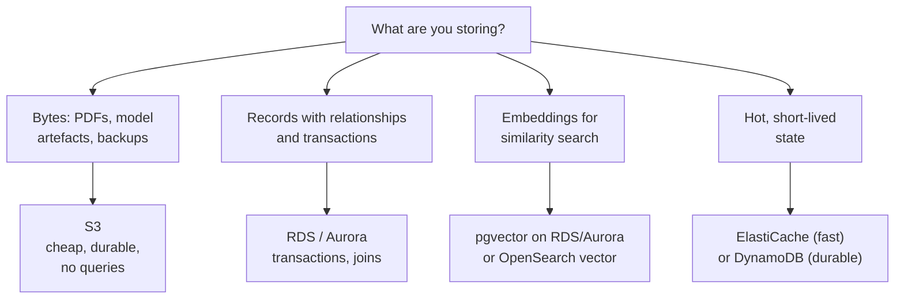

# AWS Storage and Databases

> **Interview answer (say this first).** An AI platform on AWS stores three different shapes of data, and each shape wants a different service. **S3** is object storage for durable blobs — raw documents, model artefacts, and backups — addressed by bucket and key. **RDS** (or Aurora) is managed relational storage for records that need transactions and queries. **ElastiCache** is managed in-memory Redis or Memcached for hot, short-lived data such as sessions, rate-limit counters, and cached retrieval results. Embeddings go in a vector-capable store, commonly pgvector on RDS/Aurora or OpenSearch. The interview skill is matching the shape of the data to the store, and naming the durability, consistency, and cost trade-off you accepted.

## Why this exists

Every AI feature touches data in at least three ways. It reads source material — PDFs, HTML pages, support tickets — that must survive a deployment. It computes embeddings and writes them somewhere a similarity search can find them again. And it tracks live state: conversation history, agent checkpoints, job status, and token budgets.

A beginner tries to put all of this in one place. That fails in predictable ways:

```text
All in Postgres   -> expensive per GB, slow for big blobs, painful to backup
All in S3         -> no transactions, no queries over relationships
All in memory     -> gone on restart; no durability at all
All in one disk   -> cannot scale reads, cannot fail over cleanly
```

The fix is not one clever database. It is **three or four boring services, each chosen for one access pattern**. This is how real platforms look, and it is why the topic is an interview favourite: it tests whether you can reason about data shape, not whether you memorised a service name.

There is also a cost story. Object storage is cheap per gigabyte and slow to query. A relational database is expensive per gigabyte but fast and transactional. Memory is the most expensive per gigabyte and the fastest. Ten terabytes of archived embeddings should not sit on the same tier as the ten megabytes of session state you read on every request.

> **Note:**
>
> **The one-sentence purpose.** S3 stores bytes cheaply and durably, RDS stores relationships with transactions, and ElastiCache stores hot state in memory. Choose by access pattern, not by familiarity.

## Start from zero

Assume nothing. Here is the vocabulary, in plain words.

| Word | Plain meaning |
| --- | --- |
| **Object storage** | A store where you put whole files ("objects") and fetch them by name. No folders, no joins. |
| **Bucket** | A named container for objects in S3. By default names are globally unique across all AWS accounts; in an account-regional namespace they only need to be unique within your account. |
| **Object** | The bytes you stored, plus its metadata. |
| **Key** | The object's full name inside a bucket, such as `raw/2026/report.pdf`. |
| **Prefix** | The leading part of a key, such as `raw/`. It looks like a folder but is only a name pattern. |
| **Storage class** | A price and retrieval-speed tier for an object: Standard, Infrequent Access, Glacier, and so on. |
| **Lifecycle policy** | A rule that moves or deletes objects automatically as they age. |
| **Versioning** | Keeping every version of an object instead of overwriting it. |
| **Presigned URL** | A time-limited URL that grants temporary access to one private object. |
| **Strong read-after-write consistency** | After a successful write, every later read sees the new value. S3 provides this today. |
| **SSE** | Server-side encryption: S3 encrypts the object before writing it. Options include SSE-S3 and SSE-KMS. |
| **Durability** | The probability your data still exists after failures. Designed to be extremely high. |
| **Availability** | The fraction of time you can read and write the data right now. |
| **RDS** | Amazon Relational Database Service: managed MySQL, PostgreSQL, MariaDB, Oracle, or SQL Server. |
| **Aurora** | AWS's cloud-native relational engine, compatible with MySQL and PostgreSQL, with replicated storage. |
| **Multi-AZ** | A standby database in a second Availability Zone, kept in sync for automatic failover. |
| **Read replica** | A read-only copy kept up to date asynchronously, used to scale reads. |
| **Endpoint** | The host name your application connects to. A Multi-AZ failover keeps the same endpoint. |
| **Automated backup** | Daily snapshots plus transaction logs, kept for a retention window you choose. |
| **PITR** | Point-in-time recovery: restore to any second inside the backup retention window. |
| **ElastiCache** | Managed in-memory caching, in Redis-compatible or Memcached flavours. |
| **Redis / Valkey** | A rich in-memory data structure store with persistence, replication, and pub/sub. |
| **Memcached** | A simple, multi-threaded in-memory cache with no persistence or replication. |
| **Cluster mode** | Splitting a Redis cluster into shards so data spreads across nodes. |
| **Shard** | One slice of a cluster-mode Redis cluster, owning part of the key space. |
| **Replica** | A copy of a shard or node used for failover and sometimes for reads. |
| **Eviction** | Removing keys when memory is full, chosen by a policy such as LRU. |
| **TTL** | Time to live: when a key expires automatically. |
| **Vector store** | A datastore that can find the nearest vectors to a query vector. |
| **pgvector** | A PostgreSQL extension that adds a vector column type and similarity indexes. |
| **OpenSearch** | Amazon's managed search engine, which also offers a vector search engine. |
| **DynamoDB** | AWS's managed key-value and document database, very fast at single-key access. |

Two distinctions prevent most confusion:

- **Durability is not availability.** S3 is designed to be extremely durable, but a bucket policy mistake can still make an object unreadable. Managed databases are durable, but a failover still costs seconds of downtime.
- **A prefix is not a directory.** In S3 there are no directories, only keys. Listing `raw/` is a scan for keys that start with those characters. Deleting a "folder" just deletes every matching key.

## The core idea

Picture a working kitchen.

**S3 is the pantry and the freezer.** It holds bulk goods, cheaply, for a long time. Everything is in a labelled box, and you fetch a box by its label. You do not sort the pantry contents while they are inside; you bring them out to a counter to work on them. The pantry is enormous and very unlikely to lose a box, but reaching the far shelf takes a moment.

**RDS is the labelled shelves plus a ledger.** It holds ingredients that relate to each other, and a book records every change so that a half-finished operation can be undone. It is smaller than the pantry and costs more per shelf, but it answers precise questions fast and it never leaves the kitchen inconsistent.

**ElastiCache is the countertop.** It holds only what you are actively using. It is the fastest surface in the room and the smallest, and the moment the power goes out the counter is wiped clean. That is fine, because everything there can be rebuilt from the pantry or the shelves.



Here is the mapping that matters for AI, and the line interviewers remember. Each row has a different access pattern, so each row wants a different service.

| AI need | Store it here | Why |
| --- | --- | --- |
| Raw source documents | S3 | Cheap, durable, versioned, easy to re-index |
| Extracted text and chunks | S3 (as JSONL) or RDS | Reproducible pipeline output |
| Embeddings | Vector store | Similarity search needs an index, not a scan |
| Chunk metadata | Same database as embeddings | Filter before or beside the vector search |
| Conversation history | DynamoDB or RDS | Durable, queryable per user |
| Cached retrieval results | ElastiCache | Repeat queries are common and cheap to cache |
| Agent run checkpoints | S3 (durable) plus ElastiCache (fast) | Durability for recovery, speed for the hot path |

## How it works

**S3: the object model.**

1. You choose a **bucket** and a **key**, then PUT the bytes. The key is the full name, and slashes in it are only characters.
2. S3 stores the object across multiple devices and Availability Zones, so a single hardware failure does not lose it.
3. A successful write is **strongly consistent**. Any read after that write, including a LIST, sees the new object or version.
4. Reads and writes are per-object. You cannot lock two objects in a transaction, and you cannot join them.
5. **Storage classes** trade retrieval speed and availability for price. Standard is the default; Infrequent Access and the Glacier tiers are cheaper to hold and cost more or take longer to fetch.
6. A **lifecycle policy** automates the move: transition to a cooler class after N days, then expire the object after M days. The class tiers have minimum storage durations, so moving too early does not save money.
7. **Versioning** keeps prior copies and turns a delete into a delete marker. This protects you from overwrites and accidental deletes, at the cost of storing every version.

**RDS: Multi-AZ versus read replicas.** This is the single most examined RDS distinction.

1. In classic **Multi-AZ**, AWS keeps a synchronous standby in a second Availability Zone. Every committed write is on both copies before the write is acknowledged.
2. The standby is **not readable** in the classic single-standby deployment. It exists for failover. (Aurora and Multi-AZ DB clusters do expose readable replicas, so read the exact engine documentation.)
3. On failure, RDS promotes the standby and repoints the **same endpoint**. Your application reconnects and keeps working.
4. A **read replica** is different: it is an asynchronous copy, readable, and usually used to offload reports or search traffic.
5. Because a read replica lags, it can serve stale rows. A failover is not automatic unless you promote it yourself, which changes the endpoint.
6. **Backups** run automatically inside a retention window and support point-in-time recovery. Manual **snapshots** are separate and live until deleted. In a Multi-AZ deployment, backups are taken from the standby so the primary is not slowed.

Use this table when asked to compare them:

| Property | Multi-AZ standby | Read replica |
| --- | --- | --- |
| Purpose | High availability / failover | Read scaling and offloading |
| Replication | Synchronous | Asynchronous |
| Readable | No (classic) | Yes |
| Failover | Automatic, same endpoint | Manual promote, new endpoint |
| Lag | None visible | Possible seconds of staleness |
| Cost | Doubles the instance | Adds another instance |

**ElastiCache: shards, replicas, and eviction.**

1. A basic Redis cluster is one **primary** plus optional **replicas** in other AZs. Replicas can take over if the primary fails.
2. **Cluster mode** splits the key space into **shards**. Each shard owns a slice of the 16,384 hash slots, so total memory and throughput grow with the number of shards.
3. The client must be cluster-aware. A key's shard is derived from its hash; a multi-key operation needs all keys in the same slot, which you force with a hash tag like `{user:42}:cart`.
4. Redis executes commands on a single thread per shard, so one very hot key can saturate one shard even when the cluster looks idle.
5. When memory fills, the **eviction policy** decides what leaves. `allkeys-lru` evicts the least recently used key of any kind; `volatile-lru` only considers keys that have a TTL.
6. **Memcached** is the other flavour: multi-threaded, horizontally scaled by the client, with no persistence, no replication, and no pub/sub. It is a pure cache.
7. Always reserve headroom. If Redis cannot evict and cannot grow, writes start to fail — so a cache without a policy and a memory buffer becomes an outage, not a slowdown.

## The syntax you will use

These are real production forms. **Bucket policy** and **lifecycle** documents are JSON; the lifecycle configuration is the structure you pass to boto3.

**A presigned URL gives temporary access to a private object.** The signer's permissions are borrowed, and the link expires.

```python
import boto3

s3 = boto3.client("s3")
url = s3.generate_presigned_url(
    "get_object",
    Params={"Bucket": "ai-platform-docs", "Key": "raw/q3-report.pdf"},
    ExpiresIn=900,   # seconds; shorter is safer
)
```

**A bucket policy can refuse unencrypted uploads.** This is the shape of every S3 policy: Version, Statement, Effect, Principal, Action, Resource.

```json
{
  "Version": "2012-10-17",
  "Statement": [
    {
      "Sid": "DenyUnencryptedUploads",
      "Effect": "Deny",
      "Principal": "*",
      "Action": "s3:PutObject",
      "Resource": "arn:aws:s3:::ai-platform-docs/*",
      "Condition": {
        "StringNotEquals": {
          "s3:x-amz-server-side-encryption": "aws:kms"
        }
      }
    }
  ]
}
```

**A lifecycle rule cools and then expires objects.** The `Filter` limits the rule to one prefix.

```json
{
  "Rules": [
    {
      "ID": "cool-then-archive",
      "Status": "Enabled",
      "Filter": {"Prefix": "raw/"},
      "Transitions": [
        {"Days": 30, "StorageClass": "STANDARD_IA"},
        {"Days": 90, "StorageClass": "GLACIER_IR"}
      ],
      "Expiration": {"Days": 365}
    }
  ]
}
```

**Infrastructure as code keeps the bucket settings reviewable.** This is a CloudFormation snippet.

```yaml
Resources:
  DocsBucket:
    Type: AWS::S3::Bucket
    Properties:
      BucketName: ai-platform-docs-example
      VersioningConfiguration:
        Status: Enabled
      BucketEncryption:
        ServerSideEncryptionConfiguration:
          - ServerSideEncryptionByDefault:
              SSEAlgorithm: aws:kms
      PublicAccessBlockConfiguration:
        BlockPublicAcls: true
        IgnorePublicAcls: true
        BlockPublicPolicy: true
        RestrictPublicBuckets: true
```

**Create a Multi-AZ database with backups and encryption.** One call sets the availability and recovery posture.

```python
rds = boto3.client("rds")
rds.create_db_instance(
    DBInstanceIdentifier="ai-app-db",
    Engine="postgres",
    DBInstanceClass="db.r6g.large",
    MultiAZ=True,                      # synchronous standby
    AllocatedStorage=200,
    MaxAllocatedStorage=1000,          # storage autoscaling ceiling
    BackupRetentionPeriod=14,          # days of PITR
    StorageEncrypted=True,
    DeletionProtection=True,
)
```

**A read replica scales reads, not writes.** It is asynchronous, so it can lag.

```python
rds.create_db_instance_read_replica(
    DBInstanceIdentifier="ai-app-db-replica",
    SourceDBInstanceIdentifier="ai-app-db",
)
```

**A cluster-mode cache spreads the key space.** `NumNodeGroups` is the shard count.

```python
elasticache = boto3.client("elasticache")
elasticache.create_replication_group(
    ReplicationGroupId="agents-cache",
    ReplicationGroupDescription="agent session state",
    Engine="redis",
    CacheNodeType="cache.r7g.large",
    NumNodeGroups=3,
    ReplicasPerNodeGroup=1,
    AutomaticFailoverEnabled=True,
    MultiAZEnabled=True,
)
```

**pgvector turns Postgres into a vector store.** The dimension must match your embedding model.

```sql
CREATE EXTENSION IF NOT EXISTS vector;

CREATE TABLE chunks (
    id          bigserial PRIMARY KEY,
    document_id text NOT NULL,
    content     text NOT NULL,
    embedding   vector(1536) NOT NULL,
    metadata    jsonb NOT NULL DEFAULT '{}'
);

CREATE INDEX ON chunks USING hnsw (embedding vector_cosine_ops);
```

## Examples: simple to real

**Example 1 — lifecycle rules trade retrieval speed for cost.** The table is qualitative on purpose; check current pricing before you claim savings.

| Class | Retrieval | Good for | Watch out |
| --- | --- | --- | --- |
| Standard | Immediate | Live data | Highest storage price |
| Standard-IA | Immediate | Backups, older docs | Retrieval fee, minimum duration |
| Glacier Instant Retrieval | Immediate | Archives still read occasionally | Minimum duration, retrieval fee |
| Glacier Flexible / Deep Archive | Minutes to hours | Compliance archives | Restore step; slowest and cheapest |

The rule is simple: **move data down only when you are confident nobody will read it soon.** If you restore constantly, the cooler class costs more, not less.

**Example 2 — LRU eviction in a full cache.** This small model shows what `allkeys-lru` does when memory is full.

```python
from collections import OrderedDict

class LRUCache:
    """A model of Redis allkeys-lru when memory is full."""

    def __init__(self, capacity: int) -> None:
        self.capacity = capacity
        self.data: OrderedDict[str, str] = OrderedDict()
        self.evictions = 0

    def get(self, key: str) -> str | None:
        if key not in self.data:
            return None
        self.data.move_to_end(key)          # a hit refreshes recency
        return self.data[key]

    def set(self, key: str, value: str) -> None:
        if key in self.data:
            self.data.move_to_end(key)
        self.data[key] = value
        if len(self.data) > self.capacity:
            evicted, _ = self.data.popitem(last=False)   # least recently used
            self.evictions += 1
            print("evicted:", evicted)

cache = LRUCache(capacity=3)
for key in ["a", "b", "c"]:
    cache.set(key, key.upper())
cache.get("a")            # refresh a
cache.set("d", "D")       # evicts b
print("keys:", list(cache.data))
print("get b:", cache.get("b"), "evictions:", cache.evictions)
```

The real lesson: capacity must exceed the working set. If your hot set is larger than the node, every request misses and the cache does nothing but churn.

**Example 3 — embedding storage is small; the index is not.** Arithmetic, not an AWS claim, and worth doing out loud in an interview.

```python
dims = 1536
bytes_per_float = 4
vectors = 1_000_000

per_vector = dims * bytes_per_float
raw_gib = per_vector * vectors / 1024**3
print(f"{per_vector} bytes per vector")
print(f"raw vectors: {raw_gib:.2f} GiB")
```

One million 1536-dimension float32 vectors are roughly six gigabytes before any index. A graph index such as HNSW adds its own memory overhead, which is why vector search is a memory-sizing problem as much as a storage problem.

**Example 4 — the full RAG data layout.** This is the answer to "how would you store a RAG system on AWS?"

```text
S3            raw/          original PDFs and HTML        versioned, encrypted
S3            chunks/       chunked text as JSONL         reproducible pipeline
Aurora/RDS    chunks table  embedding vector(1536)        pgvector + HNSW index
RDS           documents     title, owner, ACL, checksum   joins and filters
ElastiCache   query cache   recent retrieval results      TTL measured in minutes
DynamoDB      agent_runs    conversation and checkpoints  durable per-run state
```

Each row is a different service because each row has a different access pattern. That is the whole page in one block.

## In production

- **Encrypt by default and block public access.** Turn on SSE-KMS (or SSE-S3) and all four Block Public Access settings on every bucket. Exceptions should need a written reason.
- **Enable versioning before you need it.** Versioning is what saves you from an overwrite bug or a bad delete. Add a lifecycle rule to expire old versions so the cost does not grow forever.
- **Use presigned URLs instead of proxying large files.** Let S3 serve the bytes. Set short expiries and never log the URL.
- **Size ElastiCache to the working set and set an eviction policy.** `allkeys-lru` is a sensible default for a pure cache. Reserve memory headroom, and remember that Redis is single-threaded per shard, so a hot key can cap you.
- **Never put the only copy of state in a cache.** ElastiCache has no strong durability guarantee. If losing the cache would lose business data, that data belongs in RDS or DynamoDB.
- **Multi-AZ is for availability, not read scaling.** If reads are the bottleneck, add replicas and tolerate lag; if writes are, change the instance or partition the data.
- **Test failover on purpose.** A Multi-AZ failover you have never rehearsed will still surprise you, because the app must reconnect and retry in-flight work.
- **Watch read-replica lag before you route traffic to it.** Serving a stale report is one thing; serving stale permissions or balances is another.
- **Point-in-time recovery is not a backup strategy on its own.** Keep manual snapshots or cross-region copies for the accidents that outlive the retention window.
- **RDS connection limits bite serverless.** Many short-lived Lambda connections exhaust the database. Use RDS Proxy or a pooler.
- **Lifecycle transitions and retrieval fees can invert your savings.** Sampling access patterns before choosing a cooler class is cheaper than discovering the mistake on the bill.
- **Agentic-AI relevance.** Treat raw agent transcripts as sensitive documents: S3 with KMS, short retention, and a lifecycle policy. Embeddings are not anonymous — they can leak content — so they inherit the same access controls as the source text.

## Interview questions

### 1. Why not store everything in one database?

**Answer.** Because the shapes are different. S3 is cheap per gigabyte and built for whole objects, but it has no transactions or joins. RDS is transactional and queryable but expensive per gigabyte and poor for large blobs. ElastiCache is fast but not durable. Using one store forces every workload into the worst trade-off for it: either you pay relational prices for archived files or you lose transactional integrity for records.

**Follow-up: "What is the cost of splitting them?"** You take on more moving parts: more IAM policies, more connection pooling, and consistency between stores that no longer share a transaction. The benefit is that each workload scales and fails independently.

**Trap.** Saying "use DynamoDB for everything." It is excellent for key-value access and a poor fit for ad-hoc analytical queries or multi-row transactions across entities.

### 2. When do you use Multi-AZ versus a read replica?

**Answer.** Multi-AZ is for availability: a synchronous standby in another Availability Zone is promoted automatically on failure, and the application keeps the same endpoint. A read replica is for read scaling: an asynchronous, readable copy that you promote manually if you need to, which changes the endpoint.

**Follow-up: "Can a read replica serve as a failover target?"** Yes, but the switch is manual and the replica may lag. That is a different, weaker guarantee than Multi-AZ automatic failover.

**Trap.** Claiming Multi-AZ increases read throughput. In the classic deployment the standby serves no reads; it only waits.

### 3. How does S3 consistency work today?

**Answer.** S3 provides strong read-after-write consistency for PUTs of new objects, for overwrites, and for deletes, and LIST is strongly consistent too. After a successful write, a later read sees it. That was not always true historically, which is why older material warns about eventual consistency.

**Follow-up: "What is still eventually consistent?"** Object data and reads of object metadata, tags, and ACLs are strongly consistent. Only bucket-configuration changes — lifecycle rules, CORS, or a bucket policy — are eventually consistent. Cross-region replication is asynchronous, and reading from another Region reads a different bucket copy.

**Trap.** Repeating the outdated "S3 is eventually consistent" line. Use current behaviour, and note that consistency across replicated buckets is a separate question.

### 4. What does a presigned URL actually grant?

**Answer.** It is a URL signed with a credential that has permission on that object. Anyone holding it can perform the signed operation until it expires — no AWS account needed. The permissions come from the signer, so a presigned PUT can upload, not just download.

**Follow-up: "What are the risks?"** The URL is a bearer token. Logs, browser history, and chat messages can leak it. Use short expiries, restrict the operation and key, and never log the URL.

**Trap.** Assuming a presigned URL is safe to share widely because it expires. Fifteen minutes is plenty of time to exfiltrate a document.

### 5. How do you choose a vector store on AWS?

**Answer.** Start from what you already run. If you are on Aurora or RDS PostgreSQL, pgvector keeps embeddings next to your metadata, so a single SQL query can filter and search, and you keep your existing backups and IAM. Choose OpenSearch when you need large-scale search, hybrid keyword-plus-vector ranking, or managed index lifecycle. Consider a purpose-built vector database when vector scale and latency dominate; accept that it is another system to operate.

**Follow-up: "What matters most for the decision?"** Scale and freshness. Vector count and dimension set memory needs; the update rate decides whether you can rebuild indexes in batches or need incremental writes.

**Trap.** Picking a vector store before you know the number of vectors and the filter requirements. Filtering is often the hard part, not the nearest-neighbour search.

### 6. What is the difference between S3 storage classes, and when do they backfire?

**Answer.** Classes trade price for retrieval speed and availability. Standard is immediate and the most expensive to hold. Infrequent Access is cheaper to hold but charges retrieval and has a minimum duration. Glacier tiers are cheapest to hold and slowest or costliest to read, and some need a restore step.

**Follow-up: "When does a lifecycle rule cost more?"** When data is restored often, or when it is moved before the minimum duration is met, or when small objects are transitioned and per-object overhead dominates. Cool storage is for data you truly stop reading.

**Trap.** Setting a lifecycle rule to archive everything after 30 days and discovering that the nightly job re-reads it.

### 7. How do you protect against accidental deletion of data?

**Answer.** Layer the controls. Enable S3 versioning so a delete only writes a delete marker, and block public access and bucket deletion with IAM and bucket policies. On RDS, enable deletion protection, keep automated backups plus manual snapshots, and copy critical snapshots to another Region or account. Restrict who holds `s3:DeleteObject` and `rds:DeleteDBInstance`.

**Follow-up: "What does deleting a versioned object actually do?"** A normal delete adds a delete marker and hides the object but keeps the data. You must delete the specific version to remove it. That is what makes accidental deletes recoverable.

**Trap.** Confusing a delete marker with deletion. The data is still there, and still billable, until the version expires.

### 8. How do you size an ElastiCache cluster, and what breaks first?

**Answer.** Size memory to hold the working set plus headroom, and size shards to spread throughput. Set an eviction policy for a pure cache, or writes will fail when memory fills. What breaks first is usually a single hot key saturating one shard, because Redis executes commands on one thread per shard. A close second is treating the cache as durable and losing data on failover.

**Follow-up: "How do you fix a hot key?"** Split it into shards with a random suffix, keep a small local cache in front, or replicate the key across replicas and spread reads. The right fix depends on whether the key is read-hot or write-hot.

**Trap.** Adding shards to fix a hot key without first checking key distribution. Re-sharding helps only if the load is spread across keys.

## Remember this

- **Match the store to the data shape:** S3 for bytes, RDS/Aurora for transactional records, ElastiCache for hot state, a vector store for embeddings.
- **Multi-AZ is availability; read replicas are read scaling.** Neither scales writes.
- **S3 is strongly consistent today**, versioned for protection, and lifecycle-managed for cost.
- **Never make a cache the only copy of anything you cannot rebuild.** It will be lost eventually.
- **Encrypt by default and block public access.** The cheapest security win is a default you never have to remember.
