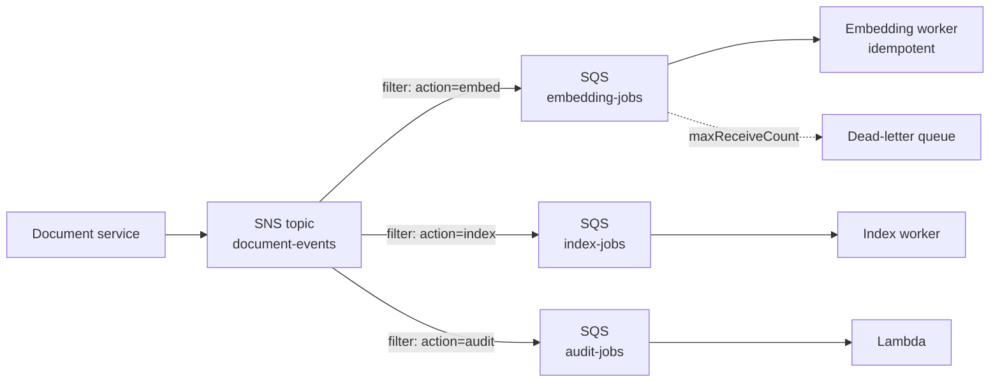
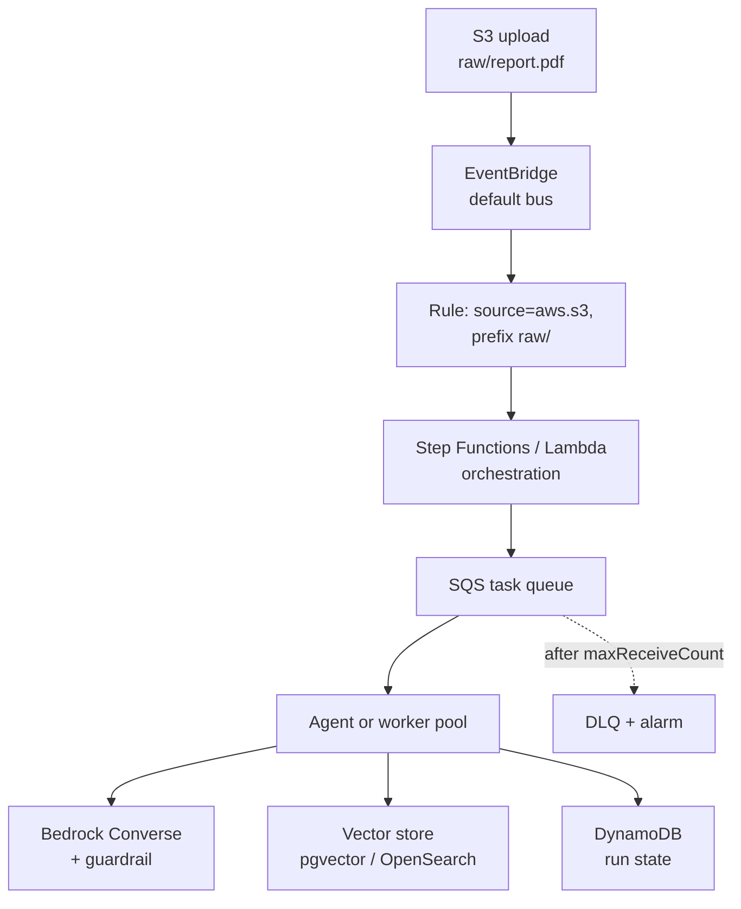

# AWS Messaging and AI

> **Interview answer (say this first).** AWS messaging gives an AI platform three decoupling tools. **SQS** is a managed queue: producers send, consumers poll, a received message is hidden for a visibility timeout, and repeated failures go to a dead-letter queue. Use a standard queue for scale or a FIFO queue when per-group order and deduplication matter. **SNS** is fan-out: one publish, many subscribers (queues, Lambdas, HTTP endpoints), with subscription filter policies so each subscriber sees only the events it wants. **EventBridge** is a managed event bus with rules that match event patterns, plus scheduling and replay. **Bedrock** is the managed model layer: one API over many foundation models, with IAM auth, guardrails, and knowledge bases. Choose Bedrock when you want AWS-native integration, a provider API when you want the newest models and features, and self-hosting when you need control, customisation, or data residency.

## Why this exists

A synchronous AI request is the easy case: the user waits, the model answers. But production AI is full of work that should not block a user:

```text
A 60-page PDF is uploaded       -> chunk, embed, and index it in the background
A nightly evaluation suite runs -> fan out thousands of prompts to workers
An agent calls a slow tool      -> pause the run and resume when the tool finishes
A tenant exceeds its token quota-> notify billing without blocking the request
```

Doing all of this inline makes the request slow and fragile. If the embedding service is briefly down, the upload fails. If one document is malformed, the whole batch stalls.

Messaging breaks the chain. The uploader stores the file and publishes an event. Workers pull tasks at their own pace. A slow worker does not slow the uploader, and a poison message is isolated in a dead-letter queue instead of blocking the line. That is the whole value: **decoupling in time and in failure**.

Bedrock enters because the model call is itself a slow, rate-limited, sometimes-failing dependency. Putting a queue between "a document needs embedding" and "call the embedding model" gives you retries, backpressure, and a place to observe failures. The queue is not an optimisation; it is the reliability layer around the model.

> **Note:**
>
> **The one-sentence purpose.** SQS decouples a producer from a slow consumer, SNS broadcasts one event to many consumers, EventBridge routes events by content, and Bedrock runs the models those consumers call — behind IAM, guardrails, and a queue.

## Start from zero

| Word | Plain meaning |
| --- | --- |
| **Queue** | Where messages wait until a consumer takes them. |
| **Producer** | The component that sends a message. |
| **Consumer** | The component that receives and processes a message. |
| **Long polling** | A receive call that waits for a message instead of returning empty immediately. |
| **Visibility timeout** | After a receive, how long the message is hidden from other consumers. |
| **Receipt handle** | A per-receive token used to delete the message or extend its timeout. |
| **Dead-letter queue (DLQ)** | A queue that collects messages that failed too many times. |
| **Redrive policy** | The rule that moves a message to the DLQ after `maxReceiveCount` receives. |
| **Max receive count** | How many times SQS delivers a message before the redrive policy fires. |
| **Message retention** | How long SQS keeps an unconsumed message before discarding it. |
| **Standard queue** | SQS default: at-least-once, best-effort ordering, very high throughput. |
| **FIFO queue** | SQS ordered queue: per-message-group order plus deduplication. |
| **Message group ID** | The FIFO lane key; order is guaranteed inside one group. |
| **Deduplication ID** | A FIFO token that suppresses duplicate sends in a short window. |
| **At-least-once** | Every message is delivered one or more times; duplicates can happen. |
| **Idempotent consumer** | A handler that produces the same result if it runs twice. |
| **SNS** | Simple Notification Service: publish to a topic, deliver to many subscribers. |
| **Topic** | The named channel in SNS that producers publish to. |
| **Subscription** | One endpoint registered on a topic: SQS, Lambda, HTTP, email, SMS. |
| **Fan-out** | One published message copied to every subscription. |
| **Filter policy** | A per-subscription rule that matches on message attributes. |
| **Message attribute** | Structured key-value metadata on a message, separate from the body. |
| **SNS FIFO topic** | An ordered, deduplicated SNS topic that pairs with FIFO queues. |
| **EventBridge** | A managed event bus with rules, patterns, targets, and replay. |
| **Scheduler / Pipes** | EventBridge features for cron triggers and managed source-to-target connections. |
| **Event bus** | The channel that events are put on. AWS services have a default bus. |
| **Rule** | A match on an event pattern, with one or more targets. |
| **Event pattern** | A JSON filter over the event's fields, such as `source` and `detail`. |
| **Target** | What a rule invokes: Lambda, SQS, SNS, Step Functions, and more. |
| **Bedrock** | AWS's managed service for invoking foundation models. |
| **Foundation model** | A large pretrained model offered through an API. |
| **Model access** | Permission to invoke a specific model in a specific Region. |
| **Converse API** | Bedrock's unified chat-style request API across supported models. |
| **Guardrail** | A configurable filter for content, topics, words, and PII around a model. |
| **Knowledge base** | Bedrock's managed retrieval layer over your documents. |
| **Provisioned throughput** | Reserved model capacity, as opposed to on-demand usage billed per token. |

Two distinctions keep the rest of the page clear:

- **Queue versus topic.** A queue delivers each message to exactly one consumer (after retries). A topic copies each message to every subscriber. Fan-out in AWS is SNS to many SQS queues, not one queue to many consumers.
- **At-least-once versus exactly-once.** SQS standard and FIFO are both at-least-once for processing. FIFO deduplicates *sends* in a window; it cannot make your database write and your queue delete atomic. Idempotent consumers remain mandatory.

## The core idea

Picture three ways to spread news in a town.

**SQS is the post office's task box.** You drop a slip into the box. One clerk takes a slip, and the box hides it while the clerk works so no second clerk grabs the same one. If the clerk finishes, they throw their slip away. If they wander off, the slip reappears and someone else may process it. The box is unlimited and nobody has to wait in line with you.

**SNS is the newspaper.** You print one edition and the distributor drops a copy at every subscriber's door: one queue, one Lambda, one webhook. You do not know or care who reads it. With a filter policy, a subscriber can say "only deliver editions about embeddings," and the distributor skips the rest.

**EventBridge is the town switchboard.** Events arrive labelled by source and type. Operators sit at a board of rules: "anything from S3 with key `raw/*.pdf` goes to the ingestion workflow." The switchboard remembers events for replay and can also ring on a schedule. It is the most flexible and the most opinionated of the three.



Now the full event-driven shape, which is the architecture answer to "how do you build an AI ingestion pipeline?"



Read both diagrams as one rule: **events describe what happened; queues absorb work; the model is just one more downstream dependency with its own retries.**

## How it works

**SQS: the message lifecycle.**

1. The producer calls `SendMessage` with a small JSON body.
2. SQS stores the message across Availability Zones. There is no cluster for you to operate.
3. The consumer calls `ReceiveMessage`. With long polling it waits for a message instead of returning empty calls.
4. SQS returns the message plus a **receipt handle** and hides the message for the **visibility timeout**.
5. The consumer does the work and calls `DeleteMessage` with that receipt handle.
6. If the timeout expires first — a crash, a slow job, a forgotten delete — the message becomes visible and is delivered again.
7. After `maxReceiveCount` receives, the **redrive policy** moves the message to the **DLQ**, where it waits for inspection.
8. If nobody consumes a message within the **retention window**, SQS discards it. That is data loss for an unconsumed task.

The visibility timeout must be longer than the worst-case processing time, or healthy workers will fight over the same message. For a long embedding job, either set a generous timeout or call `ChangeMessageVisibility` to extend it while work continues.

**SNS: fan-out and filtering.**

1. A producer publishes to a **topic**.
2. Every **subscription** receives a copy. Subscriptions include SQS queues, Lambda functions, HTTPS endpoints, email, and SMS.
3. Each message can carry **message attributes** — small typed key-values that are not part of the body.
4. A subscription's **filter policy** matches those attributes. Non-matching messages are never delivered to that subscriber.
5. A subscription that repeatedly fails can be given a **dead-letter queue**, so poison deliveries are visible.
6. SNS delivers to available subscribers; it is not a durable store. If a subscriber is down, the retry policy and DLQ decide what happens next.
7. **SNS FIFO** topics preserve order within a message group and deduplicate, and they deliver to SQS FIFO queues.

Filtering at the subscription is cheaper and safer than filtering in code, because the unwanted message never reaches the consumer.

**EventBridge: content-based routing.**

1. Events are put on an **event bus**. AWS services publish to the default bus automatically; you can create custom buses to isolate applications.
2. A **rule** matches events against a JSON **event pattern**. Patterns match on fields such as `source`, `detail-type`, and nested `detail` values.
3. A matched event is delivered to one or more **targets**: Lambda, SQS, SNS, Step Functions, or an API destination.
4. Rules can **archive** events and **replay** them later, which is invaluable when you fix a consumer and need to reprocess.
5. The **schema registry** discovers and documents event shapes.
6. **Scheduler** handles cron and one-off future invocations, and **Pipes** connects a source to a target with managed filtering and enrichment.

**Bedrock: the model call as a managed service.**

1. You confirm **model access** for the model and Region you intend to use. Availability differs by Region.
2. Your application calls the `bedrock-runtime` API. The **Converse** API gives one message-shaped request across supported models, so switching models is mostly a config change.
3. IAM authorises the call. You can keep traffic on the AWS network with a VPC endpoint instead of the public internet.
4. A **guardrail** can be attached to the request to filter content, block denied topics and words, and redact or block sensitive information such as PII.
5. For retrieval, a **knowledge base** syncs documents from a data source such as S3, chunks and embeds them into a supported vector store, and answers `Retrieve` or `RetrieveAndGenerate` calls.
6. Usage is metered. **On-demand** is billed per input and output token; **provisioned throughput** reserves capacity for steadier latency and higher volume. Batch inference handles large offline jobs.
7. CloudWatch receives metrics, and optional model invocation logging writes prompts and responses to CloudWatch Logs or S3. Treat that logging as sensitive.

**Choosing where the model runs.** This table is the decision interviewers are probing.

| Option | Strongest when | Weak when |
| --- | --- | --- |
| **Bedrock** | You want IAM, VPC, guardrails, knowledge bases, and one AWS bill | You need a model or feature Bedrock does not yet offer in your Region |
| **Provider API** (direct) | You want the newest models and features first, and full provider tooling | You accept a second vendor, separate billing, and data leaving your AWS boundary |
| **Self-hosted** (EC2, EKS, SageMaker) | You need fine-tuning control, custom serving, or strict data residency | You must run GPUs, scaling, and upgrades yourself |

## The syntax you will use

**Send, receive with long polling, and delete.** The order matters: delete only after the work succeeds.

```python
import json
import boto3

sqs = boto3.client("sqs", region_name="us-east-1")
queue_url = sqs.get_queue_url(QueueName="embedding-jobs")["QueueUrl"]

sqs.send_message(
    QueueUrl=queue_url,
    MessageBody=json.dumps({"document_id": "doc-42", "s3_key": "raw/doc-42.pdf"}),
)

response = sqs.receive_message(
    QueueUrl=queue_url,
    MaxNumberOfMessages=10,
    WaitTimeSeconds=20,          # long polling
    VisibilityTimeout=300,       # generous for an embedding job
)
for message in response.get("Messages", []):
    process(message["Body"])
    sqs.delete_message(QueueUrl=queue_url, ReceiptHandle=message["ReceiptHandle"])
```

**A redrive policy moves poison messages to a DLQ.** This is a real SQS queue attribute, stored as JSON.

```json
{
  "deadLetterTargetArn": "arn:aws:sqs:us-east-1:123456789012:embedding-jobs-dlq",
  "maxReceiveCount": "5"
}
```

**A FIFO queue needs a group and a deduplication ID.** Use the agent run ID as the group so one run's steps stay ordered.

```python
sqs.send_message(
    QueueUrl=fifo_queue_url,
    MessageBody=json.dumps({"run_id": "run-7f3", "step": 4}),
    MessageGroupId="run-7f3",            # ordering lane
    MessageDeduplicationId="run-7f3-step-4",  # suppress duplicate sends
)
```

**Subscribe a queue to an SNS topic with raw delivery.** Raw delivery avoids the SNS JSON envelope, so the body is exactly what you published.

```python
sns = boto3.client("sns", region_name="us-east-1")

topic_arn = sns.create_topic(Name="document-events")["TopicArn"]
sns.subscribe(
    TopicArn=topic_arn,
    Protocol="sqs",
    Endpoint=queue_arn,
    Attributes={"RawMessageDelivery": "true"},
)
```

**A filter policy delivers only matching events.** The values match the message's attributes, not the body.

```json
{
  "action": ["embed", "reindex"],
  "tenant_tier": ["paid", "enterprise"]
}
```

**A rule matches events by pattern.** This rule fires for uploaded objects under `raw/` in one bucket.

```json
{
  "source": ["aws.s3"],
  "detail-type": ["Object Created"],
  "detail": {
    "bucket": {"name": ["ai-platform-docs"]},
    "object": {"key": [{"prefix": "raw/"}]}
  }
}
```

**Call Bedrock with the Converse API and a guardrail attached.** The response shape is the same across supported models.

```python
bedrock = boto3.client("bedrock-runtime", region_name="us-east-1")

response = bedrock.converse(
    modelId=os.environ["BEDROCK_MODEL_ID"],   # model IDs and Regions change; read the current list
    messages=[{"role": "user", "content": [{"text": "Summarise this support ticket."}]}],
    inferenceConfig={"maxTokens": 512, "temperature": 0.2},
    guardrailConfig={
        "guardrailIdentifier": "gr-abc123",
        "guardrailVersion": "1",
    },
)
print(response["output"]["message"]["content"][0]["text"])
```

## Examples: simple to real

**Example 1 — visibility timeout causes duplicates, and the DLQ catches them.** This small model shows the exact SQS behaviour without touching AWS.

```python
class VisibilityQueue:
    """A tiny model of SQS: hidden on receive, visible again after the timeout."""

    def __init__(self, visibility: int = 3, max_receives: int = 2) -> None:
        self.messages: list[dict] = []
        self.visibility = visibility
        self.max_receives = max_receives
        self.dlq: list[str] = []

    def send(self, body: str) -> None:
        self.messages.append({"body": body, "receives": 0, "visible_at": 0})

    def receive(self, now: int) -> dict | None:
        for message in self.messages:
            if message["visible_at"] <= now:
                message["receives"] += 1
                if message["receives"] > self.max_receives:
                    self.messages.remove(message)
                    self.dlq.append(message["body"])
                    return None
                message["visible_at"] = now + self.visibility
                return message
        return None

    def delete(self, message: dict) -> None:
        self.messages.remove(message)

q = VisibilityQueue(visibility=3, max_receives=2)
q.send("embed-doc-42")

first = q.receive(now=0)
print(first["body"], "-> hidden until t=3")
# the worker crashes and never deletes
second = q.receive(now=4)
print(second["body"], "delivered again")
# it crashes again
third = q.receive(now=8)
print(third)
print(q.dlq)
```

Run it and you get `embed-doc-42 -> hidden until t=3`, then `embed-doc-42 delivered again`, then `None`, then `['embed-doc-42']`. The duplicate is the contract, not a bug. The DLQ is what stops it looping forever.

**Example 2 — fan-out with filters removes wasted work.** One document event, three interested consumers, and one consumer that should ignore it.

| Subscriber | Filter policy | Receives `action=embed`? | Receives `action=audit`? |
| --- | --- | --- | --- |
| Embedding queue | `{"action": ["embed", "reindex"]}` | Yes | No |
| Index queue | `{"action": ["index"]}` | No | No |
| Audit queue | `{"action": ["audit"]}` | No | Yes |
| Billing Lambda | `{"tenant_tier": ["enterprise"]}` | Only for enterprise | Only for enterprise |

Without filters, every consumer runs for every event and throws most of them away. That waste is real money at scale, and it also floods logs.

**Example 3 — the async ingestion pipeline, step by step.** The upload returns immediately; the heavy work happens later.

```text
1. Client uploads to S3 and gets a fast 200 response
2. S3 emits Object Created on the default EventBridge bus
3. A rule matches prefix raw/ and starts the ingestion workflow
4. Workflow enqueues one SQS task per document
5. A worker reads the task with long polling
6. Worker extracts text, chunks it, calls Bedrock to embed
7. Worker upserts vectors and records status in DynamoDB
8. On success the worker deletes the message
9. On repeated failure the message lands in the DLQ and alarms
```

Steps 1 and 8 are the contract: the user is not waiting, and the queue holds the truth about what still needs doing.

**Example 4 — putting a guardrail around an agent call.** The guardrail is configuration, not prompt text, so it applies no matter who writes the prompt.

```text
Converse request
  modelId: current model
  messages: user + retrieved context
  guardrailConfig:
    guardrailIdentifier: gr-abc123
    guardrailVersion: "1"
  -> content filters, denied topics, word filters, PII filters
  -> either a normal answer or a blocked/redacted one
```

Because the guardrail lives at the model boundary, it can detect prompt attacks in the input, including retrieved content — the failure mode an agent faces. It is a layer, not a guarantee, so keep input and output validation alongside it.

## In production

- **Make every consumer idempotent.** SQS and SNS are at-least-once. Deduplicate on a stable key such as `run_id` or an event ID, and make writes upserts. FIFO deduplication covers sends, not redeliveries.
- **Delete or acknowledge only after the side effect succeeds.** Deleting early loses work on a crash; never deleting causes a redelivery storm.
- **Set the visibility timeout above the worst-case job, then heartbeat.** For long model calls, call `ChangeMessageVisibility` while the work continues instead of setting an hour for every message.
- **Attach a DLQ on day one and alarm on its depth.** An unmonitored DLQ is where poison messages and real incidents quietly accumulate.
- **Use long polling everywhere.** It cuts empty receives, reduces cost, and lowers latency. Short polling is the default mistake.
- **Filter at the subscription, not in code.** SNS filter policies stop unwanted messages before they reach (and bill) your consumer.
- **Prefer EventBridge for content-based routing, SQS for load levelling.** EventBridge is not a queue; it routes and does not buffer work the way SQS does.
- **Bound retries and use backoff.** A tight retry loop on a failing model call amplifies an outage. Add jitter and a maximum attempt count.
- **Watch retention as a deadline.** A message nobody consumes within the retention window is discarded. For critical work, alert on queue age, not just depth.
- **Treat model invocation logs as sensitive.** Prompts and responses may contain PII, secrets, or customer data. Encrypt, restrict, and set retention.
- **Guardrails are a layer, not a guarantee.** They reduce risk; they do not replace input validation, output validation, least privilege, or human approval for high-impact actions.
- **Agentic-AI relevance.** Key FIFO message groups by agent run ID so steps stay ordered, keep a durable run state in DynamoDB, and put an SQS queue between the orchestrator and the model so a throttled model produces retries and backpressure instead of a failed run.

## Interview questions

### 1. When do you choose a standard SQS queue over a FIFO queue?

**Answer.** Choose standard by default: it scales very high, needs no group or deduplication ID, and best-effort ordering is fine for independent tasks such as embedding a document. Choose FIFO when order within an entity matters — steps of one agent run, ledger postings for one account — and when you want send-side deduplication. FIFO trades throughput and flexibility for that ordering.

**Follow-up: "Does FIFO give exactly-once processing?"** No. It suppresses duplicate sends in a window and preserves per-group order, but a visibility-timeout redelivery can still process a message twice. Your consumer must be idempotent.

**Trap.** Assuming FIFO means global ordering. Order is per `MessageGroupId`; different groups interleave freely.

### 2. Explain the visibility timeout and how it causes duplicates.

**Answer.** On receive, SQS hides the message for the visibility timeout. If the consumer deletes it in time, it is gone. If the timeout expires first, the message becomes visible and another consumer receives it, so the work may happen twice. Size the timeout above the worst-case job and extend it with `ChangeMessageVisibility` for long tasks.

**Follow-up: "What if the timeout is very long?"** A crash then delays redelivery for that whole period, so recovery is slower. Balance duplicate risk against recovery time, and heartbeat for long jobs.

**Trap.** Thinking the timeout is a processing deadline. It is only the hidden window; nothing is enforced at the end of it except re-delivery.

### 3. How does SNS fan-out work, and why use filter policies?

**Answer.** A producer publishes once to a topic, and SNS copies the message to every subscription — SQS queues, Lambdas, HTTPS endpoints, and more. A subscription filter policy matches message attributes and suppresses delivery of non-matching messages. Filtering at the subscription saves money and reduces noise, because unwanted messages never reach the consumer.

**Follow-up: "What happens if a subscriber is down?"** SNS retries according to the subscription policy and, if configured, sends the failed delivery to a dead-letter queue. It is not a durable queue; pair SNS with SQS when you need buffering.

**Trap.** Putting the routing logic in the consumer instead of a filter policy. Every consumer then runs for every event and discards most of them.

### 4. How do SQS, SNS, and EventBridge differ?

**Answer.** SQS is a queue: one message is processed by one consumer, with hidden visibility and a DLQ. SNS is a pub/sub topic: one message is copied to every subscriber, with attribute-based filtering. EventBridge is an event bus: rules match rich JSON event patterns and route to targets, with archive and replay. Use SQS to absorb work, SNS to broadcast, EventBridge to route by event content.

**Follow-up: "Can they be combined?"** Yes, and often are. An S3 event reaches EventBridge, a rule sends it to SNS, and SNS fans out to several SQS queues that buffer work for independent worker pools.

**Trap.** Using SNS where you need a buffer, or SQS where you need broadcast. One queue delivers each message to a single consumer.

### 5. What is a dead-letter queue, and how do you operate one?

**Answer.** A DLQ collects messages that failed too many times. In SQS a redrive policy moves a message after `maxReceiveCount` receives; in SNS a subscription can have a DLQ for failed deliveries. Operate it by alarming on depth, inspecting a sample, fixing the cause, and redriving the messages back.

**Follow-up: "Why not just retry forever?"** Infinite retries create a hot loop that burns compute, hides the bug, and can starve healthy messages. A bounded receive count with a DLQ turns an invisible failure into a visible one.

**Trap.** Treating the DLQ as a graveyard. An unmonitored DLQ means production failures are accumulating silently.

### 6. What does Bedrock give you over calling a model provider directly?

**Answer.** AWS-native integration. Bedrock uses IAM for auth, supports VPC endpoints so traffic stays off the public internet, offers guardrails for content and PII filtering, provides managed knowledge bases for RAG, and lands metrics in CloudWatch. It also gives one API across many models, so you can switch models without a new vendor relationship.

**Follow-up: "When would you not use Bedrock?"** When the newest model or a provider-specific feature is not available there yet, or when you need deep fine-tuning control, or when a model is simply unavailable in your Region. Then use the provider API or self-host.

**Trap.** Assuming Bedrock is one model. It is a catalogue of models from several providers, and model availability varies by Region.

### 7. How do guardrails fit into an agent's request path?

**Answer.** A guardrail is configuration attached to the model call. It can filter harmful content, block denied topics and specific words, and detect or redact sensitive information such as PII. Because it sits at the model boundary, it also filters content that arrived through retrieved documents and prompt injection, not just the user's original text.

**Follow-up: "Are guardrails enough?"** No. Keep input and output validation, least-privilege tools, and human approval for high-impact actions. Guardrails reduce risk; they do not provide a security guarantee.

**Trap.** Relying on prompt instructions alone for safety. Prompts can be overridden by injected content; enforced filters cannot be talked out of it.

### 8. How do you make an async AI pipeline reliable end to end?

**Answer.** Combine the pieces. Buffer work in SQS with a visibility timeout longer than the job, make every consumer idempotent on a stable run ID, bound retries with backoff, and route poison messages to a DLQ with an alarm. Keep durable run state in DynamoDB or RDS so a redelivery can resume, and add a model fallback or circuit breaker for provider throttling.

**Follow-up: "Where do you observe it?"** On queue age and depth, DLQ depth, consumer error rate, and model latency and throttle metrics. Queue age is the signal that the system is falling behind; depth alone can rise and fall harmlessly.

**Trap.** Trusting FIFO plus retries to make the pipeline correct. Correctness comes from idempotent handlers and durable state, not from the queue type.

## Remember this

- **SQS absorbs work, SNS broadcasts, EventBridge routes by content.** Pick the shape, then combine them.
- **Delete after success, size the visibility timeout above the job, and always attach a DLQ.**
- **At-least-once means idempotent consumers.** Deduplicate on a stable business key, not on hope.
- **Bedrock is the AWS-native model layer:** IAM, VPC, guardrails, knowledge bases, CloudWatch.
- **Choose Bedrock for integration, a provider API for the newest capabilities, and self-hosting for control.**
