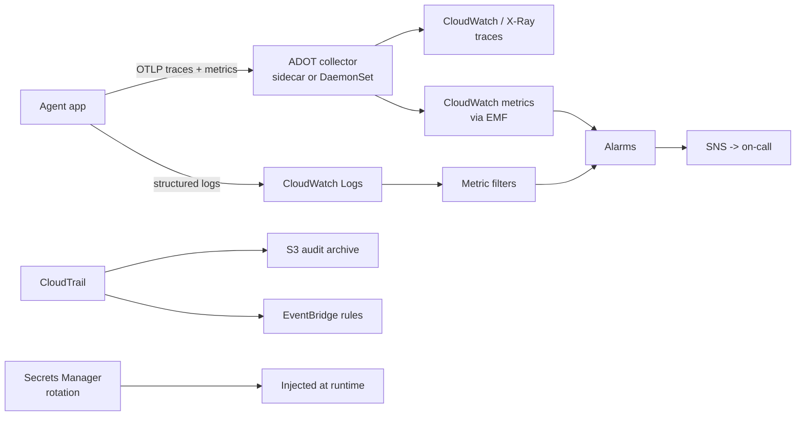

# AWS Operations

> **Interview answer (say this first).** Operating an AI platform on AWS is five layers. **CloudWatch** collects logs, metrics, and alarms so you know the system's health. **CloudTrail** records who called which AWS API, which is your audit and security trail. **Secrets Manager** and **Parameter Store** hold credentials and configuration outside your code and images. **API Gateway** is the front door: routing, throttling, and authentication with IAM, Cognito, or a Lambda authorizer. **OpenTelemetry** is the portable instrumentation format, exported through the AWS Distro for OpenTelemetry (ADOT) collector, which lets you keep vendor-neutral traces and still land them in CloudWatch and X-Ray. The interview skill is naming what each layer answers and where the hand-off between them happens.

## Why this exists

A prototype agent runs in a notebook and prints to a terminal. A platform runs for a hundred teams and must answer five questions at 3 a.m.:

```text
Is it healthy?          -> metrics and alarms (CloudWatch)
Why did it fail?        -> logs and traces (CloudWatch Logs, X-Ray, OTel)
Who changed that?       -> audit of API activity (CloudTrail)
Where is the credential? -> secrets and config, not in git (Secrets Manager, Parameter Store)
Who may call it?        -> authentication and throttling (API Gateway)
```

Without these, every incident is a group chat. With them, an on-call engineer can see the failing metric, find the trace, read the log line, confirm no one changed infrastructure, and rotate the leaked key without a redeploy.

AI platforms add a few wrinkles that generic monitoring does not cover. Model calls are slow, metered, and rate-limited, so latency and token usage are first-class metrics. Prompts and responses often contain personal data, so logging them needs deliberate redaction and retention. Agent runs span many services, so a trace that crosses the orchestrator, the tool layer, and the model is the only way to debug a bad answer. And model providers are external dependencies that fail in ways your own code does not.

> **Note:**
>
> **The one-sentence purpose.** CloudWatch tells you what the system did, CloudTrail tells you who changed it, Secrets Manager holds the keys, API Gateway controls who gets in, and OpenTelemetry keeps your instrumentation portable across all of it.

## Start from zero

| Word | Plain meaning |
| --- | --- |
| **CloudWatch** | AWS's monitoring service: logs, metrics, alarms, and dashboards. |
| **Log group** | A container for related log streams, usually one per service. |
| **Log retention** | How long CloudWatch keeps a log group before deleting it. |
| **Metric** | A number tracked over time, such as request count or latency. |
| **Alarm** | A rule that fires when a metric crosses a threshold for enough periods. |
| **Composite alarm** | An alarm combining other alarms with AND/OR logic, to cut noise. |
| **Metric filter** | A pattern over logs that turns matches into a numeric metric. |
| **Logs Insights** | A query language for searching and aggregating log groups. |
| **EMF** | Embedded Metric Format: a structured log line from which CloudWatch extracts metrics. |
| **CloudTrail** | The service that records AWS API activity as events. |
| **Trail** | A configuration that delivers CloudTrail events to S3 and optionally CloudWatch Logs. |
| **Management event** | A control-plane API call, such as creating a bucket or changing a policy. |
| **Data event** | A high-volume data-plane call, such as an S3 object read or a Lambda invoke. |
| **Secrets Manager** | A managed store for secrets, with optional automatic rotation. |
| **Rotation** | Replacing a secret on a schedule, usually by invoking a Lambda. |
| **Parameter Store** | A hierarchical, cheaper store for configuration and simple secure values. |
| **SecureString** | A Parameter Store value encrypted with KMS. |
| **Dynamic reference** | A template placeholder, such as `{{resolve:secretsmanager:...}}`, resolved at deploy time. |
| **API Gateway** | The managed HTTP front door for your APIs and Lambda functions. |
| **REST API / HTTP API** | The two API Gateway flavours: feature-rich and lightweight. |
| **Stage** | A deployed environment of an API, such as `prod` or `beta`. |
| **Usage plan** | A REST API construct that groups stages, API keys, throttles, and quotas. |
| **Throttle** | A limit on request rate, per account, stage, method, or API key. |
| **IAM authorization** | Callers sign requests with AWS credentials (SigV4); IAM decides. |
| **Cognito authorizer** | An API Gateway authorizer that validates a Cognito user-pool token. |
| **Lambda authorizer** | A custom authorizer function that returns an allow/deny policy. |
| **JWT authorizer** | An HTTP API authorizer that validates a JSON Web Token from an issuer. |
| **OpenTelemetry** | A vendor-neutral standard for traces, metrics, and logs. |
| **ADOT** | AWS Distro for OpenTelemetry: AWS's supported build of the collector. |
| **Collector** | The process that receives, processes, and exports telemetry. |
| **Trace / span** | One request and its timed units of work. A trace is a tree of spans. |
| **OTLP** | The OpenTelemetry wire protocol for sending telemetry to a collector. |
| **X-Ray** | AWS's tracing backend; CloudWatch also stores and displays traces. |

Two distinctions to hold on to:

- **CloudWatch vs CloudTrail.** CloudWatch is about behaviour and health — your application's logs and metrics. CloudTrail is about control — who called which AWS API. Confusing them means you look for a security answer in the wrong place.
- **Secrets Manager vs Parameter Store.** Both store values. Secrets Manager is built for credentials and automatic rotation. Parameter Store is a cheap hierarchical config store with a `SecureString` option but no built-in rotation.

## The core idea

Picture a hospital.

**CloudWatch is the bedside monitor and the chart.** It shows heart rate and blood pressure continuously (metrics), keeps the full nursing notes (logs), and screams when a number leaves the safe range (alarms). It tells you the patient is unwell right now.

**CloudTrail is the security camera and the access register.** It records who entered which room and touched which cabinet (API call). It does not care whether the patient is healthy; it cares who did what, when, and from where.

**Secrets Manager is the locked drug cabinet.** Staff never carry the keys in their pockets. The cabinet rotates the lock on schedule, and the application asks for the key only when it needs it.

**API Gateway is the reception desk.** It checks the visitor's badge, decides whether the badge is valid, and limits how many visitors per minute can pass, so the wards are never overwhelmed.

**OpenTelemetry is the standard chart format.** Any hospital can read it. You can move from one monitoring vendor to another without rewriting every instrumented service.



The comparison interviewers ask for is CloudWatch versus OpenTelemetry:

| Aspect | CloudWatch-native | OpenTelemetry + ADOT |
| --- | --- | --- |
| Instrumentation | CloudWatch agent, EMF, SDK | Vendor-neutral OTel APIs and SDK |
| Portability | Tied to AWS | Move exporters without re-instrumenting |
| Best use | AWS resources, alarms, dashboards | Cross-service traces, multi-cloud, vendor escape |
| Traces | X-Ray format | OTLP, exported to X-Ray or CloudWatch |
| Effort | Fastest on pure AWS | More setup, better long-term leverage |

The practical answer is not either/or. Instrument with OpenTelemetry, send through ADOT, and land the data in CloudWatch so alarms, dashboards, and retention stay AWS-native.

## How it works

**CloudWatch: metrics, logs, alarms.**

1. AWS services publish metrics automatically into namespaces such as `AWS/Lambda` and `AWS/SQS`.
2. Your application publishes custom metrics with `PutMetricData`, or by writing an **EMF** log line that CloudWatch turns into a metric.
3. Logs flow to **log groups** with **retention** set. By default they never expire, so an unset retention policy is a growing bill.
4. A **metric filter** matches a pattern in logs and increments a metric, which is how you alarm on an error string.
5. An **alarm** watches a metric over evaluation periods; `DatapointsToAlarm` requires several bad periods out of five, which reduces flapping.
6. A **composite alarm** combines several alarms so a page only fires when the overall situation is bad, and alarm actions notify SNS or trigger Auto Scaling.

**CloudTrail: the audit path.**

1. CloudTrail records AWS API calls as events, each carrying the caller identity, time, source IP, and parameters.
2. **Management events** (control plane) are recorded by default. **Data events** (object reads, function invokes) are high volume and must be enabled deliberately.
3. A **trail** delivers events to an S3 bucket, and optionally to CloudWatch Logs; an **organization trail** covers every account in the organization.
4. Without a trail you still get **Event history** for recent management events, but it is not a long-term archive; **CloudTrail Insights** detects unusual API activity.
5. Reacting is done through **EventBridge**: a rule matches a sensitive API call and invokes a Lambda or sends an alert.

CloudTrail answers questions no application log can: who deleted the bucket, which principal changed the IAM policy, and when the key was last used.

**Secrets Manager versus Parameter Store.**

1. A **secret** is a named value with versions. `AWSCURRENT` is live; `AWSPENDING` is used during rotation.
2. **Rotation** invokes a Lambda that creates a new credential, updates the downstream system, and promotes the new version.
3. Applications fetch the secret at runtime with the SDK, or receive it injected at deploy time, so it never enters the image or git.
4. **Parameter Store** holds plain strings, string lists, and `SecureString` values in a hierarchy; it versions values but does not rotate credentials for you.
5. Reference a value in a template with a **dynamic reference**, cache it in memory with a short refresh interval, and re-read it on an authentication failure rather than crashing.

**API Gateway: the front door.**

1. A request arrives at a **stage** and matches a **route** or method.
2. Authentication runs first: **IAM** verifies a SigV4 signature, a **Cognito** or **JWT** authorizer validates a token, and a **Lambda authorizer** runs custom logic and returns an allow/deny policy.
3. **Throttling** limits request rate; REST APIs add **usage plans** and **API keys** for per-customer quotas, while HTTP APIs rely on stage and account limits.
4. The request reaches the **integration**, commonly a Lambda function or an HTTP backend. Choose HTTP APIs for most new work; pick REST only when you need a REST-only feature.
5. Capabilities differ by flavour. **WAF, resource policies, private (VPC-endpoint-only) endpoints, API keys, usage-plan per-client throttling, mapping templates, response caching, and X-Ray tracing are REST-only.** HTTP APIs support IAM, JWT, and Lambda authorizers plus stage- and account-level throttling, but adding any of those REST-only controls means choosing REST instead.

**Wiring the layers for an AI platform.**

1. The agent app authenticates to the gateway, which throttles per tenant.
2. The app fetches provider keys from Secrets Manager and caches them briefly.
3. Every model call emits an OpenTelemetry span and token metrics via the ADOT collector, and every log line carries the trace ID.
4. CloudWatch alarms fire on error rate, p99 latency, queue age, and token spend; CloudTrail and EventBridge alert on sensitive API calls.

## The syntax you will use

**Publish an alarm that only fires when it is persistent.** `DatapointsToAlarm` avoids paging on a single bad minute.

```python
cloudwatch = boto3.client("cloudwatch", region_name="us-east-1")
cloudwatch.put_metric_alarm(
    AlarmName="agent-errors-high",
    Namespace="AI/AgentPlatform",
    MetricName="Errors",
    Statistic="Sum",
    Period=60,
    EvaluationPeriods=5,
    DatapointsToAlarm=3,               # 3 of 5 periods must breach
    Threshold=5,
    ComparisonOperator="GreaterThanThreshold",
    TreatMissingData="notBreaching",
    AlarmActions=["arn:aws:sns:us-east-1:123456789012:oncall"],
)
```

**Emit metrics from a structured log line with EMF.** CloudWatch extracts the metrics; you keep one log line for both purposes.

```json
{
  "_aws": {
    "Timestamp": 1737000000000,
    "CloudWatchMetrics": [
      {
        "Namespace": "AI/AgentPlatform",
        "Dimensions": [["Service", "Tenant"]],
        "Metrics": [
          {"Name": "TokensIn", "Unit": "Count"},
          {"Name": "LatencyMs", "Unit": "Milliseconds"}
        ]
      }
    ]
  },
  "Service": "agent-runtime",
  "Tenant": "acme",
  "TokensIn": 812,
  "LatencyMs": 1430
}
```

**Ask questions of logs with Logs Insights.** This groups token use and latency by tenant.

```text
fields @timestamp, tenant, model, tokens_in, latency_ms, error
| filter service = "agent-runtime"
| stats avg(latency_ms) as avg_ms, sum(tokens_in) as tokens, count(*) as calls by tenant
| sort tokens desc
| limit 20
```

**Alert on a sensitive API call with EventBridge.** An event pattern can match `aws.s3` events with `detail-type` `AWS API Call via CloudTrail` and an `eventName` of `DeleteBucket` or `DeleteBucketPolicy`, so the security channel hears about it immediately.

**Store a provider key in Secrets Manager with rotation.** Rotation is a Lambda that updates both the secret and the downstream system.

```python
secretsmanager = boto3.client("secretsmanager", region_name="us-east-1")
secretsmanager.create_secret(
    Name="ai-platform/providers/example",
    SecretString=json.dumps({"api_key": "sk-example-not-a-real-key"}),
    Description="Provider API key for the model gateway",
)
secretsmanager.rotate_secret(
    SecretId="ai-platform/providers/example",
    RotationLambdaARN=rotation_lambda_arn,
    RotationRules={"AutomaticallyAfterDays": 30},
)
```

**Inject the secret at deploy time instead of committing it.** CloudFormation resolves the dynamic reference when the stack runs.

```yaml
Resources:
  AgentTaskDefinition:
    Type: AWS::ECS::TaskDefinition
    Properties:
      ContainerDefinitions:
        - Name: agent-runtime
          Image: example/agent-runtime:1.0.0
          Secrets:
            - Name: PROVIDER_API_KEY
              ValueFrom: "{{resolve:secretsmanager:ai-platform/providers/example:SecretString:api_key}}"
```

**Authorise callers with IAM at the gateway.** An IAM policy with `execute-api:Invoke` on the API's ARN is what lets a signed caller through, while a Cognito or Lambda authorizer handles token-based callers.

**An HTTP API with throttling and a request authorizer.** The authorizer is a Lambda that decides allow or deny.

```yaml
Resources:
  AgentApi:
    Type: AWS::ApiGatewayV2::Api
    Properties:
      Name: agent-api
      ProtocolType: HTTP

  AgentAuthorizer:
    Type: AWS::ApiGatewayV2::Authorizer
    Properties:
      ApiId: !Ref AgentApi
      Name: agent-request-authorizer
      AuthorizerType: REQUEST
      AuthorizerPayloadFormatVersion: "2.0"
      AuthorizerUri: arn:aws:lambda:us-east-1:123456789012:function:authorizer
      IdentitySource:
        - "$request.header.Authorization"
      AuthorizerResultTtlInSeconds: 300

  AgentIntegration:
    Type: AWS::ApiGatewayV2::Integration
    Properties:
      ApiId: !Ref AgentApi
      IntegrationType: AWS_PROXY
      IntegrationUri: arn:aws:lambda:us-east-1:123456789012:function:agent-handler
      PayloadFormatVersion: "2.0"

  AgentRoute:
    Type: AWS::ApiGatewayV2::Route
    Properties:
      ApiId: !Ref AgentApi
      RouteKey: "POST /agent"
      AuthorizationType: CUSTOM
      AuthorizerId: !Ref AgentAuthorizer
      Target: !Sub "integrations/${AgentIntegration}"

  AgentStage:
    Type: AWS::ApiGatewayV2::Stage
    Properties:
      ApiId: !Ref AgentApi
      StageName: prod
      AutoDeploy: true
      DefaultRouteSettings:
        ThrottlingBurstLimit: 100
        ThrottlingRateLimit: 50
```

**Instrument once with OpenTelemetry and export to AWS.** The ADOT collector receives OTLP and fans out to X-Ray for traces and EMF for metrics.

```yaml
receivers:
  otlp:
    protocols:
      grpc:
        endpoint: 0.0.0.0:4317
      http:
        endpoint: 0.0.0.0:4318

processors:
  batch: {}

exporters:
  awsxray:
    region: us-east-1
  awsemf:
    region: us-east-1
    namespace: AI/AgentPlatform

service:
  pipelines:
    traces:
      receivers: [otlp]
      processors: [batch]
      exporters: [awsxray]
    metrics:
      receivers: [otlp]
      processors: [batch]
      exporters: [awsemf]
```

## Examples: simple to real

**Example 1 — one log line, two uses.** A plain log line is searchable but not a metric. An EMF line is both.

```text
Plain:  {"level": "info", "service": "agent-runtime", "tokens_in": 812}
        -> searchable in Logs Insights, no alarm possible without a metric filter

EMF:    {"_aws": {...}, "Service": "agent-runtime", "TokensIn": 812}
        -> CloudWatch creates the TokensIn metric automatically
```

EMF removes the need for a separate `PutMetricData` call on the hot path, which reduces latency and cost.

Tune `DatapointsToAlarm` against your tolerance for noise: one failure is normal, sustained failure is not.

**Example 2 — CloudTrail answers a security question.** An S3 bucket disappeared. The application logs only show 500 errors; CloudTrail shows the cause.

```text
Application log:  "failed to read bucket ai-platform-docs"
CloudWatch metric: Errors spike at 14:02
CloudTrail event:  DeleteBucket by arn:aws:iam::...:user/deploy-bot at 14:01:58
EventBridge rule:  notify the security channel when DeleteBucket is called
```

This is why audit and observability are separate layers. One tells you the system is broken; the other tells you who broke it.

**Example 3 — secret rotation without a redeploy.** The application must tolerate the credential changing underneath it.

```text
1. Rotation Lambda creates a new provider key
2. It updates the provider and writes a new AWSPENDING secret version
3. It promotes the version, so AWSCURRENT changes
4. The app's cached key starts failing with 401
5. The app re-reads the secret and retries the call
6. No restart, no redeploy, no secret in git or the image
```

Step 5 is the design requirement. An app that loads the key once at boot and never refreshes will fail on rotation day.

**Example 4 — pick the gateway auth and throttle per caller.** The choice follows the caller, not fashion.

| Caller | Auth | Throttle |
| --- | --- | --- |
| Internal service on the VPC | IAM (SigV4) | Account and stage limits |
| Logged-in end user | Cognito or JWT authorizer | Per-user quota in your app |
| Partner with a metered plan | Lambda authorizer returning an API key context | REST usage plan with a quota |
| Untrusted public endpoint | JWT authorizer plus WAF (REST API or CloudFront) | Aggressive stage throttle and WAF rate rules |

**Example 5 — trace one agent run end to end.** A trace is the only artifact that shows where the seconds went.

```text
Trace: run-7f3
├─ span gateway.POST /agent           12 ms
├─ span orchestrator.plan          1,280 ms
│  └─ span bedrock.converse          1,240 ms   tokens_in=812 tokens_out=190
├─ span tool.search_docs             420 ms
│  └─ span opensearch.query          390 ms
└─ span orchestrator.finalise         95 ms
Total: ~1.81 s
```

The span attributes carry the token counts and model name, so the same data answers "why slow?" and "why expensive?". Put the trace ID in every log line so an engineer can pivot from a log search to the full trace.

## In production

- **Set log retention on every group.** The default is never expire. Choose a retention that matches the data's sensitivity and usefulness, especially for prompts and responses.
- **Never log secrets, full prompts, or raw PII.** Redact at the logger, not in review. If you must log prompts, encrypt, restrict, and expire them.
- **Alarm on symptoms, not causes.** Error rate, p99 latency, queue age, and token spend tell you users are hurting. CPU is a cause, not a symptom.
- **Emit metrics with EMF on the hot path.** It attaches metrics to logs you already write, avoiding an extra network call per request.
- **Include a trace ID in every log line.** Without it, logs and traces are two separate investigations instead of one.
- **Turn on CloudTrail with log file validation and an organization trail.** A trail you can silently tamper with is not an audit trail. Send it to a locked-down S3 bucket.
- **Alert on sensitive API calls through EventBridge.** Deleting a bucket, changing a policy, or disabling a trail should page someone immediately.
- **Rotate secrets, and make the app tolerate rotation.** A rotation schedule with a client that caches forever is worse than no rotation, because it breaks in production rather than in theory.
- **Prefer Secrets Manager for credentials and Parameter Store for config.** Mixing them up leads to secrets with no rotation or config that costs more than it should.
- **Do not let one tenant exhaust the gateway.** Per-tenant quotas protect everyone else from a runaway agent, and they make cost attribution possible.
- **Agentic-AI relevance.** Track tokens, tool calls, retries, and model latency per tenant and per run. Those four metrics plus an end-to-end trace turn an unreproducible "the agent gave a bad answer" into a specific, fixable span.

## Interview questions

### 1. What is the difference between CloudWatch and CloudTrail?

**Answer.** CloudWatch is observability: it collects your logs and metrics and fires alarms on health. CloudTrail is audit: it records AWS API calls, with who made them, when, from where, and with what parameters. CloudWatch tells you the system is failing; CloudTrail tells you who changed the system to cause it.

**Follow-up: "When do you need both?"** Almost always. An incident often has an application symptom and a control-plane cause, such as a policy change or a deleted resource. You need the symptom and the cause in the same timeline.

**Trap.** Assuming CloudTrail logs your application's requests. It records AWS API calls, not your HTTP traffic or model prompts.

### 2. How does CloudWatch turn logs into alarms?

**Answer.** You create a metric filter that matches a pattern in a log group and publishes a numeric metric. Then an alarm watches that metric with a threshold, an evaluation period, and `DatapointsToAlarm`. When enough periods breach, the alarm moves to ALARM and triggers its actions, such as notifying an SNS topic.

**Follow-up: "Why not alarm on every error log line?"** Because single errors are normal — retries, bad user input, a provider blip. Requiring several breaching periods filters noise and keeps pages actionable.

**Trap.** Setting retention to never expire and then discovering that the filter also counts old, unrelated errors. Retention and filters are operational decisions, not defaults.

### 3. Secrets Manager or Parameter Store?

**Answer.** Use Secrets Manager for credentials that should rotate, especially database and third-party API keys, because it has built-in rotation and native integrations. Use Parameter Store for configuration and simple values, with `SecureString` for encrypted values; it is cheaper and hierarchical but does not rotate.

**Follow-up: "How does an application receive the value?"** Either fetch it at runtime with the SDK and cache it briefly, or inject it at deploy time with a task-definition secret or a dynamic reference. Runtime fetch handles rotation better; deploy-time injection is simpler but staler.

**Trap.** Baking secrets into container images or environment variables in source. Both leak through registries, logs, and git history.

### 4. How does the IAM/Cognito/Lambda authorizer decision change with the caller?

**Answer.** Use IAM for machine callers inside AWS that already have credentials; use a Cognito or JWT authorizer for authenticated end users, because it validates a token with no custom code; use a Lambda authorizer when the rule is custom, such as a partner API key plus a per-plan quota. The choice is driven by who the caller is and where the trust comes from.

**Follow-up: "Why is a Lambda authorizer a risk?"** It runs on every request unless you cache its result, so a slow or buggy authorizer becomes part of your latency and availability. Cache by token, keep it small, and fail closed.

**Trap.** Using an API key as authentication. An API key identifies a caller for metering; it does not prove who they are.

### 5. When would you use OpenTelemetry instead of CloudWatch-native instrumentation?

**Answer.** When you want portability and consistent tracing across services, languages, and clouds. OTel gives you vendor-neutral APIs and an OTLP pipeline, so you can change backends without re-instrumenting. On pure AWS you can still use the CloudWatch agent and EMF for speed; the pragmatic path is to instrument with OTel and export through ADOT into CloudWatch and X-Ray.

**Follow-up: "What does ADOT add?"** It is AWS's supported OpenTelemetry distribution, including a collector that receives OTLP and exports to X-Ray, EMF, and other AWS backends. It gives you the standard pipeline without you building the AWS exporters.

**Trap.** Treating OTel as a backend. It is instrumentation and a pipeline; the storage and querying still happen in CloudWatch, X-Ray, or another vendor.

### 6. How do you alarm on an AI platform's cost and quality, not just its health?

**Answer.** Treat token usage and cost as first-class metrics: emit tokens in and out, model, tenant, and latency per call, then alarm on spend rate and on p99 latency. For quality, use periodic evaluations and alarm on a drop in the eval score, plus error and refusal rates. Cost and quality are symptoms your users feel, so they belong on the dashboard next to availability.

**Follow-up: "Why is an eval score alarm different from a metric alarm?"** Evaluations are sampled and slower, so they are batch metrics with wider periods and looser thresholds. They catch drift that per-request health metrics miss.

**Trap.** Monitoring only uptime. A platform that is up but ten times over budget, or quietly giving worse answers, is failing in the ways that matter.

### 7. How do you secure the API Gateway layer for an internal AI platform?

**Answer.** Combine authorisation, network controls, and rate limits. Use IAM or a JWT/Lambda authorizer so only known callers pass. If the API must stay off the public internet or behind WAF, choose a REST API (private endpoints, resource policies, and WAF are REST-only); HTTP APIs get authorizers plus stage- and account-level throttling. Enable access logs and metrics, and set throttles and quotas per tenant or per key. Deny by default and grant narrowly.

**Follow-up: "What do you log at the gateway?"** Access logs with request ID, caller identity, route, status, and latency — never credentials or full request bodies. Correlate the request ID with your trace ID.

**Trap.** Assuming the gateway makes the backend safe. It authenticates callers; it does not validate the payload or fix an over-permissive backend IAM role.

### 8. Walk through the observability and secrets layer you would build for an AI platform on AWS.

**Answer.** Instrument every service with OpenTelemetry and run an ADOT collector that exports traces to X-Ray/CloudWatch and metrics via EMF. Use structured JSON logs with a trace ID, set retention per log group, and build metric filters for error and token metrics. Alarm on error rate, p99 latency, queue age, token spend, and DLQ depth, with composite alarms for on-call. Turn on an organization CloudTrail trail with log file validation to a locked-down bucket, and alert on sensitive API calls through EventBridge. Store provider keys in Secrets Manager with rotation, config in Parameter Store, inject at runtime, and re-read on authentication failure.

**Follow-up: "What breaks first at scale?"** Usually cardinality and cost: too many per-request dimensions, logs kept forever, or high-resolution custom metrics everywhere. Control cardinality, set retention, and sample traces rather than logging everything.

**Trap.** Listing tools without a question they answer. Every layer should map to an incident: what failed, why, who changed it, where the key is, and who is allowed in.

## Remember this

- **CloudWatch is health, CloudTrail is accountability.** You need both to explain an incident.
- **Alarm on symptoms — errors, latency, queue age, spend — not on causes like CPU.**
- **Secrets Manager rotates credentials; Parameter Store holds cheap config.** Keep both out of code and images.
- **API Gateway decides who gets in and how fast**, with IAM, Cognito, JWT, or a Lambda authorizer.
- **Instrument with OpenTelemetry, export through ADOT, store in CloudWatch** — portable instrumentation, native alarms.
