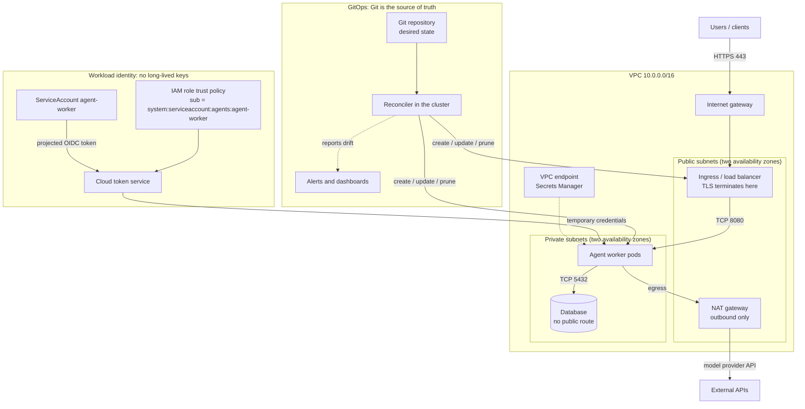

# Cloud Networking, Identity, and GitOps

> **Interview answer (say this first).** Three questions decide whether a platform is safe to run: where do packets go, who is this workload, and who is allowed to change it? The **network** answers the first — workloads sit in private subnets with no inbound route, inbound traffic enters through one load balancer, and outbound traffic leaves through a NAT gateway or a private endpoint. **Workload identity** answers the second — a pod or instance proves who it is to the cloud and receives short-lived credentials, so there are **no long-lived keys to leak**. **GitOps** answers the third — Git holds the desired state and a reconciler continuously makes the cluster match it, so drift becomes a visible, auditable signal instead of a surprise.

## Why this exists

An AI platform team moves its agent workers to a new node pool on a Friday afternoon. By Monday, every agent fails to reach the database. The connection does not fail fast; it times out after 30 seconds, the worker retries, and the queue backs up while the logs show only generic timeouts.

Three separate mistakes produced one outage:

- The database security group allowed TCP 5432 **from a subnet CIDR written down in a wiki**. The new node pool used a different subnet, so the rule no longer matched. Security groups reference addresses, and addresses move.
- The private subnet had no NAT gateway and no interface endpoint, so the workers could not reach Secrets Manager or the model provider either. The whole egress path was missing, not just the one rule.
- The database password was a long-lived secret copied into a Kubernetes Secret by hand and never rotated, so nobody could safely test a fix without coordinating across three teams.

The root cause was not the database. It was the fact that the network, the identities, and the credentials had each been configured separately, by hand, with no single description of what the system should look like.

The deployment side fails the same way. Two weeks later, during an incident, a responder hot-fixes production with `kubectl set image` instead of a commit. The GitOps controller notices within a couple of minutes and reverts the change, because Git still points at the old digest. The fix vanishes mid-incident and the responder loses trust in the platform.

Neither story is a tool failure. Both are the default outcome when nobody designs **path, identity, and authority to change** together.

> **The one-sentence purpose.** Give every workload the shortest network path and the shortest-lived credential it needs, and make Git the only place a production change is authored.

## Start from zero

| Word | Plain meaning |
| --- | --- |
| **VPC** | Virtual Private Cloud: your own isolated network inside one cloud region, with an IP range you choose. |
| **CIDR block** | A range of IP addresses written as a prefix, such as `10.0.0.0/16` (about 65,000 addresses). |
| **Subnet** | A slice of the VPC's range, tied to one availability zone. |
| **Public subnet** | A subnet whose route table sends internet-bound traffic to an internet gateway, so it can be reached from outside. |
| **Private subnet** | A subnet with no route from the internet. Workloads live here. |
| **Route table** | The rules that decide where traffic leaving a subnet goes. Public or private is decided here, not by the name. |
| **Internet gateway** | The VPC's door to the public internet. One per VPC. |
| **NAT gateway** | Network Address Translation gateway: lets a private subnet **start** outbound connections through a public subnet. Nothing can start a connection back in. |
| **Security group** | A stateful, allow-only firewall attached to a resource such as an instance, a pod, or a load balancer. Return traffic is allowed automatically. |
| **Network ACL** | A stateless, allow-and-deny firewall attached to a **subnet**. It needs explicit rules for return traffic, so it is coarse and easy to get wrong. |
| **DNS** | The name system that turns names into addresses. In a VPC, private hosted zones resolve internal names; misconfigured DNS looks exactly like a network outage. |
| **TLS certificate** | A signed document that proves a server's identity and encrypts the connection. It has an expiry date, and an expired certificate fails closed. |
| **Ingress** | The inbound path into a network: in Kubernetes, an object that routes HTTP hosts and paths to Services; in networking generally, traffic arriving. |
| **Egress** | Outbound traffic leaving a network or a workload. |
| **Service mesh** | An infrastructure layer that gives every service mutual TLS, identity, retries, and traffic policy without changing application code. Powerful, and one more control plane to operate. |
| **Workload identity** | A mechanism that lets a workload prove who it is, so it can receive credentials scoped to it — for example, a Kubernetes ServiceAccount bound to a cloud IAM role. |
| **IAM role** | Cloud identity that a workload or user temporarily assumes; it returns credentials with an expiry. |
| **OIDC federation** | OpenID Connect federation: trusting an external token issuer (GitHub, a Kubernetes cluster) so a caller gets cloud credentials without any cloud key stored anywhere. |
| **Key rotation** | Replacing a credential with a new one and retiring the old, ideally with both valid briefly so nothing breaks. |
| **GitOps** | An operating model where Git holds the desired state of the system, and a controller running **inside** the cluster continuously pulls it and reconciles. |
| **Drift** | Any difference between the desired state in Git and what is actually running. |
| **Reconciliation** | The control loop that compares desired state to reality and makes reality match — creating, updating, or deleting as needed. |
| **Environment promotion** | Moving the **same** built artifact from staging to production, changing only configuration, never rebuilding. |
| **Admission controller** | A Kubernetes extension that inspects or rejects objects at creation time, before they are persisted. It is the last gate before a change runs. |
| **Secrets rotation** | Rotating credentials that workloads use — database passwords, API keys, signing keys — automatically and without downtime. |

Two distinctions decide most designs:

- **Security group versus network ACL.** The security group sits with the resource and is the precise control you actually use. The network ACL sits with the subnet, is stateless, and is a coarse backstop. When something breaks for a whole subnet at once, suspect the ACL.
- **Rotation versus federation.** Rotation replaces a secret that already exists. Federation removes the secret entirely: there is nothing to leak because the credential is minted on demand and expires. Prefer federation; rotate only what cannot be federated.

## The core idea

Ask three questions, in order. Each maps to one layer, and each layer fails in its own way.

1. **Where does the packet go?** A VPC is a private network. Subnets split it across zones. A route table decides what "the internet" means for each subnet. A private subnet has no route from the internet gateway, so its only outbound path is a NAT gateway (for the public internet) or a VPC endpoint (for cloud services). Inbound traffic reaches one load balancer in a public subnet and no further.
2. **Who is this workload?** Every pod, task, and instance assumes an **IAM role**. A Kubernetes pod presents a projected service-account token, which the cloud validates against the role's **trust policy**; an EC2 instance profile or ECS task role instead fetches temporary credentials directly from the instance metadata service (IMDS) or the task metadata endpoint. Either way the credentials expire in minutes to hours and nothing long-lived is stored. This is the whole idea behind "no long-lived keys": the credential is derived from identity, not kept in a Secret.
3. **Who is allowed to change it?** Git holds the desired state of the cluster and the cloud. A controller running in the cluster pulls that state and **reconciles**: it creates what is missing, updates what differs, and prunes what Git no longer declares. Humans do not apply changes directly; they merge a pull request. This is what "Git is the source of truth" means in practice — the cluster is a copy of Git, and disagreement is a bug in the copy.



Traffic flows down the left: one inbound door, no inbound route to the workload, and a controlled outbound path. Identity flows in the middle: the workload proves itself and receives credentials that expire. Authority flows on the right: Git is authoritative, and the reconciler is the only writer.

A push-based pipeline and GitOps reach the same cluster from opposite directions:

| Question | Push-based CD | GitOps |
| --- | --- | --- |
| Who starts the deploy? | The pipeline, running outside the cluster, pushes to the API | A controller inside the cluster pulls from Git |
| Where is the desired state? | In the pipeline run and its logs | In Git, reviewable as a diff |
| What happens after a manual edit? | Nothing. The edit silently persists | The controller reverts or reports it |
| How do you see drift? | Only if you diff the running system yourself | Continuously, as a sync status |
| Credential the deploy uses | Cluster credentials held by CI | Cluster-side access to Git; CI needs no cluster write access |
| Main failure mode | Pipeline cannot reach the cluster, or pushes a wrong change | Git and the cluster both drift from what responders need, if the process is ignored |

> **Tip:**
>
> **The mental shortcut.** Network answers "can the packet arrive?". Identity answers "what may the workload do?". GitOps answers "who is allowed to change the answer?". If you cannot say the answer to all three, you cannot yet operate the platform.

## How it works

Walk the sequence a platform team follows, from an empty account to a reconciled environment.

1. **Design the network before anything runs in it.** Choose a VPC CIDR that does not overlap your other networks or your future peering, then carve subnets per availability zone: public subnets for load balancers and NAT gateways, private subnets for workloads and databases.
2. **Give each subnet a route table.** The public route table points `0.0.0.0/0` at the internet gateway. The private route table points `0.0.0.0/0` at a NAT gateway in a public subnet, or at nothing at all if the workload only needs cloud services through endpoints.
3. **Add private endpoints for cloud services.** An interface VPC endpoint puts a private address for a service such as Secrets Manager inside the VPC, so that traffic never needs the internet and the NAT dependency shrinks.
4. **Open only the ports that are needed, and reference security groups rather than CIDRs.** A database allows TCP 5432 from the application's security group, not from an IP range. A load balancer allows 443 from the internet. Everything else is denied by default.
5. **Give workloads an identity instead of a key.** Bind a Kubernetes ServiceAccount to an IAM role (or use an instance profile, a task role, or a managed identity). The pod receives a projected token; the cloud exchanges it for temporary credentials; the SDK uses them automatically.
6. **Scope the trust policy tightly.** The role's trust policy must name the exact issuer, audience, and subject — one repository and branch, or one namespace and service account. A trust policy without a subject condition lets anyone who can get a token from that issuer assume the role.
7. **Scope the permission policy tightly too.** The role reads one secret, writes one log group, and calls one model endpoint. Least privilege turns a compromised prompt from a full-account incident into a failed API call.
8. **Rotate what cannot be federated.** Database passwords, third-party API keys, and signing keys still exist. Rotate them on a schedule and after any departure, with a grace window where both the old and new credential are valid.
9. **Express infrastructure and applications as code.** Terraform provisions the VPC, subnets, roles, and cluster; Helm (or Kustomize) renders the application manifests. Both live in Git and change only through a pull request.
10. **Deliver the code with a reconciler.** A GitOps controller such as Argo CD or Flux watches the repository, renders the chart, and applies the result. CI builds and tests the artifact; it does not need write access to production.
11. **Detect and reconcile drift.** The controller compares desired state to running state on a loop (Argo CD polls every few minutes by default, plus webhooks) and reports in-sync or out-of-sync. With self-heal enabled it reverts manual changes; with prune enabled it deletes objects removed from Git.
12. **Promote between environments by changing configuration only.** Staging and production reference the **same image digest**; their overlays differ in replica count, hostname, and secret references. Promotion is a pull request against the production overlay, reviewed like any other change.
13. **Guard the door with admission policy.** A validating webhook — OPA Gatekeeper, Kyverno, or the platform's own controller — rejects objects at creation time: no `latest` tags, no containers running as root, no missing resource limits, no unpinned model versions.

The loop closes at step 11. A human never applies a change directly; they merge it, and the reconciler carries it.

## The syntax you will use

All snippets below are illustrative, not complete deployments.

**A Terraform network with a private subnet and outbound-only egress.** Read it as a picture: one VPC, a private subnet, a route table that sends everything to a NAT gateway, and a security group that trusts another security group.

```hcl
# Illustrative only: the network half of an AI platform.
resource "aws_vpc" "main" {
  cidr_block           = "10.0.0.0/16"
  enable_dns_support   = true
  enable_dns_hostnames = true          # required for private DNS names to resolve
}

resource "aws_subnet" "private" {
  vpc_id            = aws_vpc.main.id
  cidr_block        = "10.0.2.0/24"
  availability_zone = "eu-west-1a"
  # no map_public_ip_on_launch: instances here never get a public address
}

resource "aws_route_table" "private" {
  vpc_id = aws_vpc.main.id
  route {
    cidr_block     = "0.0.0.0/0"
    nat_gateway_id = aws_nat_gateway.nat.id   # outbound only
  }
}

resource "aws_route_table_association" "private" {
  subnet_id      = aws_subnet.private.id
  route_table_id = aws_route_table.private.id
}
# aws_nat_gateway.nat and aws_security_group.alb are defined elsewhere in the module.

resource "aws_security_group" "app" {
  name   = "agent-api"
  vpc_id = aws_vpc.main.id
}

resource "aws_vpc_security_group_ingress_rule" "app_from_alb" {
  security_group_id            = aws_security_group.app.id
  referenced_security_group_id = aws_security_group.alb.id  # not a CIDR
  ip_protocol                  = "tcp"
  from_port                    = 8080
  to_port                      = 8080
  description                  = "API traffic from the load balancer only"
}
```

The private subnet has no route to an internet gateway, so `0.0.0.0/0` means "the NAT gateway". The ingress rule names the load balancer's security group, so it survives any change of IP address.

**A Kubernetes Ingress: the one inbound door.** TLS terminates here and the certificate is a Secret.

```yaml
# Illustrative only.
apiVersion: networking.k8s.io/v1
kind: Ingress
metadata:
  name: agent-api
  namespace: agents
spec:
  ingressClassName: nginx
  tls:
    - hosts: [api.example.com]
      secretName: agent-api-tls      # a kubernetes.io/tls Secret
  rules:
    - host: api.example.com
      http:
        paths:
          - path: /
            pathType: Prefix
            backend:
              service:
                name: agent-api
                port:
                  number: 80
```

**A ServiceAccount bound to a cloud role.** The annotation is the link between Kubernetes identity and cloud identity. On EKS this is called IRSA; the newer Pod Identity feature replaces the annotation with an association created through the cloud API.

```yaml
# Illustrative only: EKS IRSA.
apiVersion: v1
kind: ServiceAccount
metadata:
  name: agent-worker
  namespace: agents
  annotations:
    eks.amazonaws.com/role-arn: arn:aws:iam::123456789012:role/agent-worker
```

The platform projects a short-lived web-identity token into the pod and sets the SDK's environment so it negotiates credentials automatically. No AWS key is stored in the cluster.

**An OIDC trust policy the role demands.** The `sub` condition is the important line: only this namespace and ServiceAccount may assume the role.

```json
{
  "Version": "2012-10-17",
  "Statement": [
    {
      "Effect": "Allow",
      "Principal": {
        "Federated": "arn:aws:iam::123456789012:oidc-provider/oidc.eks.eu-west-1.amazonaws.com/id/EXAMPLED539D4633E53DE1B71EXAMPLE"
      },
      "Action": "sts:AssumeRoleWithWebIdentity",
      "Condition": {
        "StringEquals": {
          "oidc.eks.eu-west-1.amazonaws.com/id/EXAMPLED539D4633E53DE1B71EXAMPLE:aud": "sts.amazonaws.com",
          "oidc.eks.eu-west-1.amazonaws.com/id/EXAMPLED539D4633E53DE1B71EXAMPLE:sub": "system:serviceaccount:agents:agent-worker"
        }
      }
    }
  ]
}
```

**A GitOps Application manifest (Argo CD style).** The controller watches the path, renders it, and keeps the cluster matching it.

```yaml
# Illustrative only.
apiVersion: argoproj.io/v1alpha1
kind: Application
metadata:
  name: agent-api-prod
  namespace: argocd
spec:
  project: default
  source:
    repoURL: https://github.com/acme/platform-config.git
    targetRevision: main
    path: apps/agent-api/overlays/prod
  destination:
    server: https://kubernetes.default.svc
    namespace: agents
  syncPolicy:
    automated:
      prune: true        # delete objects removed from Git
      selfHeal: true     # revert manual changes to objects this Application owns
    syncOptions:
      - CreateNamespace=true
```

**The commands you run when something is wrong.** Diff first, then decide whether to sync.

```bash
argocd app get agent-api-prod          # sync status, health, last sync
argocd app diff agent-api-prod         # what does the cluster have that Git does not?
argocd app sync agent-api-prod         # apply Git now, if that is what you want
kubectl get application -A             # list every Application in the cluster
```

`diff` is the drift report. Read it before syncing; a sync that deletes something is usually a Git mistake, not a cluster mistake.

## Examples: simple to real

**Example 1 — a private subnet that can call out but cannot be called into.** The workload needs the public internet for one model provider. It gets no public IP and no inbound route.

```text
VPC 10.0.0.0/16
  public  10.0.1.0/24 -> route 0.0.0.0/0 -> internet gateway
  private 10.0.2.0/24 -> route 0.0.0.0/0 -> NAT gateway
  private 10.0.3.0/24 -> route 0.0.0.0/0 -> NAT gateway

The pod runs in 10.0.2.0/24 with no public IP.
Outbound: https://api.provider.example reaches the NAT gateway and leaves from its address.
Inbound: there is no route from the internet gateway into 10.0.2.0/24, so nothing can connect in.
```

You can prove the egress path without guessing: `curl https://checkip.amazonaws.com` from the pod returns the NAT gateway's address, not the pod's. If it hangs, the route table or the NAT gateway is missing.

Use one NAT gateway per availability zone. A single NAT gateway is cheaper but turns one zone's failure into an egress outage for every workload.

**Example 2 — least-privilege security groups for app to database.** The database trusts the application's security group and nothing else, in both directions.

```text
Database security group (db-sg):
  inbound:  tcp/5432 from app-sg       # the application, wherever its IPs are
  inbound:  (nothing else)
  outbound: default (stateful replies)

Application security group (app-sg):
  inbound:  tcp/8080 from alb-sg
  outbound: tcp/5432 to db-sg          # narrow, not 0.0.0.0/0
  outbound: tcp/443  to 0.0.0.0/0      # model providers; broad, and worth narrowing with a proxy
```

Two details matter. First, rules reference security groups, so a new node pool in a new subnet still matches and the outage from the opening story cannot happen. Second, the application's egress is narrowed to the database and to 443: an injected agent that tries to reach an internal admin port is denied at the network layer, not only at the application layer.

**Example 3 — workload identity replaces a stored key.** The "before" is a long-lived credential that has to be copied, protected, and rotated.

```text
Before:
  Kubernetes Secret "db-password" -> secretKeyRef -> DATABASE_PASSWORD env var
  The password is long-lived, shared by every environment, and copied by hand.
  A leak is valid until someone notices, and rotation needs a coordinated restart.

After:
  ServiceAccount agent-worker is bound to role/agent-worker.
  The role's policy allows secretsmanager:GetSecretValue on one secret ARN.
  The pod fetches the password at start-up with temporary credentials.
  Better still, the role allows rds-db:connect with IAM database
  authentication, so there is no password at all — only a short-lived token.
```

The pod now has no cloud key, and the only thing leaked by a compromise is a credential that expires. Delete the old Secret from Git, revoke the old password, and rotate it once to be sure nothing still uses it.

**Example 4 — drift detection: a manual change is reverted by reconciliation.** A responder changes an image directly to hot-fix an incident.

```bash
# The responder bypasses Git. Argo CD records the Application as OutOfSync.
kubectl set image deploy/agent-api -n agents api=ghcr.io/acme/agent-api:hotfix-1

# Within a few minutes (or immediately, with a webhook), selfHeal restores
# the digest that Git declares and the hot-fix disappears.
argocd app get agent-api-prod          # Sync Status: OutOfSync -> Synced
argocd app history agent-api-prod      # every sync is recorded
```

The lesson is not "GitOps is broken". It is that the responder used the wrong tool. The correct move is to commit the hot-fix digest to Git, let the pipeline build and sign it, and merge; the reconciler then deploys it and the change is auditable. If a genuine emergency demands a manual change, disable self-heal deliberately, make the change, and re-enable it after committing the same state — never leave the cluster and Git disagreeing.

One caveat: self-heal only reverts the fields the Application tracks. A field you have explicitly ignored with `ignoreDifferences`, or an object the Application does not own, is not corrected.

**Example 5 — promoting the same image from staging to production.** The artifact is identical; only configuration changes.

```yaml
# apps/agent-api/overlays/staging/kustomization.yaml
images:
  - name: ghcr.io/acme/agent-api
    newTag: "1.8.0"
replicas:
  - name: agent-api
    count: 2
```

```yaml
# apps/agent-api/overlays/prod/kustomization.yaml
# The same commit that passed staging opens a pull request changing only these lines.
images:
  - name: ghcr.io/acme/agent-api
    newTag: "1.8.0"          # the identical artifact, by tag or, better, by digest
replicas:
  - name: agent-api
    count: 6
```

Promotion is a pull request against the production overlay, reviewed and then reconciled. Nothing is rebuilt, so the tested bytes are the running bytes. For stronger guarantees, pin the **digest** (`digest: "sha256:..."` — not a `sha256:` value in `newTag`, which would produce an invalid tag) or let an image-updater write the digest it verified, because a tag is mutable and a digest is not.

## In production

- **Public subnets are for load balancers and NAT gateways only.** Workloads, databases, and caches belong in private subnets. If a workload has a public IP, ask what would break without it; the answer is usually nothing, or one missing endpoint.
- **Avoid `0.0.0.0/0` egress where you can.** Prefer VPC endpoints for cloud services and narrow egress to the ports your service genuinely needs. Remember that a security group matches IP addresses and ports, not hostnames: to restrict *which domains* a workload may call you need a proxy or DNS firewall, not a security group.
- **Reference security groups, not CIDRs.** A rule tied to an IP range breaks the moment a subnet or node pool changes. A rule tied to a security group follows the workload. Security groups are stateful and allow-only; you cannot write a deny rule in one.
- **DNS and certificates fail silently, then all at once.** An expired certificate fails closed, so the outage looks like a network problem. Monitor days-to-expiry, automate renewal with cert-manager or the cloud certificate service, and test that renewal works rather than assuming it does.
- **Long-lived keys are the most common breach path.** They end up in repositories, container images, crash dumps, and dashboards. Replace them with workload identity or OIDC federation wherever the provider supports it.
- **Rotate the credentials you cannot federate, with zero downtime.** Issue the new credential, run both during a grace window, shift traffic, then revoke. A hard cutover trains people to fear rotation, and a team that fears rotation stops doing it.
- **GitOps gives an audit trail and a real rollback.** Every change is a commit with an author and a review, and reverting is `git revert` plus reconciliation. The sync history answers "what changed and when?" better than a console session.
- **Treat drift as a bug to detect, not a surprise.** Alert on out-of-sync Applications and on failed syncs. A manual edit during an incident should be a deliberate, recorded decision, not the thing that makes the alert go quiet.
- **Separate environments by account or project, not just by namespace.** A namespace scopes names and permissions, not packets or identities. Separate accounts give you independent quotas, independent IAM trust boundaries, and a mistake that cannot reach production.
- **Restrict east-west traffic with network policies, and know what enforces them.** Start from default-deny, then allow the paths you need. A service mesh adds mutual TLS and per-identity policy, but it is another control plane to run and upgrade; adopt it when identity-based east-west policy is a requirement, not by default.
- **An admission controller is a gate and an availability risk.** A validating webhook with `failurePolicy: Fail` blocks matching requests when the webhook is unreachable, which can stop every deploy cluster-wide. Run more than one replica, set a short timeout, and scope the webhook to the resources it must police.
- **Test the restore and the failover path.** An untested backup is a hope, and an untested failover is a diagram. A certificate renewal you have never watched fail over is the same. Rehearse both, and time them.

## Interview questions

### 1. Walk me through how a request from the internet reaches a workload in a private subnet.

**Answer.** The request arrives at a DNS name that resolves to a load balancer in a public subnet, whose route table points to an internet gateway. The load balancer terminates TLS and forwards to a Service, which forwards to a ready pod in a private subnet, subject to security groups and network policies. The private subnet has no route from the internet gateway, so the workload is unreachable directly; only the load balancer has a public address.

**Follow-up: "Why not give the pod a public IP and skip the load balancer?"** You would expose every replica, lose central TLS and routing, and multiply the attack surface. One inbound door is easier to monitor, patch, and rate-limit than many.

**Trap.** Saying the pod "has a private IP so it cannot be reached". Private addressing is not the control; the absence of a route is. A misconfigured route table can make a private subnet reachable.

### 2. What is a NAT gateway, and what is it not?

**Answer.** A NAT gateway lets resources in a private subnet start outbound connections to the internet by translating their addresses to its own elastic IP. It tracks those flows, so return traffic comes back, but a connection cannot be initiated from outside. It is not a firewall: it does not inspect or filter by content, and it is not a security boundary.

**Follow-up: "Does NAT make my egress safe?"** No. It hides the workload's address and blocks unsolicited inbound connections, but the workload can still call anything reachable over the ports its security group allows. Egress filtering and endpoint policies are separate controls.

**Trap.** Believing an egress security group rule can restrict which domains a workload calls. Rules match addresses and ports, not hostnames, so any IP on 443 is allowed unless a proxy or DNS firewall sits in front.

### 3. An application in a private subnet times out connecting to the database. What do you check?

**Answer.** Work outwards from names to packets. First DNS: does the database hostname resolve, and to the expected private address? Then the database's security group: does it allow the port from the application's security group, and is the rule still matching? Then the route table: does the application's subnet have a route to the database's subnet, and does the database subnet have a route back? Then the network ACL on both subnets, because a missing ephemeral-port rule blocks return traffic for everything in it. If the connection is TLS, check the certificate's expiry next.

**Follow-up: "What does the symptom tell you?"** A timeout usually means a dropped packet — a route or a security group. Connection refused usually means the packet arrived and nothing was listening — the process or port is wrong. Reading the symptom correctly halves the search space.

**Trap.** Starting at the application logs. Logs show the symptom on both sides; the difference between the layers is in the route tables, security groups, and DNS records, which the application cannot see.

### 4. What is workload identity, and why is it better than a stored key?

**Answer.** Workload identity lets a workload prove who it is to the cloud provider and receive short-lived credentials. A Kubernetes ServiceAccount, for example, is bound to an IAM role; the platform projects a signed token into the pod; the cloud validates the token against the role's trust policy and returns credentials that expire. There is no long-lived key to store, copy, or leak, and rotation is automatic because nothing needs rotating.

**Follow-up: "What must the trust policy say?"** The issuer, the audience, and a subject condition that names the exact namespace and ServiceAccount — or repository and branch for CI. Without the subject condition, anything that can obtain a token from that issuer can assume the role.

**Trap.** Describing it as "a key stored more securely". The point is the absence of a stored key. A long-lived key in a secret manager is still a long-lived key.

### 5. What is GitOps, and how does it differ from a push-based pipeline?

**Answer.** In GitOps, Git holds the desired state of the system and a controller running inside the cluster pulls that state and reconciles continuously. A push-based pipeline runs outside the cluster and pushes changes with cluster credentials. GitOps gives you a reviewable diff as the unit of change, automatic drift detection, and rollback by reverting a commit. It also means CI needs no write access to production.

**Follow-up: "What does GitOps not solve?"** It does not make a bad change good, it does not handle secrets by itself, and it does not remove the need for a promotion process and approvals. It moves change into Git; it does not decide what should be in Git.

**Trap.** Claiming GitOps is "CD with a Git webhook". A webhook that triggers a pipeline to push is still push-based. The defining property is a controller pulling and reconciling on a loop.

### 6. A responder hot-fixes production with `kubectl`, and the controller reverts it. What went wrong, and what should happen?

**Answer.** The cluster and Git disagreed, which is exactly the state GitOps is designed to eliminate: with self-heal on, the controller restored the state Git declares. The fix was real but the record of it was missing. The responder should commit the change to Git and let the pipeline build and deploy it, or, in a genuine emergency, disable self-heal deliberately, apply the fix, and re-enable it after committing the same state so the two agree again.

**Follow-up: "How do you make the emergency path faster?"** Pre-build a fast-track process: a hotfix branch with fewer gates, an image-updater that writes the verified digest, and a documented way to pause reconciliation for one Application. The path must exist before the incident.

**Trap.** Turning off self-heal permanently "so responders are not blocked". You have removed the drift detection you built the system for; the next unexplained change will be invisible.

### 7. How do you promote the same artifact from staging to production?

**Answer.** Build once, then promote the identical image digest. Promotion is a pull request that changes only the environment overlay: replica count, hostname, secret references, resource sizes. Staging and production reference the same digest, so what passed tests is what runs. Never rebuild for the target environment, because a rebuild produces different bytes that no test has seen.

**Follow-up: "What differs between the environments?"** Configuration and scale, not the artifact. The overlay holds the differences, and the shared base holds everything else, so the environments cannot drift apart structurally.

**Trap.** Promoting a mutable tag such as `latest`. Two nodes can pull different images from the same tag, and rollback has no fixed target. Pin the digest.

### 8. Why separate environments by cloud account rather than by Kubernetes namespace?

**Answer.** A namespace is a naming and RBAC boundary inside one cluster; it does not isolate the network or the cloud identity. Two namespaces share the node pool, the cluster's network, and often the same cloud role reachability, so a mistake or compromise crosses between them. Separate accounts give independent quotas, independent IAM trust boundaries, separate networks, and a blast radius that stops at the account edge. Development credentials then have no path to production data.

**Follow-up: "What does that cost?"** More accounts to manage and more platform automation to keep them consistent. That is why organisations centralise with infrastructure as code and account-baseline templates rather than creating accounts by hand.

**Trap.** Treating namespaces as a security boundary. Without network policies and separate identities, one namespace can usually reach another; even with them, the cloud-level boundary is still shared.

## Remember this

- **One inbound door, no inbound route.** Workloads live in private subnets, inbound traffic reaches a load balancer in a public subnet, and outbound traffic leaves through a NAT gateway or a private endpoint.
- **Identity beats keys.** Workloads prove who they are and receive short-lived credentials; the trust policy's subject condition is what makes that safe.
- **Reference security groups, not CIDRs**, so rules follow the workload when addresses change. Security groups are stateful and allow-only; network ACLs are stateless and coarse.
- **Git is the source of truth and reconciliation is the writer.** Drift is a signal to detect and fix deliberately, not an alert to silence.
- **Promote the same digest** through environments, changing only configuration, and test the restore and failover paths before you need them.
