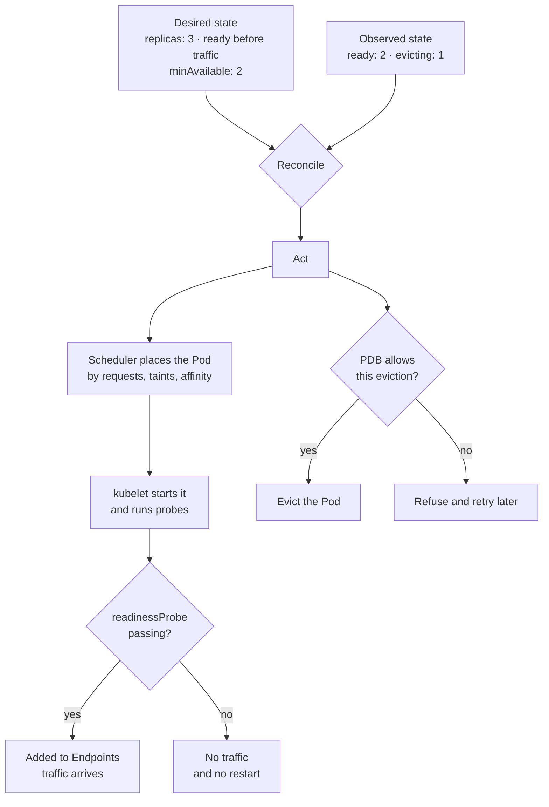

# Kubernetes Operations, Backup, and Restore

> **Interview answer (say this first).** Running workloads safely on Kubernetes means controlling three things: **where Pods land** (requests, taints, affinity), **whether they may receive traffic** (readiness probes), and **how many may be taken down at once** (PodDisruptionBudgets). Upgrades proceed control plane first, then nodes, one at a time, draining each node so the scheduler can move the work. Stateful workloads use **StatefulSets** with a **StorageClass**, and their data is protected by backups that are only credible once you have **restored** one and measured the **RTO** and **RPO** you actually achieve.

## Why this exists

A cluster can pass every test and still take the service down during routine maintenance. Here is a real-shaped failure.

A team runs `agent-api` as a Deployment with three replicas. They have no PodDisruptionBudget and no readiness probe, only a liveness probe pointed at `/health`.

```text
kubectl drain worker-2 --ignore-daemonsets     # part of a cluster upgrade
```

The scheduler is asked to remove every Pod on `worker-2`. With no PDB there is nothing to stop it, and two of the three `agent-api` Pods happen to live there. Both are evicted at once.

The replacements start in seconds, so the team expects a small blip. But there is no readiness probe, so as soon as a container process exists, the Endpoints controller adds it to the Service. The application has not finished loading its prompt templates and warming its model client, so it answers `503` for the first 40 seconds. The last remaining old Pod was already under full load and its liveness probe, which checks the database, times out under the extra traffic. The kubelet restarts it. For roughly 90 seconds, zero replicas serve traffic. Two settings would have prevented this: a readiness probe, and a PDB with `minAvailable: 2`.

The second failure is quieter and worse. The same team backs up its Postgres StatefulSet every night. The backup job has been failing for three weeks because a cloud credential expired, and nobody noticed, because the only alert is on the CronJob *existing*, not on it *succeeding*. When a bad migration deletes rows, the team discovers the newest usable backup is 21 days old. Then they discover the restore cannot be tested at all: the StorageClass named in the manifest no longer exists, and the restored Pods sit `Pending` forever.

An untested backup is not a backup. It is an assumption.

> **Note:**
>
> **The one-sentence purpose.** Operations is the discipline of changing a running cluster — draining nodes, upgrading versions, moving replicas — without reducing the service below what users need, and of restoring data in less time than the business can tolerate.

## Start from zero

Everything here rests on a small vocabulary. Read this table before the rest of the page.

| Word | Plain meaning |
| --- | --- |
| **Manifest** | A YAML or JSON file describing one or more Kubernetes objects. |
| **Desired state** | What your manifests say should be true. |
| **Observed state** | What the cluster reports is true right now. |
| **kubelet** | The agent on each node that starts containers and runs their probes. |
| **Scheduler** | The component that picks a node for each new Pod. |
| **Node** | A machine in the cluster that runs Pods. |
| **Control plane** | The API server, etcd, scheduler, and controllers that decide what runs. |
| **Taint** | A mark on a node that repels Pods unless they tolerate it. |
| **Toleration** | A Pod's permission to land on a tainted node. |
| **Affinity** | A rule that attracts a Pod toward certain nodes or other Pods. |
| **Anti-affinity** | A rule that pushes a Pod away from certain nodes or other Pods. |
| **Topology spread constraint** | A rule limiting how unevenly Pods may be spread across zones or nodes. |
| **Request** | The resource a container is guaranteed; the scheduler adds requests to place Pods. |
| **Limit** | The runtime cap enforced by the kernel; exceeding it throttles or kills. |
| **QoS class** | Guaranteed, Burstable, or BestEffort — derived from requests and limits, and used for eviction order. |
| **Liveness probe** | A health check that restarts the container on failure. |
| **Readiness probe** | A health check that removes the Pod from Service traffic on failure, without restarting. |
| **Startup probe** | A health check that disables the other two until a slow application has booted. |
| **PodDisruptionBudget (PDB)** | A rule limiting how many Pods of a set may be taken down by *voluntary* disruption. |
| **Rolling update** | Replacing Pods gradually, a few at a time, within `maxSurge` and `maxUnavailable`. |
| **StatefulSet** | A controller giving Pods stable names, ordered startup, and per-Pod storage. |
| **PersistentVolume (PV)** | A piece of durable storage in the cluster, independent of any Pod. |
| **PersistentVolumeClaim (PVC)** | A Pod's request for storage, which binds to a PV. |
| **StorageClass** | The cluster setting that decides how a PVC is provisioned, and with what performance and durability. |
| **Backup** | A copy of data and manifests, stored somewhere the cluster does not depend on. |
| **Restore** | Rebuilding a working system from a backup, and proving the data is correct. |
| **RTO** | Recovery time objective: how long a restore may take before the business is harmed. |
| **RPO** | Recovery point objective: how much data loss, measured in time, is acceptable. |
| **Upgrade** | Moving the cluster to a newer Kubernetes minor version. |
| **Cordon** | Marking a node unschedulable so no new Pods land on it. |
| **Drain** | Evicting the Pods from a cordoned node so it can be worked on. |
| **Eviction** | Removing a Pod in a way that respects PDBs. The opposite is deletion, which does not. |

Two distinctions cause most mistakes.

- **Deletion versus eviction.** `kubectl delete pod` removes a Pod immediately and ignores PDBs. The Eviction API asks politely, checks PDBs, and can be refused. `kubectl drain` uses eviction by default.
- **Voluntary versus involuntary disruption.** A PDB protects against drains, autoscaler scale-downs, and upgrades. It cannot protect against a node crashing, a kernel OOMKill, or someone deleting a Pod. Those are involuntary, and only redundancy and good probes help.

## The core idea

Reuse the thermostat from Kubernetes Core, but aim it at *operations*. The cluster is always trying to make observed state match desired state:

1. **Desired state** — three replicas of `agent-api:1.2.4`, ready before they receive traffic, spread across nodes.
2. **Observed state** — right now, two replicas are ready and one node is unschedulable.
3. **Act** — the controller creates a Pod; the scheduler finds a node; the kubelet starts it; the readiness probe gates the traffic; the PDB gates the next eviction.

Operations is the art of changing the desired state *without* letting the middle column fall below a safe level.



Notice the two gates. **Readiness is the entry gate to traffic.** **The PDB is the exit gate from the cluster.** A safe operation needs both open in the right order: a new Pod must be ready before an old one is evicted.

Scheduling controls are the knobs on the left of that diagram. Each one protects something different.

| Control | What it decides | What it protects against |
| --- | --- | --- |
| **Requests** | Which nodes have room for the Pod | A Pod that cannot be placed, and unreliable autoscaling |
| **Limits** | How much a container may consume | One noisy neighbour starving a node |
| **Taints and tolerations** | Which Pods may use a node | Workloads landing on reserved or unhealthy nodes |
| **Node affinity** | Which nodes a Pod prefers or requires | Workloads landing where their data or hardware is not |
| **Pod anti-affinity** | Which Pods avoid each other | All replicas on one node, so one failure takes all |
| **Topology spread constraints** | How evenly Pods cover zones and nodes | A "three replica" service that is really one replica per zone |
| **PodDisruptionBudget** | How many Pods may be voluntarily disrupted | A drain or scale-down taking the whole service |
| **Readiness probe** | Whether a Pod may receive traffic | Traffic hitting a Pod that cannot serve it |

The mental shortcut: **requests get you placed, affinity spreads you, readiness admits you, and the PDB keeps enough of you alive.**

## How it works

Follow the order a platform team actually does this in. Each step assumes the previous ones.

1. **Set requests and limits on every container.** Requests tell the scheduler what to reserve; limits cap runtime. A container with no requests is placed by guesswork and cannot be autoscaled on CPU. Equal requests and limits make a Pod Guaranteed, which is evicted last under node pressure.
2. **Add a readiness probe before anything else.** It answers one question: "can this Pod serve traffic right now?" Until it passes, the Pod stays out of the Service EndpointSlice. This is the single most effective zero-downtime setting.
3. **Add a liveness probe that is shallow.** Liveness restarts a stuck container. It must not check downstream services, because a slow database would then restart every replica and turn a degradation into an outage. Use a startup probe for slow boots instead of a permanently tolerant liveness probe.
4. **Spread replicas across nodes.** Use pod anti-affinity or topology spread constraints so three replicas do not share one machine. Redundancy that lives on one node is not redundancy.
5. **Set a PodDisruptionBudget.** With `minAvailable` (or `maxUnavailable`) you declare how much of the service must survive a voluntary disruption. Drain and the cluster autoscaler honour it; a PDB that can never be satisfied will block a drain forever.
6. **Drain a node safely.** `kubectl cordon` stops new Pods landing, then `kubectl drain` evicts the existing ones through the Eviction API. Evictions are refused while the PDB is violated, so the drain waits for replacements to become ready. When it finishes, the node is empty and safe to patch, reboot, or remove.
7. **Upgrade the cluster in order.** Upgrade the control plane one node at a time, then the worker nodes one at a time. Never skip a minor version: go 1.30 → 1.31 → 1.32. The kubelet may lag the control plane by a few minor versions, but the control plane itself must not jump.
8. **Run stateful workloads on StatefulSets with a StorageClass.** A StatefulSet gives each Pod a stable ordinal name and its own PVC, so `postgres-0` always reattaches to `data-postgres-0`. The StorageClass decides the disk: SSD or network storage, and whether the data survives the claim being deleted.
9. **Back up resources and volumes together.** Cluster manifests alone are not a backup of data; a database dump alone is not a backup of the configuration around it. A tool such as Velero captures both, ideally to object storage in a different account or region from the cluster.
10. **Restore, and measure.** Restore into a scratch namespace, start the application, and check real rows or documents. Time the whole thing, from "we decide to restore" to "the service is serving verified data". That measured number is your real RTO.
11. **Write down the RPO you achieve, not the one you want.** If you back up nightly, your RPO is up to 24 hours, whatever the slide deck claims. Continuous archive logs or point-in-time recovery are what buy you minutes.
12. **Alert on failure, and test on a schedule.** A backup that fails silently is worse than no backup, because it creates confidence. Run an automated restore test monthly and treat a failure as a production incident.

> **Tip:**
>
> **The mental shortcut for a safe change.** Ask three questions before you touch a running cluster. "What keeps traffic flowing while this Pod is gone?" (readiness). "What stops too many Pods going at once?" (PDB). "Can I undo this, and have I restored from my backup recently?" (rollback and restore).

## The syntax you will use

**A Deployment with requests, limits, and all three probes.** This is the safe default shape for a stateless service.

```yaml
apiVersion: apps/v1
kind: Deployment
metadata:
  name: agent-api
  namespace: agent-platform
spec:
  replicas: 3
  revisionHistoryLimit: 5
  strategy:
    type: RollingUpdate
    rollingUpdate:
      maxSurge: 1
      maxUnavailable: 0
  selector:
    matchLabels:
      app: agent-api
  template:
    metadata:
      labels:
        app: agent-api
    spec:
      containers:
        - name: api
          image: ghcr.io/acme/agent-api:1.2.4
          ports:
            - name: http
              containerPort: 8000
          resources:
            requests:
              cpu: 500m
              memory: 512Mi
            limits:
              cpu: "2"
              memory: 1Gi
          startupProbe:
            httpGet:
              path: /health/startup
              port: http
            periodSeconds: 5
            failureThreshold: 24
          readinessProbe:
            httpGet:
              path: /health/ready
              port: http
            periodSeconds: 5
            timeoutSeconds: 2
            failureThreshold: 2
          livenessProbe:
            httpGet:
              path: /health/live
              port: http
            periodSeconds: 10
            timeoutSeconds: 2
            failureThreshold: 3
```

`maxUnavailable: 0` means capacity never drops below three during a rollout; the cost is room for a fourth Pod. The startup probe gives the application up to 120 seconds (24 × 5) once, so liveness can stay strict afterwards.

**A PodDisruptionBudget.** Keep at least two healthy Pods available during any voluntary disruption.

```yaml
apiVersion: policy/v1
kind: PodDisruptionBudget
metadata:
  name: agent-api
  namespace: agent-platform
spec:
  minAvailable: 2
  selector:
    matchLabels:
      app: agent-api
```

With three replicas and `minAvailable: 2`, at most one Pod may be evicted at a time. A drain will wait for the replacement to become ready before evicting the next.

**Anti-affinity that spreads replicas.** A Pod anti-affinity rule pushes replicas apart. `requiredDuringSchedulingIgnoredDuringExecution` refuses to place a second replica on an occupied node, so a third replica stays Pending on a two-node cluster. Use `preferredDuringSchedulingIgnoredDuringExecution` with a `weight` for a soft preference instead of a hard rule. Example 4 shows both.

**A StatefulSet with `volumeClaimTemplates` and a StorageClass.** Stable identity plus per-Pod durable storage.

```yaml
apiVersion: storage.k8s.io/v1
kind: StorageClass
metadata:
  name: fast-ssd
provisioner: ebs.csi.aws.com
parameters:
  type: gp3
  iops: "6000"
reclaimPolicy: Retain
volumeBindingMode: WaitForFirstConsumer
allowVolumeExpansion: true
---
apiVersion: apps/v1
kind: StatefulSet
metadata:
  name: postgres
  namespace: agent-platform
spec:
  serviceName: postgres
  replicas: 1
  selector:
    matchLabels:
      app: postgres
  template:
    metadata:
      labels:
        app: postgres
    spec:
      containers:
        - name: postgres
          image: postgres:16.4
          ports:
            - containerPort: 5432
          resources:
            requests:
              cpu: "1"
              memory: 2Gi
            limits:
              cpu: "2"
              memory: 4Gi
          volumeMounts:
            - name: data
              mountPath: /var/lib/postgresql/data
  volumeClaimTemplates:
    - metadata:
        name: data
      spec:
        accessModes: ["ReadWriteOnce"]
        storageClassName: fast-ssd
        resources:
          requests:
            storage: 50Gi
```

`reclaimPolicy: Retain` means the underlying disk survives even if the PVC is deleted — the safe default for a database. `WaitForFirstConsumer` delays provisioning until a Pod is scheduled, so the volume lands in the same zone as the Pod.

**Cordon and drain a node.** Cordon first so nothing new lands, then drain so the node empties.

```bash
kubectl cordon worker-2
kubectl drain worker-2 --ignore-daemonsets --delete-emptydir-data --timeout=300s
kubectl get nodes
kubectl uncordon worker-2        # when the work is finished
```

`--ignore-daemonsets` is required because DaemonSet Pods cannot be evicted; they are expected to run on every node anyway. `--delete-emptydir-data` acknowledges that Pods using `emptyDir` scratch space will lose it. Drain uses the Eviction API, so a PDB can make it wait.

**Upgrade the cluster in the right order.** Control plane first, then nodes, one at a time.

```bash
# 1. First control-plane node: drain, upgrade kubeadm, then kubelet.
kubectl drain cp-0 --ignore-daemonsets
apt-get install -y kubeadm=1.31.4-1.1
kubeadm upgrade plan
kubeadm upgrade apply v1.31.4
apt-get install -y kubelet=1.31.4-1.1 kubectl=1.31.4-1.1
systemctl daemon-reload && systemctl restart kubelet
kubectl uncordon cp-0

# 2. Each remaining control-plane node, then each worker node.
kubectl drain worker-0 --ignore-daemonsets --delete-emptydir-data
apt-get install -y kubeadm=1.31.4-1.1
kubeadm upgrade node
apt-get install -y kubelet=1.31.4-1.1
systemctl daemon-reload && systemctl restart kubelet
kubectl uncordon worker-0
```

On a managed cluster such as EKS you do not run `kubeadm`. You upgrade the control plane through the provider, then upgrade node groups; the drain-and-replace step is handled by the node group's rolling update, which still respects PDBs.

**Back up with Velero.** Velero stores cluster resources and volume data in object storage, outside the cluster. Schedule one nightly backup of the namespace:

```bash
velero schedule create agent-platform-nightly \
  --include-namespaces agent-platform \
  --snapshot-volumes \
  --default-volumes-to-fs-backup \
  --ttl 720h0m0s \
  --schedule "0 1 * * *"

velero backup create agent-platform-manual --include-namespaces agent-platform --wait
velero backup get
velero backup describe agent-platform-manual --details   # check volume snapshots
velero backup logs agent-platform-manual                 # check for partial failure
```

**Restore, into a scratch namespace, and time it.** Never restore straight over production as your first test.

```bash
date -u +"%Y-%m-%dT%H:%M:%SZ"          # record the start time
velero restore create agent-platform-drill \
  --from-backup agent-platform-manual \
  --include-namespaces agent-platform \
  --namespace-mappings agent-platform:agent-platform-restore \
  --wait
kubectl get pods -n agent-platform-restore
kubectl exec -n agent-platform-restore postgres-0 -- \
  psql -U app -d app -c "SELECT count(*) FROM documents;"
date -u +"%Y-%m-%dT%H:%M:%SZ"          # record the end time
```

`--wait` makes the command block until the restore finishes, so the elapsed time between the two timestamps is a real, measured RTO for this data size.

## Examples: simple to real

**Example 1 — a readiness probe that stops traffic reaching a not-ready Pod.** Watch the EndpointSlice fill only when the application is genuinely ready.

```yaml
# ... Pod spec ...
readinessProbe:
  httpGet:
    path: /health/ready
    port: http
  periodSeconds: 5
  failureThreshold: 2
```

```bash
kubectl get endpointslices -l kubernetes.io/service-name=agent-api -w
kubectl get pods -l app=agent-api
```

The Pod appears in the slice as `ready: false` while the probe fails, then flips to `ready: true`. Because the Service only forwards to ready endpoints, users never see the cold-start `503`. This is what makes a rolling update safe: a new Pod joins the rotation only after it can serve.

**Example 2 — requests, limits, and the OOM/throttling consequences.** Two containers, same image, different limits.

```yaml
containers:
  - name: generous
    resources:
      requests: { cpu: 500m, memory: 512Mi }
      limits:   { cpu: "2",  memory: 1Gi }
  - name: cramped
    resources:
      requests: { cpu: 500m, memory: 512Mi }
      limits:   { cpu: 500m, memory: 512Mi }   # Guaranteed, but small
```

```bash
kubectl describe pod agent-api-7d9c-abcde | grep -i -A4 "Last State"
#   Reason: OOMKilled
#   Exit Code: 137
kubectl top pod agent-api-7d9c-abcde
```

Exit code 137 with `Reason: OOMKilled` means the container passed its memory limit and the kernel killed it. The cramped container is also throttled on CPU: it keeps running, but slower, because CPU is compressible and memory is not. Set requests from observed usage, and give memory a limit with headroom.

**Example 3 — a PDB that keeps a drain from taking down the service.** Drain with and without the budget.

```bash
# Without a PDB: everything leaves at once.
kubectl get pdb -n agent-platform        # No resources found
kubectl drain worker-2 --ignore-daemonsets --delete-emptydir-data --timeout=60s

# With the PDB from the syntax section:
kubectl apply -f agent-api-pdb.yaml
kubectl drain worker-2 --ignore-daemonsets --delete-emptydir-data --timeout=300s
kubectl describe pdb agent-api -n agent-platform   # DisruptionsAllowed: 0 proves the block
kubectl get pdb -n agent-platform
```

With the budget in place, the drain evicts one Pod, waits for its replacement to become ready, then evicts the next. It takes longer, and that is the point: the drain now costs minutes, not an outage. If a drain never completes, check that `minAvailable` is not equal to `replicas`, which makes every eviction impossible.

**Example 4 — anti-affinity spreading replicas.** Prove that three replicas land on three nodes, and what happens when they cannot.

```yaml
spec:
  affinity:
    podAntiAffinity:
      preferredDuringSchedulingIgnoredDuringExecution:
        - weight: 100
          podAffinityTerm:
            topologyKey: kubernetes.io/hostname
            labelSelector:
              matchLabels:
                app: agent-api
```

```bash
kubectl get pods -l app=agent-api -o wide
# NAME                         NODE
# agent-api-6f9c8d7b4b-2xk9p   worker-0
# agent-api-6f9c8d7b4b-8m4qz   worker-1
# agent-api-6f9c8d7b4b-n7t4c   worker-2
kubectl get events -n agent-platform --field-selector reason=FailedScheduling
```

With `preferred` anti-affinity the scheduler spreads replicas when it can and co-locates when the cluster is full. Swap in `requiredDuringSchedulingIgnoredDuringExecution` and a two-node cluster leaves the third replica `Pending` forever — a useful hard guarantee if you have the nodes, and a self-inflicted outage if you do not.

**Example 5 — a backup and a restore with the measured recovery time.** This is the drill that turns a backup into a promise you can keep.

```bash
# 1. Take a backup and confirm it completed.
velero backup create drill-2026-09-14 --include-namespaces agent-platform --wait
velero backup describe drill-2026-09-14 --details | grep -i phase
#   Phase:  Completed

# 2. Destroy something real in a scratch copy, not production.
kubectl create namespace agent-platform-restore
velero restore create drill-1 --from-backup drill-2026-09-14 \
  --include-namespaces agent-platform \
  --namespace-mappings agent-platform:agent-platform-restore --wait

# 3. Verify the data, not just the Pods.
kubectl rollout status statefulset/postgres -n agent-platform-restore
kubectl exec -n agent-platform-restore postgres-0 -- \
  psql -U app -d app -tAc "SELECT count(*) FROM documents;"
#   48213
```

```text
Measured drill — 50 GiB database, 12 000 objects
Backup duration 6 min 40 s · RPO up to 24 h (nightly)
Restore to Pods Ready 4 min 05 s · verify data 1 min 30 s
Total measured RTO 5 min 35 s
```

Write those four numbers down. In an interview, "our RTO is five and a half minutes because we measured a 50 GiB restore last month" is a different class of answer from "we have backups".

## In production

- **Probes must reflect real readiness.** A readiness probe that returns `200` as soon as the web server binds admits a Pod that cannot serve. Check what actually matters: the model client is configured, schemas are loaded, the connection pool is warm.
- **An eager liveness probe causes crash loops.** Restarting does not fix a slow dependency. Keep liveness shallow, give slow boots a startup probe, and set `failureThreshold` high enough that a transient stall does not restart a healthy Pod.
- **Requests drive scheduling; limits drive throttling and OOM.** The scheduler ignores limits when placing Pods, so tiny requests with huge limits oversubscribe a node. CPU limits throttle (slow, not dead); memory limits OOMKill (dead, restarted). Size requests from observed usage.
- **PDBs are the only limit on voluntary disruption — and they can jam.** A crashed node or an OOMKill ignores a PDB, so redundancy is still your defence there; at the other extreme, `minAvailable` equal to `replicas` refuses every eviction, so drains hang and upgrades stall.
- **StatefulSets need stable identity for a reason.** Ordinal names and per-Pod PVCs are what let `postgres-0` reattach to its own disk after a restart. Deleting the StatefulSet leaves the PVCs behind by default, which protects data and surprises anyone expecting a clean teardown.
- **Storage classes differ enormously in performance, durability, and failure mode.** A zonal SSD is fast and pinned to one zone; network file storage is slower and shared; a local volume is fastest and lost with the node. `reclaimPolicy: Retain` prevents a deleted PVC from destroying the disk; `Delete` is the default and does not.
- **An untested backup is not a backup.** Monitor backup *success*, alert on failure, and run a restore drill on a schedule. Restore into a scratch namespace so the drill cannot damage production.
- **Restores break for boring reasons.** A missing StorageClass, an RBAC rule absent in the new cluster, a Secret not included in the backup, an immutable field such as a Service `clusterIP` that no longer exists, or a moved object-storage bucket. Restore drills catch all of these before an incident does.
- **Upgrade order matters: control plane, then nodes.** Upgrade one control-plane node at a time, then workers one at a time, draining each first. Never skip a minor version. The kubelet may lag a few minors behind the API server, but the control plane must not jump.
- **Drain with care for singleton workloads.** A Deployment with one replica, or a Prometheus with a local volume, will be down for the whole drain because there is no second copy to take over. Plan maintenance for these, or give them a second replica they cannot really use.
- **Reserve capacity for GPUs and accelerators.** A GPU node is expensive and scarce, so `nvidia.com/gpu` is an extended resource: set it in `limits` only, and Kubernetes requires the request to equal it. Taint GPU nodes so ordinary Pods do not consume them.
- **Monitor restart counts and pending Pods.** `kubectl get pods` showing rising `RESTARTS` is an early warning of a probe problem or an OOM. Pods stuck `Pending` mean the scheduler cannot fit the requests, a PDB is blocking, or storage is unavailable.

## Interview questions

### 1. What is a PodDisruptionBudget, and what does it not protect against?

**Answer.** A PDB limits how many Pods of a set may be unavailable during a *voluntary* disruption such as a node drain, a cluster upgrade, or a cluster-autoscaler scale-down. With `minAvailable: 2` and three replicas, at most one Pod may be evicted at a time. The Eviction API checks the budget and refuses if it would be violated, so the drain waits for replacements to become ready.

**Follow-up: "Does a PDB keep my service up through a node crash?"** No. A crashed node is an involuntary disruption, and PDBs do not apply. Only redundancy — replicas on healthy nodes — helps there.

**Trap.** Setting `minAvailable` equal to `replicas`. Then every eviction is refused, drains hang until timeout, and upgrades stall. If you truly want zero disruption, use `maxUnavailable: 1` on a larger replica set instead of forbidding everything.

### 2. Why would `kubectl drain` hang, and how do you fix it?

**Answer.** Drain uses the Eviction API, which a PDB can refuse. It hangs when evicting a Pod would take the budget below its minimum, and no replacement can become ready: too few nodes, missing resource requests, a failing readiness probe, or storage that will not bind. The fix is to look at why the replacement is not Ready, not to bypass the budget.

**Follow-up: "What do you do in a real emergency?"** Fix readiness or capacity first. If you genuinely must proceed, `kubectl drain --disable-eviction` skips the Eviction API and deletes Pods directly, but that ignores the PDB and can cause the outage the budget existed to prevent. Treat it as a last resort, and record why.

**Trap.** Running `kubectl delete node` instead of draining. That removes the node object and leaves its Pods stranded; the workloads are only rescheduled if a controller owns them, and you lose the orderly eviction.

### 3. How do liveness and readiness probes differ, and how can each cause an outage?

**Answer.** Readiness answers "can this Pod serve traffic now?" and failing removes it from Service Endpoints *without* restarting it. Liveness answers "is this container still healthy?" and failing restarts it. A readiness probe that is too shallow lets traffic into a cold Pod; a liveness probe that checks a downstream dependency restarts every replica when that dependency slows down, turning a degradation into a full outage.

**Follow-up: "Where does a startup probe fit?"** It runs first and, until it succeeds, disables liveness and readiness. That lets a model-loading application take 90 seconds to boot without making liveness permanently forgiving.

**Trap.** Using the same endpoint for liveness and readiness. They answer different questions; if the endpoint checks the database, liveness will restart the whole fleet whenever the database hiccups.

### 4. Explain requests and limits, and what happens when each is exceeded.

**Answer.** A request is what the scheduler reserves on a node and what the HPA measures utilisation against. A limit is the runtime cap enforced by cgroups. Exceeding a CPU limit causes throttling — the container is slowed but keeps running, because CPU is compressible. Exceeding a memory limit causes an OOMKill and a restart, because memory cannot be reclaimed by slowing down.

**Follow-up: "What are QoS classes?"** Guaranteed when every container has equal requests and limits for CPU and memory; BestEffort when none are set; Burstable otherwise. Under node pressure the kubelet evicts BestEffort first, then Burstable Pods over their requests, and Guaranteed last.

**Trap.** Thinking limits reserve capacity. The scheduler only sums requests, so a cluster full of small requests and large limits is oversubscribed and behaves unpredictably when everything bursts at once.

### 5. How does a rolling update stay zero-downtime?

**Answer.** The Deployment creates a new ReplicaSet, scales it up within `maxSurge`, and scales the old one down within `maxUnavailable`. A new Pod joins the Service only once its readiness probe passes, and an old Pod is terminated only after it is removed from Endpoints. With `maxSurge: 1` and `maxUnavailable: 0`, capacity never drops below the desired replica count.

**Follow-up: "What about the Pod's own shutdown?"** Add a `preStop` hook or a short `terminationGracePeriodSeconds` sleep. Endpoint removal and the SIGTERM are concurrent, so a Pod that exits instantly can drop in-flight requests while it is still being removed from the load balancer.

**Trap.** Believing a rolling update is safe without a readiness probe. Without it, new Pods enter the rotation the moment the container starts, and users see the cold-start errors.

### 6. Walk me through upgrading a Kubernetes cluster.

**Answer.** Upgrade the control plane first, one node at a time: drain the node (which respects PDBs), upgrade `kubeadm`, run `kubeadm upgrade apply` on the first control-plane node and `kubeadm upgrade node` on the rest, upgrade `kubelet` and `kubectl`, restart the kubelet, then uncordon. Then upgrade workers one at a time with the same drain and uncordon around them. Never skip a minor version. On a managed service such as EKS, the provider upgrades the control plane and the node groups do a rolling replacement.

**Follow-up: "How far behind may the kubelet be?"** The kubelet may lag the API server by a few minor versions, which is what makes a rolling node upgrade possible. The control plane itself must move one minor version at a time.

**Trap.** Upgrading all nodes at once for speed. That is a cluster-wide drain, and without PDBs and spare capacity it is an outage. One node at a time is the whole method.

### 7. How do you back up and restore a stateful workload, and what are RTO and RPO?

**Answer.** Back up the Kubernetes resources and the persistent volumes together, to storage outside the cluster and ideally in another account or region. A tool such as Velero takes both; a nightly `pg_dump` covers only the database, not the Secrets and configuration around it. RPO is how much data you may lose, so a nightly backup gives an RPO of up to 24 hours. RTO is how long the restore may take; you only know yours by measuring a real restore.

**Follow-up: "How do you get a small RPO?"** Continuous archiving or point-in-time recovery, which ships database transaction logs to object storage, so you can restore to a specific moment rather than the last full copy.

**Trap.** Backing up only the application namespace and forgetting cluster-scoped objects, or only taking volume snapshots without the manifests. Restoring one without the other gives you data with no application, or an application with no data.

### 8. How do you know a backup will actually restore?

**Answer.** Because you have restored one and verified the data. Do it on a schedule, into a scratch namespace, and measure the elapsed time and the row or document count. Automate the check so it fails loudly, and alert on backup *failure*, not just on the CronJob existing. A backup that has never been restored is a hypothesis.

**Follow-up: "What commonly breaks a restore?"** A missing StorageClass or volume snapshot class, RBAC that does not exist in the target cluster, Secrets excluded from the backup, immutable fields such as a Service `clusterIP` from an older cluster, and object storage that moved. A drill finds all of these cheaply, before an incident does.

**Trap.** Restoring straight over production as the test. If the restore is partial or wrong you have destroyed the data you were trying to recover, with no second copy to fall back on.

## Remember this

- **Readiness admits traffic, liveness restarts, startup protects slow boots.** Zero-downtime rolling updates depend on readiness, not on luck.
- **Requests get you placed; limits throttle or kill.** CPU limits throttle, memory limits OOMKill, and QoS class sets the eviction order.
- **A PDB protects against voluntary disruption only.** Drains, upgrades, and scale-downs honour it; a crashed node does not. Never set `minAvailable` equal to `replicas`.
- **Upgrade the control plane first, then nodes, one at a time, draining each.** Never skip a minor version, and let the PDB decide when the drain may proceed.
- **An untested backup is not a backup.** Restore into a scratch namespace, verify the data, and quote a measured RTO and RPO — not a hoped-for one.
