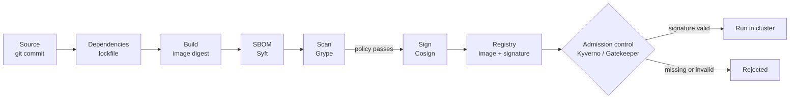

# Supply Chain, FinOps, and GPU Scheduling

> **Interview answer (say this first).** Three operational concerns decide whether an AI platform is trustworthy and affordable. **Supply chain**: generate a software bill of materials (SBOM) at build, scan it, sign the image, and refuse to admit anything unsigned. **FinOps**: tag every resource, measure cost per service and per tenant, watch unit economics (cost per request or per token) rather than only the monthly bill, and set budgets with alerts. **GPU scheduling**: put expensive GPUs in a dedicated node pool behind a taint, install the device plugin so the scheduler can see `nvidia.com/gpu`, request the GPU explicitly, and attack idle GPU time first because it is the largest AI cost. The unifying rule is: you cannot manage what you cannot see, and you cannot enforce what you never recorded.

## Why this exists

Two failures happen again and again on AI platforms, and both are invisible until they are expensive.

The first is a vulnerable dependency that ships. A base image carries a copy of a library with a known remote-code-execution flaw. Nobody rebuilt it, nobody scanned it, and the image has been running for months. The first time anyone notices is when the SBOM is requested during an incident, and it does not exist. Without an inventory and a scanner, you cannot even answer the question "are we affected?" — let alone prove you are not.

The second is the GPU bill. A team provisions a node pool with four GPU instances for a fine-tuning experiment. The experiment ends in a week. The nodes keep running, idle, at roughly $3 per hour each. That is about $8,600 a month for nothing:

```text
4 nodes x $3.00/hour x 24 hours x 30 days = $8,640 per month of idle cost
```

Nobody chose to spend that. It simply happened, because no tag tied the nodes to an owner, no budget alerted on the trend, and no one measured GPU utilisation. The same story repeats with model tokens: a single retry bug can multiply token spend, and the monthly invoice shows the total but not the cause.

These look like three topics, but they are one discipline: **make the invisible visible, then enforce a rule.** Scanning makes dependencies visible. Signing and admission make trust checkable. Tags make cost attributable. Unit economics makes spending understandable. Taints and device plugins make GPU use explicit. A platform that does none of these is guessing.

> **Note:**
>
> **The one-sentence purpose.** Know what is in your images, know what you spend per unit of work, and never let expensive hardware sit idle and unattributed.

## Start from zero

| Word | Plain meaning |
| --- | --- |
| **Supply chain** | Everything that goes into an image: source, dependencies, base image, build tools. |
| **SBOM** | Software bill of materials: a machine-readable list of every package and version in an artifact. |
| **Provenance** | A signed record of how and where an artifact was built (builder, commit, inputs). |
| **Artifact signing** | Cryptographically signing an image so consumers can verify it came from you and was not altered. |
| **Dependency scanning** | Checking the packages in an artifact against databases of known vulnerabilities. |
| **Vulnerability** | A weakness in software that an attacker could exploit. |
| **CVSS severity** | A 0–10 score for a vulnerability, usually grouped as low, medium, high, critical. |
| **Policy as code** | Written, version-controlled rules that a machine enforces, instead of human review. |
| **Admission control** | A Kubernetes gate that allows, mutates, or rejects an object before it is created. |
| **FinOps** | The practice of managing cloud cost with engineering, finance, and product together. |
| **Tagging / allocation** | Labelling resources so their cost can be attributed to a team, service, or tenant. |
| **Showback** | Reporting cost to teams without moving money. |
| **Chargeback** | Actually billing a team's budget for the resources it used. |
| **Unit economics** | Cost per unit of business value, such as cost per request, per document, or per token. |
| **Budget and forecast** | A spending limit plus a projection of future spend, with alerts on both. |
| **Idle cost** | Money spent on resources that are running but doing no useful work. |
| **Right-sizing** | Setting requests and limits to match real usage instead of guessing high. |
| **Spot / preemptible** | Cheap capacity a cloud provider can reclaim with little notice. |
| **GPU node pool** | A group of nodes with GPUs, usually kept separate from ordinary CPU nodes. |
| **Device plugin** | A Kubernetes DaemonSet that discovers GPUs on a node and advertises them to the scheduler. |
| **Taint / toleration for GPUs** | A mark on a GPU node that repels normal pods, plus a matching permission on GPU pods. |
| **Bin-packing** | Placing workloads tightly on few nodes so more nodes can be turned off. |
| **Overcommit** | Scheduling workloads for more resources than physically exist, betting they will not all peak at once. |

Three distinctions carry most of the weight:

- **Scanning versus signing.** Scanning asks "does this contain a known flaw?" Signing answers "did this come from us and is it unmodified?" You need both; one does not imply the other.
- **Showback versus chargeback.** Showback is a report; chargeback is a bill. Chargeback changes behaviour because a team's budget is really reduced.
- **Lower spend versus better unit economics.** Spend can fall because you grew less. Unit economics can improve while total spend rises because you serve far more traffic. The second is what a growing platform wants.

## The core idea

Think of an airport. Bags are packed at the source (source code and dependencies). Each bag gets a manifest (the SBOM), a tamper-evident seal (the signature), and an X-ray scan (the vulnerability scan). At the gate, security refuses any bag without a valid seal. Nothing about this stops a determined attacker, but it removes entire classes of accident: the forbidden item, the unsealed bag, the bag nobody can trace.

Cost works the same way. You would not run an airline without knowing the cost per seat, not just the total fuel bill. A platform needs cost per request or per token. The total bill tells you what you spent; the unit cost tells you whether the business makes sense.

The supply chain has a fixed path, and every stage leaves evidence:



The evidence is what makes the last box enforceable. Without an SBOM and a signature, admission control has nothing to check.

Costs, in contrast, are messy. The same dollar shows up in many places. This table is the one to memorise:

| Cost driver | How it appears | How to control it |
| --- | --- | --- |
| **Model tokens** | Per-call input/output token charges | Trim prompts, cache, cap `max_tokens`, route to smaller models |
| **Idle GPUs** | GPU nodes running with no work | Scale pools to zero, schedule batch jobs, monitor utilisation |
| **Over-requested CPU/memory** | Nodes running far below capacity | Right-size requests from observed usage |
| **Egress** | Data leaving a region or the cloud | Keep traffic in-region, use VPC endpoints, compress payloads |
| **Storage and vectors** | Growing buckets, indexes, and log retention | Lifecycle policies, retention limits, delete stale embeddings |
| **Retries and failures** | Repeated calls for one logical request | Bound retries, add circuit breakers, idempotency |
| **Untagged resources** | Spend with no owner | Enforce tagging, and treat untagged spend as an incident |

The crucial idea in the last column is that **decreasing spend and improving unit economics are different goals.** Cutting the GPU pool in half reduces spend and may also break throughput. Making the retrieval step cheaper so cost per request falls while request volume grows is improving unit economics. An interviewer wants you to know that a good platform does the second, and reaches for the first only as a stopgap.

> **The mental shortcut.** Total spend is a number; cost per request is a decision. Manage the decision.

## How it works

Walk the whole lifecycle once, then repeat it as a pipeline.

1. **Generate an SBOM at build time.** As part of building the image, run a tool such as Syft to enumerate every operating-system package and language dependency, with versions and licences, into a file such as SPDX or CycloneDX JSON.
2. **Scan and fail the build on a severity policy.** Run a scanner such as Grype over the image or the SBOM. The policy must be explicit: for example, fail on `high` and `critical` with a known fix, and allow a documented, time-limited exception. A scanner with no failing threshold is decoration.
3. **Sign the artifact.** After the scan passes, sign the image digest with Cosign. The signature lives beside the image in the registry. For stronger guarantees, also attach build provenance.
4. **Verify, then admit only signed images.** A cluster policy (Kyverno or Gatekeeper) checks the signature before a pod is created. Unsigned images are rejected. This is the step that turns a build-time habit into an enforced rule.
5. **Tag resources for allocation.** Apply tags such as `Application`, `Environment`, `Team`, `Tenant`, and `CostCentre` to every resource you create. In AWS, activate those tags as **cost allocation tags** so they appear in Cost Explorer and the cost and usage report.
6. **Measure cost per service and per tenant.** Aggregate the bill by tag. Untagged spend is unattributable by definition, so drive it toward zero.
7. **Compute unit economics.** Divide cost by a business unit: cost per request, per document, per agent run, or per thousand tokens. Track the trend, not just the absolute value.
8. **Set budgets and alerts.** Create a budget per team or service and alert at a percentage of forecast, not only at 100%. An alert that fires after the money is gone catches nothing.
9. **Right-size requests.** Compare requested CPU and memory with actual usage. Set requests close to the observed working set, and limits high enough to survive a burst. Too low causes throttling and OOM kills; too high wastes money and blocks bin-packing.
10. **Use spot where safe.** Spot capacity is fine for stateless, retryable work such as batch embedding, and dangerous for stateful or long-running jobs that cannot checkpoint. Mix spot with a small on-demand floor.
11. **Schedule GPUs deliberately.** Put GPUs in a dedicated node pool, taint the nodes so ordinary workloads cannot squat on them, install the NVIDIA device plugin so the scheduler sees `nvidia.com/gpu`, and require GPU pods to tolerate the taint and request the device.
12. **Track idle GPU time.** Record GPU utilisation and idle hours as a first-class metric. Scale batch pools to zero, and treat sustained idle GPU time as a defect to fix.

Steps 1–4 are the supply chain. Steps 5–10 are FinOps. Steps 11–12 are GPU scheduling. They meet in one place: the tag. A tag connects a signed image to a service, and a service to a cost.

## The syntax you will use

**A CI step that generates an SBOM and scans it.** Syft writes the inventory; Grype reads it and fails the build on the chosen severities.

```yaml
- name: Generate SBOM
  run: syft "$IMAGE" -o spdx-json=sbom.spdx.json

- name: Scan for vulnerabilities
  run: grype sbom:./sbom.spdx.json --fail-on high

- name: Upload SBOM as evidence
  uses: actions/upload-artifact@v7
  with:
    name: sbom
    path: sbom.spdx.json
```

`--fail-on high` is the policy made executable. Without it, Grype prints findings and exits zero, and the build passes.

**Sign an image digest and verify it.** Signing the digest (`@sha256:...`) rather than a tag ties the signature to immutable content.

```bash
cosign sign --key cosign.key ghcr.io/acme/app@sha256:abc123
cosign verify --key cosign.pub ghcr.io/acme/app@sha256:abc123
```

`cosign sign` writes the signature to the registry next to the image. `cosign verify` returns the verified signature payload and fails with a non-zero exit code if verification does not hold, which is what admission control and CI rely on.

**A Kyverno policy that requires a valid signature.** `validationFailureAction: Enforce` rejects non-compliant pods; `publicKeys` points at a ConfigMap holding the trust anchor.

```yaml
apiVersion: kyverno.io/v1
kind: ClusterPolicy
metadata:
  name: require-signed-images
spec:
  validationFailureAction: Enforce
  rules:
    - name: verify-signature
      match:
        any:
          - resources:
              kinds: [Pod]
      verifyImages:
        - imageReferences:
            - "ghcr.io/acme/*"
          attestors:
            - entries:
                - keys:
                    publicKeys: k8s://kyverno/cosign-public-key
```

The ConfigMap in namespace `kyverno` must contain the public key under the key `cosign.pub`. Gatekeeper does not verify signatures itself; it reaches the same result through an **external data provider** that calls `cosign verify` and returns the verdict to a constraint, which then denies the pod.

**Activate and apply AWS cost allocation tags.** Activate the tag keys once in the Billing console, then tag resources consistently.

```bash
# Tag a resource so its spend is attributable.
aws resourcegroupstaggingapi tag-resources \
  --resource-arn-list arn:aws:ecs:us-east-1:123456789012:service/ai-platform/agent-runtime \
  --tags Application=agent-runtime,Tenant=acme,Environment=prod,CostCentre=ai-platform
```

```text
Billing -> Cost allocation tags -> activate (user-defined):
  Application, Tenant, Environment, Team, CostCentre
```

An unactivated tag is invisible to the billing system, which is the most common tagging mistake.

**A GPU pod that lands on a tainted GPU node pool.** The node selector picks the pool, the toleration allows the taint, and `nvidia.com/gpu` requests the device.

```yaml
apiVersion: v1
kind: Pod
metadata:
  name: gpu-embedder
spec:
  nodeSelector:
    accelerator: nvidia-a10g
  tolerations:
    - key: nvidia.com/gpu
      operator: Equal
      value: "true"
      effect: NoSchedule
  containers:
    - name: embed
      image: ghcr.io/acme/embedder@sha256:abc123
      resources:
        limits:
          nvidia.com/gpu: 1
```

**Taint the GPU nodes so CPU workloads stay off them.** The NVIDIA device plugin then advertises the device count on each node.

```bash
kubectl taint nodes gpu-node-1 nvidia.com/gpu=true:NoSchedule
# The device plugin runs as a DaemonSet and advertises nvidia.com/gpu to the scheduler.
```

Without the taint, an ordinary CPU pod can be scheduled onto an expensive GPU node. Without the device plugin, `nvidia.com/gpu` is not a schedulable resource and the pod stays `Pending`.

## Examples: simple to real

**Example 1 — a build that fails on a high-severity vulnerability.** The scanner exits non-zero, so the pipeline stops before the image is signed or pushed.

```text
$ grype sbom:./sbom.spdx.json --fail-on high
NAME          INSTALLED   FIXED-IN   TYPE      VULNERABILITY   SEVERITY
openssl       3.0.2       3.0.8      apk       CVE-2022-0778   High
libxml2       2.9.13      2.9.14     apk       CVE-2022-23308  High

2 vulnerabilities found
exit status 1  ->  build fails, image is never signed
```

The fix is to update the base image and the pinned dependency, rebuild, and rescan. The point is that the failure is automatic and early, not a surprise during an audit.

**Example 2 — an unsigned image rejected at admission.** The policy runs before the pod exists, so the cluster never runs untrusted code.

```text
$ kubectl apply -f deployment.yaml
Error from server: admission webhook "mutate.kyverno.svc-fail" denied the request:
  policy Pod/default/agent-worker for resource violation:
  require-signed-images:
    verify-signature: 'failed to verify image ghcr.io/acme/agent-worker:latest:
    no matching signatures'
```

Note the tag `:latest`. The image was never signed, and even a signed tag would be weaker than a digest. The cluster enforces the rule regardless of who deploys.

**Example 3 — cost per request from tokens and infrastructure.** Unit economics combine model cost and compute cost into one number.

```text
Per request:
  input tokens    1,200  x $0.15 / 1M = $0.000180
  output tokens     300  x $0.60 / 1M = $0.000180
  compute        50 ms on $0.20/hour  = $0.0000028
  ---------------------------------------------------
  cost per request                     = $0.000363
  cost per 1M requests                 = $362.78
```

If a customer pays $0.001 per request, the margin is real. If they pay $0.0002, the platform loses money on every call, and no monthly total would have told you that as clearly.

**Example 4 — right-sizing a container that was over-requesting.** Observed usage over a week is far below the request, so the request shrinks and the cluster packs more pods per node.

```yaml
# Before: requested 2 CPU and 2Gi, used about 300m and 400Mi.
resources:
  requests: { cpu: "2",    memory: "2Gi" }
  limits:   { cpu: "2",    memory: "4Gi" }

# After: requests match the observed working set; limits keep burst headroom.
resources:
  requests: { cpu: "500m", memory: "512Mi" }
  limits:   { cpu: "2",    memory: "1Gi" }
```

Across five replicas this frees about 7.5 CPU and 7.5Gi of reserved capacity. Do not shrink blindly: watch for CPU throttling and OOM kills for a week after the change.

**Example 5 — a GPU workload on a tainted pool with a device plugin.** A batch embedding job lands on GPU nodes, and nothing else does.

```yaml
apiVersion: batch/v1
kind: Job
metadata:
  name: embed-backlog
spec:
  template:
    spec:
      restartPolicy: OnFailure
      nodeSelector:
        accelerator: nvidia-a10g
      tolerations:
        - key: nvidia.com/gpu
          operator: Equal
          value: "true"
          effect: NoSchedule
      containers:
        - name: embed
          image: ghcr.io/acme/embedder@sha256:abc123
          resources:
            limits:
              nvidia.com/gpu: 1
```

The Job is stateless and retryable, so it can run on spot capacity inside the GPU pool. When the backlog drains, scale the pool toward zero and stop paying for idle GPUs. That single behaviour usually saves more than every prompt tweak combined.

## In production

- **Scan and sign in CI, then enforce at admission.** A scan nobody enforces is a report. Sign the digest, not the tag: a tag can be moved, so verification means nothing if the thing being verified is mutable. The policy is what stops an unsigned image reaching production.
- **An SBOM is a response tool, not decoration.** When a new CVE lands, the SBOM answers "which images contain this package?" in minutes instead of days. Store it as a build artifact with the image digest.
- **Make the severity policy explicit.** State which severities fail the build, which are allowed with a documented exception, and when the exception expires. An unstated policy is silently ignored.
- **Tags are the basis of all allocation.** Choose a small tag schema (`Application`, `Environment`, `Team`, `Tenant`, `CostCentre`) and enforce it. More tags mean more untagged spend, not better reporting.
- **Untagged spend is unattributable and therefore unmanageable.** Treat a rising untagged percentage as an incident with an owner, not as background noise.
- **Track unit economics, not just the bill.** Cost per request, per document, or per thousand tokens tells you whether the platform is getting healthier as it grows. The total rises; the unit cost should fall.
- **Budgets and alerts catch the spike.** Alert on a forecast breach and on a sudden rate change, not only at the hard limit. A retry bug can double spend in an afternoon.
- **Idle GPU time is the biggest AI cost.** Monitor GPU utilisation and idle hours. Scale batch pools to zero when there is no work, and prefer queue-driven batch jobs over always-on inference for non-interactive workloads.
- **Spot is fine for stateless and dangerous for stateful.** Use it for retryable batch work with checkpointing. Keep a small on-demand floor for anything user-facing or non-resumable.
- **Over-requesting wastes money; under-requesting causes OOM kills and throttling.** Right-size from observed usage, keep limits above requests for burst headroom, and re-check after every significant change.
- **Taint GPU nodes so other workloads do not squat on them.** If an idle GPU node accepts a CPU-only pod, you are paying GPU prices for CPU work. Pair every taint with a toleration on the GPU workloads, and never remove the taint to "make scheduling easier".
- **Chargeback changes behaviour more than showback.** A team that sees its own budget shrink when it leaves GPUs idle will fix the idle GPUs. A team that only sees a dashboard usually will not.

## Interview questions

### 1. What is an SBOM, and what do you actually do with it?

**Answer.** An SBOM is a machine-readable inventory of every component in an artifact: operating-system packages, language libraries, and their versions and licences. You generate it at build time with a tool like Syft, store it next to the image digest, and use it to answer "which of our images are affected?" the moment a new vulnerability is announced. It is the response tool for the days after a CVE, not a compliance checkbox.

**Follow-up: "Does an SBOM make you secure?"** No. It makes you *answerable*. Scanning finds known flaws and signing proves origin; the SBOM is the inventory that lets you reason about both quickly.

**Trap.** Generating an SBOM but never storing it with the image. An SBOM you cannot tie to a running digest is useless during an incident.

### 2. Why sign container images, and what does signing actually prove?

**Answer.** Signing proves the image came from your build system and has not been modified since. Cosign signs the image digest and stores the signature in the registry; admission control verifies it before the pod is created. It narrows the set of things that can run to things you built, which blocks the accidental `docker push` of a hand-built or tampered image.

**Follow-up: "How does keyless signing work?"** Cosign can use an OIDC identity from CI to obtain a short-lived signing certificate, tied to the workflow and repository, so there is no long-lived private key to leak. The trade-off is dependence on the identity provider and the transparency log.

**Trap.** Signing the tag `:latest`. A tag can be repointed after signing, so verification checks the wrong content. Always sign and deploy by digest.

### 3. How does admission control fit into the supply chain?

**Answer.** Admission control is the enforcement point. Kyverno or Gatekeeper intercept Kubernetes objects before they are created and can reject a pod whose image is unsigned, unscanned, or from an untrusted registry. The pipeline builds trust (scan, sign, provenance); admission spends it. Without admission, every guarantee you established in CI is optional for anyone with cluster write access.

**Follow-up: "What happens if the policy webhook is down?"** Decide deliberately: fail closed, so nothing schedules without a verdict, or fail open with a loud alarm. Most platforms fail closed for security policies and accept the availability risk.

**Trap.** Assuming Gatekeeper verifies signatures natively. It does not; it uses an external data provider, often calling `cosign`, and the constraint checks that response.

### 4. What is the difference between reducing spend and improving unit economics?

**Answer.** Reducing spend lowers the total bill, often by doing less: fewer GPUs, smaller models, shorter retention. Improving unit economics lowers cost per unit of value — cost per request, per document, per token — even if total spend rises because volume grows. Both matter, but a growing platform should aim for falling unit cost and accept a rising bill, because that means the product is scaling profitably. Cutting capacity can improve the bill while making unit economics worse if throughput collapses.

**Follow-up: "Which metric do you put on the dashboard?"** Both. Total spend with a budget, and unit cost with a target and a trend. The pair prevents optimising one at the expense of the other.

**Trap.** Celebrating a lower bill in a month when traffic also fell. You may have improved nothing; you may just have served less.

### 5. How do you make cost attributable on an AI platform?

**Answer.** Enforce a small tag schema on every resource, activate those tags as cost allocation tags in the billing system, and aggregate the bill by `Application`, `Environment`, `Team`, and `Tenant`. Then attach token and request metrics to the same dimensions so you can join spend with usage. Untagged spend is the signal that something escaped the process; drive it toward zero and give each tag key an owner.

**Follow-up: "Showback or chargeback?"** Showback first, because it is safe and fast. Move to chargeback when teams can act on the information and the numbers are trusted; chargeback changes behaviour but punishes any attribution mistake.

**Trap.** Tagging resources in Terraform only. If the tags are not activated in the billing console, the cost data carries no dimensions and attribution is impossible.

### 6. How would you schedule GPU workloads on Kubernetes?

**Answer.** Give GPUs their own node pool, taint the nodes so ordinary pods cannot land on them, and install the NVIDIA device plugin so the scheduler advertises `nvidia.com/gpu`. GPU pods set a `nodeSelector` for the pool, a matching toleration, and a `nvidia.com/gpu` resource request. The device plugin, not the CPU scheduler, allocates the physical device, and you must request a whole GPU (or a configured fraction) that the plugin advertises.

**Follow-up: "How do you avoid paying for idle GPUs?"** Scale the pool to zero for batch work, drive non-interactive jobs from a queue, and monitor utilisation and idle hours. Keep a small always-on pool only for latency-sensitive inference.

**Trap.** Forgetting the toleration. The pod stays `Pending` while the scheduler reports the GPU nodes as available, because the taint repels a pod that does not tolerate it.

### 7. When is spot capacity safe, and when is it dangerous?

**Answer.** Spot is safe for stateless, retryable, checkpointable work: batch embedding, offline evaluation, and data processing. It is dangerous for stateful or long-running work that cannot resume, such as a multi-hour fine-tune without checkpoints or a user-facing inference service that cannot lose a replica at any moment. The usual pattern is a large spot pool for batch plus a small on-demand floor for interactive traffic.

**Follow-up: "What must the workload handle?"** Interruption. Save checkpoints, make the work idempotent, and let the job re-queue. If a reclaim would lose hours of work, spot is the wrong choice for that job.

**Trap.** Treating spot instances as simply "cheaper". A two-minute reclaim notice is a design constraint, not a discount.

### 8. How do budgets and alerts change spending behaviour?

**Answer.** A budget sets a limit and a forecast; alerts notify before the limit is reached and when the rate changes sharply. Because cloud spend is a lagging indicator, the important alert is on the forecast and on the rate of change, not only on crossing 100%. Pair budgets with a per-tenant quota and with unit cost so that a spike can be traced to a cause — a retry loop, a runaway agent, or a model change — and fixed quickly.

**Follow-up: "What belongs in the alert message?"** The service, tenant, current rate, projected breach time, and a link to the cost breakdown. An alert without an owner or a next action is noise.

**Trap.** Only alerting at the hard limit. By then the money is spent; the useful signal is the trend that predicts the breach.

## Remember this

- **Scan, sign, and admit.** Generate an SBOM at build, fail on the severity policy, sign the digest, and reject unsigned images at admission.
- **Tags are the basis of allocation,** and untagged spend is unmanageable. Enforce a small schema and activate the tags in billing.
- **Unit economics beats the total bill.** Track cost per request or per token; a rising bill with falling unit cost is growth, not failure.
- **Idle GPU time is the biggest AI cost.** Taint GPU nodes, use a device plugin, scale batch pools to zero, and measure utilisation.
- **Right-size from observed usage, use spot for stateless work, and charge back to change behaviour.**
