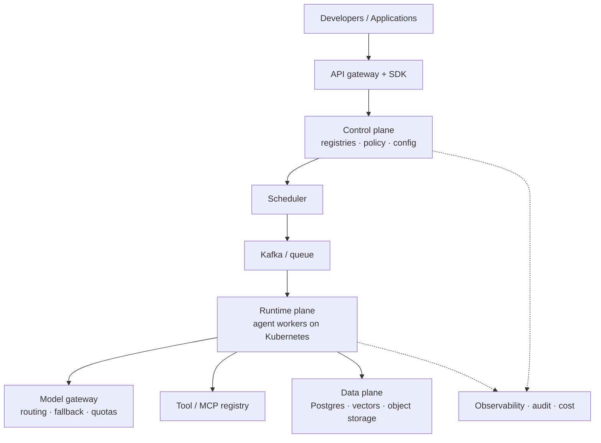

# Phase 7 — AI Platform Engineering

An AI platform is the layer that lets many teams build, ship, and operate AI features without each one reinventing registries, gateways, secrets, tenancy, and deployments. It is the difference between "we have an agent in a notebook" and "we have a hundred agents in production with budgets, permissions, and rollbacks."

This phase is about that control plane: what the platform owns, how it runs on Kubernetes, how it ships through CI/CD, and how it sits on AWS. It is the phase that turns AI engineering into a product other engineers can use.

## What you will be able to do

By the end of this phase you should be able to:

- Explain platform engineering and internal developer platforms, and design an AI platform's control, data, and runtime planes.
- Operate the registries: agents, models, tools, MCP servers, prompts, evaluations, and datasets.
- Version and deploy agents, models, and prompts safely.
- Build a model gateway with routing, provider abstraction, fallback, and load balancing.
- Enforce token quotas and cost budgets, and manage API keys and secrets.
- Design multi-tenancy, isolation, RBAC, ABAC, and policy enforcement.
- Use feature flags and configuration management.
- Containerise services with Docker, and deploy to Kubernetes (workloads, networking, autoscaling, resource limits).
- Manage infrastructure as code with Terraform and Helm, and ship with GitHub Actions and safe deployment strategies.
- Use the core AWS building blocks: IAM, VPC, EC2, ECS, EKS, Lambda, S3, RDS, ElastiCache, SQS, SNS, Bedrock, CloudWatch, Secrets Manager, and API Gateway.

## The platform, in one picture

Three planes, one rule: **the control plane decides what may run; the runtime plane does the work; the data plane remembers.** Everything else in this phase is a detail of one of those boxes.

## Topic order

1. [Platform engineering fundamentals](01-platform-engineering-fundamentals.md) — platforms and internal developer platforms.
2. [AI platform architecture](02-ai-platform-architecture.md) — control, data, and runtime planes.
3. [Registries: agents, models, tools, and MCP](03-registries-agents-models-tools-mcp.md) — what the platform knows how to run.
4. [Registries: prompts, evaluations, and datasets](04-registries-prompts-evaluations-datasets.md) — the artefacts that define behaviour.
5. [Versioning and deployment](05-versioning-and-deployment.md) — agents, models, and prompts.
6. [Model gateway and routing](06-model-gateway-and-routing.md) — one API in front of many providers.
7. [Token quotas and cost budgets](07-token-quotas-and-cost-budgets.md) — making spend predictable.
8. [API keys and secrets management](08-api-keys-and-secrets-management.md) — credentials done properly.
9. [Multi-tenancy and authorization](09-multi-tenancy-and-authorization.md) — isolation, RBAC, ABAC, policy.
10. [Feature flags and configuration](10-feature-flags-and-configuration.md) — changing behaviour without deploying.
11. [Docker and Docker Compose](11-docker-and-docker-compose.md) — packaging a service.
12. [Kubernetes core](12-kubernetes-core.md) — pods, deployments, services, config, secrets.
13. [Kubernetes workloads](13-kubernetes-workloads.md) — jobs, CronJobs, StatefulSets.
14. [Kubernetes networking and scaling](14-kubernetes-networking-and-scaling.md) — ingress, resource limits, HPA, autoscaling.
15. [Infrastructure as code: Terraform and Helm](15-infrastructure-as-code-terraform-and-helm.md) — reproducible infrastructure.
16. [CI/CD with GitHub Actions](16-cicd-with-github-actions.md) — automated build, test, and deploy.
17. [Deployment strategies](17-deployment-strategies.md) — blue-green, canary, rollbacks.
18. [AWS fundamentals, IAM, and VPC](18-aws-fundamentals-iam-and-vpc.md) — the account, permissions, and network.
19. [AWS compute](19-aws-compute.md) — EC2, ECS, EKS, Lambda.
20. [AWS storage and databases](20-aws-storage-and-databases.md) — S3, RDS, ElastiCache.
21. [AWS messaging and AI](21-aws-messaging-and-ai.md) — SQS, SNS, Bedrock.
22. [AWS operations](22-aws-operations.md) — CloudWatch, Secrets Manager, API Gateway.

> **How to study this phase.** For every component, ask: who owns it, how is it versioned, how is it secured, how does it fail, and how do you roll it back? A platform is judged by those five answers, not by its feature list.
