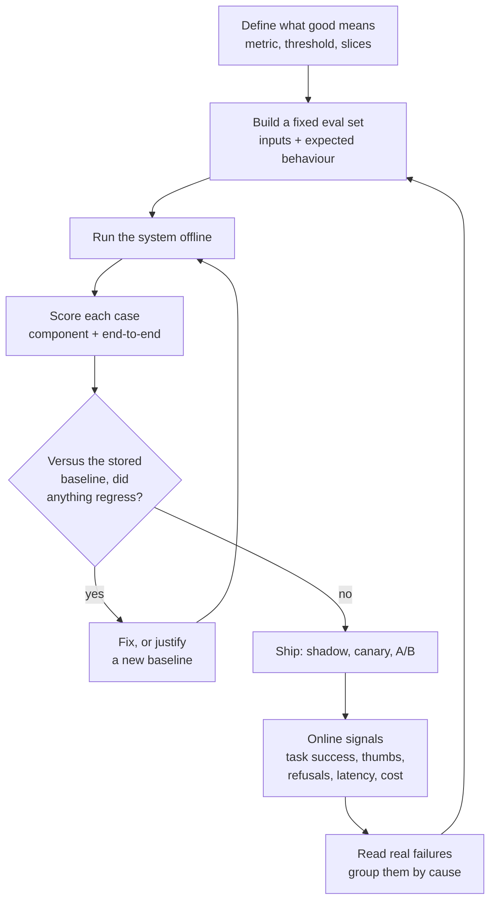
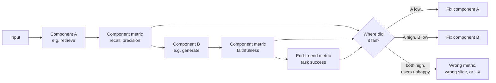

# AI Evaluation Fundamentals

> **Interview answer (say this first).** Evaluation is how you turn "it feels better" into a number you can trust. Model outputs are non-deterministic and a prompt change can fix one case while breaking ten others, so you keep a fixed set of inputs with expected behaviour, score every run with clear metrics, and compare against a stored baseline. You evaluate **offline** before release to catch regressions, and **online** after release to learn what offline missed. You evaluate **components** to find *where* a failure happens and **end-to-end** to know *whether* the system works. Every confirmed failure becomes a permanent test case, so the loop improves the system instead of letting it drift.

## Why this exists

The demo works. A stakeholder tries it, nods, and says "that looks better." That sentence is the problem. "Better" is not evidence. You cannot compare two prompts by memory when each one answers differently every time you run it.

Four things go wrong without measurement:

- Someone swaps the model. Answers get slightly worse. Nobody can prove it, so the change stays.
- Someone edits the prompt. The tone improves and three factual questions now fail.
- The index is rebuilt. Retrieval recall drops silently.
- A user asks something the system cannot answer. It invents a confident reply, and the first time anyone notices is in a support ticket.

Every one of these is invisible to a demo. A demo proves that one happy path worked once. It says nothing about the next thousand requests, or the request that broke because a document was reformatted.

The deeper reason evaluation exists is **decision-making under non-determinism**. Language models sample. The same input can produce different outputs. Agents add another layer: tool calls, retries, and loops make the same run take different paths. When the system is not deterministic, "I tried it and it worked" is a sample of size one. You need a repeatable measurement before you can make a release decision.

The second reason is **attribution**. When an answer is wrong you have several suspects:

- **Retrieval** never put the evidence in the context.
- **Generation** had the evidence and ignored it.
- **The prompt** asked for the wrong thing.
- **The model** is simply not capable of this task.
- **The agent** took the wrong path and called the wrong tools.

These have different fixes, different owners, and different costs. Evaluation exists to answer one question fast: *which part failed, and by how much?*

> **Note:**
>
> **The one-sentence purpose.** Evaluation replaces opinion with a repeatable number, and turns one vague "it is wrong" into a specific failing stage.

## Start from zero

| Word | Plain meaning |
| --- | --- |
| **Evaluation** | Running a system on known inputs and measuring the outputs against expected behaviour. |
| **Eval set** (evaluation set) | The saved collection of inputs and expected behaviour used for evaluation runs. |
| **Golden set** | An eval set whose labels were checked by a human and are trusted as the reference truth. |
| **Metric** | A formula that turns outputs into a number, such as accuracy or recall. |
| **Ground truth** | The correct answer or correct behaviour for a case, agreed before the run. |
| **Offline evaluation** | Running against a fixed saved set. Fast, cheap, repeatable, done before release. |
| **Online evaluation** | Measuring real traffic in production. The truth, but slow and noisy. |
| **Component evaluation** | Scoring one stage alone, such as the retriever or the generator. |
| **End-to-end evaluation** | Scoring the whole system from input to final user-facing output. |
| **Regression** | A change that makes something that used to work stop working. |
| **Regression suite** | The eval set run automatically on every change to catch regressions. |
| **Baseline** | The stored result from a known-good run that later runs are compared to. |
| **Gate** | A threshold in the build pipeline. Drop below it and the build fails. |
| **Held-out set** | Data you never tune on, so the final number stays honest. |
| **Leakage** | Test data (or its answers) accidentally influencing the system before evaluation. |
| **Overfitting** | Improving on the eval set without improving on the real task. |
| **Slice** | A subgroup of the eval set, such as multi-step questions or one customer. |
| **Judge** | A scorer. It can be code (deterministic) or a model (an LLM-as-judge). |
| **Deterministic check** | A rule-based score, such as exact match or a JSON validity check. |
| **Error analysis** | Reading real failures by hand and grouping them into causes. |

Two distinctions do most of the work:

- **Offline tells you whether to ship. Online tells you whether shipping helped.** Offline is controlled and fast and can measure the wrong thing. Online is real and slow and noisy.
- **Components tell you where. End-to-end tells you whether.** A single end-to-end number without component numbers leaves you guessing which stage broke.

## The core idea

Think about how a serious kitchen tests a recipe. Tasting one spoonful and saying "tasty" is not testing. The kitchen writes down the dish, the expected taste, the cooking time, and the cost. It cooks the same dish again next week and compares. When a dish fails, the chef checks each step: was the ingredient fresh, was the heat right, was the timing correct? The dish is judged end-to-end, and each step is judged on its own.

Evaluation is a feedback loop with two halves that feed each other:



The arrow from production back into the eval set is what makes the system improve. Every real failure becomes a permanent test, so the same bug cannot quietly return.

Inside a run you measure at more than one point. This split is the part interviewers care about most, because it gives attribution:



A useful way to hold the whole thing in your head: **evaluation is a scale, not a vote.** It measures a fixed object against a fixed unit. If you change the object (the prompt) and the unit (the metric) at the same time, the number means nothing.

Deployment is a series of cheaper and cheaper places to catch a problem: offline eval in CI costs minutes, shadow costs no user exposure, a canary costs a small exposure, and an A/B test costs real traffic. Catching a regression in production costs trust.

## How it works

1. **Define what "good" means before you build anything.** Choose the metrics, the thresholds, and the slices you care about. Metrics chosen after seeing results measure what you built, not what you wanted.

2. **Write down the unit of evaluation.** For a RAG system it is a question with relevant documents and a reference answer. For an agent it is a task with an end state and expected tool calls. Fixing the unit keeps runs comparable.

3. **Build a small eval set first.** Twenty to fifty carefully chosen cases beat a thousand random ones. Include easy cases, hard cases, edge cases, and cases the system should refuse.

4. **Score deterministically where you can.** Exact match, regex, JSON validity, and numeric tolerance are cheap and never drift. Use them before reaching for a model judge. (Chapter 5 goes deep on this.)

5. **Score with a model only where you must.** Open-ended answers need judgement for faithfulness, relevance, or tone. A model judge is scalable but biased, so pin its version and spot-check it. (Chapter 6 covers judges.)

6. **Evaluate components separately.** Run the retriever alone on labelled queries. Run the generator with a fixed context. A fixed input at each stage makes that stage's number meaningful.

7. **Evaluate end-to-end on the same run.** This catches integration bugs that component tests cannot see, such as a context builder that drops the best chunk.

8. **Repeat runs to see the spread.** Because outputs vary, run the whole set several times and report the mean and the spread. One run is one sample. A single good run is not evidence of a good system.

9. **Store the results as a baseline.** Save the metrics and the raw outputs from a known-good run. This gives "regression" a concrete meaning: worse than this saved snapshot.

10. **Put the suite in CI behind a gate.** Re-run it on changes to prompts, models, tools, chunking, or parsing. Fail the build when a metric falls below its threshold or the worst slice falls too far.

11. **Ship carefully, then measure online.** Use shadow, canary, or A/B to limit blast radius. Watch task success, refusals, latency, cost, and escalation to a human.

12. **Do error analysis and feed it back.** Read real failures by hand, group them into causes, and add each confirmed bug as a new case. This is the step that finds the failure no metric was written for.

A rule worth memorising: **gate on the metric plus the worst slice.** A change that raises the average while destroying one important slice is not an improvement.

## The syntax you will use

Real production forms, from a single case to a CI gate.

**One evaluation case as data.** Keep the input, the expected behaviour, and the metadata together. A dataclass is enough to start.

```python
from dataclasses import dataclass, field

@dataclass
class Case:
    case_id: str
    input: str
    expected: str
    slice: str = "default"          # e.g. "lookup", "multi_hop", "refusal"
    tags: list[str] = field(default_factory=list)
```

**Storing the set as JSONL.** One case per line, so it is easy to diff, review, and stream: `{"case_id": "c1", "input": "What is the refund window?", "expected": "30 days", "slice": "lookup"}`.

**A metric function.** It takes one case and one output and returns a number in a fixed range. Keeping metrics small makes them testable.

```python
def exact_match(case: Case, output: str) -> float:
    return float(output.strip().lower() == case.expected.strip().lower())
```

**A runner that records every row.** Rows are the raw material for both summary metrics and error analysis.

```python
def run(cases: list[Case], system) -> list[dict]:
    rows = []
    for case in cases:
        output = system(case.input)
        rows.append({
            "case_id": case.case_id,
            "slice": case.slice,
            "input": case.input,
            "output": output,
            "score": exact_match(case, output),
        })
    return rows
```

**A summary over all cases and per slice.** Report both. The average hides the slice that failed.

```python
from statistics import mean

def summarize(rows: list[dict]) -> dict:
    overall = mean(r["score"] for r in rows)
    by_slice = {}
    for s in sorted({r["slice"] for r in rows}):
        by_slice[s] = mean(r["score"] for r in rows if r["slice"] == s)
    return {"overall": overall, "slices": by_slice}
```

**Pinning the system under test.** A version string makes runs comparable. Without it, a silent model upgrade looks like a regression.

```python
CONFIG = {
    "model": "gpt-4o-2024-08-06",     # pin the dated snapshot, not "latest"
    "prompt_version": "qa-prompt-v7",
    "temperature": 0.0,
    "retriever": "hybrid-bge-m3",
}
```

**A gate expressed as an assertion.** `pytest` and the build pipeline both understand this.

```python
def gate(summary: dict, thresholds: dict[str, float]) -> list[str]:
    failures = []
    for metric, threshold in thresholds.items():
        value = summary["overall"] if metric == "overall" else summary["slices"][metric]
        if value < threshold:
            failures.append(f"{metric}={value:.2f} < {threshold}")
    return failures
```

**A judge prompt shape.** Ask for a small fixed set of labels and a reason, so the score is auditable: `Return JSON {"label": "supported"|"unsupported", "reason": "..."}. Judge only the context below; do not use outside knowledge. Context: {context} Answer: {answer}`.

**A pytest wrapper.** Mark the full suite slow and run the fast subset on every commit.

```python
def test_quality_gate(summary):
    failures = gate(summary, {"overall": 0.85, "refusal": 0.90})
    assert not failures, f"quality gate failed: {failures}"
```

## Examples: simple to real

**Example 1 — the smallest useful evaluation.**

Three cases, one rule, one number:

```python
def exact_match(prediction: str, gold: str) -> float:
    return float(prediction.strip().lower() == gold.strip().lower())

cases = [("Paris", "Paris"), ("paris", "Paris"), ("Lyon", "Paris")]
score = sum(exact_match(p, g) for p, g in cases) / len(cases)
print(round(score, 3))          # 0.667
```

It already catches the worst failure: the system returns the wrong city. Ten lines of code, no framework.

**Example 2 — a summary that reports slices, not just an average.**

Five cases across three slices:

```python
from statistics import mean

rows = [
    {"slice": "lookup", "score": 1.0},
    {"slice": "lookup", "score": 1.0},
    {"slice": "multi_hop", "score": 0.0},
    {"slice": "multi_hop", "score": 1.0},
    {"slice": "refusal", "score": 1.0},
]

overall = mean(r["score"] for r in rows)
by_slice = {s: mean(r["score"] for r in rows if r["slice"] == s)
            for s in sorted({r["slice"] for r in rows})}
print(round(overall, 3))        # 0.8
print({k: round(v, 3) for k, v in by_slice.items()})
# {'lookup': 1.0, 'multi_hop': 0.5, 'refusal': 1.0}
```

The overall `0.8` looks fine. The `multi_hop` slice is `0.5`, and that is the actual bug. An average-only dashboard would hide it.

**Example 3 — one run is one sample.**

Because outputs vary, a small set swings a lot between runs. The spread is not the system changing; it is sampling noise.

```python
import random

def noisy_score(seed: int) -> float:
    rng = random.Random(seed)
    return sum(rng.random() < 0.7 for _ in range(5)) / 5

scores = [noisy_score(s) for s in range(4)]
print(scores)                              # [0.6, 0.6, 0.4, 1.0]
print(round(max(scores) - min(scores), 2))  # 0.6
```

A `0.6` gap from sampling alone on five cases. This is why you report a mean with a spread, and why a one-point difference on a tiny set is usually noise.

**Example 4 — component metrics find the failing stage.**

The end-to-end answer is wrong. The component numbers say which stage to fix.

```python
import re

def recall_at_k(retrieved: list[str], relevant: set[str], k: int) -> float:
    if not relevant:
        return 0.0
    return len(set(retrieved[:k]) & relevant) / len(relevant)

def numbers(text: str) -> set[str]:
    return set(re.findall(r"\d+", text))

retrieved = ["d1", "d2", "d3"]              # the retriever did its job
relevant = {"d1"}
context = "Refunds are available for 30 days."
answer = "Refunds are available for 90 days."

recall = recall_at_k(retrieved, relevant, k=3)
unsupported = numbers(answer) - numbers(context)
print(recall)                # 1.0
print(unsupported)           # {'90'}
```

Recall is `1.0`, so retrieval is fine. The answer contains `90`, which is not in the context. This is a **generation** fault: fix the prompt or the model, not the index. Without the component number, both stages look like "the AI is wrong".

**Example 5 — tuning on the test set inflates the score.**

This is leakage in its most common form. You try many configurations, keep the best score on your test set, and then believe that score. It is the maximum of many noisy draws, so it is optimistic.

```python
import random
from statistics import mean

rng = random.Random(7)
true_quality = [0.50 + 0.01 * i for i in range(20)]     # 20 configs, 0.50..0.69

def observed(q: float) -> float:
    return q + rng.gauss(0, 0.10)                        # small-set noise

visible = [observed(q) for q in true_quality]
winner = max(range(len(visible)), key=lambda i: visible[i])

held_out = [observed(true_quality[winner]) for _ in range(5)]
print(winner, round(visible[winner], 3))                 # 13 0.716
print(round(mean(held_out), 3))                          # 0.639
```

Config 13 truly scores `0.63`, but its lucky test run showed `0.716`. The fresh held-out estimate is `0.639`, close to the truth. Picking the winner on the test set handed you an inflated number. The fix is to keep a held-out set you never select on.

**Example 6 — where evaluation fits in deployment.**

A gate blocks the release. Shadow and canary limit the blast radius when it passes. Online signals are the ground truth the offline set was trying to predict.

```python
def gate(summary: dict, thresholds: dict[str, float]) -> list[str]:
    return [f"{m}={summary[m]:.2f} < {t}"
            for m, t in thresholds.items() if summary[m] < t]

summary = {"correctness": 0.82, "refusal": 0.60}
print(gate(summary, {"correctness": 0.85, "refusal": 0.90}))
# ['correctness=0.82 < 0.85', 'refusal=0.60 < 0.9']
```

Two failures, both actionable. The build fails, the merge is blocked, and the failure names the metrics to fix. Compare this with "it felt a bit worse", which produces no action at all.

| Stage | Cost to catch a bug here | What it cannot tell you |
| --- | --- | --- |
| Offline eval in CI | Minutes | Whether real users are served |
| Shadow | Low, no users affected | User reaction to the new output |
| Canary | Small exposure | Whether the change is actually better |
| A/B test | Real traffic split | Subtle long-term effects |
| Online monitoring | After the fact | Which stage failed |

## In production

- **Build the eval set before you need it.** The best time to write 30 cases is while building the feature, when you still remember what users ask. Retrofitting an eval set is slow and political.
- **Fix the unit of evaluation early.** Changing what a case means breaks every historical number. Freeze the schema, version it, and migrate deliberately.
- **Prefer deterministic checks first.** Exact match, regex, schema validity, and numeric tolerance never drift and cost almost nothing. Use a model judge only for what rules cannot express.
- **Pin everything the number depends on.** Model snapshot, prompt version, temperature, retriever, eval set version, and judge version. An unpinned run is not a measurement.
- **Report the spread, not just the mean.** Run the set several times and include a confidence interval. A one-point difference on 20 cases is usually noise.
- **Gate on the worst slice.** A change that improves the average while destroying multi-hop questions is a regression dressed up as a win.
- **Keep the fast gate fast.** A ten-minute suite on every commit gets bypassed. Split a small fast suite for every change and a full suite nightly.
- **Treat a model judge as a noisy instrument.** It has biases (position, length, self-preference) and it changes when the provider updates it. Pin its version and calibrate it against human labels.
- **Save raw outputs, not just scores.** A metric without the failing text cannot be debugged. Store the input, output, retrieved IDs, and config for every row.
- **Do error analysis on a schedule.** Read 20–50 real failures by hand and group them. This is where you find the failure mode no metric covers.
- **Feed production failures back into the set.** Every confirmed bug becomes a permanent case. Version the set like code and note why each case was added.
- **Watch cost and latency as first-class metrics.** A change that raises quality and doubles p95 latency may still be a regression.

## Interview questions

### 1. Why can't you just try the system and judge by feel?

**Answer.** Because the system is non-deterministic and the failure surface is large. One trial is a sample of size one; the same input can produce a different output next time, and a prompt change can fix one case while breaking others. "Feels better" cannot be reproduced, cannot be compared across versions, and cannot be put in a build pipeline. Evaluation replaces it with a fixed set, a clear metric, and a stored baseline.

**Follow-up: "Is evaluation always worth the cost?"** Almost always, but scale it. A throwaway prototype needs a handful of examples, not a platform. The cost that matters is the cost of shipping a silent regression to users.

**Trap.** Running one prompt variant, seeing a better answer, and declaring victory. That single good output is the reason demos are untrustworthy.

### 2. Offline versus online evaluation: what does each give you?

**Answer.** Offline is fast, cheap, reproducible, and safe; it is how you catch regressions before release and how you attribute failures to a stage. Online is the real distribution, real phrasing, and real consequences; it is how you learn what offline missed. Offline cannot tell you whether users are satisfied. Online is too slow and noisy to catch a subtle regression before release. Use offline to decide whether to ship, and online to confirm that shipping helped.

**Follow-up: "How do you connect them?"** Feed production failures back into the offline set, and use offline metrics to predict online signals. If offline improves but online signals stay flat, your eval set is measuring the wrong thing.

**Trap.** Treating a thumbs-up rate as a precise metric. It is noisy, biased toward vocal users, and driven by factors beyond answer quality.

### 3. What is the difference between component and end-to-end evaluation?

**Answer.** Component evaluation tests one stage in isolation, such as the retriever against labelled relevant documents or the generator against a fixed context. It gives fast, attributable feedback. End-to-end evaluation runs the whole system and measures the user-facing outcome. Component scores tell you *where* the problem is; end-to-end tells you *whether* the system works. You need both.

**Follow-up: "Why not just do end-to-end?"** Because a bad end-to-end number does not tell you which of several stages broke. Without component metrics you debug by guessing and usually start editing the prompt, which is the slowest thing to change and often the wrong layer.

**Trap.** Testing components with hand-picked clean inputs and declaring victory, then being surprised when the assembled system fails on real data.

### 4. How much evaluation data do you need?

**Answer.** Enough that the metric is stable for the decision you want to make. A mean over 20 cases can swing several points from noise alone. Compute a confidence interval and size the set so the interval is narrow enough to detect the effect you care about. For per-slice decisions you need enough cases inside each slice, not just overall.

**Follow-up: "What is the cheapest way to get more cases?"** Harvest real queries and review labels in batches, and add every confirmed production failure as a permanent case. Both grow the set while keeping it realistic.

**Trap.** Reporting a mean with no uncertainty and treating a one-point difference as real.

### 5. What are the most common evaluation mistakes?

**Answer.** No eval set, so every judgement is anecdotal. An unclear metric that two people would score differently. Evaluating with a different model, prompt, or temperature than production. Leakage, where test cases or their answers influenced development. And tuning on the test set until it improves, which destroys the held-out number. A related mistake is a single average with no slices and no raw outputs, which hides the failures that matter.

**Follow-up: "Which mistake is the most damaging?"** Leakage, because it silently makes every number optimistic and nobody notices until production.

**Trap.** Choosing metrics after seeing results. That measures what you built instead of what you wanted.

### 6. Where does evaluation fit in the deployment pipeline?

**Answer.** Offline evaluation runs in CI as a gate: a regression below threshold fails the build. When it passes, shadow runs the new version on real requests without showing users, then a canary sends a small share of traffic, then an A/B test compares outcomes. Full production follows, with online monitoring for task success, refusals, latency, and cost. Each stage is a cheaper place to catch a problem than the next.

**Follow-up: "Why shadow before canary?"** Shadow has zero user exposure and still exercises the full path, so it catches crashes, timeouts, and cost blowups without risking an answer to a user.

**Trap.** Skipping straight to 100% rollout because the offline number improved. Offline gates reduce risk; they do not remove it.

### 7. How do you evaluate something open-ended, like a summary or a chat reply?

**Answer.** Decompose it. Score the parts that are objective with rules: does the summary contain the key numbers, are all citations real, is the JSON valid, is it within a length limit. Score the rest with a rubric and a model judge, and calibrate the judge against a sample of human labels. For comparisons, use pairwise judging, which is more reliable than absolute scoring. Always keep a small human-checked slice as the anchor.

**Follow-up: "What is the risk of a rubric?"** If the rubric is vague, the judge fills the gap with its own preferences. Rubrics must define the failure, not just the ideal answer.

**Trap.** Trusting a judge score without ever checking it against human labels. An uncalibrated judge is an opinion with a number attached.

### 8. How does evaluation change once you add agents?

**Answer.** An agent has many steps and many valid paths, so you cannot only score the final answer. You also score the **trajectory**: which tools were called, in what order, with what arguments, and whether side effects were correct. End-state checks confirm the job got done; tool-call checks confirm it was done safely and efficiently. You also need budgets on steps and loops, because an agent can succeed slowly or loop forever.

**Follow-up: "What makes agent evaluation flakier than LLM evaluation?"** Tool timeouts, retries, and non-deterministic paths mean two runs of the same task can take different routes. You often need to run each task several times and measure success rate rather than a single pass or fail.

**Trap.** Scoring only the final answer, then shipping an agent that achieves the goal by calling a destructive tool it should never have touched.

## Remember this

- **"Feels better" is not evidence.** A fixed eval set, a clear metric, and a stored baseline turn opinion into a decision.
- **Non-determinism means one run is one sample.** Run the set several times and report the spread, not a single number.
- **Components for attribution, end-to-end for truth.** The split is what tells you whether to fix retrieval, generation, or the prompt.
- **Offline decides whether to ship; online confirms whether it helped.** Feed production failures back into the set.
- **Gate on the worst slice, not just the average.** A change that hides a broken slice behind a better mean is a regression.
