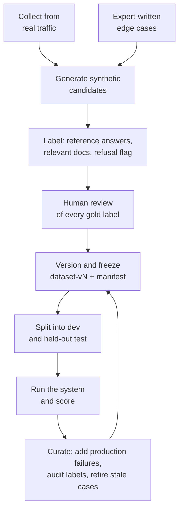

# Evaluation Datasets and Golden Sets

> **Interview answer (say this first).** An evaluation dataset is a versioned, labelled collection of inputs plus the expected behaviour, and it is the single most valuable asset in an AI project. A **golden set** is the human-checked subset you trust as ground truth; an **evaluation set** is the wider working set; a **regression set** is the permanent set of past failures you never remove. Cases come from real traffic, reviewed synthetic generation, and expert-written edge cases. You label them, check coverage and representativeness, scrub PII, version the whole thing like code, keep a held-out split you never tune on, and curate it on a schedule. A system is only as good as the set you measure it against.

## Why this exists

You can build the best evaluation harness in the world, and it will still measure nothing if the data underneath it is wrong. Three failures show up again and again:

- **The set is too easy.** It is full of clean, well-formed questions generated from the documents themselves. The system scores 95% and fails on the first real user with a typo and three acronyms.
- **The set is too small.** Twenty cases swing several points from sampling noise. Every release looks like a coin flip.
- **The set leaks.** Cases from the test split were used as few-shot examples, or the answer key was in the context. The number is optimistic and nobody notices until production.

A fourth failure is more subtle: **the set goes stale.** The product changes, the documents change, users change how they ask, and the old cases stop predicting anything. A set is not a file you write once; it is a living thing with owners, versions, and a review cadence.

The reason this matters more for AI than for ordinary software is that the input space has no natural boundary. An ordinary function has a fixed signature with a few typed parameters. A language model accepts any text a human can write. You cannot enumerate the input space, so you sample it. The quality of that sample *is* the quality of your measurement.

> **Note:**
>
> **The one-sentence purpose.** The dataset is the measuring instrument. A miscalibrated instrument gives confident, precise, wrong numbers.

## Start from zero

| Word | Plain meaning |
| --- | --- |
| **Evaluation dataset** | A versioned collection of inputs plus expected behaviour, used to score a system. |
| **Golden set** | The human-verified subset whose labels are trusted as ground truth. |
| **Evaluation set** | The full working set used for regular runs. May contain golden plus unverified cases. |
| **Regression set** | Cases from past confirmed failures. Kept forever so a fixed bug cannot return. |
| **Dev set** | The split you iterate on. You are allowed to look at it and tune against it. |
| **Test set (held-out)** | The split you never tune on, reserved for the final honest number. |
| **Case** | One row: an input, its labels, and metadata such as slice and difficulty. |
| **Label** | The expected behaviour: a reference answer, relevant document IDs, or a rubric score. |
| **Gold label** | A label a human has checked and approved. |
| **Rubric** | A written description of what a good and a bad output look like, used by a judge. |
| **Annotator** | The person who writes or verifies labels. Also called a labeller or rater. |
| **Inter-annotator agreement** | How often two annotators give the same label. Low agreement means the task is unclear. |
| **Reference answer** | A model answer the system's output is compared against. |
| **Accepted answers** | The set of answers that count as correct, so paraphrases are not punished. |
| **Synthetic data** | Cases generated by a model rather than collected from users. Must be reviewed. |
| **Coverage** | Whether the set includes every important kind of input. |
| **Representativeness** | Whether the mix of cases matches the real distribution of traffic. |
| **Stratification** | Splitting or reporting per slice so no subgroup is swamped by the majority. |
| **PII** | Personally identifiable information: names, emails, phone numbers, card numbers. |
| **De-identification** | Replacing or removing PII so the set can be stored and shared safely. |
| **Dataset version** | A frozen snapshot with an ID, so a metric can be tied to the data that produced it. |
| **Leakage** | Test data or its answers influencing the system before evaluation. |
| **Overfitting to the set** | Improving the eval score without improving on the real task. |
| **Drift** | The world moving under you, so old cases stop predicting new traffic. |

Two distinctions to lock in early:

- **Golden is not the same as huge.** A golden set is a small, trusted set. Size and trust are different axes.
- **Dev and test are not interchangeable.** You tune on dev. The moment you tune on test, it is just another dev set.

## The core idea

Think of a driving test. You do not pass by driving around the block once on a sunny day. The examiner uses a route that covers the skills on the syllabus: junctions, parking, a hill start, a dual carriageway. The route is written down, the marking criteria are written down, and you cannot see the sheet you are being marked against beforehand. When the syllabus changes, the route is updated.

An evaluation dataset is that route plus that marking sheet. Three things make it work: it **covers the syllabus**, it has a **trusted answer key**, and it is **kept separate from practice**.

A dataset is not a file. It is a lifecycle:



The feedback arrow is the point. A dataset that only ever grows from synthetic generation becomes a fiction. A dataset that absorbs real failures becomes a better and better predictor of production.

Two more views help. First, the difference between the three named sets:

| Set | Size | Trust | Changes | Used for |
| --- | --- | --- | --- | --- |
| **Golden set** | Small (tens) | Highest, human-verified | Rarely | Final gate and judge calibration |
| **Evaluation set** | Medium (hundreds) | Mixed, mostly verified | Regularly | Routine runs and slices |
| **Regression set** | Grows forever | High, each case is a confirmed bug | Append-only | Catching known regressions |

Second, where cases come from. Four sources feed the set: real traffic (realistic and messy), reviewed synthetic questions (cheap coverage), expert-written edge cases (rare and important), and past incidents (confirmed failures). The mix is a team choice, not a law. The principle is: **do not let one source fill the set.**

## How it works

1. **Define the case schema before you collect.** Decide what a row contains: input, reference answer, relevant document IDs, expected tool calls, a refusal flag, a slice tag, and provenance. A schema agreed up front saves a painful migration later.

2. **Collect candidates from several sources.** Pull real requests from logs and support tickets, generate synthetic questions from your documents, ask domain experts for the cases users never report, and add every past incident.

3. **Deduplicate before labelling.** Near-duplicates inflate the score of the pattern they encode and waste labelling effort. Normalise the text and collapse matches.

4. **Label every case, then review the labels.** Store the expected behaviour. Have a second person check a sample and measure agreement. Low agreement means the task or the rubric is ambiguous, not that the annotators are careless.

5. **Scrub PII before storage.** Replace emails, phone numbers, card numbers, and names. Use synthetic identifiers where a case needs a specific value. Keep the scrub report so you can prove what was removed.

6. **Check coverage and representativeness.** Count cases per slice and compare the mix to real traffic. A set that is 90% easy lookups will look great and predict nothing.

7. **Split into dev and test.** Keep a held-out test split you never tune on. If the set is small, at least keep a private set that is used rarely and only for final numbers.

8. **Version the set like code.** Freeze a snapshot with an ID and a manifest. Every reported metric must name the dataset version that produced it.

9. **Run the suite and report per slice.** The overall mean hides small important slices. Report the mean, the spread, and the worst slice.

10. **Add every production failure as a permanent case.** A confirmed bug that is not in the set will come back. Append it to the regression set with a note about the cause.

11. **Audit labels on a schedule.** Re-read a sample every quarter or after a product change. Retire cases that no longer reflect the product, and say why in the commit.

12. **Watch for drift and overfitting.** If offline scores keep rising while online signals stay flat, the system is learning the set's quirks. Refresh with new real cases.

A rule worth keeping: **every case should be able to fail.** If no realistic change could make it fail, it is not measuring anything.

## The syntax you will use

Real production forms, from a case schema to a leakage check.

**A labelled case as data.** Keep the labels next to the input so a run is self-contained.

```python
from dataclasses import dataclass, field

@dataclass
class EvalCase:
    case_id: str
    input: str
    reference: str                      # the expected answer, or "" for refusals
    relevant: list[str] = field(default_factory=list)   # gold document IDs
    must_refuse: bool = False
    slice: str = "default"
    source: str = "unknown"             # traffic | synthetic | expert | incident
```

**The dataset as JSONL with a manifest.** One case per line, plus a `manifest.json` that pins the version and hash: `{"version": "v7", "count": 412, "sha256": "...", "created": "..."}`.

**A stratified dev/test split.** Keep the slice proportions in both halves so the test number means the same thing as the dev number.

```python
import random

def stratified_split(cases: list[dict], test_fraction: float = 0.3, seed: int = 0):
    rng = random.Random(seed)
    by_slice: dict[str, list[dict]] = {}
    for c in cases:
        by_slice.setdefault(c["slice"], []).append(c)
    dev, test = [], []
    for s in sorted(by_slice):
        group = sorted(by_slice[s], key=lambda c: c["case_id"])
        rng.shuffle(group)
        cut = round(len(group) * test_fraction)
        test.extend(group[:cut])
        dev.extend(group[cut:])
    return dev, test
```

**A coverage report.** Count the slice mix and compare it to traffic: `dict(sorted(Counter(c["slice"] for c in cases).items()))`.

**A near-duplicate check.** Normalise case, punctuation, and whitespace first: `re.sub(r"\s+", " ", re.sub(r"[^\w\s]", "", text.lower())).strip()`. Then compare the normalised strings.

**A PII scrubber with a report.** Card patterns first, then email, then phone, so one pattern does not eat another's digits.

```python
import re

PII_PATTERNS = {
    "CARD": r"\b\d{4}[ -]?\d{4}[ -]?\d{4}[ -]?\d{4}\b",
    "EMAIL": r"[\w.+-]+@[\w-]+\.[\w.]+",
    "PHONE": r"\+?\d[\d\s-]{7,}\d",
}

def scrub(text: str) -> tuple[str, dict[str, int]]:
    found: dict[str, int] = {}
    for label, pattern in PII_PATTERNS.items():
        hits = re.findall(pattern, text)
        if hits:
            found[label] = len(hits)
        text = re.sub(pattern, f"[{label}]", text)
    return text, found
```

**A leakage check.** Compare normalised few-shot examples against the test split before every release: `{i for i in test_inputs if normalize(i) in {normalize(e) for e in prompt_examples}}`.

**A synthetic-question prompt.** Ask for the supporting evidence so a reviewer can check the label cheaply, and ask for one unanswerable question: `Read the document. Write 3 questions users might ask that it answers, and 1 it does NOT answer. For each, quote the supporting sentence(s). Label the unanswerable one. Document: {chunk}`.

## Examples: simple to real

**Example 1 — build a tiny golden set and read its coverage.**

Six cases across three slices, with one refusal:

```python
from collections import Counter

cases = [
    {"case_id": "c1", "slice": "lookup", "must_refuse": False},
    {"case_id": "c2", "slice": "lookup", "must_refuse": False},
    {"case_id": "c3", "slice": "multi_hop", "must_refuse": False},
    {"case_id": "c4", "slice": "multi_hop", "must_refuse": False},
    {"case_id": "c5", "slice": "refusal", "must_refuse": True},
    {"case_id": "c6", "slice": "refusal", "must_refuse": True},
]
print(dict(sorted(Counter(c["slice"] for c in cases).items())))
# {'lookup': 2, 'multi_hop': 2, 'refusal': 2}
print(sum(c["must_refuse"] for c in cases))   # 2
```

Balanced on purpose for the example. In production you weight by how often each slice appears in real traffic.

**Example 2 — a stratified split keeps the slices honest.**

Split 20 cases into dev and test while preserving slice proportions:

```python
import random

def stratified_split(cases, test_fraction=0.3, seed=0):
    rng = random.Random(seed)
    by_slice = {}
    for c in cases:
        by_slice.setdefault(c["slice"], []).append(c)
    dev, test = [], []
    for s in sorted(by_slice):
        group = sorted(by_slice[s], key=lambda c: c["case_id"])
        rng.shuffle(group)
        cut = round(len(group) * test_fraction)
        test.extend(group[:cut])
        dev.extend(group[cut:])
    return dev, test

cases = [{"case_id": f"c{i:02d}", "slice": "easy" if i % 2 else "hard"}
         for i in range(20)]
dev, test = stratified_split(cases)
print(len(dev), len(test))                                   # 14 6
print(sum(c["slice"] == "hard" for c in test),              # 3
      sum(c["slice"] == "easy" for c in test))               # 3
```

The test split has three of each slice, so a slice-specific regression shows up in both halves. A random split could have put every hard case in dev.

**Example 3 — near-duplicate detection finds wasted labels.**

Two cases ask the same thing with different punctuation:

```python
import re

def normalize(text: str) -> str:
    text = text.lower()
    text = re.sub(r"[^\w\s]", "", text)
    return re.sub(r"\s+", " ", text).strip()

def duplicates(cases: list[dict]) -> list[tuple[str, str]]:
    seen: dict[str, str] = {}
    dups = []
    for c in cases:
        key = normalize(c["input"])
        if key in seen:
            dups.append((seen[key], c["case_id"]))
        else:
            seen[key] = c["case_id"]
    return dups

cases = [
    {"case_id": "c1", "input": "What is the refund window?"},
    {"case_id": "c2", "input": "what is the refund window!!"},
    {"case_id": "c3", "input": "How long is the trial?"},
]
print(duplicates(cases))     # [('c1', 'c2')]
```

`c1` and `c2` are the same case. Collapsing them removes a label, and it removes a double-count that would have made the result look more certain than it is.

**Example 4 — scrub PII before the dataset is stored.**

Emails, phone numbers, and card numbers are replaced, and the report records what was removed:

```python
import re

PII_PATTERNS = {
    "CARD": r"\b\d{4}[ -]?\d{4}[ -]?\d{4}[ -]?\d{4}\b",
    "EMAIL": r"[\w.+-]+@[\w-]+\.[\w.]+",
    "PHONE": r"\+?\d[\d\s-]{7,}\d",
}

def scrub(text: str) -> tuple[str, dict[str, int]]:
    found: dict[str, int] = {}
    for label, pattern in PII_PATTERNS.items():
        hits = re.findall(pattern, text)
        if hits:
            found[label] = len(hits)
        text = re.sub(pattern, f"[{label}]", text)
    return text, found

raw = "Email ada@example.com or call 555 123 4567. Card 4111 1111 1111 1111."
cleaned, report = scrub(raw)
print(cleaned)    # Email [EMAIL] or call [PHONE]. Card [CARD].
print(report)     # {'CARD': 1, 'EMAIL': 1, 'PHONE': 1}
```

Order matters: the card pattern runs first so the phone pattern cannot nibble four digits out of the card number. A real pipeline also handles names, addresses, and account IDs, and stores the report as an audit record.

**Example 5 — a leakage check before release.**

If a few-shot example is also a test case, that test is no longer held out:

```python
import re

def normalize(text: str) -> str:
    text = text.lower()
    text = re.sub(r"[^\w\s]", "", text)
    return re.sub(r"\s+", " ", text).strip()

def leakage(prompt_examples: list[str], test_inputs: list[str]) -> set[str]:
    train = {normalize(e) for e in prompt_examples}
    return {i for i in test_inputs if normalize(i) in train}

prompt_examples = ["What is the refund window?"]
test_inputs = ["What is the refund window?", "How long is the trial?"]
print(leakage(prompt_examples, test_inputs))
# {'What is the refund window?'}
```

One overlapping case. Remove it from the prompt examples, or from the test set, and re-run. Leakage through prompt examples is easy to introduce and invisible unless you check for it deliberately.

**Example 6 — version diffing shows exactly what changed.**

A dataset change should be a reviewable diff, not a silent edit:

```python
def diff(old: list[dict], new: list[dict]) -> dict[str, list[str]]:
    old_map = {c["case_id"]: c for c in old}
    new_map = {c["case_id"]: c for c in new}
    return {
        "added": sorted(new_map.keys() - old_map.keys()),
        "removed": sorted(old_map.keys() - new_map.keys()),
        "changed": sorted(k for k in old_map.keys() & new_map.keys()
                          if old_map[k] != new_map[k]),
    }

old = [{"case_id": "c1", "reference": "30 days"},
       {"case_id": "c2", "reference": "14 days"}]
new = [{"case_id": "c1", "reference": "30 days"},
       {"case_id": "c2", "reference": "30 days"},
       {"case_id": "c3", "reference": "7 days"}]
print(diff(old, new))
# {'added': ['c3'], 'removed': [], 'changed': ['c2']}
```

The diff makes the review questions obvious: why did `c2`'s answer change, and who added `c3`? A metric is meaningless without the set version that produced it, so this diff is part of the release record.

## In production

- **Treat the dataset as a product.** Give it an owner, a version, a changelog, and a review cadence. Shared ownership means nobody maintains it.
- **Start small and real.** Twenty real, labelled cases beat five hundred synthetic ones. Grow the set from production failures, not from a one-off generation sprint.
- **Never let one source fill the set.** Real traffic keeps it honest, synthetic fills gaps fast, experts cover dangerous rare cases, and incidents keep fixed bugs dead.
- **Label with a clear rubric.** Ambiguous labelling produces noisy ground truth, and noisy ground truth makes every metric look flaky. Measure inter-annotator agreement on a sample.
- **Scrub PII at collection time, not later.** A dataset copied into a shared bucket, a notebook, or a prompt is already leaked. Redact on ingest and keep the audit report.
- **Keep a held-out set you genuinely never touch.** If you tune until the test number improves, that number is now a dev number wearing a test badge.
- **Version the set, the baseline, and the judge together.** A metric without all three pins is not reproducible.
- **Recompute the baseline when the set changes.** Adding ten hard cases will move the mean even if the system did not change. That is not a regression; it is a new measuring stick.
- **Watch for overfitting.** Offline scores rising while online signals stay flat means the system is learning the set, not the task.
- **Refresh with real traffic on a schedule.** Question style and documents drift. Retire cases that no longer reflect the product, and record why.
- **Keep the regression set append-only in spirit.** Fixing a bug is not a reason to delete its case. Move it, rename it, but keep the guard.
- **Balance storage against safety.** Real cases are the most valuable and the most sensitive. Store the minimum PII, restrict access, and prefer de-identified text where the case still tests the behaviour.

## Interview questions

### 1. What is the difference between a golden set, an evaluation set, and a regression set?

**Answer.** A golden set is a small, human-verified set whose labels you trust as ground truth; it is used for final gates and to calibrate judges. An evaluation set is the wider working set you run routinely, which may include golden cases plus newer, less-verified ones. A regression set is the append-only collection of past confirmed failures, kept so that a fixed bug cannot quietly return. They overlap, but they have different trust levels and different jobs.

**Follow-up: "Can one case be in all three?"** Yes, and that is normal. A production bug becomes a regression case, gets human-verified into the golden set, and is included in the evaluation set.

**Trap.** Calling any saved list of prompts a "golden set". Golden means human-checked labels, not just a file someone wrote once.

### 2. Where do evaluation cases come from?

**Answer.** Four sources. Real user requests from logs and support tickets, which are the most realistic and the most valuable. Reviewed synthetic questions generated from your documents, which give fast coverage of material users have not asked about yet. Expert-written edge cases, which cover dangerous rare inputs the logs have not reached. And past incidents, which must become permanent cases.

**Follow-up: "What is wrong with purely synthetic cases?"** They are generated from a chunk, so they often reuse the chunk's wording and are easier than real questions. They also miss typos, ambiguity, and multi-step phrasing. Use them for coverage, not for realism.

**Trap.** Generating both the questions and the answer key with the same model you are evaluating. The model agrees with itself and the score is meaningless.

### 3. How big should the evaluation set be?

**Answer.** Big enough that the metric is stable for the decision you need to make, and no bigger than you can maintain. A mean over 20 cases can swing many points from noise. Compute a confidence interval and size the set so the interval is narrow enough to detect the effect you care about. For slice-level decisions you need enough cases inside each slice, not just overall.

**Follow-up: "How do you grow it cheaply?"** Harvest real traffic and review labels in batches, and add every confirmed production failure. Both grow the set while keeping it realistic.

**Trap.** Chasing a big number. A thousand unreviewed cases can be less informative than thirty carefully chosen ones.

### 4. How do you prevent leakage?

**Answer.** Separate the data used to build and tune the system from the data used to evaluate it. Keep few-shot prompt examples out of the test split, keep the answer key out of the model's context, and generate synthetic cases from documents that are not the exact test documents. Check overlaps mechanically with a normalised-text comparison before every release. Version the split so a case cannot wander into both halves.

**Follow-up: "What is the sneakiest form of leakage?"** Tuning repeatedly against the test set. Nobody copies a row, but the test score stops being held out all the same.

**Trap.** Assuming leakage only means copying test rows. Prompt examples, retrieval indexes, and hyperparameter choices can all leak.

### 5. How do you keep a dataset from going stale?

**Answer.** Version it, schedule an audit, and feed it fresh real traffic. Re-read a sample of labels every quarter or after any product change. Retire cases that no longer reflect the product and record why. Watch the gap between offline scores and online signals; a widening gap means the set is drifting away from reality.

**Follow-up: "What is the sign of overfitting?"** Offline metrics improve while online metrics stay flat. The system is learning the quirks of the set rather than the task.

**Trap.** Auditing only the cases that fail. The stale case that still passes is the one quietly inflating your score.

### 6. How should labels be created and checked?

**Answer.** Write a rubric that defines good and bad outputs before labelling, then have people label against it. Store reference answers or accepted answers, relevant document IDs, and a refusal flag where relevant. Have a second person check a sample and measure agreement; low agreement means the rubric is ambiguous. Keep the labels independent of the system under test.

**Follow-up: "How do you handle answers with many valid phrasings?"** Store a set of accepted answers plus a rubric, and score with a judge that understands paraphrase. A single reference answer punishes correct paraphrases.

**Trap.** Letting the model label its own outputs and calling that ground truth. It measures self-consistency, not correctness.

### 7. How do you handle PII in evaluation datasets?

**Answer.** Redact on ingest: replace emails, phone numbers, card numbers, names, and account IDs with placeholders or synthetic values, and keep an audit report of what was removed. Store the minimum data the case needs to test the behaviour, restrict access, and prefer de-identified text. If a case truly needs a specific value, generate a fake one that preserves the shape.

**Follow-up: "Does redaction break the case?"** Sometimes. A case testing whether the model handles an email correctly needs the shape of an email, not a real one. Replace with a synthetic value rather than deleting.

**Trap.** Redacting only the input and leaving PII in the reference answer, the retrieved documents, or the logs.

### 8. How does dataset design change for agents?

**Answer.** A case needs more than an input and an answer. For an agent you label the expected end state, the required tool calls and their ordering, any forbidden side effects, and the step or cost budget. The same task may have several valid trajectories, so you label the outcome and the constraints rather than one exact path. Because runs are non-deterministic, you often run each case several times and measure a success rate.

**Follow-up: "What is the hardest part?"** Simulating the environment the tools act on. Without a sandbox or recorded fixtures, cases are not reproducible and side effects reach real systems.

**Trap.** Labeling only the final answer, which lets an agent pass by calling a destructive tool it should never have used.

## Remember this

- **The dataset is the measuring instrument.** A miscalibrated set gives precise, confident, wrong numbers.
- **Golden is small and human-verified; regression is append-only; the evaluation set is the working set.** They have different trust levels and jobs.
- **Mix the sources: real traffic, reviewed synthetic, expert edge cases, and every past incident.** Never let one source fill the set.
- **Split dev from a held-out test, and check leakage mechanically.** The moment you tune on test, it is a dev set.
- **Version the dataset and curate it on a schedule.** Every confirmed production failure becomes a permanent case.
