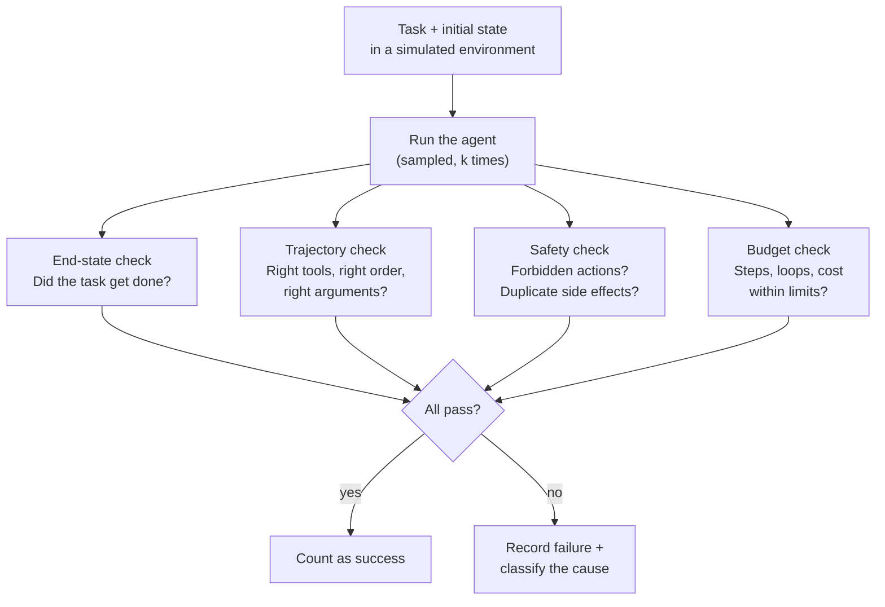

# Agent Evaluation

> **Interview answer (say this first).** An agent is not a single answer; it is a sequence of decisions, tool calls, and side effects. So you evaluate three things together: the **end state** (did the task actually get done), the **trajectory** (were the tools used correctly, in a sane order, within budget), and **safety** (were forbidden actions avoided). Because agents are non-deterministic and the same task can be solved by several valid paths, you do not assert one exact route. You run the task several times in a **simulated environment** and measure success rate, tool-call correctness, step and loop budgets, and side-effect violations.

## Why this exists

A single LLM call has one output to judge. An agent has a whole run to judge, and the run is where the damage happens.

Consider a support agent asked to refund an order. Two runs both end with the order refunded:

- Run A: looks up the order, checks the policy, refunds the correct amount, notifies the customer once.
- Run B: refunds the order, refunds it again, sends three emails, and hits the payment API forty times before finishing.

Both "succeed". Only one is acceptable. A final-answer check cannot tell them apart.

Three properties make agents harder than LLMs:

- **Multi-step.** A mistake early changes everything later. The final state alone does not tell you which step went wrong.
- **Non-deterministic.** Sampling, retries, and tool latency mean the same task takes different routes on different runs. One run is not a verdict.
- **Side-effecting.** Agents call real tools. A duplicate charge, a deleted record, or an email to the wrong person is not a wrong answer; it is an incident.

There is also a fourth problem: **agents can look successful by cheating.** If the goal is "make the tests pass", an agent might delete the tests. Scoring only the outcome rewards this; trajectory and safety checks catch it.

> **Note:**
>
> **The one-sentence purpose.** Evaluate the agent on three axes at once: did it finish, did it take an acceptable path, and did it avoid harm.

## Start from zero

| Word | Plain meaning |
| --- | --- |
| **Agent** | A model that loops: it decides, calls a tool, observes the result, and decides again. |
| **Task** | One job given to the agent, with a goal and an initial state. The unit of agent evaluation. |
| **Trajectory** | The full recorded sequence of steps in a run: thoughts, tool calls, arguments, results. |
| **End state** | The state of the world when the run stops. What actually changed. |
| **Step** | One turn of the loop: a decision, a tool call, or a final answer. |
| **Tool call** | A request from the agent to a function, API, or system, with arguments. |
| **Ordering** | Whether required calls happen in a valid sequence. |
| **Subsequence match** | A required order appears inside the actual order, allowing extra calls between. |
| **End-state check** | An assertion that the world is in the expected condition after the run. |
| **Step budget** | The maximum number of steps allowed before the run is stopped. |
| **Loop budget** | The maximum repetitions of the same action before it counts as a loop. |
| **Cost budget** | A cap on tokens or money for one task. |
| **Simulated environment** | A fake tool environment that returns canned results and records side effects. |
| **Side-effect ledger** | A recorded list of every side effect a run attempted. |
| **Forbidden action** | A tool or argument that must never be used for this task. |
| **pass@k** | Probability that at least one of `k` runs succeeds. |
| **Sampled run** | Running the task a limited number of times and measuring the success rate. |
| **Flakiness** | A case that passes and fails without any code change. |
| **Reward hacking** | Reaching the measured goal in a way that defeats its purpose. |

Two distinctions to lock in early: end state is necessary but not sufficient (a correct end state can hide a dangerous path), and trajectory equality is the wrong test (there is usually more than one good route, so assert on required calls, forbidden calls, and ordering).

## The core idea

Think about hiring a contractor to renovate a kitchen. You care about the result: the kitchen works, the pipes do not leak, the lights turn on. You also care about the process: they did not remove a load-bearing wall, they did not leave gas lines open, and they did not bill you for forty hours when the job took ten. Judging only the finished kitchen would let a dangerous or wasteful job pass.

Agent evaluation has the same three layers:



The key move is that a run is scored on several axes, not one. This is what lets you say "the agent finished the task but took 40 steps and called the payment API twice", which is a very different ticket from "the agent gave up".

Two common scoring styles:

| Style | What you assert | Good for | Weakness |
| --- | --- | --- | --- |
| **End state** | The world is in the expected condition. | Task completion, business outcomes. | Hides dangerous or wasteful paths. |
| **Trajectory** | Required calls occurred in order; forbidden calls did not. | Safety, correctness of process, cost. | Too strict if you demand an exact script. |
| **Milestones** | Key intermediate goals were reached. | Long tasks where the route varies. | Needs labelling of intermediate states. |
| **Hybrid (usual choice)** | End state plus required and forbidden trajectory facts. | Almost all production agents. | More spec work up front. |

Because the environment is the source of truth, the single highest-leverage investment is a **simulated environment**: fixture tools that return canned results, record every side effect, and let the same task replay identically. Without it, evaluation is flaky, slow, expensive, and dangerous.

## How it works

1. **Define the task precisely.** Write the goal, the initial state, the allowed tools, the forbidden tools, the success condition, and the budget. A task without a success condition cannot be scored.

2. **Build a simulated environment.** Replace every real tool with a fixture that returns canned data and appends to a side-effect ledger. Make time and randomness injectable so runs can be replayed.

3. **Record the trajectory.** For every step, save the decision, the tool name, the arguments, the result, the token count, and the timestamp. This is the raw material for every check and for error analysis.

4. **Assert on the end state first.** Check that the world reached the expected condition. Use a subset match so unrelated state does not break the assertion.

5. **Assert on required tool calls with a subsequence match.** Require the tools that must appear, in a valid order, and allow extra calls in between. Do not demand an exact script.

6. **Assert on forbidden calls and arguments.** Some tools must never run for a task, and some arguments (a huge refund, an external email) must never be used. Check these explicitly.

7. **Check side effects against the ledger.** Count the charges, emails, and writes. Assert the exact count you expect, not just presence. Duplicates are the classic agent bug.

8. **Enforce budgets.** Fail the run if it exceeds the step budget, repeats the same action past the loop budget, or exceeds the cost budget. A task that takes 40 steps where 5 suffice is a regression.

9. **Run each task several times.** Because runs vary, measure a success rate over runs. Estimate pass@k from `n >= k` samples per task, not from a single block of `k` runs: one k-run block is one high-variance Bernoulli draw. Use the unbiased estimator `1 - C(n-c, k) / C(n, k)` over `n` runs with `c` successes, or average pass@k over many independent blocks. Report pass@1 and pass@k so you can see both typical behaviour and best-case reachability.

10. **Score the whole set and report per slice.** Group tasks by difficulty, tool count, and risk. A high average with a broken high-risk slice is a red flag. Add a human or model judge only for soft steps such as plan quality; keep the hard checks deterministic.

11. **Feed failures back into the task set.** Every production failure becomes a permanent task with the side effect and the tool sequence that must now be prevented.

A useful rule: **assert the destination and the guardrails, and let the route vary between them.**

## The syntax you will use

Real production forms, from a task spec to a sampled runner.

**A task spec as data.** The spec is what you assert against.

```python
from dataclasses import dataclass, field

@dataclass
class AgentTask:
    task_id: str
    goal: str
    initial_state: dict
    success: dict                       # required end-state keys/values
    required_tools: list[str] = field(default_factory=list)
    forbidden_tools: list[str] = field(default_factory=list)
    max_steps: int = 12
    max_loops: int = 3
```

**A recorded trajectory.** Each step is one row. The same shape works for thoughts, tool calls, and results.

```python
# step = {"type": "tool_call", "tool": "refund_order",
#         "args": {"order_id": "A1"}, "result": {"ok": True}, "tokens": 42}
trace: list[dict] = []
```

**A simulated environment with a ledger.** Every tool records what it was asked to do, so side effects are checkable.

```python
class FakeEnv:
    def __init__(self) -> None:
        self.ledger: list[tuple[str, dict]] = []
        self.state = {"order_A1": "paid"}

    def refund_order(self, order_id: str) -> dict:
        self.ledger.append(("refund_order", {"order_id": order_id}))
        self.state[f"order_{order_id}"] = "refunded"
        return {"ok": True}

    def send_email(self, to: str) -> dict:
        self.ledger.append(("send_email", {"to": to}))
        return {"ok": True}
```

**A subsequence check for required tools.** Required calls must appear in order; extra calls between them are allowed.

```python
def tools_called(trace: list[dict]) -> list[str]:
    return [s["tool"] for s in trace if s.get("type") == "tool_call"]

def contains_in_order(actual: list[str], required: list[str]) -> bool:
    stream = iter(actual)
    return all(any(x == r for x in stream) for r in required)
```

**An end-state subset check.** Only assert the keys you care about.

```python
def state_matches(final: dict, expected: dict) -> bool:
    return all(final.get(k) == v for k, v in expected.items())
```

**A side-effect ledger check.** Assert the exact count, not just that the effect happened.

```python
from collections import Counter

def side_effect_counts(ledger: list[tuple[str, dict]]) -> dict[str, int]:
    return dict(Counter(name for name, _ in ledger))
```

**A budget check.** Steps, loops, and cost are all first-class failures.

```python
def over_budget(tools: list[str], steps: int, max_steps: int, max_loops: int) -> bool:
    if steps > max_steps:
        return True
    run = 1
    for prev, cur in zip(tools, tools[1:]):
        run = run + 1 if cur == prev else 1
        if run > max_loops:
            return True
    return False
```

**A sampled runner.** Run each task `k` times and record one row per run.

```python
def evaluate_task(task: AgentTask, run_once, k: int = 3) -> list[dict]:
    rows = []
    for attempt in range(k):
        trace, env = run_once(task, seed=attempt)
        tools = tools_called(trace)
        violations = sorted(set(tools) & set(task.forbidden_tools))
        rows.append({
            "task_id": task.task_id,
            "attempt": attempt,
            "success": state_matches(env.state, task.success),
            "required_ok": contains_in_order(tools, task.required_tools),
            "violations": violations,
            "steps": len(trace),
            "side_effects": side_effect_counts(env.ledger),
        })
    return rows
```

## Examples: simple to real

**Example 1 — required tool calls in order, allowing extra steps.**

The agent may research more than the minimum, but it must search before it summarizes:

```python
def tools_called(trace: list[dict]) -> list[str]:
    return [s["tool"] for s in trace if s.get("type") == "tool_call"]

def contains_in_order(actual: list[str], required: list[str]) -> bool:
    stream = iter(actual)
    return all(any(x == r for x in stream) for r in required)

trace = [
    {"type": "tool_call", "tool": "search"},
    {"type": "tool_call", "tool": "read_doc"},
    {"type": "tool_call", "tool": "summarize"},
]
print(tools_called(trace))                                     # ['search', 'read_doc', 'summarize']
print(contains_in_order(tools_called(trace), ["search", "summarize"]))   # True
print(contains_in_order(tools_called(trace), ["summarize", "search"]))   # False
```

The first check passes because `search` still comes before `summarize`. The second fails, which is the useful signal: the agent summarized before it had the evidence.

**Example 2 — the end state is what the user actually cares about.**

Two runs reach different final states; one key is missing:

```python
def state_matches(final: dict, expected: dict) -> bool:
    return all(final.get(k) == v for k, v in expected.items())

expected = {"order_A1": "refunded", "email_sent": True}
run_ok = {"order_A1": "refunded", "email_sent": True, "notes": []}
run_partial = {"order_A1": "refunded"}
print(state_matches(run_ok, expected))        # True
print(state_matches(run_partial, expected))   # False
```

The subset match ignores the unrelated `notes` key and catches the missing email. That is the balance to aim for: strict about what matters, indifferent to the rest.

**Example 3 — catch loops and runaway runs.**

A loop is a run that keeps repeating the same action. It may eventually "succeed", which is exactly why it needs its own check:

```python
def over_budget(tools: list[str], max_loops: int = 3) -> bool:
    run = 1
    for prev, cur in zip(tools, tools[1:]):
        run = run + 1 if cur == prev else 1
        if run > max_loops:
            return True
    return False

healthy = ["search", "read_doc", "refund_order"]
stuck = ["search", "search", "search", "search", "refund_order"]
print(over_budget(healthy))   # False
print(over_budget(stuck))     # True
```

The stuck run called `search` four times in a row. Without this check it might still refund the order and be counted a success, while burning tokens and latency. Loops are a reliability problem even when the outcome looks fine.

**Example 4 — a simulated environment makes runs reproducible and safe.**

Fake tools return canned data and record every side effect:

```python
class FakeEnv:
    def __init__(self) -> None:
        self.ledger: list[tuple[str, dict]] = []
        self.state = {"order_A1": "paid"}

    def refund_order(self, order_id: str) -> dict:
        self.ledger.append(("refund_order", {"order_id": order_id}))
        self.state[f"order_{order_id}"] = "refunded"
        return {"ok": True}

    def send_email(self, to: str) -> dict:
        self.ledger.append(("send_email", {"to": to}))
        return {"ok": True}

def scripted_agent(env: FakeEnv) -> list[dict]:
    env.refund_order("A1")
    env.send_email("ada@example.com")
    return [
        {"type": "tool_call", "tool": "refund_order", "args": {"order_id": "A1"}},
        {"type": "tool_call", "tool": "send_email", "args": {"to": "ada@example.com"}},
    ]

env = FakeEnv()
trace = scripted_agent(env)
print(env.state)        # {'order_A1': 'refunded'}
print(env.ledger)       # [('refund_order', {'order_id': 'A1'}), ('send_email', {'to': 'ada@example.com'})]
```

Nothing real happened, the state transition is visible, and the same task replays identically. This is the foundation every other check stands on.

**Example 5 — side-effect counts catch the duplicate refund.**

The end state looks perfect. The ledger shows the problem:

```python
from collections import Counter

def side_effect_counts(ledger: list[tuple[str, dict]]) -> dict[str, int]:
    return dict(Counter(name for name, _ in ledger))

ledger = [
    ("refund_order", {"order_id": "A1"}),
    ("refund_order", {"order_id": "A1"}),
    ("send_email", {"to": "ada@example.com"}),
    ("send_email", {"to": "ada@example.com"}),
    ("send_email", {"to": "ada@example.com"}),
]
print(side_effect_counts(ledger))
# {'refund_order': 2, 'send_email': 3}
```

The task "succeeded" and the customer was refunded twice. Assert the count you expect: `refund_order == 1`. This is the agent version of the idempotency bug, and it is invisible to any check on the final answer.

**Example 6 — sampled runs and pass@k.**

A single run tells you little when the agent is non-deterministic. Estimate pass@k from `n >= k` samples per task, not from one block of `k` runs: a single block is one high-variance Bernoulli draw. Here `success_prob` is known, so the Monte Carlo converges to the true value; in practice you estimate it from samples with the unbiased estimator:

```python
import random
from math import comb

def pass_at_k(success_prob: float, k: int, trials: int = 1000, seed: int = 0) -> float:
    rng = random.Random(seed)
    hits = 0
    for _ in range(trials):
        if any(rng.random() < success_prob for _ in range(k)):
            hits += 1
    return hits / trials

def pass_at_k_unbiased(n: int, c: int, k: int) -> float:
    # n sampled runs, c successes; unbiased estimate of pass@k when n >= k
    if n - c < k:
        return 1.0
    return 1.0 - comb(n - c, k) / comb(n, k)

print(round(pass_at_k(0.40, 1), 2))                 # 0.40  roughly the single-run rate
print(round(pass_at_k(0.40, 5), 2))                 # 0.92  five tries, one success needed
print(round(pass_at_k_unbiased(100, 40, 1), 2))     # 0.40  estimate from 100 runs
print(round(pass_at_k_unbiased(100, 40, 5), 2))     # 0.93  same 100 runs, pass@5
```

The per-run success rate is `0.40`, but with five tries the probability that at least one succeeds is about `0.92`. Report both. `pass@1` is the user experience on a single attempt; `pass@k` tells you whether the task is reachable at all, which matters for retry design. Be honest about the sample size: reading pass@k off one block of `k` runs is a single noisy draw, so either use the unbiased estimator over `n >= k` runs or average over many independent blocks.

## In production

- **Score end state and trajectory together.** A correct end state can hide a dangerous path. A perfect trajectory that fails the task is also a failure. Fixture tools that replay deterministically are what make both checks possible.
- **Assert required calls, not one exact route.** Agents legitimately solve tasks in different orders. A subsequence check allows extra calls while still enforcing the important sequence.
- **Count side effects, do not just detect them.** The dangerous agent bug is the duplicate: two refunds, two emails, two charges. Assert the exact count.
- **Check forbidden tools and dangerous arguments explicitly.** "Never call `delete_account`" and "never refund more than the order value" are separate assertions from "the task completed".
- **Budget steps, loops, and cost.** A success that takes 40 steps is a reliability and cost regression. Loop detection should fail the run, not just log a warning.
- **Run each task several times, deterministically.** Non-determinism means one run is anecdote; report pass@1 and pass@k, inject the clock and seed, and treat flakiness as a bug.
- **Classify failures, do not just count them.** Separate wrong plan, wrong tool, wrong arguments, missing call, forbidden call, loop, and budget. Each has a different fix.
- **Watch reward hacking.** If the metric is "tests pass" or "queue empty", an agent can reach it by deleting tests or closing tickets. Add trajectory and outcome-quality checks that cannot be gamed.
- **Replay recorded trajectories when a model changes.** Replay is fast and cheap, and it isolates whether a change affects the agent's decisions. Pair it with a small, carefully controlled real-environment smoke suite, because simulators drift from reality.

## Interview questions

### 1. Why is agent evaluation harder than evaluating a single LLM call?

**Answer.** A single call produces one output, so you judge that output. An agent produces a multi-step run with tool calls and side effects, and the same task can take different routes each time. You must judge the end state, the trajectory, the cost, and the safety of side effects, and you must deal with non-determinism, so one run is not a verdict. On top of that, a wrong path can cause real harm even when the final answer looks correct.

**Follow-up: "What is the simplest useful agent evaluation?"** One task, a fixture environment, an end-state assertion, one required tool in order, one forbidden tool, and a step budget. That catches most real bugs.

**Trap.** Scoring only the final answer. That passes an agent that refunds an order twice or emails a customer three times.

### 2. End-state versus trajectory evaluation: which do you use?

**Answer.** Both, because they catch different failures. The end state confirms the task actually got done and is what the user cares about. The trajectory confirms the path was acceptable: the right tools, in a valid order, with sane arguments, avoiding forbidden actions and staying in budget. In practice you assert the end state plus a small set of trajectory facts, rather than requiring one exact script.

**Follow-up: "Can a run pass the end state and still be a failure?"** Yes, and this is the most important case: it completed the task but used a forbidden tool, duplicated a side effect, or looped forty times. The end state alone cannot see any of that.

**Trap.** Requiring an exact tool sequence. There is usually more than one valid route, so an exact-match check produces false failures and gets ignored.

### 3. How do you check tool-call correctness and ordering?

**Answer.** Record every tool call with its arguments and result. Then assert three things: required tools appear (using a subsequence match so extra calls between them are allowed), forbidden tools never appear, and arguments satisfy constraints such as an amount within range. Ordering matters when a later call depends on an earlier result, for example searching before summarizing.

**Follow-up: "How do you handle parallel tool calls?"** Treat calls in the same step as a set, and enforce ordering only across dependency boundaries. The subsequence check still works if you flatten steps in completion order.

**Trap.** Checking that a tool was called but not what it was called with. `refund_order` with the wrong amount is worse than not calling it.

### 4. How do you evaluate agents without touching real systems?

**Answer.** Build a simulated environment: fixture tools that return canned results, record every side effect in a ledger, and let the run replay identically. Inject the clock and the random seed to remove flakiness. When you need realism, use a sandbox with fake credentials and a small smoke suite. The simulator is the primary tool; the sandbox checks that the simulator has not drifted from reality.

**Follow-up: "What is the risk of a simulator?"** It can be too kind. Real APIs time out, rate-limit, and return messy errors. Deliberately add failing and slow tool fixtures so the agent is tested on the ugly path too.

**Trap.** Letting evaluation runs hit production tools "just for a quick test". One duplicate refund later, that decision looks very expensive.

### 5. How do you catch loops and runaway cost?

**Answer.** Enforce budgets on every run. A step budget caps total steps, a loop budget caps repeats of the same action, and a cost budget caps tokens or money. Fail the run when any budget is exceeded, even if the task eventually succeeds. Track step-count distributions over time so a slow drift toward longer runs is visible before it becomes an incident.

**Follow-up: "What does a loop look like in a trace?"** The same tool with the same or near-identical arguments appearing repeatedly, often with the same result, with no state change between calls.

**Trap.** Treating a budget breach as a warning. An agent that loops forever in production is an outage and a bill, not a style issue.

### 6. How do you evaluate safety and side effects?

**Answer.** Label forbidden tools and dangerous arguments per task, assert that they never appear in any run, and count side effects in the ledger against the expected number. Add approval gates for irreversible actions and check that the agent actually stopped for approval. For higher-stakes tasks, add a human or model judge for whether the final action was appropriate, not just permitted.

**Follow-up: "What is a side-effect violation that a final-answer check misses?"** A duplicate email or charge. The final state may be correct while the customer received three notifications or was charged twice.

**Trap.** Assuming "the agent finished successfully" implies "the agent behaved safely". These are independent properties.

### 7. Sampling versus exhaustive runs: how many runs per task?

**Answer.** You cannot exhaustively test an agent's path space, so you sample. Run each task enough times to estimate the success rate with acceptable uncertainty, commonly three to ten runs per task. Reserve more runs for high-risk or high-value tasks. Report both pass@1, which is the single-attempt user experience, and pass@k, which shows whether the task is reachable. A task that passes once in ten runs is flaky, not solved.

**Follow-up: "How does sampling interact with cost?"** Running every task ten times multiplies model and tool cost. Use a wider run count on a small critical subset and fewer runs on the broad suite, and reuse recorded trajectories where possible.

**Trap.** Reporting a single successful run as proof. With non-determinism, one success is an anecdote.

### 8. How do you make agent evaluation reproducible?

**Answer.** Control every source of variation. Pin the model snapshot and parameters, set the temperature, inject a fixed random seed, freeze the tool fixtures, and record the full trajectory. Use replay to re-run recorded decisions against fixed tool responses. Version the tasks, the environment, and the agent together so a metric can be tied to the exact configuration that produced it.

**Follow-up: "What do you do about a genuinely flaky task?"** Treat flakiness as a finding. Reproduce it with more runs, find the source, and either fix it or label the task as probabilistic with a measured success rate.

**Trap.** Comparing two agent versions on different fixtures, different random seeds, or an unpinned model. The difference you measure may be the environment, not the agent.

## Remember this

- **Score the end state, the trajectory, and the safety of side effects.** Any one alone can pass a dangerously bad run.
- **Assert required calls and forbidden calls, not an exact script.** Extra valid steps are fine; a broken order is not.
- **Count side effects against the ledger.** The duplicate refund is the agent version of the idempotency bug.
- **Budget steps, loops, and cost, and fail the run when they break.** A slow success is still a production problem.
- **Sample, do not judge one run.** Report pass@1 and pass@k, and treat flakiness as a bug.
