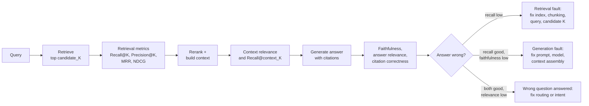

# RAG Evaluation

> **Interview answer (say this first).** RAG has two stages and therefore two families of metric. **Retrieval metrics** answer "was the evidence found and ranked well?" using labelled relevant documents: recall@k, precision@k, MRR, and NDCG. **Generation metrics** answer "was the answer faithful and relevant?" using the context and the answer: faithfulness, answer relevance, context relevance, and citation correctness. You measure components to attribute a failure, and end-to-end to know whether the pipeline serves users. When an answer is wrong, you check retrieval first: if recall is low the evidence never arrived; if recall is fine but faithfulness is low, the model ignored good evidence. That one split tells you which team fixes the bug.

## Why this exists

A RAG answer can be wrong in two completely different ways:

- **The evidence never reached the model.** The retriever returned the wrong chunks, or ranked the right one below the cut. No prompt can fix this.
- **The evidence reached the model and the answer ignored it.** The model invented a number, mixed up two documents, or answered a different question. No index change can fix this.

These have different owners, different costs, and different fixes. If you only measure end-to-end correctness, both look like "the answer is wrong" and the team guesses. Retrieval evaluation is what makes the failure attributable.

There is a second reason retrieval metrics are not optional: **ranking matters.** A chunk can be retrieved but placed eighth in a context window that keeps five. Recall@100 can be perfect while the user still gets nothing useful, because the reranker or the context builder dropped the evidence. Position-aware metrics such as MRR and NDCG capture what a simple "was it found?" metric misses.

The third reason is **trust**. Users accept an answer when they can check it. Citations that point at real, relevant passages are a product feature. Citation correctness is measurable, and an agent that fabricates a citation is worse than one that says "I don't know".

> **Note:**
>
> **The one-sentence purpose.** Split the pipeline in two: measure whether the evidence arrived, then measure whether the answer used it honestly.

## Start from zero

| Word | Plain meaning |
| --- | --- |
| **Retrieval** | Finding candidate documents or chunks for a query. |
| **Generation** | Turning a query plus retrieved context into an answer. |
| **Gold chunk** | A document ID that a human has confirmed contains the answer. |
| **Relevant set** | The labelled gold chunks for one query. |
| **Recall@k** | Share of the relevant set found in the top `k` results. |
| **Precision@k** | Share of the top `k` results that are relevant. |
| **MRR** | Mean reciprocal rank: `1 / rank` of the first relevant result, averaged over queries. |
| **NDCG@k** | Normalised discounted cumulative gain. Rewards relevant results ranked high, supports graded relevance. |
| **Graded relevance** | Relevance scored on a scale (for example 0–3), not just yes/no. |
| **Candidate K** | How many chunks the retriever returns before reranking. |
| **Reranker** | A second model that reorders candidates by relevance. |
| **Context relevance** | Whether the retrieved context is actually relevant to the query, judged without labels. |
| **Faithfulness** | Whether every claim in the answer is supported by the retrieved context. |
| **Groundedness** | See faithfulness. Occurs when the answer stays inside the evidence. |
| **Hallucination** | A claim in the answer that the context does not support. |
| **Answer relevance** | Whether the answer addresses the question that was asked. |
| **Attribution** | Linking a claim in the answer to the exact supporting passage. |
| **Citation correctness** | Whether each cited source exists and supports the claim it is attached to. |
| **Abstention / refusal** | Correctly saying "the documents do not answer this". |
| **Unanswerable question** | A question whose answer is not in the corpus. |
| **Hard negative** | A retrieved chunk that looks relevant but is not, used to test precision. |
| **RAG triad** | Context relevance, faithfulness, and answer relevance scored together. |
| **Judge** | A model or rule that assigns one of these scores. |
| **Chunk** | A small piece of a document used as a retrieval unit. |

Three distinctions to lock in early:

- **Recall@candidate_K and recall@context_K are different.** The first says the retriever found it. The second says it survived reranking and truncation. Measure both or you will fix the wrong stage.
- **Faithfulness is not correctness.** An answer can be perfectly faithful to wrong or outdated context. Faithfulness is about staying inside the evidence, not about the evidence being true.
- **Context relevance is not retrieval recall.** Recall needs gold labels. Context relevance is judged from the query and the retrieved chunks, so it covers queries you never labelled.

## The core idea

Think about a research assistant preparing a briefing. The job has two halves. First, find the right sources in the library and put the best ones on top of the pile. Second, write a summary that only uses what is in the pile and points to where each fact came from. If the briefing is wrong, your first question is not "is the writer bad?" It is "were the right books even on the desk?"

That is the RAG pipeline:



The order of the checks is the trick. **Check retrieval first.** It is upstream, it is cheap with labels, and a low recall eliminates every generation hypothesis.

The two families of metric, side by side:

| Family | Metric | Needs labels? | Answers |
| --- | --- | --- | --- |
| Retrieval | Recall@k | Yes, gold chunks | Was the evidence found at all? |
| Retrieval | Precision@k | Yes | How much of the context is noise? |
| Retrieval | MRR | Yes | How high did the first relevant chunk rank? |
| Retrieval | NDCG@k | Yes, grades | How good is the whole ranking? |
| Generation | Faithfulness | No, needs context | Did the answer stay inside the evidence? |
| Generation | Answer relevance | No | Did it answer the actual question? |
| Generation | Context relevance | No | Is the retrieved context on topic? |
| Generation | Citation correctness | No | Do the citations point at real support? |
| End-to-end | Task success | Yes | Did the user get what they needed? |

A practical shape to remember: **retrieval metrics are cheap and mechanical; generation metrics need judgement; end-to-end is the business number.** Use them in that order when something breaks.

## How it works

1. **Write down the retrieval unit and the evaluation unit.** Decide what a "document" is (a chunk, a section, a page) before labelling. If the unit changes, every historical retrieval number becomes incomparable.

2. **Label the relevant set per query.** For each question, record which chunks contain the answer. Mark unanswerable questions explicitly, because their correct behaviour is refusal.

3. **Score retrieval with several metrics.** Recall@candidate_K for "did we find it", precision@k for noise, MRR for first-hit rank, and NDCG@k for the whole ordering. No single number captures all four.

4. **Score retrieval again after reranking and truncation.** Compute recall@context_K, the recall of what the generator actually saw. The gap between the two isolates a reranker or context-builder problem.

5. **Score context relevance without labels.** For unlabelled traffic, judge whether each retrieved chunk is on topic. This catches relevance failures on queries you never curated.

6. **Score faithfulness.** Break the answer into claims and check each claim against the context. A claim with no support is a hallucination. Report the supported-claim ratio.

7. **Score answer relevance.** Check that the answer addresses the question. A faithful answer to a different question is still a failure.

8. **Score citation correctness.** Every citation must point at a retrieved source, and that source must actually support the attached claim. A dead or wrong citation destroys trust.

9. **Score refusal behaviour separately.** Measure over-refusal (refusing answerable questions) and under-refusal (answering unanswerable ones). They have different costs, so they get different numbers.

10. **Evaluate end-to-end and per slice.** Run the full pipeline and report task success overall and on the hardest slices: multi-hop, comparison, acronym-heavy, and no-answer.

11. **Run attribution on every failure.** For each wrong answer, check recall first, then faithfulness, then relevance. Tag the fault and group the tags. This is what turns a pile of failures into a fix list.

12. **Gate in CI and feed production failures back.** Threshold the metrics, compare against a stored baseline, and add every confirmed failure as a permanent case.

A useful rule: **if recall is low, do not touch the prompt.** Prompt changes are slow to validate and cannot create evidence the retriever never found.

## The syntax you will use

Real production forms, from a metric to a debugging decision.

**A labelled eval case.** Keep the query, the gold chunks, and the produced answer together.

```python
from dataclasses import dataclass, field

@dataclass
class RagItem:
    query: str
    relevant: set[str]                      # gold chunk IDs
    retrieved: list[str]                    # in ranked order
    context: str
    answer: str
    grades: dict[str, int] = field(default_factory=dict)   # optional graded relevance
```

**Recall and precision at k.** Recall is the fraction of gold chunks found; precision is the fraction of returned chunks that are gold.

```python
def recall_at_k(retrieved: list[str], relevant: set[str], k: int) -> float | None:
    if not relevant:
        return None                         # unanswerable: no denominator
    return len(set(retrieved[:k]) & relevant) / len(relevant)

def precision_at_k(retrieved: list[str], relevant: set[str], k: int) -> float:
    return len(set(retrieved[:k]) & relevant) / k
```

**Mean reciprocal rank.** The first relevant hit is what the user reads, so its position matters.

```python
def reciprocal_rank(retrieved: list[str], relevant: set[str]) -> float:
    for rank, doc in enumerate(retrieved, start=1):
        if doc in relevant:
            return 1.0 / rank
    return 0.0
```

**NDCG at k with graded relevance.** Discount each result by log of its position, then normalise by the best possible ordering.

```python
import math

def ndcg_at_k(retrieved: list[str], grades: dict[str, int], k: int) -> float:
    def dcg(seq: list[int]) -> float:
        return sum(g / math.log2(i + 1) for i, g in enumerate(seq, start=1))
    gains = [grades.get(doc, 0) for doc in retrieved[:k]]
    ideal = sorted(grades.values(), reverse=True)[:k]
    best = dcg(ideal)
    return dcg(gains) / best if best else 0.0
```

**A rule-based faithfulness check.** A cheap proxy: split the answer into claims and measure how much of each claim's vocabulary appears in the context.

```python
import re

def claim_supported(claim: str, context: str, threshold: float = 0.6) -> bool:
    words = set(re.findall(r"[a-z0-9]+", claim.lower()))
    if not words:
        return True
    overlap = len(words & set(re.findall(r"[a-z0-9]+", context.lower()))) / len(words)
    return overlap >= threshold

def faithfulness(answer: str, context: str) -> float:
    claims = [s for s in re.split(r"(?<=[.!?])\s+", answer.strip()) if s]
    return sum(claim_supported(c, context) for c in claims) / len(claims) if claims else 1.0
```

**A citation check.** Every cited ID must exist in the retrieved set.

```python
def citation_ids(answer: str) -> list[str]:
    return re.findall(r"\[doc:([\w-]+)\]", answer)

def bad_citations(answer: str, retrieved: list[str]) -> list[str]:
    return [c for c in citation_ids(answer) if c not in retrieved]
```

**An attribution function.** The order of the checks is the whole point.

```python
def diagnose(recall: float, faith: float, relevance: float) -> str:
    if recall < 1.0:
        return "retrieval"
    if faith < 1.0:
        return "generation"
    if relevance < 1.0:
        return "relevance"
    return "ok"
```

**A judge prompt for faithfulness.** Ask for a small fixed label set, a reason, and an explicit ban on outside knowledge: `Is every claim in the ANSWER supported by the CONTEXT? Use only the context. Return JSON {"label": "faithful"|"unsupported", "unsupported_claims": ["..."]}. Context: {context} Answer: {answer}`.

## Examples: simple to real

**Example 1 — recall and precision say different things.**

One query, four returned chunks, two of them gold:

```python
def recall_at_k(retrieved, relevant, k):
    if not relevant:
        return None
    return len(set(retrieved[:k]) & relevant) / len(relevant)

def precision_at_k(retrieved, relevant, k):
    return len(set(retrieved[:k]) & relevant) / k

retrieved = ["d1", "d9", "d3", "d8"]
relevant = {"d1", "d3"}
print(recall_at_k(retrieved, relevant, k=4))       # 1.0
print(precision_at_k(retrieved, relevant, k=4))    # 0.5
print(recall_at_k(retrieved, relevant, k=2))       # 0.5
```

Recall@4 is perfect: both gold chunks were found. Precision@4 is `0.5`: half the context is noise. Recall@2 is `0.5`, which is the warning sign for a context window of two. Retrieval "worked", and the user may still get a bad answer because the right chunk sits third.

**Example 2 — MRR catches a ranking problem that recall hides.**

Two queries with identical recall but different ranking:

```python
def recall_at_k(retrieved, relevant, k):
    if not relevant:
        return None
    return len(set(retrieved[:k]) & relevant) / len(relevant)

def reciprocal_rank(retrieved, relevant):
    for rank, doc in enumerate(retrieved, start=1):
        if doc in relevant:
            return 1.0 / rank
    return 0.0

q1, rel1 = ["d5", "d1", "d2"], {"d1"}
q2, rel2 = ["d1", "d5"], {"d1"}
print(recall_at_k(q1, rel1, k=3), round(reciprocal_rank(q1, rel1), 2))   # 1.0 0.5
print(recall_at_k(q2, rel2, k=3), round(reciprocal_rank(q2, rel2), 2))   # 1.0 1.0
```

Recall@3 is `1.0` for both. MRR is `0.5` for the first and `1.0` for the second, so the mean MRR is `0.75`. The first query found the answer in position two. With a context window of one, it would have failed. Recall alone would have called these equal.

**Example 3 — NDCG rewards putting the best evidence first.**

Graded relevance lets a strongly relevant chunk count more than a weak one:

```python
import math

def dcg(gains):
    return sum(g / math.log2(i + 1) for i, g in enumerate(gains, start=1))

def ndcg_at_k(retrieved, grades, k):
    gains = [grades.get(doc, 0) for doc in retrieved[:k]]
    ideal = sorted(grades.values(), reverse=True)[:k]
    best = dcg(ideal)
    return dcg(gains) / best if best else 0.0

grades = {"d1": 3, "d2": 1, "d3": 0}
print(round(ndcg_at_k(["d3", "d1", "d2"], grades, 3), 3))   # 0.659
print(round(ndcg_at_k(["d1", "d2", "d3"], grades, 3), 3))   # 1.0
```

The same three chunks get `0.659` when the best one is last and `1.0` when the order is ideal. NDCG is the metric to quote when the argument is about ranking rather than existence.

**Example 4 — faithfulness finds the invented sentence.**

Split the answer into claims and check each against the context:

```python
import re

def claim_supported(claim, context, threshold=0.6):
    words = set(re.findall(r"[a-z0-9]+", claim.lower()))
    if not words:
        return True
    overlap = len(words & set(re.findall(r"[a-z0-9]+", context.lower()))) / len(words)
    return overlap >= threshold

def faithfulness(answer, context):
    claims = [s for s in re.split(r"(?<=[.!?])\s+", answer.strip()) if s]
    return sum(claim_supported(c, context) for c in claims) / len(claims) if claims else 1.0

context = "Refunds are available for 30 days. Refunds require the original receipt."
answer = ("Refunds are available for 30 days. Refunds require the original receipt. "
          "Refunds take 90 days to process.")
print(round(faithfulness(answer, context), 3))   # 0.667
```

Two of three claims are supported; the third introduces `90 days`, which the context never says. This proxy is cheap and catches obvious drift. A model judge is better for paraphrase, but a deterministic check runs on every commit for free.

**Example 5 — citations are a correctness feature.**

A fabricated citation is a trust failure, and it is easy to detect:

```python
import re

def citation_ids(answer):
    return re.findall(r"\[doc:([\w-]+)\]", answer)

def bad_citations(answer, retrieved):
    return [c for c in citation_ids(answer) if c not in retrieved]

answer = "Refunds take 30 days [doc:d1]. Returns are free for 90 days [doc:d9]."
retrieved = ["d1", "d2", "d3"]
print(citation_ids(answer))                    # ['d1', 'd9']
print(bad_citations(answer, retrieved))        # ['d9']
```

`d9` was never retrieved, so the citation is fabricated. Note that this check covers existence, not support. The stronger version checks that the cited chunk's text overlaps the claim it is attached to, which catches a real but wrong citation.

**Example 6 — attribution turns failures into a fix list.**

Run the diagnostics on every row and group by fault:

```python
def diagnose(recall, faith, relevance):
    if recall < 1.0:
        return "retrieval"
    if faith < 1.0:
        return "generation"
    if relevance < 1.0:
        return "relevance"
    return "ok"

rows = [
    {"query": "refund window", "recall": 1.0, "faith": 0.50, "relevance": 1.0},
    {"query": "support hours", "recall": 0.50, "faith": 1.00, "relevance": 1.0},
    {"query": "trial length", "recall": 1.0, "faith": 1.00, "relevance": 1.0},
    {"query": "cancel policy", "recall": 1.0, "faith": 1.00, "relevance": 0.4},
]
for r in rows:
    r["fault"] = diagnose(r["recall"], r["faith"], r["relevance"])
print([(r["query"], r["fault"]) for r in rows])
# [('refund window', 'generation'), ('support hours', 'retrieval'),
#  ('trial length', 'ok'), ('cancel policy', 'relevance')]
```

Four rows, three different faults. Without the fault column, all four are "the AI is wrong". With it, they are three tickets: a prompt fix, an index fix, and a routing or intent-review.

## In production

- **Label the retrieval unit explicitly.** If a "document" is a chunk, a re-chunk changes every retrieval number. Record the chunking version with the metric.
- **Measure recall before and after reranking.** The gap between recall@candidate_K and recall@context_K is a reranker or context-builder bug hiding in plain sight.
- **Do not rely on a single retrieval metric.** Recall ignores ranking, NDCG ignores unretrieved gold, and precision punishes long candidate lists. Report a small panel.
- **Add hard negatives to the retrieval set.** Easy queries make every retriever look good. Hard negatives test whether the ranking model can tell similar-but-wrong apart.
- **Include unanswerable questions.** Score refusal as its own category and skip retrieval metrics for them, because there is no relevant chunk to recall.
- **Report faithfulness and answer relevance separately.** A faithful answer to the wrong question scores high on one and low on the other, and the fix is different. Check citations mechanically too: existence is cheap, support needs an overlap check or a judge, and one fabricated citation can cost more trust than a wrong answer.
- **Use a rule-based faithfulness check as the fast gate and a judge for the final number.** Deterministic checks catch obvious drift with no bias; judges catch paraphrase but add cost and noise.
- **Gate on the worst slice, not the average.** A change that improves easy lookups and breaks multi-hop questions still raises the mean.
- **Log the retrieved IDs for every production answer.** Without them you cannot attribute a failure later, and the failure is gone once the context window is recycled.
- **Expect the corpus to drift.** Documents change, get re-parsed, and get deleted. Retrieval metrics drop first; watch them.
- **Keep the judge and the model pinned.** A silent model upgrade changes faithfulness scores without any code change, and the team chases a ghost.

## Interview questions

### 1. How do you split retrieval quality from generation quality?

**Answer.** Retrieval quality is measured against labelled gold chunks with recall@k, precision@k, MRR, and NDCG@k. Generation quality is measured against the context and the answer with faithfulness, answer relevance, context relevance, and citation correctness, and it does not need gold labels. You evaluate the retriever alone on labelled queries, the generator with a fixed context, and the whole pipeline end-to-end. The split is what gives attribution when an answer is wrong.

**Follow-up: "Why not just measure end-to-end correctness?"** Because a bad end-to-end number does not say which of the two stages broke. Correctness tells you there is a problem; component metrics tell you where.

**Trap.** Judging a retriever change by the final answer alone, when the answer also moved because the prompt changed in the same release.

### 2. Which retrieval metric should you use?

**Answer.** Use a small panel. Recall@k answers "did we find it", which is the first thing to guarantee. Precision@k answers "how much noise is in the context". MRR answers "how high did the first relevant chunk rank", which matters for small context windows. NDCG@k answers "how good is the whole ordering" and supports graded relevance. Report recall@candidate_K and recall@context_K separately so you can see reranking losses.

**Follow-up: "When is recall the wrong metric?"** When there is only one relevant chunk and ranking is what matters, or when the candidate list is huge. Recall@500 being perfect is not useful if the context window keeps five.

**Trap.** Optimising precision by returning fewer chunks. That raises precision and can destroy recall, which is the more damaging failure.

### 3. What is faithfulness and how do you measure it?

**Answer.** Faithfulness is whether every claim in the answer is supported by the retrieved context. The common measurement is to split the answer into claims and check each one against the context, then report the share of supported claims. You can do it with a rule-based overlap check for speed, a model judge for paraphrase and nuance, or a human for the calibration sample.

**Follow-up: "Can an answer be faithful and still wrong?"** Yes. Faithfulness only says the answer stayed inside the context. If the context is outdated, wrong, or itself a hallucination from an earlier step, a perfectly faithful answer is still wrong.

**Trap.** Treating a high faithfulness score as proof of correctness. It is one axis, and the context can be the problem.

### 4. Faithfulness, groundedness, and answer relevance: what is the difference?

**Answer.** Faithfulness and groundedness are usually the same idea: the answer does not go beyond its evidence. Answer relevance is different: it asks whether the answer actually addresses the question asked. An answer can be grounded and irrelevant (a faithful summary of the wrong document), or relevant and ungrounded (a correct-sounding answer the context does not support). Measure both.

**Follow-up: "And context relevance?"** That asks whether the retrieved context is on topic for the query, judged without labels. It is the third leg of the RAG triad: context relevance, faithfulness, and answer relevance.

**Trap.** Using "hallucination" for all three. A wrong answer from wrong context is a retrieval or data problem, not necessarily a hallucination.

### 5. How do you evaluate citations?

**Answer.** Two levels. Existence: every cited ID must be in the retrieved set, which is a cheap regex check. Support: the cited passage must actually contain the claim it is attached to, which needs an overlap check or a judge. Track the fabrication rate and the support rate separately, because a fabricated citation and a misattributed one are different failures.

**Follow-up: "Why do citations matter beyond trust?"** They force the model to localise its evidence, which tends to improve faithfulness. A model that must name a source is less likely to invent one.

**Trap.** Checking only that citations look well-formed. A neat `[1]` that points at the wrong passage is worse than no citation, because it looks checkable and is not.

### 6. Walk me through debugging a wrong answer: retrieval or generation?

**Answer.** Check recall first. If the gold chunk is missing from the candidate set, it is a retrieval fault: fix parsing, chunking, embeddings, query transformation, or candidate K. If the gold chunk is in the candidates but missing from the context, it is a reranker or context-builder fault. If the gold chunk is in the context and the answer is still wrong, it is a generation fault: fix the prompt, the model, or the answer format. If recall and faithfulness are both good and users still complain, the question may be misread, so look at intent and routing.

**Follow-up: "What if the gold chunk is in the context and the answer is still wrong?"** Then check context relevance and answer relevance. The model may have been distracted by other chunks, or answered a different question. Look at the prompt and the context ordering.

**Trap.** Starting with the prompt because it is the easiest thing to edit. If recall is low, no prompt change can help.

### 7. How do you build a RAG evaluation set?

**Answer.** Collect real questions from logs and support tickets, add reviewed synthetic questions generated from documents, and add expert-written edge cases. Label the relevant chunks for each question, and mark unanswerable questions explicitly. Store a reference answer or a set of accepted answers. Stratify by intent and difficulty, such as lookup, multi-hop, comparison, acronym-heavy, and no-answer. Version it and add every confirmed production failure.

**Follow-up: "What makes synthetic questions weak?"** They inherit the wording of the source chunk and skip the messy phrasing real users produce. Use them for coverage, not realism.

**Trap.** Labelling relevant chunks with the same model that produced the answer. It will call its own evidence sufficient and the score will be meaningless.

### 8. What end-to-end gates do you put in CI for RAG?

**Answer.** A fast suite on every change that checks retrieval recall, faithfulness, citation validity, and refusal behaviour, each against a stored baseline with a margin. Fail if any metric drops below its threshold or if the worst slice drops too far. Keep the slow full suite for nightly runs. Add p95 latency and cost per query as gates too, because a retrieval change that doubles latency is a regression even if quality improves.

**Follow-up: "What makes the gate trustworthy?"** A pinned dataset, a pinned judge and model, a baseline recomputed whenever the set changes, and thresholds the team believes in.

**Trap.** Gating on a single absolute number with no baseline. The number moves with the dataset, the judge, and the model, so the gate either never fires or fires constantly.

## Remember this

- **Check retrieval first.** Low recall means the evidence never arrived, and no prompt can fix that.
- **Recall@candidate_K and recall@context_K are different.** The gap between them is a reranker or context-builder bug.
- **Faithfulness is not correctness.** An answer can stay perfectly inside wrong or outdated context.
- **Measure retrieval with a panel: recall, precision, MRR, NDCG.** Each one sees something the others miss.
- **Gate end-to-end, attribute with components, and log the retrieved IDs** so every failure stays debuggable.
