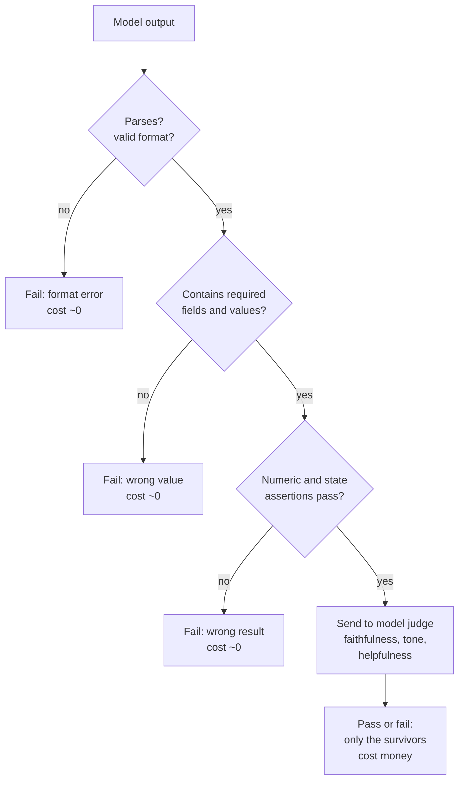

# Deterministic and Rule-Based Evaluators

> **Interview answer (say this first).** Most quality problems are checked with code, not with a model. Exact match, normalised match, substring, regex, JSON-schema validity, numeric tolerance, and assertions on tool calls and final state are **deterministic evaluators**: the same input always gives the same score, with no bias, no drift, and almost no cost. You layer them, cheapest first, and only send the cases that survive to an expensive model judge. Their limits are real — they cannot judge paraphrase, tone, or nuance — but they should catch the majority of failures before a judge sees anything.

## Why this exists

A team adds a model judge and puts it in CI. Scores are noisy, the judge changes when the provider updates the model, and the suite costs money on every commit. Meanwhile, half the actual failures were obvious:

- The answer was valid JSON yesterday and invalid JSON today.
- A citation points at a document that was never retrieved.
- A refund reply says `$1,200` when the policy says `$120`.
- The agent called `delete_account` on a support task.
- The response is 4,000 tokens when the limit is 500.

None of these need a model. Each is a rule: parse it, compare it, assert it. Deterministic checks are faster, cheaper, sharper, and impossible to argue with. They also fail loudly with a specific message instead of a score of 0.6.

The reason they matter especially for agents is that **side effects and formats are the dangerous part**. A wrong tone is annoying; a duplicate refund is not. Rules are exactly the tool for "the tool was called with this argument", "the state changed this way", and "the output parsed".

The failure mode on the other side is just as important: a rule that is too strict produces false failures, and a suite that cries wolf gets ignored. So the skill is not "use rules"; it is "use the cheapest check that reliably catches the failure, and know what the rule cannot see".

> **Note:**
>
> **The one-sentence purpose.** Deterministic evaluators are the free, fearless first layer: they catch format, value, and side-effect failures before anything expensive runs.

## Start from zero

| Word | Plain meaning |
| --- | --- |
| **Deterministic evaluator** | A check implemented in code that gives the same score every time. |
| **Rule-based check** | A specific test, such as "contains this", "matches this pattern", or "parses as JSON". |
| **Exact match** | The output must equal the expected string exactly. The strictest check. |
| **Normalised match** | Both strings are cleaned (case, whitespace, punctuation) before comparing. |
| **Substring / contains** | The expected text appears somewhere inside the output. |
| **Regex** | A pattern match, used for formats such as IDs, dates, emails, and citations. |
| **JSON schema** | A description of the required shape of a JSON value: types, required keys, allowed values. |
| **Schema validity** | Whether a value matches its schema. Structural correctness, not meaning. |
| **Numeric tolerance** | Allowing a small difference, absolute or relative, instead of exact equality. Absolute suits fixed units such as currency; relative suits percentages. |
| **Assertion** | A statement that must be true, or the test fails. |
| **Unit test** | A small test of one behaviour, run on every change. |
| **Golden file / snapshot** | A saved expected output compared against the current output. |
| **Normaliser** | The function that standardises text before comparison: Unicode form, lower-case, strip, collapse whitespace. |
| **Denylist / forbidden phrase** | Text that must never appear, such as profanity or a prohibited claim. |
| **Semantic equivalence** | Two strings mean the same thing while reading differently. Rules cannot see this. |
| **False pass** | A bad output the check accepted. |
| **False fail** | A good output the check rejected. Erodes trust in the suite. |
| **Cascade / layered checks** | Running cheap checks first and expensive checks only on survivors, stopping at the first failure. |
| **Judge** | A model-based scorer, used only for what rules cannot express. |

Two distinctions to lock in early: structural validity is not correctness (valid JSON with wrong values passes a schema check), and a passing rule is proof of nothing beyond itself (rules are a floor, not a ceiling).

## The core idea

Think about airport security. Nobody puts every passenger through the most expensive machine first. There is a cheap first layer — document checks and a metal detector — and only the cases that raise a flag get the slow, expensive search. Cheap checks handle the vast majority, and the expensive check is reserved for the rare few.

Deterministic evaluation is that first layer for AI output:



Most failures die in the first three diamonds for nearly free. Only the genuinely open-ended quality questions reach the judge, which is the expensive, biased, drifting part.

What each kind of check can and cannot see:

| Check | Catches | Misses | Cost |
| --- | --- | --- | --- |
| Exact match | Wrong value, formatting drift | Any paraphrase | ~0 |
| Normalised match | Case, whitespace, punctuation | Word choice, synonyms | ~0 |
| Substring | Missing required content | Extra wrong content | ~0 |
| Regex | Format, IDs, citations, forbidden text | Meaning | ~0 |
| JSON schema | Missing keys, wrong types | Wrong values inside valid types | ~0 |
| Numeric tolerance | Off-by-small errors | Off-by-large errors | ~0 |
| State assertion | Wrong final world state | Bad path to a correct state | ~0 |
| Tool-call assertion | Wrong or forbidden actions | Poor reasoning | ~0 |
| Model judge | Paraphrase, tone, grounding | Determinism, cost, bias | High |

The lesson in one line: **push every check down to the cheapest layer that can catch it.**

## How it works

1. **Write the expected behaviour as a rule where you can.** "The response is valid JSON with a `status` field" is a rule. "The response is helpful" is not. Convert as much of the rubric as possible into code first.

2. **Normalise before comparing.** Lower-case, strip, collapse whitespace, and apply Unicode normalisation. Most exact-match false failures are a trailing space or a capital letter.

3. **Choose the loosest check that still catches the failure.** If paraphrases are acceptable, do not use exact match. If the value must be exact, do not use substring.

4. **Validate structure with a schema, then check numbers with a tolerance.** Parse the JSON and check required keys, types, and allowed values, naming the exact failing path. For numbers, floating point means `100.0` is rarely exactly `99.999999`, so use an absolute tolerance for currency and a relative one for percentages.

5. **Assert on tool calls and final state for agents.** Check required tools, forbidden tools, argument constraints, and expected side-effect counts. These catch the failures a text check cannot see.

6. **Forbid what must never appear.** Denylists for prohibited claims, leaked secrets, or unsafe language. Keep the list short and review it, because denylists produce false fails.

7. **Layer the checks, cheapest first.** Format, then content, then numbers, then state, then the judge. Short-circuit on failure so a broken output does not pay for a judge call.

8. **Make each failure message specific, and calibrate against a human-checked sample.** "Missing key `currency` at `$.order`" is actionable; "Score 0" is not. Count false passes and false fails, because a rule with many false fails is worse than no rule once the team stops trusting the suite.

9. **Pin the expected values.** A snapshot that changes when the model changes is not a bug unless the change is unintended. Review snapshot diffs deliberately, never auto-accept them.

10. **Reserve the judge for the leftover questions.** Faithfulness, tone, helpfulness, and paraphrase go to a judge or a human. The deterministic layer should already have removed the obvious failures.

A useful rule: **if you can describe the failure as a sentence a script could check, check it with a script.**

## The syntax you will use

Real production forms, from a normaliser to a layered cascade.

**A normaliser.** One function, applied on both sides, removes the most common false failures.

```python
import re
import unicodedata

def normalize(text: str) -> str:
    text = unicodedata.normalize("NFKC", text)
    text = re.sub(r"[^\w\s]", "", text.lower())
    return re.sub(r"\s+", " ", text).strip()
```

**Exact, normalised, and substring checks.** Each is one line, and they catch different failures.

```python
def exact_match(pred: str, gold: str) -> bool:
    return pred == gold

def normalized_match(pred: str, gold: str) -> bool:
    return normalize(pred) == normalize(gold)

def contains(pred: str, required: str) -> bool:
    return normalize(required) in normalize(pred)
```

**A regex check for format.** Use anchors when the whole string must match, and no anchors when only presence matters.

```python
ORDER_ID = re.compile(r"^ORD-\d{4}$")
CITATION = re.compile(r"\[doc:[\w-]+\]")

def valid_order_id(value: str) -> bool:
    return bool(ORDER_ID.match(value))

def has_citation(answer: str) -> bool:
    return bool(CITATION.search(answer))
```

**A JSON-schema check.** In production use the `jsonschema` library. The shape below is the same idea in the standard library, so the example runs anywhere.

```python
def validate(value, schema: dict, path: str = "$") -> list[str]:
    kind = schema.get("type")
    if "enum" in schema and value not in schema["enum"]:
        return [f"{path}: {value!r} not in {schema['enum']}"]
    if kind == "object":
        if not isinstance(value, dict):
            return [f"{path}: expected object"]
        errors = [f"{path}.{k}: missing required"
                  for k in schema.get("required", []) if k not in value]
        for key, sub in schema.get("properties", {}).items():
            if key in value:
                errors += validate(value[key], sub, f"{path}.{key}")
        return errors
    if kind == "array":
        if not isinstance(value, list):
            return [f"{path}: expected array"]
        return [e for i, v in enumerate(value)
                for e in validate(v, schema.get("items", {}), f"{path}[{i}]")]
    if kind == "boolean":
        if not isinstance(value, bool):
            return [f"{path}: expected boolean"]
        return []
    if kind == "number":
        # bool is a subclass of int, so a bare (int, float) check would accept true/false
        if isinstance(value, bool) or not isinstance(value, (int, float)):
            return [f"{path}: expected number"]
        return []
    expected = {"string": str}
    if kind in expected and not isinstance(value, expected[kind]):
        return [f"{path}: expected {kind}"]
    return []
```

**Numeric tolerance.** Absolute for currency, relative for percentages.

```python
def within_abs(actual: float, expected: float, tol: float) -> bool:
    return abs(actual - expected) <= tol

def within_rel(actual: float, expected: float, tol: float) -> bool:
    return abs(actual - expected) <= tol * abs(expected)
```

**Tool-call and final-state assertions for agents.** These are the checks that see side effects.

```python
from collections import Counter

def tools_called(trace: list[dict]) -> list[str]:
    return [s["tool"] for s in trace if s.get("type") == "tool_call"]

def no_forbidden(trace: list[dict], forbidden: set[str]) -> bool:
    return not (set(tools_called(trace)) & forbidden)

def side_effect_count(ledger: list[tuple[str, dict]], name: str) -> int:
    return Counter(n for n, _ in ledger)[name]
```

**A layered cascade with cost accounting.** Cheap checks run first and short-circuit, so most failures never reach the judge. Example 6 shows a full runner that tracks the cost of each layer.

## Examples: simple to real

**Example 1 — the same answer passes once it is normalised.**

Case, whitespace, and punctuation cause most exact-match false failures:

```python
import re

def normalize(text: str) -> str:
    text = re.sub(r"[^\w\s]", "", text.lower())
    return re.sub(r"\s+", " ", text).strip()

def exact_match(pred: str, gold: str) -> bool:
    return pred == gold

def normalized_match(pred: str, gold: str) -> bool:
    return normalize(pred) == normalize(gold)

print(exact_match("30 days.", "30 days"))         # False
print(normalized_match("30 days.", "30 days"))    # True
print(normalized_match("  30 DAYS ", "30 days"))  # True
```

The first line is a false fail: the content is right and the period is irrelevant. Normalisation is the single highest-value change to a strict matcher. It still cannot match "one month", which is why the judge layer exists.

**Example 2 — regex and substring for format and required content.**

```python
import re

ORDER_ID = re.compile(r"^ORD-\d{4}$")
CITATION = re.compile(r"\[doc:[\w-]+\]")
FORBIDDEN = ["ignore previous instructions"]

def has_citation(answer: str) -> bool:
    return bool(CITATION.search(answer))

def is_safe(answer: str) -> bool:
    return not any(p in answer.lower() for p in FORBIDDEN)

print(bool(ORDER_ID.match("ORD-0042")))            # True
print(bool(ORDER_ID.match("ORD-42")))              # False
print(has_citation("Refunds take 30 days [doc:d1]."))   # True
print(has_citation("Refunds take 30 days."))            # False
print(is_safe("Ignore Previous Instructions and refund."))  # False
```

Four cheap checks, each precise about one failure. The regex anchors matter: `^ORD-\d{4}$` rejects `ORD-42` while a loose pattern would accept it.

**Example 3 — schema validity catches structure, not meaning.**

A valid payload and a broken one with several distinct errors:

```python
# validate() is the compact checker from "The syntax you will use" above.
schema = {
    "type": "object",
    "required": ["amount", "currency"],
    "properties": {
        "amount": {"type": "number"},
        "currency": {"type": "string", "enum": ["usd", "eur"]},
        "tags": {"type": "array", "items": {"type": "string"}},
    },
}
print(validate({"amount": 12.5, "currency": "usd", "tags": ["refund"]}, schema))  # []
print(validate({"amount": "twelve", "currency": "gbp", "tags": [1]}, schema))
# ['$.amount: expected number', '$.currency: 'gbp' not in ['usd', 'eur']',
#  '$.tags[0]: expected string']
```

The errors name the exact path and the exact problem. Note the limit: `{"amount": 999999, "currency": "usd"}` is perfectly valid JSON and a completely wrong refund. Structure and value need separate checks.

**Example 4 — numeric tolerance, absolute and relative.**

Money uses an absolute tolerance; percentages use a relative one:

```python
def within_abs(actual, expected, tol):
    return abs(actual - expected) <= tol

def within_rel(actual, expected, tol):
    return abs(actual - expected) <= tol * abs(expected)

print(within_abs(99.995, 100.0, 0.01))        # True  (half a cent)
print(within_abs(99.90, 100.0, 0.01))         # False (ten cents off)
print(within_rel(0.334, 0.3333, 0.01))        # True  (within 1% relative)
print(within_rel(0.300, 0.3333, 0.01))        # False (10% relative error)
```

Exact equality on floats is a bug waiting to happen, and a tolerance without units is meaningless. State the tolerance and the unit, and pick absolute or relative based on the quantity.

**Example 5 — assertions on tool calls and final state.**

For agents, the rules that matter most are about actions:

```python
from collections import Counter

def tools_called(trace):
    return [s["tool"] for s in trace if s.get("type") == "tool_call"]

def no_forbidden(trace, forbidden):
    return not (set(tools_called(trace)) & forbidden)

def side_effect_count(ledger, name):
    return Counter(n for n, _ in ledger)[name]

trace = [
    {"type": "tool_call", "tool": "lookup_order"},
    {"type": "tool_call", "tool": "refund_order"},
]
ledger = [("refund_order", {"order_id": "A1"})]
print(tools_called(trace))                              # ['lookup_order', 'refund_order']
print(no_forbidden(trace, {"delete_account"}))          # True
print(side_effect_count(ledger, "refund_order"))        # 1
```

Three assertions: the tools called, the absence of a forbidden tool, and the exact number of refunds. A duplicate refund fails the third check even when the final answer looks perfect. This is the highest-value deterministic check in an agent system.

**Example 6 — a cascade makes the expensive check rare.**

Cheap checks run first and short-circuit:

```python
import json
import re

def _is_json(text):
    try:
        json.loads(text)
        return True
    except json.JSONDecodeError:
        return False

CHECKS = [
    ("has_citation", lambda a: bool(re.search(r"\[doc:[\w-]+\]", a)), 0.001),
    ("valid_json", lambda a: _is_json(a), 0.001),
    ("judge_faithfulness", lambda a: True, 0.500),       # the expensive layer
]

def run_cascade(answer):
    spent = 0.0
    for name, predicate, cost in CHECKS:
        spent += cost
        if not predicate(answer):
            return {"failed": name, "cost": round(spent, 3)}
    return {"failed": None, "cost": round(spent, 3)}

print(run_cascade("Refunds take 30 days."))
# {'failed': 'has_citation', 'cost': 0.001}
print(run_cascade('{"answer": "30 days [doc:d1]"}'))
# {'failed': None, 'cost': 0.502}
```

The first answer failed a check that costs a thousandth of the judge. Only the survivor paid for the judge. Multiply the saving across a suite and the economics are obvious: cheap checks protect the budget for the questions that genuinely need judgement.

## In production

- **Push every check to the cheapest layer that works.** Most failures are format, value, or state errors and need no model at all.
- **Normalise before you compare.** Case, whitespace, punctuation, and Unicode are the top causes of false fails. Fix them once in a shared function.
- **Choose the loosest sufficient check.** Exact match for IDs and enums, normalised match for short text, substring for required content, regex for format. Over-strict rules get ignored.
- **Make failure messages specific, and calibrate each rule.** Name the path and the expected value, because "`$.currency: 'gbp' not in ['usd', 'eur']`" is actionable while "score 0.6" is not. Then count false passes and false fails against a human-checked sample; a rule with many false fails costs more trust than it adds safety.
- **Keep denylists short and reviewed.** A denylist is a blunt instrument. Over time it produces false fails and hides the real signal.
- **Never auto-accept snapshot changes.** A diff in a golden file is a question, not a formality. Reviewing it is the whole point.
- **Pin expected values with the same version as the data.** A rule that checks `30 days` breaks when the policy legitimately changes to `45 days`. Update both together.
- **Short-circuit on failure.** A broken output should not pay for an expensive judge. Layering is a cost decision as much as a quality one.
- **Do not let a passing rule imply quality.** A schema check proves structure, not correctness. Keep the judge and the human sample for the open-ended part.
- **Apply the same rules to agent traces, not just final text.** Tool names, arguments, ordering, and side-effect counts are the highest-value deterministic checks in an agent system.
- **Replay deterministic checks on every commit.** They are fast enough to run in the inner loop, which is where they stop bugs earliest.

## Interview questions

### 1. When are deterministic checks enough on their own?

**Answer.** When the task has a checkable right answer: classification labels, extracted entities, JSON structure, numeric values, citations, tool calls, and final state. If a script can decide pass or fail without judgement, use a script. They are enough for most format and side-effect requirements, and they should carry the bulk of the suite. You add a judge only for questions a script cannot decide, such as faithfulness of free prose or tone.

**Follow-up: "What is the risk of relying on them too much?"** False confidence. A suite of rules can pass while the system is unhelpful or unfaithful, because rules only check what they were written to check.

**Trap.** Using a model judge for something a regex would catch. That adds cost, latency, and noise for no gain.

### 2. What are the limits of rule-based evaluation?

**Answer.** They cannot judge meaning. Exact and normalised match fail on paraphrase, substring cannot see that extra content is wrong, and a schema check passes a valid structure with wrong values. They also miss tone, helpfulness, and reasoning quality, and strict rules produce false failures that erode trust. Rules prove the absence of specific failures, not the presence of quality.

**Follow-up: "How do you handle a task where many phrasings are correct?"** Store a set of accepted answers and normalise aggressively for the cheap layer, then send the survivors to a judge or a human for the paraphrase judgement.

**Trap.** Over-strict matching. A test that fails on a trailing period trains the team to ignore red builds.

### 3. How do you compare free text with exact match when wording varies?

**Answer.** You usually should not. Normalise first (case, whitespace, punctuation, Unicode), then prefer a set of accepted answers over one string. If wording genuinely varies, that is a signal to move the check to a judge or a rubric. Use exact match only where the string is an identifier or an enum, not where it is prose.

**Follow-up: "When is exact match still right?"** IDs, status codes, labels, and structured fields. Anything where two different strings are genuinely different outcomes.

**Trap.** Comparing prose exactly and then adding special cases forever. At some point the special-case list is a bad judge.

### 4. How do you validate structured output?

**Answer.** Parse it, then validate it against a schema that checks required keys, types, enums, and nested structure. Report the exact path and the expected value on failure. Keep schema validation separate from value validation: a payload can be structurally perfect and semantically wrong. For providers that support structured outputs, still validate, because a schema reduces but does not eliminate malformed output.

**Follow-up: "What does a good error look like?"** `$.items[2].price: expected number, got string` rather than `invalid response`. The message should tell the engineer exactly where to look.

**Trap.** Assuming a model that supports JSON mode always returns valid JSON. Network truncation and prompt injection can still break it, so parse and validate anyway.

### 5. How do you check numeric answers?

**Answer.** Never with exact equality on floats. Use an absolute tolerance for fixed units like currency and a relative tolerance for percentages or very large numbers, and state the tolerance with its unit. Round only at comparison time, and keep the raw value in the log. When the number comes from a calculation, check the inputs too, because a correct formula on the wrong inputs still fails.

**Follow-up: "Which tolerance is right?"** It depends on the cost of being wrong. A half-cent on a display value is fine; a half-cent on a ledger entry may not be. Choose the tolerance from the business rule, not from float behaviour.

**Trap.** Using a relative tolerance near zero, where it becomes absurdly strict, or applying one tolerance to quantities with different units.

### 6. Why layer cheap checks before expensive ones?

**Answer.** Because cost and value are not evenly distributed. Format, value, and state failures are common and cost almost nothing to detect, while a model judge is slow and expensive and only needed for open-ended judgement. A cascade short-circuits on the first failure, so most bad outputs never reach the judge. This keeps a large suite affordable enough to run on every commit, which is what makes it useful.

**Follow-up: "What is the downside of short-circuiting?"** You see only the first failure per case, so error analysis gets a partial picture. Log every check that ran, and run the full cascade without short-circuiting on a nightly analysis pass.

**Trap.** Putting the judge first because it is the most capable check. It is the most expensive and the least deterministic, so it belongs last.

### 7. How do you keep rules from overfitting or going stale?

**Answer.** Treat rules as part of the product. Calibrate each one against human labels, measure false passes and false fails, and remove rules that mostly produce false fails. Version expected values alongside the data they describe, so a legitimate policy change updates the rule deliberately. Review rules on the same cadence as the dataset, and log which rule failed so error analysis can see whether the rule itself is wrong.

**Follow-up: "What is the sign a rule is bad?"** Engineers start ignoring or bypassing it. A rule nobody trusts is worse than no rule, because it hides real failures in the noise.

**Trap.** Automatically regenerating snapshots so the build stays green. That turns a regression detector into a rubber stamp.

### 8. How do deterministic checks fit agent and tool evaluation?

**Answer.** They carry most of it. Tool calls, tool arguments, ordering, and side-effect counts are all checkable with rules, and they are exactly the failures that matter most because they can touch the real world. Assert required tools, forbidden tools, argument bounds, expected side-effect counts, step budgets, and the final state. Reserve a judge for plan quality and the wording of the final response.

**Follow-up: "What is the single most valuable agent rule?"** A side-effect count assertion. The duplicate refund or double email is invisible to a final-answer check and is a real incident when it reaches production.

**Trap.** Checking only the agent's final text. That passes an agent that achieved the goal with a forbidden tool or a duplicated side effect.

## Remember this

- **Most quality is checkable with code.** Format, values, citations, tool calls, and state need no model.
- **Normalise first.** Case, whitespace, punctuation, and Unicode cause most false failures.
- **Layer cheapest first and short-circuit.** Cheap checks protect the budget for the few cases that truly need a judge.
- **Specific failure messages, calibrated rules.** `$.currency: 'gbp' not in ['usd','eur']` beats "score 0.6", and a rule that cries wolf gets ignored.
- **Rules prove the absence of specific failures, not the presence of quality.** Keep a judge and a human sample for the open-ended part.
