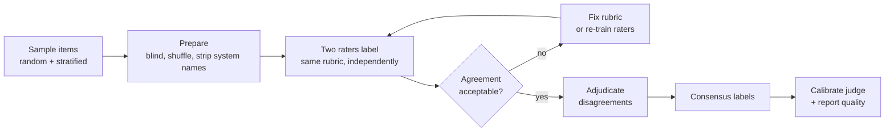

# Human Evaluation

> **Interview answer (say this first).** Human evaluation is people scoring model outputs against a rubric. It is the ground truth for quality, safety, and nuance, and it is the only way to calibrate any LLM judge. It is slow and expensive, so you use it sparingly: a small random sample per release, two raters per item, blind and randomised, with written instructions. Measure **inter-rater agreement** — Cohen's kappa for two raters, Fleiss' kappa for more — because low agreement means the rubric is broken, not the raters. Seed gold-standard items to catch careless raters, and adjudicate disagreements.

## Why this exists

Every other metric in this phase is a proxy. Rules check format. Judges approximate human taste. Neither can tell you whether an answer is genuinely helpful, safe, or fair. Humans can. That is why human evaluation stays in the pipeline even when it only touches 1% of traffic.

The trap is treating human labels as automatically correct. Two raters can read the same answer and disagree, and then you have no more truth than you started with — you have two opinions and a hidden disagreement. The fix is procedural: write the rubric before labelling, train the raters, label independently, measure agreement, and resolve conflicts with a documented process.

> **Note.** Low inter-rater agreement is a signal about your *rubric*, not your people. If two careful humans disagree, the question is ambiguous. Fix the instructions or split the label into finer categories before blaming the raters.

There is also a hard trade-off. Human labels are the most trustworthy signal and the least scalable. The whole craft of human evaluation is spending a small budget where it changes a decision: gating a release, calibrating a judge, or auditing a worrying trend.

## Start from zero

| Word | Plain meaning |
| --- | --- |
| **Rater / annotator** | A person who scores or labels outputs. |
| **Rubric** | The written guide that says what each score means. |
| **Annotation** | One rater's label for one item. |
| **Blind review** | The rater does not know which system produced the output. |
| **Randomised order** | Items are shown in a random order, so position cannot bias the whole set. |
| **Inter-rater agreement** | How often raters give the same label. |
| **Percent agreement** | Matching labels divided by total labels. Simple, but inflated by chance. |
| **Cohen's kappa** | Agreement between two raters, corrected for chance. |
| **Fleiss' kappa** | The same idea extended to three or more raters. |
| **Krippendorff's alpha** | A family of agreement measures that handles missing labels and many raters. |
| **Gold-standard item** | A pre-labelled item with a known answer, mixed in to test rater attention. |
| **Attention check** | A deliberately easy or nonsense item that a careless rater will fail. |
| **Adjudication** | A third person resolving a disagreement between two raters. |
| **Consensus label** | The final label after discussion or adjudication. |
| **Sampling frame** | The full set of items from which you draw the review sample. |
| **Stratified sample** | A sample that deliberately includes slices such as short, long, and multi-hop items. |
| **Calibration round** | A practice labelling session before the real one, to align raters. |
| **Rater drift** | A rater's standards slowly change over a long session. |
| **Annotation platform** | The tool raters use: Label Studio, Argilla, or an internal UI. |
| **Human-in-the-loop** | A pipeline where human review is a defined step, not an afterthought. |

Two distinctions to hold apart:

- **Agreement vs accuracy.** Two raters can agree with each other and both be wrong. Agreement measures consistency; gold items measure correctness.
- **Reliability vs validity.** Reliability is "do raters agree?". Validity is "does the label measure what we care about?". Kappa addresses the first; only careful rubric design addresses the second.

## The core idea

Picture two teachers grading the same stack of essays. If the essay is clearly excellent or clearly failing, both give the same grade. If it is borderline, they disagree. The disagreement is not about the teachers' skill; it is about where the boundary sits. To fix it, the school writes a grade guide with examples, has both teachers mark a practice stack together, and measures how often they agree afterwards.

Human evaluation is exactly that process applied to model outputs. A pipeline has four stages:



The three agreement measures map to the situation. Pick one and state which you used.

| Measure | Raters | Label type | Notes |
| --- | --- | --- | --- |
| **Percent agreement** | any | any | Easy to compute, misleading; ignores chance |
| **Cohen's kappa** | exactly 2 | categorical | The default for two raters |
| **Fleiss' kappa** | 3 or more | categorical | Assumes every item gets the same number of raters |
| **Weighted kappa** | exactly 2 | ordinal | Near misses count less than far misses |
| **Krippendorff's alpha** | any | any | Handles missing labels; the most general |

Kappa is interpreted roughly like this. Below 0.4 is poor. 0.4–0.6 is moderate. 0.6–0.8 is good. Above 0.8 is excellent. These are conventions, not laws, and the acceptable number depends on the risk of the decision the label feeds.

## How it works

1. **Decide what question the labels answer.** "Is this answer faithful?" and "Is this answer helpful?" are different tasks. One label per question. If you need both, run two passes.
2. **Write the rubric before seeing outputs.** Define each level with examples. Include the hard cases: refusals, partial answers, and answers that are correct but rude.
3. **Choose the sample.** Random gives you an unbiased rate. Stratified gives you power on the slices you care about. Most teams do both: a random base plus oversampled hard classes.
4. **Shuffle and blind.** Strip system names and model identifiers. Randomise item order. If raters know which system produced an output, they will find reasons to confirm it.
5. **Run a calibration round.** Both raters label the same 10–20 practice items and discuss. This aligns the rubric in practice, not just on paper.
6. **Label independently.** Raters must not see each other's labels. Independence is what makes agreement meaningful.
7. **Seed gold items.** Mix in pre-labelled items — about 5–10% of the batch — and check each rater's accuracy against them. A rater below threshold needs retraining, and their batch may be unusable.
8. **Compute agreement.** Cohen's kappa for two raters, Fleiss' kappa for three or more. Report it with the sample size and a confidence interval.
9. **Adjudicate disagreements.** A third person, or a discussion between the two, resolves each conflict. Record the resolution reason; those reasons are your rubric-improvement backlog.
10. **Use the labels twice.** First to report quality with confidence intervals, second to calibrate your LLM judge. A human-labelled sample is the only honest reference the judge has.

The formulas, in one place:

```text
percent agreement = matching labels / total labels
Cohen's kappa     = (observed - expected) / (1 - expected)        (two raters)
Fleiss' kappa     = (P_bar - P_e) / (1 - P_e)                     (many raters)
gold accuracy     = gold items labelled correctly / gold items
margin of error   = z * sqrt(p * (1 - p) / n)                     (z = 1.96 for 95%)
```

## The syntax you will use

**A rater instruction block.** Short, concrete, with examples. Raters skim long instructions.

```text
Task: label whether the answer is faithful to the evidence.
1. Read the evidence, then the answer.
2. Label SUPPORTED if every factual claim appears in the evidence.
3. Label UNSUPPORTED if any claim is missing or contradicts the evidence.
4. Label UNCLEAR only if the evidence itself is ambiguous.
Do not use world knowledge. Judge only against the evidence shown.
Examples: [link to 5 labelled examples]
```

**Blind and shuffle with a recorded seed.** Reproducibility matters when you audit a batch later.

```python
import random

def prepare(items, seed=7):
    rng = random.Random(seed)
    blinded = [{k: v for k, v in item.items() if k != "system"}   # strip the system name
               for item in items]
    rng.shuffle(blinded)                      # random order hides position
    return blinded, seed
```

**Build a stratified sample.** Take a random base plus extra hard cases, then record the weights.

```python
def stratified_sample(by_class, per_class=20, seed=7):
    rng = random.Random(seed)
    sample = []
    for label, rows in by_class.items():
        take = min(per_class, len(rows))
        sample.extend(rng.sample(rows, take))
    rng.shuffle(sample)
    return sample
```

**Cohen's kappa for two raters.** Observed agreement minus the agreement chance would produce.

```python
def cohen_kappa(a, b):
    n = len(a)
    observed = sum(x == y for x, y in zip(a, b)) / n
    labels = set(a) | set(b)                       # works for any number of categories
    expected = sum((a.count(c) / n) * (b.count(c) / n) for c in labels)
    return (observed - expected) / (1 - expected)
```

The general form is `expected = sum over categories c of p(c in A) * p(c in B)`, so this handles the three-label rubric (SUPPORTED / UNSUPPORTED / UNCLEAR), not just binary labels. The binary-only shortcut for the expected term is `p(A=1)*p(B=1) + p(A=0)*p(B=0)`.

**Fleiss' kappa for three or more raters.** The input is a count of labels per category, per item.

```python
def fleiss_kappa(table):
    n_items = len(table)
    n_raters = sum(table[0])
    total = n_items * n_raters
    p = [sum(row[j] for row in table) / total for j in range(len(table[0]))]
    P_i = [(sum(c * c for c in row) - n_raters) / (n_raters * (n_raters - 1))
           for row in table]
    P_bar = sum(P_i) / n_items
    P_e = sum(x * x for x in p)
    return (P_bar - P_e) / (1 - P_e)      # 1 = perfect, 0 = chance level
```

**A confidence interval for a proportion.** Always report the width; a 90% rate from 10 items is not the same as from 1000.

```python
def wilson(k, n, z=1.96):
    p = k / n
    d = 1 + z * z / n
    centre = (p + z * z / (2 * n)) / d
    half = z * ((p * (1 - p) / n + z * z / (4 * n * n)) ** 0.5) / d
    return centre - half, centre + half
```

**Check raters against gold items.** A rater whose gold accuracy is low is not producing usable labels.

```python
def gold_accuracy(rater, gold):
    return sum(r == g for r, g in zip(rater, gold)) / len(gold)

# rater accuracy above 0.9 is healthy; below 0.8, retrain and re-run the batch
```

## Examples: simple to real

**Example 1 — percent agreement flatters the raters.**

```text
rater A = [1, 1, 1, 1, 1, 1, 1, 1, 1, 0]
rater B = [1, 1, 1, 1, 1, 1, 1, 1, 1, 1]
percent agreement = 0.90
chance agreement  = 0.90
Cohen's kappa     = 0.00
```

Nine out of ten labels match, which sounds excellent. But both raters said "1" almost every time: rater B never said "0" at all, so chance alone would also produce 0.90 agreement. Kappa is `0.00` — the raters agree, but no more than guessing. Percent agreement flatters them; kappa exposes it.

**Example 2 — kappa removes the chance baseline.**

```text
human = [1, 1, 0, 1, 0, 0, 1, 1, 0, 1]
judge = [1, 1, 0, 1, 0, 1, 1, 0, 0, 1]
observed agreement = 0.8
kappa              = 0.5833
```

Eighty percent agreement falls to a moderate `0.58` once chance is removed. This is the number to report, alongside the raw agreement so readers can see the gap.

**Example 3 — Fleiss' kappa for three raters.**

```text
6 items, 3 raters, labels pass/fail
per-item counts = [[0,3], [1,2], [0,3], [2,1], [3,0], [0,3]]
Fleiss' kappa = 0.5
```

Average pairwise agreement, `P_bar`, is `0.7778`, but expected agreement is high, so kappa is `0.5`. Moderate agreement with three raters usually means the rubric needs another calibration pass before you scale the batch.

**Example 4 — gold items catch a careless rater.**

```text
gold  = [1, 0, 1, 1, 0, 1, 0, 0]
rater = [1, 0, 1, 0, 0, 1, 0, 1]
gold accuracy = 0.75
```

A healthy rater scores above 0.9 on items with known answers. `0.75` means this rater's labels are unreliable and the batch needs a second review. Gold items are cheap insurance.

**Example 5 — sampling error drives the review size.**

```text
0.90 from  10 items: 95% CI [0.596, 0.982]   width 0.386
0.90 from 100 items: 95% CI [0.826, 0.945]   width 0.119
0.90 from  ~10 items is almost meaningless
```

Human review is expensive, so teams sample. But a 10-item sample cannot distinguish a good system from a mediocre one. Size the sample so the confidence interval is narrower than the difference you care about detecting.

**Example 6 — the full script (verified).**

```python
def cohen_kappa(a, b):
    n = len(a)
    observed = sum(x == y for x, y in zip(a, b)) / n
    labels = set(a) | set(b)
    expected = sum((a.count(c) / n) * (b.count(c) / n) for c in labels)
    return (observed - expected) / (1 - expected)

def fleiss_kappa(table):
    n_items = len(table)
    n_raters = sum(table[0])
    total = n_items * n_raters
    p = [sum(row[j] for row in table) / total for j in range(len(table[0]))]
    P_i = [(sum(c * c for c in row) - n_raters) / (n_raters * (n_raters - 1))
           for row in table]
    P_bar = sum(P_i) / n_items
    P_e = sum(x * x for x in p)
    return (P_bar - P_e) / (1 - P_e)

def wilson(k, n, z=1.96):
    p = k / n
    d = 1 + z * z / n
    centre = (p + z * z / (2 * n)) / d
    half = z * ((p * (1 - p) / n + z * z / (4 * n * n)) ** 0.5) / d
    return centre - half, centre + half

def annotation_cost(items, raters, minutes_per_item, hourly_rate):
    hours = items * raters * minutes_per_item / 60
    return hours, hours * hourly_rate

print("cohen", round(cohen_kappa([1, 1, 0, 1, 0, 0, 1, 1, 0, 1],
                                 [1, 1, 0, 1, 0, 1, 1, 0, 0, 1]), 4))
print("fleiss", round(fleiss_kappa([[0, 3], [1, 2], [0, 3],
                                     [2, 1], [3, 0], [0, 3]]), 4))
lo, hi = wilson(40, 50)
print("agreement 40/50 CI", round(lo, 3), round(hi, 3))

hours, cost = annotation_cost(items=100, raters=2, minutes_per_item=1.5, hourly_rate=30)
print("hours", round(hours, 1), "cost", round(cost, 2))

gold = [1, 0, 1, 1, 0, 1, 0, 0]
rater_a = [1, 0, 1, 0, 0, 1, 0, 1]
print("gold accuracy", round(sum(a == g for a, g in zip(rater_a, gold)) / len(gold), 3))
```

Output (verified):

```text
cohen 0.5833
fleiss 0.5
agreement 40/50 CI 0.67 0.888
hours 5.0 cost 150.0
gold accuracy 0.75
```

The pattern to internalise: **report agreement, sample size, and interval together.** A quality number without them is an anecdote.

## In production

- **Write the rubric before you see the outputs.** If you write it while looking at results, you will define quality as "looks like the outputs we already have".
- **Two raters minimum, three for high stakes.** One rater gives a number with no way to measure its reliability. Two lets you compute kappa. Three lets you break ties by majority.
- **Blind the source system.** Raters who know which model produced an answer show confirmation bias. Strip names, shuffle order, and use neutral file names.
- **Seed gold items and attention checks.** Roughly 5–10% of each batch. This catches the rater who is clicking through, and it lets you drop an unusable batch.
- **Set a kappa floor before you start.** Pre-commit to what you will do if agreement is below it: retrain, rewrite the rubric, or split the label. Deciding after the fact invites motivated reasoning.
- **Adjudicate every disagreement for a while.** At first, review all conflicts to find rubric gaps. Once agreement is stable, sample the conflicts.
- **Randomise within rater, not just across raters.** A rater who scores 200 consecutive long answers drifts. Shuffle the stream and mix item types.
- **Watch for rater drift.** Compare each rater's first 20 and last 20 gold-item results. A significant difference means their standard moved during the session.
- **Sample, then weight.** A stratified sample is not representative unless you weight it back to the population. A random base sample gives you an unbiased overall rate.
- **Size the sample to the decision.** Use the margin of error to decide how many items you need. Reviewing 10 items to approve a release is theatre.
- **Budget the whole loop, not just labelling.** Instructions, calibration, adjudication, and analysis usually cost more than the raw labelling minutes.
- **Feed disagreements back into the rubric.** The reasons people disagree are the most valuable output of the exercise. They tell you what the rubric failed to define.

## Interview questions

### 1. When do you need human evaluation?

**Answer.** When the quality dimension cannot be reduced to a rule or a calibrated judge: safety, harm, fairness, tone, and genuinely nuanced helpfulness. Also whenever you need to trust an LLM judge, because human labels are its reference. And for a small ongoing audit, to catch failures that rules and judges share.

**Follow-up: "Why not just use a strong LLM judge everywhere?"** Because the judge was never validated on those hard cases, and its biases are largest exactly there. Using a judge with no human reference is measuring the judge's taste.

**Trap.** Running humans on everything. That is slow, expensive, and often less consistent than a well-calibrated judge for routine quality.

### 2. How do you write a good rater rubric?

**Answer.** Define each label in observable terms, give worked examples including hard cases, and state what knowledge the rater may use. Keep it short enough to read in a couple of minutes. Test it on a calibration batch, measure agreement, and revise the rubric where raters disagree. A rubric that produces low agreement is a failed rubric.

**Follow-up: "What about refusals and partial answers?"** They need their own categories or explicit rules. Lumping "refused correctly" with "wrong" corrupts the metric and punishes safe behaviour.

**Trap.** Writing a rubric full of abstract words like "helpful" and "high quality" with no examples. Raters then invent their own definitions and agreement collapses.

### 3. What is inter-rater agreement, and which statistic do you use?

**Answer.** It measures how often raters give the same label. Use Cohen's kappa for two raters, Fleiss' kappa for three or more, and weighted kappa or Krippendorff's alpha when labels are ordinal. Always report raw agreement next to kappa and include the sample size. Agreement is a property of the rubric and the training as much as of the raters.

**Follow-up: "What kappa threshold do you set?"** A common convention is below 0.4 poor, 0.4–0.6 moderate, 0.6–0.8 good, above 0.8 excellent. But a low-risk internal check can tolerate moderate agreement, while a safety gate should demand good or better.

**Trap.** Treating kappa as a measure of correctness. It measures consistency. Two raters can agree perfectly and both be wrong.

### 4. How do you detect and handle a careless rater?

**Answer.** Seed gold-standard and attention-check items with known labels throughout the batch, and track each rater's accuracy on them. Check timing per item for implausibly fast answers, and compare agreement with the rest of the panel. A rater below threshold is retrained and the batch re-reviewed; their labels are quarantined in the meantime.

**Follow-up: "What if only part of the batch is bad?"** Re-review the affected items with a different rater, and record which rater produced which label so you can drop or downstream-weight bad batches without losing the good ones.

**Trap.** Averaging a bad rater's labels with good ones. One noisy rater can drag a clean metric into a wrong direction.

### 5. How do you size a human evaluation sample?

**Answer.** From the decision. Decide how large a difference you need to detect, then choose a sample size whose confidence interval is narrower than that difference. For a proportion, the margin of error at 95% roughly falls with the square root of `n`: at a rate near 0.8 it is about 0.11 at 50 items and 0.04 at 400; at the worst-case rate of 0.5 it is about 0.14 and 0.05. Add more items for rare failures or for slices you care about.

**Follow-up: "Why is a random base plus strata useful?"** The random base gives an unbiased overall rate; the strata give enough examples of rare classes to say something about them. Report the overall rate from the random part, weighting if needed.

**Trap.** Reviewing 10–20 items and quoting a precise percentage. The interval is so wide that the number is nearly meaningless.

### 6. How do you keep human review blind and unbiased?

**Answer.** Strip system and model names, randomise item order, and do not tell raters the hypothesis. Show the same evidence the system saw, not a summary. Use a neutral interface that does not reveal which answer is the "new" one. For pairwise tasks, swap positions between raters or sessions.

**Follow-up: "What about rater expectations?"** Even blinded, raters carry priors. Mix in gold items and check for shifts. If a rater's later labels drift from their earlier ones, bias may be creeping in.

**Trap.** Running an A/B review where raters can see which answers are from the new system. That design mostly measures hope.

### 7. How does human evaluation feed an LLM judge?

**Answer.** The human-labelled sample is the judge's calibration set. Run the judge on the same items and compute agreement with the human consensus labels. If kappa is low, fix the rubric or the judge prompt before scaling. Repeat every time the judge model, prompt, or domain changes. The human sample also serves as a periodic audit once the judge is in production.

**Follow-up: "How much human data do you need for calibration?"** Enough to estimate agreement with a useful interval. A few dozen items per category is a common starting point; the harder the task, the more you need.

**Trap.** Calibrating once and never again. The judge drifts with model upgrades and the data distribution drifts with your users.

### 8. What does a human-in-the-loop evaluation pipeline look like end to end?

**Answer.** A trigger such as a release or a scheduled audit selects a random plus stratified sample. The pipeline blinds and shuffles items, assigns two raters, and interleaves gold items. Raters label independently in an annotation tool. The pipeline computes agreement, flags low-quality raters, and routes disagreements to adjudication. Consensus labels feed two things: a quality report with confidence intervals, and the calibration set for the LLM judge. Disagreement reasons become rubric changes for the next round.

**Follow-up: "Where do humans sit in production, not just offline?"** On escalation paths: high-risk output queues, user-flagged answers, and safety incidents. There, human review is a real-time gate with an SLA, which is a different design from offline evaluation.

**Trap.** Treating the human step as a one-off project. It is a recurring pipeline with owners, tooling, and a budget, or it quietly disappears after the first quarter.

## Remember this

- **Humans are the reference, not a formality.** They define quality and calibrate every judge you build.
- **Agreement is a rubric signal.** Measure kappa; low agreement means fix the rubric before scaling.
- **Blind, randomise, and seed gold items.** These three habits remove most bias and carelessness.
- **Sample to the decision, and report intervals.** A rate without a sample size and confidence interval is an anecdote.
- **Two raters minimum, adjudicate disagreements.** Independence plus resolution is what turns opinions into labels.
