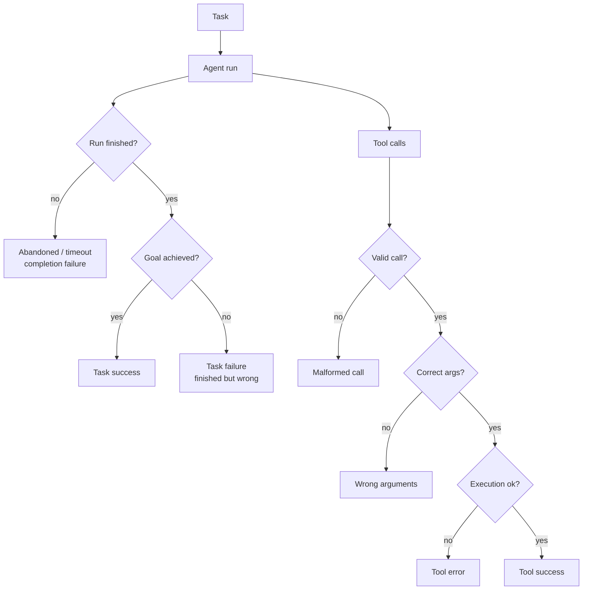

# Task and Tool Success Metrics

> **Interview answer (say this first).** **Task success** asks whether the user's goal was achieved. **Completion** asks whether the run finished at all. They are not the same: an agent can finish and be wrong, or stop early and still get the right answer. **Tool success** has three separate checks — was the call valid, were the arguments correct, did execution succeed. When you have a verifiable end state, measure success programmatically; when you do not, use a rubric or a judge. Report **success rate** alongside **partial credit**, and always break the numbers down **per task class**, because a global average hides the classes that fail.

## Why this exists

An agent can look busy and still fail. It can call ten tools, produce a confident answer, and be wrong. Or it can decide the task is impossible, stop early, and be right. A single "did it work?" number hides both cases.

Teams also conflate finishing with succeeding. A run that hits the step limit is a *completion* failure. A run that finishes with a wrong answer is a *success* failure. They need different fixes: one is a loop or budget problem, the other is a reasoning or data problem.

Tool metrics matter for a similar reason. "The tool call failed" is not one thing. A malformed call never reached the tool. A call with wrong arguments reached it and did the wrong thing. A well-formed call can fail because the tool itself is down. Collapsing these into one failure rate tells you something broke but not what to fix.

> **Note.** The most useful question is not "what is the success rate?" but "**which task classes** have a bad success rate, and **which part** of the pipeline is responsible?" A global number starts the conversation; the breakdown ends it.

## Start from zero

| Word | Plain meaning |
| --- | --- |
| **Task** | One user goal, such as "book a flight" or "answer this question". |
| **Run / trajectory** | One agent attempt at a task, including every tool call and message. |
| **Task success** | The goal was achieved. The output is correct and usable. |
| **Completion** | The run ended: it produced an answer or an explicit stop, rather than timing out or crashing. |
| **Abandonment** | The agent gave up, or hit a step or time limit. |
| **Partial credit** | A score between 0 and 1 when the task has several required parts. |
| **Milestone** | One required intermediate result in a multi-step task. |
| **Tool call** | A single request from the agent to an external function or API. |
| **Valid call** | The call is well formed: known tool name, parseable arguments, allowed schema. |
| **Correct arguments** | The arguments match what the task actually needs at that step. |
| **Execution success** | The tool ran without error and returned a usable result. |
| **Tool success rate** | Share of tool calls that pass all three checks. |
| **Tool precision / recall** | Precision: of the tools called, how many were needed. Recall: of the tools needed, how many were called. |
| **Task class** | A group of similar tasks, such as lookup, multi-hop, action, or extraction. |
| **Verifiable end state** | A fact you can check in code: a row exists, a file was written, an order was placed. |
| **Programmatic grading** | Deciding success with code and state checks rather than a human. |
| **Rubric grading** | Deciding success with a written guide and a judge or human. |
| **Escalation** | Handing the task to a human because the agent cannot finish it. |
| **User outcome** | The real-world result: was the ticket resolved, did the user stay, was time saved. |

Two distinctions to hold apart:

- **Success vs completion.** Completion is a property of the run. Success is a property of the result. A run can complete and fail, or time out and succeed.
- **Tool success vs task success.** Great tool metrics do not guarantee task success. An agent can call every tool correctly and still assemble the wrong answer.

## The core idea

Picture a food delivery. **Completion** is "the driver finished the trip". **Success** is "the right food arrived, hot, at the right address". A driver can complete a trip and deliver to the wrong door. A driver can abandon the trip at the door and still hand over the food. You need both numbers, and they mean different things.

An agent run has the same shape. It plans, calls tools, and produces a result. Success can be checked at the end, and tool quality can be checked at every step.



Success comes in two flavours: measured with a verifiable end state, or judged. Prefer the first whenever it exists.

| Signal | How it is measured | When to use | Trust |
| --- | --- | --- | --- |
| **End-state check** | Query the system: row created, order placed, file written | Tasks with side effects | High |
| **Exact-match check** | Compare the answer to a known answer | Lookup, extraction, calculations | High |
| **Unit-test style check** | Assert properties of the output | Structured output, code | High |
| **Rubric + judge** | A model scores against criteria | Open-ended quality | Medium, needs calibration |
| **Partial credit** | Weighted sum of milestones | Multi-step tasks | Medium |
| **User outcome** | Tickets resolved, thumbs-up, retention | Production only | High but delayed |

## How it works

1. **Define success per task before you run.** "The task succeeds when the target row exists and matches these fields." Write it down; do not decide after seeing results.
2. **Record completion separately.** Log whether the run ended normally, hit the step limit, timed out, or errored. These are different failure codes.
3. **Choose the grader.** If the end state is verifiable, write code to check it. If not, use a rubric with a judge or human, and calibrate it.
4. **Assign partial credit.** For tasks with required parts, weight each milestone and sum the achieved weight. Report both the binary success rate and the average partial credit.
5. **Check every tool call on three axes.** Validity, argument correctness, and execution. Store the three booleans, not one combined flag.
6. **Compare tools called against tools needed.** Compute precision and recall of tool selection. Calling an unnecessary tool costs money; missing a needed one causes failure.
7. **Segment by task class.** Publish success, completion, and tool metrics per class. This is where the actionable story lives.
8. **Add confidence intervals.** A success rate from 20 tasks is noisy. Report the interval with the rate.
9. **Link to user outcomes where you can.** Resolution rate, escalation rate, and repeat-contact rate are the business translation of task success.
10. **Feed failures back.** Every failure class becomes a test case, a prompt change, or a tool fix. Success metrics are inputs to a loop, not a scoreboard.

The formulas, in one place:

```text
task success rate   = successful runs / total runs
completion rate     = finished runs / total runs
partial credit      = sum(weight_i * milestone_i) / sum(weight_i)
tool valid rate     = valid calls / total calls
arg correctness     = calls with correct args / total calls
execution rate      = calls with successful execution / total calls
end-to-end tool rate= calls passing all three / total calls
tool precision      = needed tools called / tools called
tool recall         = needed tools called / tools needed
```

## The syntax you will use

**Success and completion as two separate ratios.** Never collapse them into one counter.

```python
def task_success_rate(runs):
    return sum(r["success"] for r in runs) / len(runs)

def completion_rate(runs):
    return sum(r["finished"] for r in runs) / len(runs)

# a run can be finished and unsuccessful, or unfinished and successful
```

**Per-class breakdown.** The same metric computed on slices, so a bad class cannot hide in the average.

```python
def by_class(runs, key):
    out = {}
    for r in runs:
        out.setdefault(r["class"], []).append(r[key])
    return {c: sum(v) / len(v) for c, v in out.items()}
```

**Weighted partial credit.** Weight the milestones by how much each matters, not by step count.

```python
def partial_credit(steps):
    if not steps:
        return 0.0
    return sum(s["weight"] * s["ok"] for s in steps) / sum(s["weight"] for s in steps)

# 1 of 4 weighted milestones done can score 0.29, not 0.25
```

**Grade tool calls on three axes.** Store each separately so you can tell a schema bug from an argument bug.

```python
def tool_metrics(calls):
    n = len(calls)
    return {
        "valid": sum(c["valid"] for c in calls) / n,
        "args_ok": sum(c["args_ok"] for c in calls) / n,
        "exec_ok": sum(c["exec_ok"] for c in calls) / n,
        "end_to_end": sum(c["valid"] and c["args_ok"] and c["exec_ok"]
                          for c in calls) / n,
    }
```

**Tool selection precision and recall.** Compare the set of tools called with the set the task needed.

```python
def tool_selection(expected, called):
    expected, called = set(expected), set(called)
    tp = len(expected & called)
    precision = tp / len(called) if called else 0.0
    recall = tp / len(expected) if expected else 0.0
    return precision, recall
```

**A programmatic end-state check.** This is the highest-trust success signal when it exists.

```python
def verify_booking(run, db):
    row = db.find_order(run.order_id)
    return (row is not None
            and row.status == "confirmed"
            and row.price == run.expected_price)     # success is a real-world fact
```

**Wilson interval for a success rate.** Small evaluations need intervals, not point estimates.

```python
def wilson(k, n, z=1.96):
    p = k / n
    d = 1 + z * z / n
    centre = (p + z * z / (2 * n)) / d
    half = z * ((p * (1 - p) / n + z * z / (4 * n * n)) ** 0.5) / d
    return centre - half, centre + half
```

## Examples: simple to real

**Example 1 — success and completion diverge.**

```text
7 runs
success rate    = 3 / 7 = 0.4286
completion rate = 5 / 7 = 0.7143
```

Two runs never finished, and two finished with a wrong answer. The completion rate looks acceptable while the success rate is poor. Reporting only completion would flatter the system.

**Example 2 — the per-class view finds the real problem.**

```text
lookup    success 0.667  completion 1.0
multi-hop success 0.333  completion 0.667
action    success 0.0    completion 0.0
```

The action class never finishes and never succeeds; the lookup class always finishes. A global success rate of `0.43` hides that one whole class is broken. This is why segmenting is the first analysis, not an afterthought.

**Example 3 — partial credit is fairer than pass/fail.**

```text
steps: parse(1) ok, retrieve(2) ok, call tool(3) failed, format(1) failed
weighted partial credit = (1 + 2 + 0 + 0) / 7 = 0.4286
```

The binary view marks this run a total failure. Partial credit records that the agent got most of the way there. Use partial credit to rank systems and binary success to gate releases.

**Example 4 — tool calls fail in different places.**

```text
valid call rate        = 0.75
correct args rate      = 0.50
execution success rate = 0.25
end-to-end tool success= 0.25
```

Three of four calls were well formed, but only half had the right arguments, and only one executed cleanly. The fix order is clear: schema first, then argument quality, then the tool itself. A single "tool failure rate" of `0.75` would not have told you where to start.

**Example 5 — tool selection precision and recall.**

```text
expected tools = {search, calculator}
called tools   = {search, weather, calculator}
precision = 0.667   recall = 1.0   F1 = 0.8
```

The agent found every required tool but also called an unnecessary one. High recall with lower precision means wasted latency and cost, not wrong answers. Tracking both catches the "calls everything" agent.

**Example 6 — the full script (verified).**

```python
def rate(rows, key):
    return sum(r[key] for r in rows) / len(rows)

def partial_credit(steps):
    return sum(s["weight"] * s["ok"] for s in steps) / sum(s["weight"] for s in steps)

def wilson(k, n, z=1.96):
    p = k / n
    d = 1 + z * z / n
    centre = (p + z * z / (2 * n)) / d
    half = z * ((p * (1 - p) / n + z * z / (4 * n * n)) ** 0.5) / d
    return centre - half, centre + half

results = [
    {"finished": True,  "success": True,  "class": "lookup"},
    {"finished": True,  "success": True,  "class": "lookup"},
    {"finished": True,  "success": False, "class": "lookup"},
    {"finished": True,  "success": True,  "class": "multi-hop"},
    {"finished": True,  "success": False, "class": "multi-hop"},
    {"finished": False, "success": False, "class": "multi-hop"},
    {"finished": False, "success": False, "class": "action"},
]
print("success", round(rate(results, "success"), 4))
print("completion", round(rate(results, "finished"), 4))
for c in ("lookup", "multi-hop", "action"):
    rows = [r for r in results if r["class"] == c]
    print(c, "success", round(rate(rows, "success"), 3),
          "completion", round(rate(rows, "finished"), 3))

run = [{"weight": 1, "ok": 1}, {"weight": 2, "ok": 1},
       {"weight": 3, "ok": 0}, {"weight": 1, "ok": 0}]
print("partial credit", round(partial_credit(run), 4))
lo, hi = wilson(41, 50)
print("success 0.82 CI", round(lo, 3), round(hi, 3))
```

Output (verified):

```text
success 0.4286
completion 0.7143
lookup success 0.667 completion 1.0
multi-hop success 0.333 completion 0.667
action success 0.0 completion 0.0
partial credit 0.4286
success 0.82 CI 0.692 0.902
```

The pattern to internalise: **a success rate is only a summary.** The breakdown by class and the tool-level details are what tell you what to fix.

## In production

- **Define success before you look at outputs.** Writing the definition after seeing results is how you end up measuring "did it produce something plausible".
- **Prefer verifiable end states.** If the task changes the world, check the world. A database query is a stronger success signal than any judge.
- **Keep completion and success as separate metrics.** They diagnose different problems. A completion collapse is a budget or loop bug; a success gap is a reasoning or data bug.
- **Log a failure code for every failed run.** Timeout, step limit, invalid tool call, tool error, wrong answer, refusal. Aggregating these into "failed" throws away the diagnosis.
- **Report partial credit for multi-step tasks.** Pass/fail loses the difference between a near miss and a total failure, which is exactly the difference you need to rank systems.
- **Segment by task class, language, and input length.** Global averages hide the classes that fail. The hardest class is usually the one with the fewest users and the loudest complaints.
- **Include the sample size and interval.** `0.82` from 50 tasks has a wide interval. Do not compare two systems on overlapping intervals.
- **Grade tools on all three axes.** Validity, arguments, and execution fail for different reasons. One combined rate sends you to the wrong fix.
- **Watch for tool over-calling.** Precision below recall means the agent calls tools it does not need. That costs latency and money and can change state by accident.
- **Do not let a single retry count as success and hide the retry.** A task that succeeds on the third attempt consumed triple the cost and latency. Track attempts per task.
- **Treat correct refusals as their own category.** An agent that correctly says "I cannot do that safely" is a success for that task, not a failure. Decide the policy before measuring.
- **Connect success to user outcomes.** Resolution rate, escalation rate, and repeat contact are the business view. A success metric nobody links to a user outcome gets ignored at budget time.

## Interview questions

### 1. What is the difference between task success and completion?

**Answer.** Completion means the run ended — it produced an answer or stopped cleanly instead of timing out or crashing. Task success means the user's goal was actually achieved. An agent can complete and be wrong, or stop early and still be right. Track both separately, because completion failures and success failures have different causes and different fixes.

**Follow-up: "Can success be higher than completion?"** Yes. An agent can time out at the step limit after already performing the correct action, or stop early with a correct partial result. That is why you grade the end state, not just the run status.

**Trap.** Using completion rate as a proxy for success. It is easier to measure but it rewards finishing, not helping.

### 2. How do you measure task success when there is no verifiable end state?

**Answer.** Use a rubric and a grader: a human for calibration, or an LLM judge calibrated against humans. Define the criteria and the acceptable answer types in advance. Add partial credit for multi-part tasks. Where possible, create a small verifiable subset — a golden set with known answers — to anchor the judged metric.

**Follow-up: "What makes a good rubric for task success?"** Observable criteria tied to the goal: required facts present, no unsupported claims, correct format, and a safe refusal when the task is out of scope. Vague criteria like "helpful" produce low agreement.

**Trap.** Judging success by the agent's own summary of what it did. The summary is generated, not verified. Check the tool outputs and end state.

### 3. What does tool success mean, and why split it into parts?

**Answer.** A tool call can fail at three points: the call is malformed, the arguments are wrong, or the tool itself errors. Each has a different fix — schema or prompt for validity, planning or context for arguments, the tool or dependency for execution. Splitting the metric tells you where to invest. A single failure rate tells you only that something is wrong.

**Follow-up: "How do you know the arguments were correct?"** Compare against the task's requirements or an expected argument set. For evaluations, hand-label a sample. In production, detect it downstream: if the tool ran but the result did not help, the arguments may have been wrong.

**Trap.** Counting a 4xx from a downstream API as a tool failure. A validation error may be an argument bug, not an outage. Classify by cause.

### 4. How do you measure tool selection quality?

**Answer.** Compare the set of tools the agent called with the set the task required. Precision is required tools called divided by total tools called. Recall is required tools called divided by required tools. High recall with low precision means the agent calls too much; low recall means it misses a step. Track both, plus the order when order matters.

**Follow-up: "Why is over-calling a problem if the answer is right?"** It costs latency and money, can mutate state twice, and makes failures harder to trace. It also usually predicts failure on the next, harder task.

**Trap.** Only checking whether the final answer is correct. An agent that calls the wrong tool and guesses right passes today and fails tomorrow.

### 5. What is partial credit and when should you use it?

**Answer.** Partial credit gives a score between 0 and 1 based on how many required parts of the task were achieved, weighted by importance. Use it for multi-step tasks where a near miss and a total failure are different outcomes. Report it alongside binary success: partial credit ranks systems and tracks progress, while binary success gates releases.

**Follow-up: "How do you set the weights?"** From user impact. A step without which the task is useless gets a high weight; a cosmetic step gets a low one. Validate the weights by checking that higher partial credit correlates with better human judgements.

**Trap.** Averaging partial credit into a "success rate". They answer different questions. Keep them as separate columns.

### 6. How do you analyse success by task class?

**Answer.** Assign every evaluation task a class before running, then compute success, completion, tool metrics, cost, and latency per class. Look for classes with low success but high volume, and classes with low volume but severe failures. This turns a flat average into a prioritised list and stops a strong class from masking a broken one.

**Follow-up: "How do you handle classes with very few examples?"** Report the interval and do not over-interpret. Pool related classes, or oversample the rare class in the evaluation set so you can say something with confidence.

**Trap.** Choosing classes after seeing results to make the numbers look better. Define the taxonomy first and keep it stable across releases.

### 7. How do you connect task success to user outcomes?

**Answer.** Track production proxies: escalation rate, repeat-contact rate, thumbs-up or thumbs-down, task abandonment, and time to resolution. Then correlate them with offline task success. If offline success rises while escalations do not fall, your definition of success is wrong or incomplete. For agentic systems with side effects, also track rollback and undo rates.

**Follow-up: "What if the offline metric and the user signal disagree?"** Treat it as a definition bug. Re-examine the evaluation set for distribution drift, or for success criteria that do not match what users value. The user signal wins.

**Trap.** Optimising the offline metric to a number while the user outcome stays flat. That is Goodhart's law with a dashboard.

### 8. How do you evaluate an agent that must decide when to stop or ask for help?

**Answer.** Treat stopping correctly as its own success category. An agent that asks a clarifying question when the task is ambiguous should score well, not be marked as failing to complete. Track three outcomes: solved autonomously, correctly escalated or asked, and wrongly escalated or asked. The cost of a wrong escalation is user friction; the cost of a wrong guess is a bad action. Tune the threshold with those costs in mind.

**Follow-up: "How do you set that threshold?"** With expected cost. Estimate the cost of a wrong action and the cost of an unnecessary question, then choose the confidence level that minimises total expected cost. Review it with real outcomes.

**Trap.** Rewarding only autonomous completion. That pushes the agent to guess under uncertainty, which is exactly the behaviour that causes unsafe actions.

## Remember this

- **Success is the goal met; completion is the run ending.** Measure both, and never substitute one for the other.
- **Grade tools on three axes.** Valid call, correct arguments, successful execution — each has a different fix.
- **Partial credit plus binary success.** One ranks systems, the other gates releases.
- **Segment by task class.** The average hides the class that is actually broken.
- **Prefer a verifiable end state.** Checking the world beats asking a model whether the world changed.
