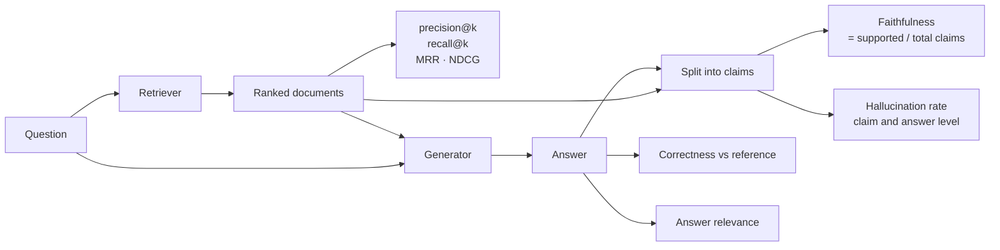

# Quality Metrics

> **Interview answer (say this first).** Quality metrics turn "is the answer good?" into numbers. **Hallucination rate** is the share of unsupported claims. **Retrieval quality** is precision, recall, MRR, and NDCG over the ranked documents. **Answer correctness** compares the answer to a trusted reference. **Faithfulness** (groundedness) asks whether each claim is supported by the retrieved evidence. **Factuality** asks whether it is true in the world; faithfulness only asks whether the evidence supports it, so the two differ when the evidence is wrong. Some metrics are **reference-based** and need a gold answer; others are **reference-free**. Every rate is an estimate, so always report the sample size and a confidence interval.

## Why this exists

A single "quality score" hides too much. When quality drops, you need to know whether retrieval got worse, the model started ignoring context, or the corpus itself is stale. That requires separate metrics for the retriever and the generator, plus a way to measure truth separately from grounding.

Teams also mix up two ideas that sound the same. **Faithfulness** means the answer agrees with the retrieved evidence. **Factuality** means the answer agrees with the world. If the retrieved document is outdated, a perfectly faithful answer is factually wrong. Naming them correctly is what lets you say "the model is grounded, our corpus is stale" instead of "quality is down".

Finally, all these numbers are estimates from samples. A hallucination rate of `0.1` from 10 answers has a 95% Wilson interval of about `[0.02, 0.40]`: the true rate could be near zero or as high as 40%. Reporting the point estimate alone invites decisions that the data cannot support.

> **Note.** Faithfulness is a property of the *answer and the evidence*. Factuality is a property of the *answer and the world*. Measure faithfulness when you have context; measure factuality when you have trusted references. Do not use one to claim the other.

## Start from zero

| Word | Plain meaning |
| --- | --- |
| **Claim** | One factual statement in the answer, usually a sentence. |
| **Hallucination** | A claim that the evidence does not support, or that contradicts it. |
| **Hallucination rate** | Share of claims (or answers) that contain a hallucination. |
| **Faithfulness / groundedness** | Supported claims divided by total claims, judged against the retrieved context. |
| **Factuality** | Whether the claim is true in the world, judged against trusted references. |
| **Answer correctness** | How well the answer matches the required answer or facts. |
| **Answer relevance** | Whether the answer addresses the question asked. |
| **Retrieval quality** | How good the ranked list of retrieved documents is. |
| **Precision@k** | Of the top k documents, what fraction are relevant. |
| **Recall@k** | Of all relevant documents, what fraction appear in the top k. |
| **MRR** | Mean reciprocal rank: `1 / rank` of the first relevant result, averaged. |
| **NDCG** | Normalised discounted cumulative gain: rewards relevant results near the top. |
| **Relevant** | A document or claim that helps answer the question. Label it before measuring. |
| **Reference-based** | The metric needs a known-good answer, such as exact match against a gold answer. |
| **Reference-free** | The metric works without a gold answer, such as faithfulness against context. |
| **Ground truth** | Trusted labels, usually human. |
| **Sampling error** | The gap between a sample estimate and the true value, caused by measuring only part of the data. |
| **Confidence interval** | A range that likely contains the true value, for example 95% of the time. |
| **Base rate** | How common the thing is overall. Rare failures need big samples to measure. |

Two pairs are easy to confuse:

- **Faithfulness vs factuality.** Faithfulness is grounding in the evidence. Factuality is truth in the world. High faithfulness with a bad corpus still misleads users.
- **Retrieval quality vs answer quality.** A perfect retriever can be followed by a bad generator, and a poor retriever can be rescued by a lucky prior. Measure both.

## The core idea

Think of a library research desk. A **librarian** pulls the books that might answer your question — that is retrieval quality. A **writer** reads those books and writes an answer — that is generation quality. Then a **fact-checker** compares each sentence in the answer to the books on the desk — that is faithfulness, not factuality. If the books themselves are wrong, the fact-checker still passes the answer.

The pipeline maps cleanly onto metrics:



Two families of metric sit on top of that pipeline. Reference-based metrics need a gold answer; reference-free metrics do not.

| Metric | Needs a reference? | Measures | Main failure mode |
| --- | --- | --- | --- |
| **Exact match** | Yes | Correctness for short answers | Fails on any paraphrase |
| **Token F1** | Yes | Correctness with wording tolerance | Rewards word overlap, not meaning |
| **Answer correctness (rubric)** | Yes | Correctness for open answers | Needs human calibration |
| **Faithfulness** | No | Grounding in context | Blind to a wrong corpus |
| **Hallucination rate** | No | Unsupported content | Sensitive to claim splitting |
| **Answer relevance** | No | Addresses the question | Can reward fluent dodging |
| **Precision@k / recall@k** | Yes (relevance labels) | Retrieval | Needs labelled relevant docs |
| **MRR / NDCG** | Yes (relevance labels) | Ranking quality | NDCG depends on gain design |

## How it works

1. **Decide what "relevant" and "supported" mean before labelling.** These are human judgements; the metric only counts them. Write examples.
2. **Split the answer into claims.** A sentence is a good first unit. Long sentences can be split further at "and" or semicolons.
3. **Check each claim against the right evidence.** Faithfulness uses the retrieved context. Factuality uses trusted references or a fact database.
4. **Compute faithfulness and hallucination rate.** Claim-level is the base metric; answer-level is what users feel.
5. **Label retrieved documents.** A human or a calibrated judge marks each retrieved document relevant or not to the question.
6. **Compute retrieval metrics.** Precision@k, recall@k, MRR, and NDCG from the labelled ranking.
7. **Measure correctness where you have references.** Exact match for short factual answers, a rubric for open text, or property checks for structured output.
8. **Keep factuality and faithfulness in separate buckets.** Different evidence, different failure modes, different fixes.
9. **Estimate the uncertainty.** Treat each rate as a proportion and report a confidence interval. Segmented metrics have wider intervals.
10. **Aggregate, then segment.** A global score starts the investigation; the breakdown by task class and document type finds the cause.

The formulas, in one place:

```text
faithfulness          = supported claims / total claims
hallucination (claim) = 1 - faithfulness
hallucination (answer)= answers with >=1 unsupported claim / total answers
precision@k           = relevant docs in top k / k
recall@k              = relevant docs in top k / total relevant docs
MRR                   = average of 1 / rank of first relevant doc
NDCG@k                = DCG@k / ideal DCG@k
correctness           = correct answers / total answers (or rubric score)
standard error        = sqrt(p * (1 - p) / n)          for a rate p
95% interval (normal) = p +/- 1.96 * standard error    (approximation; examples below use Wilson)
95% interval (Wilson) = centre +/- half, where
  centre              = (p + z^2 / (2n)) / (1 + z^2 / n)
  half                = z * sqrt(p(1-p)/n + z^2/(4n^2)) / (1 + z^2 / n)
```

## The syntax you will use

**Split the answer into claims.** Claim granularity changes the score, so fix it and keep it.

```python
import re

def split_claims(answer):
    return [s.strip() for s in re.split(r"(?<=[.!?])\s+", answer) if s.strip()]
```

**Rule-based support against the context.** Fast and free; use an entailment model or judge for subtle cases.

```python
def supported(claim, context, threshold=0.6):
    claim_words = set(claim.lower().split())
    if not claim_words:
        return True
    covered = claim_words & set(context.lower().split())
    return len(covered) / len(claim_words) >= threshold
```

**Hallucination rate at both levels.** Report which one you mean; they differ a lot.

```python
def hallucination_rates(answers):
    total = bad = bad_answers = 0
    for claims in answers:                    # each item is a list of bools
        unsupported = sum(not c for c in claims)
        total += len(claims)
        bad += unsupported
        bad_answers += unsupported > 0
    return bad / total, bad_answers / len(answers)
```

**Precision@k and recall@k.** The two halves of retrieval quality.

```python
def precision_at_k(ranked, relevant, k):
    return sum(d in relevant for d in ranked[:k]) / k

def recall_at_k(ranked, relevant, k):
    return sum(d in relevant for d in ranked[:k]) / len(relevant)
```

**MRR and NDCG.** MRR cares only about the first hit; NDCG rewards good ordering throughout.

```python
import math

def reciprocal_rank(ranked, relevant):
    for i, d in enumerate(ranked, start=1):
        if d in relevant:
            return 1 / i
    return 0.0

def ndcg_at_k(ranked, relevant, k):
    dcg = lambda gains: sum(g / math.log2(i + 1) for i, g in enumerate(gains, 1))
    gains = [1 if d in relevant else 0 for d in ranked[:k]]
    ideal = dcg(sorted(gains, reverse=True))
    return dcg(gains) / ideal if ideal else 0.0
```

**A reference-free check and a reference-based check side by side.** Faithfulness needs no gold answer; correctness does.

```python
def answer_correct(prediction, reference, threshold=0.6):
    p = set(prediction.lower().split())
    r = set(reference.lower().split())
    return len(p & r) / len(r) >= threshold if r else False
```

**Confidence intervals for any rate.** The Wilson interval behaves better than the normal approximation for small samples and extreme rates.

```python
def wilson(k, n, z=1.96):
    p = k / n
    d = 1 + z * z / n
    centre = (p + z * z / (2 * n)) / d
    half = z * ((p * (1 - p) / n + z * z / (4 * n * n)) ** 0.5) / d
    return centre - half, centre + half
```

## Examples: simple to real

**Example 1 — faithfulness and hallucination rate.**

```text
4 answers, claims marked supported/unsupported:
[True, True, False], [True, True], [False, False], [True, True, True]

claim-level hallucination rate  = 3 / 10 = 0.3
answer-level hallucination rate = 2 / 4  = 0.5
```

A third of claims are unsupported, but half of the answers contain at least one bad claim. Answer-level is harsher and usually closer to what the user experiences.

**Example 2 — retrieval precision, recall, and MRR.**

```text
ranked    = [d3, d1, d7, d2, d9]
relevant  = {d1, d2, d5}

precision@3 = 1 / 3 = 0.333
recall@3    = 1 / 3 = 0.333      (only d1 is in the top 3)
MRR         = 1 / 2 = 0.5        (first relevant doc is at rank 2)
```

The retriever found one relevant document early, then filled the list with noise. Low precision means the model gets distracted; low recall means it may not have the answer at all.

**Example 3 — NDCG rewards putting relevant docs first.**

```text
ndcg@5 = 0.6509
```

NDCG discounts results by position, so a relevant document at rank 1 contributes more than the same document at rank 5. It is the metric to use when order matters, such as when you can only pass the top 3 chunks to the model.

**Example 4 — reference-based checks are brittle in both directions.**

```text
correct("The refund window is 30 days", "The refund window is 30 days") = True
correct("You can get a refund within 30 days", "The refund window is 30 days") = False
```

The second answer is correct in meaning but shares too few exact words. This is why reference-based overlap fails on paraphrase, and why open answers need a rubric or a judge instead of string comparison.

**Example 5 — sample size changes what you can claim.**

```text
0.90 from 1000 items: 95% CI [0.880, 0.917]   width 0.037
0.90 from  100 items: 95% CI [0.826, 0.945]   width 0.119
0.90 from   10 items: 95% CI [0.596, 0.982]   width 0.386
```

The same `0.90` means very different things at different sample sizes. The 10-item result cannot rule out a mediocre system. Always publish the interval with the rate.

**Example 6 — the full script (verified).**

```python
import math

def hallucination_rates(answers):
    total = bad = bad_answers = 0
    for a in answers:
        u = sum(not c for c in a)
        total += len(a)
        bad += u
        bad_answers += u > 0
    return bad / total, bad_answers / len(answers)

def precision_at_k(ranked, relevant, k):
    return sum(d in relevant for d in ranked[:k]) / k

def recall_at_k(ranked, relevant, k):
    return sum(d in relevant for d in ranked[:k]) / len(relevant)

def ndcg_at_k(ranked, relevant, k):
    dcg = lambda gs: sum(g / math.log2(i + 1) for i, g in enumerate(gs, 1))
    gains = [1 if d in relevant else 0 for d in ranked[:k]]
    ideal = dcg(sorted(gains, reverse=True))
    return dcg(gains) / ideal if ideal else 0.0

def wilson(k, n, z=1.96):
    p = k / n
    d = 1 + z * z / n
    centre = (p + z * z / (2 * n)) / d
    half = z * ((p * (1 - p) / n + z * z / (4 * n * n)) ** 0.5) / d
    return centre - half, centre + half

answers = [[True, True, False], [True, True], [False, False], [True, True, True]]
cl, al = hallucination_rates(answers)
print("hallucination claim", round(cl, 4), "answer", round(al, 4))

ranked = ["d3", "d1", "d7", "d2", "d9"]
relevant = {"d1", "d2", "d5"}
print("precision@3", round(precision_at_k(ranked, relevant, 3), 4))
print("recall@3", round(recall_at_k(ranked, relevant, 3), 4))
print("ndcg@5", round(ndcg_at_k(ranked, relevant, 5), 4))

lo, hi = wilson(90, 100)
print("0.90 over 100 CI", round(lo, 3), round(hi, 3))
lo, hi = wilson(9, 10)
print("0.90 over 10 CI", round(lo, 3), round(hi, 3))
```

Output (verified):

```text
hallucination claim 0.3 answer 0.5
precision@3 0.3333
recall@3 0.3333
ndcg@5 0.6509
0.90 over 100 CI 0.826 0.945
0.90 over 10 CI 0.596 0.982
```

The pattern to internalise: **state the metric, the level, and the interval every time.** "Hallucination is down" is not a finding; "answer-level hallucination rate fell from 0.18 to 0.11 over 400 answers, 95% CI [0.08, 0.15]" is.

## In production

- **Separate retrieval from generation.** Compute retrieval metrics before generation metrics. This tells you whether a bad answer came from bad evidence or bad use of good evidence.
- **Prefer answer-level hallucination for user-facing gates.** One bad claim makes the whole answer untrustworthy, even when claim-level faithfulness stays high.
- **Fix the evidence before blaming the model.** If precision@k is low, the generator was handed noise and used it faithfully. High faithfulness with low answer quality is a retrieval bug.
- **Remember faithfulness is not factuality.** A grounded answer over a stale corpus is still wrong. Keep a small factuality set with trusted references.
- **Watch the claim-splitting rule.** Changing it changes the score. Version it with the metric, and never compare numbers computed with different splitters.
- **Use relevance labels for retrieval metrics, and define them once.** `precision@k` and `recall@k` are only as good as the labels. Share the rubric across runs.
- **Report intervals, not just point estimates.** Especially for segmented metrics, where a per-language rate may rest on a few dozen items. Overlapping intervals mean the difference is not shown.
- **Beware base rates.** A failure that happens 1% of the time needs a large sample to detect. If you care about rare but severe failures, oversample them and report the weighted result.
- **Do not average away the hard classes.** A global faithfulness of 0.95 with 0.5 on multi-hop questions is a system that fails its hardest users.
- **Pin the metric definitions.** Version the prompt, the judge, and the claim splitter next to the numbers, so a metric change is visible and not mistaken for a quality change.
- **Triangulate with online signals.** Thumbs-down, escalation, and follow-up rate catch quality problems your offline set does not contain.
- **Treat metrics as instrumentation, not goals.** The moment a metric becomes the target, the system is optimised against the metric rather than the user.

## Interview questions

### 1. What is the difference between faithfulness and factuality?

**Answer.** Faithfulness, also called groundedness, asks whether each claim is supported by the retrieved evidence. Factuality asks whether the claim is true in the world. They differ when the evidence is wrong or outdated: a faithful answer can be factually false. Measure faithfulness when you have context; measure factuality against trusted references or a knowledge base.

**Follow-up: "Which is more practical in a RAG system?"** Faithfulness, because it needs no gold answer and it directly targets the most common failure: the model inventing or contradicting content. Factuality needs a maintained source of truth.

**Trap.** Claiming factuality from a faithfulness score. That hides corpus problems behind a clean-looking number.

### 2. How do you measure hallucination rate?

**Answer.** Split the answer into claims, check each against the retrieved context, and count the unsupported ones. Claim-level rate is one minus faithfulness. Answer-level rate is the share of answers with at least one unsupported claim. Report the level, the claim count, and the interval. The two levels often differ a lot.

**Follow-up: "Why is answer-level higher?"** Every answer with a single bad claim counts fully, so the rate rises with answer length. Users experience one bad claim as a bad answer, which is why the answer-level number matters.

**Trap.** Using raw string containment as the support check. A paraphrase can be faithful with no shared phrase, and a fluent falsehood can share many words. Containment is a filter, not a verdict.

### 3. What makes retrieval quality, and which metric should you pick?

**Answer.** Retrieval quality is how well the ranked documents serve the question. Use precision@k when the model only sees a few chunks and noise is costly, recall@k when missing a relevant document is the main risk, MRR when you care about the first good hit, and NDCG when ordering matters within the top k. Ideally track one precision-style and one recall-style metric together.

**Follow-up: "Can recall be high while answers are bad?"** Yes. Retrieval can find everything and the generator can still ignore it or reason badly. That is a generation problem, not a retrieval problem.

**Trap.** Optimising recall alone by retrieving more documents. Extra context costs tokens, adds latency, and can distract the model. Track precision too.

### 4. What is the difference between reference-based and reference-free metrics?

**Answer.** Reference-based metrics compare the answer to a known-good reference; exact match and token F1 are examples. Reference-free metrics judge the answer against the question and the retrieved evidence, with no gold answer; faithfulness and answer relevance are examples. Reference-based metrics are objective but brittle on paraphrase and expensive to maintain. Reference-free metrics scale but need calibration.

**Follow-up: "When do you need references?"** For correctness on factual tasks, for regression tests with fixed expected outputs, and for calibrating the reference-free metrics. A small reference set anchors a large reference-free one.

**Trap.** Assuming a reference answer is the only correct one. Many phrasings are right, and exact match punishes the wrong ones.

### 5. How do sampling error and confidence intervals change your conclusions?

**Answer.** Every rate is estimated from a sample, so it carries uncertainty. For a proportion, the standard error is `sqrt(p(1-p)/n)`; report a 95% interval, preferably Wilson's, which behaves better at small `n` and extreme rates. Compare intervals, not point estimates. If two systems' intervals overlap, the evaluation has not shown a difference.

**Follow-up: "How many samples do you need?"** Enough that the interval is narrower than the difference you care about detecting. Roughly, the margin of error falls with the square root of the sample size, so halving it takes about four times the data.

**Trap.** Treating a small per-segment number as precise. Splitting a 100-item set into five classes leaves 20 items per class and very wide intervals.

### 6. How do you pick the claim unit for faithfulness?

**Answer.** A sentence is the default. Long compound sentences can be split further, and very short sentences can be merged into a claim. The choice changes the score, so fix it, version it, and use the same splitter for every comparison. More granular claims give a sharper faithfulness signal but more chances for the support check to fail on phrasing.

**Follow-up: "What about answers with no factual claims?"** Opinions, instructions, and refusals are not factual claims. Score them with their own category or exclude them, and say which. Mixing them into faithfulness dilutes the metric.

**Trap.** Changing the splitter mid-project and reading the resulting jump as a quality improvement.

### 7. How do you catch quality problems that offline metrics miss?

**Answer.** Add online signals: thumbs-up and thumbs-down, escalation rate, follow-up-question rate, regeneration rate, and session abandonment. Compare them against your offline metrics. When they disagree, the offline evaluation set is missing a slice of real traffic. Keep a rolling human-audited sample to spot new failure types, and update the evaluation set with them.

**Follow-up: "Why can offline quality rise while users are unhappy?"** The evaluation set drifts from production traffic, or the success criteria do not match what users value. Both are definition problems, not measurement problems.

**Trap.** Relying on one offline number for a release decision. Offline evaluation covers what you thought to test; production covers what users actually do.

### 8. How do these quality metrics change for agentic systems?

**Answer.** An agent produces a trajectory, not a single answer. Faithfulness must be checked against the tool output each step actually saw, not a final document. Retrieval metrics apply to each search the agent runs. Correctness applies to the final answer, but also to intermediate state changes. You add agent-specific metrics on top: tool success, loop rate, and steps to completion. A correct final answer from a lucky wrong trajectory should not score full quality.

**Follow-up: "What is the most common agentic quality mistake?"** Grading only the final answer. The trajectory is where the cost, the risk, and the next failure live. Also, the agent's stated reasoning is generated text and must be verified like any other claim.

**Trap.** Rewarding long trajectories as "thorough". Extra steps usually mean higher cost and more chances to fail, so track steps alongside quality.

## Remember this

- **Faithfulness is grounding; factuality is truth.** Keep them in separate buckets with different evidence.
- **Measure retrieval and generation separately.** That split tells you whether to fix the search or the prompt.
- **Reference-free metrics scale; references keep them honest.** Use a small gold set to anchor the large reference-free set.
- **State the level.** Claim-level and answer-level hallucination rates are different numbers; say which you mean.
- **Report intervals.** A rate without a sample size and confidence interval is a guess with a decimal point.
