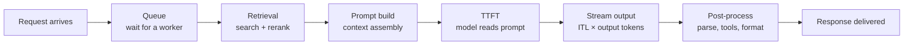

# Performance and Cost Metrics

> **Interview answer (say this first).** Measure latency at the percentiles users actually feel, not the mean: p50, p95, and p99. Split streaming latency into **time-to-first-token (TTFT)** and **inter-token latency (ITL)**, because a slow first token feels frozen while slow later tokens feel sluggish. Count **input and output tokens separately**, since they are priced differently, and compute **cost per request** and **cost per task**, where a task may include several calls. Set a **latency budget per stage** and attribute cost **per tenant and per feature**. The real job is managing the trade-off between latency, cost, and quality — you rarely get all three.

## Why this exists

Two systems can have the same average latency and feel completely different. One is consistently fast; the other is fast most of the time and freezes for five seconds on every twentieth request. The average hides that. Users and SLOs care about the tail, so percentiles are the only honest summary.

Cost has the same shape. A model call looks cheap per request until an agent makes eight calls, retries twice, and re-sends a 20,000-token context each time. The bill scales with tokens and attempts, not with user requests. Without per-stage and per-task accounting, cost surprises arrive at the end of the month.

And latency, cost, and quality pull against each other. A bigger model is often better and always slower and more expensive. Retrieving more documents improves recall and inflates the prompt. You cannot optimise one without watching the other two.

> **Note.** A mean latency is a number that flatters you. Latency is right-skewed, so the mean sits above the median: it overstates the typical experience and hides the tail. The users who leave are usually the ones hitting that tail.

## Start from zero

| Word | Plain meaning |
| --- | --- |
| **Latency** | How long a request takes, from arrival to completion. |
| **End-to-end latency** | The full user-visible time, including queueing, retrieval, generation, and post-processing. |
| **TTFT** | Time to first token: how long until streaming output begins. |
| **ITL** | Inter-token latency: the average gap between output tokens after the first. |
| **TPOT** | Time per output token; often used interchangeably with ITL. |
| **Percentile (p50, p95, p99)** | The value below which that percentage of requests fall. p95 is the slow tail. |
| **Tail latency** | The slow end of the distribution. It dominates user frustration and SLO breaches. |
| **Throughput** | Requests completed per second, or tokens per second. |
| **Queue time** | Time spent waiting before work starts. |
| **Token** | The unit a model reads and writes; roughly three quarters of a word in English. |
| **Input tokens** | The prompt: system message, context, history, and question. |
| **Output tokens** | The generated answer. Usually the more expensive kind. |
| **Prompt caching** | Reusing unchanged prompt prefixes so they are cheaper or faster to process. |
| **Cost per request** | Input cost plus output cost plus tool and infrastructure cost for one request. |
| **Cost per task** | The total cost of all calls needed to achieve one user goal. |
| **Cost attribution** | Tagging spend to a tenant, feature, model, or team. |
| **Latency budget** | An allocation of the total time target across stages. |
| **Streaming** | Sending output tokens as they are produced instead of waiting for the whole answer. |
| **Batching** | Grouping requests to improve throughput at the cost of higher latency. |
| **Little's law** | `concurrency = arrival rate × latency`; useful for sizing pools and throughput. |

Two distinctions to hold apart:

- **Latency vs throughput.** You can improve one and hurt the other. Bigger batches raise throughput and raise latency. Optimising for one is a choice.
- **Cost per request vs cost per task.** A single request can be cheap while a task is expensive, because an agent may make many calls, retry, or retrieve repeatedly.

## The core idea

Picture a restaurant. **TTFT** is how long until the first plate arrives. **ITL** is how fast the rest of the dishes come out. **Total latency** is when the meal ends. A place with a slow start feels broken even if the food comes quickly afterwards; a place with a fast start and slow second course feels disorganised. Both need measuring.

A request is a sequence of stages, and each stage takes time and money. Putting them on one timeline shows where the budget goes.



Latency and cost are two views of the same pipeline. Track both per stage.

| Stage | Latency you feel | Cost driver | Common fix |
| --- | --- | --- | --- |
| **Queue** | Nothing yet; the spinner | Idle capacity | More workers, load shedding, backpressure |
| **Retrieval** | Time to first token | Embedding and search calls | Cache, smaller index, faster retriever, fewer candidates |
| **Prompt build** | Time to first token | Input tokens | Trim context, prompt caching, summarise history |
| **TTFT** | The wait before any output | Input tokens, model size | Smaller model, cache the prefix, stream earlier |
| **Streaming** | The typing pace | Output tokens | Cap output length, use a faster model, disable reasoning on easy tasks |
| **Post-process** | The pause after the text | Tool calls, parsing | Parallelise tools, cache, simplify formatting |

## How it works

1. **Define the user-visible boundary.** Start the clock when the request arrives, not when the model call starts, and stop when the user has the answer. Hiding queue time makes the metric look better and the product feel the same.
2. **Instrument every stage.** Emit a timestamp or duration span per stage. Without stage data you can measure that something is slow but not what.
3. **Capture the first-token timestamp.** TTFT is a separate metric from total latency because users judge the wait before the first word differently.
4. **Compute percentiles, not just the mean.** Report p50, p95, and p99. Alert on the tail and on the count of requests over the SLO.
5. **Count tokens separately by direction.** Input and output tokens have different prices and different growth patterns. Log both per request.
6. **Compute cost per request.** Multiply tokens by the applicable rates, then add tool, retrieval, and infrastructure cost.
7. **Roll up to cost per task.** Sum every call in the run, including retries and parallel branches. This is the number that maps to the business.
8. **Set a latency budget per stage.** Decide the total target, allocate it to stages, and alert when a stage exceeds its share.
9. **Attribute cost.** Tag every request with tenant, feature, model, and environment so spend can be broken down.
10. **Watch the trade-off.** When you change model, context size, or retry policy, measure latency, cost, and quality together. A change that improves one is a regression test for the other two.

The formulas, in one place:

```text
TTFT                = time of first output token - request start
ITL                 = (total generation time - TTFT) / (output tokens - 1)
end-to-end latency  = queue + retrieval + prompt + generation + post-process
cost per request    = input_tokens x input_rate + output_tokens x output_rate
                      + tool and infrastructure cost
cost per task       = sum of cost over all calls in the run (including retries)
expected attempts   = 1 + retry_rate + retry_rate^2 + ...
concurrency         = arrival rate x latency                 (Little's law)
```

Percentiles come from the sorted data with interpolation. The exact method matters when you compare vendors, so state which one you use.

## The syntax you will use

**Percentiles with linear interpolation.** This matches the common numpy default, so your numbers line up with dashboards.

```python
def percentile(values, p):
    xs = sorted(values)
    rank = (len(xs) - 1) * p / 100.0
    lo = int(rank)
    hi = min(lo + 1, len(xs) - 1)
    frac = rank - lo
    return xs[lo] * (1 - frac) + xs[hi] * frac

# report p50, p95, and p99, never the mean alone
```

**TTFT and inter-token latency from timestamps.** ITL averages the gaps after the first token.

```python
def itl(total_ms, ttft_ms, output_tokens):
    if output_tokens <= 1:
        return 0.0
    return (total_ms - ttft_ms) / (output_tokens - 1)

# ttft 500 ms, total 2400 ms, 200 output tokens -> ITL 9.548 ms
```

**Cost per request.** Keep the rates in config so a price change is a config change, not a code change.

```python
def request_cost(in_tok, out_tok, in_rate, out_rate):
    return in_tok / 1e6 * in_rate + out_tok / 1e6 * out_rate

# rates are per million tokens; example: 1500 in, 400 out -> 0.0105
```

**Cost per task, including every call.** An agent task is a list of model calls.

```python
def task_cost(calls):
    return sum(request_cost(c["in"], c["out"], c["in_rate"], c["out_rate"])
               for c in calls)
```

**Adjust for retries.** A retry does not cost nothing; the expected number of attempts is a geometric series.

```python
def expected_cost(base_cost, retry_rate, max_attempts=5):
    total, p = 0.0, 1.0
    for _ in range(max_attempts):
        total += p * base_cost
        p *= retry_rate
    return total

# a 20% retry rate adds roughly 25% to the average cost
```

**A latency budget as a data structure.** Put it in config and alert against it.

```python
budget = {"retrieval": 250, "model ttft": 700, "stream output": 1200, "postprocess": 50}
total_budget_ms = sum(budget.values())          # 2200
```

**Attribute cost by dimension.** One loop, reusable for tenant, feature, or model.

```python
def cost_by(rows, key):
    out = {}
    for r in rows:
        out.setdefault(r[key], 0.0)
        out[r[key]] += request_cost(r["in"], r["out"], r["in_rate"], r["out_rate"])
    return out
```

## Examples: simple to real

**Example 1 — the mean hides the tail.**

```text
latencies = [120, 130, 140, 150, 160, 170, 180, 200, 260, 900]
p50  = 165.0
p95  = 612.0
mean = 241.0
```

The mean of 241 ms sounds fine. The p95 of 612 ms is the number users complain about, and a p99 would be worse still. Report percentiles by default.

**Example 2 — TTFT and ITL describe streaming feel.**

```text
ttft = 500 ms, total = 2400 ms, 200 output tokens
ITL = (2400 - 500) / 199 = 9.548 ms
```

The first token arrives in half a second, then tokens stream at about 9.5 ms each, so 200 tokens take about 1.9 more seconds. A product change that cuts TTFT improves perceived responsiveness even if total time barely moves.

**Example 3 — cost per request from tokens.**

```text
1500 input tokens, 400 output tokens
input rate 3.00 per million, output rate 15.00 per million
cost per request = 0.0045 + 0.0060 = 0.0105
```

Output tokens cost more than input tokens at these example rates, so answer length is the bigger lever. Note the rates are illustrative; use your own.

**Example 4 — cost per task is bigger than any single call.**

```text
plan   call: 0.004200  (28% of task)
answer call: 0.010500  (71% of task)
embed  call: 0.000092  (0.6% of task)
cost per task = 0.014792
```

The final answer dominates, but planning is not free. Until you sum the calls, you do not know which stage to optimise. This is the number to quote per user goal.

**Example 5 — a latency budget makes the trade-off explicit.**

```text
retrieval       250 ms   11%
model ttft      700 ms   32%
stream output  1200 ms   55%
postprocess      50 ms    2%
total          2200 ms
```

More than half the budget is output streaming. If the target is 2 seconds, the streaming allowance has to shrink: cap output length, use a faster model, or stream sooner. The budget turns a vague "make it faster" into a specific decision.

**Example 6 — the full script (verified).**

```python
def percentile(values, p):
    xs = sorted(values)
    rank = (len(xs) - 1) * p / 100.0
    lo = int(rank)
    hi = min(lo + 1, len(xs) - 1)
    frac = rank - lo
    return xs[lo] * (1 - frac) + xs[hi] * frac

def request_cost(in_tok, out_tok, in_rate, out_rate):
    return in_tok / 1e6 * in_rate + out_tok / 1e6 * out_rate

def task_cost(calls):
    return sum(request_cost(c["in"], c["out"], c["in_rate"], c["out_rate"])
               for c in calls)

lat = [120, 130, 140, 150, 160, 170, 180, 200, 260, 900]
print("p50", round(percentile(lat, 50), 1))
print("p95", round(percentile(lat, 95), 1))
print("mean", round(sum(lat) / len(lat), 1))

ttft_ms, out_tokens, total_ms = 500, 200, 2400
print("itl", round((total_ms - ttft_ms) / (out_tokens - 1), 3))
print("cost per request", round(request_cost(1500, 400, 3.00, 15.00), 6))

calls = [
    {"in": 800,  "out": 120, "in_rate": 3.00, "out_rate": 15.00},
    {"in": 1500, "out": 400, "in_rate": 3.00, "out_rate": 15.00},
    {"in": 600,  "out": 80,  "in_rate": 0.10, "out_rate": 0.40},
]
print("cost per task", round(task_cost(calls), 6))

budget = {"retrieval": 250, "model ttft": 700, "stream output": 1200, "postprocess": 50}
print("budget total", sum(budget.values()))
```

Output (verified):

```text
p50 165.0
p95 612.0
mean 241.0
itl 9.548
cost per request 0.0105
cost per task 0.014792
budget total 2200
```

The pattern to internalise: **report a latency distribution and a cost distribution, not single numbers.** Averages and totals hide the tail and the outliers that drive both complaints and bills.

## In production

- **Alert on the tail, not the mean.** p95 and p99 are what users feel and what SLOs track. A mean can improve while the tail worsens.
- **Start the clock at the user boundary.** Queue time is real latency. If you exclude it, your dashboard and your users disagree.
- **Track TTFT separately from total.** For streaming products, perceived speed is dominated by the first token. Optimise it independently.
- **Cap output length.** Output tokens drive both latency and cost, and they are the easiest lever to pull. Set a maximum and a "stop when done" instruction.
- **Sum cost per task, not per call.** Agents multiply calls. A per-request view systematically understates agent cost.
- **Include retries and failures in cost.** Failed calls still bill. Track cost per successful task, not just cost per attempt.
- **Attribute cost from day one.** Tag tenant, feature, model, and environment. Retrofitting attribution onto historical data is painful and often impossible.
- **Watch the cache hit rate.** Prompt caching changes both latency and cost. A falling hit rate explains a bill increase that token counts alone do not.
- **Treat latency budgets as contracts.** Each stage owns a share. When one stage overruns, the fix is in that stage, not "the system is slow".
- **Beware the retry-cost spiral.** Retries multiply load under an outage. Use backoff and jitter, cap attempts, and let a breaker stop the flood.
- **Separate batch from interactive traffic.** Batch can wait and should be cheap; interactive should be fast and may cost more. Mixing them lets one steal the other's capacity.
- **Measure the trade-off together.** Every model, context, or retry change should report the latency, cost, and quality deltas. Optimising one axis in isolation is how a system gets fast, cheap, and wrong.

## Interview questions

### 1. Why report percentiles instead of average latency?

**Answer.** The average hides the tail. With p50, p95, and p99 you see both the typical experience and the worst one. Users remember the slow requests, and SLOs are usually written on a percentile for that reason. A system with a good mean and a terrible p99 looks healthy on a dashboard and feels broken in use.

**Follow-up: "Which percentile should you alert on?"** p95 or p99 for the user-facing SLO, plus the count of requests over a hard threshold. p50 tracks the typical experience and changes slowly.

**Trap.** Comparing percentiles computed with different methods. State the interpolation method, or the same data yields different p99 values.

### 2. What are TTFT and ITL, and why measure them separately?

**Answer.** TTFT is the time until the first output token; it dominates how responsive a streaming product feels. ITL is the average gap between tokens after that; it determines how fast the answer reads out. A slow TTFT feels frozen, while slow ITL feels sluggish. Both are inside end-to-end latency and each needs its own target.

**Follow-up: "Which matters more?"** Usually TTFT, because the first token proves the system is working. But a long answer with poor ITL still feels slow, so track both.

**Trap.** Reporting total generation time as if it were the user experience. With streaming, the user sees tokens as they arrive, so the shape of the latency matters as much as the total.

### 3. How do you compute the cost of a model call?

**Answer.** Split the tokens by direction, because input and output tokens have different rates, and multiply each by its rate, usually quoted per million tokens. Add any tool, retrieval, and infrastructure cost. Track cost per request for unit economics and cost per task for the business view, because an agent task may include many calls.

**Follow-up: "Why is output usually more expensive?"** Generating tokens requires sequential computation, while prompt tokens can be processed in parallel. The exact pricing is vendor-specific, so read the current price sheet rather than assuming.

**Trap.** Forgetting retries and failed calls. They still consume tokens and still appear on the bill.

### 4. What is a latency budget, and how do you use one?

**Answer.** It allocates the total time target across stages: retrieval, prompt build, TTFT, streaming, and post-processing. Each stage has a share and an alert threshold. When the end-to-end target is missed, the budget tells you which stage overran and where to optimise, instead of starting a vague investigation. Set it from the user requirement, not from current performance.

**Follow-up: "How do you set the total?"** From the user experience and the channel. Interactive chat tolerates a second or two to first token; a background job can take minutes. Then work backwards to stage budgets.

**Trap.** Setting the budget from what the system currently does. That preserves today's problems and gives you nothing to aim at.

### 5. How do you attribute cost per tenant or feature?

**Answer.** Tag every request with tenant, feature, model, and environment, and store tokens and computed cost on the span. Then aggregate by any tag. This supports per-tenant billing, feature-level unit economics, and abuse detection. Do it from the start, because retrofitting tags onto historical data is usually impossible.

**Follow-up: "What do you do with a tenant that is far over budget?"** Rate limit or throttle them, cap their context or output length, or move them to a cheaper model tier. Attribution is only useful if it drives an action.

**Trap.** Attributing cost by request count instead of tokens. An agent tenant can make few requests that are each enormous, and a request-based view hides the spend.

### 6. How do latency, cost, and quality trade off against each other?

**Answer.** They move together. A larger model is usually higher quality, slower, and more expensive. More retrieved context improves recall and increases TTFT and input cost. More retries improve completion and multiply cost and latency. The engineering job is to pick a point on that surface deliberately and to re-measure all three on every change.

**Follow-up: "How do you pick the point?"** Start from the product requirement: the quality floor, the latency target, and the cost ceiling. Then choose the cheapest and fastest configuration that clears the quality floor, and route only hard cases to the expensive path.

**Trap.** Optimising one axis in isolation. A fast, cheap configuration that fails the quality floor is not an improvement, and a high-quality one that misses the latency target is unusable.

### 7. How do you reduce agent cost without losing quality?

**Answer.** Route easy tasks to a smaller model and hard ones to a bigger one. Trim and cache context instead of re-sending it. Cap reasoning and output length. Cache completed sub-results and tool outputs. Parallelise independent tool calls to cut latency. Reduce retries with better validation, and stop loops early. Each change needs a quality check, because some of them trade accuracy for cost.

**Follow-up: "What is the biggest lever?"** Context size, usually. Prompt tokens dominate many agent bills, and trimming retrieved documents or history often cuts cost more than switching models.

**Trap.** Cutting the context blindly. Removing documents lowers recall and can reduce quality more than the cost saving is worth. Trim with evaluation, not by guess.

### 8. How do you connect latency and cost to reliability and SLOs?

**Answer.** Latency and cost join the other reliability signals. Define SLIs for p95 latency, TTFT, error rate, and cost per task, set SLOs with error budgets, and alert on burn rate. Cost per task can be an SLO too: a runaway loop or retry storm shows up as a cost spike before users notice. Track them on the same dashboard as quality so trade-offs are visible.

**Follow-up: "What does a cost spike usually mean?"** A retry storm, a loop, a prompt that grew, a cache miss, or an abuse pattern. Treat it like any incident: detect, attribute, mitigate, and add a regression guard.

**Trap.** Treating cost as a finance problem rather than an engineering signal. By the time finance sees it, the incident is a month old.

## Remember this

- **Report percentiles.** p50, p95, and p99, not a mean. The tail is what users feel.
- **TTFT is the felt latency.** Track it separately from total time and from inter-token latency.
- **Cost per task, not per call.** Agents multiply calls; sum the whole run, including retries.
- **Budget latency per stage.** A total target with stage allocations turns "slow" into a specific fix.
- **Optimise all three axes together.** Latency, cost, and quality move as a set; changing one is a regression test for the other two.
