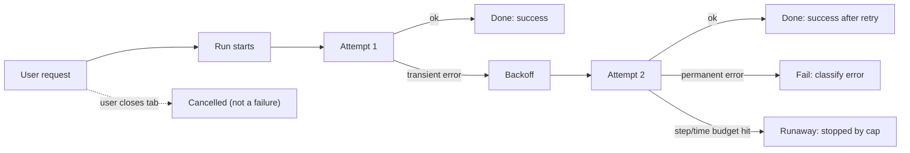

# Reliability Metrics

> **Interview answer (say this first).** Reliability metrics count how often an AI system fails, retries, and recovers: **failure rate** (share of runs that end in error), **retry rate** (share of runs that needed more than one attempt), **success-after-retry** (share of retried runs that then succeeded), plus **loop count** and **tool-call count** to catch runaway agents, and **timeout** and **cancellation rates** to separate slow failures from user aborts. Break failures into **error classes** so you can tell a rate limit from a bug. Track everything per model, per tool, and per tenant, then turn the numbers into alerts with thresholds and a `for` window.

## Why this exists

Averages hide the failures that matter. "The assistant works" is not a claim you can put on an on-call dashboard. You need numbers, and you need them split by the things that change.

Consider a support agent that answers 10,000 questions a day. If 2% fail, that is 200 broken conversations. Which 2%? Are they all on one model, one tool, or one customer? A single global failure rate cannot tell you, and neither can a single global retry rate.

Retries are the second reason. A retry is not free: it costs tokens, latency, and sometimes money. If the retry rate jumps from 3% to 30%, something upstream changed — a provider is throttling, a tool is timing out, or a prompt got worse. You want to see that before customers do.

The third reason is the agent loop. A normal agent finishes in a handful of steps. An agent that is stuck repeating the same tool call will keep spending until a budget stops it. Loop count and tool-call count are how you detect that runaway in production, and how you verify that your caps actually fire.

Reliability metrics are the bridge between "it feels okay" and "here is the SLO, here is the alert, here is the run I need to open."

> **Note:**
>
> **The one-sentence purpose.** Reliability metrics turn vague "it breaks sometimes" into per-model, per-tool, per-tenant failure, retry, and runaway numbers that can page a human.

## Start from zero

Every term below is used later on this page. Read the table once first.

| Word | Plain meaning |
| --- | --- |
| **Run** | One complete agent invocation, from user request to final answer. Sometimes called a trace or a session. |
| **Attempt** | One try at an operation. A run with two attempts is a run that retried once. |
| **Retry** | Doing a failed operation again, usually after a short delay called backoff. |
| **Failure rate** | Failed runs divided by all runs, in a time window. |
| **Error rate** | Same idea at the operation level: failed calls divided by all calls. |
| **Retry rate** | Runs (or calls) with more than one attempt divided by all runs (or calls). |
| **Success after retry** | Of the runs that retried, the share that eventually succeeded. |
| **Error class** | A stable label grouping failures, such as `rate_limit`, `timeout`, `bad_tool_args`, or `model_refusal`. |
| **Error taxonomy** | The agreed, closed list of error classes your team uses. Without one, every engineer invents names. |
| **Loop count** | Number of agent steps (model plus tool cycles) in one run. |
| **Runaway** | A run that exceeds its step, time, token, or cost budget and is stopped. |
| **Tool-call count** | How many tool calls one run made; also count them per tool. |
| **Timeout** | An operation that did not finish inside its deadline and was aborted. |
| **Cancellation** | Work stopped on purpose — the user closed the tab, a newer request superseded it, or a shutdown signal arrived. |
| **P95 / P99** | The value below which 95% or 99% of observations fall. A tail latency number, not an average. |
| **Rate** | A change per unit of time, such as failures per second, written `rate(...)` in PromQL. |
| **SLI** | Service Level Indicator: the measured number, such as "successful runs / all runs". |
| **SLO** | Service Level Objective: the target for that SLI, such as "99.5% of runs succeed over 30 days". |
| **Alert** | A rule that fires when a metric crosses a threshold for long enough, and notifies a human. |
| **Cardinality** | The number of distinct label combinations a metric has. High cardinality is expensive. |

Two clarifications that prevent most confusion:

- **A retry is not the same as a failure.** A retried run can succeed. Track retry rate and success-after-retry together, or you will not know whether retries are helping.
- **Cancellation is not a failure.** The user leaving is expected. Mixing cancellations into the failure rate makes the number move when traffic changes, not when quality changes. Count them separately.

## The core idea

Think of a hospital emergency department. The headline number is "how many patients waited too long." But no good hospital runs on that single number. It splits it: which department, which hour, which complaint, and how many patients were sent away or left before being seen.

Reliability metrics work the same way. The headline is the failure rate. The useful version is the failure rate **by class, by model, by tool, and by tenant**. A single average tells you the building is on fire; the split tells you which room.



The same run produces several metrics at once: it was a retry, it may have been a success, it may have hit a loop cap. Emit all of them with the same labels so you can join them later.

A comparison that makes the point:

| Metric | Question it answers | Wrong conclusion if you skip it |
| --- | --- | --- |
| Failure rate | How often does the user get nothing? | You cannot set an SLO. |
| Retry rate | How often is the system unstable? | Rising instability looks like health. |
| Success after retry | Do retries actually rescue requests? | You keep retrying when retries never help. |
| Loop count | Are agents reasoning or spinning? | A runaway spends money until the budget trips. |
| Tool-call count | Is one tool doing all the work? | A flaky tool hides behind a healthy average. |
| Timeout rate | Is the system slow or broken? | You tune prompts when the problem is a timeout. |
| Cancellation rate | Are users bailing? | Failures look worse than they are, or better. |

The interview-safe sentence is: *"Failure rate tells you the size of the problem; the error-class, model, tool, and tenant splits tell you where it lives."*

## How it works

Follow one request through the metric pipeline.

1. **Time the run and give it an ID.** A run has `run_id`, `tenant_id`, `model`, and a start timestamp. Everything else attaches to this ID.
2. **Record each attempt.** Every model and tool call is one attempt with an outcome: `ok`, `error`, `timeout`, or `cancelled`.
3. **Classify each error.** Map the provider or exception detail to one class from your closed taxonomy, such as `rate_limit`, `timeout`, `invalid_tool_args`, `tool_error`, `context_overflow`, or `model_refusal`.
4. **Apply the retry policy.** On a transient class, back off and try again up to the limit. On a permanent class, fail fast — retrying a malformed request wastes money.
5. **Record the run outcome.** Success on the first attempt, success after retry, failure, cancellation, or a runaway stopped by a cap.
6. **Count the loop.** Increment a step counter per turn. Compare it to `max_steps` and to the distribution of healthy runs.
7. **Count tool calls per tool.** A single `tool_calls_total{tool="search"}` counter, incremented once per call, plus a status label.
8. **Emit with labels.** Every metric carries the same low-cardinality labels: model, tool, error class, tenant tier. Do not put raw `run_id` in a metric label (see cardinality in production).
9. **Aggregate into rates.** A raw counter is cumulative. What you alert on is `rate(counter[5m])`, the change per second.
10. **Set thresholds and `for` windows.** A threshold without a `for` window pages on one bad minute. A `for` window makes the alert mean "sustained".
11. **Route and review.** Alerts go to the owning team. Every page links to a dashboard and a runbook; a page with no action is deleted, not muted forever.

The key insight is step 8: metrics are cheap only when their label combinations are bounded. Reliability metrics work because `model`, `tool`, `error_class`, and `tenant_tier` are small, fixed sets. Put `run_id` in a log or a trace, not in a metric label.

## The syntax you will use

These are the production forms you will actually write. Each snippet is short and does one job.

**Failure rate from run outcomes.** Count, then divide. Guard the denominator so an empty window does not raise.

```python
failed = sum(1 for r in runs if r["status"] != "ok")
failure_rate = failed / len(runs) if runs else 0.0
```

**Break failures into classes.** A counter keyed by class is the raw material for every error dashboard.

```python
from collections import Counter

classes = Counter(r["error_class"] for r in runs if r["status"] != "ok")
# Counter({'tool_timeout': 2, 'model_rate_limit': 1})
```

**Retry rate and success-after-retry.** These two belong side by side, because retries only help if they convert.

```python
retried = [r for r in runs if r["attempts"] > 1]
retry_rate = len(retried) / len(runs)
success_after_retry = (sum(r["status"] == "ok" for r in retried) / len(retried)) if retried else 0.0
```

**A runaway check against the step cap.** Cheap, exact, and it runs on every run before you record it.

```python
def is_runaway(steps: int, max_steps: int) -> bool:
    return steps >= max_steps
```

**Tool-call counts and per-tool error rate.** One pass over the tool-call log produces both.

```python
from collections import Counter

calls = Counter(t["tool"] for t in tool_calls)
errors = Counter(t["tool"] for t in tool_calls if not t["ok"])
error_rate = {tool: errors[tool] / calls[tool] for tool in calls}
```

**Per-tenant, per-model failure rate.** A tuple key keeps the split cheap and exact.

```python
from collections import Counter

totals = Counter((r["tenant"], r["model"]) for r in records)
fails = Counter((r["tenant"], r["model"]) for r in records if r["status"] != "ok")
fail_rate = {k: fails[k] / totals[k] for k in totals}
```

**Prometheus counters with labels.** This is the shape the metric server scrapes.

```python
from prometheus_client import Counter

run_failures = Counter("agent_run_failures_total", "Failed agent runs",
                       ["model", "error_class", "tenant_tier"])
run_failures.labels(model="gpt-4o", error_class="timeout", tenant_tier="free").inc()
```

**PromQL: rates, error ratios, and p95.** Three queries cover most AI reliability pages.

```promql
# failures per second, by class
sum by (error_class) (rate(agent_run_failures_total[5m]))

# error ratio (0..1)
sum(rate(agent_run_failures_total[5m])) / sum(rate(agent_runs_total[5m]))

# p95 run duration from a histogram
histogram_quantile(0.95, sum by (le) (rate(agent_run_duration_seconds_bucket[5m])))
```

**An alerting rule with a `for` window.** The same YAML works in Prometheus and Grafana-managed rules.

```yaml
groups:
  - name: ai-reliability
    rules:
      - alert: AgentHighFailureRate
        expr: |
          sum(rate(agent_run_failures_total[5m]))
            / sum(rate(agent_runs_total[5m])) > 0.05
        for: 10m
        labels: { severity: page }
        annotations:
          summary: "Agent failure rate above 5% for 10m"
```

## Examples: simple to real

**Example 1 — failure rate and error classes from a batch of runs.**

```python
from collections import Counter

runs = [
    {"run_id": "r1", "status": "ok", "error_class": None},
    {"run_id": "r2", "status": "error", "error_class": "tool_timeout"},
    {"run_id": "r3", "status": "ok", "error_class": None},
    {"run_id": "r4", "status": "ok", "error_class": None},
    {"run_id": "r5", "status": "error", "error_class": "model_rate_limit"},
    {"run_id": "r6", "status": "error", "error_class": "tool_timeout"},
    {"run_id": "r7", "status": "ok", "error_class": None},
    {"run_id": "r8", "status": "ok", "error_class": None},
]

failed = sum(1 for r in runs if r["status"] != "ok")
print(round(failed / len(runs), 3))            # 0.375
print(dict(Counter(r["error_class"] for r in runs if r["status"] != "ok")))
# {'tool_timeout': 2, 'model_rate_limit': 1}
```

Three of eight runs failed; the split says two were timeouts, which points at a slow tool, not at the model.

**Example 2 — retry rate versus success-after-retry.** A high retry rate is fine if retries rescue the request; bad if they do not.

```python
runs = [
    {"run_id": "r1", "attempts": 1, "status": "ok"},
    {"run_id": "r2", "attempts": 2, "status": "ok"},
    {"run_id": "r3", "attempts": 1, "status": "ok"},
    {"run_id": "r4", "attempts": 3, "status": "error"},
    {"run_id": "r5", "attempts": 2, "status": "ok"},
]

retried = [r for r in runs if r["attempts"] > 1]
print(round(len(retried) / len(runs), 3))                       # 0.6
print(round(sum(r["status"] == "ok" for r in retried) / len(retried), 3))  # 0.667
```

60% of runs retried, and about two thirds of those recovered. If success-after-retry were near zero, the retry budget is being wasted.

**Example 3 — loop count and runaway detection.** The healthiest signal is the shape of the step distribution, not the mean.

```python
step_counts = [3, 5, 4, 6, 7, 4, 5, 12, 3, 4]
max_steps = 8
ordered = sorted(step_counts)
p95 = ordered[int(0.95 * (len(ordered) - 1))]

print("p95 steps:", p95)                                  # p95 steps: 7
print("runaways:", [s for s in step_counts if s >= max_steps])  # [12]
```

One run hit 12 steps and was stopped by the cap. Alert on the runaway count, and investigate before raising `max_steps` to make the chart look calm.

**Example 4 — tool-call counts and per-tool failure.** A healthy tool can hide a broken one inside an average.

```python
from collections import Counter

tool_calls = [
    {"tool": "search", "ok": True, "ms": 120},
    {"tool": "search", "ok": True, "ms": 90},
    {"tool": "search", "ok": False, "ms": 3000},
    {"tool": "db_query", "ok": True, "ms": 45},
    {"tool": "db_query", "ok": False, "ms": 30},
    {"tool": "send_email", "ok": True, "ms": 400},
]

calls = Counter(t["tool"] for t in tool_calls)
errors = Counter(t["tool"] for t in tool_calls if not t["ok"])
print(dict(calls))                                    # {'search': 3, 'db_query': 2, 'send_email': 1}
print({k: round(errors[k] / calls[k], 2) for k in calls})
# {'search': 0.33, 'db_query': 0.5, 'send_email': 0.0}
```

`db_query` fails half the time on two calls. With three calls, `search` fails a third. Small samples are noisy; alert on rates over a window, not on single runs.

**Example 5 — timeout and cancellation rates are different numbers.**

```python
outcomes = ["ok"] * 80 + ["timeout"] * 12 + ["cancelled"] * 5 + ["error"] * 3
total = len(outcomes)
print(round(outcomes.count("timeout") / total, 3))     # 0.12
print(round(outcomes.count("cancelled") / total, 3))   # 0.05
```

12% timed out and 5% were cancelled. The timeout rate is a capacity or tool-speed problem; the cancellation rate is a product-behaviour signal. Do not add them together.

**Example 6 — per-tenant and per-model tracking with an alert threshold.** This is how a single bad tenant becomes visible.

```python
from collections import Counter

records = [
    {"tenant": "acme", "model": "gpt-4o", "status": "ok"},
    {"tenant": "acme", "model": "gpt-4o", "status": "error"},
    {"tenant": "acme", "model": "gpt-4o", "status": "ok"},
    {"tenant": "acme", "model": "gpt-4o", "status": "ok"},
    {"tenant": "beta", "model": "claude-sonnet", "status": "ok"},
    {"tenant": "beta", "model": "claude-sonnet", "status": "error"},
    {"tenant": "beta", "model": "claude-sonnet", "status": "error"},
    {"tenant": "beta", "model": "claude-sonnet", "status": "error"},
]

totals = Counter((r["tenant"], r["model"]) for r in records)
fails = Counter((r["tenant"], r["model"]) for r in records if r["status"] != "ok")
fail_rate = {k: fails[k] / totals[k] for k in totals}
print(fail_rate)
# {('acme', 'gpt-4o'): 0.25, ('beta', 'claude-sonnet'): 0.75}

for (tenant, model), rate in fail_rate.items():
    if rate > 0.05:
        print("ALERT", tenant, model, round(rate, 2))
# ALERT acme gpt-4o 0.25
# ALERT beta claude-sonnet 0.75
```

Both tenants exceed the threshold, but `beta` on `claude-sonnet` is far worse. Per-tenant and per-model splits are what turn one alarming average into two different investigations.

## In production

- **Agree a closed error taxonomy before you build dashboards.** Five to ten classes are enough: `rate_limit`, `timeout`, `invalid_tool_args`, `tool_error`, `context_overflow`, `model_refusal`, `content_filter`, `internal_error`. Unbounded free-text error names destroy aggregation.
- **Never put `run_id`, `user_id`, or raw prompts in a metric label.** Each unique label value creates a new time series. Five million runs means five million series and a dead metric store. Put high-cardinality data in a log or a trace and keep the metric labels to tens of values.
- **Alert on rates with a `for` window, not counters.** `rate(...) > 0.05 for: 10m` ignores a single bad minute. A raw counter only goes up, so a counter threshold fires forever once crossed.
- **Use error ratio, not just error count.** Traffic doubles, errors double, and the ratio is unchanged. The ratio tells you whether the system is getting worse per request.
- **Separate cancellations from failures.** A spike in cancellations often means slow responses, a bad UX, or a client retry storm. Folding them into failures hides both signals.
- **Distinguish first-attempt success from success after retry.** If the first-attempt success rate falls while the overall rate holds, retries are masking a real regression that will surface when the retry budget runs out.
- **Cap the loop and alert on the cap firing.** `max_steps`, a wall-clock deadline, and a token or cost budget should all exist. The count of runs stopped by a cap is a first-class panel; a nonzero rate means agents are spinning or a tool is failing silently.
- **Watch tool-call count per run, not just per tool.** A healthy run uses a handful of calls. A run at the cap every time usually means the model cannot make progress, not that the task is hard.
- **Guard small denominators.** A tenant with two runs has a 50% error rate after one error. Alert only above a minimum volume, or use a rolling window with an explicit minimum request count.
- **Set thresholds from a baseline, not from ambition.** Page at the level you truly want a human woken up. Warning alerts can sit at a lower threshold. Every page should have a runbook and a dashboard link.
- **Compute tail latency on histograms.** p95 and p99 need a histogram (or a summary), not an average. Averages hide the slow tail that users actually notice.
- **Review alerts on a schedule.** Delete or demote anything that fired without action. An alert nobody trusts is worse than no alert, because it trains people to ignore pages.

## Interview questions

### 1. What reliability metrics would you track for an AI service?

**Answer.** At the run level: failure rate, retry rate, success-after-retry, loop count, and run duration. At the tool level: tool-call count, per-tool failure rate, and per-tool latency. At the infrastructure level: timeout rate and cancellation rate. Split each by model, tool, and tenant so a change in one segment is visible, and classify failures so the numbers say *why*, not just *how often*.

**Follow-up: "Which one do you page on?"** The error ratio and the runaway rate. Error ratio covers user-visible breakage; runaway rate covers a cost and safety problem that a success-only dashboard misses.

**Trap.** Listing only the failure rate. It is the headline, but without retries, loops, and error classes you cannot act on it.

### 2. Why is retry rate a useful metric if retries are supposed to happen?

**Answer.** Retries are a symptom of instability, and they cost tokens, latency, and money. A rising retry rate usually means a provider is throttling, a tool is flaking, or a prompt change made outputs invalid more often. Pairing it with success-after-retry tells you whether the retries are productive: a high rate with high recovery is tolerable, a high rate with low recovery means you are paying for nothing.

**Follow-up: "What causes a sudden retry-rate spike?"** Rate limits, a slow or failing tool, network errors, context-limit rejections, or a prompt regression that produces malformed tool arguments.

**Trap.** Treating a retry as a success and never counting the cost. The user got an answer, but the latency and token spend both doubled.

### 3. How do you detect a runaway agent?

**Answer.** Bound the loop with a `max_steps` cap, a wall-clock deadline, and a token or cost budget, and emit a counter each time a cap stops a run. Also track the step-count distribution: if p99 steps climbs toward the cap, runs are spinning even before any single run is stopped. Alert on the rate of cap hits and on p99 steps, and link the alert to a trace so you can inspect the loop.

**Follow-up: "What if raising `max_steps` makes the p99 look healthy?"** Then you have hidden the runaway, not fixed it. Investigate the repeated tool call or the malformed result that keeps the agent from progressing.

**Trap.** Detecting runaways only from the bill. Cost is a lagging signal; a step cap plus a cap-hit counter catches it within minutes.

### 4. What is the difference between a timeout and a cancellation?

**Answer.** A timeout is your system giving up because a deadline passed; the work was too slow. A cancellation is the caller or the platform stopping the work on purpose, such as a user closing the chat or a superseding request. Timeouts usually indicate capacity, provider, or tool-speed problems. Cancellations are often expected and are a product signal. They must be counted separately or the failure rate becomes a traffic report.

**Follow-up: "Should a cancellation count against the SLO?"** Usually no. Define the SLO over completed runs, and track cancellations as a separate SLI. Otherwise a marketing spike in abandoned sessions looks like an outage.

**Trap.** Recording a user abort as an error. That inflates the failure rate and hides the real failures underneath it.

### 5. How do you break errors into classes, and why bother?

**Answer.** Map every failure to one value from a small closed taxonomy, such as `rate_limit`, `timeout`, `invalid_tool_args`, `tool_error`, `context_overflow`, `model_refusal`, `content_filter`, and `internal_error`. Classification turns "10% failed" into "8% were `rate_limit`", which points straight at the fix — a quota increase instead of a prompt review. A stable taxonomy also makes dashboards and alerts comparable across weeks.

**Follow-up: "Why not just use the provider's error string?"** Provider strings change and are inconsistent across vendors. Normalize at the edge and keep the raw string in the log for detail.

**Trap.** Letting each engineer name errors freely. Without a shared list, every new name splits the aggregation and no dashboard agrees with another.

### 6. How do you track reliability per tenant and per model without blowing up cardinality?

**Answer.** Keep metric labels to bounded sets: a handful of models, a handful of tenant tiers such as `free` and `paid`, and the fixed error classes. Do not label by individual `tenant_id`; a thousand tenants means a thousand series per metric. For per-tenant detail, emit a log or trace field with the real `tenant_id` and join on it during analysis. If you must alert per tenant, do it in the query layer over a bounded set of large accounts, not as a metric label for everyone.

**Follow-up: "How do you find a problem affecting one small tenant?"** Slice logs or traces by `tenant_id` when you are investigating, or emit a low-cardinality `tenant_tier` metric that at least separates free from enterprise traffic.

**Trap.** Adding `tenant_id` as a Prometheus label "just in case". The metric store grows without bound and scrapes slow down for everyone.

### 7. How do you turn these metrics into alerts that people trust?

**Answer.** Alert on ratios and rates over a window: error ratio above a threshold for 10 minutes, p95 run duration above target for 10 minutes, runaway rate above a small baseline. Use a `for` duration to avoid flapping, add a severity label (`warning` versus `page`), and attach a summary, runbook, and dashboard link. Require a minimum request volume so a quiet tenant cannot page from one error. Review alerts regularly and delete the ones that never lead to action.

**Follow-up: "What is a symptom-based alert here?"** Alert on the user-visible effect — runs failing, runs too slow, runs stopped by a budget — rather than on a single internal queue depth or CPU number.

**Trap.** Paging on a raw cumulative counter. Counters only increase, so the alert fires once and never clears; you must alert on `rate(...)` or `increase(...)`.

### 8. What is the difference between an SLI and an SLO, and how do reliability metrics fit?

**Answer.** An SLI is the measurement, such as "successful runs divided by all runs over 30 days". An SLO is the target for that SLI, such as 99.5%. Reliability metrics are the raw material for the SLI; the SLO turns the number into a decision by defining how much failure is acceptable. The gap between the target and reality is the error budget that funds releases and experiments.

**Follow-up: "What SLI would you pick for an agent?"** A run-level success SLI plus a latency SLI (for example, p95 completion time), and optionally a task-success SLI when you have automated graders.

**Trap.** Defining an SLO on a metric you cannot measure reliably. If failure classification is inconsistent, the SLI moves for reasons unrelated to quality.

## Remember this

- **Failure rate is the headline; error classes, model, tool, and tenant splits are the diagnosis.**
- **Retry rate and success-after-retry belong together** — retries are only healthy when they recover requests.
- **Loop count and tool-call count catch runaway agents** before the bill does; alert when a cap fires.
- **Timeouts and cancellations are different signals** and must never share a bucket.
- **Alert on rates and ratios with a `for` window**, keep label cardinality bounded, and delete alerts nobody acts on.
