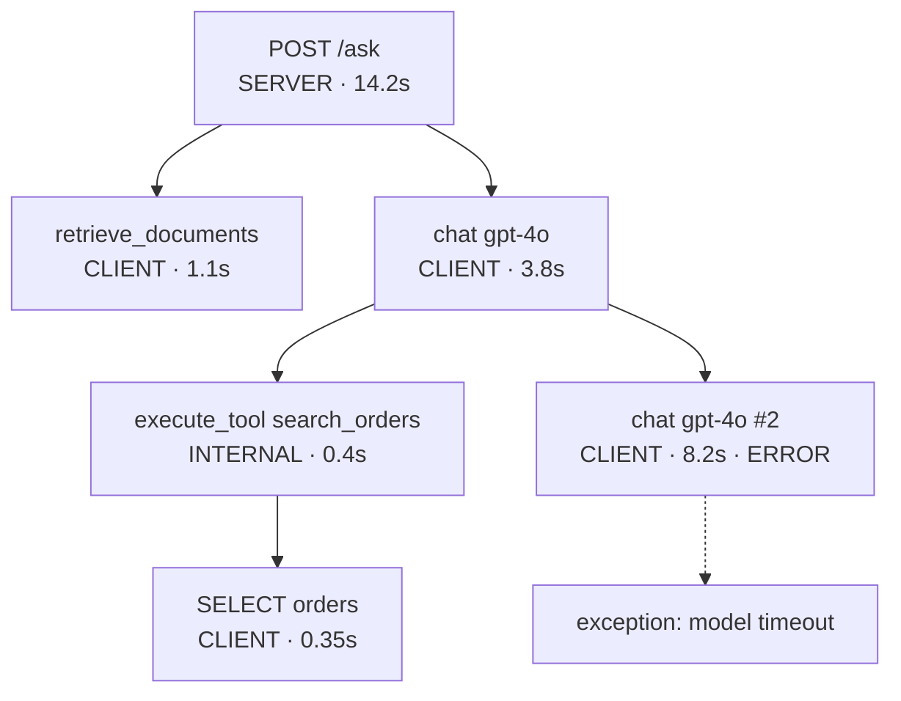

# Tracing and OpenTelemetry

> **Interview answer (say this first).** A **trace** is the record of one request's full journey; a **span** is one unit of work inside it, with a start, an end, a name, attributes, events, and a status. OpenTelemetry (OTel) is the vendor-neutral standard and SDK for producing that data: you create a span, child spans nest inside it, and context — the trace ID and parent span ID — propagates between services in the W3C `traceparent` header. For AI systems you instrument each model call and tool call with spans, tag them with the GenAI semantic conventions (`gen_ai.*`), and export through a collector that batches, samples, and fans out to a backend. Traces answer "what happened in this one run"; metrics and logs answer "how often" and "what text".

## Why this exists

A log line tells you that something happened. It does not tell you where in the request it happened, what caused it, or how long each step took.

An agent run is a tree of work: a request handler calls a retrieval step, which calls an embedding model, then a chat model, which returns a tool call, which runs against a database, and then a second chat model call. If the run took 14 seconds and failed, which branch was slow? Which step raised? Plain logs give you text in time order across many concurrent requests, and you end up reconstructing the tree by hand from timestamps.

Traces give you the tree directly. Each span points at its parent, so the backend draws a waterfall: this request, these children, these durations, this error, in one screen. One trace ID lets you jump from a 14-second run to the exact slow span.

AI adds three complications that make tracing more valuable than usual:

- **Non-determinism.** The same input can take different paths. You cannot reproduce a bad run from the prompt alone; you need the actual path it took.
- **Cost is per token.** Trace attributes carry token counts and the model name, so a trace is also a cost record.
- **Multi-step and multi-service.** Retrieval, models, tools, and guardrails are often separate processes. Without context propagation, each hop starts a new trace and the story is broken.

> **Note:**
>
> **The one-sentence purpose.** A trace is a causally linked, timed tree of spans for one request, so you can see exactly which step of an agent run was slow, wrong, or expensive.

## Start from zero

Every term below is used later. Read the table once before continuing.

| Word | Plain meaning |
| --- | --- |
| **Trace** | The whole tree for one request, identified by a `trace_id` shared by every span in it. |
| **Span** | One named unit of work: a model call, a tool call, a database query. Has a start and end time. |
| **Trace ID** | A 16-byte (32 hex character) value shared by all spans in one trace. |
| **Span ID** | An 8-byte (16 hex character) value identifying one span. |
| **Parent span** | The span that created this one. The parent-child link is what makes the tree. |
| **Root span** | The top span, with no parent. Usually the inbound request. |
| **Span kind** | The span's role: `SERVER`, `CLIENT`, `PRODUCER`, `CONSUMER`, or `INTERNAL`. |
| **Attribute** | A key-value pair on a span, such as `gen_ai.request.model="gpt-4o"`. Must be a simple type. |
| **Span event** | A timestamped note inside a span, such as "first token received" or an exception. |
| **Span status** | `UNSET`, `OK`, or `ERROR`. Set `ERROR` when the operation failed. |
| **Context** | The currently active span, carried implicitly (and in async tasks) so new spans become children. |
| **Context propagation** | Passing the trace ID and parent span ID to another service, usually in the W3C `traceparent` header. |
| **W3C `traceparent`** | The header format: version, trace ID, parent span ID, flags, for example `00-<32 hex>-<16 hex>-01`. |
| **Baggage** | Arbitrary key-values propagated alongside context across services. Useful, but a privacy risk. |
| **Resource** | Attributes describing the process, not one span: `service.name`, `service.version`, environment. |
| **Instrumentation library** | The name and version of the code that created the span, for example `agent.genai` or `opentelemetry-instrumentation-openai`. |
| **Exporter** | The component that sends spans out of the process (OTLP, console, in-memory). |
| **Span processor** | Buffers and hands finished spans to an exporter. `BatchSpanProcessor` is the production choice. |
| **OTLP** | OpenTelemetry Protocol, the standard wire format for exporting traces, metrics, and logs. |
| **Collector** | A standalone OTel process that receives, processes, and exports telemetry. |
| **Sampler** | Decides whether a trace is recorded and exported. |
| **Head sampling** | The sampling decision at the start; cheap, but you cannot use the outcome. |
| **Tail sampling** | The decision after the trace finishes; can keep all errors, but needs a collector to buffer. |
| **Semantic conventions** | Agreed attribute names, such as `gen_ai.request.model`, so dashboards work across vendors. |
| **Exemplar** | A sample trace ID attached to a metric data point, linking a spike to a real trace. |
| **Cardinality** | The number of distinct attribute combinations; high cardinality is expensive to store and query. |

Two clarifications that matter:

- **A trace is not a log.** Logs are discrete text lines. A trace is a timed, parented tree with structured attributes. Logs explain *what text*, traces explain *what path*.
- **Tracing does not require a vendor.** OTel is the API, SDK, and wire format. The backend (Jaeger, Tempo, a SaaS product) is a separate choice you can change without re-instrumenting.

## The core idea

Think of a package delivery. The **trace** is the whole journey of one parcel. Each **span** is one leg: the warehouse pick, the truck, the sorting centre, the last-mile van. Every leg records where it started, where it ended, and which leg handed it over (the parent). If the parcel is late, you look at the waterfall and see which leg ate the time.



Read the waterfall top to bottom: the second model call is the slow one, and it errored. That conclusion takes seconds from a trace and minutes from logs.

The second idea is **context propagation**, and it is what turns tracing into **distributed tracing**. On every hop, the **trace ID stays the same** while the **parent span ID changes** to the caller's current span. So the gateway calls the agent service, which calls the tool service, and all three land in one waterfall even though different teams own them. The syntax section further down shows the `traceparent` header that carries this.

The interview-safe sentence is: *"Logs tell you the story; traces tell you the shape and the timing of one run; metrics tell you how often that shape occurs."*

## How it works

Follow one instrumented model call from creation to backend.

1. **Set up a provider once at startup.** A `TracerProvider` holds the resource, the sampler, and the span processors. A `Tracer` is obtained from it per instrumentation library.
2. **Start a span.** `tracer.start_as_current_span("chat gpt-4o")` creates a span and makes it the current context for the duration of the `with` block.
3. **Children nest automatically.** Any span started while it is current becomes its child. The SDK records the parent span ID on the child.
4. **Add attributes.** Simple typed key-values: model name, token counts, tool name, tenant tier. Attributes are indexed and searchable, so they are the main query surface.
5. **Add events and exceptions.** Events are timestamped points inside a span, such as `first_token` or the opt-in `gen_ai.client.inference.operation.details`. `record_exception` adds a standard exception event with type, message, and stack trace.
6. **Set the status.** Mark the span `ERROR` when the operation failed, with a short description. `UNSET`/`OK` means it did not fail.
7. **End the span.** On leaving the `with` block the span records its end time and goes to the span processor.
8. **The processor batches and exports.** In production `BatchSpanProcessor` queues spans and sends them over OTLP in the background, so tracing does not block the request.
9. **The collector receives them.** It can batch, limit memory, redact attributes, tail-sample, and fan out to one or more backends.
10. **The backend stores and indexes.** Jaeger, Tempo, or a SaaS product turns spans into the waterfall, searchable by `trace_id`, service, duration, status, and attributes.
11. **Context crosses the wire.** On an outbound call, `inject` writes `traceparent` into the headers; on the inbound side, `extract` reads it and continues the trace.
12. **Metrics link back.** When you record a histogram inside a span, the SDK can attach an **exemplar** — the trace ID of that exact measurement — so a latency spike on a chart jumps to a real trace.

Step 8 is the part people get wrong. A synchronous exporter that sends each span as it ends adds network latency to every request. Batch it, and accept that a crash can lose the last few seconds of spans.

## The syntax you will use

These are the real OTel Python forms. The SDK examples run with `opentelemetry-sdk` installed; the exporter snippet below also needs `opentelemetry-exporter-otlp`.

**Create the provider, resource, and exporter.** Do this once, at process start.

```python
from opentelemetry.sdk.resources import Resource, SERVICE_NAME
from opentelemetry.sdk.trace import TracerProvider
from opentelemetry.sdk.trace.export import BatchSpanProcessor
from opentelemetry.exporter.otlp.proto.grpc.trace_exporter import OTLPSpanExporter

resource = Resource.create({
    SERVICE_NAME: "agent-api",
    "service.version": "1.2.0",
    "deployment.environment.name": "prod",
})
provider = TracerProvider(resource=resource)
provider.add_span_processor(BatchSpanProcessor(OTLPSpanExporter(endpoint="http://otel-collector:4317")))
```

The resource describes the process; every span it creates carries those attributes.

**Get a tracer and create a nested span.** The child becomes part of the current trace automatically.

```python
from opentelemetry import trace

tracer = trace.get_tracer("agent.genai")

with tracer.start_as_current_span("POST /ask") as root:
    root.set_attribute("app.tenant.id", "acme")
    with tracer.start_as_current_span("chat gpt-4o") as span:
        span.set_attribute("gen_ai.request.model", "gpt-4o")
```

**Add events and set an error status.** Use `record_exception` so the stack trace survives.

```python
from opentelemetry.trace import Status, StatusCode

with tracer.start_as_current_span("execute_tool db_query") as span:
    try:
        run_query()
    except TimeoutError as exc:
        span.record_exception(exc)
        span.set_attribute("error.type", "timeout")
        span.set_status(Status(StatusCode.ERROR, "tool timeout"))
```

**GenAI semantic conventions.** OTel defines standard names so dashboards work across providers. The span name is `{gen_ai.operation.name} {gen_ai.request.model}`.

```python
span.set_attribute("gen_ai.operation.name", "chat")
span.set_attribute("gen_ai.provider.name", "openai")          # older name: gen_ai.system
span.set_attribute("gen_ai.request.model", "gpt-4o")
span.set_attribute("gen_ai.request.temperature", 0.2)
span.set_attribute("gen_ai.request.max_tokens", 1024)
span.set_attribute("gen_ai.usage.input_tokens", 812)
span.set_attribute("gen_ai.usage.output_tokens", 96)
span.set_attribute("gen_ai.response.finish_reasons", ["tool_calls"])
span.set_attribute("gen_ai.tool.name", "search_orders")
span.set_attribute("gen_ai.tool.type", "function")
span.set_attribute("gen_ai.agent.name", "support-agent")
span.set_attribute("gen_ai.prompt.name", "support-v3")        # prompt template identity
```

**Set the span kind.** Client spans for outbound calls, server spans for inbound, so the backend draws the right arrows.

```python
with tracer.start_as_current_span("chat gpt-4o", kind=SpanKind.CLIENT):
    ...
```

**Propagate context across a service boundary.** `inject` on the client, `extract` on the server.

```python
from opentelemetry.propagate import inject, extract

headers = {}
inject(headers)                       # writes traceparent (and baggage)
call_downstream(headers)

ctx = extract({"traceparent": "00-4bf92f3577b34da6a3ce929d0e0e4736-00f067aa0ba902b7-01"})
with tracer.start_as_current_span("downstream_handler", context=ctx):
    ...
```

**Sample at head, or tail-sample in the collector.** Head sampling sees the trace context but not the outcome; tail sampling runs at the collector after the trace ends.

```python
from opentelemetry.sdk.trace.sampling import ParentBasedTraceIdRatio

provider = TracerProvider(resource=resource, sampler=ParentBasedTraceIdRatio(0.1))  # keep 10%
```

**Collector configuration.** The collector is a separate process; this is the shape of its config.

```yaml
receivers:
  otlp:
    protocols:
      grpc: { endpoint: "0.0.0.0:4317" }
      http: { endpoint: "0.0.0.0:4318" }
processors:
  memory_limiter: { check_interval: 1s, limit_percentage: 80 }
  batch: {}
exporters:
  otlphttp:
    endpoint: "https://tempo.example.com/otlp"
service:
  pipelines:
    traces:
      receivers: [otlp]
      processors: [memory_limiter, batch]
      exporters: [otlphttp]
```

## Examples: simple to real

**Example 1 — a trace with nested spans.** The in-memory exporter lets you inspect spans without any backend.

```python
from opentelemetry.sdk.trace import TracerProvider
from opentelemetry.sdk.trace.export import SimpleSpanProcessor
from opentelemetry.sdk.trace.export.in_memory_span_exporter import InMemorySpanExporter
from opentelemetry import trace

exporter = InMemorySpanExporter()
provider = TracerProvider()
provider.add_span_processor(SimpleSpanProcessor(exporter))
trace.set_tracer_provider(provider)
tracer = trace.get_tracer("agent.genai")

with tracer.start_as_current_span("POST /ask") as root:
    with tracer.start_as_current_span("chat gpt-4o") as model:
        model.set_attribute("gen_ai.request.model", "gpt-4o")

spans = exporter.get_finished_spans()
print([s.name for s in spans])                                  # ['chat gpt-4o', 'POST /ask']
print(spans[0].parent.span_id == root.get_span_context().span_id)  # True
```

Children finish before parents, so the exporter sees them first. The parent link is what the backend uses to rebuild the tree.

**Example 2 — attributes, events, and an error status.** The exception survives as a standard event.

```python
from opentelemetry import trace
from opentelemetry.trace import Status, StatusCode
from opentelemetry.sdk.trace import TracerProvider
from opentelemetry.sdk.trace.export import SimpleSpanProcessor
from opentelemetry.sdk.trace.export.in_memory_span_exporter import InMemorySpanExporter

exporter = InMemorySpanExporter()
provider = TracerProvider()
provider.add_span_processor(SimpleSpanProcessor(exporter))
trace.set_tracer_provider(provider)
tracer = trace.get_tracer("agent.genai")

with tracer.start_as_current_span("execute_tool db_query") as span:
    try:
        raise TimeoutError("db timeout")
    except TimeoutError as exc:
        span.record_exception(exc)
        span.set_status(Status(StatusCode.ERROR, "tool timeout"))
        span.set_attribute("error.type", "timeout")

s = exporter.get_finished_spans()[0]
print(s.status.status_code.name)                     # ERROR
print([e.name for e in s.events])                    # ['exception']
print(s.events[0].attributes["exception.type"])      # TimeoutError
```

`error.type` is a semantic-convention attribute, so error dashboards can group by class without parsing messages.

**Example 3 — context propagation across services.** The child service continues the same trace instead of starting a new one.

```python
from opentelemetry import trace
from opentelemetry.propagate import inject, extract

with tracer.start_as_current_span("gateway_call"):
    headers = {}
    inject(headers)

print(headers["traceparent"][:52])   # 00-<32 hex trace id>-<16 hex span id> (flags omitted)

# In the receiving service:
ctx = extract(headers)
with tracer.start_as_current_span("tool_service_handler", context=ctx):
    child = trace.get_current_span()
    print(format(child.get_span_context().trace_id, "032x"))
```

Both services log the same trace ID, so a trace query spans the whole request even though two teams own the code.

**Example 4 — the GenAI span for one model call.** The attributes make the trace a cost and quality record.

```python
with tracer.start_as_current_span("chat gpt-4o", kind=SpanKind.CLIENT) as span:
    span.set_attribute("gen_ai.operation.name", "chat")
    span.set_attribute("gen_ai.provider.name", "openai")
    span.set_attribute("gen_ai.request.model", "gpt-4o")
    span.set_attribute("gen_ai.request.temperature", 0.2)
    span.set_attribute("gen_ai.prompt.name", "support-v3")   # template identity, safe to log
    # Prompt/completion content is opt-in in the current GenAI conventions:
    # gen_ai.input.messages / gen_ai.output.messages, or the
    # gen_ai.client.inference.operation.details event. Not set by default.
    # ... the real HTTP call to the provider ...
    span.set_attribute("gen_ai.usage.input_tokens", 812)
    span.set_attribute("gen_ai.usage.output_tokens", 96)
    span.set_attribute("gen_ai.response.finish_reasons", ["tool_calls"])
```

From this one span you can compute tokens, latency, model mix, and finish reasons without touching application logs.

**Example 5 — a tool span wrapping the real work.** Time the tool separately from the model that chose it.

```python
import time

with tracer.start_as_current_span("execute_tool search_orders",
                                  kind=SpanKind.INTERNAL) as span:
    span.set_attribute("gen_ai.tool.name", "search_orders")
    span.set_attribute("gen_ai.tool.type", "function")
    start = time.perf_counter()
    try:
        result = search_orders(customer_id="c-42")
        span.set_attribute("app.tool.result_count", len(result))
    finally:
        span.set_attribute("app.tool.duration_ms", (time.perf_counter() - start) * 1000)
```

Because the tool span is a child of the model span, the waterfall shows whether the model was slow to choose or the tool was slow to run. Note the trade-off: if the tool runs while the model span is still open, the model span's wall-clock duration includes the tool time. Record the provider call's own latency in an attribute (or end the model span when the response arrives and open the tool span under the step) so a slow tool never looks like a slow model.

**Example 6 — a collector pipeline with tail sampling.** Keep all errors and slow traces, sample the rest.

```yaml
processors:
  tail_sampling:
    decision_wait: 10s
    policies:
      - name: errors
        type: status_code
        status_code: { status_codes: [ERROR] }
      - name: slow
        type: latency
        latency: { threshold_ms: 5000 }
      - name: baseline
        type: probabilistic
        probabilistic: { sampling_percentage: 5 }
service:
  pipelines:
    traces:
      receivers: [otlp]
      processors: [memory_limiter, tail_sampling, batch]
      exporters: [otlphttp]
```

Tail sampling is why the collector exists: it buffers a trace for `decision_wait` and then decides, which a per-process SDK cannot do.

## In production

- **Batch spans, never export synchronously on the request path.** `BatchSpanProcessor` sends in the background. `SimpleSpanProcessor` is for tests and local debugging only.
- **Always set `service.name` and `service.version`.** A trace with no service name is unusable in a shared backend. Version lets you compare a deploy before and after.
- **Never put prompts, completions, or PII in span attributes by default.** Attributes are indexed and widely readable. Log a hash, a length, or a template name; gate full content behind an explicit, access-controlled capture mode.
- **Cap attribute size and cardinality.** Do not set `user_id`, `run_id`, or a raw URL with query parameters as an attribute if you query by them often; put them in logs, or in baggage only when a non-sensitive correlation ID must cross a service boundary, and use bounded values like `tenant_tier` and `model` for slicing.
- **Set status and `error.type` on every failure.** A trace backend can only find errors if you mark them. Record the exception as well, or you lose the stack.
- **Use tail sampling for errors and latency.** Head sampling at 1% will drop almost every error. Keep 100% of errors and slow traces, then sample the healthy baseline.
- **Run a collector between the app and the backend.** It centralizes batching, retries, memory limits, attribute redaction, and multi-backend fan-out, so changing vendors is a config change, not a redeploy.
- **Watch the telemetry bill.** Span volume grows with request count and nesting depth. A chatty agent that creates 50 spans per run multiplies cost. Sample, trim attribute size, and set retention deliberately.
- **Instrument async code correctly.** Context is task-local; a span started in a new `asyncio` task can lose its parent unless you pass the context explicitly. Test that background tasks stay in the trace.
- **Do not trace every token stream chunk as a span.** Record one span for the model call and use events for milestones such as first token and last token.
- **Beware leaking secrets into attributes through auto-instrumentation.** A generic HTTP instrumentation can capture URLs and headers. Review, and redact at the collector with a `transform` or `attributes` processor.
- **Correlate all three signals.** Put the trace ID in your logs and use metric exemplars, so a log line and a metric spike both lead to the same trace.

## Interview questions

### 1. What is a trace, and what is a span?

**Answer.** A trace is the complete record of one request, identified by a `trace_id` shared by all its spans. A span is one unit of work inside it — a model call, a tool call, a database query — with a name, start and end time, a parent link, attributes, events, and a status. Spans form a tree, and the tree is the waterfall you read to find the slow or failing step.

**Follow-up: "What makes it distributed?"** Context propagation. Each service passes the trace ID and its current span ID in the W3C `traceparent` header, so the next service creates child spans in the same trace across process and network boundaries.

**Trap.** Saying a trace is a fancy log. A log is text at a time; a trace is a parented, timed tree with structured attributes.

### 2. What is context propagation, and how does it work?

**Answer.** Context is the currently active span. New spans automatically become children of it. When a request leaves the process, the client injects the trace ID and current span ID into headers — the W3C standard is a `traceparent` header shaped `00-<32 hex trace id>-<16 hex parent span id>-<flags>`. The receiving service extracts them and starts spans in the same trace. That is what stitches one trace across many services.

**Follow-up: "What happens if a service does not propagate?"** The downstream work appears as a separate, disconnected trace. You lose the causal link and have to correlate manually by time and request ID.

**Trap.** Assuming context propagates automatically over every hop. Message queues, background jobs, and some HTTP clients need explicit inject and extract calls.

### 3. What are span attributes, events, and status for?

**Answer.** Attributes are indexed key-values describing the span, such as `gen_ai.request.model`, `gen_ai.usage.input_tokens`, or `error.type`; they are the main query and grouping surface. Events are timestamped points inside a span, such as `first_token` or an exception. Status records success or failure. Together they let the backend answer "show me all `ERROR` `chat` spans on `gpt-4o` taking over 5 seconds".

**Follow-up: "Why use semantic conventions instead of your own names?"** So dashboards, alerts, and vendor integrations work out of the box. OTel defines the `gen_ai.*` names; inventing your own means re-writing every query when you change vendors or libraries.

**Trap.** Putting large text or personal data in attributes. Attributes are indexed and broadly visible; keep prompts and PII out by default.

### 4. Where does the OpenTelemetry collector sit, and why run one?

**Answer.** The collector sits between your applications and the backend. Apps export OTLP to it, and it batches, limits memory, redacts or transforms attributes, tail-samples, retries, and fans out to one or more backends. It decouples your instrumentation from the vendor and centralizes policy, so changing backends or adding a second one is a config change rather than a code change.

**Follow-up: "Can you skip it and export straight to the backend?"** Yes for a small setup. You lose tail sampling, centralized redaction, and multi-backend fan-out, and every app config must change when the backend does.

**Trap.** Treating the collector as optional at scale. Without a memory limiter and batching, one traffic spike can drop telemetry or overwhelm the backend.

### 5. Head sampling versus tail sampling — what is the difference?

**Answer.** Head sampling decides at span creation, cheaply, based on the trace ID, and the answer is fixed for the whole trace. Tail sampling decides in the collector after the trace finishes, so it can keep all error traces and all slow traces while sampling the healthy ones. The trade-off is that tail sampling needs the collector to buffer whole traces for a decision window, which costs memory and adds config complexity.

**Follow-up: "Why not just sample 1% at the head?"** At 1% you drop roughly 99% of your errors. Debugging an incident from a sampled trace is frustrating. Tail sampling keeps the interesting traces.

**Trap.** Assuming sampled traces are random per span. The decision is per trace, so a trace is either fully kept or fully dropped; you never get half a waterfall.

### 6. How do you instrument an LLM call and a tool call?

**Answer.** Wrap each in a span. For the model call, set the GenAI conventions: `gen_ai.operation.name`, `gen_ai.provider.name`, `gen_ai.request.model`, the request params, then `gen_ai.usage.input_tokens`, `gen_ai.usage.output_tokens`, and `gen_ai.response.finish_reasons` after the response, with span kind `CLIENT`. For the tool, name the span `execute_tool <name>`, set `gen_ai.tool.name` and `gen_ai.tool.type`, record duration, result size, and errors. Nest the tool span under the model span that requested it.

**Follow-up: "What about streaming?"** One span for the call and events for milestones: first token, last token, and token counts. Do not create a span per streamed chunk.

**Trap.** Forgetting token counts and model name. Without them the trace cannot explain cost, which is half of why AI teams trace at all.

### 7. How do traces, logs, and metrics work together?

**Answer.** Metrics tell you that something changed — the error ratio doubled. Traces tell you which path and which step, and let you find a representative bad run. Logs tell you the text detail inside that step. The glue is correlation: put the `trace_id` in every log line and attach metric exemplars so a spike links to a trace. Then the workflow is metric alert, trace to locate, log to explain.

**Follow-up: "Which do you build first?"** Metrics and structured logs for coverage, then tracing for depth. Tracing everything from day one is expensive; metrics are cheap and tell you where to look.

**Trap.** Building three systems that use different IDs, so nothing links. Agree on one correlation key — the trace ID — before you build dashboards.

### 8. What are the main costs and risks of tracing in production?

**Answer.** Volume and cardinality: a deep agent trace can have dozens of spans, and storing 100% of them at high traffic is expensive. Sensitive data: prompts, completions, and tool results are easy to put in attributes and easy to leak. Overhead: synchronous exporting adds latency, and unbounded span attributes increase memory and network use. Mitigate with batch exporting, tail sampling that keeps errors and slow traces, strict attribute redaction at the collector, retention limits, and cardinality rules for attributes you filter by.

**Follow-up: "How would you debug a rare error if you sample only 5%?"** Tail-sample 100% of errors regardless of the baseline rate, and keep a separate capped store for full prompt content when someone opts in.

**Trap.** Enabling full prompt capture "temporarily" and forgetting it. The data is now retained, indexed, and exposed.

## Remember this

- **A trace is a timed, parented tree for one request; a span is one step in it.**
- **Context propagation via the W3C `traceparent` header** is what makes a trace span services.
- **Attributes, events, and status** make spans queryable — and `gen_ai.*` conventions make them portable.
- **The collector batches, redacts, tail-samples, and fans out**, so your app code stays vendor-neutral.
- **Batch export, tail-sample errors, and never put prompts or PII in attributes by default.**
