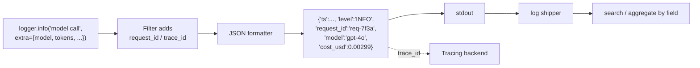

# Structured Logging

> **Interview answer (say this first).** Structured logging emits each event as a machine-readable record — usually one JSON object per line — instead of a sentence. For AI systems the fields that matter are `request_id`, `trace_id`, `tenant`, `model`, `prompt_version`, token counts, cost, and latency, so you can filter, aggregate, and join logs without regex. You add a correlation ID through a filter or a `ContextVar`, choose levels deliberately for model and tool events, never log prompts, secrets, or PII by default, and sample the high-volume debug logs so the storage bill stays sane.

## Why this exists

Free-text logs are fine until you need to answer a question across millions of lines. That is exactly what production AI systems demand.

Suppose a customer says their answer was wrong yesterday at 3pm. With free text you search for their name and read. With 200,000 requests a day, you need to filter: this tenant, this model, error or not, high latency, specific prompt version. Free text cannot do that reliably, because the interesting value sits inside a sentence in a different position each time. Structured fields can.

AI systems also have fields that ordinary services do not: the model that answered, the prompt template version, input and output tokens, the computed cost, and the retrieval or tool calls. If those are text in a message, every cost report is a parsing project. If they are fields, it is a `sum`.

There is a privacy edge too. AI logs are the most tempting place in the codebase to dump the raw prompt and completion. They are also the most dangerous: prompts contain personal data, tool output, and sometimes credentials that a user pasted. Structured logging makes it natural to log metadata and deliberately not the content.

> **Note:**
>
> **The one-sentence purpose.** Structured logs turn "what happened" into queryable fields, so one line of JSON can be filtered, summed, and joined to a trace — without ever dumping the prompt.

## Start from zero

| Word | Plain meaning |
| --- | --- |
| **Structured log** | A log record with named fields, usually JSON, instead of a free-text sentence. |
| **Unstructured log** | A plain message. Readable by humans, fragile for machines to filter. |
| **Field** | A named key-value pair in the record, such as `model` or `latency_ms`. |
| **JSON Lines (JSONL)** | One JSON object per line. The common shape for log shippers, because each line parses alone. |
| **Log level** | Severity: DEBUG, INFO, WARNING, ERROR, CRITICAL. |
| **Correlation ID** | A value added to every line of one request so the lines group together. |
| **`request_id`** | The correlation ID for one user request. Generated at the edge. |
| **`trace_id`** | The OpenTelemetry trace ID, which links a log line to a trace and a span. |
| **Context propagation** | Passing context (request ID, trace ID) through the code without editing every call site. |
| **`ContextVar`** | Python's task-local storage. Async-safe place to keep the current request's IDs. |
| **Filter** | A logging hook that can attach fields or drop records. |
| **Formatter** | Turns a record into the output string — here, the JSON object. |
| **Cardinality** | The number of distinct values a field takes. High-cardinality fields are expensive to index. |
| **Sampling** | Keeping only a fraction of high-volume logs. |
| **Retention** | How long logs are stored before deletion. |
| **Redaction** | Replacing sensitive values before they are written. |
| **PII** | Personally identifiable information: names, emails, phone numbers, addresses, payment data. |
| **Scrubbing** | A downstream filter that removes secrets that slipped through. |
| **Log sink** | The destination: stdout, a file, a shipper, the logging platform. |
| **`extra`** | The Python logging argument for attaching custom fields to a record. |

Two clarifications that matter:

- **Structured logging is about the producer, not the store.** If the code emits JSON, any collector can index it. You do not need a special library, though one can help.
- **A correlation ID is not the user ID.** A user can make many requests at once. The correlation ID is per request and is safe to log because it is generated, not personal.

## The core idea

Think of a shipping label versus a handwritten note. A handwritten note says "fragile, going to Priya in Pune, this morning." A shipping label has fixed boxes: tracking number, destination, weight, service level. A sorting machine can read the label. A human can still read the note, but no machine can sort by it.

Structured logging puts fixed boxes on every event. The boxes are the same across every service, every language, every team.



The same record serves three jobs: a human reading one line, a query grouping by `model`, and a join from a log line to a trace.

The AI-specific field set is worth memorizing:

| Field | Why it matters |
| --- | --- |
| `request_id` | Groups all lines of one request. |
| `trace_id` / `span_id` | Joins logs to traces. |
| `tenant` / `tenant_tier` | Per-customer debugging and abuse limits. |
| `model` | Cost and quality split by model. |
| `prompt_version` | Tells you which template produced the behaviour; the key regression field. |
| `input_tokens`, `output_tokens` | Cost, context pressure, and truncation. |
| `cost_usd` | Budget tracking per request, per tenant. |
| `latency_ms` / `ttft_ms` | Performance, including the user-visible first token. |
| `tool`, `tool_ok`, `retries` | Reliability of the agent's actions. |
| `finish_reason` | Stop, length, content filter, tool call. |

The interview-safe sentence is: *"If I want to group by it or alert on it, it is a field, not a sentence."*

## How it works

Follow one model call from `logger.info` to a query result.

1. **A named logger is called** with a stable message and structured fields passed through `extra`.
2. **The level gate runs.** Below the effective level, nothing is built, so a disabled debug line is cheap.
3. **A `LogRecord` is created** with the message, level, timestamp, logger name, and the extra fields.
4. **Filters run.** A request-ID filter reads the current `ContextVar` and attaches `request_id` and `trace_id` to the record.
5. **The JSON formatter builds a dict** from the chosen fields and serialises it. Unknown or missing fields are skipped.
6. **The handler writes one line to the sink** — stdout is the container-friendly default.
7. **The shipper reads stdout** and delivers batches to the logging platform.
8. **The platform indexes the fields** you declared as searchable. High-cardinality fields such as `request_id` are stored but not necessarily indexed for fast aggregation.
9. **A query runs**, for example: average `cost_usd` and p95 `latency_ms` grouped by `model`, filtered to `tenant="acme"` and `level="ERROR"`.
10. **Retention and sampling apply.** Debug logs may be sampled and kept for days; error logs are kept longer.
11. **A trace jump happens** because the line carries `trace_id`. That is the payoff of step 4.

The weak point is step 8: every field you add is a schema decision. Renaming `model_name` to `model` in one service silently breaks every cross-service query. Pick names once, document them, and treat them like an API.

## The syntax you will use

**A JSON formatter that only emits known fields.** A fixed allow-list keeps the schema stable and prevents accidental leaks.

```python
import json, logging

class JsonFormatter(logging.Formatter):
    FIELDS = ("tenant", "model", "prompt_version", "input_tokens",
              "output_tokens", "cost_usd", "latency_ms", "trace_id")

    def format(self, record):
        payload = {
            "ts": self.formatTime(record, "%Y-%m-%dT%H:%M:%S%z"),
            "level": record.levelname,
            "logger": record.name,
            "message": record.getMessage(),
            "request_id": getattr(record, "request_id", "-"),
        }
        for key in self.FIELDS:
            value = getattr(record, key, None)
            if value is not None:
                payload[key] = value
        return json.dumps(payload)
```

**Attach fields at the call site with `extra`.** The keys become attributes the formatter reads.

```python
log.info("model call complete", extra={
    "tenant": "acme", "model": "gpt-4o", "prompt_version": "support-v3",
    "input_tokens": 812, "output_tokens": 96,
    "cost_usd": 0.00299, "latency_ms": 1420,
})
```

**A filter that adds the request ID to every line.** One place, no call-site edits.

```python
from contextvars import ContextVar

request_id: ContextVar[str] = ContextVar("request_id", default="-")

class RequestIdFilter(logging.Filter):
    def filter(self, record):
        record.request_id = request_id.get()
        return True

handler.addFilter(RequestIdFilter())
request_id.set("req-7f3a")     # set at the edge of each request
```

**Compute cost from tokens.** Logging the computed cost is what makes budget queries trivial.

```python
PRICES = {  # USD per 1M tokens
    "gpt-4o": {"input": 2.50, "output": 10.00},
    "gpt-4o-mini": {"input": 0.15, "output": 0.60},
}

def cost_usd(model: str, input_tokens: int, output_tokens: int) -> float:
    p = PRICES[model]
    return (input_tokens * p["input"] + output_tokens * p["output"]) / 1_000_000
```

**Hash-sample high-volume logs deterministically.** The same trace ID is always kept or dropped, so a sampled request stays coherent.

```python
import hashlib

class HashSampler(logging.Filter):
    def __init__(self, sample_rate: float):
        super().__init__()
        self.threshold = int(sample_rate * 100)

    def filter(self, record):
        key = getattr(record, "trace_id", "") or record.getMessage()
        bucket = int(hashlib.sha1(key.encode()).hexdigest(), 16) % 100
        return bucket < self.threshold
```

**Redact sensitive keys before writing.** Defence in depth: the formatter allow-list is the first layer, redaction is the second.

```python
REDACT = {"prompt", "completion", "authorization", "api_key", "email"}

def redact(fields: dict) -> dict:
    return {k: ("[redacted]" if k.lower() in REDACT else v) for k, v in fields.items()}
```

**Keep the level policy explicit.** A short table prevents "everything is INFO" sprawl.

```python
LEVEL_POLICY = {
    "request.start": logging.INFO,
    "model.call": logging.INFO,
    "tool.call": logging.INFO,
    "retry": logging.WARNING,
    "tool.failure": logging.ERROR,
    "prompt.rendered": logging.DEBUG,   # metadata only, never the prompt text
}
```

**Log an exception with its traceback, and nothing else.** One error log at the layer that handles the failure.

```python
try:
    run_tool()
except ToolError:
    log.exception("tool failed", extra={"tool": "search_orders", "error_class": "tool_error"})
```

## Examples: simple to real

**Example 1 — one JSON line with AI fields.** The output parses with `json.loads` and every field is queryable.

```python
import json, logging

class JsonFormatter(logging.Formatter):
    def format(self, record):
        payload = {
            "level": record.levelname,
            "message": record.getMessage(),
            "tenant": getattr(record, "tenant", None),
            "model": getattr(record, "model", None),
            "cost_usd": getattr(record, "cost_usd", None),
        }
        return json.dumps({k: v for k, v in payload.items() if v is not None})

log = logging.getLogger("agent")
log.setLevel(logging.INFO)
log.propagate = False
h = logging.StreamHandler()
h.setFormatter(JsonFormatter())
log.addHandler(h)

log.info("model call complete", extra={"tenant": "acme", "model": "gpt-4o", "cost_usd": 0.00299})
# {"level": "INFO", "message": "model call complete", "tenant": "acme", "model": "gpt-4o", "cost_usd": 0.00299}
```

**Example 2 — the same line as free text, for contrast.** Now try to sum cost by model.

```text
2026-09-14 10:51:17 INFO model call complete tenant=acme model=gpt-4o cost=0.00299
```

A human reads it instantly. A machine must guess where `cost` starts, and the guess breaks the moment a field contains a space. Structure is what removes the guess.

**Example 3 — request IDs across an async agent run.** Set the ID once, and every line in the task carries it.

```python
import asyncio, logging
from contextvars import ContextVar

request_id: ContextVar[str] = ContextVar("request_id", default="-")

class RequestIdFilter(logging.Filter):
    def filter(self, record):
        record.request_id = request_id.get()
        return True

log = logging.getLogger("agent.worker")
log.setLevel(logging.INFO)
log.propagate = False
h = logging.StreamHandler()
h.setFormatter(logging.Formatter("%(request_id)s %(levelname)s %(message)s"))
h.addFilter(RequestIdFilter())
log.addHandler(h)

async def handle(rid: str):
    request_id.set(rid)
    log.info("start")
    await asyncio.sleep(0)
    log.info("finish")

asyncio.run(handle("req-7f3a"))
# req-7f3a INFO start
# req-7f3a INFO finish
```

`ContextVar` is task-local, so two concurrent requests never mix their IDs. A global variable would.

**Example 4 — join logs to traces.** Read the active span and put its IDs on the record.

```python
from opentelemetry import trace

def add_trace_context(record):
    ctx = trace.get_current_span().get_span_context()
    record.trace_id = format(ctx.trace_id, "032x") if ctx.is_valid else "-"
    record.span_id = format(ctx.span_id, "016x") if ctx.is_valid else "-"
    return True
```

Inside a span, `trace_id` is a real 32-character ID; outside one it is `-`. That single field is the bridge from a log line to the exact trace.

**Example 5 — cost and token aggregation.** Once cost is a field, the report is arithmetic.

```python
logs = [
    {"model": "gpt-4o", "cost_usd": 0.00299, "input_tokens": 812, "output_tokens": 96},
    {"model": "gpt-4o", "cost_usd": 0.00299, "input_tokens": 812, "output_tokens": 96},
    {"model": "gpt-4o-mini", "cost_usd": 0.00012, "input_tokens": 500, "output_tokens": 200},
]
total = sum(r["cost_usd"] for r in logs)
by_model = {}
for r in logs:
    by_model[r["model"]] = by_model.get(r["model"], 0) + r["cost_usd"]
print(round(total, 5), {k: round(v, 5) for k, v in by_model.items()})
# 0.0061 {'gpt-4o': 0.00598, 'gpt-4o-mini': 0.00012}
```

The same query in a log platform is `sum(cost_usd) by model`. The code example just shows that the arithmetic is trivial once the field exists.

**Example 6 — sampling keeps the debug volume affordable.** Count the storage before and after a 10% sample.

```python
line_bytes = 600
lines_per_request = 8
requests_per_day = 200_000

gb_per_day = line_bytes * lines_per_request * requests_per_day / 1e9
print(round(gb_per_day, 2), "GB/day")          # 0.96 GB/day
print(round(gb_per_day * 30, 1), "GB/month")   # 28.8 GB/month
sampled = gb_per_day * 0.1
print(round(sampled * 30, 1), "GB/month at 10%")  # 2.9 GB/month at 10%
```

Sample the verbose path, keep errors and a small percentage of successes. Retention is a budget decision, not an afterthought.

## In production

- **Use one JSON object per line and write to stdout.** Containers collect stdout. A file inside the container needs rotation and a sidecar; stdout is simpler and works with every platform.
- **Never log raw prompts, completions, tool outputs, or retrieved documents by default.** They carry PII and can carry secrets. Log `prompt_version`, lengths, and hashes. Add a separate, access-controlled capture path for the rare debugging case.
- **Never log credentials.** Log presence, not value: `api_key_configured=True`. A token in a log index is a leaked token.
- **Keep one schema and document it.** Field names are an API. Renaming `model` breaks every dashboard. Version the schema if it must change.
- **Use an allow-list of fields in the formatter.** A deny-list misses the field someone adds later. An allow-list fails safe.
- **Set the level policy in one place.** INFO for request start, model and tool calls, and completion; WARNING for retries; ERROR for handled failures; DEBUG (metadata only) for prompt rendering. Avoid logging every streamed chunk at INFO.
- **Cap and sample high-volume logs.** Streaming token logs and per-chunk debug lines are the usual cost blowout. Sample by trace ID so a request is kept or dropped whole.
- **Correlate with `trace_id` and `request_id` on every line.** Without them you cannot join logs to traces, and cross-service debugging becomes manual.
- **Watch for high-cardinality fields.** `request_id` and `trace_id` are fine to store but expensive to index heavily. Most platforms charge by indexed volume, so decide which fields are fast-searchable.
- **Redact defensively and scrub downstream.** Put a redaction step at the shipper or collector too, because a streamed provider error can echo request content.
- **Do not log-and-rethrow at every layer.** One handled failure produces one error log. Five layers each logging turns one incident into five.
- **Test log output as a contract.** A small test asserts the JSON parses and required fields are present. Logs break silently otherwise, and you find out during the incident.

## Interview questions

### 1. Why structured logging instead of readable text?

**Answer.** Structure makes logs queryable. With JSON fields you can filter by tenant, group by model, sum cost, and compute percentiles without parsing free text. Free-text parsing breaks whenever a value contains a space or the message changes. Structure also makes logs consistent across services and languages, and it makes it natural to omit sensitive content.

**Follow-up: "What is the downside?"** JSON is larger on disk and harder to read raw. Teams often log human-friendly text in development and JSON in production.

**Trap.** Emitting structured logs with unstable field names. The structure only helps if the names are documented and stable.

### 2. What fields would you log for an AI request?

**Answer.** Correlation: `request_id`, `trace_id`, `span_id`. Context: `tenant` or `tenant_tier`, `user_hashed_id`. Model: `model`, `provider`, `prompt_version`, `temperature`, `finish_reason`. Usage: `input_tokens`, `output_tokens`, `cost_usd`. Performance: `latency_ms`, `ttft_ms`. Agent behaviour: `step`, `tool`, `tool_ok`, `retries`, `error_class`. That set answers cost, quality, reliability, and latency questions without logging any content.

**Follow-up: "How do you debug a bad answer with no prompt logged?"** You still have the `prompt_version`, model, parameters, token counts, the trace, and a hashed conversation ID. If you truly need content, replay the request through a controlled capture path with access limits and a short retention.

**Trap.** Logging the full prompt "just for debugging". It becomes permanent, searchable, and a compliance problem.

### 3. How do you correlate logs for one request across services?

**Answer.** Generate a request ID at the edge, store it in a `ContextVar`, attach it to every record with a filter, and forward it in a header to downstream services, which do the same. If you use OpenTelemetry, the active span's `trace_id` does the same job and also links you to the trace. Either way, every service logs the same key, so one query returns the whole request.

**Follow-up: "Why `ContextVar` rather than a global?"** Async tasks run concurrently in the same process. A global would leak one request's ID into another. `ContextVar` is task-local and survives `await` points.

**Trap.** Grouping by timestamp instead. Concurrent requests interleave, and clock skew between hosts makes the grouping wrong.

### 4. How do you keep logs from leaking secrets and PII?

**Answer.** Default to not logging content: prompts, completions, tool results, and retrieved documents stay out. Use an allow-list formatter so only known-safe fields are emitted. Never log credentials; log whether they are configured. Redact defensively at the shipper or collector, and test that the redaction works. If you need content for debugging, use a separate, explicitly enabled, access-controlled capture with short retention.

**Follow-up: "What if the value is embedded in an exception message?"** Exception text can echo input. Redact on the record before formatting, and scrub again downstream. Never rely on the exception being clean.

**Trap.** Trusting a deny-list. Someone adds a field later and the deny-list does not know it. An allow-list is the safer default.

### 5. How do you keep log volume and cost under control?

**Answer.** Choose levels deliberately, log summaries rather than per-chunk lines, sample high-volume debug logs deterministically by trace ID, and set retention per level. Estimate the volume: line size times lines per request times requests per day. Index only the fields you need fast search on, and store the rest for scan-based queries. Aggregate repetitive events into metrics instead of logs.

**Follow-up: "Why sample by trace ID rather than randomly per line?"** So a sampled request is kept or dropped as a whole. Random per-line sampling gives you a broken, partial request, which is worse than no sample.

**Trap.** Sampling errors away. Always keep error and warning logs; sample the verbose success path.

### 6. What log level should an AI pipeline use for model and tool calls?

**Answer.** `INFO` for the lifecycle: request start, model call complete, tool call complete, request end, with token, cost, and latency fields. `WARNING` for retries and degraded behaviour. `ERROR` for a handled failure, once, at the layer that handles it, with `error_class`. `DEBUG` for verbose internals such as the exact rendered prompt's metadata — never the prompt text. `CRITICAL` is for the service being unable to continue.

**Follow-up: "Why not log each model call at DEBUG?"** Model calls are the interesting events and you want them under normal operation for cost and latency reporting. Put the chatty per-token detail at DEBUG and sample it.

**Trap.** Logging the same failure at every layer. One failure should produce one ERROR line, plus whatever context each layer adds to the trace.

### 7. How do structured logs, traces, and metrics divide the work?

**Answer.** Metrics are cheap numbers for trends and alerts. Traces show the path and timing of one request. Logs carry the detailed text and the exact values, and are searched, not aggregated at high volume. You link them with the `trace_id`: metrics find the problem, traces locate the step, logs explain it. You do not need to trace every request or log every debug line if metrics cover the baseline.

**Follow-up: "When would a log be the wrong tool?"** When you want a rate or a percentile. Counting log lines is slower and costlier than a counter or histogram, and it scales badly.

**Trap.** Duplicating everything into all three. Emit a metric for the count, a trace for the path, and a log for the detail — not all three for every event.

### 8. How do you handle logging in an async or multi-worker service?

**Answer.** Use `ContextVar` for request-scoped fields so concurrent tasks cannot overwrite each other, configure logging once at startup with `dictConfig` or an equivalent, and write to stdout so the platform collects it. Be careful with shared handlers across worker processes: each process writes its own stdout, and the platform merges by timestamp and fields. For very high throughput, put a queue handler in front of the sink so logging does not block the event loop.

**Follow-up: "How do you keep a background job in the same correlation chain?"** Pass the request and trace context explicitly into the job, or serialize the `traceparent` with the job payload, then restore it in the worker. Context does not cross a queue by itself.

**Trap.** Assuming a `ContextVar` set in a parent task is visible in a child task created before the set. Create tasks after the context is set, or copy the context explicitly.

## Remember this

- **If you want to filter, group, or alert on it, make it a field — not a sentence.**
- **Correlate with `request_id` and `trace_id` on every line**, set through a `ContextVar` and a filter.
- **Log AI metadata — model, prompt version, tokens, cost, latency — and never the prompt, completion, or secrets by default.**
- **Use an allow-list formatter, deliberate levels, and deterministic sampling** to control both leaks and cost.
- **Retention is a budget decision**; sample the verbose path and keep errors.
