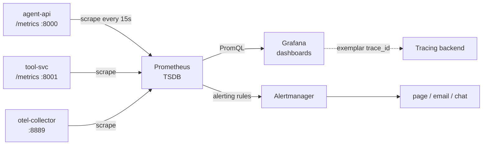

# Metrics with Prometheus and Grafana

> **Interview answer (say this first).** A metric is a cheap, aggregated number over time. Prometheus scrapes a service's `/metrics` HTTP endpoint on an interval (the **pull model**), stores the samples in a time-series database, and lets you query them with **PromQL**. The four instrument types are **counter** (only goes up), **gauge** (goes up and down), **histogram** (bucketed observations, from which you compute percentiles), and **summary** (client-side quantiles). Labels slice a metric by dimension, but each label combination is a separate time series, so cardinality must stay bounded. Grafana reads Prometheus and draws dashboards; alerting rules evaluate PromQL and route through Alertmanager. For AI you track the RED signals (rate, errors, duration) plus tokens, cost, and quality.

## Why this exists

Logs and traces are per-event. They are precise and expensive. You cannot page on a log line per request, and you cannot answer "is error ratio rising?" by reading traces one by one.

Metrics answer trend questions cheaply. A counter incremented once per request compresses millions of events into a handful of numbers over time. You can then ask: what is the error ratio this hour versus last hour? Which model got slower? How much did we spend today? Those are aggregate questions, and aggregates are exactly what a time-series database is built for.

AI systems need metrics for the same reasons as any service, plus three of their own:

- **Cost is continuous.** Tokens and dollars accumulate per call. A counter per model and tenant turns an unpredictable bill into a chart you can alert on.
- **Quality drifts slowly.** A prompt change or a model upgrade can lower answer quality without throwing an error. You want those signals as numbers you can trend, not anecdotes.
- **Volume is huge.** An agent run can produce dozens of spans and fifty log lines. A single counter increment is the only thing cheap enough to record for every run.

The pull model matters too. Instead of every app pushing to a central system, Prometheus discovers targets and pulls from them. A service that stops responding simply stops producing samples, which makes "is it up?" (`up == 0`) a first-class signal.

> **Note:**
>
> **The one-sentence purpose.** Metrics compress millions of AI requests into bounded, labelled time series so you can chart trends, compute percentiles, and alert on rates without reading every event.

## Start from zero

| Word | Plain meaning |
| --- | --- |
| **Metric** | A named number over time, such as `agent_runs_total`. |
| **Sample** | One value of a metric at one timestamp. |
| **Time series** | All samples of one metric with one exact set of label values. |
| **Time-series database (TSDB)** | The store optimised for timestamped numbers; Prometheus has one built in. |
| **Counter** | A number that only increases (or resets to zero on restart). Use for counts of events. |
| **Gauge** | A number that can go up or down. Use for current values such as in-flight runs. |
| **Histogram** | Buckets of observed values; exposes `_bucket`, `_sum`, `_count`. Percentiles are computed from buckets at query time. |
| **Summary** | Client-side streaming quantiles; exposes `_sum`, `_count` and quantile series. Cannot be aggregated across instances. |
| **Label** | A key-value dimension on a metric, such as `model="gpt-4o"`. |
| **Cardinality** | How many distinct series exist: the product of the label values. |
| **Registry** | The in-process object that holds your instruments and renders `/metrics`. |
| **Exporter** | Something that exposes metrics for a system that does not emit them natively. |
| **Pull model** | Prometheus scrapes targets on an interval; targets just expose an endpoint. |
| **Scrape** | One collection round: an HTTP GET of `/metrics`. |
| **`scrape_interval`** | How often Prometheus scrapes, commonly 15 seconds. |
| **Pushgateway** | A place for short-lived batch jobs to deposit metrics for Prometheus to scrape. |
| **PromQL** | Prometheus Query Language, used in queries, recording rules, and alerts. |
| **`rate()`** | Per-second average increase of a counter over a range, handling resets. |
| **`increase()`** | Total increase of a counter over a range (the `rate` multiplied by seconds). |
| **`histogram_quantile()`** | Estimates a percentile from histogram buckets. |
| **Recording rule** | A PromQL expression pre-computed and stored as a new series. |
| **Alerting rule** | A PromQL condition plus a `for` duration that fires an alert. |
| **Alertmanager** | Routes, groups, silences, and inhibits alerts; Prometheus does not notify directly. |
| **Exemplar** | A sample trace ID attached to a metric point, linking a spike to a trace. |
| **RED** | Rate, Errors, Duration: the three core service signals. |
| **USE** | Utilization, Saturation, Errors: the three core resource signals. |
| **Grafana** | The visualisation layer that queries Prometheus and renders dashboards. |

Two clarifications that prevent most mistakes:

- **Histograms aggregate; summaries do not.** You can sum histogram buckets across instances to get a fleet-wide p95. You cannot meaningfully average or sum summary quantiles. For fleet dashboards, prefer histograms.
- **A label is not a filter you add later.** Each new label value creates a new series that costs storage and scrape time. Labels are part of the schema, and they must be bounded.

## The core idea

Think of a car dashboard. You do not read the engine log while driving; you glance at the speedometer, the fuel gauge, and the temperature light. Each instrument is one number that answers one question at a glance. The trip computer is the trend. The warning light is the alert.

Metrics are the dashboard of a service. The **counter** is the odometer (only forward). The **gauge** is the fuel level (up and down). The **histogram** is a set of speed bins so you can say "90% of trips were under an hour" without storing every trip.



Notice there is no push from the apps. They only answer a GET. That inversion is why the pull model is easy to reason about: if a target is down, `up == 0`, and the gap in the data is the alert.

The four instrument types, side by side:

| Type | Behaviour | Typical AI use | Key detail |
| --- | --- | --- | --- |
| **Counter** | Monotonic, resets on restart | `runs_total`, `failures_total`, `tokens_total`, `cost_usd_total` | Query with `rate()`/`increase()`, never compare raw values. |
| **Gauge** | Up and down | in-flight runs, queue depth, budget remaining | Meaningful as a raw value. |
| **Histogram** | Buckets + sum + count | run duration, TTFT, tokens per call | Percentiles via `histogram_quantile`; aggregatable. |
| **Summary** | Client-side quantiles + sum + count | legacy latency quantiles | Cannot be aggregated across instances. |

Naming conventions matter more than people expect. Counters end in `_total`, units go in the name (`_seconds`, `_bytes`, `_usd`), and the base unit should be seconds rather than milliseconds so `rate()` and dashboards are consistent.

The interview-safe sentence is: *"If it is a count of events, use a counter and query its rate; if it is a duration, use a histogram and query a quantile; if it is a current level, use a gauge."*

## How it works

Follow a model call from instrumentation to an alert.

1. **Create instruments once at import or startup.** A `Counter`, `Histogram`, or `Gauge` is registered in a registry. Creating one per request leaks memory and breaks the scrape.
2. **Record events.** `counter.inc()` for an event, `histogram.observe(seconds)` for an observation, `gauge.set(n)` for a current level. Include a small, bounded label set.
3. **Expose `/metrics`.** The registry renders the current values in the text exposition format over HTTP.
4. **Prometheus scrapes the endpoint** on `scrape_interval`, attaching `job` and `instance` labels automatically.
5. **Samples go into the TSDB**, one series per label combination.
6. **PromQL queries the data.** `rate()` converts a counter into a per-second rate; `sum by (...)` aggregates; `histogram_quantile()` turns buckets into a percentile.
7. **Recording rules pre-compute** expensive queries on a schedule and store them as new series, so dashboards stay fast.
8. **Alerting rules evaluate** a PromQL expression on `evaluation_interval`; if it stays true for `for`, the alert fires.
9. **Alertmanager groups and routes** the alert to the right channel, and silences known maintenance.
10. **Grafana queries Prometheus** for dashboards, and a click on a spike can jump to an exemplar trace.

The two failure points are step 1 and step 5. Instruments created per request cause unbounded memory. Labels with unbounded values, such as `run_id` or `user_id`, cause unbounded series and a slow or dead TSDB.

## The syntax you will use

**A counter, a gauge, and a histogram.** Register once; increment or observe at the event.

```python
from prometheus_client import Counter, Gauge, Histogram

runs = Counter("agent_runs_total", "Agent runs", ["model", "status"])
failures = Counter("agent_run_failures_total", "Failed runs", ["model", "error_class"])
in_flight = Gauge("agent_runs_in_flight", "Currently running agents")
duration = Histogram(
    "agent_run_duration_seconds", "Run duration", ["model"],
    buckets=(0.5, 1, 2, 5, 10, 30, 60),
)

runs.labels(model="gpt-4o", status="ok").inc()
in_flight.inc()                   # on start
duration.labels(model="gpt-4o").observe(1.4)
in_flight.dec()                   # on finish
```

**Buckets must be chosen for your latency range.** The default buckets are tuned for seconds-scale web requests; AI calls are often slower.

```python
Histogram("agent_ttft_seconds", "Time to first token",
          buckets=(0.1, 0.25, 0.5, 1, 2, 5, 10))       # streaming TTFT
Histogram("gen_ai_client_token_usage", "Tokens per call",
          ["gen_ai_token_type", "gen_ai_request_model"],
          buckets=(10, 50, 100, 500, 1000, 5000, 20000))
```

**PromQL: rates and error ratio.** The ratio is the number you alert on.

```promql
# runs per second, by status
sum by (status) (rate(agent_runs_total[5m]))

# error ratio (0..1)
sum(rate(agent_run_failures_total[5m]))
  / sum(rate(agent_runs_total[5m]))
```

**PromQL: p95 and p99 latency.** Aggregate by `le` inside, then apply `histogram_quantile`.

```promql
histogram_quantile(
  0.95,
  sum by (le, model) (rate(agent_run_duration_seconds_bucket[5m]))
)
```

**PromQL: token and cost rates.** `_sum` gives total tokens; multiply the cost counter's rate for spend.

```promql
# input and output tokens per second
sum by (gen_ai_token_type) (rate(gen_ai_client_token_usage_sum[5m]))

# USD per hour
sum(rate(agent_cost_usd_total[1h])) * 3600
```

**A recording rule keeps dashboards fast.** Same expression, stored as a new series with a clear name.

```yaml
groups:
  - name: ai-recording
    rules:
      - record: agent:error_ratio:ratio5m
        expr: |
          sum(rate(agent_run_failures_total[5m]))
            / sum(rate(agent_runs_total[5m]))
```

**An alerting rule with `for` and annotations.** Prometheus fires; Alertmanager routes.

```yaml
groups:
  - name: ai-reliability
    rules:
      - alert: AgentHighErrorRatio
        expr: |
          sum(rate(agent_run_failures_total[5m]))
            / sum(rate(agent_runs_total[5m])) > 0.05
        for: 10m
        labels: { severity: page }
        annotations:
          summary: "Agent error ratio above 5% for 10m"
```

**The scrape configuration.** This is how Prometheus finds your service.

```yaml
scrape_configs:
  - job_name: "agent-api"
    metrics_path: /metrics
    static_configs:
      - targets: ["agent-api:8000"]
```

**Grafana dashboard panels are JSON.** Queries live in `targets`; this is the file you version in Git.

```json
{
  "title": "AI Agent — RED Dashboard",
  "panels": [
    {
      "id": 1,
      "title": "Error ratio by model",
      "type": "timeseries",
      "targets": [
        {
          "expr": "sum by (model) (rate(agent_run_failures_total[5m])) / sum by (model) (rate(agent_runs_total[5m]))"
        }
      ]
    }
  ]
}
```

## Examples: simple to real

**Example 1 — what `/metrics` actually looks like.** The exposition format is plain text, one series per line.

```text
agent_runs_total{model="gpt-4o",status="ok"} 1.0
agent_run_failures_total{error_class="timeout",model="gpt-4o"} 1.0
agent_runs_in_flight 3.0
agent_run_duration_seconds_bucket{le="0.5",model="gpt-4o"} 0.0
agent_run_duration_seconds_bucket{le="1.0",model="gpt-4o"} 0.0
agent_run_duration_seconds_bucket{le="2.0",model="gpt-4o"} 1.0
agent_run_duration_seconds_bucket{le="5.0",model="gpt-4o"} 2.0
agent_run_duration_seconds_bucket{le="+Inf",model="gpt-4o"} 2.0
agent_run_duration_seconds_count{model="gpt-4o"} 2.0
agent_run_duration_seconds_sum{model="gpt-4o"} 4.6
```

Histogram buckets are **cumulative**: `le="5.0"` counts everything up to five seconds, including the ones counted at `le="2.0"`. The `+Inf` bucket equals the count.

**Example 2 — computing p95 from buckets.** The same interpolation Prometheus does with `histogram_quantile`.

```python
import math

def histogram_quantile(q, buckets):
    total = buckets[-1][1]                    # +Inf bucket = total count
    rank = q * total
    for i, (le, count) in enumerate(buckets):
        if count >= rank:
            prev_le, prev_count = buckets[i - 1] if i > 0 else (0.0, 0)
            if math.isinf(le):
                return prev_le
            frac = (rank - prev_count) / (count - prev_count) if count > prev_count else 0
            return prev_le + (le - prev_le) * frac
    return buckets[-1][0]

print(round(histogram_quantile(0.95, [(0.5, 0), (1, 1), (2, 3), (5, 4), (float("inf"), 4)]), 1))
# 4.4
```

The estimate is only as good as the bucket boundaries. Buckets are linear interpolation, so a wide bucket gives a coarse percentile.

**Example 3 — an error ratio over a time window.** Divide two rates so the result is a unitless ratio.

```promql
sum(rate(agent_run_failures_total[5m]))
  / sum(rate(agent_runs_total[5m]))
```

If 50 runs fail out of 1,000 in five minutes, this is `0.05`. The ratio is what you page on, because it stays meaningful when traffic changes.

**Example 4 — tokens per second by type, from one histogram.** This is the chart that explains both cost and context pressure.

```promql
sum by (gen_ai_token_type) (rate(gen_ai_client_token_usage_sum[5m]))
```

Input tokens climbing while output tokens stay flat usually means context is growing: longer chats or more retrieved documents.

**Example 5 — a complete alerting rule file.** Validated YAML; `for` prevents flapping on a single bad evaluation.

```yaml
groups:
  - name: ai-reliability
    rules:
      - alert: AgentP95LatencyHigh
        expr: |
          histogram_quantile(
            0.95,
            sum by (le, model) (rate(agent_run_duration_seconds_bucket[5m]))
          ) > 10
        for: 10m
        labels:
          severity: warning
        annotations:
          summary: "p95 agent latency above 10s for {{ $labels.model }}"

      - alert: AgentRunawayRate
        expr: |
          sum(rate(agent_runaways_total[15m]))
            / sum(rate(agent_runs_total[15m])) > 0.01
        for: 15m
        labels:
          severity: page
        annotations:
          summary: "More than 1% of agent runs hit a step or budget cap"
```

**Example 6 — a RED/USE-style AI dashboard.** The panels an on-call engineer actually opens.

```text
RED (the service):
  Rate       sum(rate(agent_runs_total[5m])) by (model)
  Errors     error ratio by model and error_class
  Duration   p50 / p95 / p99 run duration, plus TTFT for streaming

AI additions:
  Tokens     input/output tokens per second by model
  Cost       USD per hour, and USD per tenant tier
  Quality    judge score average, refusal rate, retrieval hit rate
  Behaviour  runaways per minute, retries, tool-call count per run

USE (the resources):
  Utilization   GPU memory and compute, model-server queue depth
  Saturation    requests waiting, token-bucket queue
  Errors        model-server 5xx and timeouts
```

RED covers the request path; USE covers the hardware. AI adds tokens, cost, quality, and agent behaviour. If a panel does not change a decision, delete it.

## In production

- **Never put `run_id`, `user_id`, `tenant_id`, or a raw prompt in a label.** Each unique value becomes a permanent series. Use `model`, `tool`, `error_class`, `status`, and a bounded `tenant_tier`. High-cardinality detail belongs in logs and traces.
- **Keep the total series count in budget.** Roughly, series ≈ metrics × label combinations × instances. A careless `path` or `query` label can multiply it by thousands and slow every query.
- **Use `rate()` on counters, never raw values.** Raw counters are cumulative and reset on restart, so their values are meaningless for thresholds. `rate()` and `increase()` handle resets correctly.
- **Choose histogram buckets for the real distribution.** Default buckets are often wrong for LLM latency. Put more buckets in the range where your p95 lives; wide buckets give misleading percentiles.
- **Prefer histograms over summaries for fleet metrics.** Summaries cannot be aggregated across instances, so you cannot compute a global p95. Use summaries only for single-instance, client-side quantiles.
- **Alert on ratios and quantiles with a `for` window.** `error ratio > 0.05 for 10m` beats a raw error count, which fires forever once a counter crosses a number. Add a minimum traffic condition so a quiet period does not page.
- **Separate `page` from `warning`.** Route severity through Alertmanager labels. A warning should show up in a channel; a page should wake someone. If everything pages, nothing does.
- **Group and inhibit in Alertmanager.** One provider outage should produce one grouped alert, not one per model or per tenant. Inhibition silences secondary alerts while the cause is firing.
- **Version dashboards and alerts as code.** Store the Grafana JSON and the rule YAML in Git, review them like code, and deploy them together. Clicking dashboards into a UI drifts and cannot be reviewed.
- **Watch scrape gaps.** A target that is down, slow, or firewalled produces stale or missing samples. `up == 0` and `scrape_duration_seconds` catch collection problems that look like quiet traffic.
- **Beware counter resets on deploy.** Pods restart and counters reset to zero. `rate()` and `increase()` account for the reset; a raw `delta()` does not.
- **Link exemplars to traces.** Record histograms inside a span so the SDK attaches the trace ID, and a latency spike on the chart becomes a click through to a real run.

## Interview questions

### 1. What is the difference between a counter, a gauge, a histogram, and a summary?

**Answer.** A counter only increases (and resets on restart) and counts events. A gauge goes up and down and shows a current level. A histogram stores observations in cumulative buckets plus a sum and count, so you can compute percentiles at query time and aggregate across instances. A summary computes quantiles client-side and exposes them directly; it is cheaper to query but cannot be aggregated across instances. Use counters for events, gauges for levels, histograms for durations and sizes, and summaries only when one instance owns the data.

**Follow-up: "Which would you use for model latency?"** A histogram, because you want p95 and p99 across the whole fleet, and histograms aggregate while summaries do not.

**Trap.** Using a gauge as a counter, or a counter for a value that can decrease. The type must match the behaviour or your queries will be wrong.

### 2. Why does Prometheus pull instead of letting apps push?

**Answer.** Pull makes the health of the collection itself observable: if a target stops responding, `up` becomes 0 and the gap in samples is the signal. It also centralises scrape configuration, so you can change intervals or targets without redeploying apps, and it avoids every app needing a durable network path to the monitoring system. Targets just expose an HTTP endpoint.

**Follow-up: "When do you need a push?"** Short-lived batch jobs that may finish before a scrape can push to a Pushgateway, and some serverless platforms cannot be scraped, so they push or export through a gateway.

**Trap.** Using Pushgateway for long-running request metrics. It never expires series, so stale label combinations persist and corrupt aggregates.

### 3. What is label cardinality, and why does it break Prometheus?

**Answer.** A time series is one metric with one exact set of label values. Cardinality is the number of distinct combinations. Each combination costs memory and disk and slows queries. A label with unbounded values, such as `run_id`, `user_id`, or a raw URL, creates a new series for every value, so a busy service can generate millions of series and overwhelm the TSDB.

**Follow-up: "How do you debug a high-cardinality metric?"** Look at the number of series per metric (`count by (__name__)` style analysis or the TSDB status page), find labels with many values, and move that dimension to logs or traces.

**Trap.** Adding a helpful-looking label like `tenant_id` "just for filtering". If you need per-tenant analysis, keep a small `tenant_tier` label and join to logs by tenant.

### 4. How do you compute a p95 latency for an AI service?

**Answer.** Record a histogram of durations. Query `histogram_quantile(0.95, sum by (le) (rate(agent_run_duration_seconds_bucket[5m])))`. You must aggregate the buckets by `le` before applying the quantile function; otherwise you are combining mismatched buckets. Choose bucket boundaries around your real latency range, because the result is interpolated within a bucket.

**Follow-up: "Why not compute the average latency?"** Averages hide the slow tail. Users remember the slow requests, and an average can improve while the tail gets worse.

**Trap.** Forgetting to aggregate by `le`, or using a summary and then trying to combine instances. Both give wrong or impossible results.

### 5. How do you alert on error rate without flapping?

**Answer.** Alert on the ratio over a window with a `for` duration: `sum(rate(failures[5m])) / sum(rate(runs[5m])) > 0.05 for: 10m`. The window smooths noise; `for` requires the condition to hold across several evaluations. Add a minimum traffic guard so a single failure in a quiet period does not fire, and set severity labels so warnings do not page.

**Follow-up: "What is a symptom-based alert?"** One based on the user-visible effect — runs failing, runs slow, spend high — rather than on an internal cause like CPU. It stays correct as the architecture changes.

**Trap.** Alerting on a raw counter or on a single sample. The counter only grows, and one spike is noise.

### 6. What are RED and USE, and how do you apply them to AI?

**Answer.** RED is Rate, Errors, Duration — the three signals of a request-driven service, applied to runs and to each model or tool. USE is Utilization, Saturation, Errors — the three signals of a resource, applied to GPUs, model servers, and queues. For AI you chart RED for the agent surface and add tokens, cost, quality, and agent behaviour such as runaways and retries; you chart USE for the model-serving hardware and its queues.

**Follow-up: "Which panels belong on the first dashboard?"** Rate, error ratio, and p95 latency by model, plus cost per hour and runaway rate. Everything else is a second dashboard.

**Trap.** Building a 60-panel dashboard. Nobody reads it. Start with the alerts you would act on, and add a panel only when a question repeats.

### 7. What is the difference between an alerting rule and a recording rule?

**Answer.** A recording rule pre-computes a PromQL expression on a schedule and stores it as a new series, which makes dashboards fast and keeps repeated expressions consistent. An alerting rule also evaluates a PromQL expression, but on a true result for `for` duration it fires an alert to Alertmanager, which routes it. Both live in rule files and are evaluated by Prometheus.

**Follow-up: "Why use recording rules for AI metrics?"** Error ratio and p95 over several label combinations are expensive to compute on every dashboard load. Pre-computing them once keeps Grafana responsive and gives alerts and dashboards the same definition.

**Trap.** Duplicating logic: a dashboard defines error ratio one way and the alert another. They disagree at 3am. Share a recording rule.

### 8. Where do traces and metrics meet?

**Answer.** At exemplars and correlation IDs. When you record a histogram observation inside a span, the OpenTelemetry SDK can attach the current trace ID as an exemplar on that data point. Grafana can show the exemplar on the chart, so a p95 spike links to a real trace of a slow run. Separately, the `trace_id` in logs links log detail to the same trace. Metrics find the problem, traces locate the run, logs explain it.

**Follow-up: "What if your metrics are not from OpenTelemetry?"** You can still correlate by request ID: put a request ID in both the log line and the trace, and use the metric's time window to narrow which requests to inspect.

**Trap.** Building metrics and traces with different identifiers, so nothing links and every investigation starts from scratch.

## Remember this

- **Counter for events, gauge for levels, histogram for durations, summary only when one instance owns the data.**
- **Prometheus pulls `/metrics`; `rate()` on counters, `histogram_quantile` on buckets, ratios for alerts.**
- **Cardinality is the killer:** never label by `run_id`, `user_id`, or raw prompts; keep labels bounded.
- **Alert on ratios and quantiles with `for` windows**, route severities through Alertmanager, and version dashboards as code.
- **RED for the service, USE for the resources, plus tokens, cost, quality, and runaways for AI.**
