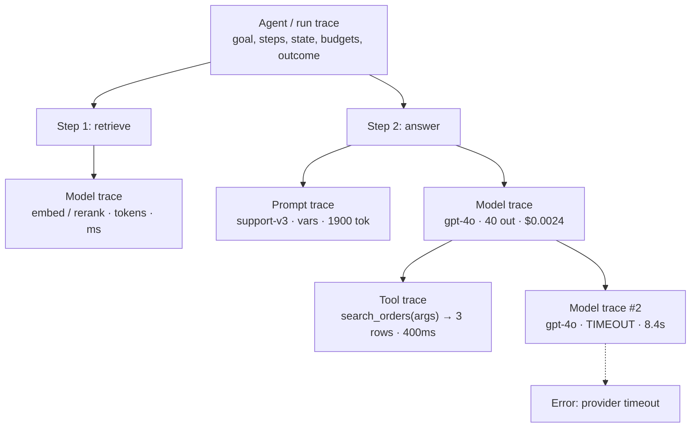

# Agent, Prompt, Tool, and Model Traces

> **Interview answer (say this first).** You debug an agent at four nesting levels. The **agent (or run) trace** is the whole task: the goal, the ordered steps, the decisions, the state, the budgets, and the final outcome. Inside each step, the **prompt trace** captures what the model was actually sent (template name and version, variables, token count, and a hash or gated copy of the rendered prompt), the **model trace** captures what came back (model, parameters, input and output tokens, latency, cost, finish reason), and the **tool trace** captures what the agent did in the world (tool name, arguments, result, duration, errors, retries). Nesting makes causation visible: a tool span under a model span under a step under the run. To debug one bad run, open the run trace and walk the tree to the first error or the slowest span.

## Why this exists

A single error message rarely explains an agent failure. The interesting questions are structural: which model call chose the wrong tool, what arguments did it send, what did the tool return, and did the next model call see a malformed result? That is a chain, and a chain is what a four-level trace records.

The levels matter because each failure class shows up at a different one:

- The answer is wrong but every step succeeded. The problem is in the **prompt** or the **model** call.
- A step failed loudly. The likely cause is the **tool** or its arguments.
- The run drifted through twelve steps and hit a cap. The problem is the **agent loop** and its stopping logic.
- The output is fine but the bill tripled. The **model trace** shows the token growth that no error would reveal.

Without the levels you get a flat pile of logs and spans and you reconstruct the hierarchy by hand. With the levels, the hierarchy is the data, and the waterfall is the diagnosis.

AI-specific tracing also has to handle content carefully. The prompt and completion are the most useful fields for debugging and the most dangerous to store. A good design separates the metadata trace, which is always captured, from the content capture, which is gated, hashed, access-controlled, and short-lived.

> **Note:**
>
> **The one-sentence purpose.** The four levels turn "the agent gave a bad answer" into a walkable tree: run, prompt, model, and tool (with `step` as the loop container), each with the fields needed to explain its part.

## Start from zero

| Word | Plain meaning |
| --- | --- |
| **Agent trace / run trace** | The whole task: goal, steps, decisions, state, budgets, final output, status. The root. |
| **Step** | One observe-reason-act cycle in the agent loop: usually one model call plus the tool work that follows. |
| **Prompt trace** | The record of what the model was sent: template identity, variables, rendered form, token count. |
| **Model trace** | The record of one model call: model, provider, parameters, tokens, latency, cost, finish reason. |
| **Tool trace** | The record of one tool invocation: name, arguments, result, duration, error, retries. |
| **Trajectory** | The ordered list of steps, model calls, tool calls, and results for one run. |
| **Span** | The OpenTelemetry unit of work; each level is one or more spans. |
| **Nesting** | Child spans sit inside parents, so causation is explicit. |
| **Prompt template version** | The identity of the prompt as code, such as `support-v3` at commit `v3.2`. |
| **Rendered prompt** | The template after variables are filled in: the exact text the model saw. |
| **Token count** | Input and output tokens, the unit of cost and of context-window pressure. |
| **TTFT** | Time to first token; the latency a streaming user actually feels. |
| **Cost** | Tokens multiplied by the model's per-token price, logged per call and summed per run. |
| **Finish reason** | Why generation stopped: `stop`, `length`, `tool_calls`, `content_filter`. |
| **Tool arguments** | The JSON the model produced for the tool, which is a common source of failure. |
| **Tool result** | What the tool returned, which becomes the next model's observation. |
| **State** | The agent's working memory: messages, scratchpad, retrieved documents, variables. |
| **Correlation ID** | The run ID or trace ID shared by every level, so they join. |
| **Replay** | Re-running a recorded trajectory, usually from a checkpoint, to reproduce a failure. |
| **Redaction** | Removing secrets and PII from captured content before storage. |

Two clarifications that matter:

- **Run, step, and model call are not the same count.** One run has many steps; one step can have one or more model calls and several parallel tool calls.
- **A prompt trace is not the prompt text.** It is the metadata about the prompt plus an optional, gated copy. Default to metadata.

## The core idea

Think of a hospital visit. The **run trace** is the whole admission: why the patient came, which departments they visited, and how they left. Each **step** is one department visit. Inside it, the **prompt trace** is the chart note the doctor wrote, the **model trace** is the doctor's decision, and the **tool trace** is the lab test or the prescription actually carried out. If the outcome is wrong, you read down the levels: was the note wrong, was the decision wrong, or did the lab bungle the test?



Read the nesting outward: the timeout happened at the model level, after a successful tool call, in the second step of the run. That sentence is the entire value of the four levels.

A compact view of what each level must capture:

| Level | Answers | Must-capture fields |
| --- | --- | --- |
| **Agent / run** | Did the task succeed, and how did it get there? | goal, steps, state, budget, outcome, status |
| **Prompt** | What exactly did the model see? | template name + version, variables, rendered hash, tokens |
| **Tool** | What did the agent do in the world? | name, arguments, result, duration, error, retries |
| **Model** | What did the model return? | model, params, tokens, latency, cost, finish reason |

The interview-safe sentence is: *"The run trace tells me the story, and the prompt, model, and tool traces tell me which sentence was wrong."*

## How it works

Follow one run from start to the diagnosis.

1. **Start the run span.** Record the goal, tenant, agent name and version, and the correlation ID. This is the root.
2. **Open a step span** for each loop iteration, with the step index and the current state size.
3. **Render the prompt and record a prompt trace.** Capture the template name, template version or commit, the variable keys and lengths, the rendered prompt's hash, and the rendered token count.
4. **Call the model inside a model span.** Set the provider, model, parameters, and request metadata before the call; set input tokens, output tokens, latency, TTFT, cost, and finish reason after it.
5. **If the model requests tools, open a tool span per call.** Record the tool name, argument keys and a redacted summary, the result summary, duration, error class, and retry count. Nest it under the model span that requested it.
6. **Append the tool result to the state** and loop. The next step span shows the newly grown context.
7. **Repeat until the model answers without a tool call, or a cap fires.** Record the stop reason: `answered`, `max_steps`, `deadline`, `budget`, or `error`.
8. **Close the run span** with the final status, total tokens, total cost, step count, and tool-call count.
9. **Correlate everything** with the same `trace_id`: run, step, prompt, model, and tool spans all carry it, and the logs carry it too.
10. **Query and walk the tree.** Filter traces by status, tenant, model, or duration; open a bad one and walk from the root to the failing leaf.
11. **Decide the level of the fix.** Prompt-level fixes change the template; tool-level fixes change the schema or the implementation; model-level fixes change parameters, routing, or timeouts; run-level fixes change the loop, budgets, or stopping logic.

Steps 3 and 4 are what most teams skip, and they are exactly the levels that explain quality bugs. A wrong answer with healthy spans is almost always a prompt or model issue.

## The syntax you will use

**A four-level data model.** Small dataclasses keep the levels explicit and let you render a waterfall.

```python
from dataclasses import dataclass, field
from typing import Any

@dataclass
class Span:
    span_id: str
    parent_id: str | None
    name: str
    kind: str                      # run | step | prompt | tool | model
    start_ms: float
    end_ms: float
    attributes: dict[str, Any] = field(default_factory=dict)
    events: list[str] = field(default_factory=list)
    status: str = "UNSET"          # UNSET | OK | ERROR

    @property
    def duration_ms(self) -> float:
        return self.end_ms - self.start_ms
```

**Record the run's outcome and budget.** The root span is the summary an on-call engineer reads first.

```python
run_attrs = {
    "agent.name": "support-agent",
    "agent.version": "1.4.0",
    "tenant": "acme",
    "goal.hash": "9f2c...",
    "stop_reason": "error",          # answered | max_steps | deadline | budget | error
    "steps": 2,
    "tool_calls": 1,
    "input_tokens": 2712,
    "output_tokens": 40,
    "cost_usd": 0.00718,
}
```

**Record a prompt trace without storing the prompt.** Template identity plus a hash gives you reproducibility without the content.

```python
prompt_attrs = {
    "prompt.template": "support-v3",
    "prompt.template_version": "v3.2",
    "prompt.variable_keys": ["question", "retrieved_docs", "tools"],
    "prompt.rendered_sha256_prefix": "9f2c1a...",   # stable identity for the exact text (truncated hash)
    "prompt.rendered_tokens": 1900,
    "prompt.content_captured": False,        # flip only under an explicit debug policy
}
```

**Record a model trace.** Set request attributes before the call and response attributes after it.

```python
model_attrs = {
    "gen_ai.provider.name": "openai",
    "gen_ai.request.model": "gpt-4o",
    "gen_ai.request.temperature": 0.2,
    "gen_ai.request.max_tokens": 1024,
    "gen_ai.response.finish_reasons": ["tool_calls"],
    "gen_ai.usage.input_tokens": 812,
    "gen_ai.usage.output_tokens": 40,
    "gen_ai.response.model": "gpt-4o-2024-08-06",
    "latency_ms": 3800,
    "ttft_ms": 420,
    "cost_usd": 0.00243,
}
```

**Record a tool trace with safe argument and result summaries.** Log argument keys and sizes by default, not raw payloads.

```python
tool_attrs = {
    "gen_ai.tool.name": "search_orders",
    "gen_ai.tool.type": "function",
    "tool.arg_keys": ["customer_id"],
    "tool.arg_sha256": "ab41...",
    "tool.ok": True,
    "tool.result_count": 3,
    "tool.duration_ms": 400,
    "tool.retries": 0,
}
```

**Nest the levels with OpenTelemetry.** The context is implicit: each `with` block nests inside the current span.

```python
with tracer.start_as_current_span("agent.run") as run:
    run.set_attribute("agent.name", "support-agent")
    for step in range(max_steps):
        with tracer.start_as_current_span(f"step {step}") as step_span:
            with tracer.start_as_current_span("render_prompt") as prompt_span:
                prompt_span.set_attribute("prompt.template_version", "v3.2")
            with tracer.start_as_current_span("chat gpt-4o", kind=SpanKind.CLIENT) as model:
                ...
                with tracer.start_as_current_span("execute_tool search_orders"):
                    ...
```

**Mark the first failure, not every consequence.** Record the root cause once and let parent spans stay deterministic.

```python
span.record_exception(exc)
span.set_attribute("error.type", "provider_timeout")
span.set_status(Status(StatusCode.ERROR, "model call timed out"))
```

## Examples: simple to real

**Example 1 — build a run with all four levels and print the waterfall.**

```python
from dataclasses import dataclass, field
from typing import Any

@dataclass
class Span:
    span_id: str
    parent_id: str | None
    name: str
    kind: str
    start_ms: float
    end_ms: float
    attributes: dict[str, Any] = field(default_factory=dict)
    status: str = "UNSET"

    @property
    def duration_ms(self) -> float:
        return self.end_ms - self.start_ms

@dataclass
class Run:
    spans: list[Span] = field(default_factory=list)
    def walk(self, parent=None, depth=0):
        for s in sorted((x for x in self.spans if x.parent_id == parent), key=lambda x: x.start_ms):
            print("  " * depth + f"{s.kind:6} {s.name:30} {s.duration_ms:7.1f}ms {s.status}")
            self.walk(s.span_id, depth + 1)

run = Run([
    Span("s1", None, "POST /ask", "run", 0, 14200, status="ERROR"),
    Span("s2", "s1", "retrieve_documents", "step", 10, 1110),
    Span("s7", "s1", "answer", "step", 1150, 14100),
    Span("s3", "s7", "chat gpt-4o", "model", 1200, 5000, status="OK"),
    Span("s4", "s3", "execute_tool search_orders", "tool", 5100, 5500),
    Span("s6", "s7", "render_prompt", "prompt", 5600, 5610),
    Span("s5", "s7", "chat gpt-4o #2", "model", 5600, 14000, status="ERROR"),
])
run.walk()
```

Output:

```text
run    POST /ask                      14200.0ms ERROR
  step   retrieve_documents              1100.0ms UNSET
  step   answer                         12950.0ms UNSET
    model  chat gpt-4o                     3800.0ms OK
      tool   execute_tool search_orders       400.0ms UNSET
    prompt render_prompt                     10.0ms UNSET
    model  chat gpt-4o #2                  8400.0ms ERROR
```

The second model call is 8.4 seconds and errored. In one view you know the step, the level, and the duration of the failure.

**Example 2 — a model trace as a cost record.** Cost is an attribute, so the run total is a sum.

```python
model_spans = [
    {"model": "gpt-4o", "input_tokens": 812, "output_tokens": 40, "cost_usd": 0.00243},
    {"model": "gpt-4o", "input_tokens": 1900, "output_tokens": 0, "cost_usd": 0.00475},
]
print("run cost:", round(sum(s["cost_usd"] for s in model_spans), 5))   # 0.00718
print("run tokens:", sum(s["input_tokens"] + s["output_tokens"] for s in model_spans))  # 2752
```

Input tokens grew from 812 to 1,900 between the two calls. That growth is the agent appending tool results to the context, and it is why long runs get expensive.

**Example 3 — a tool trace that records failure cleanly.** Capture the error class, not just a boolean.

```python
def tool_trace(name, args, fn):
    try:
        result = fn(**args)
        return {"tool": name, "ok": True, "duration_ms": 12.0,
                "result_count": len(result) if hasattr(result, "__len__") else 1}
    except Exception as exc:
        return {"tool": name, "ok": False, "duration_ms": 12.0,
                "error_class": type(exc).__name__}

def search_orders(customer_id):
    raise TimeoutError("db timeout")

print(tool_trace("search_orders", {"customer_id": "c-42"}, search_orders))
# {'tool': 'search_orders', 'ok': False, 'duration_ms': 12.0, 'error_class': 'TimeoutError'}
```

`error_class` is queryable, so "show me every run where `search_orders` timed out" is one filter instead of a text search.

**Example 4 — a prompt trace with a hash, no content.** The hash proves two runs used the same text without storing it.

```python
import hashlib

template = "Answer for {question}. Context: {docs}"
rendered = template.format(question="Where is my order?", docs="<3 rows>")
digest = hashlib.sha256(rendered.encode()).hexdigest()[:16]

prompt_trace = {
    "prompt.template_version": "v3.2",
    "prompt.rendered_sha256_prefix": digest,
    "prompt.rendered_tokens": 1900,
    "prompt.content_captured": False,
}
print(prompt_trace)
# {'prompt.template_version': 'v3.2', 'prompt.rendered_sha256_prefix': '...', 'prompt.rendered_tokens': 1900, 'prompt.content_captured': False}
```

If a bad run's hash differs from the tested hash, the prompt changed. If it matches, the prompt is not the cause.

**Example 5 — correlate every level with one trace ID, including the step container.** Every span carries the same ID, so one query returns the whole tree.

```python
trace_id = "4bf92f3577b34da6a3ce929d0e0e4736"
levels = [
    {"level": "run", "run_id": "run-42", "trace_id": trace_id},
    {"level": "step", "step": 2, "trace_id": trace_id},          # the loop container, not a fifth level
    {"level": "prompt", "template_version": "v3.2", "trace_id": trace_id},
    {"level": "model", "model": "gpt-4o", "trace_id": trace_id},
    {"level": "tool", "tool": "search_orders", "trace_id": trace_id},
]
print(sorted({r["level"] for r in levels}))   # ['model', 'prompt', 'run', 'step', 'tool']: four levels + the step container
print(all(r["trace_id"] == trace_id for r in levels))     # True
```

The same `trace_id` in the logs means a log line also joins the tree.

**Example 6 — debug one bad run by walking to the first error.** This is the routine you should describe in an interview.

```python
def first_error(run):
    # Exclude the root span: it is marked ERROR only because a child failed.
    errors = [s for s in run.spans if s.status == "ERROR" and s.parent_id is not None]
    errors.sort(key=lambda s: s.start_ms)
    return errors[0] if errors else None

run = Run([
    Span("s1", None, "POST /ask", "run", 0, 14200, status="ERROR"),
    Span("s2", "s1", "retrieve_documents", "step", 10, 1110),
    Span("s3", "s1", "answer", "step", 1150, 14100),
    Span("s5", "s3", "chat gpt-4o #2", "model", 5600, 14000,
         {"error_type": "provider_timeout"}, status="ERROR"),
    Span("s6", "s3", "render_prompt", "prompt", 5600, 5610),
])
bad = first_error(run)
print(bad.name, bad.kind, bad.attributes.get("error_type"))
# chat gpt-4o #2 model provider_timeout
```

The failed model span has `error_type=provider_timeout`, and the prompt span in the same step succeeded in 10ms. The prompt is exonerated; the provider timeout is the cause. That is a two-minute investigation instead of a log hunt.

## In production

- **Always capture metadata at all four levels; capture content only behind an explicit policy.** Prompt and completion text is the most sensitive data in the system. Default to hashes and token counts.
- **Nest spans to make causation explicit.** A tool span must be a child of the model span that requested it, not a sibling. Siblings lose the "which model call caused this" link.
- **Put the same `trace_id` on run, step, prompt, model, and tool spans, and on every log line.** Correlation is the difference between a tree and a pile.
- **Record the prompt template version, not just the rendered text.** It is the field that tells you a prompt change caused a regression, and it is safe to log.
- **Log argument keys and sizes by default, not full tool arguments.** Tool payloads can contain PII and secrets. Keep a hash and a length; add a gated capture for debugging.
- **Set the stop reason on every run.** `answered`, `max_steps`, `deadline`, `budget`, or `error`. Without it, a truncated run looks like a successful one.
- **Watch input-token growth across steps.** It is the signature of context bloat and of cost blowouts, and it is visible only if every model span records tokens.
- **Record retries on the tool trace, not as extra runs.** A retried tool is still one logical action; counting it as a second run distorts success rates.
- **Do not trace every streamed token as a span.** Use one model span and events for first token and finish. Chunk-level spans explode cardinality and cost.
- **Cap the tree depth and the attribute size.** A looping agent can generate hundreds of nested spans. Set a span limit per run, and truncate large attribute values.
- **Keep content capture separate, access-controlled, and short-lived.** A flag that turns on prompt logging in production should also set a TTL and an audit trail. The safest default is off.
- **Replay from the trace.** A recorded trajectory with arguments and results lets you re-run the same path off line, which is how a production failure becomes a regression test.

## Interview questions

### 1. What are the four trace levels and what does each capture?

**Answer.** The agent (or run) trace is the whole task: goal, steps, decisions, state, budgets, and outcome. The prompt trace is what the model was sent: template name and version, variables, rendered hash and token count. The model trace is one call: provider, model, parameters, input and output tokens, latency, TTFT, cost, and finish reason. The tool trace is one tool invocation: name, arguments, result, duration, error, and retries. They nest, so the tree shows causation.

**Follow-up: "Which level do you reach for first when quality drops with no errors?"** The prompt trace, then the model trace. Healthy spans with bad output usually means the prompt changed or the model or parameters changed.

**Trap.** Treating a model call and an agent step as the same thing. One step can contain several model and tool calls, and the counts diverge.

### 2. How do you debug a single bad agent run?

**Answer.** Get the run's `trace_id` from the user's report or the request ID, open the run trace, and walk the tree. Find the first `ERROR` span or the slowest span. Read its attributes: for a model span, the provider timeout or finish reason; for a tool span, the error class and arguments; for a prompt span, the template version and rendered hash. Fix at the level where the first failure occurred, and use the rest of the tree to confirm the consequences rather than causes.

**Follow-up: "What if no span errored but the answer is wrong?"** Compare the prompt hash and template version against the known-good version, and inspect the tool arguments and results for a silently wrong value. The bug is semantic, not operational.

**Trap.** Fixing the last span that errored. Failures cascade; the first error in start-time order is the likely cause.

### 3. Why capture a prompt trace if you cannot safely store the prompt?

**Answer.** Because the metadata is safe and highly diagnostic: template name, template version or commit, variable names and lengths, rendered token count, and a hash of the rendered text. The hash tells you whether two runs used identical text without storing it, and the version tells you whether a deploy changed it. You still get reproducibility and regression detection, while the content stays out of the index.

**Follow-up: "When would you enable content capture?"** Only under an explicit, audited debug policy with access controls and a short retention, for a narrow time window or a specific tenant, never as the default.

**Trap.** Logging the rendered prompt "because the hash is not enough to debug". It is enough to tell you *whether* the prompt changed; a controlled replay tells you *why* it failed.

### 4. What fields make a tool trace useful?

**Answer.** The tool name and type, the argument keys and sizes (plus a hash), a result summary such as row count or a truncated preview, the duration, whether it succeeded, the error class when it did not, and the retry count. Also record which model call requested it, via the parent span. That set answers whether the tool was slow, wrong, or called with bad arguments.

**Follow-up: "Why record argument keys but not values?"** Keys tell you the model produced the right schema, which is a common failure. Values can contain PII and secrets, so capture them only under the gated policy.

**Trap.** Recording only a boolean success. A tool can succeed and return useless data, which is a semantic failure that only the result summary reveals.

### 5. How do the four levels nest, and why does nesting matter?

**Answer.** The run span is the root. Each step is a child. Within a step, prompt and model spans are children, and tool spans are children of the model span that requested them. Nesting encodes causation: a slow tool is only explainable if you know which model call asked for it and in which step. Flat, sibling spans lose that link and force you to guess from timings.

**Follow-up: "How is nesting represented?"** Each span has a parent span ID and a shared trace ID. In OpenTelemetry, starting a span while another is current makes it a child automatically, and context propagation carries the parent across services.

**Trap.** Starting tool spans at the top level because it is easier. The waterfall then shows no relationship between the model's decision and the action.

### 6. How do you keep token, cost, and latency data per level?

**Answer.** Record them on the model span, because that is where they are produced: input and output tokens, TTFT, total latency, and cost computed from the model's price table. Aggregate them up to the step and run spans as totals, and break them down by model and prompt version on the dashboard. Tool spans carry their own duration but no tokens. This gives one source of truth per number and lets you sum to any level.

**Follow-up: "Why compute cost at trace time rather than in the billing job?"** Because the price table can change and providers update models. Recording the computed cost at the time of the call, along with the exact model version, makes historical analysis reproducible.

**Trap.** Recording tokens only at the run level. You lose the per-step growth that explains where the context and the money went.

### 7. What is the difference between the trajectory and the trace?

**Answer.** The trajectory is the semantic path: the ordered steps, decisions, tool calls, and results that form the agent's behaviour. The trace is the operational record: spans with timings, attributes, and status. They usually map onto each other — a step is a span — but the trajectory is the thing you evaluate and replay, while the trace is the thing you observe and debug. Good tracing makes the trajectory reconstructible from spans.

**Follow-up: "Why does that distinction matter for evaluation?"** Evaluators score the trajectory (did it take the right steps?) while on-call engineers read the trace (why was it slow or broken?). One data model should serve both.

**Trap.** Recording only the final answer. Without the trajectory you cannot tell a lucky guess from correct reasoning.

### 8. How do you trace an agent that calls other services and runs background jobs?

**Answer.** Propagate context everywhere it leaves the process: inject the W3C `traceparent` header on HTTP and RPC calls, and carry the context in the message payload or headers for queues and background jobs. In the worker, extract it and start child spans. If a job is scheduled later and has no causal parent, start a new trace but record the originating `trace_id` as a link or an attribute so the relationship is still visible.

**Follow-up: "What about a fan-out to parallel tools?"** Start the parallel tool spans as siblings under the model span, so the waterfall shows them running concurrently, and always end the parent after all children. Use span links when the relationship is causal but not strictly parent-child.

**Trap.** Assuming context follows the work automatically. Queues, threads, and new async tasks all break the implicit chain unless you copy the context explicitly.

## Remember this

- **Four levels: run, prompt, model, and tool — with `step` as the loop container — each answers a different failure question.**
- **Nest the spans so causation is visible; walk to the first error, not the last.**
- **Capture metadata always, content only behind an explicit, short-lived, access-controlled policy.**
- **Record tokens, cost, latency, and finish reason on the model span**, and stop reason on the run.
- **One `trace_id` across every level and every log line** is what turns a pile into a tree.
