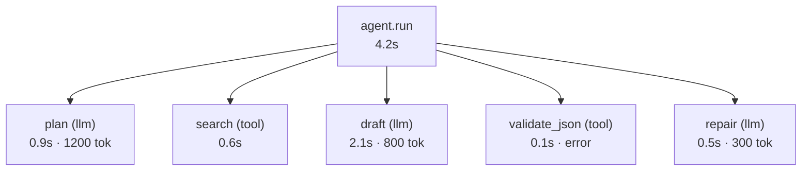

# LangSmith

> **Interview answer (say this first).** An LLM observability and evaluation platform gives you four things in one place: **traces** of every run, **datasets** of examples, **evaluators** that score outputs, and **experiments** that compare versions — plus **monitoring** of live traffic. LangSmith is a well-known example of such a platform. Under the hood a trace is a tree of spans, the same idea as OpenTelemetry, and most platforms can ingest or export OTel-style data. You use it to answer two questions fast: "what exactly happened inside this agent run?" and "is prompt v7 better than v6?". The build-versus-buy rule is simple: buy the storage and the UI, but own your instrumentation and your raw data.

## Why this exists

You ship an agent. A user says the answer was wrong. Now what?

With plain application logs you have a line that says `request completed in 3.2s`. That tells you almost nothing. You cannot see which prompt was used, which documents the retriever returned, which tools the agent called, how many tokens each step cost, or where in a five-step chain the reasoning went wrong. Debugging becomes archaeology with a flashlight.

Printing every prompt and every tool result to stdout does not scale either. The output is huge, unsearchable, and exposes user data in logs. A single agent run can contain ten model calls and twenty tool calls. You need a structure, not a wall of text.

There are five jobs that come up again and again, and they are related:

1. **Debug one bad run.** Open the exact trace and read every step.
2. **Find patterns across many runs.** Filter to runs that failed a check and compare them.
3. **Score outputs at scale.** Run automated evaluators over a set of examples instead of reading each one.
4. **Compare versions.** Run two prompts, two models, or two retrieval settings on the same data and see which wins.
5. **Watch production.** Track quality, latency, cost, and errors after launch.

A general logging stack can do part of this, but not all of it. You would have to build the trace tree viewer, the dataset store, the experiment runner, and the comparison UI yourself. An LLM observability platform exists to provide those pieces, wired together, on day one.

Scale makes the problem sharper. A modest agent product doing one thousand requests an hour, with ten spans each, produces ten thousand spans an hour — a quarter of a million a day. Most are boring, a few are gold. The platform's real value is not storing them; it is making the gold findable. Search by tag, filter by score, group by prompt version, and open the tree in one click. A logging stack gives you the bytes; a platform gives you the index and the questions.

> **Note.** The important word is **platform**, not brand. The pattern — traces plus datasets plus evaluators plus experiments plus monitoring — is what you are learning. LangSmith is one implementation; the concepts move with you.

## Start from zero

| Word | Plain meaning |
| --- | --- |
| **Trace** | The full record of one request from start to finish, including every nested step. |
| **Span** | One step inside a trace: a model call, a tool call, a retrieval, a parsing step. |
| **Run** | Another name for a trace, or for one span within it, depending on the tool. |
| **Parent/child** | Spans nest. A tool call inside an agent step is the child of that step. |
| **Trace tree** | The parent-child structure of all spans in one request. |
| **Metadata** | Key-value tags attached to a span: user id, session id, prompt version, model name. |
| **Tag** | A short label used to filter traces, such as `prod`, `experiment`, `tenant-acme`. |
| **Dataset** | A saved collection of inputs, and usually expected outputs, used for testing. |
| **Example** | One row of a dataset: an input and its expected behaviour. |
| **Evaluator** | A function that scores one output. It can be code, a model judge, or a person. |
| **Experiment** | One run of your application over a whole dataset, scored by evaluators. |
| **Feedback** | A score attached to a run after the fact, often from a user thumb or a reviewer. |
| **Annotation queue** | A list of runs waiting for a human to label them. |
| **Monitoring** | Charts of live traffic: volume, latency, cost, error rate, quality signals. |
| **Sampling** | Recording only a fraction of traces to control cost and volume. |
| **Instrumentation** | The code changes that create spans and send them to the platform. |
| **OpenTelemetry (OTel)** | A vendor-neutral standard for traces, metrics, and logs. |
| **SDK** | The library you import to instrument and send data. |
| **Project** | A named bucket that groups related traces in the platform. |
| **Vendor lock-in** | The cost of switching tools when your data is trapped in one vendor's format. |

Two distinctions do most of the work:

- **Trace vs experiment.** A trace is one real request. An experiment is your app run deliberately over a whole dataset so you can compare versions fairly.
- **Observability vs evaluation.** Observability is "what happened?". Evaluation is "was it good?". Traces give you both when you attach scores to them.

## The core idea

Think of a black-box flight recorder. When a plane has a problem, investigators do not guess. They open the recorder and replay the flight: every control input, every instrument reading, in order. An LLM trace is the flight recorder for one request.

Now add a lab. In the lab you run the same test flight many times with different settings and score each one. That is an **experiment** over a **dataset**. The flight recorder tells you what happened; the lab tells you which setting is better.

A trace is a tree. The root is the whole request. Its children are the big steps. Their children are the low-level calls.



Read the tree top-down to see latency and cost. Read it bottom-up to find the first step that went wrong. That single habit is most of trace debugging.

Here is how the platform's pieces fit together. This table is the topic on one screen.

| Piece | Question it answers | Built from |
| --- | --- | --- |
| **Tracing** | What happened in this run? | Spans sent by your SDK |
| **Datasets** | What examples do I test on? | Curated inputs and expected outputs |
| **Evaluators** | Was this output good? | Code checks, model judges, humans |
| **Experiments** | Which version is better? | App run over a dataset, scored |
| **Monitoring** | Is production healthy now? | Live traces, feedback, metrics |
| **Annotation** | What do humans think? | A queue of runs to label |

Where does the platform fit against building your own? Use this split as a rule of thumb.

| Capability | Build or buy | Reason |
| --- | --- | --- |
| **Span instrumentation** | Build (thin) | It is specific to your app and must live in your code. |
| **Trace storage and viewer** | Buy | Storage, indexing, and the tree UI are undifferentiated work. |
| **Trace tree navigation** | Buy | The single most expensive piece to build well. |
| **Dataset management** | Buy or own files | Small teams can keep JSON files in the repo. |
| **Evaluators and rubrics** | Build | They encode your quality bar and must be versioned with the app. |
| **Experiment runner** | Buy | Parallel execution, scoring, and comparison are repetitive glue. |
| **Comparison UI** | Buy | Another large UI to maintain. |
| **Raw data system of record** | Build/own | Your escape hatch against lock-in and the source for audits. |

The pattern is clear: buy the **storage and interface**, build the **judgment**. Instrumentation and evaluators are where your product's quality lives, so they belong in your repository and your review process.

## How it works

1. **Instrument runnable units.** Wrap each function you care about — an agent step, a model call, a tool call, a retrieval — so it emits a span. A decorator handles the common case; a context manager handles manual control.
2. **Propagate the trace context.** When a wrapped function calls another wrapped function, the SDK links them as parent and child automatically. This is what turns separate spans into one tree.
3. **Attach metadata.** Add `prompt_version`, `model`, `tenant`, `session_id`, and token counts. Without metadata you cannot filter or compare later.
4. **Send spans asynchronously.** The SDK batches and ships spans in the background so tracing adds little latency to the request. Sampling controls what fraction you keep.
5. **Read the trace tree.** Inspect inputs, outputs, latency, token usage, cost, and errors per span. This is your debugger.
6. **Promote interesting runs into a dataset.** When you find a good example or a real failure, save its input and the expected output as a dataset row.
7. **Define evaluators.** Write deterministic checks (valid JSON, exact match, contains citation) and model judges (correctness, helpfulness) for the fuzzy parts.
8. **Run an experiment.** Execute your current version over the dataset. Each example gets a score, and the experiment gets an average.
9. **Compare experiments.** Run a variant — new prompt, new model, new retriever — over the same dataset. Compare per-example and in aggregate; a higher average that breaks one slice is not a win.
10. **Close the loop.** Attach production feedback to live traces, watch monitoring, and add every confirmed failure to the dataset as a permanent regression case.

The relationship to OpenTelemetry deserves its own line. OTel defines a **vendor-neutral** data model: traces made of spans, with attributes, plus metrics and logs. LLM platforms usually provide an LLM-aware view on top of that model — prompts, completions, token counts, and evaluator scores are first-class. Many can accept OTLP (the OTel wire protocol) directly. The practical lesson: instrument to an open standard where you can, so the destination is replaceable.

## The syntax you will use

The snippets below show the **shape** of a tracing and evaluation SDK. Exact function names differ between platforms and versions — LangSmith's SDK is one example of this pattern — so read them as the mental model, not as a copy-paste guarantee. The concepts (decorator, span context, feedback, dataset, experiment) are what transfer.

**A tracing decorator.** The simplest useful instrumentation: one line turns a function into a span. The SDK records inputs, outputs, latency, and errors automatically.

```python
from langsmith import traceable        # illustrative SDK shape; other platforms are similar

@traceable(run_type="llm", name="plan")
def plan(question: str) -> str:
    return model.invoke(question)      # inputs/outputs captured for you
```

**A manual span with metadata.** Use a context manager when you want to control the name, tags, or metadata explicitly.

```python
with trace(name="retrieve", run_type="retriever", tags=["prod", "v3"]) as span:
    docs = retriever.search(question)
    span.add_metadata({"k": 8, "index": "kb-2026-01"})
```

**Propagating the parent.** Nested wrapped calls attach to the current trace automatically. Do not create a new root by accident; pass the trace context through.

```python
@traceable
def agent(question: str) -> str:
    p = plan(question)        # child span
    d = retrieve(p)           # child span
    return draft(p, d)        # child span
```

**Logging feedback.** A score attached to a run is what connects user experience to the trace.

```python
client.create_feedback(run_id, key="user_score", score=1.0)
client.create_feedback(run_id, key="correct", score=0.0, comment="missed the refund window")
```

**Creating a dataset.** Add examples one at a time, or upload a list. Expected outputs make automated scoring possible.

```python
ds = client.create_dataset("refund-qa")
client.create_example(
    inputs={"question": "How long do refunds take?"},
    outputs={"answer": "5-7 business days"},   # expected behaviour, not an exact string
    dataset_id=ds.id,
)
```

**Running an experiment with evaluators.** The runner calls your app on each example and applies each evaluator, then aggregates.

```python
from langsmith.evaluation import evaluate

def exact_match(run, example):
    return {"key": "exact_match", "score": run.outputs["answer"] == example.outputs["answer"]}

results = evaluate(
    lambda x: {"answer": app(x["question"])},   # your app, wrapped
    data="refund-qa",
    evaluators=[exact_match],
    experiment_prefix="prompt-v7",
)
```

**Pointing instrumentation at an OTel endpoint.** These are two separate mechanisms, not one. The `LANGSMITH_*` variables configure the LangSmith client. `OTEL_EXPORTER_OTLP_ENDPOINT` is read by an OpenTelemetry exporter, not by LangSmith, so it sends spans to an OTLP collector instead. LangSmith does not read the OTel variable; use that path when you want the vendor-neutral escape hatch.

```bash
# Read by the LangSmith SDK.
LANGSMITH_TRACING=true
LANGSMITH_API_KEY=...

# Read by the OpenTelemetry SDK/exporter, not by LangSmith.
OTEL_EXPORTER_OTLP_ENDPOINT=http://collector:4318
```

**Sampling to control cost.** Sampling is a client or process setting, not a decorator argument: pass `tracing_sampling_rate` to the client, or set the process-wide `LANGSMITH_TRACING_SAMPLING_RATE` environment variable. A single uniform rate applies to every run, so it cannot keep 100% of errors while sampling normal traffic. To keep all errors and experiments, trace conditionally: always trace the runs you care about (errors, experiments, high-value tenants) and apply the low rate only to normal traffic.

```python
from langsmith import Client

client = Client(tracing_sampling_rate=0.1)   # keep ~10% of traces

# Process-wide equivalent:
# LANGSMITH_TRACING_SAMPLING_RATE=0.1
```

## Examples: simple to real

**Example 1 — the smallest useful trace.** Wrap one function, call it, and open the trace. You now see the input, the output, and the latency instead of a blank log line.

```text
agent.run
  └─ llm "answer"   1.1s   input: {question: ...}   output: {...}
```

This is already a large jump over `print()`. You can search it, filter it, and share a link.

**Example 2 — a nested agent run.** One request expands into model and tool calls. Reading the tree shows where time went and where the error appeared.

```text
wall_ms: 4200
llm_calls: 3   tool_calls: 2   tokens: 2300   errors: 1
slowest span: agent (4200 ms)   error span: validate_json
```

The agent took 4.2 seconds, made three model calls, and one tool errored. The `validate_json` error forced a repair call that added 0.5 s and 300 tokens. Without the tree you would only know the request was slow.

**Example 3 — aggregate a trace into a run summary (runnable).** Small helper code turns a list of spans into the numbers you chart. The full program prints the summary above.

```python
from dataclasses import dataclass

@dataclass
class Span:
    name: str
    kind: str
    duration_ms: int
    tokens: int = 0
    error: bool = False
    parent: "Span | None" = None

def run_summary(spans):
    root = next(s for s in spans if s.parent is None)
    llm = [s for s in spans if s.kind == "llm"]
    tools = [s for s in spans if s.kind == "tool"]
    return {
        "wall_ms": root.duration_ms,
        "llm_calls": len(llm),
        "tool_calls": len(tools),
        "tokens": sum(s.tokens for s in llm),
        "errors": sum(1 for s in spans if s.error),
        "slowest": max(spans, key=lambda s: s.duration_ms).name,
    }

root = Span("agent", "agent", 4200)
spans = [
    root,
    Span("plan", "llm", 900, tokens=1200, parent=root),
    Span("search", "tool", 600, parent=root),
    Span("draft", "llm", 2100, tokens=800, parent=root),
    Span("validate_json", "tool", 100, error=True, parent=root),
    Span("repair", "llm", 500, tokens=300, parent=root),
]

print(run_summary(spans))
```

**Example 4 — a dataset you can defend.** Twelve real questions with expected outputs, half of them taken from production failures.

```text
dataset "refund-qa": 12 examples
  q01 How long do refunds take?          -> "5-7 business days"
  q02 Can I refund a gift card?          -> "No, gift cards are final"
  q03 What if my order never arrived?    -> "Open a claim within 30 days"
  ...
```

Each row is a promise: this input has a known correct behaviour. The dataset becomes the contract you test against.

**Example 5 — comparing two prompt versions.** The same dataset, two experiments, one comparison table. The winner is not just the higher mean; it is the version that does not lose any critical slice.

```text
experiment "prompt-v6"  mean=0.60   wins: q4   losses: q2,q5
experiment "prompt-v7"  mean=0.80   wins: q2,q5   losses: q4
per-example:
  q1 1.0 vs 1.0  tie
  q2 0.0 vs 1.0  v7
  q3 1.0 vs 1.0  tie
  q4 1.0 vs 0.0  v6   <-- investigate before shipping
  q5 0.0 vs 1.0  v7
```

The mean improved by 0.20, and v7 still broke a case that v6 fixed. An honest comparison reports both. This is exactly why you compare per example, not just on the average.

**Example 6 — choosing what to sample.** Tracing every request at peak traffic is expensive and mostly boring. Trace everything in experiments, everything that errors, and a fraction of normal production traffic.

```text
experiments (CI):        100% traced
production errors:        100% traced
production normal:         5% traced  (sampled)
high-value tenants:      100% traced
```

Sampling keeps the bill and the noise down while preserving the runs you actually learn from.

## In production

- **Trace structure first, vendor second.** Pick OpenTelemetry-friendly instrumentation so the backend is swappable. The trace model outlives any single tool.
- **Every span needs identifiers.** Attach `prompt_version`, `model`, `tenant`, and `session_id`. A trace you cannot filter is a trace you cannot learn from.
- **Do not block the request on tracing.** Export spans asynchronously and batch them. Tracing must never add meaningful latency or fail the user's request.
- **Sample, but never sample away your evidence.** Keep all errors and all experiment runs; sample only the boring successes.
- **Treat traces as sensitive data.** They contain prompts, retrieved documents, and user text. Redact secrets, honor data-residency and deletion rules, and be careful about what crosses a vendor boundary.
- **Promote failures into datasets immediately.** A production bug that is not a dataset row will come back. This is the highest-value habit in the whole workflow.
- **Score with cheap evaluators first.** Deterministic checks — valid JSON, schema match, citation present — are fast, free, and catch most format failures before a model judge is needed.
- **Beware judge bias.** Model judges favor longer answers and their own family. Use them for relative comparisons, calibrate against human labels, and keep a small human set.
- **Compare per example, not just on the mean.** A higher average can hide a broken slice. Always look at wins, losses, and the worst slice.
- **Pin versions in experiments.** Record the prompt hash, model id, and dataset version. A score with no version is not reproducible.
- **Cost grows with traffic and judges.** Watch trace storage and judge calls as line items; they can quietly rival model inference spend.
- **Know when a platform is overkill.** A single-prompt app with low volume may need only structured logs plus a pytest eval gate. Adopt the platform when trace volume and comparison needs justify it.

## Interview questions

### 1. What does an LLM observability platform give you that plain logs do not?

**Answer.** Four connected capabilities: distributed **traces** that nest model, tool, and retrieval calls into one tree; **datasets** of examples with expected outputs; **evaluators** that score outputs automatically; and **experiments** that compare versions on the same data, plus production **monitoring**. Logs give you lines; traces give you the parent-child structure, the prompt and completion at each step, and the latency and token cost per span. The nesting is the part that makes agent debugging tractable.

**Follow-up: "Could I build this with my existing logging stack?"** Partly. You can emit spans and store them, but you would still build the trace viewer, dataset store, experiment runner, and comparison UI. That is real work, and it is usually not your differentiator. Buy the platform; own the instrumentation.

**Trap.** Thinking a platform replaces good logs. Structured logs and metrics remain essential; traces are the extra layer that explains *why* a request behaved as it did.

### 2. How does this relate to OpenTelemetry?

**Answer.** OTel is a vendor-neutral standard for traces, metrics, and logs, built from spans with attributes. LLM platforms add an LLM-aware layer on top: prompts, completions, token counts, and evaluator scores become first-class fields. Many platforms can ingest OTLP, the OTel wire protocol. The practical rule is to instrument to the open standard where you can, so you can change backends without rewriting your application.

**Follow-up: "Why does vendor neutrality matter here?"** Traces are your debugging and evaluation history. If they only exist in one vendor's private format, switching tools means losing that history and re-instrumenting. An open data model makes the platform a replaceable component, not a dependency.

**Trap.** Assuming OTel and an LLM platform are competitors. Usually the platform is a consumer of OTel data, not a replacement for it.

### 3. How do you trace an agent run end to end?

**Answer.** Wrap the agent entry point and each meaningful step so they emit spans, and let the SDK link them into a tree. The root span is the whole request; its children are plan, retrieve, and tool calls; their children are the individual model calls. Attach metadata and token counts to each span. Read the tree top-down for latency and cost, and bottom-up to find the first step that failed. That ordering turns a vague "it was wrong" into "the retrieved context missed the policy document".

**Follow-up: "What do you attach to a span?"** Inputs and outputs, latency, token usage, model and prompt version, error state, and business identifiers like tenant and session. The identifiers are what let you filter and compare later.

**Trap.** Tracing only the top-level call. Without child spans you cannot tell whether the model was slow, the tool was slow, or the retrieval was slow.

### 4. What is a dataset and what is an experiment?

**Answer.** A **dataset** is a saved collection of examples: an input plus an expected output or expected behaviour. An **experiment** is one run of your application over that dataset, scored by evaluators. The dataset is the fixed ruler; the experiment is one measurement with that ruler. Run two experiments — prompt v6 and prompt v7 — over the same dataset and you have a fair comparison.

**Follow-up: "Where do dataset examples come from?"** Real production traces, especially failures; curated edge cases written by the team; and reviewed synthetic examples for coverage. Promote every confirmed bug into the dataset so it becomes a permanent regression test.

**Trap.** Writing expected outputs as exact strings for open-ended answers. Use expected behaviour, a reference answer, or a rubric, and let the evaluator judge. Exact match is only for deterministic tasks.

### 5. How do you compare a new prompt or model against the current one?

**Answer.** Freeze a dataset and its evaluators, run the current version and the candidate over exactly the same examples, and compare per-example scores and the aggregate. Report wins, losses, and ties, plus the worst slice. Keep the prompt hash, model id, and dataset version fixed in the record. If the candidate wins on the mean but loses a critical slice, it is not ready.

**Follow-up: "What if the difference is small?"** Small differences on a small dataset are usually noise. Add examples, compute a confidence interval or bootstrap, and require the candidate to clear a margin before shipping. A one-point gain on twenty examples proves little.

**Trap.** Comparing experiments that ran on different datasets or different evaluator versions. Then the difference measures the ruler, not the change.

### 6. Build your own observability stack or adopt a platform?

**Answer.** Adopt for the undifferentiated heavy lifting: trace storage, the tree viewer, dataset management, experiment running, and the comparison UI. Build the parts that are specific to you: the instrumentation, the evaluators that encode your quality bar, and the raw data ownership. Start small — structured logs plus an eval gate — and graduate to a platform when trace volume and version comparisons justify it.

**Follow-up: "What is the strongest argument to build?"** Control over data residency and cost, plus no per-seat or per-trace fees. The strongest argument to buy is time: a working trace viewer and experiment runner in a day instead of a quarter.

**Trap.** Reaching for a platform before you have a dataset. A platform with no evaluation data is an expensive log viewer. Build the eval set and the habit of error analysis first.

### 7. How do you avoid vendor lock-in?

**Answer.** Instrument with an open standard, ideally OpenTelemetry, and export to a backend you control or can change. Keep raw traces, datasets, and evaluation results in your own storage as the system of record. Define evaluators as plain code in your repository, not only as vendor-hosted scripts. Keep the application's tracing calls behind a thin internal wrapper so swapping the SDK is a single change.

**Follow-up: "What does lock-in actually cost?"** The inability to switch when prices rise, the product changes, or a compliance rule lands, plus the migration work of re-instrumenting and backfilling history. The technical cost is real, but the strategic cost is the deeper one.

**Trap.** Letting the vendor's SDK spread through the whole codebase. Every import becomes a migration site. Isolate it behind one module.

### 8. What are the privacy and cost risks of sending traces to a vendor?

**Answer.** Traces contain the full prompts, retrieved documents, tool arguments, and user text, so they can carry personal data, secrets, or regulated content across a boundary. Mitigate with redaction before export, data-residency and retention settings, and sampling. On cost: trace storage grows with traffic, and model judges add inference spend, so both can quietly rival your core model bill. Treat trace and judge volume as first-class budget lines.

**Follow-up: "How do you trace without leaking secrets?"** Redact at the SDK boundary — before the span leaves your process — and never put credentials in prompt metadata. Blocklist the fields that must not leave, and test the redaction with the same rigor as the app.

**Trap.** Assuming the vendor's defaults match your compliance obligations. Retention, residency, and training-on-your-data settings are yours to configure and to verify.

## Remember this

- **A trace is a tree of spans.** Read it top-down for latency and cost, bottom-up to find the first failure.
- **Traces, datasets, evaluators, experiments, monitoring** — one loop, not five separate tools.
- **OTel is the vendor-neutral backbone.** Instrument to the open standard so the backend is replaceable.
- **Own your instrumentation and raw data; buy the UI and storage.** That split avoids lock-in.
- **Promote every confirmed failure into a dataset,** and keep all errors and experiment runs when sampling.
