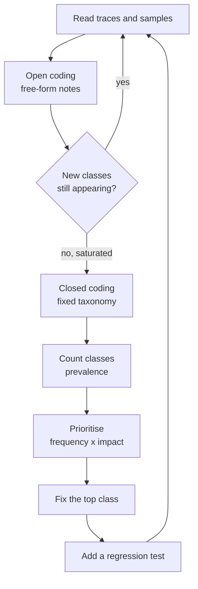

# Error Analysis and Failure Classification

> **Interview answer (say this first).** Error analysis is reading real traces and samples by hand, grouping each failure into a named class, and counting the classes. You start with **open coding** — free-form labels on a small sample — then collapse them into a **closed taxonomy**: retrieval miss, tool error, wrong tool, bad reasoning, format failure, refusal, timeout. Then you rank classes by **frequency × impact** and fix the top ones first. Every fixed class becomes a **regression test**, so the same failure cannot return. The point is to stop arguing about "the AI is bad" and start shipping one fix per named fault.

## Why this exists

A dashboard says quality dropped from 82% to 79%. The team gathers to discuss. Someone blames the prompt. Someone blame the model provider. Someone says users are just harder to please this week. Two hours later, nothing changed, because "quality dropped" is not a diagnosis.

The average is an alarm, not an answer. Averages hide the important detail: three specific failure modes got worse, each with a different owner and a different fix. Retrieval stopped returning a re-indexed document. A tool started timing out at 30 seconds. A new prompt broke JSON output on 4% of calls. One number, three completely different problems.

**Error analysis** is the discipline of replacing the average with a list. You read actual failures — not summaries, the raw inputs and outputs — and you name each one. Naming is the hard part and the valuable part. Once a failure has a name, it has an owner, a likely fix, and a way to test.

There is a second reason this matters for AI systems specifically. In ordinary software, a crash has a stack trace that points at a line of code. In AI, a wrong answer has no stack trace. The reasoning is hidden inside model weights. Reading traces by hand is how you recover the missing stack trace. It is the closest thing AI engineering has to a debugger for behavior.

Error analysis also protects you from a common team pathology: the loudest failure wins. The most memorable bad answer — the one that got screenshotted in Slack — is not necessarily the most common. Labeling and counting replaces the argument "which bug is worst?" with the question "which class is largest and most severe?" That is a question you can answer with data, and it survives a change of opinion.

> **Note.** The single highest-leverage activity in AI quality is reading 20 to 50 real failures by hand on a schedule. More dashboards will not substitute for it.

## Start from zero

| Word | Plain meaning |
| --- | --- |
| **Sample** | A small, random set of real runs you read by hand. |
| **Error analysis** | Reading failures and grouping them into causes. |
| **Failure mode** | A repeatable way the system goes wrong. |
| **Label** | The name you assign to one failure. |
| **Open coding** | Assigning free-form labels without a fixed list. |
| **Closed coding** | Sorting failures into a fixed, agreed label set. |
| **Taxonomy** | The fixed label set; the categories you count. |
| **Class** | One category in the taxonomy, such as `retrieval_miss`. |
| **Prevalence** | How often a class occurs, as a share of failures. |
| **Impact** | How bad one occurrence is; severe, medium, or minor. |
| **Priority** | Frequency times impact; what to fix first. |
| **Inter-rater agreement** | How often two people assign the same label. |
| **Cohen's kappa** | Agreement corrected for what chance alone would give. |
| **Root cause** | The underlying defect, not the visible symptom. |
| **Symptom** | What the user sees; a wrong answer, a refusal, a timeout. |
| **Regression test** | A test built from a fixed failure so it cannot return. |
| **Saturation** | The point where new samples stop revealing new classes. |
| **Slice** | A subgroup you analyze separately, such as one tenant or intent. |
| **Trace** | The full record of one run: every model and tool step. |

Two distinctions do most of the work:

- **Symptom vs root cause.** "It gave a wrong answer" is a symptom. "The retriever missed the policy chunk" is a root cause. You classify root causes, not symptoms.
- **Open vs closed coding.** Open coding discovers the classes; closed coding counts them consistently. Skipping open coding gives you a taxonomy that does not match reality. Skipping closed coding gives you chaos.

A third habit separates good analysis from bad: **write down the decision each label triggers.** If a label never changes what someone does, it is decoration. "Timeout" should trigger a step-budget review; "retrieval miss" should trigger an index review; "format failure" should trigger a schema change. Label sets that map to actions get used; label sets that only feed a chart get abandoned.

## The core idea

Think about how doctors handle a busy emergency room. They do not treat patients in arrival order. They **triage**: assign each patient to a category by severity and need, then treat the highest-priority category first. The category names matter — "chest pain" triggers a different path than "sprained ankle" — and the process only works if everyone uses the same names.

Error analysis is triage for AI failures. And it has two phases, like a research method:

1. **Open coding** — read a sample and write down whatever you see, in your own words. "Model invented a number." "Looked up the wrong user." "Crashed on the JSON." You are discovering the space of failures.
2. **Closed coding** — turn those free-form notes into a fixed label set, then re-label everything with the fixed set so counts are comparable.

The loop between the two is the whole method:



Saturation happens when a batch of new samples produces no new class. That is your signal to freeze the taxonomy and start counting.

The seven classes that cover most agent failures. Learn these first.

| Class | What it means | Typical first fix |
| --- | --- | --- |
| **Retrieval miss** | The right evidence was never retrieved. | Fix chunking, index, or query rewriting. |
| **Tool error** | A tool failed: exception, bad args, empty result. | Fix the tool, its args, or add a retry. |
| **Wrong tool** | The model picked a tool that cannot do the job. | Improve tool descriptions and routing. |
| **Bad reasoning** | The evidence was present; the logic was wrong. | Fix the prompt, model, or decomposition. |
| **Format failure** | Output did not match the required schema. | Enforce structured output and validate. |
| **Refusal** | The system declined or invented an answer to an answerable question. | Tune the refusal policy and prompt. |
| **Timeout** | The run exceeded its time budget. | Reduce steps, cache, raise or lower timeouts. |

Everything else is a candidate for an **other** bucket. Watch that bucket; if it grows, run open coding again.

A class only earns a fix if it is **actionable**. "Model hallucinated" is not actionable on its own — it is a symptom spread across retrieval misses, bad reasoning, and format failures. A good class points at a stage you can change: a retriever, a tool, a prompt, a parser, or a timeout policy. When you cannot name the corresponding fix, split the class until you can.

Class granularity is a trade-off. Too coarse and one class hides five different bugs under one label, so a fix only moves part of the number. Too fine and nobody can apply the labels consistently, so the counts turn to noise. The test is simple: can two engineers label the same trace the same way, and does each label suggest a different fix? If yes, the granularity is right.

## How it works

1. **Define the unit of analysis.** Decide what one labeled row is: one request, or one failure. Usually you sample requests and label the failures within them.
2. **Draw a random sample.** Pull 30 to 50 recent runs, not the first 50 you remember. Randomness prevents you from studying only the loud cases.
3. **Read the traces, not the summaries.** Open the trace tree. Look at the retrieved documents, the tool calls, the prompt, and the final output. The bug is usually one level below where you expected.
4. **Open-code each failure.** Write a short free-form note and a proposed root cause. Do not force categories yet. If two people are available, both code the same sample independently.
5. **Cluster the notes.** Sort the free-form notes into groups that share a cause. Name each group.
6. **Freeze the taxonomy.** Pick the smallest set of classes that separates the failures you saw, plus an `other`. Document each class with one example.
7. **Closed-code the full sample.** Re-label every row with the fixed classes. Measure inter-rater agreement on a subset; aim for high agreement before you trust the counts.
8. **Count prevalence.** Compute each class's count and share. A class at 2% is background; a class at 30% is a project.
9. **Estimate impact.** Rate each class by how bad one occurrence is. A wrong refund amount is worse than an awkward sentence.
10. **Prioritize.** Rank by frequency times impact. Work top-down; do not fix a rare class because it is interesting.
11. **Find the root cause of the top class.** Drill into its traces together. The named class points at a stage; the stage points at the code.
12. **Fix, test, re-measure.** Ship the fix, add a regression test built from the failing example, and re-run the analysis to confirm the class shrank. Then repeat.

A useful rule: **never fix more than one or two classes at a time.** If you change the prompt, the retriever, and the tool layer in the same release, you cannot tell which fix worked.

Agentic systems make one extra step necessary. A single agent run can contain several failures in sequence: the retriever missed, so the model reasoned badly, so the tool call failed. When you label, record the **first** failure in the chain, because that is the root cause; the later ones are consequences. If you label all three, you double-count one bug as three classes and misprioritize. This is why the sample row has a `stage` field: it forces you to name where the chain first went wrong.

It also helps to label the **confidence** of your diagnosis. A clear retrieval miss is certain; "bad reasoning" is often a judgment call. Tracking how sure you were lets you weigh classes and decide which ones need more trace evidence before you write a fix.

## The syntax you will use

**One labeled failure as data.** Keep the sample row and its label together. A dataclass is enough to start.

```python
from dataclasses import dataclass

@dataclass
class Failure:
    trace_id: str
    stage: str          # "retrieval", "tool", "model", "format"
    symptom: str        # what the user saw
    label: str          # the closed-code class
```

**The taxonomy and its impact weights.** Encoding impact as a number makes priority a calculation instead of an argument.

```python
IMPACT = {                      # 3 = severe, 2 = medium, 1 = minor
    "retrieval_miss": 3, "tool_error": 3, "wrong_tool": 2,
    "bad_reasoning": 3, "format_failure": 1, "refusal": 2, "timeout": 2,
}
```

**Count and rank the classes.** This is the core report: how often, how bad, and what to do first.

```python
from collections import Counter

counts = Counter(f.label for f in failures)
n = len(failures)
rows = sorted(
    ({"class": c, "count": k, "share_%": round(100 * k / n, 1),
      "impact": IMPACT[c], "priority": k * IMPACT[c]}
     for c, k in counts.items()),
    key=lambda r: r["priority"], reverse=True,
)
```

**Directive language in the sample.** Tell the reader what to look at so traces are read the same way.

```text
Read the trace and answer in one sentence:
1. Did the retriever return a document containing the answer?
2. If yes, did the model use it correctly?
3. If no, what was missing: the document, the query, or the ranking?
Then write a short label naming the root cause.
```

**Inter-rater agreement with Cohen's kappa.** High agreement means the taxonomy is usable by more than one person.

```python
def cohen_kappa(x, y):
    labels = sorted(set(x) | set(y))
    n = len(x)
    po = sum(i == j for i, j in zip(x, y)) / n            # observed agreement
    pe = sum((x.count(l) / n) * (y.count(l) / n) for l in labels)  # chance agreement
    return (po - pe) / (1 - pe)
```

Kappa near 1.0 means near-perfect agreement; near 0 means no better than chance. Below roughly 0.6, the classes are too vague — rewrite the definitions before counting.

**Turning a class into a regression test.** Save the failing input and the expected behaviour; assert on re-run.

```python
def test_retrieval_miss_case():
    # from the sample labelled "retrieval_miss" on trace s6
    result = run_agent("How long do refunds take?")
    assert "5-7 business days" in result
```

## Examples: simple to real

**Example 1 — one labeled row.** The smallest unit of error analysis is a single failure with a name.

```text
trace s6  stage=retrieval  symptom="said it didn't know"  label=retrieval_miss
```

Before the label, this was "the AI is bad". After the label, it is a retriever bug with a likely fix.

**Example 2 — prevalence across a sample (runnable).** Twelve sampled failures, counted and ranked. The program below prints the table.

```python
samples = [
    ("s1", "retrieval_miss"), ("s2", "format_failure"), ("s3", "tool_error"),
    ("s4", "retrieval_miss"), ("s5", "bad_reasoning"), ("s6", "retrieval_miss"),
    ("s7", "refusal"), ("s8", "tool_error"), ("s9", "format_failure"),
    ("s10", "retrieval_miss"), ("s11", "timeout"), ("s12", "wrong_tool"),
]
```

Output, sorted by priority:

```text
class            count  share_%  impact  priority
retrieval_miss       4     33.3       3        12
tool_error           2     16.7       3         6
bad_reasoning        1      8.3       3         3
format_failure       2     16.7       1         2
refusal              1      8.3       2         2
timeout              1      8.3       2         2
wrong_tool           1      8.3       2         2
total                                    12
```

Retrieval miss is one third of failures and the highest impact, so it is the clear first project. Format failure is equally frequent as tool error but less severe, so it ranks lower. This is prioritization as arithmetic, not opinion.

**Example 3 — the same counts, ranked by frequency alone.** Ranking differently changes the plan, which is why you must choose the metric deliberately.

```text
by frequency only:
retrieval_miss 4, tool_error 2, format_failure 2, bad_reasoning 1, refusal 1, timeout 1, wrong_tool 1
```

Frequency alone treats a cosmetic format glitch as equal to a failed tool call. Multiplying by impact fixes that. State your weighting up front so no one feels the ranking was gerrymandered.

**Example 4 — inter-rater agreement (runnable).** Two annotators label the same ten failures. Do they agree enough to trust the taxonomy?

```text
observed agreement 0.80
kappa 0.75
```

Four fifths of labels match, and kappa corrects for chance. `0.75` is substantial agreement — good enough to count. If kappa were `0.2`, the team would be counting noise and should tighten the class definitions first.

**Example 5 — saturation in practice.** Track new classes per batch of samples. When the curve flattens, stop open coding and freeze.

```text
batch 1 (25 runs): 6 new classes
batch 2 (25 runs): 2 new classes
batch 3 (25 runs): 1 new class
batch 4 (25 runs): 0 new classes   <-- saturated: freeze taxonomy
```

Stopping at batch 1 would have missed real classes. Grinding through batch 12 after saturation is wasted effort. The curve tells you when to switch from discovery to counting.

**Example 6 — from class to fix to test.** The full loop on the top class.

```text
1. Class: retrieval_miss (33% of failures, impact 3)
2. Trace drill-down: the "refunds" chunk was dropped by the new PDF parser
3. Fix: repair the parser, re-index, add the missing section
4. Regression test: test_retrieval_miss_case asserts "5-7 business days"
5. Re-measure: retrieval_miss drops from 4/12 to 1/12 on the next sample
```

One class, one root cause, one fix, one permanent test, one re-measurement. That is a complete error-analysis cycle.

## In production

- **Sample randomly.** The memorable failures are biased toward dramatic ones. Random sampling finds the quiet, frequent bugs that actually move quality.
- **Read traces, not just outputs.** The final answer tells you *that* it failed; the trace tells you *where*. Always open the tree.
- **Freeze the taxonomy once it saturates.** A taxonomy that changes every week cannot show trends. Version it and date the change.
- **Measure agreement before trusting counts.** If two competent people label the same failure differently, the class definition is broken, not the people.
- **Weight by impact, not just frequency.** A rare wrong dollar amount outranks a common formatting wobble. Make the weights explicit.
- **Do not batch too many fixes.** One or two classes per release, or you lose attribution and learn nothing.
- **Keep an `other` bucket and watch it.** A growing `other` means the taxonomy no longer fits reality. Re-open coding.
- **Analyze slices separately.** Retrieval misses may be concentrated in one tenant, one document type, or one language. The aggregate hides it.
- **Turn every confirmed failure into a test.** The regression suite is the compounding asset; the analysis is the interest payment.
- **Re-run the analysis after each fix.** Confirm the class actually shrank. A fix that was not re-measured is a hope, not a result.
- **Beware the observer changing the system.** If you tune prompts until your sample looks good, you have overfit to the sample. Re-sample fresh runs each cycle.
- **Budget the time.** Reading 30 traces can take half a day. Treat it as a recurring engineering commitment, not a rainy-day task.

## Interview questions

### 1. What is error analysis and why do it?

**Answer.** Error analysis is reading real failures by hand and grouping them into named classes so you can count and fix them. It exists because aggregate metrics tell you *that* quality dropped but not *why*. Naming a failure gives it a root cause, an owner, and a way to test the fix. It is the AI equivalent of a stack trace: the missing pointer to the broken stage.

**Follow-up: "Why not just look at the metrics?"** Metrics are an alarm. They tell you a class of failures exists without telling you which one. Two teams can stare at the same 79% and make opposite, wrong decisions. Reading traces converts a number into a list of concrete projects.

**Trap.** Doing error analysis only during incidents. Regular sampling catches slow decay before it becomes a page, and it builds the habit while stakes are low.

### 2. Explain open coding versus closed coding.

**Answer.** **Open coding** is discovery: you read a sample and write free-form labels in your own words, letting the failure space reveal itself. **Closed coding** is counting: you collapse those notes into a fixed taxonomy and re-label everything with it so the numbers are comparable. You open-code until new samples stop producing new classes (saturation), then freeze and closed-code.

**Follow-up: "What goes wrong if you skip open coding?"** You impose a taxonomy from theory, and real failure modes fall into `other` where they are invisible. The taxonomy must come from your traces, not from a blog post.

**Trap.** Confusing the phases. If labels keep changing during counting, you are still open-coding and the counts are meaningless.

### 3. How do you build a failure taxonomy?

**Answer.** Start from open-coded notes, cluster notes that share a root cause, and name each cluster. Keep the smallest set that separates the failures you actually saw, plus an `other`. The common seven are retrieval miss, tool error, wrong tool, bad reasoning, format failure, refusal, and timeout. Document each class with a one-line definition and a real example. Version the taxonomy like code.

**Follow-up: "How many classes are too many?"** If two people cannot apply the labels quickly and consistently, you have too many. Merge classes that always get confused. Shallow and reliable beats deep and ambiguous.

**Trap.** Classifying symptoms, not causes. "Wrong answer" is a symptom shared by five root causes. Classify the cause so each class maps to one kind of fix.

### 4. How do you prioritize which failure class to fix first?

**Answer.** Rank by frequency times impact. Frequency you get from the closed-coded counts; impact you rate per class from severity, such as whether money, safety, or trust is involved. Fix the highest-priority class first, one or two at a time, then re-measure. This stops teams from fixing the most interesting bug instead of the most harmful one.

**Follow-up: "What if the impact weights are disputed?"** Make them explicit and debate them once, in the open. Any reasonable weighting beats no weighting, and stating it prevents the ranking from becoming a political tool.

**Trap.** Optimizing the average. A change can lift the overall metric while worsening a high-impact class, which is a net loss.

### 5. What is inter-rater agreement and why does it matter?

**Answer.** It is how often two people assign the same label to the same failure. You measure it because a label set only one person understands is not a taxonomy, it is a private opinion. **Cohen's kappa** corrects raw agreement for the agreement expected by chance alone. Low kappa means the class definitions are too vague, so you rewrite them before trusting the counts.

**Follow-up: "What is a good kappa?"** Above roughly `0.8` is strong, `0.6` to `0.8` is substantial, below `0.6` is a warning, and near `0` is no better than random. The exact value matters less than the trend and the discussion it triggers.

**Trap.** Measuring agreement and then ignoring a low score. Low kappa is a finding: your classes need work, not your annotators.

### 6. How do you get from a failure class to a fix?

**Answer.** The class narrows the stage: retrieval miss points at the retriever, format failure at structured output, timeout at the step budget. Drill into several traces of that same class to find the shared root cause. Fix it at that layer, then add a regression test built from a representative failing input so the class cannot silently return. Re-run the analysis to confirm the class shrank.

**Follow-up: "What if a class has several root causes?"** Split it. One class should map to one kind of fix. "Bad reasoning from missing context" and "bad reasoning from a bad plan" are different projects; separate them so each gets its own owner.

**Trap.** Applying a prompt patch to a retrieval problem. Prompt edits are slow to validate and fix the wrong layer, so the class persists while confidence drops.

### 7. How do you connect error analysis to regression testing and CI?

**Answer.** Every confirmed failure becomes a test case: the real input plus the expected behaviour. That case joins a regression suite that runs in CI on changes to prompts, models, tools, or retrieval. Over time the suite encodes all the mistakes you have already paid for, so each one can only happen once. The error analysis tells you which classes to encode and how to score the fix.

**Follow-up: "Should the test assert an exact output?"** Rarely for open-ended answers. Assert the stable, meaningful property: the required fact is present, the JSON schema is valid, the correct source is cited. Exact match is for deterministic tasks.

**Trap.** Writing tests from imagined failures instead of real ones. Imagined tests pass and prove nothing; real tests catch the bugs that actually reach users.

### 8. How often should you run error analysis, and on how much data?

**Answer.** Run it on a schedule — weekly or per release — on a random sample of 30 to 50 runs, and ad hoc whenever a metric moves or an incident happens. Continue until the samples stop revealing new classes. More data beats more cleverness, but a well-chosen random sample of a few dozen runs beats a hundred cherry-picked ones.

**Follow-up: "How do you keep it from going stale?"** Re-sample fresh runs every cycle, re-open coding when the `other` bucket grows or a metric moves, and version the taxonomy so you can see when definitions changed. The world changes; a frozen sample will lie to you.

**Trap.** Turning it into a one-off audit. Error analysis is a habit, like code review. Its value compounds only if it repeats.

## Remember this

- **Count classes, not averages.** A named failure with a count is a project; "quality dropped" is an argument.
- **Open coding discovers, closed coding counts.** Saturate first, freeze the taxonomy, then measure agreement.
- **Prioritize by frequency × impact.** Fix the top one or two classes per release so attribution survives.
- **Every class maps to a stage and a fix.** Retrieval, tool, model, or format — one class, one owner.
- **Turn each fixed class into a regression test** and re-measure to confirm it shrank.
