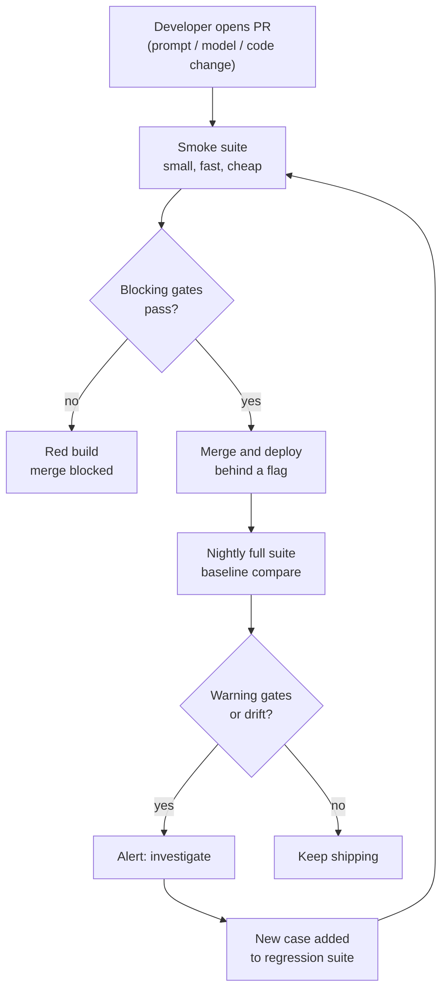

# Regression Testing and AI CI/CD

> **Interview answer (say this first).** A regression suite is a growing set of cases, each built from a real incident or error-analysis class, that runs automatically on every change to prompts, models, tools, or retrieval. Offline evaluation becomes a **CI gate**: if a metric drops below a threshold, or below the stored baseline by more than noise, the build fails and the change cannot merge. Gate the high-signal metrics and warn on the noisy ones. Pin prompt and model versions so a comparison is fair, keep the fast suite cheap enough to run on every pull request, and run the full suite nightly. The rule is simple: **gate what must not regress, monitor what you are still learning to measure.**

## Why this exists

You have an eval set. You run it manually before a release. It is already useful. So why build CI around it?

Because manual evaluation gets skipped. Not maliciously — just under deadline. The release is today, the eval takes forty minutes, the change "is only a prompt tweak". The gate you skipped is exactly the gate that would have caught the regression.

Here is the failure story that plays out in every AI team:

- Week 1: a prompt change fixes a formatting complaint and quietly breaks three factual answers. Nobody notices because the metric was checked by hand and the hand was busy.
- Week 3: a provider ships a silent model update. Answers get 4% worse. Nobody notices because no automated run compares yesterday to today.
- Week 5: a re-index drops a document section. Retrieval recall falls. Nobody notices until a customer escalates.
- Week 7: an engineer writes a test to catch the escalation. It passes today and would have failed at every step above — if it had existed earlier.

The fix is not more discipline. Discipline fails under pressure. The fix is automation that makes the unsafe path the hard path: a red build that blocks the merge.

There is a second job CI does beyond catching regressions: it makes changes **measurable**. Without a repeatable harness, every prompt edit is an opinion. With one, every prompt edit produces a number on the same ruler. That is what turns prompt engineering from art into engineering.

> **Note.** The suite is not a one-time project. It is a growing asset. Every incident adds a case, so the system can only make each mistake once. Treat the suite like production code: versioned, reviewed, owned.

## Start from zero

| Word | Plain meaning |
| --- | --- |
| **Regression** | A change that breaks something that used to work. |
| **Regression suite** | The set of tests that catches regressions automatically. |
| **Golden case** | A saved input plus the trusted expected behaviour. |
| **Golden trace** | A saved trace from a known-good run, used as a baseline for comparison. |
| **Expected behaviour** | The property a correct output must have: a fact present, valid JSON, a citation. |
| **CI (continuous integration)** | Automatically building and testing every change. |
| **CI/CD** | Continuous integration plus continuous delivery: test, then ship. |
| **Eval gate** | A threshold check in CI that can fail the build. |
| **Blocking gate** | A failing check that prevents merge or deploy. |
| **Warning gate** | A failing check that reports but does not block. |
| **Threshold** | The minimum acceptable value for a metric. |
| **Baseline** | The stored metric from a known-good run, used for comparison. |
| **Margin** | How far below the baseline counts as a real regression, not noise. |
| **Flaky test** | A test whose result changes without any code change. |
| **Pass rate** | The share of repeated runs that pass; a flakiness measure. |
| **Confidence interval** | A range that likely contains the true value. |
| **Bootstrap** | Resampling results to estimate how much they would bounce around. |
| **Version pinning** | Fixing a prompt hash or model id so runs are comparable. |
| **Smoke suite** | A tiny fast subset run on every commit. |
| **Full suite** | The complete evaluation, run nightly or before release. |
| **Cost per run** | Tokens and dollars spent by one execution of the suite. |

Three distinctions do most of the work:

- **Blocking vs warning.** Block on metrics you trust and cannot afford to lose. Warn on metrics still under development. A gate that cries wolf gets disabled.
- **Fast vs full.** The smoke suite runs on every pull request; the full suite runs nightly. Making every commit wait an hour is how gates get bypassed.
- **Exact vs behavioural assertions.** Exact strings break on harmless wording changes. Assert the stable property that matters.

## The core idea

Think about how a bridge is tested. You do not drive one truck across it and declare it safe. You compute a safe load, and every new design change is checked against that number before the bridge opens. The load rating is the gate; the engineering analysis is the evaluation.

AI CI works the same way. The **eval set** is the road, the **metric** is the load rating, and the **gate** is the rule that says "this change does not open until it meets the rating". A regression test is a specific heavy truck you know broke an earlier design, now driven across every candidate bridge.

The pipeline has one shape, with a fast lane and a slow lane:



The arrow from an alert back into the suite is what makes the system compound. Every surprise becomes a case. This is exactly how error analysis feeds CI.

Here is what to gate versus what to watch. The table is the topic on one screen.

| Signal | Gate or warn? | Why |
| --- | --- | --- |
| **Deterministic checks** (schema, citations) | Gate, blocking | Exact, fast, no noise. |
| **Task success on golden set** | Gate, blocking | Directly measures the job. |
| **Critical-slice metrics** | Gate, blocking | Protects the users who matter most. |
| **Overall quality mean** | Gate with margin | Real but noisy; use a baseline. |
| **Latency p95 and cost** | Gate with budget | Regressions users feel. |
| **Safety and refusal behaviour** | Gate, blocking | Asymmetric cost; never ship a breach. |
| **Open-ended helpfulness judge** | Warn | Subjective and biased; needs human calibration. |
| **New/small slices** | Warn | Too few examples to gate reliably. |

## How it works

1. **Build cases from real failures.** Each incident and each error-analysis class yields one or more cases: the real input, and the expected behaviour. Store them beside the code and version them.
2. **Define expected behaviour, not exact text.** Assert the fact is present, the JSON parses, the right source is cited, or the refusal is appropriate. Stable properties survive harmless rewording.
3. **Split the suite into tiers.** A small smoke suite of the most critical cases runs on every pull request. The full suite runs nightly and before release.
4. **Pin the moving parts.** Record the prompt hash, model id and version, dataset version, evaluator version, and random seed. A comparison across different versions measures the versions, not the change.
5. **Store a baseline.** Save the metric values from a known-good run. Every later run is compared to this baseline, so "regression" has a concrete meaning.
6. **Choose thresholds and margins deliberately.** Use absolute minimums for must-pass properties and a statistical margin (below the baseline's lower bound) for noisy metrics.
7. **Make the gate a normal test.** Express it as a pytest assertion so the existing CI understands pass and fail without a custom dashboard.
8. **Fail loudly and clearly.** Print which metric, which value, which threshold, and which examples changed. A gate that fails cryptically gets ignored.
9. **Handle flakiness honestly.** Run flaky metrics more than once, measure the pass rate, and only gate on metrics stable enough to trust. Fix or quarantine the rest.
10. **Control cost.** Estimate the token and dollar cost per run. Cache deterministic stages, use a cheaper judge for the smoke suite, and cap the number of examples per run.
11. **Deploy behind a flag.** A green gate permits deploy, not a full rollout. Use canary and shadow evaluation for the last mile.
12. **Add every miss back into the suite.** Any regression that reached production becomes a permanent case in the same week. That is the loop closing.

A useful rule for the gate: **compare to the baseline, not to a bare number.** A fixed threshold drifts out of date as the dataset and judge change. A baseline comparison with a margin stays honest.

## The syntax you will use

**A regression case as data.** One incident becomes one case with an input and the expected behaviour.

```python
from dataclasses import dataclass

@dataclass
class Case:
    name: str
    input: str
    must_contain: list[str]        # facts that must appear
    must_be_valid_json: bool = False
    source: str = ""               # incident or error-analysis reference
```

**A behavioural assertion.** Check the stable property, not the exact string. This is what makes the test durable.

```python
def check(case, output):
    if case.must_be_valid_json:
        import json; json.loads(output)                 # raises if invalid
    return all(fact.lower() in output.lower() for fact in case.must_contain)
```

**The gate itself.** A plain function over a summary, so pytest and the pipeline both understand it.

```python
THRESHOLDS = {"task_success": 0.90, "schema_valid": 0.99, "citation_present": 0.95}

def threshold_gate(summary):
    for metric, threshold in THRESHOLDS.items():
        assert summary[metric] >= threshold, f"{metric}={summary[metric]:.3f} < {threshold}"
```

**A baseline-aware gate with a margin (runnable).** Fail only when the new mean drops below the lower bound of the baseline's bootstrap interval. The program below prints the result.

```python
import random
from statistics import mean

def bootstrap_lower(scores, n=2000, alpha=0.05, seed=0):
    rng = random.Random(seed)
    means = sorted(mean(rng.choices(scores, k=len(scores))) for _ in range(n))
    return means[int(alpha / 2 * n)]

def baseline_gate(new_scores, baseline_scores, margin=0.0):
    lo = bootstrap_lower(baseline_scores)
    new_mean = mean(new_scores)
    failed = new_mean < lo - margin
    return {"baseline_mean": round(mean(baseline_scores), 3),
            "baseline_lower": round(lo, 3),
            "new_mean": round(new_mean, 3),
            "gate": "FAIL" if failed else "PASS"}
```

Note that this baseline gate is conservative and low-power: it compares the new sample's point mean against the baseline's lower bound and ignores the new sample's own variance. A two-sample bootstrap of the difference — resample both arms, then check whether the interval for `mean(new) - mean(baseline)` excludes zero — is statistically stronger and less likely to miss a real regression.

**The pytest wrapper.** Mark the full suite slow; run the fast subset on every commit.

```python
import pytest

@pytest.mark.fast
def test_smoke_gate():
    rows = evaluate(SMOKE_CASES)
    threshold_gate(summarize(rows))

@pytest.mark.slow
def test_full_gate():
    rows = evaluate(FULL_CASES)
    threshold_gate(summarize(rows))
```

**Pinning versions in the run record.** A score with no version is not reproducible.

```python
run_record = {
    "prompt_hash": "9f2c1a...",     # hash of the prompt template
    "model": "provider/model-2026-01",
    "dataset": "regression-v14",
    "evaluators": "judge-v3",
    "seed": 0,
}
```

**Flakiness measurement (runnable).** Run the same suite several times and track the spread of the pass rate. The program below prints the per-run means.

```python
runs = [
    [1,0,1,1,1,0,1,1], [1,0,1,1,1,0,1,0], [1,0,1,1,1,1,1,1],
    [1,0,1,1,1,0,1,1], [1,1,1,1,1,0,1,1],
]
means = [round(mean(r), 3) for r in runs]
spread = max(means) - min(means)
flaky = spread > 0.15
```

## Examples: simple to real

**Example 1 — one incident becomes one test.** The smallest useful regression case.

```text
incident INC-4412: "refund window answer said 30 days"
test: run_agent("How long do refunds take?") must_contain ["5-7 business days"]
```

One line of expected behaviour. From now on, that bug cannot return unnoticed.

**Example 2 — a golden trace as a baseline.** Save a known-good trace; a candidate must not lose the steps that mattered.

```text
golden trace g-1002:
  plan -> retrieve("refund window") -> 8 docs, top score 0.81
  draft -> cites ["policy.md#refunds"]
  validate -> valid JSON
candidate run:
  retrieve returned 3 docs, top score 0.62   <-- recall regression
```

The golden trace turns "the answers feel worse" into "recall dropped and two fewer documents were retrieved".

**Example 3 — a gate that catches a real regression (runnable).** Baseline task success is `0.90`, with a bootstrap lower bound of `0.75`. A small drop passes; a large drop fails.

```text
small_drop:  baseline_mean 0.90   baseline_lower 0.75   new_mean 0.85   gate PASS
big_drop:    baseline_mean 0.90   baseline_lower 0.75   new_mean 0.55   gate FAIL
```

The small drop is within noise, so the build stays green and the team does not waste an afternoon. The large drop is a real regression, so the gate blocks the merge. That is the difference between a gate people trust and a gate people mute.

**Example 4 — flakiness makes a gate untrustworthy (runnable).** Five repeats of the same suite swing the pass rate by `0.25`.

```text
per_run_means: [0.75, 0.625, 0.875, 0.75, 0.875]
spread: 0.25   flaky: true
```

A metric that moves 25 points with no code change cannot gate anything. Fix the variance — smaller judge temperature, deterministic stages, more examples — before making it blocking.

**Example 5 — cost per pull request (runnable).** Two hundred examples, about 1,900 tokens each, three runs per PR. At illustrative prices the cost adds up fast.

```text
cost_per_run_usd: 2.10
cost_per_pr_3_runs_usd: 6.30
per_100_prs_usd: 630.00
```

The smoke suite might be twenty examples; the nightly full suite two hundred. Cache deterministic stages, use a cheaper judge for the smoke tier, and make cost a visible line item so the gate does not eat the compute budget.

**Example 6 — blocking versus warning tiers.** The same run produces both kinds of result.

```text
BLOCKING  task_success     0.88 < 0.90        -> red build, merge blocked
BLOCKING  schema_valid     0.97 < 0.99        -> red build, merge blocked
WARNING   helpfulness      0.71 (was 0.74)    -> comment on PR, do not block
WARNING   p95_latency_ms   2450 (budget 2200) -> comment, investigate
```

Blocking on the two trustworthy metrics stops the dangerous change. Warning on the noisy ones gives feedback without training the team to ignore red builds.

## In production

- **Gate behaviour, not wording.** Exact-string assertions break on harmless changes and teach people to delete tests. Assert the stable property.
- **Keep the smoke suite under a few minutes.** A slow gate gets bypassed. Move breadth into the nightly run.
- **Compare to a pinned baseline.** A bare absolute threshold drifts as the dataset and judge change. Baseline plus margin stays honest.
- **Pin prompt, model, dataset, and judge versions.** An unpinned comparison measures the moving parts, not your change.
- **Treat flakiness as a bug.** Measure the pass rate across repeats. If it swings widely, fix the evaluation before trusting the gate.
- **Fail with the details.** Name the metric, the value, the threshold, and the changed examples. A cryptic red build is a support ticket.
- **Gate safety asymmetrically.** Safety and refusal breaches block; small helpfulness dips warn. The costs of the two errors are not equal.
- **Use a budget for latency and cost.** A change that improves quality and doubles latency may still be a net regression.
- **Never tune on the held-out tier.** Keep a private, rarely used set for the final number so the gate stays predictive.
- **Deploy behind a flag, evaluate canary, then roll out.** A green gate permits deploy, not a full launch.
- **Add production misses back the same week.** The suite's value is compounded by every confirmed incident, so make it a habit.
- **Own the suite like code.** Review changes, version the cases, and record why each was added. Untraceable cases get deleted by accident.

## Interview questions

### 1. How do you build a regression suite for an AI system?

**Answer.** Start from real failures. Every incident and every error-analysis class becomes a case: the real input plus the expected behaviour. Version the cases like code and store them with the application. Run the fast tier on every pull request and the full tier nightly. Over time the suite encodes every mistake you have already paid for, so each can only happen once. The suite is a growing asset, not a one-off audit.

**Follow-up: "Where do the first cases come from if you have no incidents yet?"** From error analysis of current traffic, from the golden set, and from known edge cases such as unanswerable questions and tool failures. Do not wait for your first outage to build the suite.

**Trap.** Writing tests from imagined failure modes. They pass immediately and prove nothing. Real cases catch the bugs users actually hit.

### 2. What should a CI gate block on, and what should only warn?

**Answer.** Block on deterministic, high-signal checks: schema validity, required citations, task success on the golden set, safety and refusal behaviour, and critical slices. Warn on metrics that are real but noisy or still maturing: open-ended helpfulness judges, tiny slices, and early latency trends. The split exists because a gate that fires on noise gets disabled, and a gate that never fires is decoration.

**Follow-up: "How do you decide a metric is trustworthy enough to block?"** Run it repeatedly with no code change and measure the spread. If the pass rate is stable, it can block. If it swings, fix the variance or keep it as a warning.

**Trap.** Making everything blocking. Once the team learns to ignore red builds, every gate loses force, including the one that matters.

### 3. How do you set a threshold without constant false alarms?

**Answer.** Compare to a stored baseline from a known-good run, and include a statistical margin. Bootstrap the per-example scores and fail only when the new mean drops below the baseline's lower confidence bound. Use absolute minimums only for must-pass properties like safety. Threshold at least one critical slice as well as the overall average, and pin the judge and dataset versions so the comparison is fair.

**Follow-up: "Why not a single fixed number?"** Because the number drifts as the dataset, judge, and model change. A fixed threshold either never fires or fires constantly, and neither teaches you anything.

**Trap.** Reacting to a one-point dip on twenty examples. That is usually noise; the bootstrap interval tells you so before you burn a day chasing it.

### 4. How do you handle flaky evaluation runs?

**Answer.** Measure flakiness with repeated runs and a pass rate, then attack the causes: high judge temperature, an unstable judge prompt, too few examples, non-deterministic sampling, or live dependence on an external service. Make deterministic checks deterministic by pinning seeds and parsing strictly. Only gate on metrics stable enough to trust, and quarantine the rest until fixed. Treat flakiness as a real bug, not a fact of life.

**Follow-up: "Can a flaky metric ever be useful?"** Yes, as a warning. It can surface a suspicious change without blocking the merge. But it must not carry blocking authority, or the team will route around it.

**Trap.** Re-running a failed gate until it passes. That silently converts a gate into a coin flip and destroys its value.

### 5. Why pin prompt and model versions in CI?

**Answer.** A comparison is only meaningful if the thing you are measuring is the only thing that changed. If the provider silently updates the model, or the prompt template shifts under a shared variable, a metric move measures the environment, not your change. Record the prompt hash, model id and version, dataset version, evaluator version, and seed with every run. Then a difference has a cause you can reason about.

**Follow-up: "What do you do when the provider updates a model under you?"** Treat it like any dependency change: re-run the full suite, compare to the pinned baseline, and decide whether to accept, pin to the old version, or adapt. The nightly run is what notices.

**Trap.** Assuming model ids are stable. Versioned ids and recorded hashes are how you notice a silent change before your users do.

### 6. How do you control the cost and latency of eval runs in CI?

**Answer.** Tier the suite: a tiny smoke set on every pull request, the full set nightly. Cache deterministic stages such as retrieval or parsing. Use a cheaper judge for the smoke tier and a stronger one for release. Cap examples per run and sample where full coverage adds little. Make token and dollar cost a visible metric, because judge and model spend can quietly rival the inference bill.

**Follow-up: "What is the cheapest useful gate?"** Deterministic checks on a few dozen critical cases: schema validity, required facts, citations, and safety behaviour. They are fast, free, and catch a surprising share of real regressions.

**Trap.** Running the full expensive suite on every commit. It slows the team, inflates cost, and creates pressure to disable the gate.

### 7. When is it safe to ship, and when must you wait?

**Answer.** Ship when the blocking gates are green, the change is pinned and reproducible, and it can be deployed behind a flag for canary or shadow evaluation. Wait when a blocking gate is red, when a critical slice regressed, when a safety metric moved, or when the run was flaky enough that you cannot tell. A green gate permits deploy, not a full rollout — the last mile belongs to online evaluation.

**Follow-up: "What if the gate is red but you believe the change is good?"** That disagreement is the point. Investigate the failing examples, decide whether the eval is wrong or the change is wrong, and if you lower a threshold, do it explicitly in review with a reason. Never quietly bypass.

**Trap.** Treating a green offline gate as proof of production success. Offline decides whether to ship safely; online decides whether it actually helped.

### 8. How does error analysis feed the CI pipeline?

**Answer.** Error analysis produces named classes with counts. Each confirmed class becomes one or more regression cases, and the fixes are verified by re-running the suite. When a production incident escapes, the same week it becomes a permanent case. Over time the regression suite is the residue of every lesson learned, and the gate is what enforces it. The loop is: read failures, name them, fix them, encode them, and gate them.

**Follow-up: "What if the suite grows too large to run?"** Tier it and sample. Keep a curated critical core always gated, and rotate the long tail through nightly and weekly runs. Coverage grows without making every commit wait.

**Trap.** Keeping error analysis and CI in separate worlds. An insight that never becomes a test is a lesson you will pay for twice.

## Remember this

- **Every incident becomes a case.** The regression suite is the compounding asset; error analysis is the interest payment.
- **Assert behaviour, not wording.** Stable properties survive harmless changes; exact strings break and get deleted.
- **Gate with a baseline and a margin,** not a bare number, so the gate catches regressions instead of noise.
- **Block on trustworthy metrics, warn on noisy ones.** A gate people ignore is worse than no gate.
- **Pin versions, tier the suite, and watch the cost.** Fast smoke on every PR, full suite nightly, canary before rollout.
