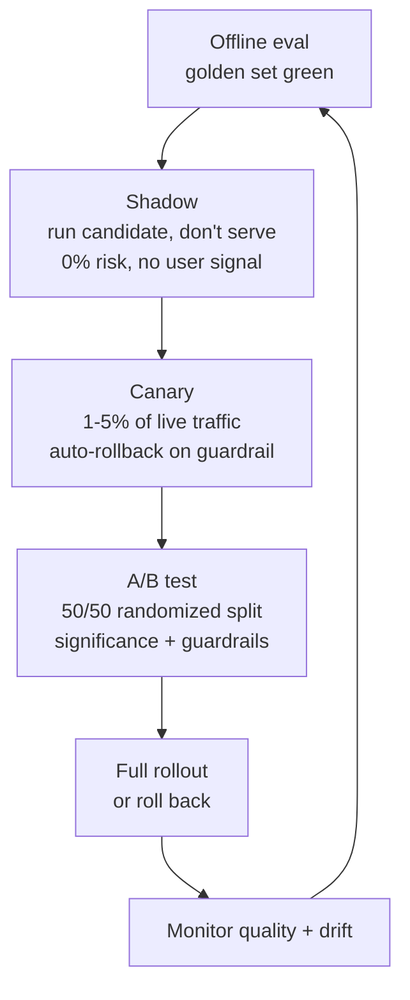

# Shadow, A/B, and Canary Evaluation

> **Interview answer (say this first).** Offline evaluation decides whether a change is safe to try; online evaluation decides whether it actually helps. **Shadow** runs the candidate on real requests but never shows its output, so it is safe but cannot measure user reaction. **A/B** splits live traffic at random and compares a treatment against a control using guardrail metrics and a significance test. **Canary** sends a small slice of live traffic to the new version and rolls back automatically if a guardrail breaks. The three are a ladder: shadow for safety, canary for risk, A/B for the final answer. Always decide the metric, the minimum detectable effect, and the rollback rule **before** you start.

## Why this exists

You finished the offline evaluation. The new prompt wins on the golden set by three points. Should you ship it to everyone?

Not yet. Offline evaluation has three blind spots that only real traffic can fill:

1. **The distribution gap.** Your eval set is a sample. Real users ask things your set never captured: typos, mixed languages, new products, adversarial inputs. A prompt that wins on the set can lose on the long tail.
2. **The user-response gap.** Offline metrics score the output. They cannot tell you whether users actually got their task done, returned the next day, or escalated to support. A more "correct" answer can still feel worse.
3. **The systems gap.** A prompt change also changes latency, token usage, retry rate, and cost. Offline quality can rise while unit economics silently break.

Shipping to 100% of users and hoping is how a three-point offline gain becomes a real incident. The alternative is to release gradually, with measurement and an automatic way back. That is what online evaluation provides.

There is also a subtle trap: **offline and online often disagree**, and the disagreement is informative. When offline says "better" and online says "no change", your eval set may be measuring the wrong thing. When online says "worse", you have found a failure mode no one thought to put in the set. Neither outcome is a failure; both are the system learning.

A useful way to think about it: offline evaluation is cheap and safe but answers a proxy question — "does the candidate do better on the cases we remembered to collect?" Online evaluation is expensive and risky but answers the real question — "do actual users get better outcomes?". The two will agree only when your offline set is a good sample of reality. The longer you run the system, the more the online loop teaches you, and the better the offline set becomes.

> **Note.** The safe release ladder is **shadow → canary → A/B → full rollout**. Each rung answers a different question and expands the blast radius only as far as the evidence supports.

A word on why this is harder for AI than for ordinary web changes. In a normal A/B test the metric is unambiguous: click-through, signup, purchase. For an AI feature the outcome is fuzzy — the answer was "good enough" or it was not — so teams lean on proxies such as rating, follow-up rate, retry rate, or escalation. Proxies are noisier and more gameable than a purchase, which means the test needs more traffic and clearer guardrails. And the candidate itself is stochastic: the same input can produce different outputs on different runs. That variance pushes the required sample size up again. Design for it up front rather than discovering it after a week of inconclusive results.

## Start from zero

| Word | Plain meaning |
| --- | --- |
| **Shadow deployment** | Run the candidate on real traffic but do not serve its output. |
| **A/B test** | Split users randomly between control and treatment; compare metrics. |
| **Canary** | Send a small share of live traffic to the new version. |
| **Control (A)** | The current production version, used as the comparison. |
| **Treatment (B)** | The candidate version being tested. |
| **Split** | The fraction of traffic sent to each arm. |
| **Assignment** | The rule deciding which arm a request sees. |
| **Sticky assignment** | The same user always gets the same arm, for a consistent experience. |
| **Guardrail metric** | A metric that must not get worse; breach triggers rollback. |
| **Primary metric** | The metric you hope to improve; the reason for the test. |
| **Secondary metric** | A supporting metric you watch but do not decide on alone. |
| **Statistical significance** | Evidence that an effect is unlikely to be chance. |
| **p-value** | The chance of seeing this result if there were truly no difference. |
| **Minimum detectable effect** | The smallest improvement the test can reliably detect. |
| **Power** | The chance of detecting a real effect of a given size. |
| **Sample size** | Traffic needed per arm to detect the effect you care about. |
| **Peeking** | Checking results repeatedly and stopping at a lucky moment. |
| **Rollback** | Automatically reverting to the control when a guardrail breaks. |
| **Blast radius** | How many users a bad change can affect. |
| **Instrumentation** | The logging that makes metrics computable per arm. |
| **Interference** | When one arm affects the other, breaking the test. |

Two distinctions do most of the work:

- **Quality vs guardrail.** The primary metric is what you want to improve. Guardrails are what must not break: safety, latency, cost, error rate. Guardrails can veto a quality win.
- **Shadow vs canary.** Shadow is invisible to users and cannot measure their reaction; it can only score outputs and compare resources. Canary is visible and measures real user behaviour, at real risk.

## The core idea

Think of a new recipe in a restaurant. You do not rewrite the whole menu on a hunch. First, the chef cooks the dish alongside the old one for the staff to taste — no customer is served it, and you compare technique and cost. That is **shadow**. Then you put it on a small number of tables and watch whether people send it back — that is **canary**. Only when it survives that do you put it on the full menu and measure sales against the old dish — that is an **A/B test**.

The ladder narrows uncertainty before it widens exposure:



Assignment is the plumbing. The same user should see the same arm (sticky), and the split must be random with respect to the outcome. A hash of a stable identifier is the standard tool:

```text
bucket = hash(user_id + experiment_name) % 100
if bucket < 50:   control
else:             treatment
```

Both arms run at the same time, so seasonality hits them equally. That is the fundamental advantage of A/B over "before versus after", which confuses your change with everything else that changed that day.

Because model outputs are stochastic, comparison is not always a single number. For a binary outcome you compare rates. For a continuous quality score you compare means with a t-test or a bootstrap interval. For a ranking or a preference you use a pairwise test such as a sign test on which version won each prompt. Pick the test that matches the metric before you launch, and write it into the decision rule. Choosing the test after seeing the data is a quiet form of p-hacking.

Guardrails deserve the same care. A guardrail is not "any metric we happen to log". It is a small set of things that must not degrade: safety, task success, latency, cost, and error rate. Each needs a threshold and an action. Latency might roll back automatically; a small helpfulness dip might only warn. Deciding which guardrails are hard stops and which are advisory is a policy decision, and it belongs in the design document, not in the on-call engineer's judgment at 2 a.m.

A concrete example of the metric roles for a support agent:

| Role | Metric | Trigger |
| --- | --- | --- |
| Primary | Task resolved in one turn | Improve to ship |
| Primary | Answer rated correct by judge | Improve to ship |
| Guardrail (hard) | Safety-policy violations | Any occurrence rolls back |
| Guardrail (hard) | p95 latency | Above 3.5s rolls back |
| Guardrail (hard) | Escalation rate | Significant rise rolls back |
| Guardrail (advisory) | Cost per resolved task | Warn above budget |
| Secondary | Follow-up question rate | Watch for context |

Here is how the three methods compare. The table is the topic on one screen.

| Method | Served to users? | Can measure user behaviour? | Risk | Best for |
| --- | --- | --- | --- | --- |
| **Shadow** | No | No | None | Safety, cost, output scoring on real inputs |
| **Canary** | Yes, small slice | Yes, on the slice | Low | Catching latency, errors, safety before wide release |
| **A/B** | Yes, split | Yes, with a control | Medium | Deciding whether the change actually helps |
| **Before/after** | Yes, all | Weakly | High | Quick sanity checks, not decisions |

One statistical trap deserves naming early: **peeking**. If you check the p-value after every day of traffic and stop the moment it dips below `0.05`, the true false-positive rate is far higher than 5%. Each peek is another chance to see a lucky fluctuation. Fix the sample size and the duration in advance and analyze once, or use a method explicitly designed for sequential monitoring, such as sequential testing or a Bayesian approach that accounts for looks. This is why the decision rule is written before launch — not to be bureaucratic, but to keep the statistics valid.

A good primary metric is **close to the user's goal, sensitive to the change, and hard to game**. "Question answered without a follow-up" is closer to the goal than "response contains the word refund". "Thumbs up" is sensitive but easy to game with a friendly tone. "Task completed in one turn" is close and hard to game, but may be rare. Often the right primary metric is a composite of behaviour signals, computed from a fixed formula so it cannot be redefined after the fact. Write the formula down with the hypothesis.

## How it works

1. **Write the hypothesis and the decision rule first.** State the primary metric, the guardrails, the minimum detectable effect, the split, and the rollback condition. Deciding after seeing results is how you fool yourself.
2. **Instrument both arms identically.** Log the arm assignment with every request, plus the outcome, latency, token cost, and any user feedback. If the two arms are measured differently, the comparison is broken.
3. **Assign clients randomly and stickily.** Hash a stable id (user or session) so a user stays in one arm. Randomization makes the arms comparable; stickiness avoids a confusing mixed experience.
4. **Shadow first.** Replay or mirror real requests to the candidate, score its outputs, and record its resources. Fix crashes and cost explosions here, where no user is affected.
5. **Promote to canary.** Send a small share — often 1% to 5% — to the candidate. Watch guardrails continuously: error rate, latency p95 and p99, token cost, safety signals.
6. **Automate rollback.** Define a rule such as "roll back if the canary error rate is significantly above control". You cannot rely on a human watching a dashboard at 3 a.m.
7. **Expand to A/B when canary is clean.** Split 50/50, run long enough to reach the pre-computed sample size, and compare the primary metric and every guardrail.
8. **Test for significance, and respect the design.** Compute the p-value or confidence interval for the primary metric. Do not peek repeatedly and stop at the first significant moment; that inflates false positives.
9. **Read guardrails as vetoes.** A significant quality win that also harms safety, latency, or cost is not a win. Ship only if the primary improves and no guardrail breaks.
10. **Decide and document.** Roll out, roll back, or iterate. Record the result, the version, and the reasoning so the next test learns from this one.
11. **Watch for interference and novelty.** Network effects, shared caches, and "new thing" excitement can distort results. Hold a test long enough to see the novelty fade.
12. **Close the loop.** Promote the surprising online failures into the offline set, and fix the eval gap that let them through.

A useful rule: **the decision rule is part of the experiment.** If you cannot say in advance what result would make you ship, you are not running an experiment; you are gathering justification.

Two design choices deserve care because they are easy to get wrong. The **split** should match the risk: shadow is 0% served, canary is often 1% to 5%, and A/B is usually 50/50 because that maximizes statistical power for a given total traffic. The **unit of randomization** should match the unit of experience: randomize by user when the experience should be consistent for that person, and by session when each session is genuinely independent. Randomizing by request when users have long sessions creates a mixed experience and can confuse both the user and the analysis.

Also decide whether the effect you care about is **absolute or relative**. A rise from 6.0% to 6.6% is +0.6 absolute points, which is +10% relative. Teams often quote the flattering one. Fix the definition in the design so the result is not reframed after the fact.

## The syntax you will use

**A stable bucket assignment.** One deterministic hash, so a user stays in the same arm across requests.

```python
import hashlib

def arm(user_id: str, experiment: str = "prompt-v7") -> str:
    key = f"{user_id}:{experiment}".encode()
    bucket = int(hashlib.sha256(key).hexdigest()[:8], 16) % 100
    return "control" if bucket < 50 else "treatment"
```

**Logging the arm with every outcome.** Without this you cannot compute any per-arm metric.

```python
log = {
    "request_id": rid, "user_id": uid, "arm": arm(uid),
    "prompt_version": "v7" if arm(uid) == "treatment" else "v6",
    "success": success, "latency_ms": latency,
    "input_tokens": itok, "output_tokens": otok,
}
```

**A two-proportion z-test (runnable, stdlib only).** The standard test for a binary outcome such as task success or conversion.

```python
import math

def two_proportion_z(x1, n1, x2, n2):
    p1, p2 = x1 / n1, x2 / n2
    p = (x1 + x2) / (n1 + n2)
    se = math.sqrt(p * (1 - p) * (1 / n1 + 1 / n2))
    z = (p2 - p1) / se
    p_value = math.erfc(abs(z) / math.sqrt(2))   # two-sided; stable for large |z|
    return {"p_control": round(p1, 4), "p_treatment": round(p2, 4),
            "abs_lift": round(p2 - p1, 4), "z": round(z, 3), "p_value": round(p_value, 5)}
```

A p-value below `0.05` means the difference would be unlikely if there were truly no effect. It is evidence, not proof, and it says nothing about whether the effect is worth the cost.

**Sizing the test before you run it (runnable).** Compute the samples per arm for a target effect, power, and significance.

```python
def sample_size(p1, p2, alpha=0.05, power=0.8):
    z_a = 1.959964   # two-sided alpha = 0.05
    z_b = 0.841621   # power = 0.8
    p_bar = (p1 + p2) / 2
    numerator = (z_a * math.sqrt(2 * p_bar * (1 - p_bar))
                 + z_b * math.sqrt(p1 * (1 - p1) + p2 * (1 - p2))) ** 2
    return math.ceil(numerator / (p2 - p1) ** 2)
```

**A guardrail rollback rule.** Roll back when the canary is significantly worse on a metric that must not degrade.

```python
res = two_proportion_z(control_errors, control_n, canary_errors, canary_n)
breach = res["p_value"] < 0.05 and res["p_treatment"] > res["p_control"]
if breach:
    rollback(experiment="prompt-v7", reason="error_rate")
```

**Shadow replay.** Mirror the request to the candidate, store its output for scoring, and never return it to the user.

```python
async def handle(request):
    primary = await current_version(request)          # the user sees this
    asyncio.create_task(shadow(primary_id, request))  # fire and forget
    return primary

async def shadow(rid, request):
    candidate = await candidate_version(request)      # never served
    store_shadow_result(rid, candidate, prompt_version="v7")
```

## Examples: simple to real

**Example 1 — shadow scoring with zero user risk.** Every real request is scored by the candidate, but users see only the old output.

```text
requests shadowed: 10,000
candidate schema-valid: 99.2%   current: 99.5%
candidate p95 latency: 2.9s     current: 2.1s
candidate cost/req: $0.011      current: $0.007
```

The candidate is slightly worse on schema, slower, and 57% more expensive. Shadow caught all of it with no user exposure. This is the cheapest possible place to find these problems.

**Example 2 — is an A/B result real? (runnable).** Twenty thousand users per arm. Control success is 6.0%, treatment is 6.6%.

```text
p_control 0.06   p_treatment 0.066   abs_lift 0.006
z 2.47   p_value 0.01353
```

The lift is six tenths of a point, and the p-value is below `0.05`, so it is statistically significant. Note the size: a 0.6-point absolute gain on a 6% base is a 10% relative improvement, which may or may not justify the cost. Significance answers "is it real", not "is it worth it".

**Example 3 — sizing the test before you start (runnable).** The effect you care about determines the traffic you need.

```text
n per arm (5.0% -> 6.0%): 8,158
n per arm (5.0% -> 5.5%): 31,234
```

A one-point effect needs about `8,000` users per arm; a half-point effect needs about `31,000`. If your traffic is a few hundred users a day, the half-point test would take months and should not be attempted. Sizing in advance prevents a test that can only ever be inconclusive.

**Example 4 — canary guardrail rollback (runnable).** Control error rate is `0.66%` (14 of 2,134); the canary is `1.68%` (58 of 3,450). The difference is significant, so the rollout stops.

```text
p_control 0.0066   p_treatment 0.0168   abs_lift 0.0103
z 3.299   p_value 0.00097   rollback true
```

The automation rolls back before the error rate reaches more than a few hundred users. A human watching a dashboard would likely have missed the window; the rule did not.

**Example 5 — offline and online disagree.** The offline set said the candidate was better; the live test says it is not.

```text
offline:  golden-set task success  v6=0.82  v7=0.89   (+7 pts)
online:   production task success  v6=0.86  v7=0.86   (0 pts)
online:   escalation rate           v6=0.04  v7=0.061  (worse)
```

The candidate overfits the golden set. The gap is a finding: the eval set is missing the real-world inputs where v7 fails. The next action is not "ship anyway" but "add those failures to the set and re-evaluate".

**Example 6 — before/after versus A/B.** The same change looks different depending on the design.

```text
before/after:  last week success 0.80 -> this week 0.86   (+6 pts, confounded)
A/B:           control 0.84           treatment 0.845      (+0.5 pts, p=0.4)
```

The before/after number absorbed a holiday traffic change that had nothing to do with the prompt. The A/B split both arms in the same week, so seasonality cancelled out. This is why concurrent randomization beats historical comparison.

## In production

- **Decide the metric and the stopping rule first.** Writing them down before the data arrives is what keeps the analysis honest.
- **Guardrails can veto quality.** A significant quality gain that harms safety, latency, or cost is not a win. Put guardrails in the decision rule, not in a footnote.
- **Automate rollback.** A rollback rule that depends on a human noticing is not a rule. Encode it and test it in staging.
- **Do not peek and stop.** Repeated significance checks inflate false positives. Fix the sample size and the duration, or use a method designed for sequential monitoring.
- **Instrument both arms identically.** A logging difference between arms produces a fake effect. Log the arm with every metric, using the same code path.
- **Keep assignment sticky and random.** Hash a stable id so a user stays in one arm, and make sure the hash is uncorrelated with the outcome.
- **Watch for interference.** Shared caches, cross-user effects, and network effects violate the independence assumption. Isolate the arms where it matters.
- **Wait out novelty.** Early excitement (or confusion) fades. Hold the test long enough for behaviour to stabilize.
- **Shadow cannot measure satisfaction.** It scores outputs and resources only. Do not claim a shadow result proves users are happier.
- **Expect small effects to need large samples.** Compute the sample size before launching, or you will run an inconclusive test and argue about it.
- **Have an ethical and safety gate for live experiments.** Some users must be excluded, some changes must not be tested on people at all, and consent or policy may apply. Shadow and offline evaluation are the safe fallbacks.
- **Feed surprises back offline.** Every online disagreement is a gap in the eval set. Closing it makes the next offline decision better.

## Interview questions

### 1. What is the difference between shadow, canary, and A/B evaluation?

**Answer.** **Shadow** runs the candidate on real traffic without serving its output: zero user risk, but no user-behaviour signal. **Canary** serves a small slice of traffic to the candidate with automatic rollback on a guardrail breach: low risk, real signal on that slice. **A/B** splits traffic randomly between control and treatment and compares metrics with a significance test: the method that actually decides whether the change helps. They form a ladder, used in order, each expanding exposure only as evidence supports.

**Follow-up: "Why not go straight to A/B?"** Because shadow and canary catch the obvious breakages — crashes, cost explosions, latency, safety — before real users are exposed at scale. Skipping the safe rungs turns a cheap check into an incident.

**Trap.** Using shadow and calling it a user experiment. Shadow cannot measure whether users are happier, because users never saw the candidate.

### 2. How do you design an A/B test for an AI feature?

**Answer.** State the hypothesis and decision rule first: the primary metric, the guardrails, the minimum detectable effect, the split, and the duration. Randomize clients with a stable hash so assignment is sticky, and instrument both arms identically. Compute the required sample size before launch. Run both arms concurrently so seasonality cancels. Test the primary for significance, check every guardrail as a veto, and decide by the rule you wrote down.

**Follow-up: "What is a guardrail metric here?"** Any metric that must not degrade: safety incidents, refusal-to-answer rate on answerable questions, p95 latency, error rate, token cost, and escalation rate. A quality metric that rises while a guardrail breaks is not a shippable win.

**Trap.** Choosing the metric after seeing the data. With enough metrics, something always looks significant; the pre-commitment is what prevents fishing.

### 3. How do you know an A/B result is statistically significant?

**Answer.** For a binary outcome, use a two-proportion test. Compute the difference in rates, its standard error, and a z-score, then convert to a p-value. A p-value below your threshold, commonly `0.05`, means the result would be unlikely if there were truly no effect. Also report the confidence interval and the effect size, because significance alone does not tell you whether the change is worth shipping.

**Follow-up: "What does a p-value of 0.01 actually mean?"** If there were no real difference, there is about a 1% chance of seeing a difference this large or larger by chance. It is evidence against the null, not proof the treatment is better, and not a measure of how large the effect is.

**Trap.** Treating a small p-value as proof of a big effect. With enough traffic, a trivial difference becomes significant.

### 4. How much traffic and time does an experiment need?

**Answer.** Compute the sample size from the baseline rate, the minimum detectable effect you care about, the significance level, and the desired power, usually 80%. A one-point lift on a 5% base needs roughly `8,000` users per arm; a half-point lift needs roughly `31,000`. If that exceeds your traffic, either accept a larger detectable effect, run longer, or use a more sensitive design. Sizing before launch prevents an inconclusive test.

**Follow-up: "What if you cannot get enough traffic?"** Use a proxy metric that fires more often, a paired design with the same users before and after, or switch to offline and shadow evaluation and accept weaker evidence. Do not run an underpowered test and argue about noise.

**Trap.** Stopping as soon as the result looks significant. That is peeking, and it inflates the false-positive rate well above the nominal level.

### 5. How do you roll out and roll back safely?

**Answer.** Release behind a flag with a small canary share and automated guardrails: error rate, latency, cost, and safety. Define the rollback condition as a statistical rule before launch, wire it to the flag, and test the rollback in staging so it works when needed. If the canary is clean, expand to A/B for the quality decision, then roll out fully with monitoring. The flag and the rollback rule are what make a mistake recoverable.

**Follow-up: "What is the hardest part?"** Defining guardrails that are both sensitive and not noisy. A rollback rule that fires on normal variance destroys trust; one that is too lax misses real harm. Calibrate it against historical traffic.

**Trap.** Manual rollback. At 3 a.m. nobody is watching, and by morning the blast radius has grown. Automate the rule and page only when it fires.

### 6. Why do offline and online evaluation disagree?

**Answer.** Offline uses a fixed set with fixed labels; online sees the real distribution and real user behaviour. Disagreement usually means the offline set is not representative, the offline metric is a poor proxy for the user outcome, or the online test is confounded or underpowered. The disagreement is a gift: it points at exactly the gap to close. Add the failing online inputs to the offline set, fix the proxy metric, and re-evaluate.

**Follow-up: "Offline says better, online says no change. What now?"** Suspect an overfit eval set and a weak proxy. Do not ship on offline alone. Look at the slices where online disagrees and inspect those traces.

**Trap.** Treating online as "noisy, so ignore it". Online is the ground truth the offline set is trying to predict.

### 7. What is assignment, and why does randomization matter?

**Answer.** Assignment is the rule that decides which arm a request sees. Randomization makes the arms statistically comparable on everything except the treatment, so a measured difference is attributable to the change. Stickiness — hashing a stable user or session id — keeps each user in one arm for a consistent experience. Both arms run at the same time, so seasonality and external events affect them equally.

**Follow-up: "What breaks randomization?"** Logging differences between arms, non-random assignment such as first-come-first-served, interference between arms through shared caches, and users appearing in both arms. Each one produces a fake or hidden effect.

**Trap.** Non-sticky assignment. A user who sees control on one request and treatment on the next has a confusing experience and contaminates the comparison.

### 8. What ethical and safety guardrails apply to live experiments?

**Answer.** Live experiments touch real people, so some changes should never be tested on users directly: safety-critical behaviour, regulated content, and anything that could cause harm or discrimination. Exclude vulnerable users, respect consent and policy, and cap exposure. Define safety guardrails that trigger immediate rollback. When a live test is inappropriate, use shadow or offline evaluation instead, and document why.

**Follow-up: "How do you test a change you cannot A/B test?"** Shadow it on real traffic without serving, evaluate offline on representative data, and if it must go live, canary it with tight guardrails, a small share, and a human on call. Never silently test a risky change on everyone.

**Trap.** Treating ethics as a box to tick after the experiment is designed. Inclusion, exclusion, and consent decisions belong in the design stage, before any user sees the candidate.

## Remember this

- **Shadow → canary → A/B → full rollout.** Each rung expands exposure only as far as the evidence supports.
- **Guardrails are vetoes.** A quality win that harms safety, latency, or cost does not ship.
- **Decide the metric and rollback rule before launch.** Post-hoc metric choice is how you fool yourself.
- **Size the test first, and do not peek.** Sample size and a fixed duration prevent false positives and inconclusive runs.
- **Disagreement between offline and online is a finding.** Feed the online surprises back into the offline set.
