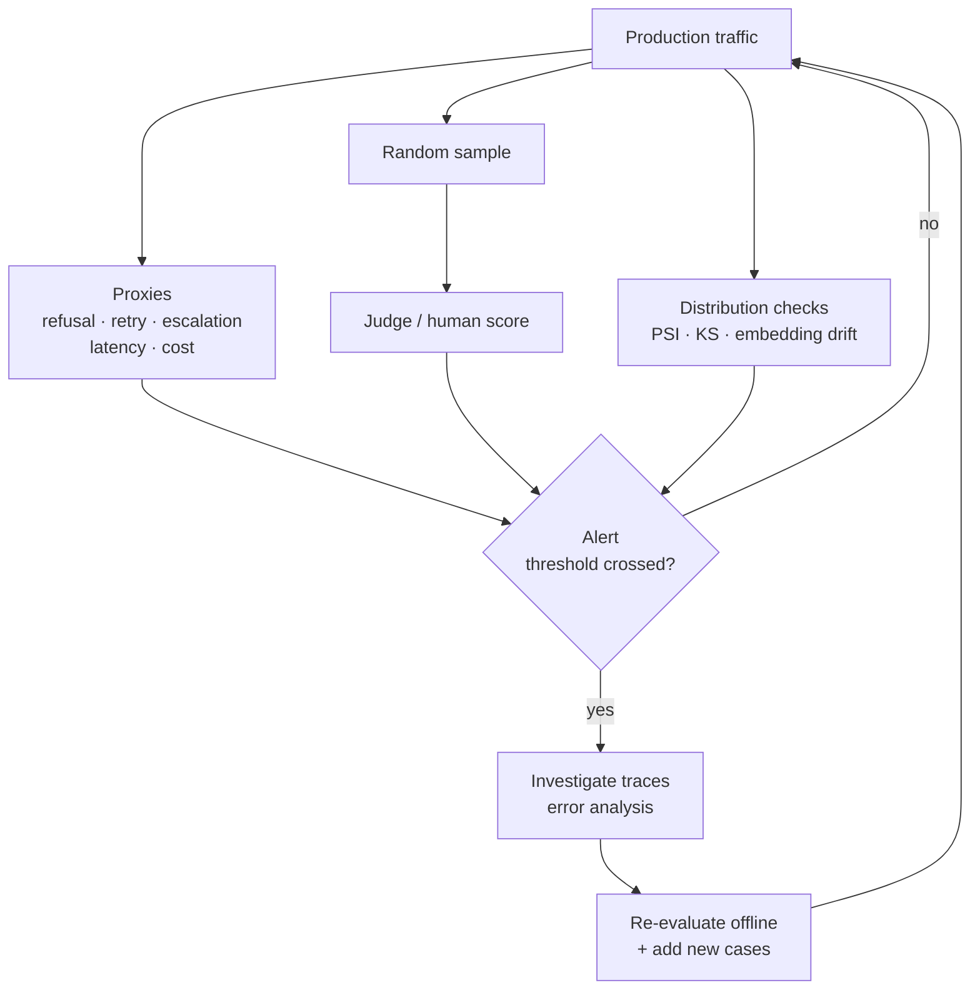

# Model Quality Monitoring and Drift

> **Interview answer (say this first).** Offline evaluation proves a system was good at release time; production monitoring proves it still is now. Because you cannot judge every live response, you monitor **proxies** — refusal rate, retry rate, escalation, thumbs, edit distance, latency, cost — plus a **sample** scored by a judge or a human. You watch three kinds of drift: **data drift** (inputs change), **concept drift** (the right answer changes), and **model/provider drift** (the model changes silently under you). You detect them with distribution checks such as PSI, KS tests, and embedding-centroid distance, you alert on thresholds, and you re-evaluate on a schedule. The goal is to notice decay before your users do.

## Why this exists

A system is not a snapshot; it is a running process in a changing world. Four quiet failures happen after launch:

1. **Inputs change.** A new product launch brings new question types. Customers start asking in a second language. A marketing campaign floods support with a phrasing no one tuned for. Model quality on the old distribution is unchanged; the old distribution is gone.
2. **The world changes.** Prices change, policies change, a regulation takes effect. The model's confident answers are now confidently wrong because its knowledge and your documents are stale. This is concept drift.
3. **The model changes under you.** Providers update hosted models without changing the name. Quality shifts by a few points overnight. Nobody changed your code, and your dashboard still looks fine because it only tracks errors and latency.
4. **The system changes itself.** You add caching, change a prompt, swap a retriever, or let another service write to the same knowledge base. A component change leaks into answer quality.

The average company notices these the same way: a customer complains. That is the most expensive possible sensor. Monitoring exists to install cheaper sensors — proxies, samples, and distribution checks — so you find the change in an hour, not a quarter.

There is a deeper problem: **you cannot label live traffic.** Offline you have expected outputs. Online you do not; if you did, you would not need the model. So production quality must be measured indirectly. Proxies are imperfect but fast, and sampled judgment is slow but accurate. You need both, and you need to know which is which.

That asymmetry shapes the whole design. A proxy does not have to be a perfect measure of quality; it only has to be a **good alarm**. A judge score does not have to be instant; it has to be **unbiased enough** to estimate the true level. Mixing the two up causes real mistakes: teams page on a slow judge, or they trust a fast proxy as if it were a quality measurement. Keep the roles separate — fast and noisy for alerting, slow and careful for estimation.

> **Note.** The core monitoring question is not "is quality 0.86 today?" but "has the distribution of inputs, outputs, or outcomes changed from the reference in a way that predicts quality loss?"

## Start from zero

| Word | Plain meaning |
| --- | --- |
| **Monitoring** | Watching live signals over time to catch changes. |
| **Drift** | A change over time between the reference period and now. |
| **Data drift** | The distribution of inputs changes. Also called covariate shift. |
| **Concept drift** | The relationship between input and correct output changes. |
| **Model drift** | The model's behaviour changes, often from a silent provider update. |
| **Distribution shift** | Any change in the shape of a variable's values. |
| **Proxy metric** | An easy-to-measure signal that correlates with the quality you cannot measure. |
| **Sampled evaluation** | Scoring a random subset with a judge or human. |
| **Reference window** | A trusted baseline period used for comparison. |
| **PSI** | Population Stability Index: a single number for how much a distribution moved. |
| **KS test** | A statistical test for whether two samples come from different distributions. |
| **Embedding drift** | The average meaning of inputs or outputs moves in embedding space. |
| **Feedback loop** | Model outputs influence future inputs, which corrupts monitoring. |
| **Contamination** | Training or tuning on data that overlaps the evaluation set. |
| **Alert** | A notification triggered when a signal crosses a threshold. |
| **Alert fatigue** | So many alerts that people stop reading them. |
| **Re-evaluation** | Re-running the offline suite on a schedule or after drift. |
| **SLI/SLO** | A measured signal and the target you promise for it. |
| **Baseline** | The stored reference values you compare against. |
| **Seasonality** | Regular cycles such as daily or weekly patterns. |

Three distinctions do most of the work:

- **Proxy vs sampled truth.** Proxies are cheap, fast, and noisy; sampled judgment is accurate, slow, and expensive. Use proxies for alerting and samples for confirmation.
- **Data drift vs concept drift.** Data drift is "the inputs look different". Concept drift is "the same input now has a different correct answer". The first is often harmless; the second always matters.
- **Signal vs noise.** Traffic has daily and weekly cycles. Compare like with like — same hour, same day type — or you will alert on the calendar.

Another practical distinction: **drift you cause vs drift you receive**. You cause drift when you change a prompt, a retriever, a cache, or a parsing rule. You receive drift when the world or the provider changes. Both matter, but the response differs: caused drift is usually a bug to fix, while received drift is often a change to adapt to. Tag deployments and provider version changes on the same timeline as your metrics, and you can tell the two apart at a glance.

## The core idea

Think of a factory with a quality line. You cannot inspect every item by hand, so you install cheap sensors that flag suspicious items: weight, size, colour, and the rate at which items get rejected downstream. When a sensor fires, you pull a sample and inspect it properly. You also compare today's sensor readings to last month's to spot a slow trend before it becomes a flood of defects.

Production AI monitoring is that factory line:

- **Cheap sensors** = proxies: refusal rate, retry rate, escalation, edit distance, latency, cost, empty responses.
- **Proper inspection** = a random sample scored by a judge or a human.
- **Comparing to last month** = drift checks: PSI, KS tests, embedding distance.
- **The defect trend** = a rising proxy, a widening distribution, or a falling sample score.

The monitoring loop connects sensing, alerting, and re-evaluation:



The loop matters more than any single check. Proxies find the "when", samples tell you the "how bad", and drift checks tell you the "why".

Choosing good proxies is a skill. A proxy is only useful if it **moves when quality moves** and **does not move for unrelated reasons**. Test candidate proxies against known incidents: did the refusal rate actually rise during the last quality regression? A proxy that missed the last incident, or that fires on every holiday, is worse than nothing because it trains people to ignore the channel. Keep the proxy set small and validate each one against history.

Then watch for the trap of **correlation without cause**. A rising escalation rate might mean worse answers, or it might mean a new support policy that encourages escalation. A proxy is a smoke detector, not a fire report. When one fires, the next step is always to pull traces and confirm the cause before you act.

Drift checks have a similar discipline. Detecting a shift is easy; deciding whether it matters is the real work. A PSI of `0.3` on an input feature that the model barely uses is noise. The same PSI on the retrieval score that feeds the final answer is a warning. Weigh each drift signal by how close it sits to the user outcome, and confirm with a sampled quality score before you escalate. Statistics tell you what changed; they do not tell you whether to care.

Cadence matters too. Some checks run continuously: error rate, latency, cost, refusal rate. Others run hourly or daily: PSI, KS, embedding drift, sampled judge scores. And some run weekly or per release: the full offline suite. Match the cadence to how fast the signal can move and how much you can afford to compute. A daily embedding-drift job is usually enough; a per-minute one is usually waste. The point of monitoring is timely action, not maximum data.

Here is which signal detects which problem. The table is the topic on one screen.

| Signal | Detects | Cost | Latency |
| --- | --- | --- | --- |
| **Refusal / "I don't know" rate** | Retrieval or knowledge gaps, over-refusal | Free | Instant |
| **Retry and loop counts** | Tool failures, bad planning, instability | Free | Instant |
| **Escalation / handoff rate** | Real task failure that reaches a human | Low | Minutes |
| **Thumbs and explicit feedback** | User satisfaction, sparse and biased | Free | Minutes |
| **Edit distance to suggestions** | How much humans rewrote the output | Low | Minutes |
| **Latency and token cost** | Performance and unit economics | Free | Instant |
| **Sampled judge score** | Overall output quality | Medium | Hours |
| **Input PSI / KS** | Data drift in prompts or features | Low | Hours |
| **Embedding drift** | Meaning shift in inputs or outputs | Medium | Hours |
| **Output length / format mix** | Output distribution shift, format bugs | Free | Instant |

## How it works

1. **Define the reference window.** Pick a trusted period — the week after a known-good release — and store the distributions and metric values as the baseline.
2. **Instrument proxies from day one.** Refusal rate, retry count, tool error rate, empty outputs, escalation, latency, and cost per request. They are free and catch most operational drift.
3. **Sample for quality.** Score a small random fraction, often 1% to 5%, with a judge, and a smaller fraction by hand. Random sampling avoids studying only the loud cases.
4. **Track input distributions.** Bin numeric features such as prompt length, retrieval scores, and tool-call counts, and compare the bin shares to the reference with PSI.
5. **Test continuous features.** Use a two-sample KS test to ask whether an input feature's distribution has shifted. Report the statistic and the p-value together.
6. **Watch embeddings.** Compute the centroid of recent input or output embeddings and compare its direction to the reference centroid with cosine distance. A growing distance means the meaning of traffic is moving.
7. **Watch output distributions.** Output length, format validity, refusal rate, and citation rate are all distributions. A shift is often the first visible symptom.
8. **Correct for seasonality.** Compare today with the same weekday and hour, not with last hour. Traffic is not stationary within a day.
9. **Alert on thresholds with hysteresis.** Write down what each level means, and require the breach to persist to avoid flapping. Fewer, trusted alerts beat many noisy ones.
10. **Investigate with traces.** When an alert fires, run error analysis on the affected window. Drift tells you something changed; traces tell you what.
11. **Re-evaluate on a schedule and after drift.** Re-run the offline suite weekly and after any confirmed drift, and compare to the pinned baseline.
12. **Add new cases and refresh the reference.** Every confirmed drift-driven failure becomes a regression case. When the new distribution is accepted as normal, deliberately move the reference window forward.

A useful rule: **a single drifted feature is not an incident, but a drifted feature plus a moved proxy is.** Drift checks create hypotheses; the quality signals confirm them.

One more mental model helps: separate **leading** from **lagging** indicators. Input drift, embedding drift, and output-length shifts are leading — they move first and warn you. Escalation rate, sampled judge score, and customer complaints are lagging — they confirm real user harm but arrive late. Monitoring is strongest when a leading indicator fires and a lagging one confirms it. A leading indicator alone is a hypothesis; a lagging indicator alone is an autopsy. Together they give you time to act.

A drift cheat-sheet:

| Drift type | Example signal | Check | Typical response |
| --- | --- | --- | --- |
| **Data** | Prompt length moves | KS test, PSI | Review context handling and cost |
| **Data** | New topics appear | Embedding centroid distance | Add cases, retune retrieval |
| **Concept** | Same question, new answer | Sampled judge, stale citations | Update the knowledge base |
| **Model** | Step change with no deploy | Logged model id, probe set | Accept, pin, or adapt |
| **Output** | Refusal or length shifts | Distribution of outputs | Inspect traces, fix prompt |

## The syntax you will use

**A proxy snapshot per window.** Cheap counters you can compute from logs alone.

```python
import math

def proxies(rows):
    n = len(rows)
    return {
        "refusal_rate": sum(r["refused"] for r in rows) / n,
        "retry_rate": sum(r["retries"] > 0 for r in rows) / n,
        "empty_rate": sum(not r["output"].strip() for r in rows) / n,
        # nearest-rank p95: ceil(0.95*n) - 1 is the correct 0-based index
        "p95_latency_ms": sorted(r["latency_ms"] for r in rows)[math.ceil(0.95 * n) - 1],
        "cost_per_req": sum(r["cost"] for r in rows) / n,
    }
```

**PSI for a binned distribution (runnable).** PSI sums the log-ratio of current to reference bin shares. Common rule of thumb: below `0.1` is stable, `0.1` to `0.25` is a moderate shift worth a look, and above `0.25` is a large shift.

```python
import numpy as np

def psi(expected, actual, bins=10):
    expected = np.asarray(expected, dtype=float)
    actual = np.asarray(actual, dtype=float)
    # Bin over the combined range so no actual values are silently dropped.
    lo, hi = min(expected.min(), actual.min()), max(expected.max(), actual.max())
    edges = np.linspace(lo, hi, bins + 1)
    e_counts, _ = np.histogram(expected, bins=edges)
    a_counts, _ = np.histogram(actual, bins=edges)
    e = np.clip(e_counts / e_counts.sum(), 1e-6, None)
    a = np.clip(a_counts / a_counts.sum(), 1e-6, None)
    return float(np.sum((a - e) * np.log(a / e)))
```

**A KS test for a continuous feature (runnable).** The KS statistic is the largest gap between the two empirical distributions; the p-value says whether that gap is likely by chance.

```python
from scipy import stats

ks = stats.ks_2samp(reference_lengths, current_lengths)
print(ks.statistic, ks.pvalue)     # e.g. 0.2354 7.06e-122
```

**Embedding-centroid drift (runnable).** Compare the mean embedding direction of the reference window to the current window.

```python
def centroid_cosine_drift(a, b):
    ca, cb = a.mean(axis=0), b.mean(axis=0)
    cos = float(ca @ cb / (np.linalg.norm(ca) * np.linalg.norm(cb)))
    return 1 - cos            # 0 = same direction, larger = more drift
```

**A sampled judge.** Score a small random fraction so the cost stays modest, and store the arm and version with the score.

```python
import random

def sample_for_judging(rows, rate=0.02, seed=0):
    rng = random.Random(seed)
    return [r for r in rows if rng.random() < rate]

for r in sample_for_judging(rows):
    score = judge(r["input"], r["output"])
    store(version=r["prompt_version"], model=r["model"], score=score)
```

**A thresholded alert with hysteresis.** Fire when the signal is clearly outside the reference band, and require it to persist.

```python
ALERT = {
    "refusal_rate": 0.20,      # absolute ceiling
    "psi_quality": 0.25,       # large distribution shift
    "ks_pvalue": 0.01,         # significant input shift
    "p95_latency_ms": 4000,
    "judge_score_drop": 0.05,  # vs baseline
}
```

## Examples: simple to real

**Example 1 — the free dashboard.** Proxies alone catch a large share of incidents, at zero labeling cost.

```text
window         refusal  retry  empty  p95_ms  cost/req
last week       0.041    0.11   0.002   2100    $0.0071
today           0.079    0.13   0.004   2250    $0.0074
```

The refusal rate nearly doubled. Nothing crashed, and error rate is flat. Without this row the change is invisible until users complain.

**Example 2 — a sampled judge confirms the proxy.** Thirty-eight percent of the refusal cases were answerable, so that part of the spike is real quality loss; the rest is benign.

```text
sample n=400, seed=0
judge score  last week 0.84   today 0.79   drop 0.05
refusal cases where the answer WAS available: 38%
```

The judge shows a real five-point drop, and more than a third of refusals were answerable. That is enough to page someone and open the trace analysis.

**Example 3 — PSI flags a quality-score shift.** The reference answer-quality score is centered at `0.85`; the current window has drifted to `0.78`.

```text
psi_same: 0.007
psi_shifted: 1.5638
```

The stable window gives a PSI near zero. The shifted window gives `1.56`, far above the `0.25` rule-of-thumb line. PSI turns "the scores feel lower" into a number you can alert on.

**Example 4 — a KS test catches an input shift.** Prompt length moved from a mean of `500` to `560` characters. The distributions differ.

```text
ks_stat: 0.2354
ks_pvalue: 7.06e-122
```

A KS statistic of `0.2354` means the largest gap between the two cumulative distributions is about 24% of the range. The tiny p-value says the shift is not chance. Large prompts can change cost, latency, and context handling, so this is worth a look even before quality moves.

**Example 5 — embedding drift.** The average meaning of incoming questions moved only slightly in one case and clearly in another.

```text
cosine_drift_close: 0.00022
cosine_drift_far:   0.106541
```

The close case is normal jitter. The far case is a real change in what users are asking about — a new topic, a new product, or a new audience. Embedding drift is often the earliest signal that the world changed.

**Example 6 — detecting a silent model update.** The provider changed the model version behind the same name. Your code is untouched, but behaviour moved.

```text
day      judge_score  refusal  avg_out_tokens  model_id_returned
Mon      0.84         0.041    312             provider/model-abc
Tue      0.83         0.043    308             provider/model-abc
Wed      0.79         0.061    268             provider/model-abc   <-- step change
```

A step change with no code deploy is the signature of a provider update. Log the model id the provider returns, compare it to the pinned id, and re-run the offline suite to decide whether to accept, pin, or adapt.

## In production

- **Proxies first, samples second.** Free counters catch most operational drift immediately. Add sampled judging for the quality signal that proxies cannot give.
- **Randomize the sample.** Hand-picked "interesting" runs are biased. A small random sample is how you learn what typical traffic looks like.
- **Compare like with like.** Use the same weekday and hour as the reference, or you will alert on the calendar instead of on the system.
- **Use both statistic and p-value for KS.** A significant but tiny shift is often harmless; a large shift on few samples is uncertain. Read them together.
- **Treat the PSI thresholds as rules of thumb,** not laws. Calibrate them against your own history and your tolerance for false alarms.
- **Log the returned model id.** Silent provider updates are one of the most common surprises. A step change with no deploy is the tell.
- **Correct for seasonality and campaigns.** A marketing push changes traffic on purpose. Tag known events so they are not mistaken for decay.
- **Alert with hysteresis.** Require the breach to persist and to be large. Alert fatigue turns a monitoring system into background noise.
- **Beware feedback loops.** If the model's output influences what users ask next, the monitored distribution changes because of the system itself. Hold out a random, unassisted slice to keep a clean signal.
- **Prevent contamination.** Never tune on, or train on, the data you judge quality with. It makes the metric look good and mean nothing.
- **Re-evaluate on a schedule.** Weekly offline runs and post-drift runs catch what daily proxies miss. Compare against the pinned baseline.
- **Refresh the reference deliberately.** When a new distribution is accepted as the new normal, move the reference window forward and record why, or every check will alert forever.

## Interview questions

### 1. How do you monitor quality in production when you cannot label every response?

**Answer.** With two layers. First, cheap **proxies** computed from logs: refusal rate, retry and loop counts, tool error rate, empty outputs, escalation, latency, and cost. They are free and catch most operational problems. Second, a small **random sample** scored by a judge or a human, which gives an estimate of true quality. Proxies alert fast; samples confirm severity. Drift checks on inputs and outputs explain why.

**Follow-up: "Why not just use thumbs-up and thumbs-down?"** Feedback is real but sparse and biased: unhappy or vocal users respond more, and most users never click. Use feedback as one proxy among several, and rely on random sampling for an unbiased estimate.

**Trap.** Monitoring only errors and latency. A system can be perfectly reliable and silently worse at its job. Quality needs its own signals.

### 2. What is the difference between data drift and concept drift?

**Answer.** **Data drift** is a change in the input distribution: users ask different questions, in different languages, with different lengths. **Concept drift** is a change in the mapping from input to correct output: the same question now has a different right answer because prices, policies, or the world changed. Data drift may be harmless or a warning; concept drift always matters, because the model is now confidently wrong on questions it used to handle.

**Follow-up: "Which is harder to detect?"** Concept drift, because the inputs look identical. You often catch it only through output or outcome signals — a rising complaint rate, a falling judge score on the same question type, or stale citations.

**Trap.** Treating a shifted input distribution as automatically bad. Sometimes new traffic is fine. Drift is a hypothesis to investigate, not a verdict.

### 3. How do you detect data drift concretely?

**Answer.** For binned or categorical features, use PSI to compare current bin shares to a reference window; below `0.1` is typically stable and above `0.25` is a large shift, by rule of thumb. For continuous features, use a two-sample KS test and read the statistic with the p-value. For text and meaning, compare embedding centroids with cosine distance. Then confirm with a quality proxy or a sampled judge before treating it as a problem.

**Follow-up: "Why not alert on every significant KS test?"** With enough traffic, tiny and harmless shifts become significant. The p-value says "different", not "bad". Pair it with effect size and a quality signal to decide whether it matters.

**Trap.** Using a fixed threshold tuned on someone else's data. Calibrate against your own history, because scale and tolerance vary by system.

### 4. How would you notice a silent model update from a provider?

**Answer.** Log the exact model id and version the provider returns with every request, and chart quality proxies and sampled judge scores against it. A step change in quality, refusal rate, or output length with no deploy of your own is the signature. When it appears, re-run the offline suite against the pinned baseline and decide whether to accept the update, pin to a previous version if available, or adapt the prompt. Version pinning is what makes the update visible and reversible.

**Follow-up: "What if the provider does not expose a version?"** Track fingerprint signals instead: output length distribution, format compliance, refusal rate, and judge score on a fixed probe set. A periodic canary prompt with a known answer is a cheap tripwire.

**Trap.** Assuming a stable model name means stable behaviour. Names are marketing; behaviour changes. Measure behaviour, not names.

### 5. What is a reference window and how do you choose one?

**Answer.** The reference window is a trusted baseline period whose distributions and metric values you compare against. Pick a period after a known-good release, with enough traffic to be stable, and free of known incidents or campaigns. Store the distributions, not just the averages, so you can compare shapes. Refresh it deliberately when a new distribution is accepted as normal, and record the reason.

**Follow-up: "What if the reference window itself was bad?"** Then every alert is noise or missed. Validate the reference with the offline suite and a sample of judged outputs before you trust it, and re-baseline after fixing the problem.

**Trap.** Using all history as the reference. It blends old and new behaviour and hides the change you are trying to detect.

### 6. How do you avoid alert fatigue?

**Answer.** Alert on few, trusted signals with clear thresholds, and require a breach to persist before paging. Separate pages from dashboards: page only on user-visible harm, and put exploratory drift on a dashboard. Tune thresholds against historical traffic so false alarms are rare, and review every alert that fired without action to fix the rule. An alert nobody reads is worse than no alert, because it hides the one that matters.

**Follow-up: "Which signals deserve a page?"** User-visible harm: a large jump in error or escalation rate, a safety breach, a big latency or cost spike, or a confirmed quality drop on a sampled judge. Moderate drift belongs on a dashboard to investigate during business hours.

**Trap.** Adding alerts faster than you remove them. Monitoring debt accumulates, and the on-call engineer learns to ignore the channel.

### 7. What are feedback loops and contamination, and why do they matter?

**Answer.** A **feedback loop** happens when the model's outputs influence future inputs — for example, suggestions shape what users ask next — so the monitored distribution drifts because of the system itself, not the world. **Contamination** is when evaluation or training data overlaps, so the score reflects memorization rather than general ability. Both corrupt the signal: a feedback loop makes a degrading system look stable, and contamination makes a weak system look strong. Hold out an unassisted traffic slice and keep evaluation data separate from training.

**Follow-up: "How do you keep a clean signal despite feedback loops?"** Keep a small random holdout where users get the plain system with no AI suggestions, and monitor quality on that. It costs a little revenue and buys an honest measurement.

**Trap.** Tuning on the same data you judge with. The metric climbs while real quality does not, and you ship on a number that means nothing.

### 8. How does monitoring connect back to offline evaluation and CI?

**Answer.** Monitoring is the sensor; offline evaluation is the microscope. When a drift alert or proxy breach fires, you pull traces, run error analysis, confirm the cause, and then re-run the offline suite to measure the fix. The confirmed failure becomes a regression case, and any related metric becomes a CI gate. Drift also triggers scheduled re-evaluation, so the offline baseline is refreshed against the current world rather than a stale one.

**Follow-up: "How often should you re-evaluate?"** Weekly on a schedule, and immediately after any confirmed drift, provider update, or significant code change. The cadence should match how fast your world changes.

**Trap.** Letting the offline set age while production moves on. An eval set that no longer resembles live traffic will bless a system that users have already abandoned.

## Remember this

- **Proxies alert fast, samples measure truth.** Monitor cheap counters continuously and score a random sample for quality.
- **Three drifts: data, concept, and model.** Inputs change, the right answer changes, and the provider changes the model under you.
- **PSI, KS, and embedding distance** are your distribution checks; read effect size with significance.
- **Log the returned model id.** A step change with no deploy is how a silent provider update reveals itself.
- **Drift is a hypothesis, not a verdict.** Confirm with a quality signal, then re-evaluate offline and add the case to CI.
