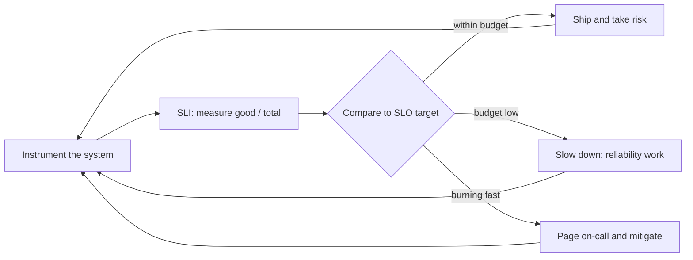

# SLOs, SLIs, and Error Budgets

> **Interview answer (say this first).** An SLI is the number you actually measure — the fraction of requests that succeed, or p95 latency. An SLO is the target you set for that number over a window, such as "99.9% success over 30 days". An SLA is the contract with a customer, usually with penalties attached. The SLO implies an **error budget**: the amount of failure the target allows in that window. You spend the budget on risk — launches, migrations, model upgrades — and when it runs out you stop shipping features and fix reliability. For AI systems, uptime is not enough: also measure task success, p95 latency, cost per successful task, and unsafe-output rate. Finally, alert on the **burn rate** — how fast the budget is going — not just the raw error rate, because a fast burn needs a page tonight and a slow burn needs a ticket this week.

> **Note:**
>
> **Verified.** Every runnable example on this page was executed offline in plain Python (Python 3.14). No model calls were made, and every numeric threshold shown is computed from the formula on the page rather than quoted from a vendor.

## Why this exists

"Be reliable" is not a target. You cannot tell whether you are meeting it, and you cannot tell whether a change is safe to ship.

The SLO framework fixes this by turning reliability into a number with a budget. It answers three questions that otherwise become arguments:

- **Are we healthy right now?** The SLI measures it; the SLO states the target.
- **Can we take this risk?** The error budget says how much failure is left to spend.
- **Do we fix or ship?** The error-budget policy decides, before the argument starts.

AI systems make this harder. A normal web service either returns 200 or it does not. An AI system can return 200 with a wrong answer, so "success" itself must be defined and measured. Latency is long-tailed. Cost is a first-class reliability signal: a runaway agent is an outage even if every request "succeeded". And quality can decay without any error code at all.

Here is what that looks like in practice:

- The dashboard was green at 99.99% availability while users complained the answers were wrong.
- A model upgrade cut task success by four points, and there was no target to notice it against.
- A single agent looped for an hour and burned a month of budget; availability looked perfect.
- A prompt change doubled hallucinations for a week before anyone labelled the output.
- A region outage was survivable, but the fallback model had no latency target, so the "fallback" was slower than the timeout.

An SLO is not a promise to be perfect. It is a deliberate decision about how much imperfection is acceptable, written down so a machine can enforce it and a team can act on it.

> **The one-sentence purpose.** An SLO turns "be reliable" into a number, a window, and a budget you spend on purpose instead of discovering after the fact.

## Start from zero

Learn these words first. They are used loosely in conversation and precisely in interviews.

| Word | Plain meaning |
| --- | --- |
| **SLI** | Service Level Indicator. The thing you measure, like success rate or p95 latency. |
| **SLO** | Service Level Objective. The target for an SLI over a window, like 99.9% success in 30 days. |
| **SLA** | Service Level Agreement. A contract with a customer that usually includes penalties. |
| **Error budget** | The failure an SLO allows. At 99.9% over a window, 0.1% of events may be bad. |
| **Window** | The time period the SLO is measured over, such as 30 rolling days. |
| **Good event** | One unit that counts as success, like a request that returned a correct result. |
| **Total event** | The denominator: all the requests or tasks you chose to count. |
| **Ratio SLI** | A good-events divided by total-events measurement, the most common kind. |
| **Availability** | The fraction of time or requests the service answers successfully. |
| **p95 / p99 latency** | The latency at the 95th or 99th percentile. The tail users actually feel. |
| **Task success rate** | The fraction of agent tasks that finish correctly, judged automatically or by a human. |
| **Cost per successful task** | Total spend divided by tasks that succeeded. The unit that matters. |
| **Unsafe-output rate** | The fraction of outputs that violate a safety rule. A quality SLI. |
| **Burn rate** | How fast the error budget is being spent, relative to the sustainable rate. |
| **Fast burn** | A high burn rate over a short window. This is a page. |
| **Slow burn** | A low but steady burn. This is a ticket, not a wake-up. |
| **Error-budget policy** | The pre-agreed rule for what happens when the budget is low or gone. |
| **Rolling window** | A window that always covers the last N days, rather than a calendar month. |
| **Page vs ticket** | A page interrupts a person now; a ticket enters a queue for the next workday. |

Three distinctions matter most:

- **SLI vs SLO vs SLA.** The SLI is the measurement, the SLO is the internal target, and the SLA is the external contract. An SLO should be *stricter* than an SLA, so you have warning before you owe anyone money.
- **Availability vs quality.** Availability asks "did it respond?" Quality asks "was the answer good?" An AI system can be perfectly available and completely wrong, so you need both kinds of SLI.
- **Target vs measurement.** A target you never measure is a wish. Every SLO needs a query or a script that produces its SLI on demand.

## The core idea

Think of a car with a fuel gauge and a plan.

The **fuel gauge** is the SLI: a live measurement. The **destination** is the SLO: where you committed to arrive. The **fuel in the tank** is the error budget. You can drive hard — take risky shortcuts, carry heavy loads, launch new features — as long as the fuel lasts. When the low-fuel light comes on (the burn-rate alert), you drive gently to the nearest station instead of racing.

The mental model is a loop: measure, compare, decide, act.



The comparison table is the part to memorise:

| Concept | Question it answers | Example | Owner |
| --- | --- | --- | --- |
| **SLI** | What did we measure? | 99.95% success last 30 days | Instrumentation / platform |
| **SLO** | What did we target? | 99.9% success over 30 days | Service team + product |
| **SLA** | What did we promise a customer? | 99.5% with service credits | Legal + business |
| **Error budget** | How much failure is left? | About 500 left of 1,000 (0.05% of 1,000,000) after a good month | Service team |
| **Burn rate** | How fast are we spending it? | 6x the sustainable rate | On-call |
| **Policy** | What do we do about it? | Freeze features, fix reliability | Engineering leadership |

A subtle but vital point: **an SLO is a budget, not a ceiling.** If you are at 100% of target every single window, your target is probably too loose. Spending budget on experiments is the point. A team that never spends its budget is either under-shipping or measuring the wrong thing.

> **The mental model in one line.** The SLI is the gauge, the SLO is the destination, the error budget is the fuel, and the burn rate tells you how fast the tank is emptying.

### Why AI SLIs are harder than uptime

| SLI type | What counts as "good" | Why it is hard |
| --- | --- | --- |
| **Availability** | Request returned without a server error | Easy to measure, but says nothing about quality. |
| **Latency** | Request finished under a threshold | Long-tailed; the mean hides the tail. Count the fraction under a budget. |
| **Task success** | The task produced the correct outcome | Needs an evaluator, a rubric, or a human. Define it per task type. |
| **Cost** | Spend per successful task stayed under a limit | The denominator is successes, not calls. A cheap failure still costs money. |
| **Safety** | The output broke no safety rule | Needs a classifier plus human review of the flagged cases. |

The rule of thumb: **for quality, measure the fraction of bad outcomes over all outcomes,** the same ratio shape as availability. That keeps the error-budget maths identical, even though the judgement is harder.

## How it works

Follow one SLO from definition to enforcement.

1. **Pick the user journey, not the server.** Choose the thing a user cares about: "the support agent answers correctly", not "the model endpoint returned 200". The journey sets the scope.
2. **Define the SLI precisely.** Write the numerator and denominator as a query or function. State the window. If you cannot write it down, it is not a measurement.
3. **Set the target deliberately.** Start from recent performance, then aim slightly better. Three to four nines is common for availability; quality targets are often lower because they are harder.
4. **Choose the right SLI type.** Use a ratio for availability and success, a percentile plus a threshold for latency, and a per-unit cost for spend.
5. **Compute the error budget.** It is `(1 - target) × total events` over the window. This is the amount of failure you can afford.
6. **Measure the burn rate.** Burn rate is `observed error rate ÷ allowed error rate`. A burn of 1 exhausts the budget exactly at the end of the window; a burn of 10 exhausts it ten times faster.
7. **Alert on burn rate with paired windows.** In each tier, a short window catches the burn and a long window confirms it is sustained. A fast tier pages on a spike; a sustained tier pages on a steady leak. Page when either tier fires.
8. **Write the error-budget policy.** Decide in advance what happens at 75% spent, 100% spent, and during a fast burn. Remove the 3am negotiation.
9. **Review the SLO quarterly.** If you never miss it, tighten it or widen the scope. If you always miss it, the target is wrong or the system is not ready.
10. **Wire it into releases.** Treat an SLO breach like a failed test. The error budget decides whether the next feature ships.

The burn-rate maths is the part people fumble in interviews. Here it is in one line:

```text
burn_rate = (bad events / total events) / (1 - SLO target)
```

If the target is 99.9%, the allowed error rate is 0.001. If you are seeing 1% errors, your burn rate is `0.01 / 0.001 = 10`. At a burn rate of 10 you would spend a 30-day budget in three days. That is a page.

> **The burn-rate insight.** The burn rate converts "we have some errors" into "we are spending the budget this fast", which is the thing you can compare to a threshold and an alert.

## The syntax you will use

These are real production forms. Read them once; later chapters explain each.

**Define an SLO in YAML (OpenSLO-style).** A ratio SLI with a target and a window.

```yaml
# agent-api-slo.yaml - a standard ratio SLO
apiVersion: openslo/v1
kind: SLO
metadata:
  name: agent-api-availability
spec:
  service: agent-api
  indicator:
    spec:
      ratioMetric:
        counter: true
        good:
          metricSource: { type: prometheus, spec: { query: 'sum(rate(http_requests_total{code=~"2.."}[5m]))' } }
        total:
          metricSource: { type: prometheus, spec: { query: 'sum(rate(http_requests_total[5m]))' } }
  objectives:
    - target: 0.999
      timeWindow:
        - duration: 30d
```

The YAML is the machine-readable contract. The query defines exactly what "good" means.

**Compute the SLI as a recording rule.** Precompute the ratio so dashboards and alerts stay cheap.

```yaml
# recording rule every 30s
groups:
  - name: agent-slo
    rules:
      - record: slo:availability:ratio5m
        expr: |
          sum(rate(http_requests_total{code=~"2.."}[5m]))
          /
          sum(rate(http_requests_total[5m]))
```

A recording rule freezes the definition so a dashboard, an alert, and an error-budget report all use the same number.

**Compute the error ratio as recording rules.** The burn alert below reads precomputed error ratios at four windows, so the alert and the dashboards cannot drift apart.

```yaml
# error-ratio recording rules - the inputs the multi-window burn alert reads
groups:
  - name: agent-slo-burn-inputs
    rules:
      - record: slo:error_ratio:5m
        expr: |
          sum(rate(http_requests_total{code!~"2.."}[5m]))
          /
          sum(rate(http_requests_total[5m]))
      - record: slo:error_ratio:30m
        expr: |
          sum(rate(http_requests_total{code!~"2.."}[30m]))
          /
          sum(rate(http_requests_total[30m]))
      - record: slo:error_ratio:1h
        expr: |
          sum(rate(http_requests_total{code!~"2.."}[1h]))
          /
          sum(rate(http_requests_total[1h]))
      - record: slo:error_ratio:6h
        expr: |
          sum(rate(http_requests_total{code!~"2.."}[6h]))
          /
          sum(rate(http_requests_total[6h]))
```

Each rule produces a fraction in `[0, 1]`. Dividing that ratio by the allowed error rate (`0.001` for a 99.9% target) yields the burn rate the alert compares against.

**Compute the error budget in PromQL.** How many bad events the window still allows.

```promql
# error budget = (1 - objective) * total events in the window
(1 - 0.999) * sum(increase(http_requests_total[30d]))
```

This number, not a feeling, decides whether you ship this sprint.

**Compute the burn rate in PromQL.** Errors relative to what the SLO allows.

```promql
# burn rate over 1h for a 99.9% target
sum(rate(http_requests_total{code!~"2.."}[1h]))
/
sum(rate(http_requests_total[1h]))
/
0.001
```

A burn above 1 means you are spending faster than the window allows.

**Alert on a multi-window burn rate.** Use two tiers; in each, a short window catches the burn and a long window confirms it is real. Page when either tier fires.

```yaml
groups:
  - name: agent-slo-burn
    rules:
      # fast burn: 14.4x over 1h (2% of the 30d budget) confirmed by 5m
      - alert: AgentFastBurn
        expr: |
          (slo:error_ratio:1h / 0.001 > 14.4)
          and
          (slo:error_ratio:5m / 0.001 > 14.4)
        for: 2m
        labels: { severity: page }
        annotations:
          summary: "Burning the 30d error budget fast"
      # sustained burn: 6x over 6h (5% of the budget) confirmed by 30m
      - alert: AgentSustainedBurn
        expr: |
          (slo:error_ratio:6h / 0.001 > 6)
          and
          (slo:error_ratio:30m / 0.001 > 6)
        for: 15m
        labels: { severity: page }
        annotations:
          summary: "Burning the 30d error budget steadily"
```

The `and` in each rule is the important part: a short blip that does not persist will not clear the long window, so it does not wake anyone at 3am. The `6x` tier is what catches a steady burn of, say, `10x` — it never reaches the `14.4x` fast threshold, but at that rate the budget lasts only three days, so it must page.

**Turn an SLO into an error budget and a policy.** The decision rule, encoded once.

```python
def error_budget(objective: float, total: int) -> float:
    return (1 - objective) * total

print(round(error_budget(0.999, 1_000_000), 1))   # 1000.0 bad events allowed
```

This is the arithmetic behind "we have 1,000 failures to spend."

## Examples: simple to real

**Example 1 — the three numbers, worked.** An SLI is measured, an SLO is targeted, and the budget falls out.

```python
def availability(good, total):
    return good / total

def error_budget(objective, total):
    return (1 - objective) * total

print("SLI:", availability(999_000, 1_000_000))          # 0.999
print("budget at 99.9%:", round(error_budget(0.999, 1_000_000), 1))  # 1000.0
print("budget at 99.0%:", round(error_budget(0.99, 1_000_000), 1))   # 10000.0
```

The same traffic allows ten times more failure at 99.0% than at 99.9%. **The target, not the traffic, sets the budget.**

**Example 2 — is the budget healthy or spent?** Track remaining budget as a fraction so the policy can act on it.

```python
def budget_status(objective, good, total):
    allowed = (1 - objective) * total
    bad = total - good
    remaining = allowed - bad
    return {"sli": good / total, "remaining_fraction": remaining / allowed}

for good in (998_500, 999_500, 1_000_000):
    s = budget_status(0.999, good, 1_000_000)
    print(good, "-> SLI", s["sli"], "remaining", round(s["remaining_fraction"], 4))
# 998500 -> SLI 0.9985 remaining -0.5
# 999500 -> SLI 0.9995 remaining 0.5
# 1000000 -> SLI 1.0 remaining 1.0
```

The first row is **over budget** (a negative remaining fraction), which in a healthy month should trigger the policy, not a debate.

**Example 3 — burn rate and time to exhaustion.** The burn rate tells you how long the budget lasts at the current pace.

```python
WINDOW_HOURS = 30 * 24   # 720

def burn_rate(objective, good, total):
    return ((total - good) / total) / (1 - objective)

def time_to_exhaust_hours(burn, window_hours=WINDOW_HOURS):
    return window_hours / burn

print("burn (healthy):", round(burn_rate(0.999, 999_900, 1_000_000), 3))  # 0.1
print("burn (bad):", round(burn_rate(0.999, 990_000, 1_000_000), 3))      # 10.0
print("exhaust at 10x:", round(time_to_exhaust_hours(10.0), 1))           # 72.0
print("exhaust at 1x:", round(time_to_exhaust_hours(1.0), 1))             # 720.0
```

A burn of 1 is exactly sustainable for the whole window. A burn of 10 drains a 30-day budget in 72 hours, which is why it is a page.

**Example 4 — fast and slow burn windows.** A short window reacts quickly; a long window avoids crying wolf. The thresholds below are *computed*, not quoted.

```python
WINDOW_HOURS = 30 * 24

def budget_spent_fraction(burn, for_hours, window_hours=WINDOW_HOURS):
    return burn * for_hours / window_hours

print("14.4x for 1h spends:", round(budget_spent_fraction(14.4, 1), 4))   # 0.02
print("6x for 6h spends:", round(budget_spent_fraction(6.0, 6), 4))       # 0.05
print("10x for 6h spends:", round(budget_spent_fraction(10.0, 6), 4))     # 0.0833
print("1x for 3 days spends:", round(budget_spent_fraction(1.0, 72), 4))  # 0.1

def burn_alert(burn_1h, burn_5m, burn_6h, burn_30m, fast=14.4, sustained=6.0):
    # fast tier: 1h long window confirmed by the 5m short window
    fast_tier = burn_1h > fast and burn_5m > fast
    # sustained tier: 6h long window confirmed by the 30m short window
    sustained_tier = burn_6h > sustained and burn_30m > sustained
    return fast_tier or sustained_tier

print("steady 10x burn:", burn_alert(10.0, 10.0, 10.0, 10.0))      # True
print("fast burst, confirmed:", burn_alert(20.0, 20.0, 8.0, 8.0))  # True
print("5m blip only:", burn_alert(1.0, 20.0, 1.0, 1.0))            # False
print("30m blip only:", burn_alert(1.0, 1.0, 1.0, 20.0))           # False
```

The fast tier (`14.4×` over both `1h` and `5m`) spends about 2% of the window budget in an hour; the sustained tier (`6×` over both `6h` and `30m`) spends about 5% in six hours. A steady `10×` burn never reaches the `14.4×` fast threshold, but it clears the sustained tier and pages — correctly, because at that rate the budget lasts only three days. The short window catches a burn quickly; the long window confirms it is not a blip. **Requiring both windows, in whichever tier fires, is how you get speed without false alarms.**

**Example 5 — a latency SLI at p95.** Report the percentile, but define the SLI as the fraction of requests under a threshold, so it is a ratio you can budget.

```python
import math

def percentile(samples, p):
    ordered = sorted(samples)
    rank = max(1, math.ceil(p / 100 * len(ordered)))
    return ordered[rank - 1]

def latency_sli(samples, threshold_ms):
    good = sum(1 for s in samples if s <= threshold_ms)
    return good / len(samples)

latencies = [120, 180, 200, 210, 250, 260, 300, 310, 320, 340,
             360, 400, 420, 450, 500, 560, 600, 700, 900, 1200]
print("p50:", percentile(latencies, 50), "ms")   # 340
print("p95:", percentile(latencies, 95), "ms")   # 900
print("fraction under 500ms:", latency_sli(latencies, 500))  # 0.75
```

The mean of these latencies would look fine, but 25% of users waited over half a second. **The percentile and the threshold ratio are the same story told two ways.**

**Example 6 — cost per successful task, and the policy it drives.** For agents, spend belongs in the SLO set, because a runaway loop is an outage.

```python
def cost_per_success(total_cost, successes):
    return total_cost / successes if successes else float("inf")

print("100% success:", round(cost_per_success(48.0, 1600), 4))   # 0.03
print("75% success:", round(cost_per_success(48.0, 1200), 4))    # 0.04

def error_budget_policy(remaining_fraction, burn_1h):
    if remaining_fraction <= 0:
        return "freeze all features, reliability work only"
    if burn_1h > 14.4:
        return "freeze non-critical releases and page the on-call"
    if remaining_fraction < 0.25:
        return "feature freeze unless reliability approval"
    return "ship normally"

print(error_budget_policy(0.8, 1.0))     # ship normally
print(error_budget_policy(0.1, 2.0))     # feature freeze unless reliability approval
print(error_budget_policy(-0.5, 20.0))   # freeze all features, reliability work only
```

The same $48 cost more per finished task when fewer tasks succeeded, because failures still consumed tokens. The policy function is the part to keep: it removes the argument at 3am.

## In production

- **Start with two or three SLOs, not twenty.** Too many targets means none are trusted. Pick the user journey and the one or two SLIs that would wake you up if they broke.
- **Availability alone will lie about AI quality.** Add at least one quality SLI (task success, faithfulness, or unsafe-output rate) and measure it on a sample, not all traffic.
- **Alert on burn rate, not on the raw error rate.** A fixed "errors > 1%" alert fires during normal blips and stays silent during a slow leak. Multi-window burn alerts are quieter and faster at once.
- **Use a rolling window.** Calendar months reset the budget on the 1st and create a false sense of safety. A rolling 30-day window always reflects the last month.
- **Never alert on the error budget itself at 100%.** By then the damage is done. Alert on the burn that will exhaust it.
- **Set the SLO stricter than the SLA.** If you promise 99.5% to a customer, target 99.9% internally, so you see trouble before you owe credits.
- **Include cost as an SLI for agents.** A cost-per-successful-task target catches runaway loops that every availability check calls a success.
- **Define "good" conservatively for quality.** When a judge or classifier is unsure, count it as bad. Optimistic labels hide exactly the cases users complain about.
- **Make the evaluator part of the SLI pipeline, and version it.** If the judge changes, the SLI changes. Record which evaluator version produced each number.
- **Sample, and state the sample rate.** You rarely need to evaluate every response. A 5% sample with a confidence interval beats a hand-waved percentage.
- **Keep one source of truth per SLI.** A dashboard, an alert, and a report that disagree will each be believed by a different person. Use recording rules.
- **Review the SLO set every quarter.** Tighten what is easy, loosen what is impossible, and retire SLIs nobody acts on. An SLO that never changes a decision is toil.

## Interview questions

### 1. What is the difference between an SLI, an SLO, and an SLA?

**Answer.** The SLI is the measurement — the number you actually record, such as the fraction of successful requests. The SLO is the internal target for that measurement over a window, such as 99.9% over 30 days. The SLA is the external contract with a customer, usually with penalties. The SLO should be stricter than the SLA so you get early warning before you breach the contract.

**Follow-up: "Can an SLI exist without an SLO?"** Yes, and it should. You often measure an indicator before you trust it enough to set a target. But an SLI without an action attached is a vanity metric; the SLO plus the policy is what makes it operational.

**Trap.** Using "SLA" and "SLO" interchangeably. An SLA is a business contract; an SLO is an engineering target. Mixing them makes engineers responsible for legal promises they did not set.

### 2. What is an error budget, and how do you compute it?

**Answer.** The error budget is the failure the SLO allows in its window: `(1 - target) × total events`. At 99.9% over a window with a million requests, the budget is 1,000 bad requests. It turns reliability into a resource you can spend on launches and experiments. When it is exhausted, the pre-agreed policy says features freeze and reliability work takes over.

**Follow-up: "How do you count events for an AI quality SLO?"** Count the outcomes you can judge — a sampled set of answers labelled by an evaluator or a human — and define "bad" conservatively. The ratio shape is the same as availability; only the labelling is harder.

**Trap.** Forgetting the window. "99.9%" without "over 30 days" is meaningless, because the allowed failure depends entirely on the window.

### 3. What is burn rate, and why alert on it instead of the error rate?

**Answer.** Burn rate is the observed error rate divided by the allowed error rate, `error_rate / (1 - target)`. A burn of 1 exactly exhausts the budget over the window; a burn of 10 exhausts it in one tenth of the window. Alerting on burn rate means you react to *how fast the budget is going*, which is what determines whether you have time. A fixed error-rate threshold does not know the target or the window.

**Follow-up: "Why two windows?"** A short window catches a fast burn quickly but is noisy. A long window is stable but slow. Requiring both to exceed their thresholds — a short fast threshold and a long slow threshold — gives fast detection with few false pages.

**Trap.** Setting a single-window burn alert. It either pages on every blip or misses a sustained slow burn, depending on the threshold.

### 4. What are good SLIs for an AI system?

**Answer.** At minimum: availability, latency at p95 (as the fraction of requests under a budget), task success rate, cost per successful task, and unsafe-output rate. Availability and latency cover the serving layer; task success, cost, and safety cover the AI behaviour. Judge quality on a sample with a versioned evaluator, and keep the definition of "good" conservative.

**Follow-up: "Why cost per successful task and not cost per call?"** Because failures consume tokens too. A cheaper model that fails more often can raise the total cost per finished task. The unit that matches user value is the completed task.

**Trap.** Choosing only availability. An agent that returns 200 with a hallucinated answer is fully "available" and completely unreliable in the way users care about.

### 5. How do you choose an SLO target?

**Answer.** Start from recent measured performance, then set the target slightly better than that. Make it strict enough that a breach is meaningful but loose enough that you can still ship. Two or three SLOs is enough to begin. Review quarterly: raise the target if you never miss it, lower or fix the system if you always miss it.

**Follow-up: "Why not just target 100%?"** Because 100% is unaffordable and leaves no room to change anything. A budget you never spend is a budget you did not need. The error budget exists precisely so you can take calculated risks.

**Trap.** Picking "four nines" because it sounds good. Each added nine costs roughly ten times more, and for a quality SLO the cost is in human labelling and evaluator engineering.

### 6. Walk through the error-budget policy. What happens when the budget runs out?

**Answer.** Define the policy in advance at several levels. When the budget is healthy, ship normally. When it drops below a quarter, require a reliability justification for non-critical features. When it is exhausted, freeze features and do reliability work only. During a fast burn, page the on-call immediately regardless of the remaining budget. The point is that the decision is pre-agreed, not negotiated during the incident.

**Follow-up: "Who enforces the freeze?"** Engineering leadership, using the dashboard as the shared source of truth. The policy only works if it is real; a freeze that exceptions away on request teaches the team the SLO is decorative.

**Trap.** Making the policy a suggestion. If nothing changes when the budget is spent, the SLO is not a control; it is a graph.

### 7. Why are quality SLOs harder than uptime SLOs?

**Answer.** Uptime has an unambiguous good event: the server responded. Quality requires labelling, and labels come from an evaluator, a rubric, or a human, each with error and cost. Quality is also task-specific — success for a summariser differs from success for a booking agent — and can drift as the world changes. So you define success per task type, measure on a sample with a confidence interval, version the evaluator, and account for judge error.

**Follow-up: "How do you keep a quality SLO from being gamed?"** Use held-out data, rotate samples, combine automated checks with periodic human review, and watch for drift in the evaluator itself. If the metric can be satisfied without helping the user, it will be.

**Trap.** Reporting a single number with no interval or sample size. A quality SLI of "95%" from twenty judged responses is mostly noise.

### 8. How do SLOs connect to incident response?

**Answer.** The burn-rate alert is the detector: it tells you the budget is draining fast and pages the on-call. The error budget quantifies the incident's cost, so prioritisation is objective. The error-budget policy says whether to freeze shipping while you recover. And after the incident, the missing or newly revealed SLI becomes a regression test and often a new alert. SLOs bound the incident before, during, and after.

**Follow-up: "What if the incident is a quality regression with no error code?"** That is exactly why a quality SLI exists. If you only monitor errors, a silent quality drop burns nothing on the dashboard and everything in trust. The quality SLI is the sensor; the regression gate is the fix.

**Trap.** Treating SLOs as a dashboard-only concern. If they do not trigger pages, freezes, or regression tests, they are reporting, not reliability engineering.

## Remember this

- **SLI is the measurement, SLO is the target, SLA is the contract.** Keep the internal SLO stricter than the external SLA.
- **Error budget = `(1 - target) × total events`.** It turns reliability into fuel you spend on purpose.
- **Burn rate = `error rate ÷ (1 - target)`.** Alert on fast and slow windows together; a burn of 10 empties a 30-day budget in days.
- **Uptime is not quality.** For AI, add task success, p95 latency, cost per successful task, and unsafe-output rate.
- **A pre-agreed error-budget policy is the point.** If nothing changes when the budget is spent, the SLO is decoration.
