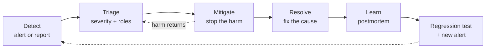

# Incident Response for AI Systems

> **Interview answer (say this first).** Incident response is a rehearsed loop: detect, triage, mitigate, resolve, learn. AI systems add failure modes that produce no error code — quality regression, hallucination spikes, prompt injection, cost blowups, runaway agents, unsafe output, and provider outages — so you monitor quality and cost, not just uptime. Assign a severity from the impact and name clear roles: incident commander, operations lead, and communications lead. Mitigate before you fully understand the cause: trip the kill switch, fall back to a known-good model, disable the offending tool, revert the prompt, or raise a guardrail threshold. Communicate on a fixed cadence from one status page. Then run a blameless postmortem that names system causes, not people, and turn the incident into a permanent regression test and, where relevant, a new alert or SLI.

> **Note:**
>
> **Verified.** Every runnable example on this page was executed offline in plain Python (Python 3.14). No model calls were made, and no vendor-specific numbers are asserted.

## Why this exists

Incidents are normal. The question is never "will something break?" but "when it breaks, how fast and how calmly do we respond?"

Most teams are good at the happy path and improvised at 3am. The difference between a twenty-minute blip and a day-long outage is usually not the bug — it is whether the team already knew how to detect it, who to call, and which lever to pull.

AI systems make the improvisation worse, because the usual reflexes do not work:

- There is **no error code** for a wrong answer. The system returns HTTP 200 and a confident lie.
- The cause is **diffuse**: the prompt, the model version, the retrieved context, a tool's output, or the data itself.
- A runaway agent can **spend real money** in minutes while every dashboard looks green.
- A **provider outage** is outside your control, so the mitigation is a fallback, not a fix.
- A **prompt injection** turns your own tools against you, so the mitigation is to remove capability, not to retry.

Here is what that looks like in practice:

- A model upgrade silently reduced task success by four points; a customer noticed before the team did.
- An agent entered a tool loop and burned the monthly budget in forty minutes; nobody had a page for spend rate.
- A poisoned document in the retrieval index made the agent exfiltrate data through a tool call.
- A provider had a partial outage, and the fallback model had never been load-tested, so failover made latency worse.
- The team knew a kill switch existed but not where it was, and spent thirty minutes finding it during an active incident.

Incident response is the discipline that turns that chaos into a checklist. It does not prevent failures. It shortens them, limits the damage, and makes sure each one leaves the system stronger.

> **The one-sentence purpose.** Incident response is a rehearsed loop — detect, triage, mitigate, resolve, learn — that shortens outages and converts each one into a permanent test.

## Start from zero

Learn these words first. They are used loosely in conversation and precisely in interviews.

| Word | Plain meaning |
| --- | --- |
| **Incident** | Any unplanned event that harms users, data, money, or trust. |
| **Severity (SEV)** | A label for how bad an incident is, such as SEV1 (worst) to SEV4 (minor). |
| **Incident commander (IC)** | The person who runs the response and makes decisions. Does not debug. |
| **Operations lead** | The person who performs the technical work — rollbacks, restarts, mitigations. |
| **Communications lead** | The person who writes status updates and talks to stakeholders. |
| **Detection** | The moment the system or a human notices something is wrong. |
| **Triage** | Quickly deciding how bad it is, who owns it, and what to do first. |
| **Mitigation** | Stopping the harm now, even before you know the root cause. |
| **Resolution** | The underlying cause is fixed and the system is stable. |
| **MTTD** | Mean time to detect: from impact starting to someone noticing. |
| **MTTM** | Mean time to mitigate: from noticing to the harm stopping. |
| **MTTR** | Mean time to restore: impact start to mitigation, i.e. MTTD + MTTM, when users are safe. Fixing the root cause (time to resolve) is a separate, longer clock. |
| **Kill switch** | A pre-built control that stops runs or disables a capability instantly. |
| **Fallback model** | A second model you can route to when the primary fails or degrades. |
| **Guardrail** | A check outside the model that blocks or flags unsafe output or actions. |
| **Rollback** | Returning to the previous known-good version of prompt, model, or code. |
| **Prompt injection** | Malicious text that manipulates the model into betraying its instructions. |
| **Runaway agent** | An agent that loops or acts without a bound, consuming resources. |
| **Blameless postmortem** | A written review focused on system causes, not individual blame. |
| **Action item** | A specific, owned, dated fix that comes out of a postmortem. |
| **Status page** | The single place users and stakeholders read current impact and updates. |
| **Regression test** | A test that reproduces a past failure so it cannot return silently. |

Three distinctions matter most:

- **Mitigation vs resolution.** Mitigation stops the bleeding (disable the tool, revert the prompt). Resolution fixes the cause. You almost always mitigate first.
- **Detection vs diagnosis.** Detection is noticing. Diagnosis is explaining. The best teams optimise detection and postpone diagnosis until users are safe.
- **Blameless vs consequence-free.** Blameless means the review does not punish people for reporting and reasoning honestly. It does not mean nobody is accountable for the fix.

## The core idea

Think of a hospital emergency room.

A patient arrives. A triage nurse assigns a **severity** in seconds, before the full diagnosis. A **team leader** coordinates, while specialists work. Someone talks to the family on a **fixed cadence**. Nobody waits for a complete diagnosis to stop the bleeding.

An AI incident works the same way. You do not need to know why hallucination rate doubled before you revert the prompt that changed it. You need to know who is in charge, how bad it is, and which lever stops the harm.

The response is a loop, and the loop can restart:



The table to memorise maps each AI incident to its earliest reliable signal and its first mitigation:

| Incident | Earliest signal | First mitigation |
| --- | --- | --- |
| **Quality regression** | Task-success SLI drops after a deploy | Revert the prompt or pin the previous model |
| **Hallucination spike** | Faithfulness metric or user reports rise | Raise grounding threshold; disable ungrounded path |
| **Prompt injection** | Guardrail trips; odd tool calls | Disable the affected tool; sanitise retrieved text |
| **Cost blowup** | Spend rate above baseline | Trip the budget breaker; cap turns and tokens |
| **Runaway agent** | Loop counter, turn count, or duration spikes | Kill switch: stop in-flight runs |
| **Unsafe output** | Safety classifier fires | Enable the output guardrail; block the action |
| **Provider outage** | Error rate and latency from one provider | Fail over to the fallback model or region |

Notice that every first mitigation either **removes capability, reverts a change, or sheds risk to another path** — failing over to a fallback model or region shifts the load rather than fixing the primary. That is deliberate. In an incident you want the smallest, most reversible action that stops the harm, not the most elegant permanent fix.

> **The mental model in one line.** Triage assigns severity and roles, mitigation stops the harm before you understand it, and the postmortem buys insurance against the same incident twice.

## How it works

Follow one incident from the first alarm to the last action item.

1. **Detect.** An alert fires or a human reports. For AI, alerts come from error rate, latency, the quality SLI, the safety classifier, the cost rate, and the loop counter — not just uptime.
2. **Declare.** A human declares the incident and opens a single channel. Declaring is cheap; an undeclared incident has no commander and no timeline.
3. **Triage and assign severity.** Estimate the blast radius: how many users, how much money, whether data or safety is at risk. Set SEV1 to SEV4 and page accordingly.
4. **Assign roles.** Name an incident commander, an operations lead, and a communications lead. The IC coordinates and does not debug. Roles can be combined on a small incident.
5. **Stabilise and gather evidence.** Capture the failing trace, the prompt and model versions, the tool calls, and the current metrics before you change anything. Evidence disappears fast.
6. **Mitigate before you diagnose.** Pull the safest lever: kill switch, fallback model, disable a tool, revert a prompt, raise a threshold, or shed load. Prefer reversible actions.
7. **Communicate on a cadence.** Post a status update every fifteen to thirty minutes, even if it says "still investigating". Silence reads as incompetence.
8. **Confirm the mitigation worked.** Watch the SLI or cost rate return to baseline. A mitigation you did not verify is a hope, not a fix.
9. **Resolve the cause.** With users safe, find and fix the underlying defect. This is where diagnosis belongs.
10. **Close the incident.** Restore the normal configuration, cancel the war room, and record the end time.
11. **Write the blameless postmortem.** Within a few days, while memory is fresh. State impact, timeline, root cause, and what made detection slow.
12. **Convert learning into prevention.** Every action item gets an owner and a date. Every incident becomes a regression test, and expensive or quality failures become a new alert or SLI.

The clocks are what you measure and improve. They come from timestamps you record as you go:

```text
MTTD = detected - started        # how long until we noticed
MTTM = mitigated - detected      # how long to stop the harm
MTTR = mitigated - started       # total user impact
```

A team that cuts MTTD from twenty minutes to two has bought more reliability than a team that ships a hundred small fixes. Detection and mitigation are the levers you control.

> **The mitigation insight.** Reverting a prompt is a five-second action; understanding why the prompt was bad is a two-day investigation. Do the five-second action first.

## The syntax you will use

These are real production forms. Read them once; later chapters explain each.

**Define severity from impact, in code.** Deterministic rules stop 3am arguments about whether this is "really" a SEV1.

```python
from dataclasses import dataclass

@dataclass
class Impact:
    users_affected_fraction: float
    unsafe_output: bool = False
    data_loss: bool = False
    cost_rate_usd_per_min: float = 0.0

def severity(i: Impact) -> str:
    if i.unsafe_output or i.data_loss or i.users_affected_fraction >= 0.5:
        return "SEV1"
    if i.users_affected_fraction >= 0.1 or i.cost_rate_usd_per_min >= 50:
        return "SEV2"
    if i.users_affected_fraction > 0:
        return "SEV3"
    return "SEV4"
```

The thresholds are policy, not physics. Write them down so the on-call engineer applies them consistently.

**Build the kill switch as a flag, not a script.** A feature flag makes the safest action also the easiest.

```yaml
flags:
  agent.tools.web_search.enabled: true     # set false to disable a tool
  agent.execute.enabled: true              # set false to stop all runs
  agent.model.primary: "support-agent-v3" # pin an exact version, do not float
  agent.tools.write.enabled: false         # default deny for irreversible tools
```

During an incident, flipping a flag to `false` is faster, safer, and more auditable than editing code.

**Post a status update on a template.** Short, factual, and on schedule.

```markdown
**Investigating** — 14:05 UTC — We are seeing degraded answer quality on the
support agent. Some responses may be incorrect. We have reverted the latest
prompt change and are monitoring. Next update in 15 minutes.
```

A status page is a contract with users: it says what is broken and when they will hear from you again.

**Write a blameless postmortem.** Facts, causes, and owned actions — no names in the failure story.

```markdown
## Impact
Support agent returned incorrect answers for 95 minutes; 12% of sessions affected.

## Timeline
14:00 prompt v42 deployed · 14:12 alert fired · 14:20 reverted · 15:35 resolved.

## Root cause
v42 removed the "answer only from retrieved context" instruction. Faithfulness fell.

## What went well / what went poorly
Detection worked (12 min). Rollback required finding the flag (8 min).

## Action items
- [ ] Add faithfulness to the release gate — Ana, Mar 3
- [ ] Move the prompt flag into the runbook header — Ravi, Feb 28
```

Blameless does not mean vague. It means the story points at systems, and the actions are specific and owned.

**Turn the incident into a regression test.** The last step is the one teams skip.

```python
def test_incident_2026_02_14_prompt_regression():
    # the exact input that exposed the removed grounding instruction
    result = run_agent("Summarise the policy doc", prompt_version="v42")
    assert result.grounded_in_context, "must answer only from retrieved context"
```

A regression test is a postmortem that a computer enforces. Without it, the same change can ship again.

## Examples: simple to real

**Example 1 — severity from structured impact.** Deterministic severity removes the argument and sets the response gear.

```python
from dataclasses import dataclass

@dataclass
class Impact:
    users_affected_fraction: float
    unsafe_output: bool = False
    data_loss: bool = False
    cost_rate_usd_per_min: float = 0.0

def severity(i: Impact) -> str:
    if i.unsafe_output or i.data_loss or i.users_affected_fraction >= 0.5:
        return "SEV1"
    if i.users_affected_fraction >= 0.1 or i.cost_rate_usd_per_min >= 50:
        return "SEV2"
    if i.users_affected_fraction > 0:
        return "SEV3"
    return "SEV4"

print(severity(Impact(0.01, unsafe_output=True)))          # SEV1
print(severity(Impact(0.5)))                               # SEV1
print(severity(Impact(0.1)))                               # SEV2
print(severity(Impact(0.02)))                              # SEV3
print(severity(Impact(0.0, cost_rate_usd_per_min=80)))     # SEV2
print(severity(Impact(0.0)))                               # SEV4
```

An unsafe output is a SEV1 even for one user, because trust damage scales differently from a slow response. **Severity encodes what matters, not just how many users are hit.**

**Example 2 — the incident clocks.** Record four timestamps and the MTTD, MTTM, and total impact fall out.

```python
from dataclasses import dataclass

@dataclass
class Timeline:
    started: float       # impact began, in minutes
    detected: float      # an alert or a human noticed
    mitigated: float     # users are no longer harmed
    resolved: float      # the underlying cause is fixed

    def mttd(self):        # time from impact to someone noticing
        return self.detected - self.started

    def mttm(self):        # time from noticing to stopping the harm
        return self.mitigated - self.detected

    def mttr(self):        # impact lasted this long
        return self.mitigated - self.started

    def time_to_resolve(self):
        return self.resolved - self.started

t = Timeline(started=0, detected=12, mitigated=20, resolved=95)
print(t.mttd(), t.mttm(), t.mttr(), t.time_to_resolve())  # 12 8 20 95
```

Users were harmed for twenty minutes (MTTR) and the root cause took ninety-five minutes. **You can shorten the first without solving the second, and that is usually the right priority.**

**Example 3 — how much error budget the incident burned.** Ties the incident to the SLO from the previous chapter.

```python
def incident_budget_fraction(duration_minutes, error_rate, objective, window_days=30):
    window_minutes = window_days * 24 * 60
    allowed_error_rate = 1 - objective
    return (duration_minutes * error_rate) / (window_minutes * allowed_error_rate)

print(round(incident_budget_fraction(20, 0.10, 0.999), 4))   # 0.0463
print(round(incident_budget_fraction(5, 1.0, 0.999), 4))     # 0.1157
```

Twenty minutes at a 10% error rate burned about 4.6% of a 30-day budget. **Quantifying the burn turns "that was bad" into a number that prioritises the fix.**

**Example 4 — detecting a runaway agent before it drains the budget.** Compare the live spend rate to the baseline and project the runway.

```python
def cost_runaway(current_rate_usd_per_min, baseline_rate_usd_per_min,
                 budget_usd, multiple=5.0):
    runaway = current_rate_usd_per_min > baseline_rate_usd_per_min * multiple
    minutes_left = budget_usd / current_rate_usd_per_min
    return runaway, round(minutes_left, 1)

print(cost_runaway(0.4, 0.35, 200))    # (False, 500.0)
print(cost_runaway(3.5, 0.35, 200))    # (True, 57.1)
```

The first case is normal. The second is a runaway: ten times the baseline rate with less than an hour of budget left. **Alert on the rate, not the total, so you catch it with time to act.**

**Example 5 — a hallucination spike, tested statistically.** Compare the bad rate during the window to the baseline; do not trust a small difference.

```python
import math

def two_proportion_z(x1, n1, x2, n2):
    p1, p2 = x1 / n1, x2 / n2
    p = (x1 + x2) / (n1 + n2)
    se = math.sqrt(p * (1 - p) * (1 / n1 + 1 / n2))
    return 0.0 if se == 0 else (p1 - p2) / se

def hallucination_spike(bad_base, n_base, bad_now, n_now, threshold=2.5):
    z = two_proportion_z(bad_base, n_base, bad_now, n_now)
    return round(z, 2), abs(z) > threshold

print(hallucination_spike(20, 1000, 60, 1000))   # (-4.56, True)
print(hallucination_spike(20, 1000, 24, 1000))   # (-0.61, False)
```

A jump from 2% to 6% bad answers is a real spike. A jump from 2.0% to 2.4% is noise. **A statistical test keeps you from declaring an incident on variance alone.**

**Example 6 — pick the mitigation from the incident kind.** Encode the reflex so anyone on-call can act.

```python
MITIGATIONS = {
    "quality_regression": "revert the prompt or pin the previous model",
    "hallucination_spike": "raise the grounding threshold and flag ungrounded answers",
    "prompt_injection": "disable the affected tool and sanitise retrieved content",
    "cost_blowup": "trip the budget circuit breaker and cap turns",
    "runaway_agent": "kill switch: stop in-flight runs and disable the loop",
    "unsafe_output": "enable the output guardrail and block the action",
    "provider_outage": "fail over to the fallback model or region",
}

def recommend(kind):
    return MITIGATIONS.get(kind, "escalate to the on-call engineer")

print(recommend("quality_regression"))   # revert the prompt or pin the previous model
print(recommend("prompt_injection"))     # disable the affected tool and sanitise retrieved content
print(recommend("runaway_agent"))        # kill switch: stop in-flight runs and disable the loop
print(recommend("unknown"))              # escalate to the on-call engineer
```

The default is escalation, never silence. **A lookup table is a runbook that survives contact with a tired human.**

## In production

- **Declare early and cheaply.** An undeclared incident has no commander and no timeline. It is always fine to declare and then close quickly; it is never fine to hope it resolves itself.
- **The incident commander coordinates; they do not debug.** When the IC starts reading logs, coordination stops. Keep one person on communication and roles even for a small team.
- **Mitigate with the most reversible action.** A flag flip beats a config edit, which beats a code deploy, which beats a database migration. Choose the lever you can undo in seconds.
- **Pre-build the kill switches and test them.** A kill switch nobody has exercised is a hope. Run a game day and actually disable a tool in staging.
- **Watch quality, safety, and cost, not just errors.** For AI the dangerous incidents are the ones with a green dashboard: silent quality loss, unsafe output, and a fast cost burn.
- **Record the timeline while it happens.** Reconstruction from memory is unreliable and biased toward the last thing you looked at. Structured events cost nothing in the moment.
- **Communicate on a fixed cadence, even with no news.** "Still investigating, next update in 15 minutes" prevents a stakeholder swarm and buys the team space to work.
- **Have a fallback and test it under load.** Failover to a model or region you never exercised often makes latency worse than the outage. Test the fallback before you need it.
- **Separate user-facing status from internal command.** Users need impact and time-to-next-update; responders need raw evidence and hypotheses. Do not put speculation on the status page.
- **Keep prompts, models, and datasets versioned and pinnable.** You cannot revert what you cannot name. Floating aliases make "revert the prompt" impossible.
- **Make the postmortem blameless and specific.** Name systems, not people, in the failure story — but give every action item an owner and a date, or nothing changes.
- **Every incident becomes a regression test.** If the same failure can ship again because no test covers it, the incident was not fully learned. Wire the test into CI so it is enforced.

## Interview questions

### 1. How do you assign severity to an incident?

**Answer.** From the impact, not the cause. Estimate the blast radius: how many users are affected, whether data or safety is at risk, and how fast money is being lost. Encode the rules so they are consistent: for example, any unsafe output or data loss is SEV1, half of users affected is SEV1, a tenth or a high cost rate is SEV2. Severity drives paging, cadence, and who is involved.

**Follow-up: "Why is one user with an unsafe output a SEV1?"** Because safety and trust damage do not scale linearly with user count. A single leaked record or violent output can be catastrophic, so severity must weigh the type of harm, not only the volume.

**Trap.** Downgrading severity because the cause looks simple or because the team is tired. Severity is about impact, and it should be reassessed as facts change, not argued once.

### 2. Walk through the incident lifecycle.

**Answer.** Detect, triage, mitigate, resolve, learn. Detection comes from alerts or a human report. Triage sets severity and roles. Mitigation stops the harm with the most reversible action available. Resolution fixes the underlying cause once users are safe. Learning is the blameless postmortem, owned action items, and a regression test. The loop reopens if the harm returns.

**Follow-up: "Why mitigate before diagnosing?"** Because every minute spent diagnosing is a minute users are harmed. Reverting a prompt or disabling a tool is reversible and fast; the diagnosis can continue in parallel and does not need to block relief.

**Trap.** Conflating mitigation with resolution. Disabling a tool stops the harm but is not a fix; if you close the incident there, the cause remains and the incident returns.

### 3. What is an AI-specific incident that a normal error-rate alert would miss?

**Answer.** A silent quality regression. You deploy a prompt or the provider updates a model, and answers get worse while every request still returns 200. Nothing in the error rate moves. You catch it with a quality SLI such as task success or faithfulness, measured on a sample with a versioned evaluator, plus canary evaluation of changes.

**Follow-up: "How fast can you detect it?"** As fast as you sample and judge. Continuous online evaluation on a small traffic slice can detect a real drop in minutes to hours; weekly offline review takes days. Detection speed is a design choice.

**Trap.** Assuming the provider is stable. A silent model update on their side can change behaviour with no change on yours, which is why you pin versions and monitor the quality SLI.

### 4. What are the first mitigations for common AI incidents?

**Answer.** Match the incident to its safest reversible lever. Quality regression: revert the prompt or pin the previous model. Hallucination spike: raise the grounding threshold or disable the ungrounded path. Prompt injection: disable the affected tool and sanitise retrieved content. Cost blowup: trip the budget breaker and cap turns. Runaway agent: kill switch. Unsafe output: enable the output guardrail. Provider outage: fail over to the fallback model or region.

**Follow-up: "What if the mitigation reduces usefulness?"** Accept temporary degradation to stop the harm. A disabled tool or a stricter guardrail is a better user experience than wrong or unsafe output, and it is reversible once the cause is fixed.

**Trap.** Reaching for the permanent fix under pressure. The elegant fix is for the next day; the incident needs the smallest reversible action now.

### 5. How do you communicate during an incident?

**Answer.** One incident channel, one status page, one communications lead. Post updates on a fixed cadence — every fifteen to thirty minutes for a severe incident — even when there is no news. Separate the user-facing status (impact and time-to-next-update) from the internal channel (evidence and hypotheses). Name an incident commander who coordinates and does not debug.

**Follow-up: "Why post when nothing has changed?"** Because silence is interpreted as either chaos or indifference, and stakeholders will start interrupting responders for updates. A heartbeat update protects the team's focus and sets expectations.

**Trap.** Putting speculation on the public status page. Say what is broken and what you are doing; keep the guesswork internal until it is confirmed.

### 6. What makes a postmortem blameless, and why does it matter?

**Answer.** Blameless means the review focuses on system causes and conditions rather than blaming individuals, so people report honestly and the real causes surface. It is not consequence-free; action items still have owners and dates. It matters because blame suppresses information, and suppressed information makes the next incident worse.

**Follow-up: "How do you keep it from becoming vague?"** Be specific about the timeline, the triggering change, and the defences that failed or were missing. End with owned, dated action items, and verify they close. A postmortem with no actions is a story, not a control.

**Trap.** Turning blameless into blamelessness theatre where nothing changes. The value is in the fixes, and every fix should be tracked to completion.

### 7. How do you turn an incident into a regression test?

**Answer.** Capture the exact input, prompt version, model version, and tool calls that exposed the failure — ideally from the trace you saved during the incident. Write a test that reproduces the failure and asserts the desired behaviour, then wire it into CI so the build fails if it returns. Where the failure was statistical, use a scenario set run many times with a pass-rate threshold rather than a single case.

**Follow-up: "What if the failure is not reproducible?"** Keep the trace and add the case to an online evaluation set, then watch the metric over time. Non-deterministic incidents are caught by rates and distributions, not by one assertion.

**Trap.** Writing a test that encodes the bug rather than the fix. The assertion must describe the good behaviour, not merely freeze today's output.

### 8. What is the difference between MTTD, MTTM, and MTTR, and which do you improve first?

**Answer.** MTTD is time from impact to detection, MTTM is time from detection to mitigation, and MTTR is the total impact duration from start to mitigation (MTTD + MTTM), when users are safe again. Time to resolve — fixing the root cause — is a separate, usually longer clock. Improve MTTD and MTTM first, because they shrink the harm directly, and both are usually cheaper to fix than the root cause: better alerting, a tested kill switch, and a one-command rollback. Root-cause work matters, but it should not delay shortening the outage.

**Follow-up: "How do you measure them if nobody recorded timestamps?"** You cannot, reliably. That is why the timeline is a structured artifact created during the response, not reconstructed afterward. If the data is missing, fixing the process is the first action item.

**Trap.** Optimising only MTTR by adding heroic manual effort. Sustainable improvement comes from automation — kill switches, flags, and one-command rollbacks — not from responders working faster under pressure.

## Remember this

- **Detect, triage, mitigate, resolve, learn.** Mitigate before you diagnose, with the most reversible action available.
- **Severity comes from impact, and roles are named early.** An incident commander coordinates instead of debugging.
- **AI incidents often have no error code.** Monitor quality, safety, and cost rate — not just uptime.
- **Communication is part of the response.** One channel, one status page, a fixed update cadence, and no speculation in public.
- **Blameless, specific, and enforced.** Owned action items plus a regression test in CI are how an incident makes the system stronger.
