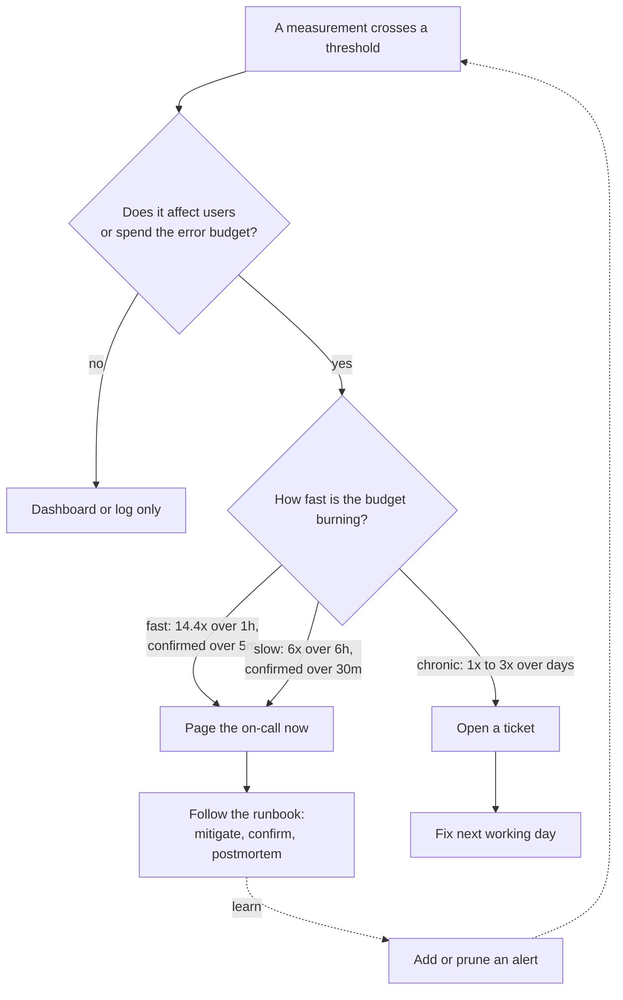

# AI SRE: Runbooks, Alerts, and On-Call

> **Interview answer (say this first).** SRE for AI means owning the service, not just deploying it. You alert on symptoms that affect users — error-budget burn rate, latency, task success, safety, and cost — not on every internal cause. Every alert has an owner and a runbook a tired engineer can follow at 3 a.m.: symptoms, first checks, mitigation, escalation, and rollback. Paging is a scarce resource, so page only for fast, user-visible harm and send everything else to a ticket. Run an explicit rotation with a written handoff, and turn every page into a blameless postmortem with tracked action items that make the alerts quieter and better.

## Why this exists

Two failures happen in almost every team that runs an AI service without SRE discipline.

The first is the **muted alert**. A rule called `ModelLatencyHigh` fired whenever the model server's p99 latency crossed three seconds. That happened most afternoons when traffic peaked, and nobody acted on it. After a few weeks the on-call engineer muted the alert in the interface and forgot to unmute it. A month later a provider had a partial outage. Latency doubled for fifty minutes, success rate fell, and users complained — but the only latency alert was muted, so no page fired. The team found out from a customer.

The second is the **runbook-less guess**. At 03:10 a cost alert paged the on-call engineer: spend rate was eight times the baseline. The alert had no runbook. The engineer opened four dashboards, could not tell whether the spike came from one tenant or from a retry loop, restarted the service to "clear it", and made things worse — the restart dropped in-flight work and the queue backed up. The fix took forty minutes of guessing; the real cause was a single tool call retrying without a cap, which a runbook would have named in its first line.

Neither failure was caused by a lack of skill. They happened because the team had no alert ownership, no runbooks, and no shared rule about what deserved a page. That is what this page teaches.

> **The one-sentence purpose.** AI SRE is the practice of owning a service end to end: alert on what users feel, give every alert an owner and a runbook, and keep on-call sustainable so the person woken at 3 a.m. can act instead of guess.

## Start from zero

Learn these words first. They are used loosely in conversation and precisely in interviews.

| Word | Plain meaning |
| --- | --- |
| **Service ownership** | One named team or person is accountable for a service's reliability, alerts, and runbooks. No orphan services. |
| **SLI** | Service Level Indicator: the number you measure, such as the fraction of requests that succeed. |
| **SLO** | Service Level Objective: the target for an SLI over a window, such as 99.9% success over 30 days. |
| **Error budget** | The failure an SLO allows, `(1 - target) × total events`. Failure you may spend on risk. |
| **Alert** | A rule that fires when a condition is true for long enough, then routes to a human. |
| **Symptom** | What the user feels: a slow answer, a wrong answer, a failed action. |
| **Cause** | The internal reason a symptom happens: a full queue, a slow provider, a bad prompt. |
| **Page** | An interruption now, usually out of hours, that expects a human to act. |
| **Ticket** | Work queued for the next working day; nobody is woken. |
| **Severity** | A label for how bad an alert is, which decides who is paged and how fast. |
| **Signal-to-noise ratio** | How many alerts are real and actionable compared with alerts that are noise. |
| **Alert fatigue** | The numbness that follows too many low-value alerts, so people mute or ignore them. |
| **Runbook** | A short operational document attached to an alert: symptoms, checks, mitigation, escalation, rollback. |
| **Playbook** | A broader document for a class of situations, containing or linking several runbooks. |
| **Escalation policy** | The written order in which people are contacted, and after how long. |
| **On-call rotation** | The schedule that decides who the primary responder is at any time. |
| **Handoff** | The structured transfer of open alerts and context when a rotation changes. |
| **Postmortem (blameless)** | A written review of an incident that names system causes, not people. |
| **Action item** | A specific fix from a postmortem with one owner and a date. |
| **Dependency map** | A diagram of what the service needs to work: providers, databases, queues, tools. |
| **Critical path** | The chain of dependencies a request must pass through to succeed; a failure anywhere on it is user-visible. |

Three distinctions matter most:

- **Symptom vs cause.** Users feel symptoms; engineers find causes. You alert on symptoms so the alert fires exactly when harm is happening, and you diagnose with causes.
- **Page vs ticket.** A page spends a human's sleep; a ticket spends their afternoon. Spend the sleep only when waiting until morning would make the harm much worse.
- **Runbook vs playbook.** A runbook is per-alert and short. A playbook covers a class of problems. Start with runbooks; they are what the on-call actually opens under pressure.

## The core idea

Think of a smoke detector. A good detector raises the alarm when there is smoke — a symptom — not every time someone cooks toast. The alarm must be rare enough that you always believe it, and loud enough that you always act. A sensor for every possible cause (heat, gas, dust, humidity) would cry wolf and get its battery pulled.

Alerting works the same way. **Alert on the symptoms users feel, and let the causes live on dashboards and in traces.** The pager is a scarce, expensive resource: every page costs a person's attention, and enough cheap pages cost you the real one.



The page decision is not "is there an error?" It is "is the error budget draining fast enough that waiting until morning would cost more than waking someone?" That is the burn rate.

**Paging on error-budget burn rate.** The error budget is the failure your SLO allows over a window. The **burn rate** is how fast you are spending it, relative to the sustainable rate: `burn_rate = observed_error_rate ÷ (1 - SLO)`. A burn of 1 exactly empties the budget at the end of the window. A burn of 14.4 empties a 30-day budget in about two days, so one hour at 14.4× costs about 2% of the whole window budget — that is worth a page. A steady burn of 1× costs about 10% over three days — that is a ticket, not a wake-up call. The thresholds are chosen from the percentage of budget spent per unit of time, so they mean the same thing for every service.

The table below is the routing rule to memorise:

| Signal | Alert? | Route to | What the runbook does |
| --- | --- | --- | --- |
| Provider error ratio is 20× the allowed rate for 1 hour | Page | Primary on-call | Fail over to the fallback model; confirm the success rate recovers |
| Provider error ratio is 6× the allowed rate for 6 hours | Page (slow burn) | Primary on-call | Check for a bad deploy or provider degradation; mitigate or ticket |
| Error ratio is 1.2× the allowed rate for 3 days | Ticket | Service team | Investigate the leak in normal hours; the budget still lasts weeks |
| p99 latency is 20% above target for a day | Ticket | Service team | Examine retrieval, batching, and provider latency; no wake-up needed |
| Cost per successful task is 5× baseline for 10 minutes | Page (safety) | On-call + budget owner | Trip the spend breaker; cap turns and tokens |
| Refusal rate rose 2 points in a day | Ticket | Quality owner | Sample outputs and check prompt and model versions |
| One tool call failed once | No alert | Dashboard and logs | Nothing; the request was retried successfully |
| Certificate expires in 14 days | Ticket | Platform team | Renew and verify; automate it next time |
| Disk is 80% full on a cache node | Ticket | Platform team | Expand the volume before it becomes user-visible |

The pattern is simple: **if a single request failing would page you, you will be paged constantly.** Page on a rate over a window, route by how fast that rate spends the budget, and involve a human only when the answer cannot wait until morning.

> **The mental model in one line.** A page is a promise that the problem is worth someone's sleep; a runbook is the promise that they will know what to do when they wake.

## How it works

Follow one service from "no alerting" to "owned and sustainable".

1. **Define the SLOs first.** An alert has nothing to measure against until you have written down what "healthy" means. Pick the user journey, define the SLI as a ratio or a threshold fraction, and set the target and window. For AI, include at least one quality SLI and one cost SLI, not only availability.
2. **Derive alerts from the burn rate, with fast and slow windows.** Do not invent a threshold from a feeling. Compute the burn rate from the SLO, and choose thresholds by how much budget they spend. Use two windows in each tier: a short one to detect quickly and a long one to confirm the burn is not a blip.
3. **Route by severity.** Label each alert `page` or `ticket`. Pages go to the on-call pager; tickets go to a work queue. Add `service`, `slo`, and `owner` labels so the alert is self-describing and routable.
4. **Write a runbook for every page.** A runbook has five parts: the symptoms you can see, the first checks to run, the mitigation to apply, the escalation path, and the rollback. If an alert can page, its annotations must link the runbook.
5. **Assign an owner to every service and every alert.** Ownership means one team is accountable for the SLO and for keeping the alert and runbook correct. A service without an owner produces alerts nobody tunes.
6. **Run a rotation with an explicit handoff.** Define primary and secondary, the escalation order, and the response time. At every rotation change, hand over open alerts, ongoing work, and anything recent that might flare up. A verbal "you are on now" is not a handoff.
7. **Hold a blameless postmortem after pages and incidents.** Review what happened, what made detection slow, and what would have caught it sooner. Blameless means the story names systems, not people, so nobody hides information.
8. **Track action items to completion.** Every postmortem produces specific, owned, dated fixes. A postmortem with no closed actions is a story. The best action item makes an alert quieter or a runbook shorter.
9. **Prune or fix noisy alerts every rotation.** Review the pages from the last period. Each one either led to an action (keep it) or it did not (fix the threshold, make it a ticket, or delete it). An alert nobody trusts is worse than no alert, because it teaches people to ignore the next one.

**What a runbook must contain, every time.** The five parts are non-negotiable because they answer the questions a person asks under stress: *What am I looking at? Where do I look first? What do I do? Who do I call? How do I undo it?* Keep it short, put the most likely fix first, and make every command copy-pasteable. A runbook is not documentation of how the system works; it is a script for a tired human.

A useful way to test a runbook without waiting for a real incident is a **game day**: pick an alert, simulate the failure in staging, and ask someone who did not write the runbook to follow it while you watch. If they get stuck, the runbook is wrong, not the person.

## The syntax you will use

These are real production forms. Read them once; the examples that follow use them.

**Recording rules: the burn-rate inputs.** Precompute the error ratio at each window so every alert and dashboard reads the same number. The ratio is `bad ÷ total`.

```yaml
# ai-slo-rules.yaml — recording rules, evaluated every 30s
groups:
  - name: ai-slo-inputs
    interval: 30s
    rules:
      - record: slo:error_ratio:5m
        expr: |
          sum(rate(ai_requests_total{outcome="bad"}[5m]))
          /
          sum(rate(ai_requests_total[5m]))
      - record: slo:error_ratio:30m
        expr: |
          sum(rate(ai_requests_total{outcome="bad"}[30m]))
          /
          sum(rate(ai_requests_total[30m]))
      - record: slo:error_ratio:1h
        expr: |
          sum(rate(ai_requests_total{outcome="bad"}[1h]))
          /
          sum(rate(ai_requests_total[1h]))
      - record: slo:error_ratio:6h
        expr: |
          sum(rate(ai_requests_total{outcome="bad"}[6h]))
          /
          sum(rate(ai_requests_total[6h]))
      - record: slo:error_ratio:3d
        expr: |
          sum(rate(ai_requests_total{outcome="bad"}[3d]))
          /
          sum(rate(ai_requests_total[3d]))
```

Each rule yields a fraction between 0 and 1. Dividing by the allowed error rate (`0.001` for a 99.9% target) turns it into a burn rate. Keeping the windows as shared recording rules means the alert and the dashboard cannot disagree.

**The multi-window burn-rate alert rule.** Two tiers page; the long window confirms the short one.

```yaml
# ai-slo-alerts.yaml — alerting rules
groups:
  - name: ai-slo-burn
    rules:
      # Fast burn: 14.4x over 1h, confirmed over 5m. About 2% of the 30d budget per hour.
      - alert: AIFastBurn
        expr: |
          (slo:error_ratio:1h / 0.001 > 14.4)
          and
          (slo:error_ratio:5m / 0.001 > 14.4)
        for: 2m
        labels:
          severity: page
          service: agent-api
          slo: availability
        annotations:
          summary: "agent-api is burning its 30d error budget fast (14.4x)"
          description: "Both the 1h and 5m windows exceed 14.4x; roughly 2% of the budget per hour."
          runbook_url: "https://runbooks.example.com/agent-api/fast-burn"

      # Slow burn: 6x over 6h, confirmed over 30m. About 5% of the 30d budget per 6h.
      - alert: AISlowBurn
        expr: |
          (slo:error_ratio:6h / 0.001 > 6)
          and
          (slo:error_ratio:30m / 0.001 > 6)
        for: 15m
        labels:
          severity: page
          service: agent-api
          slo: availability
        annotations:
          summary: "agent-api is burning its 30d error budget steadily (6x)"
          description: "Both the 6h and 30m windows exceed 6x; the budget lasts about five days at this rate."
          runbook_url: "https://runbooks.example.com/agent-api/slow-burn"

      # Chronic burn: 1x over 3d, confirmed over 6h. About 10% of the budget over three days.
      - alert: AIChronicBurn
        expr: |
          (slo:error_ratio:3d / 0.001 > 1)
          and
          (slo:error_ratio:6h / 0.001 > 1)
        for: 1h
        labels:
          severity: ticket
          service: agent-api
          slo: availability
        annotations:
          summary: "agent-api is slowly out of budget at steady traffic"
          description: "Both the 3d and 6h windows are above 1x; about 10% of the budget over three days."
          runbook_url: "https://runbooks.example.com/agent-api/chronic-burn"
```

The `and` is the important part. A five-minute spike clears the short window but not the long one, so it never wakes anyone. A slow leak clears both, so it pages once rather than never. The chronic tier never crosses the page thresholds, so it becomes a ticket for the next working day.

**Alertmanager routing and inhibition.** One alert, one route. Inhibition stops a ticket from being opened for a problem the page already covers.

```yaml
# alertmanager.yml
route:
  receiver: ticket-queue
  group_by: [alertname, service]
  group_wait: 30s
  group_interval: 5m
  repeat_interval: 4h
  routes:
    - matchers:
        - severity="page"
      receiver: pagerduty
      group_wait: 10s
      repeat_interval: 1h
      continue: false
    - matchers:
        - severity="ticket"
      receiver: jira
      repeat_interval: 24h

inhibit_rules:
  # A page for this service already covers the cause, so suppress the ticket.
  - source_matchers:
      - severity="page"
    target_matchers:
      - severity="ticket"
    equal: [service]
```

`matchers` uses the string form `label="value"`. Routes are checked in order and the first match wins unless `continue: true`. Inhibition stops one underlying problem from producing both a page and a ticket, or a parent alert and all of its children. The `receivers:` block (the page, ticket, and chat integrations) is omitted above for space; `amtool check-config` fails until every receiver named in `route` is defined.

**A runbook template.** Five parts, short, with a link from the alert annotation.

```markdown
## Runbook: AIFastBurn (service: agent-api)

**Owner:** Agent Platform team | **Severity:** page | **Last tested:** 2026-08-12

### Symptoms
- Success rate below the 99.9% SLO and falling.
- Users may see failed or retried AI requests.

### First checks (2 minutes)
1. `kubectl get pods -n agent-api` — are pods restarting?
2. Open the SLO dashboard; which `outcome="bad"` reason dominates?
3. `kubectl rollout history deploy/agent-api` — was there a deploy in the last hour?
4. Check the provider status page.

### Mitigation (first one that applies)
1. Provider errors → `kubectl set env deploy/agent-api MODEL_PROVIDER=fallback`
2. Bad deploy → `kubectl rollout undo deploy/agent-api`
3. One bad tool → `flagctl set agent.tools.web_search.enabled=false`
4. Unknown → page the secondary and declare an incident.

### Confirm
- Success rate back above target and burn below 1x for 10 minutes.

### Escalate
- 15 minutes with no improvement: page the secondary.
- 30 minutes: page the engineering manager and open a SEV2.

### Rollback
- Invert the mitigation with the same command; the flag tool records the change.
```

**A small check command.** Validate the rules and the routing before you commit, so a broken rule never reaches production.

```bash
# Syntax and semantics of the alert rules.
promtool check rules deploy/prometheus/ai-slo-alerts.yaml

# Routing and inhibition configuration.
amtool check-config deploy/alertmanager/alertmanager.yml

# Send a synthetic alert through the real route without a real incident.
amtool alert add alertname=AIFastBurn severity=page service=agent-api \
  --alertmanager.url=http://localhost:9093
```

`promtool` and `amtool` are the standard command-line tools for Prometheus and Alertmanager. Run them in CI so a malformed rule or route fails the build.

## Examples: simple to real

**Example 1 — a noisy cause-based alert versus an actionable symptom-based one.** This is the difference that removes most alert fatigue.

```yaml
# Cause-based: fires on the model server's internal queue depth.
- alert: ModelQueueDeep
  expr: model_queue_depth > 5
  for: 1m
  labels:
    severity: page
  annotations:
    summary: "Model queue is deeper than 5"
```

This fired forty times a week. The queue often crosses five during an ordinary traffic peak, and by the time a human looked it had drained. Nothing bad happened, so people stopped reading it. A cause-based alert fires whenever an internal component is uncomfortable, which is most of the time.

```yaml
# Symptom-based: fires only when the budget is draining fast.
- alert: AIFastBurn
  expr: |
    (slo:error_ratio:1h / 0.001 > 14.4)
    and
    (slo:error_ratio:5m / 0.001 > 14.4)
  for: 2m
  labels:
    severity: page
  annotations:
    summary: "agent-api is burning its error budget fast"
```

This fires when users are actually being harmed and the harm is fast enough to matter. A deep queue that drains itself never pages, because the success-rate SLI never moves. **One symptom alert replaces a dozen cause alerts, and it is true exactly when a human needs to act.**

**Example 2 — fast and slow windows in one policy.** The tiers below page on severe outages and on chronic ones, and send the long, slow leak to a ticket.

| Tier | Long window | Short window | Burn threshold | Budget spent | Severity |
| --- | --- | --- | --- | --- | --- |
| Fast | 1h | 5m | 14.4× | ~2% per hour | page |
| Slow | 6h | 30m | 6× | ~5% per 6 hours | page |
| Chronic | 3d | 6h | 1× | ~10% per 3 days | ticket |

```python
def route(burn_1h, burn_5m, burn_6h, burn_30m, burn_3d):
    if burn_1h > 14.4 and burn_5m > 14.4:
        return "page"      # fast: about 2% of the budget per hour
    if burn_6h > 6 and burn_30m > 6:
        return "page"      # slow: about 5% of the budget per 6 hours
    if burn_3d > 1 and burn_6h > 1:
        return "ticket"    # chronic: about 10% of the budget over 3 days
    return "no alert"

print(route(20.0, 20.0, 8.0, 8.0, 2.0))   # page   (fast outage)
print(route(2.0, 2.0, 8.0, 8.0, 2.0))     # page   (slow burn confirmed)
print(route(2.0, 2.0, 2.0, 2.0, 1.5))     # ticket (chronic leak)
print(route(2.0, 20.0, 2.0, 2.0, 0.5))    # no alert (5m blip only)
```

The short window catches the burn quickly; the long window proves it is not a blip. Requiring both is what lets you page fast without paging often. Note that the chronic tier is a ticket: at 1.5× the budget lasts weeks, and waking someone buys almost nothing.

**Example 3 — a runbook an on-call engineer can follow at 3 a.m.** A good runbook assumes the reader is tired, does not know the system deeply, and has two minutes to orient.

```markdown
## Runbook: AISlowBurn (service: agent-api)

**Owner:** Agent Platform team | **Severity:** page

### Symptoms
- Success rate has been below the SLO for hours, not minutes.
- No single deploy stands out; the failures are spread over time.

### First checks (2 minutes)
1. Open the SLO dashboard and read the `outcome="bad"` breakdown.
2. `kubectl get events -n agent-api --sort-by=.lastTimestamp | tail -20`
3. Check provider status and the last model or prompt change.

### Mitigation
1. If one `outcome` dominates and started after a deploy → `kubectl rollout undo deploy/agent-api`.
2. If errors cluster on one tool → disable it: `flagctl set agent.tools.web_search.enabled=false`.
3. If the provider is degraded → `kubectl set env deploy/agent-api MODEL_PROVIDER=fallback`.

### Confirm
- Burn below 1x for 30 minutes before you close.

### Escalate
- 30 minutes with no improvement: page the secondary and declare a SEV2.

### Rollback
- Invert the command; flags and environment changes are versioned and reversible.
```

Why it works at 3 a.m.:

- **Symptoms first**, so the reader knows what "bad" looks like before touching anything.
- **Numbered checks**, each one command, so there is no decision about where to start.
- **Mitigation ordered most-likely-first**, so the common case needs no thought.
- **A confirmation step**, so a mitigation that did not work is not mistaken for a fix.
- **Escalation with a clock**, so the responder knows when asking for help is correct rather than weak.
- **Rollback**, so every action can be undone.

**Example 4 — an alert that should be a ticket, not a page.** Pages are for harm that grows if you wait. This one does not grow.

```yaml
- alert: AICertificateExpiringSoon
  expr: (probe_ssl_earliest_cert_expiry - time()) / 86400 < 14   # Blackbox exporter
  for: 1h
  labels:
    severity: ticket
  annotations:
    summary: "TLS certificate for {{ $labels.instance }} expires in under 14 days"
    runbook_url: "https://runbooks.example.com/platform/renew-tls"
```

If this alert paged, it would wake someone at 3 a.m. for a certificate that still has two weeks of life. The work is real, but it does not grow between midnight and 9 a.m., so it belongs in a ticket queue. The same logic moves "error budget is 80% spent" to a ticket, and keeps "we are burning the budget 14× an hour" as a page. **The test is not "is this important?" but "does waiting until morning make it much worse?"**

**Example 5 — an AI-specific case: latency rises while success stays inside budget.** Availability is green, so an availability-only alert is silent, but users are waiting longer and the latency SLI is quietly draining.

```yaml
# The latency SLI counts the fraction of requests under 2s; the SLO is 99%.
# The allowed error rate is 1% (0.01). Rising provider latency burns it slowly.
# The latency_error_ratio recording rules are built the same way as the error rules.
- alert: AILatencySlowBurn
  expr: |
    (slo:latency_error_ratio:6h / 0.01 > 3)
    and
    (slo:latency_error_ratio:30m / 0.01 > 3)
  for: 15m
  labels:
    severity: ticket
    service: agent-api
    slo: latency_under_2s
  annotations:
    summary: "More than 1% of requests are over 2s and the latency budget is draining"
    runbook_url: "https://runbooks.example.com/agent-api/latency-burn"
```

A provider's latency crept up by 40%, so more requests crossed the two-second line. Every request still succeeded, so the availability SLO stayed green — but the latency SLO was burning at 3×, which is a ticket. The runbook checks whether the retrieval step or the provider is responsible, and whether warming the fallback provider is cheaper than waiting. **For AI, quality, latency, and cost signals move independently of one another, so a green availability number is not a green service.** When latency and error rate rise together, the fast-burn page usually fires first; when only latency rises, the slow-burn ticket catches a problem the error-rate page would miss.

## In production

- **Page on user-visible symptoms, not internal causes.** A pager that fires on queue depth, CPU, or a single failed call will be muted. Page on success rate, latency, safety, and cost — the things a user or customer would notice.
- **Every alert needs an owner and a runbook.** An alert with no owner is nobody's job; an alert with no runbook is a puzzle at 3 a.m. Put the runbook link in the alert's annotations so it is one click away.
- **Alert fatigue is an outage waiting to happen.** Every false page trains people to ignore the next one. Treat a noisy alert as a defect and fix it in the current rotation, not "later".
- **Burn-rate windows catch both fast and slow failures.** A single threshold either pages on blips or misses a slow leak. Pair a short and a long window, and let the slow tier become a ticket.
- **Separate page from ticket.** A page spends someone's sleep; a ticket spends their afternoon. If waiting until morning does not make the harm much worse, it is a ticket.
- **AI quality is a signal too.** Monitor drift, refusal rate, task success, safety-rule violations, and cost per request. These can decay with no error code and no red dashboard, which is exactly why they need alerts.
- **Map your dependencies, and alert on the critical path.** You cannot mitigate a provider outage if nobody wrote down that the provider is a dependency. The dependency map tells you what to fail over to and who to escalate to.
- **Test your runbooks and your alerts.** Run a game day: simulate the failure, have someone follow the runbook, and fix what confuses them. Unit-test the rules with `promtool test rules` so a threshold change cannot silently break the logic.
- **Postmortems are blameless and produce tracked actions.** Name systems, not people, so information flows. Then give every action item one owner and a date, and close them; a postmortem with no closed actions changes nothing.
- **Rotate and hand off explicitly.** Define primary and secondary, a written escalation policy, and a handoff at every change: open alerts, ongoing work, and anything likely to flare. A healthy rotation has time to sleep and time to do the reliability work it keeps discovering.
- **Measure alert precision, not alert count.** Track the fraction of pages that led to a real action. Above roughly half is a working system; below that, you are training people to ignore the pager. Fewer, better alerts beat more coverage.
- **Escalate on time, before you are stuck.** Escalating is not failing. A written policy that says "page the secondary after 15 minutes" makes asking for help the default instead of a judgement call under stress.

## Interview questions

### 1. Should you alert on symptoms or causes? Why?

**Answer.** Alert on symptoms: the things users feel, such as a failing request, a slow answer, a wrong answer, or a rising cost. Symptoms are what the SLO measures, and they fire exactly when a human needs to act. Causes — queue depth, cache hit rate, one provider's error count — belong on dashboards and traces, because they are often true while users are fine. You diagnose with causes; you alert on symptoms.

**Follow-up: "Is there any cause you would page on?"** Yes, when the cause is a leading indicator with a known, short lead time to harm — for example, a certificate expiring in an hour, or a dependency that is known to fail hard. Even then, prefer to page on the symptom it will produce, and use the cause only if it buys useful warning.

**Trap.** Alerting on every internal metric you happen to have. That produces many alerts, most of them false, and teaches the team to ignore the pager.

### 2. Explain multi-window, multi-burn-rate alerting.

**Answer.** You alert on how fast the error budget is draining, not on the raw error rate. The burn rate is the observed error rate divided by the allowed error rate, `error_rate / (1 - SLO)`. You use pairs of windows: a short window detects quickly and a long window confirms the burn is sustained, and both must exceed the threshold for the alert to fire. A fast tier (14.4× over 1h, confirmed over 5m) pages on severe outages; a slower tier (6× over 6h, confirmed over 30m) pages on steady leaks; a chronic tier (1× over 3d, confirmed over 6h) opens a ticket. The thresholds come from the percentage of the budget they spend per hour or day.

**Follow-up: "Why require the long window at all?"** To filter noise. A five-minute spike clears the short window but not the long one, so a transient blip does not wake anyone. The long window costs a little detection latency in exchange for far fewer false pages.

**Trap.** Using a single window. Set the threshold high and you miss slow leaks; set it low and you page on every blip. The pair is what gives speed without crying wolf.

### 3. What makes a runbook usable at 3 a.m.?

**Answer.** Five parts, in a fixed order: symptoms, first checks, mitigation, escalation, and rollback. Make each check a single copy-pasteable command, put the most likely mitigation first, and include a confirmation step so a non-fix is not mistaken for a fix. Keep it short, link it from the alert annotation, and test it in a game day with someone who did not write it.

**Follow-up: "What is the difference between a runbook and a playbook?"** A runbook is attached to one alert and is short and specific. A playbook covers a class of situations, such as "provider outage", and links the relevant runbooks together. Start with runbooks, because they are what the on-call opens under pressure.

**Trap.** Writing a runbook that explains the architecture instead of the actions. The reader does not need a design document at 3 a.m.; they need the next command.

### 4. How do you decide between a page and a ticket?

**Answer.** Ask whether waiting until morning makes the harm much worse. If the budget is draining fast, users are actively failing, or safety or money is at risk, page. If the problem is real but stable — a certificate with two weeks left, an error budget that is 80% spent, a slow quality drift — open a ticket. Severity labels make the routing explicit, and Alertmanager sends `page` to the pager and `ticket` to the work queue.

**Follow-up: "How do you set severity from impact?"** From blast radius and harm type: unsafe output, data loss, or a large fraction of users affected is the top severity; a smaller fraction or a high cost rate is the next; a single user or a slow trend is lower. Encode the thresholds so two engineers classify the same event the same way.

**Trap.** Paging because something is technically broken rather than because users are harmed. A broken internal component with a working fallback is a ticket, not a wake-up call.

### 5. What is alert fatigue, and how do you measure and fix it?

**Answer.** Alert fatigue is the numbness that comes from too many low-value alerts, so people mute, ignore, or batch-acknowledge them and miss the real one. Measure it with alert precision: the fraction of pages that led to a real action, plus the number of pages per on-call shift and how often alerts are muted. Fix it by deleting or retuning noisy alerts, converting causes to tickets, raising thresholds, and adding inhibition so one problem produces one notification.

**Follow-up: "What precision should you target?"** Aim for most pages to be actionable; a common working target is more than half of pages leading to an action. If it is much lower, the pager is a notification stream, not an alarm. Track the trend over rotations, not a single week.

**Trap.** Treating "more alerts" as "more coverage". Coverage comes from the SLOs and the dependency map; an alert is worth keeping only if a human acts on it.

### 6. How do you keep an on-call rotation sustainable?

**Answer.** Use a defined rotation with a primary and a secondary, a written escalation policy with time limits, and an explicit handoff at every changeover covering open alerts, in-flight work, and anything likely to flare. Keep the pager load low through good alerting, give people time to do the reliability work they discover, and rotate so the same person is not always woken. Sustainability is a requirement, not a luxury: exhausted responders make worse decisions and leave.

**Follow-up: "What belongs in a handoff?"** Open and recently fired alerts, ongoing mitigations and their owners, upcoming risky changes such as deploys or model updates, and any alert that is currently flaky. The handoff is a short written note plus a conversation — not a ticket reassignment.

**Trap.** Relying on a hero who always answers. Heroics hide a broken alerting system and burn out the one person holding it together.

### 7. Which AI-specific signals should you alert on?

**Answer.** Alongside the usual availability and latency, alert on task success rate, unsafe-output rate, refusal rate, drift in input or output distributions, and cost per successful task or per request. Quality and cost can move with no error code, so they need their own SLIs and burn-rate alerts. Judge quality on a sample with a versioned evaluator, and treat a fast quality burn like any other fast burn: page. A slow drift is a ticket.

**Follow-up: "How do you alert on quality without a hard threshold?"** Compare the current window with a baseline using the same ratio machinery as availability, and use statistical tests for small samples so you do not page on variance. Set the SLO on the fraction of good outcomes and alert on its burn rate, exactly as you would for availability.

**Trap.** Monitoring only errors and latency. A model that returns 200 with worse answers, or a retry loop that doubles cost, is invisible to both — and is a real incident.

### 8. How do you turn a postmortem into fewer, better alerts?

**Answer.** Write the postmortem blamelessly, focused on system causes, and ask two alerting questions: what signal existed before the incident, and why did no alert fire on it — or why did an alert fire that nobody trusted? Then create owned, dated action items. Good actions usually do one of three things: add a symptom alert that would have caught it sooner, delete or retune a noisy alert, or shorten and correct a runbook. Close the action items, and verify the new alert actually fires in a game day.

**Follow-up: "How do dependencies fit in?"** Many incidents are a dependency failing on your critical path. Keep a dependency map and use it to decide what to fail over to, what to alert on, and who to escalate to. If a dependency is on the critical path, its failure is your symptom.

**Trap.** Writing a postmortem that ends with "be more careful", or action items that are never closed. If nothing changes in the alerting or the runbooks, the same page will wake someone again.

## Remember this

- **Alert on symptoms users feel, not on every internal cause.** One good SLO burn-rate alert replaces a dozen noisy cause alerts.
- **Burn rate decides urgency.** Page for fast and sustained burns; send the chronic leak to a ticket. Pair a short and a long window so you are fast without crying wolf.
- **Every page needs an owner and a runbook** with symptoms, checks, mitigation, escalation, and rollback — tested with someone who did not write it.
- **On-call must be sustainable.** Rotate with an explicit handoff and a written escalation policy, and measure alert precision so the pager stays trustworthy.
- **Blameless postmortems produce tracked actions** that add, fix, or delete alerts; dependencies on the critical path are part of the service you own.
