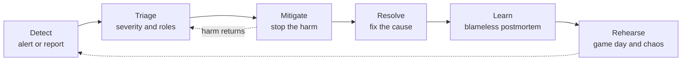
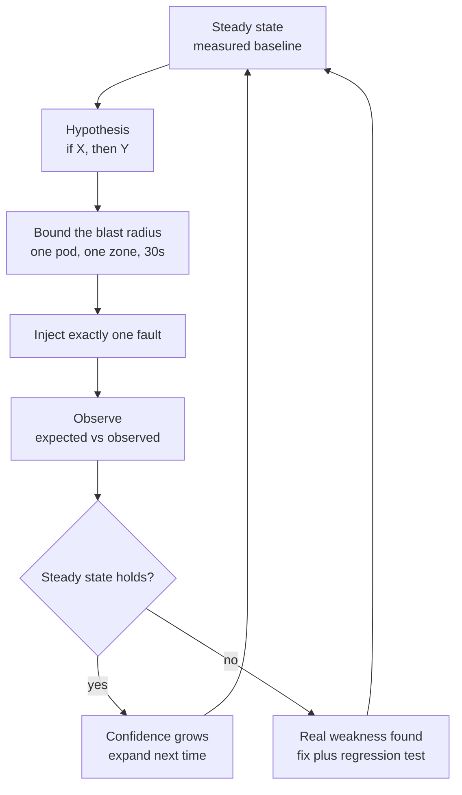

# Load, Chaos, and Incident Drills

> **Interview answer (say this first).** Reliability is a skill you rehearse, not a hope you hold. A **load test** finds the knee where latency explodes before your users find it for you. A **chaos experiment** injects one failure with a bounded **blast radius** to test a written hypothesis about a fallback. A **game day** runs a whole incident on purpose, with the real roles, the real runbook, and the real dashboards. When the real thing happens, you run the loop you already practised: detect, triage, mitigate, resolve, learn. One **incident commander** coordinates and does not debug, a **communications lead** posts on a fixed cadence, and a **scribe** writes the timeline live. A blameless postmortem turns each failure into owned action items and a regression test, so the same incident cannot happen twice.

## Why this exists

A payments team shipped an agent service with a rollback runbook they had never executed. The runbook said "revert the prompt flag and redeploy the previous image". It had been written by the person who built the deploy pipeline, reviewed by two people, and stored in the wiki. Everyone agreed it was correct.

The first real incident arrived at 02:10 on a Saturday. A prompt change pushed hallucination rate from 2% to 9%. The on-call engineer opened the runbook and found three problems at once:

- The flag in the runbook had been renamed two months earlier; `agent.prompt_v42.enabled` was now `agent.prompt.enabled`.
- The "previous image" was addressed by the mutable tag `latest`, which now pointed at the bad release. There was no digest to roll back to.
- The rollback script needed a credential that only the platform team held, and they were asleep.

Detection took 22 minutes because the quality alert threshold was set at 15%, too high to fire at 9%, so a human noticed. The rollback took 40 minutes of trial and error. Users were served wrong answers for 62 minutes, and the error budget for the month was gone before lunch.

None of the fixes were clever: rename the flag, deploy by digest, give on-call the credential, lower the alert threshold. The expensive part was not knowing. **The team's first test of the rollback was a real incident, and it did not work.**

That is the gap this page closes. You would not release code without running it once. Reliability deserves the same treatment: run the load test, inject the fault, practise the rollback, and rehearse the incident before it counts.

```text
What rehearsal buys you

Detection    22 min  ->   2 min     (thresholds tuned by a game day)
Mitigation   40 min  ->   5 min     (runbook executed until it was boring)
User impact  62 min  ->   7 min     (MTTD + MTTM)
```

## Start from zero

Learn these words first. They are used loosely in conversation and precisely in interviews.

| Word | Plain meaning |
| --- | --- |
| **Load test** | Send expected production traffic and measure latency and errors at that level. |
| **Stress test** | Push past the expected level until the system breaks, to find the limit. |
| **Soak test** | Run a normal load for hours or days to find leaks, drift, and slow decay. |
| **Knee point** | The load level where latency stops rising gently and starts rising steeply. |
| **Chaos experiment** | A controlled test that injects a real fault to test a written hypothesis. |
| **Fault injection** | The mechanism that creates the failure: kill a pod, delay a network call, fill a disk. |
| **Steady state** | The measurable definition of "healthy" that the experiment must not break. |
| **Hypothesis** | A falsifiable prediction, such as "if one worker dies, p95 stays under 1.5 s". |
| **Blast radius** | How much of the system a fault or a bad change can affect. |
| **Game day** | A scheduled rehearsal of an incident with real roles, runbook, and timers. |
| **Tabletop exercise** | A discussion-only rehearsal: talk through an incident without touching systems. |
| **Incident** | Any unplanned event that harms users, data, money, or trust. |
| **Severity** | A label for how bad an incident is, such as SEV1 (worst) to SEV4 (minor). |
| **Incident commander (IC)** | The person who runs the response and makes decisions. Does not debug. |
| **Communications lead** | The person who writes status updates and talks to stakeholders. |
| **Scribe** | The person who records the timeline, decisions, and actions as they happen. |
| **Subject-matter expert (SME)** | The person who knows the failing component and does the technical work. |
| **Timeline** | A timestamped list of what happened, written during the incident, not after. |
| **Mitigation** | Stopping the harm now, before you understand the cause. |
| **Fix (resolution)** | Repairing the underlying cause so it cannot happen again. |
| **Rollback** | Returning to the previous known-good version of code, prompt, or model. |
| **Runbook** | A written, tested procedure for one specific failure. |
| **Postmortem** | A written review of the incident: impact, timeline, cause, and actions. |
| **Action item** | A specific fix with one owner and one date. |
| **MTTD** | Mean time to detect: from impact starting to someone noticing. |
| **MTTR** | Mean time to restore: from impact starting to the harm stopping. |
| **MTTM** | Mean time to mitigate: from noticing to the harm stopping, so MTTR = MTTD + MTTM. |

Four distinctions do most of the work:

- **Load vs stress vs soak.** Load proves you cope with today's traffic. Stress finds the limit. Soak finds the leak that only shows up after six hours.
- **Mitigation vs fix.** Mitigation stops the bleeding with a reversible action. The fix removes the cause. You almost always mitigate first.
- **Chaos experiment vs fault injection.** Fault injection is a mechanism, like `kill -9`. A chaos experiment wraps that mechanism in a steady state, a hypothesis, and a bounded blast radius, so it produces knowledge instead of damage.
- **Game day vs chaos experiment.** A chaos experiment tests the system. A game day tests the humans: who declares, who commands, who communicates, and whether the runbook is still true.

> **The one-sentence purpose.** Drills move the discovery of a weakness from 02:10 on a Saturday to 14:00 on a Tuesday, when you are awake, staffed, and watching.

## The core idea

Think of a flight simulator and a fire drill.

A pilot does not learn engine failure for the first time in the air. The simulator injects the failure, and the crew practises the checklist until it is automatic. A fire drill does the same for a building: alarms sound, wardens count heads, and the escape route is walked once a quarter. Nobody expects the building to burn that afternoon. The drill is the point.

Incident response is the same discipline, and it is a loop because every rehearsal and every real incident feeds the next one:



**Mitigate first** is the rule that newcomers find hardest. Every minute spent diagnosing is a minute users are harmed. The cause can be found later, in the calm, with the data you captured. So your first move is the smallest reversible action that stops the harm:

| Lever | Example | Time to apply | Reversible? |
| --- | --- | --- | --- |
| **Feature flag flip** | Disable the web-search tool | Seconds | Yes |
| **Rollback** | Redeploy the previous image digest | Under a minute | Yes |
| **Scale out** | Add replicas to absorb a queue | Minutes | Yes |
| **Degrade gracefully** | Serve the cheaper fallback model | Seconds | Yes |
| **Kill switch** | Stop all in-flight agent runs | Seconds | Yes |
| **Fix forward** | Ship a corrected prompt | Minutes to hours | No |

The roles matter as much as the levers. One person cannot coordinate, debug, write the timeline, and talk to stakeholders at the same time. Name the roles early, even on a small incident.

| Role | Owns | Must not do |
| --- | --- | --- |
| **Incident commander** | Decisions, severity, role assignment, declaring resolved | Debug or type commands |
| **Communications lead** | One channel, status updates, stakeholder questions | Speculate publicly |
| **Scribe** | Live timeline, decisions, action items, links to evidence | Fix anything |
| **Subject-matter expert** | Diagnosis and the actual technical fix | Coordinate the response |
| **Operations lead** | Executing mitigations, such as the rollback | Decide severity alone |

On a small team one person may hold two roles. The IC role is the one to keep separate, because the moment the commander starts reading logs, coordination stops.

> **The mental model in one line.** Rehearse the loop with a controlled fault so that the real incident is the second time you have done it, not the first.

## How it works

Follow one rehearsal from a written hypothesis to a permanent regression test.

1. **Define steady state.** Write down what "healthy" means as numbers before you touch anything: p95 under 1.5 s, error rate under 1%, queue depth under 200, cost per task under four cents. Without a baseline, "it still works" is an opinion.
2. **Write a falsifiable hypothesis.** A good one names the fault, the expected outcome, and the boundary. "If we kill one of four workers, the remaining three absorb the traffic and p95 stays under 1.5 s." Do not run an experiment you cannot fail.
3. **Bound the blast radius.** Start in staging. If you must test production, choose one pod, one zone, one tenant, or one short window, and state the limit in advance. Never inject two faults at once in the first run.
4. **Inject exactly one fault.** Kill a pod, add a two-second network delay, fill a disk, expire a credential, or make the provider return 503. One fault, one lesson.
5. **Observe and record expected vs observed.** Compare the live steady-state probe to the baseline. Write the result down even when the answer is boring. A hypothesis that held is evidence, and evidence accumulates.
6. **Detect.** The signal must reach a human through an alert, not a dashboard nobody is watching. If the experiment failed at 14:00, the alert should have fired. If it did not, the drill found a detection gap, which is a real finding.
7. **Triage by severity.** Estimate the blast radius: how many users, how much money, whether data or safety is at risk. Assign SEV1 to SEV4 from the impact, using a written rule, not a feeling.
8. **Assign roles.** Name an incident commander, a communications lead, a scribe, and the relevant subject-matter experts. Announce the roles in the channel so nobody guesses.
9. **Mitigate before you diagnose.** Pick a lever from the table above: rollback, feature flag, scale out, or degrade. Choose the most reversible action available. Say out loud what you expect the mitigation to do, then watch the metric.
10. **Communicate on a fixed cadence.** Post a status update every 15 to 30 minutes for a severe incident, even when the update is "still investigating, next update in 15 minutes". The cadence is the contract with users and with management.
11. **Resolve and close.** Once users are safe, fix the cause. Restore normal configuration, cancel the war room, and record the end time. Then measure MTTD and MTTR from the timestamps the scribe captured.
12. **Write a blameless postmortem.** Within a few days, while memory is fresh: impact, timeline, root cause, what helped, what hurt, and owned actions. Point at systems and conditions, never at people.
13. **Turn the failure into a regression test.** Capture the exact input, prompt version, model version, and trace, and add a test that fails if the failure returns. Wire it into CI. A postmortem a computer enforces is worth ten that only a human reads.

A chaos experiment is just this loop, repeated on a schedule:



The clocks are what you improve, and they come from timestamps you record as you go:

```text
MTTD = detected  - started     # how long until we noticed
MTTM = mitigated - detected    # how long to stop the harm
MTTR = mitigated - started     # total user impact
```

A team that cuts MTTD from 22 minutes to 2 has bought more reliability than a team that ships a hundred small fixes. Detection and mitigation are the levers a drill can actually train.

## The syntax you will use

These are real production forms. Read them once; later chapters explain each.

**A k6 load test with stages and thresholds.** k6 is a load-testing tool that runs JavaScript scenarios. `ramping-arrival-rate` controls the arrival rate directly, which is what you want when finding a knee: you hold a request rate and watch latency.

```javascript
import http from 'k6/http';
import { check } from 'k6';

export const options = {
  scenarios: {
    ramp: {
      executor: 'ramping-arrival-rate',
      startRate: 5,
      timeUnit: '1s',
      preAllocatedVUs: 50,
      maxVUs: 400,
      stages: [
        { target: 5, duration: '1m' },     // warm up
        { target: 50, duration: '5m' },    // expected peak
        { target: 150, duration: '5m' },   // push towards the knee
        { target: 150, duration: '2m' },   // hold the peak
      ],
    },
  },
  thresholds: {
    http_req_failed: ['rate<0.01'],       // under 1% errors
    http_req_duration: ['p(95)<1500'],    // p95 under 1.5 seconds
  },
};

export default function () {
  const res = http.post(
    'https://api.example.com/v1/answer',
    JSON.stringify({ question: 'What is the refund policy?' }),
    { headers: { 'Content-Type': 'application/json' } },
  );
  check(res, { 'status is 200': (r) => r.status === 200 });
}
```

Run it with `k6 run load.js`. A breached threshold makes k6 exit non-zero, so the same script can gate a pipeline. `preAllocatedVUs` is the pool of virtual users reserved up front; `maxVUs` is the ceiling it may grow to.

**A chaos experiment that kills one pod.** Chaos Mesh is a Kubernetes fault-injection tool. A `PodChaos` with `action: pod-kill` treats one pod as if it crashed.

```yaml
apiVersion: chaos-mesh.org/v1alpha1
kind: PodChaos
metadata:
  name: kill-one-worker
  namespace: agents
spec:
  action: pod-kill          # simulate a crash, not a graceful shutdown
  mode: one                 # exactly one pod: bounded blast radius
  selector:
    namespaces: [agents]
    labelSelectors:
      app: worker
  gracePeriod: 0            # no time to finish in-flight work
```

`mode: one` is the blast-radius dial. `mode: all` would kill every worker at once, which is a different, far more dangerous experiment.

**A chaos experiment that delays a dependency.** Latency is the fault teams forget. A `NetworkChaos` delay proves whether a timeout, a retry, and a fallback behave as designed.

```yaml
apiVersion: chaos-mesh.org/v1alpha1
kind: NetworkChaos
metadata:
  name: delay-provider
  namespace: agents
spec:
  action: delay
  mode: one
  duration: "5m"
  selector:
    namespaces: [agents]
    labelSelectors: { app: llm-gateway }
  direction: to
  target:
    mode: all
    selector:
      namespaces: [agents]
      labelSelectors: { app: provider-proxy }
  delay:
    latency: "2s"
    jitter: "500ms"
    correlation: "100"
```

A delay of two seconds against a client timeout of one second is how you discover that your fallback never triggers, because the client gives up before the fallback is consulted.

**The kill switch for chaos itself.** A rehearsal that cannot be stopped is an outage you caused on purpose. Chaos Mesh pauses an experiment when you annotate it.

```bash
# Pause everything in this experiment, immediately.
kubectl annotate podchaos kill-one-worker experiment.chaos-mesh.org/pause="true"

# Resume when you are ready.
kubectl annotate podchaos kill-one-worker experiment.chaos-mesh.org/pause-
```

Write the pause command into the game-day plan, and make sure two people know how to run it.

**An incident severity table.** Thresholds are policy, not physics. Write them down so the on-call engineer applies them consistently at 03:00.

| Severity | Impact | Response | Update cadence | Example |
| --- | --- | --- | --- | --- |
| **SEV1** | Widespread harm, data loss, or unsafe output | Page all roles; IC declares | Every 15 min | Wrong medical advice to 40% of users |
| **SEV2** | Large degradation or a fast cost burn | Page on-call and IC | Every 30 min | Provider outage, no fallback |
| **SEV3** | Small subset affected; a workaround exists | Ticket, handle in hours | Daily | One tenant sees slow retrieval |
| **SEV4** | Cosmetic or internal-only | Backlog | None | Dashboard label is wrong |

**A postmortem template.** Blameless means the story points at systems and conditions, not at named people. It does not mean the actions are vague.

```markdown
# Incident 2026-09-14: prompt regression on the support agent

## Impact
9% of answers were ungrounded for 62 minutes; 3,100 sessions affected.
The 30-day quality error budget was exhausted.

## Timeline (written live by the scribe)
02:10 prompt v42 deployed
02:32 a human noticed the bad answers (the 15% quality-alert threshold was too high to fire at 9%)
02:35 incident declared, SEV2, IC and comms assigned
03:12 prompt reverted to v41, the correct flag name found the hard way
03:12 quality back to baseline, resolved
03:40 incident closed

## Root cause
v42 removed the instruction to answer only from retrieved context.

## What helped / what hurt
Helped: the revert was reversible and cheap.
Hurt: the alert threshold, the renamed flag, and a mutable image tag.

## Action items (owner, date)
- [ ] Lower the quality alert to 6% — Ana, Sep 18
- [ ] Deploy by digest and keep the last three digests — Ravi, Sep 18
- [ ] Add the renamed flag to the runbook and test it in a game day — Sam, Sep 25
```

Every action item has one owner and one date. An action with no owner is a wish.

## Examples: simple to real

**Example 1 — find the knee before production does.** Queueing theory says latency rises gently at low load and explodes as load approaches capacity. Model that curve, then choose a safe target with headroom.

```python
def p95_ms(rate, capacity, base_ms=100.0):
    # Simplified queueing model: latency = base / (1 - utilisation).
    rho = min(rate / capacity, 0.999)
    return base_ms / (1.0 - rho)

CAPACITY = 100.0        # requests per second the pool can serve
BUDGET_MS = 800.0       # the p95 we promised in the SLO

safe = 0
for rate in (50, 80, 90, 95, 98, 99):
    p95 = p95_ms(rate, CAPACITY)
    if p95 <= BUDGET_MS:
        safe = rate
    print(f"{rate:>3} rps -> p95 {p95:8.1f} ms")

print("largest rate inside the budget:", safe)

#  50 rps -> p95    200.0 ms
#  80 rps -> p95    500.0 ms
#  90 rps -> p95   1000.0 ms
#  95 rps -> p95   2000.0 ms
#  98 rps -> p95   5000.0 ms
#  99 rps -> p95  10000.0 ms
# largest rate inside the budget: 80
```

At 50 rps the system looks comfortable. Between 80 and 90 rps it crosses the budget, and by 99 rps latency is fifty times worse. **The knee is where the curve bends up.** You find it with a stress test, and you set your alert and your autoscaling just below it — not at the level where it looks fast today.

**Example 2 — kill a worker and compare expected with observed.** The hypothesis is written first. The result is recorded, pass or fail.

```python
def steady_state(sample):
    return {
        "p95_ok": sample["p95_ms"] < 1500,
        "errors_ok": sample["error_rate"] < 0.01,
        "queue_ok": sample["queue_depth"] < 200,
    }

hypothesis = "killing 1 of 4 workers: p95 stays under 1.5s and no errors"

observed = {"p95_ms": 2400, "error_rate": 0.00, "queue_depth": 180}
result = steady_state(observed)
print("expected: all True")
print("observed:", result)
print("hypothesis held:", all(result.values()))

# expected: all True
# observed: {'p95_ok': False, 'errors_ok': True, 'queue_ok': True}
# hypothesis held: False
```

The system survived — no errors, the queue drained — but p95 more than doubled. **A partial pass is still a finding.** The retry budget was fine; the capacity headroom was not. The fix is a queue-depth alert at 150 and one more worker, and the next run proves it.

**Example 3 — the rollback is the mitigation.** During an incident you rarely fix the cause. You revert, and you verify. Write it as a runbook with a check.

```bash
#!/usr/bin/env bash
# runbook: rollback-agent.sh
set -euo pipefail

APP="ghcr.io/acme/agent-api"
PREVIOUS_DIGEST="$(cat deploy/last-good-digest)"   # written by the deploy pipeline, not a literal

echo "1. capture evidence before changing anything"
kubectl -n agents get deploy agent-api -o yaml > "/tmp/incident-$(date -u +%s).yaml"

echo "2. redeploy the previous immutable digest (about 30 seconds)"
kubectl -n agents set image deploy/agent-api "agent-api=${APP}@${PREVIOUS_DIGEST}"

echo "3. wait for the rollout to finish"
kubectl -n agents rollout status deploy/agent-api --timeout=180s

echo "4. confirm the metric recovered, or roll forward"
curl -fsS https://api.example.com/healthz | jq -e '.quality_sli_ok == true'
```

Four steps, and step 4 is the one people skip. **A mitigation you did not verify is a hope, not a fix.** The script captures the failing configuration first, because evidence disappears the moment you redeploy.

**Example 4 — an AI-specific incident: a provider outage with degraded quality.** The primary model provider starts returning 503. The fallback keeps the service up, but it is weaker, and the quality SLI drops. Availability is saved; quality is not.

```python
PRIMARY = "frontier-model"
FALLBACK = "small-model"

def route(primary_healthy: bool, question: str) -> tuple[str, str | None]:
    if primary_healthy:
        return PRIMARY, None
    # Degraded mode: answer, but tell the client the quality is lower.
    return FALLBACK, "degraded: using the fallback model"

def quality_estimate(model: str) -> float:
    return 0.94 if model == PRIMARY else 0.81

for healthy in (True, False):
    model, notice = route(healthy, "Summarise this contract")
    print(f"primary_healthy={healthy}: {model}, "
          f"quality={quality_estimate(model)}, notice={notice}")

# primary_healthy=True: frontier-model, quality=0.94, notice=None
# primary_healthy=False: small-model, quality=0.81, notice=degraded: using the fallback model
```

The fallback passed every availability check and still reduced quality by thirteen points. **For AI, a green uptime dashboard is not a green service.** The response has three parts: fail over, mark the response as degraded, and post a status update that says quality is lower while the provider recovers. The postmortem then adds one action: rehearse the fallback under load, because a fallback that has never been load-tested often fails slower than the primary outage.

**Example 5 — a postmortem that produces three tracked actions.** The drill found a real gap: no alert fired, and only a human noticing caught the regression. The actions close the loop.

```markdown
## Findings
1. The quality alert threshold (15%) is above the failure level (9%).
2. The runbook names a flag that was renamed in July.
3. The fallback model has never been load-tested.

## Action items
| # | Action | Owner | Due | Verified |
| - | ------ | ----- | --- | -------- |
| 1 | Lower the quality alert to 6% and add a synthetic probe | Ana | Sep 18 | [ ] |
| 2 | Fix the runbook and run it end to end in a game day | Ravi | Sep 25 | [ ] |
| 3 | Re-run the provider-outage drill against the fallback under peak load | Sam | Oct 02 | [ ] |
```

Three actions, three owners, three dates, and a verification column that stays open until the work is checked. **The postmortem is not finished when it is written; it is finished when the actions close.** Action 3 is the strongest kind, because it converts a finding into the next scheduled rehearsal.

## In production

- **Rehearse before the real thing.** The first execution of a runbook should never be during an incident. Run it in staging, then in production during business hours, and time it.
- **Inject one fault at a time.** Two simultaneous faults give you an ambiguous result and a much larger blast radius. Overlapping failures are a later, more advanced experiment, not a first one.
- **Mitigate before you diagnose.** Every minute of diagnosis is a minute of harm. Pick the most reversible lever — flag, rollback, scale, degrade — and verify it worked.
- **One commander, one communications channel.** The IC coordinates and does not debug; all updates go to one channel so a responder never has to guess which one to read.
- **Declare severity early, and revise it as facts change.** Declaring is cheap and reversible. An undeclared incident has no commander, no roles, and no timeline.
- **Communicate on a fixed cadence, even with no news.** "Still investigating, next update in 15 minutes" protects the team from a stream of interrupting questions.
- **Write the timeline during the incident, not after.** Memory is unreliable and biased towards the last thing you looked at. The scribe records timestamps as they happen.
- **Blameless postmortems look at systems, not people.** Blame suppresses information, and suppressed information makes the next incident worse. It does not mean nobody is accountable: the actions still have owners.
- **Every action item has one owner and one date.** An action with two owners has none. Track them to closure and review them, or the postmortem becomes a story.
- **Every incident becomes a regression test.** Capture the input, prompt version, model version, and trace, then wire the test into CI. If the failure can ship again, the incident was not fully learned.
- **Chaos in production needs a kill switch and an abort plan.** Name the person who can stop it, the command that stops it, and the metric that triggers the abort before you start.
- **Measure MTTD and MTTR.** These two numbers tell you whether rehearsal is working. If detection is slow, invest in alerts; if mitigation is slow, invest in automation and flags.

## Interview questions

### 1. What is the difference between a load test, a stress test, and a soak test?

**Answer.** A load test sends the traffic level you expect in production and checks that latency and errors stay inside the SLO. A stress test deliberately pushes past that level to find the knee, the point where latency stops rising gently and starts rising steeply. A soak test runs a normal load for hours or days to expose slow problems: memory leaks, connection exhaustion, disk growth, token and cost drift. All three use the same tooling; only the shape and duration of the traffic differ.

**Follow-up: "Why does a soak test matter for an AI service?"** Because prompts, caches, vector indexes, and connection pools grow over time. An agent that works for an hour can degrade after a day as caches fill and context accumulates. Only a long run shows it.

**Trap.** Testing with an average request rate and declaring victory. Real traffic arrives in bursts; the peak, not the mean, is what breaks you.

### 2. What makes a chaos experiment different from randomly breaking things?

**Answer.** A chaos experiment is a controlled piece of science. It has a defined steady state, a written and falsifiable hypothesis, exactly one injected fault, a bounded blast radius, and a recorded comparison of expected with observed. Random breakage has none of these and teaches nothing. The point is to test a specific belief about resilience, such as "the service survives losing one worker", and to learn whether that belief is true.

**Follow-up: "How do you bound the blast radius?"** Start in staging. In production, restrict the fault to one pod, one zone, one tenant, or a short time window, and state the limit in advance. Have a documented way to abort and two people who know how to use it.

**Trap.** Running the experiment without a hypothesis. If you cannot say what result would falsify your belief, you are not testing anything.

### 3. Why mitigate before you diagnose?

**Answer.** Because users are harmed for every minute the system stays broken, and diagnosis does not need to be done first. The cause can be investigated afterwards, in the calm, with the evidence you captured. Mitigations are usually small and reversible: flip a feature flag, roll back to the previous digest, scale out, or degrade to a fallback. The cause often turns out to be obvious once those actions stop the bleeding.

**Follow-up: "What if the mitigation masks the cause?"** Capture the failing state before you change anything — the trace, the prompt version, the configuration — so the evidence survives. Then the diagnosis continues after the service is safe.

**Trap.** Fixing forward under pressure. Shipping a new prompt as the first response turns a two-minute rollback into a two-hour gamble.

### 4. Who is on an incident response team, and what does each person do?

**Answer.** The incident commander runs the response and makes decisions, and does not debug. The communications lead owns the single channel and posts status updates on a fixed cadence. The scribe writes the timeline, decisions, and actions live. The subject-matter experts diagnose and fix. On a larger incident an operations lead executes the mitigations. On a small team one person may hold two roles, but the commander role stays separate, because coordination stops the moment the commander starts reading logs.

**Follow-up: "Why does the scribe matter so much?"** Because MTTD and MTTR are computed from timestamps, and the postmortem timeline is the evidence. Nobody can reconstruct it accurately from memory, and the reconstruction is biased towards the last thing anyone looked at.

**Trap.** Letting the commander debug. It feels efficient on a small team, but it leaves nobody watching the whole picture, assigning roles, or managing communication.

### 5. What is a game day, and how do you run one?

**Answer.** A game day is a scheduled rehearsal of an incident with real people, real roles, real dashboards, and the real runbook. Pick a scenario from your list of likely failures, write the expected behaviour, assign an incident commander, comms lead, and scribe, then inject the fault and run the loop with timers. End with a debrief that records MTTD, MTTR, and every place the runbook was wrong or incomplete. A tabletop exercise is the discussion-only version, useful before you touch any systems.

**Follow-up: "How often?"** At least once a quarter for each critical service, and any time a runbook changes. Rotate who plays commander so the skill is not concentrated in one person.

**Trap.** Running a game day that everyone knows the answer to. If the runbook is followed perfectly and nothing surprises anyone, the scenario was too easy or too well announced.

### 6. How do you turn a drill or an incident into a regression test?

**Answer.** Capture the exact evidence: the input, the prompt version, the model version, the tool calls, and the failing trace. Write a test that reproduces the failure and asserts the desired behaviour, then wire it into CI so the build fails if it returns. Where the failure was statistical, such as a hallucination rate rise, add the cases to an evaluation set and gate on a pass-rate threshold rather than a single assertion.

**Follow-up: "What if the failure cannot be reproduced?"** Keep the trace, add the case to an online evaluation set, and alert on the rate. Non-deterministic failures are caught by distributions, not by one assertion.

**Trap.** Writing a test that freezes today's output. The assertion must describe the good behaviour you want, not merely record what the system currently returns.

### 7. What is the difference between MTTD and MTTR, and which do you improve first?

**Answer.** MTTD is the time from impact starting to someone noticing. MTTM is the time from noticing to the harm stopping, and MTTR is the total impact duration, so MTTR is MTTD plus MTTM. Improve MTTD first when detection is slow, because it is usually cheap: better alert thresholds, a synthetic probe, and an alert on the signal users actually feel. Improve MTTM next with reversible levers and one-command rollbacks. Fixing the root cause is a separate, longer clock and should not delay shortening the outage.

**Follow-up: "How do you measure them if nobody wrote timestamps?"** You cannot, reliably. That is why the timeline is a structured artefact created during the response. If the data is missing, fixing that process is the first action item.

**Trap.** Optimising only MTTR by asking responders to work faster under pressure. Sustainable improvement comes from automation and rehearsed runbooks, not heroics.

### 8. Why does chaos engineering matter more, not less, for AI systems?

**Answer.** Because AI systems fail in ways that produce no error code, and their dependencies are outside your control. A provider can silently update a model, a retrieval index can go stale, an agent can loop and spend money, and a fallback model can be slower or weaker than the primary. None of that shows up as a 500. Load testing a fallback, injecting a provider outage, and killing a worker at peak are the only ways to find out whether the degradation path actually holds before a real outage tests it for you.

**Follow-up: "What is the first AI-specific chaos experiment you would run?"** Make the primary model provider return errors and latency for five minutes at peak load, then check three things: the fallback engages, latency stays inside the timeout budget, and the degraded-quality notice reaches the user.

**Trap.** Assuming a fallback that exists is a fallback that works. An untested fallback often has worse latency than the outage, or fails to trigger at all because the client times out first.

## Remember this

- **Rehearse the failure, not just the feature.** A runbook that has never been executed is a hypothesis, not a procedure.
- **Find the knee with a stress test**, set alerts and scaling below it, and soak the system to expose slow leaks.
- **Chaos is science:** steady state, one falsifiable hypothesis, one fault, a bounded blast radius, and a recorded result.
- **Mitigate before you diagnose**, with the most reversible lever you have: flag, rollback, scale, or degrade.
- **One commander, one channel, a live timeline, and a blameless postmortem** whose action items have owners, dates, and a regression test.
