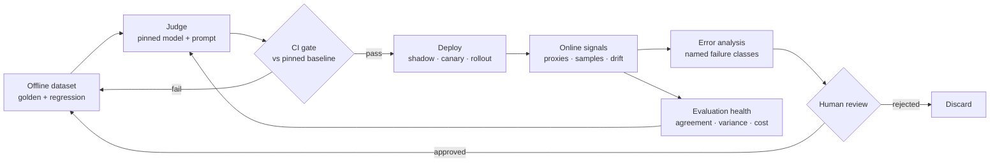

# Evaluation Reliability, Drift, and Feedback Loops

> **Interview answer (say this first).** The evaluation is a production system, not a script you run once. A hosted judge can be upgraded under you, a rubric can be edited, and a dataset can go stale, so the same code scores differently even when nothing in your system changed. Pin the judge model and prompt, record their versions with every score, measure the judge's agreement and flakiness, re-calibrate after any judge change, watch the dataset and production inputs for drift, canary a change before wide rollout, and admit production failures into the golden set only after human review. **A metric you cannot trust is worse than no metric, because people act on it.**

## Why this exists

A support team ships an evaluator. The CI gate scores answers for **faithfulness** — does the answer stick to the retrieved evidence? — using a hosted judge. The judge is pinned by name only: `provider/strong-model`, temperature `0`. It has worked for months.

On a Tuesday the provider upgrades `strong-model` behind the same name. The new revision is stricter. The mean faithfulness score falls from `0.86` to `0.79`. The build goes red.

The team spends two days on the retriever. Nothing is wrong with it. Then someone re-runs last month's known-good release under the new judge. It also scores `0.79`. **The judge moved; the system did not.** The regression was in the measuring instrument.

The same failure runs the other way, and that direction is worse. A lenient judge upgrade lifts every score by three points. A real regression lands at `0.85` instead of `0.82` and passes the gate. A green build says the system is fine while users get worse answers.

A third version needs no provider at all. An assistant suggests replies, users accept some, and the accepted replies are harvested into the evaluation set. Now the set is made of the model's own outputs, and the same model family judges them. Each cycle the score rises while the system drifts towards its own habits. It becomes confident about its own mistakes because nothing in the loop ever disagrees with it. That is a **feedback loop**, and it quietly deletes the ground truth the score was meant to measure.

These are one bug in three costumes: **nobody was watching the watcher.** Offline evaluation, the judge, and the dataset get treated as fixed infrastructure. They are not. They are code, data, and hosted models, and every one of them can drift. This page is about making the measurement as reliable as the system it measures.

> **Note.** Evaluation reliability asks a different question from quality. Quality asks "is the system good?" Reliability asks "is the number that says so still telling the truth?"

## Start from zero

| Word | Plain meaning |
| --- | --- |
| **Evaluator drift** | The score moves because the evaluator changed, not the system under test. |
| **Judge flakiness** | The same judge gives different scores for the same item with no change. |
| **Position bias** | A judge prefers whichever answer is shown first. |
| **Verbosity bias** | A judge prefers longer answers even when length adds nothing. |
| **Self-preference** | A judge prefers text in its own style, or from its own model family. |
| **Calibration** | Checking the judge against human labels and correcting it. |
| **Human agreement** | How often the judge and a human give the same label. |
| **Dataset staleness** | The evaluation cases no longer look like live traffic. |
| **Data drift** | The distribution of inputs changes. Also called covariate shift. |
| **Concept drift** | The correct answer for the same input changes. |
| **Feedback loop** | The system's outputs change future inputs, so it starts grading itself. |
| **Distribution shift** | Any change in the shape of a variable's values, inputs or outputs. |
| **Golden set refresh** | Deliberately replacing stale cases with new, human-verified ones. |
| **Canary evaluation** | Scoring a small slice of live traffic with the candidate before wide rollout. |
| **Offline vs online** | Offline = fixed dataset and labels; online = live traffic and real outcomes. |
| **Evaluation SLO** | A target for the health of the evaluation itself, such as agreement or cost. |
| **Monitoring signal** | A measurement you track over time to detect a change. |

Four distinctions do most of the work:

- **Model drift vs evaluator drift.** Model drift is the system changing. Evaluator drift is the ruler changing. They produce the same symptom — a different number — and have opposite fixes. Always rule out evaluator drift first, because it is cheaper to check.
- **Flakiness vs drift.** Flakiness is the same input bouncing around within one run. Drift is the score shifting between versions. Flakiness limits the smallest effect you can gate on; drift invalidates comparisons to older runs.
- **Data drift vs concept drift.** Data drift is "the inputs look different". Concept drift is "the same input now has a different correct answer". The first is often harmless; the second always matters.
- **Offline vs online.** Offline is a fixed set with trusted labels, so it is reproducible but can go stale. Online is live and current, so it never goes stale but you cannot label it all. A reliable evaluation uses both and reconciles them.

## The core idea

Think of a laboratory instrument. You do not just read the dials. You calibrate the instrument, log its serial number, and re-calibrate after a service. If the dial reads three degrees high, every experiment is wrong by three degrees, and the error is invisible because the dial is the only reference you have.

An LLM judge is that instrument. The dataset is the set of samples you measure. The metric is the reading. Evaluation reliability is instrument maintenance.

The evaluation is a loop with a measurement path and a feedback path:



The top path measures the system. The bottom path learns from production. The danger sits at the two joins:

- If the arrow from online signals back to the dataset has no human review, the loop feeds on its own output.
- If the arrow from online signals back to the judge has no health check, you cannot tell whether a score moved because the system changed or because the judge did.

Here is what can drift, and what detects each one. This table is the topic on one screen.

| What drifts | What it looks like | Detector |
| --- | --- | --- |
| **Judge model** | A hosted judge is updated under the same name; scores step up or down | Log the returned model id; re-run a frozen probe set |
| **Judge prompt / rubric** | Someone edits the template; scores shift with no model change | Record the prompt hash with every score; diff in review |
| **Evaluation dataset** | Cases stop resembling live traffic; the score looks great | Coverage check and refresh cadence; compare to a traffic sample |
| **Production inputs** | Users ask longer, or in new topics or languages | Input length, embedding, and topic drift checks |
| **User behaviour** | The system's suggestions change what users do next | A held-out slice that gets no AI suggestions |
| **Human label standard** | Reviewers reinterpret the rubric; the labels move | Re-label a sample and measure inter-rater agreement |

A single rule ties it together: **a green gate is only meaningful if it used the same ruler as the baseline.** If the judge version, the prompt hash, or the dataset version changed, the comparison is between two different experiments.

## How it works

1. **Pin the judge and record its version with every score.** Store the model id, the provider revision or fingerprint if it is exposed, the hash of the judge prompt, the temperature and decoding settings, the dataset version, and a run id. A score without a version is not reproducible, so it cannot be re-checked.
2. **Freeze a probe set and re-run it after any judge change.** A probe set is a fixed list of items with known human labels. Run it on every judge revision. If probe scores move, the evaluator drifted, and you say so before blaming the system.
3. **Measure judge agreement and flakiness.** Agreement is how often the judge matches a human, ideally measured with kappa so chance is removed. Flakiness is how much the same judge varies on the same item. A metric noisier than the effect it must detect cannot gate anything.
4. **Re-calibrate when the judge or the provider changes.** Re-run a human-labelled sample, recompute agreement, re-anchor the rubric with fixed examples, and store the result as a new calibration id. A judge is only calibrated for the version you measured.
5. **Re-baseline before judging any code change.** When the judge changes, re-run the frozen known-good release under the new judge and store the new baseline and the new judge version together as a pair. Never compare a run on judge-v2 with a baseline from judge-v1.
6. **Detect dataset staleness and refresh on a schedule.** Compare the slice mix and the input distribution of the dataset to a recent traffic sample. Track the age of each case. Retire or replace cases that no longer reflect the product, and version the refresh like any other data change.
7. **Monitor production inputs and outputs for drift.** Watch prompt length, topic (via embeddings), refusal rate, output length, and format. Input drift is a leading indicator: it often moves before quality does, and it tells you the dataset is about to go stale.
8. **Use shadow and canary evaluation before wide rollout.** Shadow scores the candidate on real requests without serving it. A canary serves a small slice — often `1%` to `5%` — with guardrails and automatic rollback. Both catch a regression the offline gate missed, including one caused by a judge that was too lenient to notice.
9. **Close the loop carefully: production failures become cases, with human review.** Every confirmed incident becomes a candidate case. A human labels it. Approved cases enter the regression set, and trusted ones enter the golden set. The human step is what keeps the loop honest.
10. **Guard against training or tuning on your own outputs.** Keep the data used to tune separate from the data used to evaluate. Never let the model under test author a golden label. Hold out a random, unassisted slice so the monitored distribution is not defined by the system itself.
11. **Alert on the evaluation's own health.** Treat the evaluator as a service with its own **evaluation SLOs**: a kappa floor, a flakiness ceiling, a parse-failure limit, a cost budget, a runtime budget, and a maximum dataset age. This is the watcher that watches the watcher.
12. **Record the whole chain in every run.** Judge version, prompt hash, dataset version, calibration id, threshold, and baseline belong together. A green gate or an alert is only interpretable with all of them present.

> **Tip:**
>
> **Order the checks by cost.** Confirm the judge is pinned and the probe set is unchanged first. Only then investigate the retriever, the prompt, or the model. Most "quality regressions" in a young evaluation are evaluator regressions.

## The syntax you will use

**Record the judge model and version with each score.** The score is only useful next to the provenance that produced it.

```python
import hashlib
from dataclasses import dataclass

JUDGE_PROMPT = "Score faithfulness 1-5. Return JSON."

def prompt_hash(template: str) -> str:
    return hashlib.sha256(template.encode()).hexdigest()[:12]

@dataclass(frozen=True)
class JudgeResponse:
    model: str          # the model the provider says served the request
    revision: str       # the provider fingerprint or version, if exposed
    verdict: dict       # parsed JSON, e.g. {"score": 4}

@dataclass(frozen=True)
class JudgedScore:
    case_id: str
    score: float
    judge_model: str
    judge_revision: str
    prompt_hash: str
    temperature: float
    dataset_version: str
    run_id: str

def record(case_id: str, response: JudgeResponse,
           dataset_version: str, run_id: str) -> JudgedScore:
    return JudgedScore(
        case_id=case_id,
        score=float(response.verdict["score"]),
        judge_model=response.model,
        judge_revision=response.revision,
        prompt_hash=prompt_hash(JUDGE_PROMPT),
        temperature=0.0,
        dataset_version=dataset_version,
        run_id=run_id,
    )

response = JudgeResponse("provider/strong-model", "rev-2026-06", {"score": 4})
print(record("c17", response, "golden-v9", "run-2026-09-14-01"))
```

Two runs with the same `judge_model` but different `judge_revision` are not comparable. The revision field is what turns a silent provider upgrade into a visible fact.

**A flakiness check: score the same item `N` times and report the spread.** Do this before you trust a metric to gate a release.

```python
import statistics

def flakiness(scores: list[float]) -> dict[str, float]:
    n = len(scores)
    return {
        "n": float(n),
        "mean": round(statistics.fmean(scores), 3),
        "stdev": round(statistics.stdev(scores), 4) if n > 1 else 0.0,
        "spread": round(max(scores) - min(scores), 3),
    }

calm = [0.80, 0.80, 0.80, 0.80, 0.80]
noisy = [0.60, 0.90, 0.70, 0.85, 0.55]
print("calm ", flakiness(calm))
print("noisy", flakiness(noisy))
```

Output (verified):

```text
calm  {'n': 5.0, 'mean': 0.8, 'stdev': 0.0, 'spread': 0.0}
noisy {'n': 5.0, 'mean': 0.72, 'stdev': 0.1525, 'spread': 0.35}
```

The calm judge is deterministic on this item, so a three-point gate means something. The noisy judge swings `0.35` on the *same item with no code change*, so a three-point gate is inside its noise. Fix the variance — lower temperature, stricter prompt, average of several runs, more items — or widen the margin. Do not gate on a metric that is noisier than the change you want to detect.

**A drift check on input length.** Compare a recent traffic sample to the reference window; a large standardised difference means the inputs moved.

```python
import statistics

def length_drift(reference: list[str], current: list[str]) -> dict[str, float]:
    ref = [len(t) for t in reference]
    cur = [len(t) for t in current]
    pooled = statistics.pstdev(ref + cur) or 1.0      # guard against zero spread
    return {
        "ref_mean_chars": round(statistics.fmean(ref), 1),
        "cur_mean_chars": round(statistics.fmean(cur), 1),
        "std_diff": round((statistics.fmean(cur) - statistics.fmean(ref)) / pooled, 3),
    }

reference = ["Where is my order?", "How do I return an item?",
             "Reset my password", "Do you ship to Ireland?"]
current = ["hi can u check order 88213 pls, it is late and I moved house so the address is wrong",
           "REFUND NOW",
           "my invoice has a charge I do not recognise, can you explain the line items and the tax",
           "how do i change my delivery address before it ships because i typed it wrong"]
print(length_drift(reference, current))
```

Output (verified):

```text
{'ref_mean_chars': 20.5, 'cur_mean_chars': 64.0, 'std_diff': 1.396}
```

The reference questions average `20.5` characters; live traffic averages `64.0`. A standardised difference above roughly `0.5` is worth investigating. Here the traffic is three times longer, which usually means multi-part questions, pasted context, or a new consumer channel — all of which the old evaluation set does not cover.

**A drift check on meaning, using embedding centroids.** Length can be stable while the *topics* change.

```python
import math

def centroid(vectors: list[list[float]]) -> list[float]:
    return [sum(col) / len(col) for col in zip(*vectors)]

def cosine(a: list[float], b: list[float]) -> float:
    dot = sum(x * y for x, y in zip(a, b))
    na = math.sqrt(sum(x * x for x in a))
    nb = math.sqrt(sum(y * y for y in b))
    return dot / (na * nb)

def embedding_drift(reference: list[list[float]],
                    current: list[list[float]]) -> float:
    return round(1 - cosine(centroid(reference), centroid(current)), 6)

ref = [[1.0, 0.0], [0.9, 0.1], [1.0, 0.2]]
close = [[1.0, 0.1], [0.9, 0.0], [0.95, 0.15]]
far = [[0.2, 1.0], [0.1, 0.9], [0.3, 1.0]]
print("close", embedding_drift(ref, close), "far", embedding_drift(ref, far))
```

Output (verified):

```text
close 0.000121 far 0.697705
```

A near-zero value is normal jitter. The far case is a real change in what users are asking about. Embedding drift is often the earliest signal that the world moved and the dataset is about to go stale.

**A feedback-loop guard: human review before a case can enter the golden set.** The label must be human-authored, and the reviewer must exist.

```python
from dataclasses import dataclass

@dataclass
class CandidateCase:
    case_id: str
    input: str
    model_output: str
    label: str | None = None
    label_source: str = "unlabelled"    # "human" | "model" | "unlabelled"
    reviewed_by: str | None = None

def admit_to_golden(case: CandidateCase) -> tuple[bool, str]:
    if case.reviewed_by is None:
        return False, "needs human review"
    if case.label_source != "human":
        return False, "label must be human-authored, not model-generated"
    if case.label is None:
        return False, "no label"
    return True, "admitted"

self_labelled = CandidateCase("c1", "Refund window?", "30 days",
                              label="30 days", label_source="model")
human = CandidateCase("c2", "Refund window?", "30 days", label="5-7 business days",
                      label_source="human", reviewed_by="ada")
reviewed_but_model_labelled = CandidateCase("c3", "Refund window?", "30 days",
                                            label="30 days", label_source="model", reviewed_by="bob")
print(admit_to_golden(self_labelled))                 # (False, 'needs human review')
print(admit_to_golden(reviewed_but_model_labelled))   # (False, 'label must be human-authored, not model-generated')
print(admit_to_golden(human))                         # (True, 'admitted')
```

A model-labelled case is either wrong or a copy of the answer the model already gives. Either way it raises the score without measuring anything. The gate above refuses both the unreviewed case and the self-labelled one.

## Examples: simple to real

**Example 1 — a judge upgrade shifts every score by three points, so the gate must be re-baselined.**

```text
week        judge_revision   mean_faithfulness   gate vs baseline 0.85
2026-08-10  rev-2025-12      0.86                PASS
2026-08-17  rev-2025-12      0.85                PASS
2026-08-24  rev-2026-06      0.79                FAIL  <-- provider upgrade
```

The build is red on a week the system did not change. The fix is to re-run the frozen known-good release under `rev-2026-06`. It also scores `0.79`. That proves the drop is evaluator drift, so the baseline moves to the new judge's level and the two versions are stored together: *baseline `0.79`, judge `rev-2026-06`, calibration `cal-2026-08-24`*. From now on the gate compares against that pair. The mistake to avoid is lowering the threshold by hand to `0.79` while leaving the judge version unrecorded; the next provider change will repeat the whole confusion.

**Example 2 — judge flakiness measured across repeats, and the threshold adjusted.**

Using the flakiness function above, the same five items are scored five times each:

```text
item   scores                          mean   stdev   spread
c01    [0.8, 0.8, 0.8, 0.8, 0.8]       0.80   0.0000  0.00
c02    [0.6, 0.9, 0.7, 0.85, 0.55]     0.72   0.1525  0.35
```

`c02` bounces by `0.35` with no change, which is larger than the three-point effect the gate was built to catch. Two options: reduce the variance (temperature `0`, a stricter "return only JSON" prompt, average three runs per item) or make the gate a warning until the variance is smaller than the effect. Gating on `c02` as-is would block good changes at random and destroy trust in the build.

**Example 3 — input drift detected from production traffic.**

The length check above returns `std_diff 1.396` on live traffic. Traces confirm the cause: customers now paste whole email threads. The dataset has no long-input cases, so its score is optimistic. The response is to pull `50` long inputs from traffic, have a human label them, and add them to the evaluation set. Now the score reflects the traffic that actually arrives. The general lesson: **monitor the inputs of the evaluation, not just the outputs of the system.**

**Example 4 — a feedback loop that would reinforce its own errors, and the human-review gate that stops it.**

```text
round 1  model answers "Refunds take 30 days"      -> user accepts        -> candidate case added
round 2  evaluation set now rewards the 30-day style                     -> prompt tuning follows it
round 3  judge (same model family) prefers that style -> score rises     -> all systems green
round 4  a real customer asks the same question; the true answer is "5-7 business days"  -> no case tests it
```

Without a gate, every round removes a disagreement and adds a copy of the model's own belief. The `admit_to_golden` guard in the syntax section stops it: a case enters the golden set only when a human supplies the label. A second guard keeps a small, random, unassisted slice of traffic out of the loop entirely, so the monitored distribution is never fully defined by the system itself.

**Example 5 — a canary evaluation catches a regression before full rollout.**

```text
offline gate:   task success  v12=0.89  v13=0.90   (+1 pt)   PASS
canary 2%:      escalation    v12=0.041 v13=0.062  (+51%)   BREACH -> rollback
```

Offline said the candidate was a point better. The canary — a small slice of live traffic with an automatic rollback rule — showed escalation rising by half, which the fixed dataset never captured. The change rolls back before it reaches most users, and the failing canary traces become new evaluation cases. This is why a green offline gate permits a canary, not a full rollout.

**Example 6 — an evaluation-health alert that fires before quality moves.**

```text
signal                    budget            today    action
judge kappa vs humans     >= 0.60           0.42     alert: recalibrate judge
repeat stdev (probe set)  <= 0.05           0.09     alert: reduce variance
JSON parse failures       <= 1%             6.2%     alert: prompt drifted
dataset age               <= 90 days        148d     alert: refresh golden set
```

None of these four numbers is a quality metric, yet each one means the quality metric is currently untrustworthy. Alerting on them is what it means to treat the evaluation as a production system.

## In production

- **Pin the judge model and its version, and treat it as a dependency that can move.** Record the exact model id, the provider revision or fingerprint, the prompt hash, and the decoding settings with every score. A provider upgrade is a behavioural change to a component you rely on, so log the returned model id, compare probes, and decide whether to accept, pin, or adapt.
- **Measure flakiness; do not assume determinism.** Temperature `0` reduces variance but does not guarantee it, especially for hosted models. Repeat the same item and report the standard deviation and spread before gating on the metric.
- **Re-calibrate after any judge change.** Re-run a human-labelled sample and recompute agreement. A calibration is only valid for the exact judge version and prompt that produced it.
- **Re-baseline, never compare across judge versions.** When the judge changes, re-run the frozen known-good release and store the new baseline and judge version as a pair. A threshold carried across versions measures the judges against each other.
- **Datasets go stale silently.** Cases that still pass can be quietly inflating the score. Compare the dataset's slice mix and input distribution to recent traffic, and audit labels on a schedule, not only when something fails.
- **Monitor inputs, not just outputs.** Input length, embedding, and topic drift are leading indicators. They move before quality does and tell you the dataset is ageing.
- **Canary evaluation before wide rollout.** A green offline gate proves safety, not success. Keep shadow and canary in the release path, with an automatic rollback rule, so a missed regression has a small blast radius.
- **Feedback loops need human review.** Every production failure becomes a candidate case, and a human labels it. Never let the model under test author its own ground truth.
- **Never train or tune on unreviewed model output.** Separate the data used to tune from the data used to evaluate, and keep a random unassisted slice out of the loop so monitoring has a clean signal.
- **Alert on evaluation health: agreement, variance, and cost.** Give the evaluator its own SLOs and its own alerts. High parse-failure rates and rising kappa failures mean the number is broken, even when it looks fine.
- **Keep a frozen regression set.** Old cases are the only thing that connects today's score to yesterday's. Keep it append-only in spirit, and move it forward deliberately when the world genuinely changes.
- **Separate "the model changed" from "the evaluator changed".** Re-run the probe set and last known-good release first. Until you have ruled out the evaluator, any quality investigation is guesswork.

## Interview questions

### 1. What does "the evaluation is a production system" mean?

**Answer.** It means the evaluator has inputs, outputs, dependencies, versions, failure modes, and an owner. A hosted judge is a dependency that can change without your deploy. A prompt is code that can be edited. A dataset is data that can go stale. If the evaluation is unversioned and unmonitored, its failures look like failures of the system, and you tune the wrong thing. Treat the evaluator with the same discipline as the service it measures.

**Follow-up: "What is the smallest first step?"** Record the judge model id, prompt hash, and dataset version with every score. Without that, no investigation can tell a system change from an evaluator change.

**Trap.** Assuming a deterministic, locally hosted judge removes the problem. Prompt edits, dataset staleness, and feedback loops remain.

### 2. What is evaluator drift, and how does it differ from model drift?

**Answer.** Evaluator drift is the score moving because the evaluator changed: the judge model, the rubric, the calibration, or the labelling standard. Model drift is the system's own behaviour changing. Both produce a different number, and the symptom is identical. The fix differs completely: evaluator drift means re-pinning, re-calibrating, and re-baselining; model drift means fixing or adapting the system. Rule out evaluator drift first, because it is cheaper to check.

**Follow-up: "How do you check quickly?"** Re-run the frozen probe set and the last known-good release under the current evaluator. If those moved, the evaluator moved.

**Trap.** Investigating the retriever or prompt for two days while the judge quietly changed. Check the ruler before the thing being measured.

### 3. How do you pin and version a judge?

**Answer.** Record the model id, the provider revision or fingerprint, the hash of the judge prompt template, the temperature and any other decoding settings, and a calibration id. Store all of it with every score. Pin to a versioned model id when the provider offers one, and if it does not, track a fingerprint: a fixed probe set whose score is a tripwire for silent updates. Version the judge and its prompt as a pair, because a prompt edit is a judge change.

**Follow-up: "What if the provider exposes no version at all?"** Keep a frozen probe set with known labels, run it on a schedule, and alert on any change. Behaviour is what matters, not the name.

**Trap.** Pinning by name only, such as `provider/strong-model`. The name is stable; the behaviour underneath it is not.

### 4. How do you measure judge flakiness and decide it is safe to gate on?

**Answer.** Score the same items several times with no code change and compute the mean, standard deviation, and spread per item. Also measure the flip rate for pairwise judges. If the repeat spread is smaller than the effect the gate must detect, the metric is stable enough to gate. If it is larger, reduce the variance first: lower temperature, a stricter output format, averaging several runs, or more items. Otherwise the gate fires on noise and gets ignored.

**Follow-up: "Can a flaky metric still be useful?"** Yes, as a warning on a pull request. It just cannot carry blocking authority.

**Trap.** Re-running a failed gate until it passes. That turns a gate into a coin flip and destroys its value.

### 5. How do you keep an evaluation dataset from going stale?

**Answer.** Compare it to live traffic on a cadence. Check the slice mix, the input length and embedding distribution, and the age of each case. Audit a sample of labels every quarter or after any product change, because a stale case that still passes quietly inflates the score. Refresh deliberately: retire cases that no longer reflect the product, add new human-verified cases from traffic, and version the whole change. Record why each case was added or removed.

**Follow-up: "What is the sign of overfitting?"** Offline scores rise while online quality stays flat. The system is learning the set's quirks instead of the task.

**Trap.** Refreshing only after an incident. The stale case that still passes is exactly the one no incident will point at.

### 6. What is a feedback loop, and how does it poison a golden set?

**Answer.** A feedback loop happens when the system's outputs change future inputs or labels. If answers the model produced are harvested, approved without human review, and used as ground truth, the set becomes a copy of the model's beliefs. The score rises while real quality does not, and disagreements disappear because the model grades its own style. The guards are human review before a case enters the golden set, labels authored by a person rather than the model under test, and a random unassisted slice held out of the loop.

**Follow-up: "Why is a random unassisted slice needed if every case is human-reviewed?"** Human review is slow and incomplete, and reviewers can be anchored by the model's suggestion. A clean, untouched slice gives an independent signal.

**Trap.** Letting the model under test write the expected answer. It measures self-consistency, not correctness.

### 7. How do you distinguish "the model changed" from "the evaluator changed"?

**Answer.** Re-run two fixed things: the frozen probe set, which measures the evaluator, and the last known-good system release, which measures the system under the current evaluator. If the probe set moved, the evaluator changed. If the known-good release moved but the probe set did not, the evaluator shifted in a way the probes missed, so widen the probes. If both are stable and only the new candidate moved, the model changed. This ordering is the cheapest possible diagnosis.

**Follow-up: "What if only a slice of cases moved?"** That points at a dataset or rubric issue in that slice, or a genuine system regression. Compare the slice's inputs against the reference distribution before concluding.

**Trap.** Comparing a run on judge-v2 against a baseline from judge-v1. That comparison measures the two judges, not your change.

### 8. How do you monitor and alert on the evaluation's own health?

**Answer.** Give the evaluator evaluation SLOs: a minimum judge agreement with humans, a maximum repeat variance, a parse-failure ceiling, a cost budget, a runtime budget, and a maximum dataset age. Track them as monitoring signals and alert on breaches, using the same hysteresis rules as any other alert. The point is that a broken evaluator must announce itself, because a broken evaluator usually produces a plausible number rather than an error.

**Follow-up: "Which of these deserves a page?"** Any breach that makes the release gate untrustworthy: a kappa collapse, a parse-failure spike, or a judge revision change. A slowly ageing dataset belongs on a dashboard with a scheduled refresh.

**Trap.** Alerting only on system quality. If the only alert is "score dropped", you cannot tell whether to fix the system or the evaluator.

## Remember this

- **The evaluation is a production system.** Pin the judge, version the prompt, version the dataset, and monitor the evaluator itself.
- **Rule out evaluator drift first.** A frozen probe set and the last known-good release separate "the model changed" from "the evaluator changed".
- **Measure flakiness before you gate.** A metric noisier than the effect it must detect cannot block a release.
- **Datasets go stale silently.** Monitor inputs and refresh the golden set on a schedule; a case that still passes can still be wrong.
- **Feedback loops need human review.** Never let the model under test author a golden label, and keep a random unassisted slice out of the loop.
