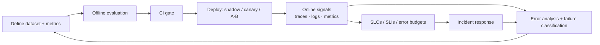

# Phase 8 — AI Evaluation, Observability and Reliability

You cannot improve what you cannot measure, and with AI systems you cannot even trust what you measure unless you measure it carefully. A model that "feels better" is not evidence. This phase turns quality, latency, cost, and failure into numbers you can track, compare, and set targets against.

It is also the phase that keeps a system honest after launch. Prompts drift, models get updated underneath you, traffic changes, and retrieval quality decays. Evaluation, tracing, and monitoring are how you notice before your users do.

## What you will be able to do

By the end of this phase you should be able to:

- Design offline and online evaluation, and build golden, evaluation, and regression datasets.
- Evaluate agents and RAG systems, and choose between deterministic, rule-based, LLM-as-judge, pairwise, and human evaluation.
- Measure quality (faithfulness, correctness, hallucination), performance (latency, TTFT), cost, and reliability (retries, failures, loops, tool calls).
- Trace requests with OpenTelemetry, structure logs and metrics, and dashboards with Prometheus and Grafana.
- Read agent, prompt, tool, and model traces, and use LangSmith.
- Do error analysis and failure classification, and turn findings into regression tests and CI gates.
- Evaluate deployments with shadow traffic, A/B tests, and canary evaluation.
- Monitor model quality and drift, define SLOs and SLIs, manage error budgets, and run incident response for AI systems.

## Evaluation and observability loop

The loop matters more than any single technique. **Offline** evaluation decides whether a change is safe to ship; **online** observability decides whether it is actually working; **error analysis** feeds both. Without the loop you are guessing with extra steps.

## Topic order

1. [AI evaluation fundamentals](01-ai-evaluation-fundamentals.md) — offline vs online evaluation.
2. [Evaluation datasets and golden sets](02-evaluation-datasets-and-golden-sets.md) — golden, evaluation, regression.
3. [Agent evaluation](03-agent-evaluation.md) — judging multi-step behaviour.
4. [RAG evaluation](04-rag-evaluation.md) — end-to-end retrieval plus generation quality.
5. [Deterministic and rule-based evaluators](05-deterministic-and-rule-based-evaluators.md) — cheap, exact checks.
6. [LLM-as-judge and pairwise evaluation](06-llm-as-judge-and-pairwise-evaluation.md) — scalable judgement, and its biases.
7. [Human evaluation](07-human-evaluation.md) — the ground truth, used sparingly.
8. [Task and tool success metrics](08-task-and-tool-success-metrics.md) — did it do the job?
9. [Quality metrics](09-quality-metrics.md) — hallucination, retrieval quality, correctness, faithfulness.
10. [Performance and cost metrics](10-performance-and-cost-metrics.md) — latency, TTFT, tokens, cost.
11. [Reliability metrics](11-reliability-metrics.md) — retry rate, failure rate, loop and tool-call counts.
12. [Tracing and OpenTelemetry](12-tracing-and-opentelemetry.md) — distributed traces for AI calls.
13. [Structured logging](13-structured-logging.md) — logs you can query.
14. [Metrics with Prometheus and Grafana](14-metrics-with-prometheus-and-grafana.md) — counters, histograms, dashboards.
15. [Agent, prompt, tool, and model traces](15-agent-prompt-tool-and-model-traces.md) — what each trace level tells you.
16. [LangSmith](16-langsmith.md) — an evaluation and tracing platform.
17. [Error analysis and failure classification](17-error-analysis-and-failure-classification.md) — turning failures into fixes.
18. [Regression testing and AI CI/CD](18-regression-testing-and-ai-cicd.md) — gates that block bad changes.
19. [Shadow, A/B, and canary evaluation](19-shadow-ab-testing-and-canary-evaluation.md) — evaluating in production safely.
20. [Model quality monitoring and drift](20-model-quality-monitoring-and-drift.md) — noticing quiet decay.
21. [SLOs, SLIs, and error budgets](21-slos-slis-and-error-budgets.md) — defining what "healthy" means.
22. [Incident response for AI systems](22-incident-response-for-ai-systems.md) — when it goes wrong at 3am.

> **How to study this phase.** Ask of every metric: what decision does it change? A number nobody acts on is cost without benefit. Good AI observability is small, trusted, and wired into a decision — ship, roll back, or investigate.
