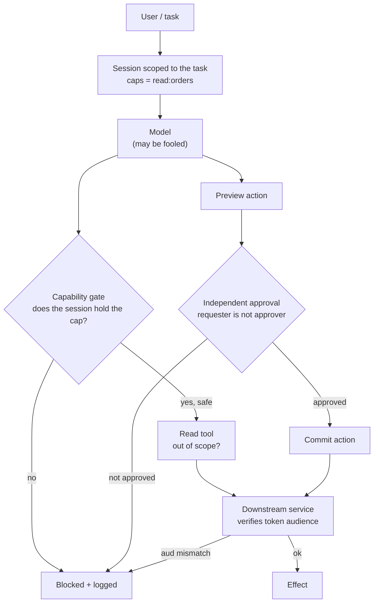

# Excessive Agency and Privilege Escalation

> **Interview answer (say this first).** Excessive agency is giving the agent more capability than the task needs — a browser, a shell, and a write key for a job that only reads orders. Privilege escalation is using one granted tool to reach another capability, such as a read tool that accepts a path escaping its workspace, or an agent that uses its own identity to call a higher-privilege service. Agent impersonation and the confused-deputy problem are the related risks. The fix is least-authority design: scope each session to the task, separate read from write, preview from commit, and request from approve, and verify the caller's identity and audience at every hop. The model is never the thing that grants permission.

## Why this exists

Agents are often built by adding capabilities until the demo works. Start with a search tool. Add file read. Add file write. Add a shell for "flexibility". Add a browser. Add an admin token so the agent "can do everything". By launch, the agent has far more power than any single task needs. That is **excessive agency**, and it multiplies the impact of every other mistake.

Contrast two designs for a refund agent:

- **Wide:** can read all customers, read all orders, issue any refund amount, send email anywhere, and run shell commands.
- **Narrow:** can read the orders of the current user, issue a refund up to a fixed amount, and cannot send email or run code.

Both can answer a refund question. If an injection lands, the wide agent can exfiltrate the customer table and move money; the narrow agent can refund one order, which is a far smaller loss.

The second problem is **privilege escalation**: using one permission to obtain another. It does not require a bug in the model. It happens when a tool is broader than its name suggests:

- A `read_file` tool that accepts `../..` escapes its workspace and reads private keys.
- A `run_sql` tool that accepts arbitrary SQL (including `GRANT` or `COPY ... TO PROGRAM`).
- A `fetch_url` tool that follows redirects to internal metadata endpoints (SSRF).
- An agent that holds its own service identity to a downstream API, so any user can act through it.

The third problem is identity: **agent impersonation** (a component claims to be an agent it is not) and the **confused deputy** (a trusted component is tricked into using its own authority for an attacker).

All three have one root cause: a mismatch between the authority granted and the authority the task actually needs. Least-authority design closes the gap, and the model never gets to grant itself anything.

## Start from zero

| Word | Plain meaning |
| --- | --- |
| **Agency** | An agent's ability to act in the world through tools. |
| **Excessive agency** | More capability than the task needs. |
| **Least authority** | The smallest power that still completes the task. |
| **Capability** | A specific right, such as `read:orders` or `send:email`. |
| **Privilege escalation** | Using one granted capability to gain another. |
| **Lateral movement** | Moving from one system or account to another after a compromise. |
| **Impersonation** | Claiming to be a user, agent, or service you are not. |
| **Confused deputy** | A trusted component is tricked into misusing its own authority. |
| **Sandbox** | A restricted environment that limits files, network, and process access. |
| **Delegation** | Acting on behalf of a user with that user's authority. |
| **On-behalf-of token** | A credential that represents a user delegating to a service. |
| **Audience (`aud`)** | The claim naming which service a token was issued for. |
| **Scope** | A named permission attached to a credential. |
| **Path traversal** | Using `..` in a path to escape the intended directory. |
| **SSRF** | Server-side request forgery: making your server fetch an attacker-chosen URL. |
| **Approval gate** | A required human decision before a dangerous action. |
| **Unauthorized tool execution** | A tool call the session's capabilities do not permit; the capability gate blocks it, not the model. |
| **Separation of duties** | The person who requests an action cannot approve it. |
| **Preview then commit** | Show the effect first, apply it only after a separate confirmation. |
| **Read/write split** | Separate the capability to read from the capability to change. |
| **Just-in-time elevation** | Granting extra power briefly for one task, then removing it. |
| **Blast radius** | How much damage one compromised component can cause. |

Two pairs are easy to confuse:

- **Excessive agency vs privilege escalation.** Excessive agency is *too much power in one place*. Privilege escalation is *using the power you have to get more*. The first is a design mistake; the second is an attack technique.
- **Impersonation vs confused deputy.** Impersonation is *lying about who you are*. A confused deputy is a *real, trusted component* that is tricked into using its authority. You fix impersonation with authentication; you fix confused deputies with per-request consent and audience checks.

## The core idea

Think of a hotel. A guest key opens the guest's room and the shared areas. It does not open other rooms, the staff office, or the safe. Housekeeping has a master key for rooms, but not for the safe. The manager can open the safe, but only during a logged procedure with a second person present. No key opens everything, and the front desk does not hand out the master key because someone asked nicely.

That is least-authority design for agents:

- Every agent gets a **guest key** scoped to the task, not a master key.
- Powerful actions need a **second person** (separation of duties) and a **log**.
- The **front desk** (your code) verifies identity and issues the key; the guest (the model) cannot promote their own key.



The gate is code. The model proposes a call; the session's capabilities decide whether it can run. A powerful action goes through preview and an independent approval before commit. The downstream service still verifies the token's audience, so even an allowed call cannot use authority minted for another service.

Here is the design checklist as a table:

| Principle | Question to ask | Example control |
| --- | --- | --- |
| Least authority | Does this session hold only what the task needs? | Session caps `{read:orders}` |
| Read/write split | Can the reading step also change things? | Read tool has no write capability |
| Preview/commit split | Does the dangerous step require a second decision? | `preview()` then `commit()` |
| Request/approve split | Can the requester approve? | Approver must differ from requester |
| Identity | Do we verify who is calling? | Registered agents, audience check |
| Audience | Is the token valid for this service? | Reject `aud` mismatch |
| Argument scope | Is the argument narrower than the tool? | Path confinement, amount caps |
| Just-in-time | Is standing power avoidable? | Time-boxed elevation for one task |

> **Note.** Every arrow in that diagram is a place where authority could leak. The model can propose; it cannot grant. The session can read; it cannot write. The requester can ask; they cannot approve. Each split removes a path from "fooled model" to "real-world damage".

## How it works

1. **Start from the task, not the demo.** Write down what the task must read and change. Grant that, and nothing else. A capability added "for flexibility" is a future incident.
2. **Give each session a capability set.** Not the agent's identity, and not the user's full rights — a small set tied to the current task and tenant.
3. **Split read from write.** Separate tools, separate credentials. A tool that only reads should be structurally unable to write.
4. **Validate arguments, not just tool names.** Confine paths to a workspace, cap amounts, allowlist recipients and hosts, and restrict SQL to parameterized statements.
5. **Preview, then commit.** Compute the effect first, show it, and apply it only in a separate, confirmed step.
6. **Separate request from approve.** The requester must not be the approver. Enforce it in code and log both identities.
7. **Verify identity on every hop.** Check that the caller is a registered agent, and that the token's audience matches the receiving service.
8. **Prefer on-behalf-of tokens over shared service accounts.** The downstream service should see the user, not a generic powerful agent.
9. **Use just-in-time elevation.** Grant extra power for one task, with a short expiry, and remove it after. Do not keep standing admin access.
10. **Sandbox the execution.** Even a fully compromised agent should reach a small filesystem, a narrow network, and no host credentials.
11. **Log the decision and the effect.** Record the session caps, the tool, the arguments, the approval, and the result. That is how you find escalation after the fact.
12. **Test the escalation paths.** Try `../`, absolute paths, redirects to internal hosts, requester-as-approver, and audience mismatches, and assert each is blocked.

Two mechanisms are worth naming precisely:

- **The confused deputy is fixed by consent and audience.** A proxy must obtain the user's consent for *that specific client*, and it must send downstream only tokens minted for the downstream service. Accepting a token issued for a different service is the bug.
- **Privilege escalation is fixed by argument scope and capability gates.** A tool cannot be broader than its purpose. A `read_file` that confines to a workspace cannot read private keys, no matter what path the model supplies.

## The syntax you will use

**1. Compute excessive agency directly.** The gap between what was granted and what the task needs is the excess.

```python
TASK_NEEDS = {"read:orders"}
GRANTED = {"read:orders", "read:customers", "write:refunds", "send:email", "exec:shell"}

def excessive(granted, needed):
    return sorted(granted - needed)
```

**2. Split preview from commit, and require independent approval.** The preview is safe; only commit has an effect, and only with a different approver.

```python
class RefundAPI:
    def __init__(self):
        self.committed = []

    def preview(self, order_id, amount):
        return {"preview": True, "order": order_id, "amount": amount}

    def commit(self, plan, approval):
        if not approval.get("approved") or approval.get("approver") == approval.get("requester"):
            raise PermissionError("commit requires independent approval")
        self.committed.append(plan)
        return f"committed refund {plan['amount']} for {plan['order']}"
```

**3. A capability gate in front of every tool.** The session's capabilities decide, not the model's request.

```python
TOOL_CAPABILITY = {"read_file": "read", "list_dir": "read", "run_shell": "exec", "send_email": "send"}

def invoke(tool, session_caps):
    needed = TOOL_CAPABILITY.get(tool)
    if needed is None:
        raise PermissionError(f"unknown tool {tool!r}: denied by default")
    if needed not in session_caps:
        raise PermissionError(f"tool {tool!r} needs {needed!r}, session has {sorted(session_caps)}")
    return f"invoked {tool}"
```

**4. Confine paths inside an allowed workspace.** Path traversal is the classic escalation from an allowed read tool.

```python
import os, tempfile

WORK_ROOT = tempfile.mkdtemp(prefix="agent-workspace-")
with open(os.path.join(WORK_ROOT, "notes.txt"), "w") as fh:
    fh.write("hello")

def read_file(path, root=WORK_ROOT):
    candidate = path if os.path.isabs(path) else os.path.join(root, path)
    real = os.path.realpath(candidate)
    if os.path.commonpath([os.path.realpath(root), real]) != os.path.realpath(root):
        raise PermissionError(f"path escapes workspace: {path!r}")
    with open(real) as fh:
        return fh.read().strip()
```

**5. Enforce separation of duties with a single-use, expiring token.** The requester cannot approve their own action, the token cannot be reused, and it stops working after a short window.

```python
import secrets, time

PENDING = {}
APPROVAL_TTL_SECONDS = 300

def request_action(action, requester):
    token = secrets.token_hex(16)
    PENDING[token] = {
        "action": action,
        "requester": requester,
        "used": False,
        "expires_at": time.time() + APPROVAL_TTL_SECONDS,
    }
    return token

def approve_and_commit(token, approver):
    rec = PENDING.get(token)
    if rec is None or rec["used"]:
        raise PermissionError("unknown or already-used approval token")
    if time.time() > rec["expires_at"]:
        raise PermissionError("approval token expired")
    if approver == rec["requester"]:
        raise PermissionError("requester may not approve their own action")
    rec["used"] = True
    return f"approved by {approver}: {rec['action']}"
```

**6. Verify agent identity and audience.** A registered agent, calling the service the token was minted for.

```python
REGISTERED_AGENTS = {"support-agent": {"aud": "crm-api", "caps": {"read"}}}

def verify_caller(claims):
    entry = REGISTERED_AGENTS.get(claims.get("sub"))
    if entry is None:
        raise PermissionError("unknown agent identity")
    if claims.get("aud") != entry["aud"]:
        raise PermissionError(f"wrong audience: {claims.get('aud')!r}")
    return entry
```

## Examples: simple to real

**Example 1 — quantify the excess.** The task needs one capability; the agent holds five.

```python
print("task needs  :", sorted(TASK_NEEDS))
print("granted     :", sorted(GRANTED))
print("excessive   :", excessive(GRANTED, TASK_NEEDS))
```

Output:

```text
task needs  : ['read:orders']
granted     : ['exec:shell', 'read:customers', 'read:orders', 'send:email', 'write:refunds']
excessive   : ['exec:shell', 'read:customers', 'send:email', 'write:refunds']
```

Four of five capabilities are excess. Each one is a path an injection could use: `read:customers` for bulk data, `send:email` for exfiltration, `write:refunds` for fraud, `exec:shell` for everything else. The narrow design keeps one.

**Example 2 — preview, then independent commit.** The preview always works. Commit fails without approval, and fails again when the requester tries to approve.

```python
api = RefundAPI()
plan = api.preview("A-100", 2500)
print("preview :", plan)
for approval in [{"approved": False, "requester": "agent", "approver": "agent"},
                 {"approved": True, "requester": "agent", "approver": "agent"}]:
    try:
        print("commit  :", api.commit(plan, approval))
    except PermissionError as e:
        print("commit  :", e)
print("committed:", api.committed)
print("independent approval:", api.commit(plan, {"approved": True, "requester": "agent", "approver": "human"}))
```

Output:

```text
preview : {'preview': True, 'order': 'A-100', 'amount': 2500}
commit  : commit requires independent approval
commit  : commit requires independent approval
committed: []
independent approval: committed refund 2500 for A-100
```

The preview has no effect, so it needs no gate. Commit needs both a positive approval and an approver different from the requester. The `committed` list is still empty after the two failures, and the independent approval finally applies. Separation of duties turns "the agent said yes" into "two identities agreed".

**Example 3 — the capability gate stops one tool from calling another.** A read-only session cannot reach a shell or a send.

```python
read_only = {"read"}
print(invoke("read_file", read_only))
for t in ["run_shell", "send_email", "delete_everything"]:
    try:
        invoke(t, read_only)
    except PermissionError as e:
        print("PermissionError:", e)
```

Output:

```text
invoked read_file
PermissionError: tool 'run_shell' needs 'exec', session has ['read']
PermissionError: tool 'send_email' needs 'send', session has ['read']
PermissionError: unknown tool 'delete_everything': denied by default
```

This is least authority in one function. The model may ask for `run_shell`; the session does not hold `exec`, so the request is denied. The error even shows what the session did hold, which helps debugging and auditing. The third line shows default-deny: a tool the map does not know is refused cleanly instead of raising an unexpected `KeyError`.

**Example 4 — path traversal is a privilege escalation in an allowed tool.** `read_file` is allowed, but it must not read outside its workspace.

```python
print("in-root :", read_file("notes.txt"))
for p in ["../id_rsa", "/etc/passwd"]:
    try:
        print("escape  :", read_file(p))
    except PermissionError as e:
        print("escape  :", e)
```

Output:

```text
in-root : hello
escape  : path escapes workspace: '../id_rsa'
escape  : path escapes workspace: '/etc/passwd'
```

The relative traversal and the absolute path are both blocked by resolving the real path and checking it stays under the workspace root. Without this, an allowed read tool becomes a way to read anything the process can read, including private keys. The tool name said "read a file"; the argument decided *which* file, and that is where the control lives.

**Example 5 — separation of duties blocks self-approval.** The requester cannot approve their own action, and a used token cannot be replayed.

```python
tok = request_action("delete customer 42", requester="agent")
for approver in ["agent", "human"]:
    try:
        print(approve_and_commit(tok, approver))
    except PermissionError as e:
        print("PermissionError:", e)
```

Output:

```text
PermissionError: requester may not approve their own action
approved by human: delete customer 42
```

The agent requested the deletion; the agent cannot approve it; a human can. The token is 128 bits (`token_hex(16)`), so it cannot be guessed, and it expires after five minutes, so a stale or leaked approval cannot be replayed. It is also single-use: the approval applies once. Note that the check is identity-based, not a prompt instruction — the model cannot talk its way past it.

**Example 6 — impersonation and audience checks.** A registered agent is accepted only when the token is minted for the service it is calling.

```python
for claims in [{"sub": "support-agent", "aud": "crm-api"},
               {"sub": "support-agent", "aud": "payments-api"},
               {"sub": "not-registered", "aud": "crm-api"}]:
    try:
        print(verify_caller(claims))
    except PermissionError as e:
        print("PermissionError:", e)
```

Output:

```text
{'aud': 'crm-api', 'caps': {'read'}}
PermissionError: wrong audience: 'payments-api'
PermissionError: unknown agent identity
```

The first line is accepted. The second is a real agent calling the wrong service with a token minted for another audience — the confused-deputy fix in one check. The third is an unregistered caller impersonating an agent. Both fail. Audience binding prevents a token stolen or reused from working somewhere it was never issued for.

## In production

- **Scope the session, not the agent.** Give each task a small capability set tied to the user and tenant. The agent's long-lived identity should not carry standing power.
- **Make read and write different tools with different credentials.** A tool that reads should be structurally unable to write. If one credential can do both, a read-only task still holds write authority.
- **Validate arguments as carefully as tool names.** Confine paths, cap amounts, allowlist recipients and hosts, and forbid arbitrary SQL. Most escalations happen through arguments, not tool names.
- **Require preview and independent approval for irreversible actions.** Show the exact effect, not a summary, and require an approver who is not the requester.
- **Verify identity and audience at every hop.** Check that the caller is a registered agent and that the token's `aud` matches the receiving service. Reject tokens minted for another service.
- **Prefer on-behalf-of tokens over shared service accounts.** A shared admin account erases per-user authorization and lets any user act with full power. Delegated tokens carry the user's real rights.
- **Use just-in-time elevation.** Grant extra power for one task, with a short expiry and an audit record, then remove it. Standing admin access is the opposite of least authority.
- **Sandbox execution with no ambient credentials.** A container with a small filesystem, a narrow network allowlist, and no host credentials bounds what a compromised agent can reach.
- **Block SSRF at the fetch tool.** Resolve the host, reject private and link-local addresses, and do not follow redirects without re-checking. An allowed fetch tool is an escalation path to internal services.
- **Log the full authority chain.** Record the session caps, the tool, the arguments, the approver, and the result. That record is how you reconstruct an escalation.
- **Re-test escalation paths in CI.** `../`, absolute paths, redirects to metadata endpoints, requester-as-approver, reused tokens, and audience mismatches. Each should be blocked on every run.
- **Do not overclaim.** Sandboxing and capability gates bound the damage; they do not make the model trustworthy. State the residual risk and keep independent layers.

## Interview questions

### 1. What is excessive agency?

**Answer.** Excessive agency is giving an agent more capability than the task needs. A refund agent that also has a shell, a browser, and an admin token is the classic case. The danger is not that the agent will misuse the power on its own; it is that any injection, bug, or dependency compromise now has far more reach. The fix is least authority: scope each session to the task and split capabilities so no single step holds more than it needs.

**Follow-up: "How do you decide what is 'excessive'?"** Start from the task, not the demo. Write down what it must read and change, grant exactly that, and treat anything else as excess that must be justified. Capability added for flexibility is future incident surface.

**Trap.** Equating "the agent needs to be useful" with "the agent needs broad access". Usefulness comes from good tools, not from unlimited authority.

### 2. What is privilege escalation in an AI agent, and how does it happen?

**Answer.** Privilege escalation is using one granted capability to gain another. In agents it usually happens two ways: through arguments that are broader than the tool's purpose, such as a `read_file` that accepts `../` or an absolute path, or through a chain of allowed calls, such as a fetch tool that reaches an internal metadata endpoint. It does not require a model bug; it is a mismatch between the tool's name and its real scope.

**Follow-up: "How do you prevent it?"** Confine arguments: resolve real paths and require them to stay under a root, cap amounts, allowlist hosts and recipients, and forbid arbitrary SQL. Add a capability gate so a read session cannot invoke an exec or send tool. And sandbox so a successful escape reaches little.

**Trap.** Trusting the tool name. `read_file` sounds safe; `read_file("../../id_rsa")` is not.

### 3. What is the confused-deputy problem for agents?

**Answer.** A trusted component, such as a gateway or proxy, is tricked into using its own authority on behalf of an attacker. For example, an agent proxy that uses one shared client identity and skips per-user consent can be made to act with broad rights. The fix is per-request consent, tokens bound to the right audience, and on-behalf-of tokens so downstream services see the user, not a generic powerful deputy.

**Follow-up: "How does audience help?"** A token minted for service A must not work at service B. If the deputy forwards a user's token to a different service, that service rejects it on the `aud` claim. Binding tokens to a service stops the deputy from extending its reach.

**Trap.** Thinking the deputy must be malicious. The whole point is that a legitimate, trusted component is being used.

### 4. How do agent impersonation and identity verification relate to this?

**Answer.** Impersonation is a component claiming to be an agent or user it is not. Without identity checks, any caller can act as any agent. You verify identity by authenticating the caller, checking it against a registry of known agents, and validating the token's audience. Agent-to-agent calls need the same treatment: each hop verifies the caller and the scope.

**Follow-up: "Why not just use a shared API key for all agents?"** A shared key erases attribution and per-agent scoping, so one leak grants every agent's rights. Prefer per-agent identities with narrow scopes.

**Trap.** Treating a valid token as proof of the right to act. A token proves authentication; it does not prove authorization for this service or this action.

### 5. Why separate read from write, and preview from commit?

**Answer.** Because each split removes a path from "fooled model" to "real damage". A read-only step cannot change anything, so an injection into that step is limited to disclosure. Preview is a no-effect computation; commit is the only step that changes the world, and it needs a separate confirmation. This means the dangerous action always passes through an explicit, reviewable gate instead of happening as a side effect of reasoning.

**Follow-up: "Doesn't preview double the work?"** It costs a little, and it buys a clear point to inspect, approve, and log. For irreversible actions, that is a good trade.

**Trap.** Treating preview as approval. A preview that nobody reviews is not a control; the commit gate must be real and mandatory.

### 6. What is separation of duties, and how do you enforce it?

**Answer.** Separation of duties means the identity that requests an action cannot be the identity that approves it. In an agent system, the agent requests and a human (or a different service) approves. Enforce it in code: the approval record carries both identities, and the commit fails if they match. Use single-use approval tokens so an approval cannot be replayed.

**Follow-up: "How do you avoid approval fatigue?"** Approve by risk class, not every call. Auto-allow reads and low-impact actions, and reserve approval for irreversible, external, or high-cost actions. Fatigue is itself a risk, because people approve without reading.

**Trap.** Letting the agent set `approved: true` in its own action object. The approval must come from a different authenticated identity through a separate channel.

### 7. What is least-authority design for an agent?

**Answer.** Give each session only the capabilities the task needs, tie them to the user and tenant, and prefer short-lived, just-in-time elevation over standing access. Split read from write, preview from commit, and request from approve. Validate arguments, not just tool names. Sandbox execution. Verify identity and audience at every hop. The model proposes; deterministic code grants and enforces.

**Follow-up: "How does this bound the blast radius?"** If the model is fooled, it can only reach what the session holds, and the session holds little. A narrow session turns a breach into a contained incident.

**Trap.** Using one powerful service account for all agents and tasks. It erases per-user authorization, makes audit useless, and turns one compromise into a company-wide one.

### 8. How would you test an agent for excessive agency and escalation?

**Answer.** Build an adversarial suite. Assert that the session holds exactly the expected capabilities. Try path traversal, absolute paths, redirects to internal metadata, requester-as-approver, reused approval tokens, wrong-audience tokens, and unregistered callers, and assert each is blocked. Track the results in CI so a new tool or scope cannot quietly widen authority.

**Follow-up: "What if a test needs a capability the session lacks?"** That is a design decision, not a test failure. Add the capability for that task with a scope and an expiry, and document why. Do not widen the standing session to make the test pass.

**Trap.** Testing only the happy path. The whole point is to prove the dangerous paths are closed, and to keep proving it as the agent gains tools.

## Remember this

- **Excessive agency is a design mistake; privilege escalation is an attack.** Fix both with least authority.
- **Argument scope is where escalation lives.** A safe tool name with an unsafe argument is still a hole: confine paths, cap amounts, allowlist hosts.
- **Split the powerful steps.** Read vs write, preview vs commit, request vs approve. Each split removes a path to damage.
- **Verify identity and audience at every hop.** Reject wrong audiences and unknown callers; prefer on-behalf-of tokens over shared service accounts.
- **Bound the blast radius, do not just block the front door.** Sandbox, scope, expire, log, and re-test the escalation paths.
