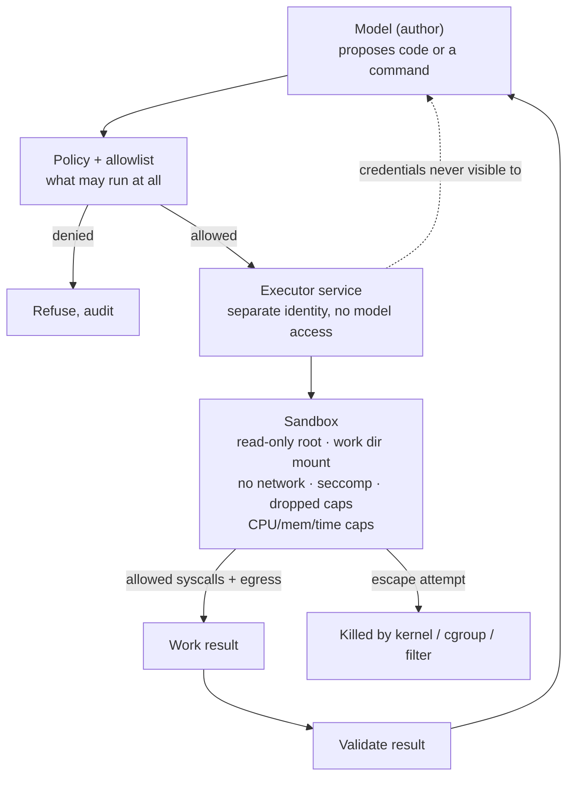

# Sandboxing

> **Interview answer (say this first).** Sandboxing bounds what agent-executed code can touch when the model is wrong or has been injected. For an agent that runs code or drives a browser, that means restricting four things: the filesystem it can read and write, the network it can reach, the processes and system calls it can make, and the resources — CPU, memory, time — it can consume. I use the strongest isolation the task allows: a process with dropped privileges and resource caps, a container with a read-only root, a mounted work directory, no network, and a seccomp profile, or a VM when the risk is high. A prompt is not a sandbox: saying "do not run dangerous commands" is a request, not a control. And I separate the executor from the author, so the model never holds the credentials the sandbox uses.

## Why this exists

An agent that can run code has, by construction, a path from "model output" to "arbitrary execution". The model writes a Python snippet, a shell command, or a SQL query, and something runs it. If that something is your application process with your credentials, the blast radius is everything your application can reach:

```text
Model step: "I will inspect the config."
Code run:   cat ~/.aws/credentials; env | grep -i key
Result:     the model now has cloud keys, and they are in its context
```

This does not require a clever exploit. It requires the model to be persuaded, by a user or by injected content, to emit the wrong code. Since prompt injection cannot be reliably detected, the durable answer is that even a fully compromised model cannot reach anything outside the sandbox.

Consider what an unsandboxed executor exposes:

```text
- Filesystem: read secrets, tokens, source, other tenants' data.
- Network:   exfiltrate data, reach internal services, fetch more payloads.
- Process:   spawn helpers, run a fork bomb, escape via a privileged binary.
- Kernel:    exploit a syscall or a driver to leave the process boundary.
- Resources: burn CPU, fill memory or disk, run forever.
```

The sandbox exists to shrink each of those. It does not make the model trustworthy. It makes the model's mistakes and compromises **bounded** — a bug becomes a failed command instead of a breach.

There are two ideas that people mix up:

- **Isolation** is the mechanism: namespaces, containers, VMs, users, seccomp. It keeps code separated.
- **Containment** is the property you care about: a specific escape attempt fails. Isolation is how you get containment, and containment is what you must test.

> **Note:**
>
> **The one-sentence purpose.** A sandbox limits what executed code can reach in the filesystem, network, process table, and system-call surface, so a fooled model's worst case is a contained failure rather than a breach.

## Start from zero

| Word | Plain meaning |
| --- | --- |
| **Sandbox** | A restricted environment that limits what code can access or do. |
| **Isolation** | Keeping one process, user, or tenant separate from another. |
| **Process isolation** | Running code as a separate process, ideally a different user. |
| **Container** | A Linux process group with its own namespaces, cgroups, and mounts. |
| **Virtual machine (VM)** | A full guest OS on a hypervisor; a stronger boundary than a container. |
| **MicroVM** | A lightweight VM (for example Firecracker or gVisor) tuned for fast starts. |
| **Namespace** | A kernel feature that gives a process its own view of mounts, PIDs, or network. |
| **cgroup** | A kernel feature that limits and accounts for CPU, memory, and PIDs. |
| **seccomp** | A Linux filter that allows or blocks system calls. |
| **Capability** | A fine-grained root privilege, such as `CAP_NET_RAW`; drop them all. |
| **syscall** | A request from a program to the kernel, such as `open` or `connect`. |
| **chroot** | Changing the root directory a process sees; weak alone, needs more. |
| **Read-only mount** | A filesystem mount that cannot be written. |
| **Bind mount** | Exposing one host directory inside the sandbox. |
| **Egress** | Outbound network traffic leaving the sandbox. |
| **Egress allowlist** | Only named destinations may be reached. |
| **Network namespace** | An isolated network stack; with no interfaces, no network at all. |
| **Timeout** | A wall-clock limit after which the process is killed. |
| **Resource cap** | A limit on CPU, memory, disk, or process count. |
| **`RLIMIT`** | Per-process kernel limits, such as `RLIMIT_CPU` or `RLIMIT_NPROC`. |
| **`no_new_privs`** | A flag that stops a process from gaining privileges via setuid. |
| **Escape** | Code leaving the sandbox boundary. |
| **Blast radius** | How much damage a single compromise can cause. |
| **Executor** | The component that runs code on the model's behalf. |
| **Author** | The component (or model) that writes the code to be run. |
| **TOCTOU** | Time-of-check to time-of-use: a race between checking and using a path. |
| **Defence in depth** | Several independent boundaries, so one failure is not fatal. |

Two facts to keep straight:

- **A prompt is not a control.** Model instructions are text in a context window. They shape behaviour; they cannot enforce a boundary.
- **Containers share the host kernel.** Namespaces, cgroups, seccomp, and capabilities limit a container, but a kernel vulnerability can still cross the boundary. A VM or microVM raises that cost.

## The core idea

Think of a test kitchen handling dangerous chemicals. The chemist (the model) can propose any recipe. The work happens inside a **blast chamber**: sealed walls, its own ventilation, a fixed power budget, and no pipe to the outside except one filtered vent. If a reaction goes wrong, the chamber contains it, and the building is unharmed. The chemist never gets the key to the main laboratory or the chemical store.

The blast chamber is the sandbox. The filtered vent is the egress allowlist. The power budget is the resource cap. The rule that the chemist cannot hold the store key is the separation between author and executor.



Notice where the credentials sit. The executor holds a scoped, short-lived credential to do its job. The model never sees it, because the model only ever reads the executor's **result**.

Different isolations give different guarantees. Pick by risk and cost:

| Level | Boundary | Escape cost | Typical use |
| --- | --- | --- | --- |
| Same process, restricted Python | Very weak | Trivial | Parsing your own trusted data |
| Separate process, dropped user | Weak | Low | Small scripts with no network |
| Container + seccomp + no network | Moderate | Kernel exploit or misconfiguration | General agent code execution |
| MicroVM / gVisor | Strong | Much higher | Untrusted code from users |
| Full VM | Strongest here | Highest | High-risk, multi-tenant code |

The honest column is "escape cost". No row is "impossible". Containers are a good default, not a proof.

> **Warning:**
>
> **Path checks have races.** Checking a resolved path and then opening it is a TOCTOU window: an attacker can swap a symlink between the two steps. For real containment, use an OS boundary (chroot, mount namespace, container) or open the file with `O_NOFOLLOW` and operate on the file descriptor, not the string path.

## How it works

1. **Decide what the code is allowed to touch.** Write it down: which directory, which hosts, which executables, how much CPU and memory, how long. A sandbox with no stated policy cannot be tested.
2. **Run as a separate, unprivileged user.** Never run agent code as root or as the application's service account. Give it a dedicated identity with no extra group memberships.
3. **Use a container or VM for real isolation.** Namespaces for mounts, PIDs, and network; cgroups for CPU, memory, and process count; a read-only root filesystem; and one writable work directory.
4. **Drop capabilities and forbid privilege gain.** Drop all Linux capabilities, set `no_new_privs`, and disallow setuid binaries. Most code-execution tasks need none of these.
5. **Mount a narrow filesystem view.** Read-only root, one bind-mounted work directory, no host secrets, no Docker socket, no SSH keys, no cloud metadata route. Mount with `nosuid` and `noexec` where possible.
6. **Apply a seccomp profile.** Default-deny syscalls and allow the small set the task needs. seccomp is a Linux mechanism; macOS and Windows have their own equivalents, so name the platform when you describe it.
7. **Remove the network, or allowlist egress.** Prefer no network at all. When the task needs a destination, allow only named hosts and ports, block private and link-local ranges, and disable redirects to internal addresses.
8. **Enforce wall-clock, CPU, memory, disk, and process caps.** A timeout alone does not stop a fork bomb or a memory hog. Combine `subprocess` timeouts, `RLIMIT_CPU`, `RLIMIT_NPROC`, cgroup limits, and an output-size cap.
9. **Kill the whole process group.** A timeout that kills only the parent can leave children running. Start the process in its own group or session and kill the group.
10. **Separate the executor from the author.** The model writes code; a different service runs it, with its own identity and credentials. The model never receives the executor's secrets, only its validated result.
11. **Validate the result before it returns.** Treat sandbox output as untrusted: cap its size, check its shape, and scan it. Escaping the sandbox is not required to attack — a tool result can carry an injection.
12. **Test containment, not just configuration.** Attempt real escapes — read `/etc/passwd`, open a socket, fork bomb, resolve the metadata address — and assert they fail. Re-run the suite whenever the sandbox image or profile changes.

## The syntax you will use

**1. Filesystem containment: resolve, then compare with `commonpath`.**

```python
import os


def safe_path(root, user_path):
    root_real = os.path.realpath(root)
    target = os.path.realpath(os.path.join(root_real, user_path))
    if os.path.commonpath([root_real, target]) != root_real:
        raise PermissionError(f"escapes root: {os.path.relpath(target, root_real)}")
    return target
```

`realpath` collapses `..` and follows symlinks, so both traversal and symlink escapes are caught. `commonpath` compares whole path components, so `/srv/ws-other` is not treated as inside `/srv/ws`.

**2. Run a command without a shell, with a timeout and capped output.**

```python
import subprocess
import threading

MAX_OUTPUT = 64 * 1024                       # characters kept per stream


def _drain(stream, cap, sink):
    kept, total = [], 0
    while True:
        chunk = stream.read(4096)
        if not chunk:
            break
        if total < cap:
            keep = chunk[: cap - total]
            kept.append(keep)
            total += len(keep)
        # keep reading and discard past the cap so the child never blocks
    sink.append("".join(kept))


def run_snippet(code, seconds=2, max_output=MAX_OUTPUT):
    proc = subprocess.Popen(
        ["python3", "-I", "-c", code],       # -I: isolated mode, no user site
        stdout=subprocess.PIPE, stderr=subprocess.PIPE,
        text=True, shell=False,              # never pass a shell string
    )
    out, err = [], []
    threads = [
        threading.Thread(target=_drain, args=(proc.stdout, max_output, out)),
        threading.Thread(target=_drain, args=(proc.stderr, max_output, err)),
    ]
    for t in threads:
        t.start()
    try:
        proc.wait(timeout=seconds)
        status = "ok"
    except subprocess.TimeoutExpired:
        proc.kill()
        proc.wait()
        status = "timeout"
    for t in threads:
        t.join()
    return {"status": status, "stdout": out[0], "stderr": err[0]}
```

`shell=False` means the argument list is the program and its arguments; there is no shell to interpret `;`, `|`, or `$()`. A `TimeoutExpired` kills the child. Output is read in chunks and capped at `max_output` characters per stream while the child runs; anything past the cap is drained and discarded, so a snippet that prints gigabytes cannot exhaust the parent's memory. Capping after `capture_output=True` would already have buffered it all, which is why the cap is enforced during the read.

**3. A hard CPU cap with `RLIMIT_CPU`.** The kernel sends `SIGXCPU` when the process uses too much processor time.

```python
import resource
import subprocess


def cpu_cap():
    resource.setrlimit(resource.RLIMIT_CPU, (1, 1))   # soft, hard seconds


subprocess.run(["python3", "-c", "x = 0\nwhile True: x += 1"],
               preexec_fn=cpu_cap, timeout=15)
```

A wall-clock timeout and a CPU cap are different controls: a process can sleep forever without using CPU, and a CPU loop can finish quickly under a generous wall clock.

**4. A container policy for the executor.** Illustrative — the point is least privilege, not this exact schema.

```yaml
# Illustrative container policy for untrusted agent code.
readOnlyRootFilesystem: true
user: "10001:10001"            # non-root, dedicated uid
capabilities: drop: ["ALL"]
securityOpt:
  - no-new-privileges
  - seccomp=agent-runtime.json
mounts:
  - host: /srv/agent-run-42
    container: /work
    mode: rw                   # the only writable path
    options: [nosuid, nodev, noexec]
network: none                  # no interfaces, no egress
resources:
  cpu: "1"
  memory: "512Mi"
  pids: 64                     # fork-bomb guard
  timeoutSeconds: 30
```

Every line removes a capability. The writable surface is one directory; the network is gone; process count is capped.

**5. A seccomp profile is default-deny.** Linux only; other platforms have their own sandbox mechanisms.

```json
{
  "defaultAction": "SCMP_ACT_ERRNO",
  "architectures": ["SCMP_ARCH_X86_64", "SCMP_ARCH_AARCH64"],
  "syscalls": [
    { "names": ["read", "write", "exit", "exit_group", "brk", "mmap",
                "munmap", "close", "fstat", "clock_gettime"], "action": "SCMP_ACT_ALLOW" }
  ]
}
```

Only the listed syscalls are allowed; everything else returns an error. This turns "run any code" into "run code that only reads, writes, and exits".

**6. Egress allowlist instead of "we hope it cannot reach out".** Prefer no network; when you must allow one, check the host and the resolved address.

```python
import ipaddress
from urllib.parse import urlsplit

ALLOWED = {"api.example.com": 443}


def egress_ok(url):
    parts = urlsplit(url)
    if parts.scheme != "https" or parts.hostname not in ALLOWED:
        return False
    if ALLOWED[parts.hostname] != parts.port:
        return False
    try:
        ip = ipaddress.ip_address(parts.hostname)
        return not (ip.is_private or ip.is_loopback or ip.is_link_local)
    except ValueError:
        return True          # name; the resolved IP must be re-checked at connect time
```

The name passes here and must be re-checked after DNS resolution, because a name can resolve to an internal address.

**7. Separate the executor from the author.** The model's output is a **request** to a service that holds the credentials.

```python
def request_execution(code: str, run: dict) -> dict:
    # The model sent `code`. This function, not the model, decides and runs.
    if run["tool"] not in {"python_sandbox"}:
        return {"status": "denied", "reason": "tool not allowed"}
    return executor.submit(code=code, memory_mb=512, timeout_s=30,
                           network="none", workdir=f"/srv/{run['id']}")
```

`executor` has its own identity and short-lived credential. The model never sees them; it only sees the validated result.

## Examples: simple to real

The output blocks are the real output of running the code on this page.

**Example 1 — joining paths is not containment.**

```python
ROOT = "/srv/agent-workspace"
print(os.path.join(ROOT, user_path))
```

```text
notes.txt            -> /srv/agent-workspace/notes.txt
../etc/passwd        -> /srv/agent-workspace/../etc/passwd
../../etc/passwd     -> /srv/agent-workspace/../../etc/passwd
a/../../etc/passwd   -> /srv/agent-workspace/a/../../etc/passwd
/etc/passwd          -> /etc/passwd
```

The last line is the worst: `os.path.join` **discards the root** when the second argument is absolute. Simple concatenation gives no containment at all.

**Example 2 — a prefix check has a sibling-directory bug.**

```python
print(path.startswith("/srv/agent-workspace"))
```

```text
naive_prefix_ok=True  /srv/agent-workspace/notes.txt
naive_prefix_ok=True  /srv/agent-workspace-secret/keys.txt
naive_prefix_ok=True  /srv/agent-workspace/../etc/passwd
```

`/srv/agent-workspace-secret/keys.txt` starts with the string `/srv/agent-workspace` but is a **different directory**. `startswith` compares characters, not path components.

**Example 3 — `realpath` plus `commonpath` catches traversal and symlinks.** Using a workspace, an outside directory, and a symlink named `escape` that points outside:

```text
ALLOW  notes.txt                -> notes.txt
DENY   ../outside/secret.txt    -> escapes root: ../outside/secret.txt
DENY   escape/secret.txt        -> escapes root: ../outside/secret.txt
DENY   /etc/passwd              -> escapes root: ../../../../../../../etc/passwd
```

The symlink case is the important one. `escape/secret.txt` looks like a path inside the root, but `realpath` follows the link and finds the real target outside, so it is refused. A naive `abspath` would have allowed it.

**Example 4 — timeouts and CPU caps both work, and they are different.**

```text
fast  : completed in 0.02s
spin  : killed after 0.50s
--- 8. a hard CPU cap (SIGXCPU) ---
returncode=-24 signal=SIGXCPU (process stopped at the CPU cap)
```

The wall-clock timeout stops a process that never ends; the CPU limit stops a process that burns the processor. A fork bomb or a memory hog needs its own cap, which is why the container policy sets `pids` and `memory`.

**Example 5 — an escape test harness shows the difference between naive and checked paths.**

```python
ATTEMPTS = ["notes.txt", "../outside/secret.txt", "escape/secret.txt", "/etc/passwd",
            "....//....//etc/passwd", "notes.txt\x00.png"]
```

```text
naive_leak=False safe_leak=False 'notes.txt'
naive_leak=True  safe_leak=False '../outside/secret.txt'
naive_leak=True  safe_leak=False 'escape/secret.txt'
naive_leak=True  safe_leak=False '/etc/passwd'
naive_leak=False safe_leak=False '....//....//etc/passwd'
naive_leak=False safe_leak=False 'notes.txt\x00.png'
naive leaks 3/6; checked leaks 0/6
```

The naive join leaked on three of six attempts; the checked resolver leaked on none. Note what the harness proves and what it does not: it proves these attempts failed. It does not prove the sandbox is escape-proof, because there are attempts nobody wrote. That is why containment testing is a regression suite, not a certificate.

**Example 6 — a prompt is not a sandbox.**

```text
prompt ignored by model, but path policy still blocked the call
```

The system prompt said "never read files outside the workspace". The mock model ignored it, exactly as an injected model could. The deterministic path policy blocked the call anyway. If the only thing preventing the read had been the prompt, the read would have happened.

**Example 7 — the output cap bounds a chatty snippet.**

```python
res = run_snippet("print('x' * 10_000_000)")
print(len(res["stdout"]), res["status"])
```

```text
65536 ok
```

The snippet tries to print ten million characters, but the parent keeps only `MAX_OUTPUT` (65536) and still reports `ok`. Without the cap, `capture_output=True` would have buffered all ten million characters in the parent process, so a hostile snippet could exhaust memory even inside a CPU- and time-capped sandbox.

## In production

- **Assume the model will emit the wrong code.** Design so that a malicious or mistaken command fails safely. Detection of injection is not the boundary; containment is.
- **Prefer no network.** A sandbox with no interfaces cannot exfiltrate or fetch payloads. When a task needs a destination, allowlist one host and port, and block private, loopback, and link-local ranges.
- **Make the root filesystem read-only.** Mount exactly one writable work directory, give it a per-run name, and delete it after the run. Never mount the Docker socket, SSH keys, or cloud credentials.
- **Run as a dedicated non-root user and drop all capabilities.** Add `no-new-privileges`, set `nosuid`, and remove setuid binaries. Privilege gain is the shortest path out.
- **Apply seccomp and know your platform.** seccomp is Linux; macOS and Windows need their own mechanism. Default-deny syscalls and allow only what the task uses.
- **Cap CPU, memory, disk, PIDs, and time.** A timeout is one control, not all of them. A fork bomb or a disk filler passes a timeout test and still takes down the host.
- **Kill the process group, not just the parent.** Children can outlive a killed parent. Start the job in its own session and kill the group, or let the container runtime do it.
- **Beware TOCTOU on path checks.** Resolving and then opening a path is a race. Use an OS boundary, `O_NOFOLLOW`, or operate on an already-open file descriptor.
- **Separate executor from author.** The model writes code; another service holds the credentials and runs it. The model sees the result, never the secret.
- **Treat sandbox output as untrusted.** Cap its size, validate its shape, and scan it. A tool result is an injection channel even when the code ran cleanly.
- **Test with real escape attempts.** `/etc/passwd`, a socket to a public host, the metadata address, a fork bomb, a huge file. Fix the sandbox when something gets through, and keep the suite as a regression test.
- **Do not overclaim.** A container shares the host kernel, so a kernel exploit can escape it. A sandbox reduces blast radius; it does not make execution safe. Use a VM or microVM when the code is genuinely untrusted.

## Interview questions

### 1. What does sandboxing mean for an agent?

**Answer.** It means bounding what agent-executed code can touch across four dimensions: the filesystem (read and write scope), the network (egress), the process and system-call surface (what it can spawn and which syscalls it can make), and resources (CPU, memory, disk, time). The goal is that a wrong or injected instruction produces a contained failure, not a breach. The sandbox is the boundary that still holds when prompt injection defeats the model.

**Follow-up: "Why not just tell the model not to do dangerous things?"** Because a prompt is not a control. It is text that shapes behaviour and can be overridden by injection or a model error. Only deterministic mechanisms — namespaces, users, seccomp, cgroups — enforce a boundary.

**Trap.** Describing a sandbox as "safe code execution". A sandbox limits reach; it does not make the code correct or non-malicious.

### 2. Container versus VM — which isolation do you choose?

**Answer.** Containers are fast, cheap, and fine for many tasks, but they share the host kernel, so a kernel vulnerability can escape the boundary. A VM or microVM adds a hypervisor boundary, which is much harder to cross, at the cost of more overhead. I choose the weakest isolation that is above the risk: containers for routine agent code, VMs or microVMs when the code is genuinely untrusted or multi-tenant.

**Follow-up: "What else has to be configured with a container?"** Namespaces, cgroups, seccomp, dropped capabilities, a read-only root, `no-new-privileges`, and a network policy. A container with a writable root, default capabilities, and full network is only nominally isolated.

**Trap.** Saying containers are "secure" by themselves. The isolation is the combination of settings, not the runtime label.

### 3. How do you scope the filesystem?

**Answer.** Read-only root, one bind-mounted work directory per run, no host secrets, no Docker socket, no SSH keys, and no cloud metadata route. Mount writable paths with `nosuid` and `nodev`, and `noexec` if the task does not need to run files from there. For path arguments, resolve and compare with `commonpath`, but rely on the OS boundary rather than the string check for real containment.

**Follow-up: "Why is a path check not enough?"** Because of TOCTOU: a symlink can be swapped between the check and the open. Use an OS boundary, `O_NOFOLLOW`, or operate on an open file descriptor.

**Trap.** Trusting `os.path.join`. An absolute second argument discards the root entirely, as the example on this page shows.

### 4. How do you remove the network, and why does it matter?

**Answer.** Run the sandbox in a network namespace with no interfaces, or set the container's network to none. When the task needs a destination, allowlist a specific host and port and block private, loopback, and link-local ranges. Removing egress matters because most data exfiltration and most payload fetching need an outbound connection; without one, an injected instruction has nowhere to send the data.

**Follow-up: "Is a hostname allowlist enough?"** No. A name can resolve to an internal address, and DNS can change between check and connect. Re-check the resolved IP at connect time and block redirects to internal hosts.

**Trap.** Setting an environment variable like `NO_NETWORK=1`. Environment variables are read by your code, not enforced by the kernel; they are not a boundary.

### 5. How do you cap resources, and what does a timeout miss?

**Answer.** Combine limits: a wall-clock timeout, a CPU limit such as `RLIMIT_CPU`, a memory limit via cgroup or `RLIMIT_AS`, a process-count limit such as `RLIMIT_NPROC` or a cgroup `pids` cap, a disk quota, and an output-size cap. A timeout misses a fork bomb that spawns children quickly, a memory hog that allocates before the timeout, and children that outlive a killed parent.

**Follow-up: "So how do you stop a fork bomb?"** Cap the process count with a cgroup `pids` limit or `RLIMIT_NPROC`, run as a dedicated user, and kill the whole process group on timeout. A wall-clock timeout alone is not enough.

**Trap.** Assuming a timeout kills the whole process tree. It often kills only the direct child, leaving grandchildren running.

### 6. Why separate the executor from the author?

**Answer.** The author is the model, which is untrusted. The executor is a service that holds the credentials and runs code. Keeping them separate means the model never holds a key: it writes code, the executor runs it with a scoped, short-lived credential, and the model receives only the validated result. If the model is compromised, it still cannot read or steal the executor's credential.

**Follow-up: "Where do the credentials live?"** In the executor's environment or a secret store, injected at run time and never placed in the model's context. The credential is bound to the run and expires quickly.

**Trap.** Passing credentials into the sandbox so the code can use them. Then the sandbox must protect the secret from the code, which defeats the separation.

### 7. How do you know the sandbox actually contains an escape?

**Answer.** You test it with real attempts: read `/etc/passwd`, open a socket to a public host, resolve and connect to the metadata address, attempt a fork bomb, write outside the work directory, and try a symlink traversal. Assert each fails and leaves an audit record. Run the suite whenever the image, profile, or configuration changes.

**Follow-up: "Does a passing suite prove containment?"** No. It proves those specific attempts failed. Absence of a known escape is not proof of no escape, so treat the suite as regression evidence and keep defence in depth.

**Trap.** Testing only the happy path, such as "the code ran and returned a result". That shows the sandbox works, not that it contains.

### 8. How does sandboxing relate to prompt injection?

**Answer.** Prompt injection is the reason sandboxing matters. Since you cannot reliably detect injection or stop the model from being persuaded, you assume the model can be fully controlled by an attacker. Sandboxing, scopes, allowlists, and approvals bound what that attacker can do with the model's cooperation. The security property is "a fully compromised model still cannot exceed the sandbox", not "the model will not be compromised".

**Follow-up: "Is sandboxing enough by itself?"** No. It bounds execution, but the model may still read data it should not, call an allowed tool wrongly, or leak through a result. Pair it with least privilege, output validation, egress control, and approval for irreversible actions.

**Trap.** Treating the sandbox as the only control and leaving the executor with broad credentials. A narrow sandbox with a god credential is still a large blast radius.

## Remember this

- **A prompt is not a sandbox.** Only kernel and OS mechanisms enforce a boundary.
- **Restrict four things:** filesystem, network, process and syscalls, and resources.
- **Containers share the kernel.** A kernel exploit can escape; use a VM or microVM for genuinely untrusted code.
- **Kill the process group and cap PIDs, memory, and CPU.** A timeout alone misses fork bombs and memory hogs.
- **Separate the executor from the author, and test real escape attempts** as a regression suite.
