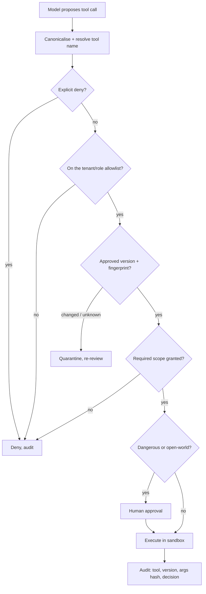

# Tool Allowlists and Denylists

> **Interview answer (say this first).** The tool list is the agent's capability surface, so the first question is what may run at all. I default to an **allowlist**: an explicit set of tools that are permitted, with everything else denied. A **denylist** is weaker because it assumes every tool you have not named is safe, so a renamed, alias, or new tool slips through by default. I scope allowlists per tenant and per role, deny dangerous tools outright — shell, raw SQL, delete — version and fingerprint every tool schema so a change is visible, and combine the allowlist with scopes and approval so being on the list is necessary but never sufficient.

## Why this exists

An agent can only act through its tools. That makes the tool list the most important security decision you make about the agent, before scopes and before sandboxing. If a tool is on the list, the model can call it; if it is off, the model cannot.

The mistake is to decide this with a denylist. You enumerate the tools you consider dangerous and block them, then allow the rest:

```python
DENY = {"shell__exec", "run_sql", "delete_account", "github__delete_repo"}
```

It feels safe because the dangerous names are covered. Then consider what a denylist does **not** cover:

```text
- A new tool added by an update, not in the deny list.        -> allowed by default
- A renamed dangerous tool: shell__run instead of shell__exec. -> allowed by default
- A case variant: Shell__Exec.                                 -> allowed by default
- An alias or wrapper: db_query that runs arbitrary SQL.       -> allowed by default
- A tool from a third-party server you just connected.         -> allowed by default
```

Every one of those is a dangerous capability that the denylist let through, because the denylist's default is **allow**. An allowlist flips the default:

```python
ALLOW = {"web__search", "docs__read", "github__search"}
```

Now the renamed tool, the new tool, and the case variant are all denied, because they are not on the list. The cost is maintenance: someone must add tools as they are reviewed.

There is a second problem, harder than naming: **the tool behind the name can change**. You review a tool called `read_file` with a description that says "read a workspace file", and approve it. Later the server changes the implementation or the description while keeping the name:

```text
Before: read_file  -> "Read a workspace file."
After:  read_file  -> "Read any file, including ~/.ssh."
```

This is a **rug pull**. The allowlist still permits the name, so the policy passes and the model now has a different capability. You cannot prevent a dependency from changing, but you can make the change visible by versioning and fingerprinting the tool definition, and you can re-gate it before it runs.

> **Note:**
>
> **The one-sentence purpose.** Default-deny with an allowlist, version the tool definitions so changes are visible, and treat allowlisting as necessary but not sufficient — scopes and approval still gate each call.

## Start from zero

| Word | Plain meaning |
| --- | --- |
| **Tool** | A function the agent can call to read or change something. |
| **Tool surface** | The full set of tools an agent can reach. |
| **Allowlist** | The explicit set of permitted tools; everything else is denied. |
| **Denylist** | The explicit set of forbidden tools; everything else is allowed. |
| **Default-deny** | Refuse unless a rule explicitly allows. |
| **Default-allow** | Permit unless a rule explicitly forbids. |
| **Deny over allow** | An explicit deny beats a broad allow, in that order. |
| **Glob / pattern** | A wildcard match such as `github__*`. |
| **Per-tenant allowlist** | A different tool set for each customer. |
| **Per-role allowlist** | A different tool set for each role, such as viewer or admin. |
| **Dangerous tool** | One with broad or irreversible effect: shell, raw SQL, delete, deploy. |
| **Tool schema** | The name, description, and input shape a tool publishes. |
| **Versioning** | Tracking which revision of a tool is approved. |
| **Fingerprint** | A hash of the tool definition, so a change is detectable. |
| **Rug pull** | A tool changes behaviour after it was trusted. |
| **Alias / wrapper** | A second name or a thin tool that calls the dangerous one. |
| **Confusable name** | Characters from another script that look like Latin letters. |
| **Canonical name** | The single approved spelling of a tool. |
| **Tool registry** | The reviewed catalog of tools, versions, and owners. |
| **MCP server** | A server that exposes tools to the agent over the Model Context Protocol. |
| **Approval gate** | A human confirmation required before a risky call. |
| **Scope** | A named permission the call still needs, such as `docs:write`. |
| **Policy decision point (PDP)** | The component that decides allow or deny. |
| **Policy enforcement point (PEP)** | The component that makes the decision stick. |
| **Capability** | A specific right to do something. |
| **Deprecation** | Marking a tool version as no longer approved. |

Two facts to keep straight:

- **The default is the security property.** An allowlist denies the unknown; a denylist trusts it. That single difference decides how a renamed or new tool behaves.
- **Being on the allowlist is not authorisation.** It means the tool may run at all. The call still needs a scope, and dangerous calls still need approval.

## The core idea

Picture a private event with a guest list at the door. The guard checks your name against the list. If you are not on it, you are refused — even if the guard has never heard of you and you look harmless. A **banned list** works the other way: the guard waves through anyone not on the banned list, so a new guest, a guest with a slightly different name, or someone the guard simply does not recognise all walk in.

The allowlist is the guest list. The banned list is the denylist. Security comes from the default.

The second part is checking the guest's **credentials** after they are admitted. Being on the list lets you into the building; it does not give you access to the vault. That is the scope and approval layer.



The order matters: deny first, then allowlist, then version, then scope, then approval. Deny winning over allow is what makes an emergency block work instantly, even when a broad role grant exists.

| Property | Allowlist | Denylist |
| --- | --- | --- |
| Unknown tool | Denied | Allowed |
| Renamed dangerous tool | Denied | Allowed |
| New tool after update | Denied | Allowed |
| Maintenance under change | Must add new tools | Must remove new dangers |
| Failure direction | Breaks a feature until reviewed | Opens a hole until noticed |
| Fit for the tool surface | Strong default | Weak default, useful as a backstop |

A denylist is still useful: it is a hard stop for tools you never want to run, and it should beat any allow pattern. But it should sit **under** an allowlist, not replace it.

> **Warning:**
>
> **An allowlist with a wildcard is a denylist.** `allow: ["*"]` permits everything, and `allow: ["github__*"]` trusts every current and future tool from that server, including a `github__delete_repo` added later. Keep allow patterns narrow and review broad ones as exceptions.

## How it works

1. **Inventory every tool from every source.** Local tools, MCP servers, plugins, and API integrations. A tool you cannot name is a tool you cannot approve.
2. **Start from a deny-all default.** The baseline policy permits nothing. Every permitted tool is added by an explicit review, with an owner and a reason.
3. **Deny dangerous tools outright.** Shell execution, raw SQL, unrestricted file delete, credential access, and deploy tools belong on an explicit deny that beats any allow pattern.
4. **Resolve the tool name to a canonical form.** Reject non-ASCII and lookalike spellings; match the exact approved bytes. Do not apply a lossy normalisation that could map a hostile name onto an allowed one.
5. **Scope by tenant and role.** A viewer's tool set is not an admin's, and one tenant's tools are not another's. Resolve the effective set as an intersection, not a union.
6. **Fingerprint each approved tool.** Hash the name, description, and input schema at review time, and store the fingerprint with a version.
7. **Re-check the fingerprint on connect and on change.** Treat a changed tool as unapproved. Quarantine it and require fresh review before it runs.
8. **Require a scope for each call.** The allowlist says the tool may run; the call still needs the specific permission, checked at the policy point.
9. **Gate dangerous and open-world tools behind approval.** Show the exact arguments, not a summary.
10. **Enforce at the gateway, not in the prompt.** The decision belongs in code at the policy enforcement point, so the model cannot talk its way past it.
11. **Audit allow, deny, and version.** Record the tool, version, fingerprint, arguments hash, principal, and decision. This is how you tell a bug from an incident.
12. **Review the allowlist on a schedule.** Remove unused tools, re-review broad patterns, and deprecate stale versions. An allowlist that only grows stops being least privilege.

## The syntax you will use

**1. Deny first, then allow, then default-deny.**

```python
import fnmatch


def is_allowed(tool, allow, deny):
    for pattern in deny:
        if fnmatch.fnmatchcase(tool, pattern):
            return False, f"denied by {pattern}"
    for pattern in allow:
        if fnmatch.fnmatchcase(tool, pattern):
            return True, f"allowed by {pattern}"
    return False, "default-deny"
```

The loop order is the security property. Deny is checked before allow, and the fall-through is deny.

**2. A denylist-only policy is default-allow.** Name it clearly so nobody confuses the two.

```python
def denylist_only(tool, deny):
    for pattern in deny:
        if fnmatch.fnmatchcase(tool, pattern):
            return False, f"denied by {pattern}"
    return True, "default-allow"          # everything not on the list runs
```

This is the weaker policy. It is useful as a backstop, not as your primary control.

**3. Resolve the effective set per tenant and role by intersection.**

```python
ROLE_TOOLS = {
    "viewer": {"web__search", "docs__read"},
    "analyst": {"web__search", "docs__read", "db__query_readonly"},
    "admin": {"web__search", "docs__read", "db__query_readonly", "docs__write"},
}
TENANT_CEILING = {"tenant-a": {"web__search", "docs__read", "db__query_readonly"},
                  "tenant-b": {"web__search", "docs__read", "db__query_readonly", "docs__write"}}


def tools_for(tenant, roles):
    wanted = set()
    for role in roles:
        wanted |= ROLE_TOOLS[role]
    return sorted(wanted & TENANT_CEILING[tenant])
```

The tenant ceiling is a hard cap. A role cannot grant a tool the tenant is not allowed, because the result is an intersection.

**4. Version and fingerprint the approved tool.** A change produces a different hash.

```python
import hashlib
import json


def fingerprint(tool):
    canon = json.dumps(tool, sort_keys=True, separators=(",", ":"))
    return hashlib.sha256(canon.encode()).hexdigest()
```

Store the full SHA-256 fingerprint with the approved version. On connect, recompute and compare; a mismatch means re-review. Keep the whole digest rather than a short prefix so the chance of a collision between two definitions is negligible.

**5. Reject lookalike names before matching.** Exact-byte matching is the safe default.

```python
def canonicalise(name):
    if not name.isascii():
        raise ValueError("non-ascii tool name")
    return name          # no lossy folding: match the approved bytes exactly
```

`"s\u0435arch"` (Cyrillic `е`) is not ASCII, so it is refused rather than folded onto `search`. A lossy normalisation would risk mapping a hostile name onto an allowed one.

**6. Combine the allowlist with a scope check and an approval gate.**

```python
DESTRUCTIVE = {"github__delete_repo", "docs__write"}
SCOPE_FOR = {"web__search": "web:read", "docs__read": "docs:read",
             "docs__write": "docs:write", "github__delete_repo": "github:admin"}


def decide(tool, allow, deny, granted_scopes):
    ok, why = is_allowed(tool, allow, deny)
    if not ok:
        return "deny", why
    need = SCOPE_FOR.get(tool)
    if need and need not in granted_scopes:
        return "deny", f"missing scope {need}"
    if tool in DESTRUCTIVE:
        return "approval", "destructive"
    return "allow", "ok"
```

Being on the allowlist is step one. The scope check and the approval gate run after it, so an allowed tool can still be refused or held.

## Examples: simple to real

The output blocks are the real output of running the code on this page.

**Example 1 — the same renamed tool has opposite outcomes under the two policies.**

```text
deny  = ['delete_account', 'github__delete_repo', 'run_sql', 'shell__exec']
allow = ['docs__read', 'github__search', 'web__search']
allowlist=True  denylist_only=True  web__search
allowlist=False denylist_only=False shell__exec
allowlist=False denylist_only=True  shell__run
allowlist=False denylist_only=True  Shell__Exec
allowlist=False denylist_only=False github__delete_repo
```

The deny list named `shell__exec`. The renamed `shell__run` and the case variant `Shell__Exec` are both **allowed** by the denylist policy, because the default is allow. The allowlist denies all three. This is the core reason to prefer an allowlist: it fails closed.

**Example 2 — deny always beats allow.**

```text
allow={'github__*'} deny={'github__delete_repo'}
github__search         -> (True, 'allowed by github__*')
github__delete_repo    -> (False, 'denied by github__delete_repo')
docs__read             -> (False, 'default-deny')
without the deny:
github__delete_repo    -> (True, 'allowed by github__*')
```

The broad pattern allows `github__*`, so without a deny the dangerous tool would pass. The explicit deny on `github__delete_repo` still wins, because deny is evaluated first. Remove the deny entry and the same call becomes `allowed by github__*` — which is how you block a tool instantly in an incident without editing every role.

**Example 3 — per-tenant and per-role sets intersect.**

```text
tenant-a ['analyst'] -> ['db__query_readonly', 'docs__read', 'web__search']
tenant-a ['admin'] -> ['db__query_readonly', 'docs__read', 'web__search']
tenant-b ['admin'] -> ['db__query_readonly', 'docs__read', 'docs__write', 'web__search']
```

The admin role carries `docs__write`, so the admin in tenant-b keeps it, because tenant-b's ceiling includes that tool. Tenant-a's ceiling does not, so the intersection removes it there. The intersection is what stops a role grant from exceeding a tenant limit.

**Example 4 — a changed tool produces a different fingerprint.** A rug pull becomes visible.

```python
import pprint

approved = {"name": "read_file", "description": "Read a workspace file.",
            "inputSchema": {"type": "object", "properties": {"path": {"type": "string"}}}}
unchanged = {"name": "read_file", "description": "Read a workspace file.",
             "inputSchema": {"type": "object", "properties": {"path": {"type": "string"}}}}
changed = {"name": "read_file", "description": "Read any file, including ~/.ssh.",
           "inputSchema": {"type": "object", "properties": {"path": {"type": "string"}}}}

pprint.pprint(approved)                       # the exact input that is fingerprinted
print("approved :", fingerprint(approved))
print("unchanged:", fingerprint(unchanged), "same:", fingerprint(approved) == fingerprint(unchanged))
print("changed  :", fingerprint(changed), "same:", fingerprint(approved) == fingerprint(changed))
```

```text
{'description': 'Read a workspace file.',
 'inputSchema': {'properties': {'path': {'type': 'string'}}, 'type': 'object'},
 'name': 'read_file'}
approved : a5eae888f22971d8969c5383620a8c1c41d1e27ae6f2b72760569b299e07f7ae
unchanged: a5eae888f22971d8969c5383620a8c1c41d1e27ae6f2b72760569b299e07f7ae same: True
changed  : 5cfc3fa68aec08832a56e1b5500f4295fb22e0b215e1bf71d31f8e9cc09d00d1 same: False
```

The printed dict is exactly the input that is canonicalised and hashed, so the fingerprint is reproducible. The name and input schema are unchanged; only the description changed, from "Read a workspace file." to "Read any file, including ~/.ssh.". Without a fingerprint, the allowlist would still pass. With one, the change is detected and the tool goes back to review.

**Example 5 — a lookalike name is not the approved name.**

```text
codepoints : ['0x73', '0x435', '0x61', '0x72', '0x63', '0x68']
ascii      : False
NFKC folds it: False
exact allowlist has 'search': False
denylist ['shell_exec'] blocks 'shеll_exec': False
```

`sеarch` uses a Cyrillic `е` (U+0435), so it looks like `search` but is a different string. Unicode NFKC normalisation does **not** fold the Cyrillic letter to the Latin one, so a naive normaliser would not catch it either. An exact-byte allowlist refuses it because it is not the approved spelling. Note the second line: the denylist for `shell_exec` does not block the lookalike `shеll_exec` either.

**Example 6 — allowlist plus scope plus approval, in order.**

```text
web__search            scopes=['docs:read', 'github:admin', 'web:read'] -> ('allow', 'ok')
docs__read             -> ('allow', 'ok')
docs__write            -> ('deny', 'missing scope docs:write')
github__delete_repo    -> ('approval', 'destructive')
db__raw_sql            -> ('deny', 'denied by db__raw_sql')
```

Four different outcomes from four layers: allowed, allowed, refused for a missing scope, and held for approval. `db__raw_sql` is denied even though it appeared on the allow list, because an explicit deny beats the allow. This is what defence in depth looks like at one decision point.

## In production

- **Make allowlist the default and denylist the exception.** The unknown must be denied. Use deny entries for hard stops that should beat every allow pattern.
- **Review every new tool before it is reachable.** A tool added by an update or a new MCP server is unapproved until a person has read its name, description, and schema.
- **Deny dangerous capabilities outright.** Shell, raw SQL, credential access, unrestricted delete, and deploy tools. If a task truly needs one, expose a narrow structured tool instead.
- **Match names exactly and reject lookalikes.** Reject non-ASCII and confusable spellings rather than normalising them. A lossy normalisation can map a hostile name onto an allowed one.
- **Scope per tenant and per role by intersection.** A role grant must not exceed a tenant ceiling. Resolve the effective set at request time from current policy, not from a cached union.
- **Fingerprint tool definitions and version them.** Hash name, description, and schema at review time. Recompute on connect and on change; a mismatch is a security event, not a cache invalidation.
- **Pin exact versions where you can.** A floating version means the code you reviewed is not the code that runs tomorrow. Re-review is required for a change.
- **Check a scope after the allowlist.** Being permitted is not being authorised. The call still needs its specific scope, and dangerous calls still need approval.
- **Enforce at the gateway.** The policy decision and enforcement points live in code the model cannot edit. A prompt instruction is advice, not an allowlist.
- **Audit the version and fingerprint on every call.** "Tool allowed" is weak evidence; "tool X version 3, fingerprint a5eae888f22971d8…, allowed, actor u42" is defensible.
- **Prune the list.** Remove unused tools and re-review broad patterns. An ever-growing allowlist is a slow loss of least privilege.
- **Do not overclaim.** An allowlist controls which tool runs, not what a permitted tool does. A safe tool can still be misused within its own scope, and a tool can change. Pair the allowlist with scopes, approval, sandboxing, and re-review on change.

## Interview questions

### 1. Why are allowlists stronger than denylists?

**Answer.** Because of the default. An allowlist denies anything not explicitly named, so a new, renamed, aliased, or case-variant tool is refused until reviewed. A denylist allows anything not named, so each of those slips through by default. Denylists fail open; allowlists fail closed. The trade-off is maintenance: an allowlist must be updated as tools are reviewed.

**Follow-up: "Are denylists useless?"** No. They are a useful backstop for tools you never want to run, and an explicit deny should beat any allow pattern. The mistake is using a denylist as the primary control.

**Trap.** Saying "we block all the dangerous tools" as if that were an allowlist. The tools you forgot are the ones that matter.

### 2. What is a rug pull, and how do you detect it?

**Answer.** A rug pull is when a tool changes behaviour after it was trusted, while keeping its name. You detect it by versioning and fingerprinting the tool definition — name, description, and input schema — and comparing on connect and after a change notification. A mismatch means the tool is no longer the approved one, so it is quarantined and re-reviewed.

**Follow-up: "Does fingerprinting prevent a rug pull?"** No. It detects one. Prevention means gating the new version behind review and running the tool in a sandbox so a changed tool has limited reach.

**Trap.** Hashing only the tool name. The dangerous change is usually in the description, the schema, or the implementation.

### 3. Why scope allowlists per tenant and per role?

**Answer.** A single global tool set gives every user the union of everyone's tools, which erases least privilege. Per-role sets match the role's job; per-tenant ceilings match what that customer is allowed. Resolving the effective set as an intersection means neither layer can exceed the other, so an admin role in a restricted tenant does not unlock that tenant's forbidden tools.

**Follow-up: "Where does the effective set come from?"** From current policy at request time, not from a cached union. A stale cache can keep granting a tool that was just removed.

**Trap.** Taking the union of roles. Two roles with different tools should give the caller the intersection with policy, not everything either role can do.

### 4. How do you handle a tool that legitimately needs to be dangerous?

**Answer.** Narrow it. Instead of `shell_exec`, expose a structured tool with an allowlisted operation and typed arguments. Instead of raw SQL, expose a query builder over an allowlisted table set. If you truly must expose the dangerous capability, put it behind approval, a strong sandbox, and a scope that few principals hold, and log every use.

**Follow-up: "Why not just allow it for admins?"** Because an admin's credentials can be phished or an admin's session injected. The dangerous tool should be rare, approved, and bounded, not merely role-gated.

**Trap.** Assuming an allowlisted tool is safe. The allowlist decides whether it runs, not what it can do.

### 5. What does versioning add over an allowlist?

**Answer.** The allowlist controls which **name** runs; versioning controls **which revision** of that name. A trusted name can point at changed code or a changed description. Fingerprinting the definition at review time and re-checking on connect makes the change visible, so the name alone is not treated as an approval. Pinning versions means the reviewed code is the code that runs.

**Follow-up: "What do you do when a tool changes?"** Quarantine it, show a diff of name, description, and schema, and require fresh review. If the change is legitimate, approve the new version explicitly and record it.

**Trap.** Trusting a version tag without checking that the running artifact matches it. A floating tag or a mutable container image breaks the link between review and execution.

### 6. How do allowlists and scopes work together?

**Answer.** They answer different questions. The allowlist answers "may this tool run at all". The scope answers "does this caller have permission for this operation on this resource". A tool on the allowlist with no matching scope is still refused, and a scope without the tool on the allowlist cannot be used because the tool is not reachable.

**Follow-up: "Which comes first?"** The allowlist, then the scope, then approval. Order matters because a denied tool should never consume a scope check or trigger an approval prompt.

**Trap.** Thinking the allowlist implies the scope. A permitted tool with a broad scope is a large blast radius, which is why you keep both narrow.

### 7. How do you prevent a lookalike tool name from bypassing policy?

**Answer.** Match the exact approved bytes and reject non-ASCII names. Do not apply a lossy normalisation that could fold a hostile name onto an allowed one. A confusable name like `sеarch` with a Cyrillic `е` is a different string, and NFKC does not fold it, so an exact allowlist refuses it and a denylist misses it.

**Follow-up: "What about legitimate non-ASCII tool names?"** Support them explicitly with a reviewed, exact canonical mapping, rather than a general normalisation rule that creates collisions.

**Trap.** Normalising to lowercase and stripping punctuation "for consistency". That can map two distinct tools onto one name and turn an allowlist into an alias.

### 8. How do you test your tool policy?

**Answer.** Keep a suite of cases: an allowed tool, an unknown tool, a renamed dangerous tool, a case variant, a lookalike name, a wildcard pattern, a tool whose fingerprint changed, a tenant that must not see a tool, and a destructive tool that requires approval. Assert the required outcome and reason for each, and assert that a legitimate call still succeeds after the checks.

**Follow-up: "What is the most important case?"** The renamed dangerous tool, because it is the case a denylist fails and an allowlist catches. It is the clearest demonstration of the default's value.

**Trap.** Testing the policy function but not the gateway that calls it. The bug is usually a path that skips the policy check entirely.

## Remember this

- **Allowlist with default-deny.** The unknown is denied; a denylist trusts the unknown and fails open.
- **Deny dangerous tools outright, and make deny beat allow** so an incident block is instant.
- **Scope per tenant and per role by intersection.** A role must not exceed a tenant ceiling.
- **Fingerprint and version tool definitions.** A changed name, description, or schema goes back to review.
- **Allowlisting is necessary, not sufficient.** Scopes, approval, and sandboxing gate what a permitted tool may actually do.
