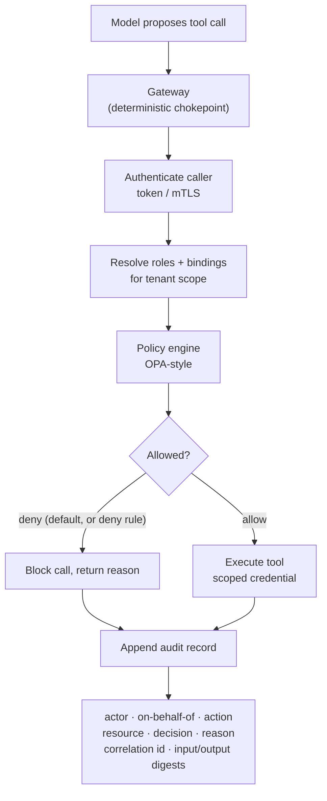

# RBAC, Policy Enforcement, and Audit Logging

> **Interview answer (say this first).** RBAC gives every caller a set of roles, and role bindings grant permissions for a scope such as a tenant. A policy engine — OPA-style — evaluates each request and returns allow or deny, with deny always overriding allow and a default of deny. You enforce at the deterministic gateway between the model and the tools, never in the prompt, because the model is untrusted and prompt text is not a control. Distinguish the service identity (the workload) from the user identity (on whose behalf it acts), and authorise both. Every decision is written to an append-only audit log with actor, on-behalf-of, action, resource, decision, reason, correlation id, and a digest of the inputs and outputs — never the secrets themselves. The log is tamper-evident and retained for a defined period.

## Why this exists

An agent runs as some identity and calls tools. If that identity has broad permissions, a single prompt injection becomes a full compromise. If decisions are made by asking the model "are you allowed to do this?", the attacker simply tells it yes.

Three failures make this concrete:

1. **The model is the wrong place to decide.** Prompt text is data. A jailbreak or an indirect injection can rewrite it. Authorization must live in code the model cannot edit.
2. **Identity is vague.** Requests arrive from a shared service key with no user context, so you cannot tell who acted or limit per-tenant reach. Or a user token is trusted for a service action it should never authorise.
3. **Nothing is recorded.** After an incident, nobody can answer "who ran this, with what inputs, and was it allowed?" Logs show HTTP 200 and nothing else.

RBAC and policy enforcement fix the first two. Audit logging fixes the third, and it is also the evidence you need for compliance and incident response. The three only work together: policy without logs is blind, and logs without policy record bad decisions faithfully.

> **Note:**
>
> **The one-sentence purpose.** Decide every action in deterministic code at the gateway, deny by default with deny overriding allow, and write an append-only record of what was asked, what was decided, by which identity, and with which inputs.

## Start from zero

| Word | Plain meaning |
| --- | --- |
| **Subject** | The identity making a request: a user, a service, or a group. |
| **Identity** | A verified principal, usually from a signed token or mTLS certificate. |
| **Role** | A named bundle of permissions, such as `analyst` or `admin`. |
| **Permission** | One allowed action on a resource, such as `doc:read`. |
| **Binding** | The link that gives a subject a role in a scope: `ana → analyst @ tenant:acme`. |
| **Scope** | The boundary a grant applies to, usually a tenant, project, or environment. |
| **RBAC** | Role-Based Access Control: permissions come from roles, not from individuals. |
| **ABAC** | Attribute-Based Access Control: decisions also use attributes like time or label. |
| **Policy engine** | A service that evaluates rules over a request and returns a decision. |
| **OPA** | Open Policy Agent; a policy engine that evaluates Rego policies. |
| **Rego** | OPA's declarative policy language. |
| **Decision** | The engine's output: allow or deny, usually with a reason. |
| **Deny-overrides** | If any rule denies, the result is deny, even if another rule allows. |
| **Default-deny** | With no matching allow, the result is deny. |
| **Gateway** | The single chokepoint where all model and tool calls are authorised. |
| **Service identity** | The workload's own identity, such as `service:indexer`. |
| **On-behalf-of (OBO)** | The user identity a service is acting for: `service:gw on-behalf-of user:ana`. |
| **Correlation id** | A unique id that ties every log line of one request together. |
| **Audit log** | Append-only record of security-relevant decisions and actions. |
| **Tamper-evident** | Altering a record is detectable, usually via a hash chain or signature. |
| **Retention** | How long records are kept, and how they are deleted. |
| **PII** | Personal data; anything that identifies a person. |
| **Least privilege** | Grant the smallest set of permissions that lets the work succeed. |

Two distinctions carry the topic.

**Authentication vs authorization.** Authentication proves who the caller is. Authorization decides whether that identity may do this action on this resource. A valid token with the wrong role must still be denied.

**The service vs the user.** A workload has its own identity, but it often acts for a user. Record both and check both. A service that may read model output is not automatically allowed to read every tenant's data on behalf of any user.

## The core idea

Think of a **building with badge readers on every door**. Your badge lists which doors you may open. A central system decides access per door per person, and every swipe is written to a log. A person with no matching entry is refused, and one denial cannot be overridden by a different rule that says yes.

The policy engine is that central system. The gateway is each door. The audit log is the swipe history.



The critical rule is **deny-overrides with default-deny**. New actions are denied until a policy explicitly allows them, and no allow can punch through a deny. That makes the safe state the default.

| Enforce where | Can the model influence it? | Verdict |
| --- | --- | --- |
| System prompt: "only do X" | Yes, via injection or jailbreak | Never a control |
| Tool description or schema | Yes, the model reads it | Not a control |
| Agent code that calls the model | Partly, if it trusts model output | Weak alone |
| Gateway / policy engine | No, deterministic code | The control |

## How it works

1. **Authenticate the caller.** Verify a signed token, mTLS certificate, or key using the identity system. Extract the subject, tenant, roles, and, if present, the on-behalf-of user.
2. **Resolve effective permissions.** Look up role bindings for the subject in the request's scope. A binding outside the tenant scope grants nothing.
3. **Build a policy input.** Package subject, roles, tenant, action, resource, and relevant attributes (time, data label, IP) into one document.
4. **Evaluate in the policy engine.** The engine returns allow or deny with a reason. Deny rules win; with no matching allow, the answer is deny.
5. **Check both identities.** For delegated calls, verify the service is allowed to act for this user and that the user is allowed to ask for this action. Neither check alone is enough.
6. **Enforce at the gateway.** The model's tool call is checked before execution. The gateway does not take the model's word for what it is allowed to do.
7. **Execute with a scoped credential.** After an allow, use a credential limited to that action and tenant, ideally short-lived. Do not hand the agent a broad key.
8. **Emit an audit record for every decision.** Write actor, on-behalf-of, tenant, action, resource, decision, reason, correlation id, and input/output digests. Include denials.
9. **Redact before writing.** Never log secrets, raw tokens, full prompts, or unnecessary PII. Log ids and digests instead.
10. **Protect the log.** Append-only storage, restricted write access, and a hash chain or signature so edits are detectable.
11. **Set retention and deletion.** Keep records long enough for incident response and compliance, then delete or archive on a schedule that respects privacy rules.
12. **Review and alert.** A policy is only real if something reads it. Alert on deny spikes, first-time actions, and break-glass use.

> **Warning:**
>
> **Never enforce policy in the prompt.** "You must not delete records" is a suggestion the model may follow and an attacker may override. The only reliable enforcement is code between the model and the tool that runs every time.

## The syntax you will use

**Roles, permissions, and bindings.** A binding is the join between a subject, a role, and a scope.

```python
ROLE_PERMISSIONS = {
    "viewer":  {"doc:read"},
    "analyst": {"doc:read", "model:invoke"},
    "admin":   {"doc:read", "doc:write", "model:invoke", "key:rotate"},
}

BINDINGS = [
    {"subject": "user:ana",       "role": "analyst", "scope": "tenant:acme"},
    {"subject": "group:support",  "role": "viewer",  "scope": "tenant:acme"},
]

def permissions_for(subject: str, tenant: str) -> set:
    perms = set()
    for b in BINDINGS:
        if b["subject"] == subject and b["scope"] == f"tenant:{tenant}":
            perms |= ROLE_PERMISSIONS[b["role"]]
    return perms
```

**Deny-overrides with default-deny.** This is the decision function in one place.

```python
DENY = {("user:ana", "model:invoke")}   # explicit denials, always checked first

def decide(subject: str, action: str, tenant: str, perms: set) -> str:
    if (subject, action) in DENY:
        return "deny"
    if action in perms:
        return "allow"
    return "deny"        # no matching allow -> deny
```

**An OPA-style policy in Rego (OPA 1.x).** The same logic, expressed as data the engine evaluates.

```rego
package authz

default allow := false

allow if {
    some role in input.subject.roles
    input.action in role_permissions[role]
    input.resource.tenant == input.subject.tenant
    not denied
}

# Any deny rule blocks the request, even if another rule allows it.
denied if {
    input.action in input.subject.denied_actions
}

role_permissions := {
    "viewer":  {"doc:read"},
    "analyst": {"doc:read", "model:invoke"},
    "admin":   {"doc:read", "doc:write", "model:invoke", "key:rotate"},
}
```

**Call the engine over HTTP.** OPA exposes `POST /v1/data/<package>/<rule>` and returns the rule's value.

```python
import requests

def opa_allow(inp: dict) -> bool:
    r = requests.post("http://opa.internal:8181/v1/data/authz/allow",
                      json={"input": inp}, timeout=1)
    r.raise_for_status()
    return bool(r.json()["result"])
```

**Service identity acting for a user.** Record both; check both.

```python
def effective_actor(service_id: str, user_id: str | None) -> dict:
    return {"service": service_id, "on_behalf_of": user_id,
            "subject": f"{service_id} on-behalf-of {user_id}" if user_id else service_id}
```

**An append-only audit record with a hash chain.** Each entry commits to the previous one, so a silent edit breaks the chain.

```python
import hashlib, json

GENESIS = "0" * 64

def _digest(obj) -> str:
    return hashlib.sha256(
        json.dumps(obj, sort_keys=True, separators=(",", ":")).encode()
    ).hexdigest()

def audit_entry(seq, actor, action, decision, resource, correlation_id,
                inputs, prev_hash, timestamp, tenant, on_behalf_of=None,
                reason=None, outputs=None):
    body = {
        "seq": seq, "timestamp": timestamp, "actor": actor,
        "on_behalf_of": on_behalf_of, "tenant": tenant, "action": action,
        "decision": decision, "resource": resource, "reason": reason,
        "correlation_id": correlation_id,
        "inputs_sha256": _digest(inputs), "outputs_sha256": _digest(outputs),
        "prev_hash": prev_hash,
    }
    body["entry_hash"] = _digest(body)
    return body

def verify_chain(entries: list) -> bool:
    prev = GENESIS
    for e in entries:
        body = {k: v for k, v in e.items() if k != "entry_hash"}
        if body["prev_hash"] != prev or _digest(body) != e["entry_hash"]:
            return False
        prev = e["entry_hash"]
    return True
```

**Redact at the audit boundary.** A deny list of field names is simple, but it must recurse: secrets hide in nested objects and lists, not just at the top level.

```python
SENSITIVE = {"authorization", "api_key", "password", "token",
             "raw_prompt", "raw_completion"}

def redact(record):
    if isinstance(record, dict):
        return {k: ("***" if isinstance(k, str) and k.lower() in SENSITIVE
                    else redact(v))
                for k, v in record.items()}
    if isinstance(record, list):
        return [redact(v) for v in record]
    return record
```

A flat deny list only catches the names it lists: a secret under an unlisted key, or one embedded inside a free-text value, still gets logged. Match on shape as well as name, and treat the list as a floor, not a guarantee.

**Enforce at the gateway.** The check wraps every tool call, so no code path skips it.

```python
def call_tool(actor, tenant, tool, args, perms, tool_fn):
    if decide(actor["subject"], tool, tenant, perms) != "allow":
        raise PermissionError(f"denied {tool} for {actor['subject']}")
    return tool_fn(**args)
```

## Examples: simple to real

**Example 1 — roles grant permissions, and scope limits them.** The same user has access in one tenant and none in another.

```python
print("analyst in acme:", sorted(permissions_for("user:ana", "acme")))
print("analyst in other:", sorted(permissions_for("user:ana", "other")))
```

Illustrative output:

```text
analyst in acme: ['doc:read', 'model:invoke']
analyst in other: []
```

Bindings are scoped. A role without a binding in the tenant grants nothing.

**Example 2 — deny overrides an allow, and unknown actions default to deny.** The denied action is one ana is otherwise allowed, so the rule visibly flips allow to deny.

```python
perms = permissions_for("user:ana", "acme")
print("model:invoke in perms:", "model:invoke" in perms)
print("model:invoke decision:", decide("user:ana", "model:invoke", "acme", perms))
print("doc:delete decision :", decide("user:ana", "doc:delete", "acme", perms))
print("unknown act decision:", decide("user:ana", "unknown:action", "acme", perms))
```

Illustrative output:

```text
model:invoke in perms: True
model:invoke decision: deny
doc:delete decision : deny
unknown act decision: deny
```

`model:invoke` is in ana's permission set, so the allow rule would grant it; the explicit DENY entry overrides that and returns deny. `doc:delete` and `unknown:action` are denied by default because no allow matches.

**Example 3 — enforce at the gateway, not the prompt.** The same call is refused before the tool runs.

```python
try:
    call_tool({"subject": "user:ana"}, "acme", "key:rotate", {},
              permissions_for("user:ana", "acme"), lambda **k: "rotated")
except PermissionError as exc:
    print("blocked:", exc)
```

Illustrative output:

```text
blocked: denied key:rotate for user:ana
```

The model can ask for anything. The gateway decides what runs.

**Example 4 — track service and user identity together.**

```python
print(effective_actor("service:agent-gw", "user:ana"))
print(effective_actor("service:indexer", None))
```

Illustrative output:

```text
{'service': 'service:agent-gw', 'on_behalf_of': 'user:ana', 'subject': 'service:agent-gw on-behalf-of user:ana'}
{'service': 'service:indexer', 'on_behalf_of': None, 'subject': 'service:indexer'}
```

Both identities appear in the audit log, so you can answer "which service did this, and for whom?"

**Example 5 — the audit chain detects tampering.**

```python
log, prev = [], GENESIS
for seq, action, d in [(1, "doc:read", "allow"),
                       (2, "model:invoke", "allow"),
                       (3, "key:rotate", "deny")]:
    e = audit_entry(seq, "user:ana", action, d, "doc:42", "corr-77",
                    {"a": action}, prev,
                    timestamp=f"2026-01-01T00:00:0{seq}+00:00", tenant="acme",
                    on_behalf_of="user:ana", reason=None,
                    outputs={"a": action, "allowed": d == "allow"})
    log.append(e)
    prev = e["entry_hash"]

print("clean chain:", verify_chain(log))
log[1]["actor"] = "user:mallory"      # rewrite history
print("after edit :", verify_chain(log))
```

Illustrative output:

```text
clean chain: True
after edit : False
```

This is tamper-*evident*, not tamper-*proof*. Anyone can recompute the chain, so a single edit is visible — but an attacker who can rewrite the whole chain, including the tail (the newest entries) and the head hash, produces a new chain that still verifies. The only thing that closes that gap is anchoring the head somewhere they cannot reach, such as an external timestamp or a separate store.

**Example 6 — never log secrets, including nested ones.**

```python
print(redact({"authorization": "Bearer sk-live-abc",
              "model": "gpt-4o-mini",
              "request": {"headers": {"authorization": "Bearer sk-live-abc"}},
              "raw_prompt": "user SSN 123-45-6789"}))
```

Illustrative output:

```text
{'authorization': '***', 'model': 'gpt-4o-mini', 'request': {'headers': {'authorization': '***'}}, 'raw_prompt': '***'}
```

The model name is safe to log; the credential and the raw prompt are not, whether they sit at the top level or under a nested `request.headers`.

## In production

- **Enforce at the gateway, not in the prompt.** The model is untrusted, so authorization must be deterministic code on the only path to the tools. Anything the model can rewrite is not a control.
- **Default-deny and deny-overrides.** New actions are denied until a policy explicitly allows them, and no allow can bypass a deny. This makes the safe state the default and new tools fail closed.
- **Scope roles to tenants and environments.** A binding outside the scope grants nothing, so a compromised dev identity cannot reach production data.
- **Check service and user identity separately.** A service may be allowed to call a tool but not on behalf of an arbitrary user. Verify both, and record both.
- **Use short-lived, scoped credentials at execution.** The gateway should issue or assume a credential limited to the action and tenant. A broad ambient credential undoes the policy decision.
- **Log every decision, including denials.** Deny spikes are an attack signal. Logging only successes hides the reconnaissance.
- **Correlate with one id.** Thread a correlation id through model call, gateway, tools, and audit so one request reconstructs end to end.
- **Log digests, not raw payloads.** Store a hash of inputs and outputs for integrity, and keep raw sensitive content out of the log. PII in logs is a breach waiting to be read.
- **Make the log tamper-evident.** Append-only storage plus a hash chain or signatures. If you cannot detect an edit, the log is not evidence.
- **Set retention explicitly.** Too short and you cannot investigate; too long and you accumulate personal data you must protect. Document both the period and the deletion path.
- **Feed policy as data, not code changes.** Keep policies reviewable and testable, versioned alongside the app, with tests for the deny cases. An untested deny rule is a guess.
- **Watch for policy drift.** Cache decisions only briefly, and re-check when roles change. A long-lived token can outlive the permission it was granted for.

## Interview questions

### 1. What is RBAC, and where does it break down for agents?

**Answer.** RBAC assigns permissions through roles, and bindings attach a role to a subject in a scope. It is easy to reason about and audit. It breaks down for agents because an agent may act for a user, so you need delegation and attribute checks, and because the set of tools changes quickly. That is where ABAC and a policy engine take over, adding attributes like tenant, data label, and time.

**Follow-up: "Why not assign permissions directly to the agent?"** Direct grants do not scale and hide intent. Roles keep the mapping reviewable, and bindings keep the blast radius scoped.

**Trap.** Giving the agent an `admin` role for convenience. That collapses every downstream control into one credential.

### 2. What does "deny-overrides" mean, and why default-deny?

**Answer.** Deny-overrides means if any rule denies, the result is deny even when another rule allows. Default-deny means no matching allow produces deny. Together they make the safe state the default: a new action, a new tool, or a typo in a policy fails closed instead of opening everything.

**Follow-up: "How do you express it in OPA?"** The `allow` rule requires `not denied`, and `default allow := false` sets the fallback. Reviews focus on the deny rules because they are the safety net.

**Trap.** Writing only allow rules and assuming everything else is denied without checking the default. An accidental `default allow := true` inverts the whole model.

### 3. Where do you enforce policy, and why not in the prompt?

**Answer.** At the deterministic gateway between the model and the tools, on every call. The prompt is data the model reads and an attacker can influence, so it cannot be a security control. The gateway can be tested, versioned, and audited; the prompt cannot be trusted to hold a rule.

**Follow-up: "Does that mean prompts have no security value?"** They reduce accidental misuse and shape behaviour, but they are not enforcement. Treat them as defence in depth, never as the boundary.

**Trap.** Relying on a system prompt to forbid dangerous tools while the tools remain callable. The tool call is the thing you must gate.

### 4. Service identity vs user identity — why track both?

**Answer.** The service identity says which workload made the call, and the user identity says on whose behalf. Checking only the service means it can reach any tenant; checking only the user means the workload's own reach is invisible. You authorise both and record both, so the audit log answers "which service, for which user."

**Follow-up: "How is delegation represented?"** As an on-behalf-of claim in a signed token that the gateway verifies, not as a plain text field the model can set.

**Trap.** Trusting a user id passed in the request body. That is attacker-controlled input, not identity.

### 5. What must an audit record contain?

**Answer.** A timestamp, the actor and any on-behalf-of user, the tenant, the action and resource, the decision and its reason, a correlation id, and a digest of the inputs and outputs. For approvals, add the approver and payload digest. It should be enough to reconstruct who did what, when, and why — without storing secrets.

**Follow-up: "Why digests as well as the event?"** A digest lets a verifier check the exact inputs and outputs later without keeping the raw content in the log.

**Trap.** Logging `decision=allow` with no actor or resource. It proves nothing and cannot support an investigation.

### 6. How do you make an audit log tamper-evident?

**Answer.** Append-only storage with write access restricted to the writer, plus a hash chain or signature per entry. Each entry commits to the previous one, so any change breaks the chain. For stronger assurance, anchor the head externally — a timestamping service, a separate account, or offline storage — or sign entries with a key the application cannot rewrite.

**Follow-up: "Is a hash chain enough?"** It is tamper-evident, not tamper-proof. If the attacker can rewrite every entry and the head, the chain still verifies. The external anchor is what closes that gap.

**Trap.** Storing the log in the same mutable database with the same credentials as the application. Compromise of the app then includes compromise of its own evidence.

### 7. What must never be logged?

**Answer.** Secrets and credentials, raw authentication tokens, full private keys, and unnecessary personal data. Avoid raw prompts and completions when they may contain PII or customer content. Log identifiers, digests, and classifications instead. Apply redaction at the logging boundary so no call site has to remember.

**Follow-up: "What if you need the raw prompt for debugging?"** Keep it in a restricted, short-retention store with its own access control, or store a redacted or hashed version. Debugging convenience is not a reason to put PII in the general log.

**Trap.** Assuming the framework redacts. Most do not unless configured and tested, and tracing tools often capture request bodies by default.

### 8. How do you keep policies correct over time?

**Answer.** Treat policy as code: version it, review it, and test it, including tests that assert denials. Run them in CI. Keep the role and permission model documented, review bindings regularly, and remove unused grants. Alert on deny spikes and first-time actions so drift is visible.

**Follow-up: "How do you handle emergency access?"** A break-glass role that is time-boxed, requires a reason, and triggers a review. It should be loud and logged, not a permanent broad grant.

**Trap.** Leaving a temporary grant in place after the incident. Temporary access becomes permanent unless something expires and reports it.

## Remember this

- **Enforce at the gateway, not the prompt.** The model is untrusted, so only deterministic code is a control.
- **Deny-overrides, default-deny.** New actions fail closed, and no allow punches through a deny.
- **Authorise service and user identity separately**, and scope every binding to a tenant.
- **Audit every decision, including denials**, with actor, on-behalf-of, action, decision, correlation id, and input/output digests.
- **Redact before writing and make the log tamper-evident** with a hash chain or signature and an external anchor.
